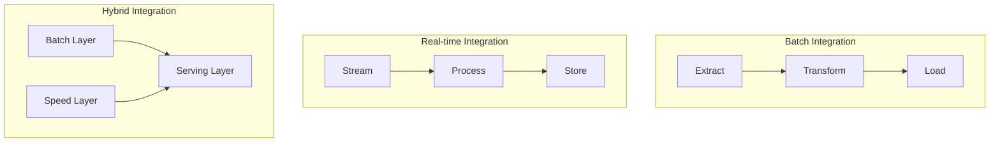

# Data Integration

## Introduction to Data Integration 🔄

### Integration Patterns Diagram


### Real-time vs Batch Processing Comparison
```
+------------------+------------------------+------------------------+
| Characteristic   | Real-time Processing   | Batch Processing      |
+------------------+------------------------+------------------------+
| Latency         | Seconds or less        | Minutes to hours      |
| Data Volume     | Small chunks           | Large volumes         |
| Resource Usage  | Continuous             | Periodic spikes       |
| Complexity      | Higher                 | Lower                 |
| Cost            | Higher                 | Lower                 |
| Use Cases       | Fraud detection        | Daily reports         |
|                 | Real-time alerts       | Data warehousing      |
|                 | Live dashboards        | Complex analytics     |
+------------------+------------------------+------------------------+
```

### Data Quality Monitoring (Tableau Dashboard)
```
[Tableau Dashboard Layout]
+------------------------+------------------------+
|    Quality Metrics     |    Integration Status  |
+------------------------+------------------------+
| - Completeness         | - Success Rate        |
| - Accuracy            | - Error Rate          |
| - Consistency         | - Processing Time     |
| - Timeliness         | - Resource Usage      |
+------------------------+------------------------+
|        Data Quality Trends                     |
+-----------------------------------------------+
| - Quality Score Over Time                      |
| - Error Types Distribution                     |
| - Data Volume Trends                          |
| - Processing Time Trends                       |
+-----------------------------------------------+
|        Integration Performance                 |
+-----------------------------------------------+
| - Throughput                                  |
| - Latency                                     |
| - Resource Utilization                        |
| - Cost Metrics                                |
+-----------------------------------------------+
```

### Core Functions
- **Data Consolidation**:
  * Merging data from multiple sources
  * Resolving format differences
  * Handling schema variations
  * Maintaining data relationships

### Key Challenges
- **Data Quality**:
  * Inconsistent formats
  * Missing values
  * Duplicate records
  * Conflicting information

### Business Impact
- **Decision Making**:
  * 360-degree view of business
  * Real-time insights
  * Historical analysis
  * Predictive modeling

### Technical Considerations
- **Performance**:
  * Processing efficiency
  * Resource utilization
  * Scalability requirements
  * Response time targets

### Implementation Approaches
- **Batch Processing**:
  * Scheduled data loads
  * Bulk transformations
  * Historical data processing
  * Resource optimization

- **Real-time Processing**:
  * Stream processing
  * Event-driven integration
  * Immediate updates
  * Low-latency requirements

### Quality Assurance
- **Data Validation**:
  * Schema validation
  * Business rule checking
  * Referential integrity
  * Format standardization

### Monitoring and Maintenance
- **System Health**:
  * Performance metrics
  * Error tracking
  * Resource monitoring
  * SLA compliance

## Data Source Integration 🔌

### 1. API Integration

```python
import requests
import pandas as pd
from typing import Dict, Any
from datetime import datetime

class APIIntegrator:
    """
    Handle API data integration
    """
    def __init__(self, base_url: str, auth_token: str = None):
        self.base_url = base_url.rstrip('/')
        self.session = requests.Session()
        if auth_token:
            self.session.headers.update({
                'Authorization': f'Bearer {auth_token}'
            })
    
    def fetch_data(self, endpoint: str, params: Dict[str, Any] = None) -> pd.DataFrame:
        """Fetch data from API endpoint"""
        try:
            url = f"{self.base_url}/{endpoint.lstrip('/')}"
            response = self.session.get(url, params=params)
            response.raise_for_status()
            
            # Convert response to DataFrame
            data = response.json()
            if isinstance(data, list):
                return pd.DataFrame(data)
            elif isinstance(data, dict):
                if 'data' in data:  # Common API pattern
                    return pd.DataFrame(data['data'])
                else:
                    return pd.DataFrame([data])
            
            raise ValueError("Unexpected API response format")
            
        except requests.exceptions.RequestException as e:
            raise Exception(f"API request failed: {str(e)}")
```

### 2. File Integration

File integration is a fundamental aspect of data engineering, dealing with various file formats and storage systems. Here's what you need to consider:

#### Supported Formats
- **Structured**:
  * CSV (Comma Separated Values)
  * Excel (XLSX/XLS)
  * JSON (JavaScript Object Notation)
  * Parquet (Columnar Storage)

#### Performance Considerations
- **File Size**:
  * Chunked reading
  * Memory management
  * Parallel processing
  * Compression handling

#### Data Quality
- **Format Validation**:
  * Schema checking
  * Data type verification
  * Encoding handling
  * Header validation

#### Best Practices
- **Error Handling**:
  * File not found
  * Permission issues
  * Corrupt files
  * Format mismatches

Here's a robust implementation:

```python
class FileIntegrator:
    """
    Handle file data integration
    """
    def __init__(self, base_path: str):
        self.base_path = base_path
    
    def read_file(self, file_path: str) -> pd.DataFrame:
        """Read data from various file formats"""
        file_path = f"{self.base_path}/{file_path}"
        
        if file_path.endswith('.csv'):
            return pd.read_csv(file_path)
        elif file_path.endswith('.xlsx'):
            return pd.read_excel(file_path)
        elif file_path.endswith('.json'):
            return pd.read_json(file_path)
        elif file_path.endswith('.parquet'):
            return pd.read_parquet(file_path)
        else:
            raise ValueError(f"Unsupported file format: {file_path}")
    
    def write_file(self, df: pd.DataFrame, file_path: str):
        """Write data to file"""
        file_path = f"{self.base_path}/{file_path}"
        
        if file_path.endswith('.csv'):
            df.to_csv(file_path, index=False)
        elif file_path.endswith('.xlsx'):
            df.to_excel(file_path, index=False)
        elif file_path.endswith('.json'):
            df.to_json(file_path, orient='records')
        elif file_path.endswith('.parquet'):
            df.to_parquet(file_path, index=False)
        else:
            raise ValueError(f"Unsupported file format: {file_path}")
```

### 3. Database Integration

```python
from sqlalchemy import create_engine, text
from typing import List

class DatabaseIntegrator:
    """
    Handle database data integration
    """
    def __init__(self, connection_string: str):
        self.engine = create_engine(connection_string)
    
    def read_query(self, query: str) -> pd.DataFrame:
        """Read data using SQL query"""
        return pd.read_sql(query, self.engine)
    
    def write_table(self, df: pd.DataFrame, table_name: str, if_exists: str = 'append'):
        """Write DataFrame to database table"""
        df.to_sql(table_name, self.engine, if_exists=if_exists, index=False)
    
    def execute_query(self, query: str):
        """Execute SQL query"""
        with self.engine.connect() as conn:
            conn.execute(text(query))
```

## Data Transformation 🔄

Data transformation is a critical phase in data integration that involves converting data from source formats to target formats while ensuring data quality and consistency.

### Key Transformation Types
- **Structure Transformations**:
  * Schema mapping
  * Data type conversions
  * Denormalization/Normalization
  * Aggregations

- **Content Transformations**:
  * Data cleansing
  * Value standardization
  * Unit conversions
  * Encoding changes

- **Semantic Transformations**:
  * Business rule application
  * Derived calculations
  * Lookup operations
  * Data enrichment

### 1. Schema Mapping

Schema mapping is the process of creating relationships between source and target data models. Key considerations include:

#### Mapping Types
- **One-to-One**:
  * Direct field mappings
  * Name standardization
  * Type alignment
  * Format consistency

- **One-to-Many**:
  * Data splitting
  * Array expansion
  * Nested structure handling
  * Relationship preservation

- **Many-to-One**:
  * Data aggregation
  * Field combination
  * Value concatenation
  * Logic application

#### Best Practices
- **Documentation**:
  * Mapping documentation
  * Transformation rules
  * Business logic
  * Data lineage

Here's a comprehensive implementation:

```python
from typing import Dict, List

class SchemaMapper:
    """
    Handle schema mapping between different data sources
    """
    def __init__(self, mapping: Dict[str, str]):
        self.mapping = mapping
    
    def apply_mapping(self, df: pd.DataFrame) -> pd.DataFrame:
        """Apply column mapping to DataFrame"""
        # Rename columns according to mapping
        df = df.rename(columns=self.mapping)
        
        # Only keep mapped columns
        return df[list(self.mapping.values())]
    
    def reverse_mapping(self, df: pd.DataFrame) -> pd.DataFrame:
        """Apply reverse mapping to DataFrame"""
        reverse_map = {v: k for k, v in self.mapping.items()}
        return df.rename(columns=reverse_map)
```

### 2. Data Type Conversion

```python
class DataTypeConverter:
    """
    Handle data type conversions
    """
    @staticmethod
    def convert_types(df: pd.DataFrame, type_mapping: Dict[str, str]) -> pd.DataFrame:
        """Convert column data types"""
        df = df.copy()
        
        for column, dtype in type_mapping.items():
            if column in df.columns:
                try:
                    if dtype == 'datetime':
                        df[column] = pd.to_datetime(df[column])
                    else:
                        df[column] = df[column].astype(dtype)
                except Exception as e:
                    raise ValueError(f"Failed to convert {column} to {dtype}: {str(e)}")
        
        return df
```

### 3. Data Validation

```python
from typing import Callable, Dict

class DataValidator:
    """
    Handle data validation during integration
    """
    def __init__(self):
        self.validation_rules: Dict[str, List[Callable]] = {}
    
    def add_rule(self, column: str, rule: Callable):
        """Add validation rule for column"""
        if column not in self.validation_rules:
            self.validation_rules[column] = []
        self.validation_rules[column].append(rule)
    
    def validate(self, df: pd.DataFrame) -> bool:
        """Validate DataFrame against rules"""
        validation_results = []
        
        for column, rules in self.validation_rules.items():
            if column not in df.columns:
                raise ValueError(f"Column not found: {column}")
            
            for rule in rules:
                validation_results.append(df[column].apply(rule))
        
        # Check if all validations passed
        return all(result.all() for result in validation_results)
```

## Data Integration Pipeline 🔄

```python
class DataIntegrationPipeline:
    """
    Orchestrate data integration process
    """
    def __init__(self):
        self.steps = []
    
    def add_step(self, name: str, func: Callable, **kwargs):
        """Add processing step to pipeline"""
        self.steps.append({
            'name': name,
            'func': func,
            'kwargs': kwargs
        })
    
    def run(self, data: pd.DataFrame) -> pd.DataFrame:
        """Run integration pipeline"""
        result = data.copy()
        
        for step in self.steps:
            try:
                result = step['func'](result, **step['kwargs'])
                print(f"Step '{step['name']}' completed successfully")
            except Exception as e:
                raise Exception(f"Step '{step['name']}' failed: {str(e)}")
        
        return result
```

## Integration Patterns 📋

### 1. Extract and Load

```python
def extract_and_load(source_integrator, target_integrator, 
                    source_params: Dict, target_params: Dict):
    """
    Simple extract and load pattern
    """
    # Extract data
    data = source_integrator.fetch_data(**source_params)
    
    # Load data
    target_integrator.write_data(data, **target_params)
    
    return data
```

### 2. Transform and Load

```python
def transform_and_load(data: pd.DataFrame, transformations: List[Callable],
                      target_integrator, target_params: Dict):
    """
    Transform and load pattern
    """
    # Apply transformations
    for transform in transformations:
        data = transform(data)
    
    # Load data
    target_integrator.write_data(data, **target_params)
    
    return data
```

### 3. Incremental Load

```python
def incremental_load(source_integrator, target_integrator,
                    key_column: str, last_value: Any,
                    source_params: Dict, target_params: Dict):
    """
    Incremental load pattern
    """
    # Modify source params to include incremental filter
    source_params['filter'] = {key_column: {'gt': last_value}}
    
    # Extract incremental data
    data = source_integrator.fetch_data(**source_params)
    
    if not data.empty:
        # Load incremental data
        target_integrator.write_data(data, **target_params)
        
        # Update last value
        last_value = data[key_column].max()
    
    return data, last_value
```

## Best Practices 💡

1. **Data Quality**
   - Validate data before integration
   - Handle errors gracefully
   - Log validation failures
   - Monitor data quality

2. **Performance**
   - Use batch processing
   - Implement incremental loads
   - Optimize transformations
   - Monitor resource usage

3. **Error Handling**
   - Implement retries
   - Log errors
   - Provide error context
   - Handle partial failures

4. **Documentation**
   - Document data sources
   - Map data lineage
   - Track transformations
   - Maintain metadata

## Practice Exercise 🏋️‍♂️

Build a data integration pipeline that:
1. Extracts data from multiple sources
2. Applies transformations
3. Validates data quality
4. Loads data to target system
5. Handles errors appropriately

## Solution Template 💡

```python
# Configuration
config = {
    'source_api': {
        'base_url': 'https://api.example.com',
        'auth_token': 'your_token'
    },
    'target_db': {
        'connection_string': 'postgresql://localhost/db'
    },
    'schema_mapping': {
        'id': 'customer_id',
        'name': 'customer_name',
        'value': 'purchase_amount'
    },
    'type_mapping': {
        'customer_id': 'int64',
        'purchase_amount': 'float64',
        'purchase_date': 'datetime'
    }
}

# Initialize components
api_integrator = APIIntegrator(
    config['source_api']['base_url'],
    config['source_api']['auth_token']
)

db_integrator = DatabaseIntegrator(
    config['target_db']['connection_string']
)

schema_mapper = SchemaMapper(config['schema_mapping'])
type_converter = DataTypeConverter()
validator = DataValidator()

# Setup validation rules
validator.add_rule('customer_id', lambda x: x > 0)
validator.add_rule('purchase_amount', lambda x: x >= 0)

# Create pipeline
pipeline = DataIntegrationPipeline()

pipeline.add_step(
    'extract',
    api_integrator.fetch_data,
    endpoint='sales'
)

pipeline.add_step(
    'map_schema',
    schema_mapper.apply_mapping
)

pipeline.add_step(
    'convert_types',
    type_converter.convert_types,
    type_mapping=config['type_mapping']
)

pipeline.add_step(
    'validate',
    validator.validate
)

pipeline.add_step(
    'load',
    db_integrator.write_table,
    table_name='sales'
)

# Run pipeline
try:
    result = pipeline.run(initial_data)
    print("Integration completed successfully")
except Exception as e:
    print(f"Integration failed: {str(e)}")
```

Remember: Effective data integration requires careful planning and robust error handling! 🎯
