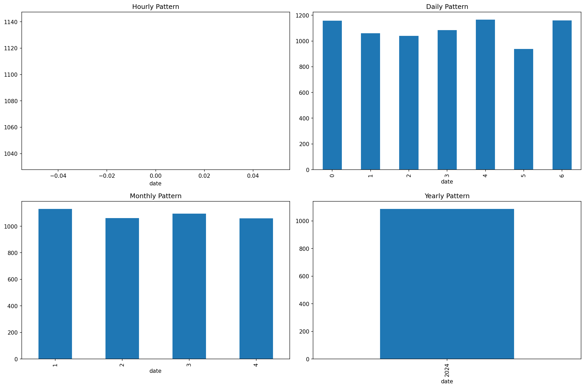
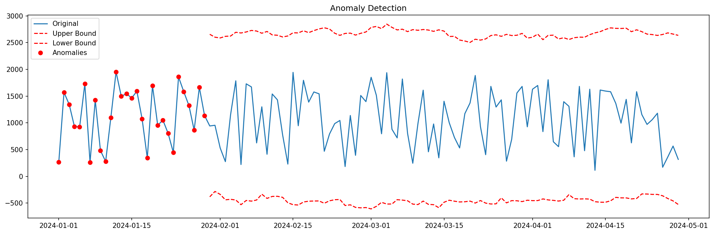
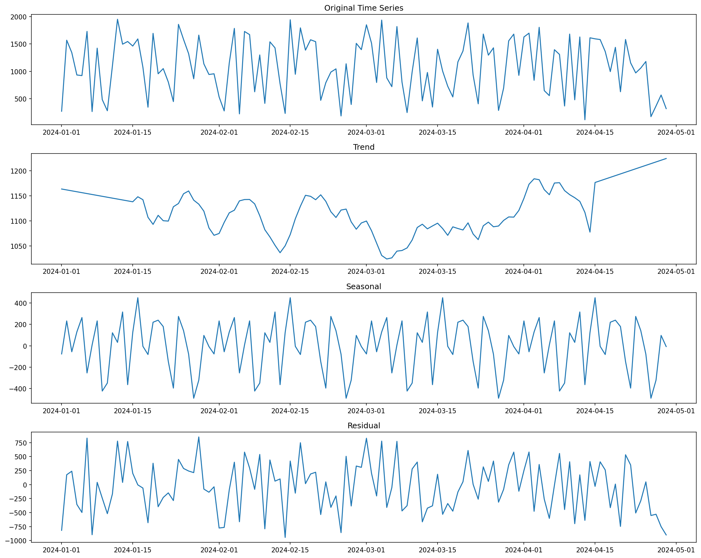
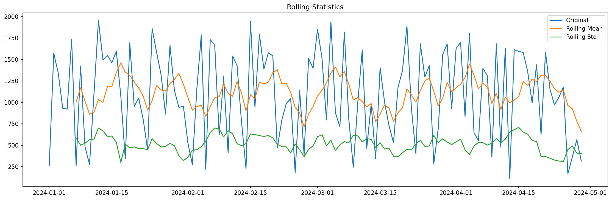

# Data Integration

**After this lesson:** You can compare **batch** and **near-real-time** integration patterns, list common failure modes (schema drift, duplicates, partial loads), and see how monitoring fits the pipeline.

## Helpful video

DAGs, tasks, and scheduling, conceptual background for ETL-style pipelines.

## Overview

**Prerequisites:** [ETL fundamentals](etl-fundamentals.md) and [data storage](data-storage.md). REST and file-based patterns make more sense after [SQL](../2.1-sql/).

> **Time needed:** About 60 minutes.

## Why this matters

Most pipeline incidents are integration problems: **schema drift**, **duplicate keys**, **partial loads**, or **clock skew** between systems. Understanding batch vs near-real-time patterns, and where they break, helps you design **idempotent** loads, **monitoring**, and **replay** strategies, not only happy-path extracts.

## Introduction to Data Integration

### Integration Patterns Diagram

### Real-time vs Batch Processing Comparison

```
+------------------+------------------------+------------------------+
| Characteristic   | Real-time Processing   | Batch Processing      |
+------------------+------------------------+------------------------+
| Latency         | Seconds or less        | Minutes to hours      |
| Data Volume     | Small chunks           | Large volumes         |
| Resource Usage  | Continuous             | Periodic spikes       |
| Complexity      | Higher                 | Lower                 |
| Cost            | Higher                 | Lower                 |
| Use Cases       | Fraud detection        | Daily reports         |
|                 | Real-time alerts       | Data warehousing      |
|                 | Live dashboards        | Complex analytics     |
+------------------+------------------------+------------------------+
```

### Data Quality Monitoring (Tableau Dashboard)

```
[Tableau Dashboard Layout]
+------------------------+------------------------+
|    Quality Metrics     |    Integration Status  |
+------------------------+------------------------+
| - Completeness         | - Success Rate        |
| - Accuracy            | - Error Rate          |
| - Consistency         | - Processing Time     |
| - Timeliness         | - Resource Usage      |
+------------------------+------------------------+
|        Data Quality Trends                     |
+-----------------------------------------------+
| - Quality Score Over Time                      |
| - Error Types Distribution                     |
| - Data Volume Trends                          |
| - Processing Time Trends                       |
+-----------------------------------------------+
|        Integration Performance                 |
+-----------------------------------------------+
| - Throughput                                  |
| - Latency                                     |
| - Resource Utilization                        |
| - Cost Metrics                                |
+-----------------------------------------------+
```

### Core Functions

* **Data Consolidation**:
  * Merging data from multiple sources
  * Resolving format differences
  * Handling schema variations
  * Maintaining data relationships

### Key Challenges

* **Data Quality**:
  * Inconsistent formats
  * Missing values
  * Duplicate records
  * Conflicting information

### Business Impact

* **Decision Making**:
  * 360-degree view of business
  * Real-time insights
  * Historical analysis
  * Predictive modeling

### Technical Considerations

* **Performance**:
  * Processing efficiency
  * Resource utilization
  * Scalability requirements
  * Response time targets

### Implementation Approaches

* **Batch Processing**:
  * Scheduled data loads
  * Bulk transformations
  * Historical data processing
  * Resource optimization
* **Real-time Processing**:
  * Stream processing
  * Event-driven integration
  * Immediate updates
  * Low-latency requirements

### Quality Assurance

* **Data Validation**:
  * Schema validation
  * Business rule checking
  * Referential integrity
  * Format standardization

### Monitoring and Maintenance

* **System Health**:
  * Performance metrics
  * Error tracking
  * Resource monitoring
  * SLA compliance

## Data Source Integration

### 1. API Integration





Imports and APIIntegrator constructor

Four imports. The constructor stores the base URL (stripped of trailing slash) and creates a persistent `requests.Session`, optionally attaching a Bearer token header for authenticated endpoints.

fetch\_data, HTTP request and error handling

Builds the full URL, issues a GET request with optional query params, and calls `raise_for_status()` to convert 4xx/5xx responses into exceptions immediately.

Response normalisation

Handles three common API shapes: a JSON list (→ DataFrame directly), a dict with a `'data'` key (→ DataFrame from that list), or a single-object dict (→ one-row DataFrame).

### 2. File Integration

File integration is a fundamental aspect of data engineering, dealing with various file formats and storage systems. Here's what you need to consider:

#### Supported Formats

* **Structured**:
  * CSV (Comma Separated Values)
  * Excel (XLSX/XLS)
  * JSON (JavaScript Object Notation)
  * Parquet (Columnar Storage)

#### Performance Considerations

* **File Size**:
  * Chunked reading
  * Memory management
  * Parallel processing
  * Compression handling

#### Data Quality

* **Format Validation**:
  * Schema checking
  * Data type verification
  * Encoding handling
  * Header validation

#### Best Practices

* **Error Handling**:
  * File not found
  * Permission issues
  * Corrupt files
  * Format mismatches

Here's a reliable implementation:

<figure><figcaption><p>Figure 1: Original Time Series</p></figcaption></figure>

<figure><figcaption><p>Figure 2: Hourly Pattern</p></figcaption></figure>

<figure><figcaption><p>Figure 3: Rolling Statistics</p></figcaption></figure>

<figure><figcaption><p>Figure 4: Anomaly Detection</p></figcaption></figure>

Class definition and constructor

Stores a `base_path` prefix that is prepended to every file name, so callers pass relative paths and the class handles the full resolution.

read\_file, format dispatch

Inspects the file extension and dispatches to the correct pandas reader: `read_csv`, `read_excel`, `read_json`, or `read_parquet`. Raises on unknown formats.

write\_file, format dispatch

Mirror of `read_file`: dispatches to `to_csv`, `to_excel`, `to_json(orient='records')`, or `to_parquet` based on extension, all with `index=False`.

### 3. Database Integration

<figure><figcaption><p>Figure 1: Original Time Series</p></figcaption></figure>

<figure><figcaption><p>Figure 2: Hourly Pattern</p></figcaption></figure>

<figure><figcaption><p>Figure 3: Rolling Statistics</p></figcaption></figure>

<figure><figcaption><p>Figure 4: Anomaly Detection</p></figcaption></figure>

Imports and constructor

Creates a SQLAlchemy engine from a connection string, the engine manages connection pooling and dialect translation for different databases.

read\_query, write\_table, and execute\_query

Three thin wrappers: `pd.read_sql` for SELECT queries, `df.to_sql` with an `append` strategy for writes, and a raw execution path for DDL or DML statements.

## Data Transformation

Data transformation is a critical phase in data integration that involves converting data from source formats to target formats while ensuring data quality and consistency.

### Key Transformation Types

* **Structure Transformations**:
  * Schema mapping
  * Data type conversions
  * Denormalization/Normalization
  * Aggregations
* **Content Transformations**:
  * Data cleansing
  * Value standardization
  * Unit conversions
  * Encoding changes
* **Semantic Transformations**:
  * Business rule application
  * Derived calculations
  * Lookup operations
  * Data enrichment

### 1. Schema Mapping

Schema mapping is the process of creating relationships between source and target data models. Key considerations include:

#### Mapping Types

* **One-to-One**:
  * Direct field mappings
  * Name standardization
  * Type alignment
  * Format consistency
* **One-to-Many**:
  * Data splitting
  * Array expansion
  * Nested structure handling
  * Relationship preservation
* **Many-to-One**:
  * Data aggregation
  * Field combination
  * Value concatenation
  * Logic application

#### Best Practices

* **Documentation**:
  * Mapping documentation
  * Transformation rules
  * Business logic
  * Data lineage

Here's a comprehensive implementation:

<figure><figcaption><p>Figure 1: Original Time Series</p></figcaption></figure>

<figure><figcaption><p>Figure 2: Hourly Pattern</p></figcaption></figure>

<figure><figcaption><p>Figure 3: Rolling Statistics</p></figcaption></figure>

<figure><figcaption><p>Figure 4: Anomaly Detection</p></figcaption></figure>

SchemaMapper constructor

Accepts a `mapping` dict of source-name → target-name pairs and stores it for reuse in both the forward and reverse directions.

apply\_mapping and reverse\_mapping

`apply_mapping` renames columns and drops any that are not in the mapping. `reverse_mapping` inverts the dict to rename target columns back to source names.

### 2. Data Type Conversion

<figure><figcaption><p>Figure 1: Original Time Series</p></figcaption></figure>

<figure><figcaption><p>Figure 2: Hourly Pattern</p></figcaption></figure>

<figure><figcaption><p>Figure 3: Rolling Statistics</p></figcaption></figure>

<figure><figcaption><p>Figure 4: Anomaly Detection</p></figcaption></figure>

Class definition and convert\_types signature

A static method that takes a DataFrame and a dict of column→dtype pairs. It copies the DataFrame first to avoid mutating the caller's data.

Per-column type conversion with error handling

For `'datetime'` uses `pd.to_datetime`; otherwise calls `astype`. Any conversion failure raises a descriptive `ValueError` naming the column and target dtype.

### 3. Data Validation

<figure><figcaption><p>Figure 1: Original Time Series</p></figcaption></figure>

<figure><figcaption><p>Figure 2: Hourly Pattern</p></figcaption></figure>

<figure><figcaption><p>Figure 3: Rolling Statistics</p></figcaption></figure>

<figure><figcaption><p>Figure 4: Anomaly Detection</p></figcaption></figure>

Import, class definition, and add\_rule

Imports `Callable` and `Dict` from typing, defines `DataValidator` with a `validation_rules` dict keyed by column name, and `add_rule` which registers a callable rule for a given column.

validate method

`validate` iterates over every registered column and applies each rule via `df[column].apply(rule)`. It raises if a column is missing, then returns `True` only when every result series is all-True.

## Data Integration Pipeline

<figure><figcaption><p>Figure 1: Original Time Series</p></figcaption></figure>

<figure><figcaption><p>Figure 2: Hourly Pattern</p></figcaption></figure>

<figure><figcaption><p>Figure 3: Rolling Statistics</p></figcaption></figure>

<figure><figcaption><p>Figure 4: Anomaly Detection</p></figcaption></figure>

Class definition, constructor, and add\_step

Defines `DataIntegrationPipeline` with a `steps` list. `add_step` appends a dict containing a step name, the callable function, and any extra keyword arguments, building up the pipeline declaratively before execution.

run method with error handling

`run` iterates the steps list, calling each function on the running result DataFrame. On success it prints a confirmation; on failure it re-raises with the step name in the message so you know exactly where the pipeline broke.

## Integration Patterns

### 1. Extract and Load

<figure><figcaption><p>Figure 1: Original Time Series</p></figcaption></figure>

<figure><figcaption><p>Figure 2: Hourly Pattern</p></figcaption></figure>

<figure><figcaption><p>Figure 3: Rolling Statistics</p></figcaption></figure>

<figure><figcaption><p>Figure 4: Anomaly Detection</p></figcaption></figure>

Signature and extract step

Takes source and target integrators plus their parameter dicts. The extract step calls `source_integrator.fetch_data` with the unpacked `source_params` to pull the raw data.

Load step and return

Writes the extracted data to the target system via `target_integrator.write_data` and returns it, allowing the caller to inspect or chain the result.

### 2. Transform and Load

Signature and transformation loop

Accepts a DataFrame, a list of transformation callables, and the target integrator. The loop applies each transform in order-`data = transform(data)`-so transformations chain without needing a pipeline object.

Load step and return

Writes the fully-transformed DataFrame to the target using `target_params`, then returns it so callers can log row counts or run post-load checks.

### 3. Incremental Load

Signature, filter injection, and extract

Accepts a `key_column` and `last_value` cursor. Before fetching, it injects a `gt` (greater-than) filter into `source_params` so only new rows are pulled, then calls `fetch_data` with the modified params.

Conditional load and cursor update

Only writes and advances the cursor when new rows exist (`not data.empty`). `last_value` is updated to `data[key_column].max()` so the next run resumes exactly where this one left off.

## Best Practices

1. **Data Quality**
   * Validate data before integration
   * Handle errors gracefully
   * Log validation failures
   * Monitor data quality
2. **Performance**
   * Use batch processing
   * Implement incremental loads
   * Optimize transformations
   * Monitor resource usage
3. **Error Handling**
   * Implement retries
   * Log errors
   * Provide error context
   * Handle partial failures
4. **Documentation**
   * Document data sources
   * Map data lineage
   * Track transformations
   * Maintain metadata

## Practice Exercise

Build a data integration pipeline that:

1. Extracts data from multiple sources
2. Applies transformations
3. Validates data quality
4. Loads data to target system
5. Handles errors appropriately

## Solution Template

Configuration dict

The `config` dict centralises all integration settings: the source API URL and auth token, the target database connection string, the field-level schema mapping (e.g., `'id' → 'customer_id'`), and per-column dtype targets for type conversion.

Initialise components and validation rules

Instantiates each integration component from the config, then registers two lambda validation rules: customer IDs must be positive and purchase amounts must be non-negative.

Create pipeline and add extract step

Creates a `DataIntegrationPipeline` and registers the first step: call `api_integrator.fetch_data` with `endpoint='sales'` to pull the raw sales records.

Schema mapping, type conversion, and validation steps

Three pipeline steps run in sequence: rename columns to match the warehouse schema, cast each column to the configured dtype, then validate all rows against the registered rules before loading.

Load step

The final pipeline step writes the validated, transformed data to the `sales` table via `db_integrator.write_table`.

Run pipeline with error handling

Executes the full pipeline inside a try/except. Success prints a confirmation; any step failure surfaces the step name in the error message so you know exactly where the integration broke.

## Gotchas

* **`response.raise_for_status()` does not catch pagination silently stopping**: many APIs return HTTP 200 with an empty `data` list once you exceed the last page; if your `fetch_data` method stops when it gets an empty response it may silently return an incomplete dataset with no error raised.
* **Schema mapping renames columns but does not validate that all target fields exist**: if the source API adds or removes a field, `df.rename(columns=mapping)` silently skips unknown keys; downstream column references will raise `KeyError` at load time, not at the rename step where the mismatch occurred.
* **Batch loads with no watermark produce full re-loads on every run**: without recording a high-water mark (e.g., `max(updated_at)` from the last successful run), re-running the pipeline fetches and reloads the entire source table each time, duplicating records or blowing past API rate limits.
* **Type conversion with `astype` raises on `NaN` in integer columns**: `df[col].astype('int64')` throws if the column contains nulls introduced during cleaning; use `pd.Int64Dtype()` (nullable integer) or fill nulls before casting to avoid a hard failure in the type-conversion step.
* **`requests.Session` headers are shared across all requests in the session**: if the auth token expires mid-run and you refresh it on the session object, earlier in-flight requests may still carry the old token; implement token refresh at the request level or rebuild the session after expiry.
* **Validation rules registered as lambdas capture references, not values**: if you build validation rules in a loop (e.g., `for col in cols: rules[col] = lambda x: x > threshold`), all lambdas share the same `threshold` reference and may silently validate against the last loop value; use default argument capture (`lambda x, t=threshold: x > t`) to bind correctly.

Remember: Effective data integration requires careful planning and reliable error handling!

## Next steps

* [ETL fundamentals](etl-fundamentals.md), orchestration, loads, and quality checks (next in the lesson sequence)
* [Data engineering project](project.md)
* [Exploratory Data Analysis (Module 2.3)](../2.3-eda/), profile integrated outputs
* [Module README](./)
