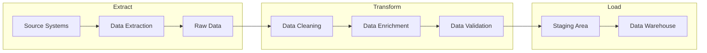
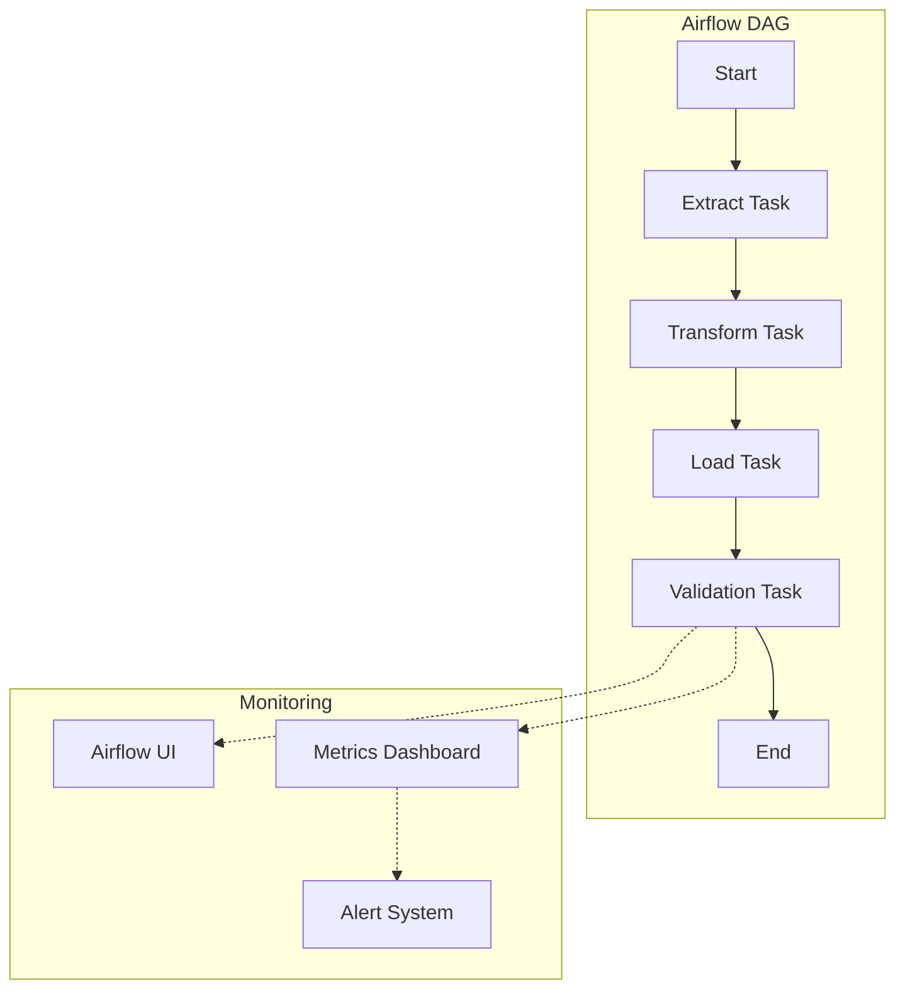
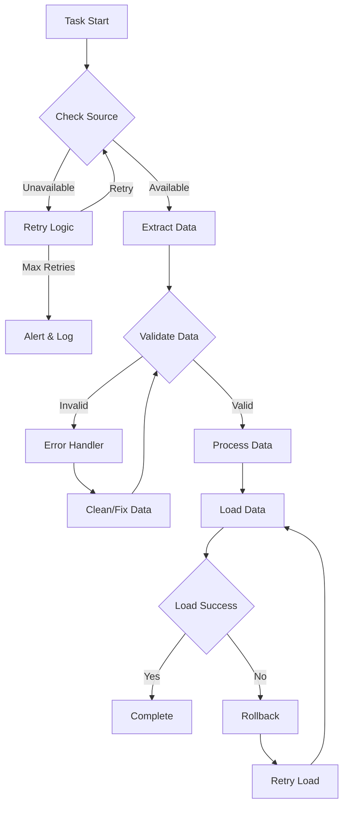

# ETL Fundamentals

## Introduction to ETL 🔄

ETL (Extract, Transform, Load) is a fundamental process in data engineering that forms the backbone of data integration and warehousing solutions.

### ETL Workflow Diagram


### Data Pipeline Architecture with Airflow


### Error Handling Flowchart


### Airflow DAG Example
```python
from airflow import DAG
from airflow.operators.python_operator import PythonOperator
from datetime import datetime, timedelta

default_args = {
    'owner': 'data_engineer',
    'depends_on_past': False,
    'start_date': datetime(2024, 1, 1),
    'email': ['alerts@example.com'],
    'email_on_failure': True,
    'email_on_retry': False,
    'retries': 3,
    'retry_delay': timedelta(minutes=5)
}

dag = DAG(
    'sales_etl_pipeline',
    default_args=default_args,
    description='Sales data ETL pipeline',
    schedule_interval='0 0 * * *',  # Daily at midnight
    catchup=False
)

# Extract task
extract_task = PythonOperator(
    task_id='extract_sales_data',
    python_callable=extract_sales_data,
    dag=dag
)

# Transform task
transform_task = PythonOperator(
    task_id='transform_sales_data',
    python_callable=transform_sales_data,
    dag=dag
)

# Load task
load_task = PythonOperator(
    task_id='load_sales_data',
    python_callable=load_sales_data,
    dag=dag
)

# Validation task
validate_task = PythonOperator(
    task_id='validate_sales_data',
    python_callable=validate_sales_data,
    dag=dag
)

# Define task dependencies
extract_task >> transform_task >> load_task >> validate_task
```

### Monitoring Dashboard Example (Tableau)
```
[Tableau Dashboard Layout]
+------------------------+------------------------+
|    Pipeline Status     |    Data Quality KPIs   |
+------------------------+------------------------+
| - Success Rate         | - Completeness         |
| - Processing Time      | - Accuracy             |
| - Error Count         | - Timeliness           |
| - Resource Usage      | - Consistency          |
+------------------------+------------------------+
|        Error Distribution by Type              |
+-----------------------------------------------+
| - Connection Errors                            |
| - Validation Failures                          |
| - Processing Errors                            |
| - System Errors                                |
+-----------------------------------------------+
|        Performance Metrics Over Time           |
+-----------------------------------------------+
| - Processing Volume                            |
| - Response Time                                |
| - Resource Utilization                         |
| - Throughput                                   |
+-----------------------------------------------+
```

### Core Concepts

#### 1. Extract
- **Data Sources**:
  * Databases (SQL, NoSQL)
  * APIs and web services
  * File systems (CSV, JSON)
  * Streaming sources
  * Legacy systems

- **Extraction Methods**:
  * Full extraction
  * Incremental extraction
  * Change data capture
  * Event-driven extraction

#### 2. Transform
- **Data Cleaning**:
  * Missing value handling
  * Duplicate removal
  * Error correction
  * Format standardization

- **Data Enhancement**:
  * Enrichment
  * Aggregation
  * Derivation
  * Validation

#### 3. Load
- **Loading Types**:
  * Full load
  * Incremental load
  * Merge load
  * Upsert operations

- **Target Systems**:
  * Data warehouses
  * Data marts
  * Operational databases
  * Analytics platforms

### Business Impact
- **Decision Making**:
  * Real-time insights
  * Historical analysis
  * Predictive modeling
  * Performance monitoring

- **Operational Efficiency**:
  * Process automation
  * Data consistency
  * Resource optimization
  * Error reduction

### Technical Considerations
- **Performance**:
  * Processing speed
  * Resource usage
  * Scalability
  * Optimization

- **Quality**:
  * Data accuracy
  * Completeness
  * Consistency
  * Timeliness

Here's a comprehensive implementation of an ETL pipeline:

## ETL Pipeline Components 🛠️

```python
import pandas as pd
import sqlalchemy
import requests
import logging
from datetime import datetime

class ETLPipeline:
    """
    Basic ETL pipeline framework
    """
    def __init__(self):
        self.logger = self._setup_logging()
    
    def _setup_logging(self):
        """Setup logging configuration"""
        logging.basicConfig(
            level=logging.INFO,
            format='%(asctime)s - %(levelname)s - %(message)s'
        )
        return logging.getLogger(__name__)
    
    def extract(self, source):
        """Extract data from source"""
        try:
            self.logger.info(f"Starting extraction from {source}")
            # Implementation depends on source type
            if source.endswith('.csv'):
                data = pd.read_csv(source)
            elif source.startswith('http'):
                response = requests.get(source)
                data = pd.DataFrame(response.json())
            else:
                raise ValueError(f"Unsupported source type: {source}")
            
            self.logger.info(f"Extracted {len(data)} records")
            return data
        
        except Exception as e:
            self.logger.error(f"Extraction failed: {str(e)}")
            raise
    
    def transform(self, data):
        """Transform extracted data"""
        try:
            self.logger.info("Starting transformation")
            # Implement transformation logic
            return data
        
        except Exception as e:
            self.logger.error(f"Transformation failed: {str(e)}")
            raise
    
    def load(self, data, target):
        """Load transformed data to target"""
        try:
            self.logger.info(f"Starting load to {target}")
            # Implementation depends on target type
            if target.endswith('.csv'):
                data.to_csv(target, index=False)
            elif target.startswith('postgresql://'):
                engine = sqlalchemy.create_engine(target)
                data.to_sql('table_name', engine, if_exists='append')
            else:
                raise ValueError(f"Unsupported target type: {target}")
            
            self.logger.info(f"Loaded {len(data)} records")
            
        except Exception as e:
            self.logger.error(f"Load failed: {str(e)}")
            raise
    
    def run(self, source, target):
        """Run the complete ETL pipeline"""
        try:
            # Extract
            raw_data = self.extract(source)
            
            # Transform
            transformed_data = self.transform(raw_data)
            
            # Load
            self.load(transformed_data, target)
            
            self.logger.info("ETL pipeline completed successfully")
            
        except Exception as e:
            self.logger.error(f"Pipeline failed: {str(e)}")
            raise
```

## Extract Phase 📥

The Extract phase is responsible for retrieving data from various source systems while handling different formats, protocols, and potential issues.

### Key Considerations
- **Source Systems**:
  * Availability windows
  * Access patterns
  * Rate limits
  * Authentication

- **Data Volume**:
  * Batch size
  * Memory constraints
  * Network bandwidth
  * Processing capacity

- **Reliability**:
  * Connection stability
  * Error handling
  * Retry mechanisms
  * Fallback options

### 1. Data Sources

Different data sources require specific handling approaches:

#### Database Sources
- **Relational Databases**:
  * Connection pooling
  * Query optimization
  * Transaction isolation
  * Cursor management

- **NoSQL Databases**:
  * Document retrieval
  * Key-value access
  * Graph traversal
  * Column family queries

#### File Systems
- **Local Files**:
  * File formats
  * Encoding handling
  * Directory structure
  * File locking

- **Cloud Storage**:
  * Access credentials
  * Region selection
  * Transfer optimization
  * Cost management

#### APIs
- **REST APIs**:
  * Authentication
  * Rate limiting
  * Pagination
  * Error handling

- **Streaming APIs**:
  * Connection management
  * Backpressure handling
  * Message ordering
  * State management

Here's a comprehensive implementation:

```python
class DataExtractor:
    """
    Handle different types of data extraction
    """
    @staticmethod
    def from_csv(file_path):
        """Extract from CSV file"""
        return pd.read_csv(file_path)
    
    @staticmethod
    def from_api(url, params=None):
        """Extract from REST API"""
        response = requests.get(url, params=params)
        response.raise_for_status()
        return pd.DataFrame(response.json())
    
    @staticmethod
    def from_database(connection_string, query):
        """Extract from database"""
        engine = sqlalchemy.create_engine(connection_string)
        return pd.read_sql(query, engine)
    
    @staticmethod
    def from_json(file_path):
        """Extract from JSON file"""
        return pd.read_json(file_path)
```

### 2. Error Handling

```python
def extract_with_retry(source, max_retries=3):
    """
    Extract data with retry logic
    """
    for attempt in range(max_retries):
        try:
            if source.endswith('.csv'):
                return pd.read_csv(source)
            elif source.startswith('http'):
                response = requests.get(source)
                response.raise_for_status()
                return pd.DataFrame(response.json())
            else:
                raise ValueError(f"Unsupported source: {source}")
                
        except Exception as e:
            if attempt == max_retries - 1:
                raise
            time.sleep(2 ** attempt)  # Exponential backoff
```

## Transform Phase 🔄

The Transform phase is where raw data is converted into a format suitable for analysis and loading into target systems.

### Transformation Types
- **Data Cleansing**:
  * Missing value handling
  * Outlier detection
  * Error correction
  * Format standardization

- **Data Enrichment**:
  * Lookup operations
  * Derived calculations
  * Data augmentation
  * Feature engineering

- **Data Restructuring**:
  * Schema mapping
  * Normalization
  * Denormalization
  * Aggregation

### Key Considerations
- **Data Quality**:
  * Validation rules
  * Business constraints
  * Data integrity
  * Consistency checks

- **Performance**:
  * Memory usage
  * Processing time
  * Resource allocation
  * Optimization

- **Maintainability**:
  * Code organization
  * Documentation
  * Testing
  * Version control

### 1. Data Cleaning

Data cleaning ensures data quality and consistency:

#### Cleaning Operations
- **Missing Values**:
  * Imputation strategies
  * Default values
  * Removal policies
  * Documentation

- **Duplicates**:
  * Detection methods
  * Resolution strategies
  * Business rules
  * Audit trails

- **Data Types**:
  * Type conversion
  * Format validation
  * Range checking
  * Custom types

Here's a comprehensive implementation:

```python
class DataTransformer:
    """
    Handle data transformation operations
    """
    @staticmethod
    def clean_data(df):
        """Basic data cleaning"""
        # Remove duplicates
        df = df.drop_duplicates()
        
        # Handle missing values
        df = df.fillna({
            'numeric_col': 0,
            'string_col': 'unknown'
        })
        
        # Fix data types
        df['date_col'] = pd.to_datetime(df['date_col'])
        
        return df
    
    @staticmethod
    def validate_data(df, rules):
        """Validate data against rules"""
        for column, rule in rules.items():
            if not df[column].apply(rule).all():
                raise ValueError(f"Validation failed for {column}")
        return df
    
    @staticmethod
    def transform_data(df, transformations):
        """Apply custom transformations"""
        for column, transformation in transformations.items():
            df[column] = df[column].apply(transformation)
        return df
```

### 2. Data Validation

```python
def validate_dataset(df, schema):
    """
    Validate dataset against schema
    """
    errors = []
    
    # Check columns
    missing_cols = set(schema['required_columns']) - set(df.columns)
    if missing_cols:
        errors.append(f"Missing columns: {missing_cols}")
    
    # Check data types
    for col, dtype in schema['dtypes'].items():
        if col in df.columns and df[col].dtype != dtype:
            errors.append(f"Invalid dtype for {col}: {df[col].dtype} != {dtype}")
    
    # Check constraints
    for col, constraints in schema['constraints'].items():
        if 'min' in constraints and df[col].min() < constraints['min']:
            errors.append(f"{col} contains values below {constraints['min']}")
        if 'max' in constraints and df[col].max() > constraints['max']:
            errors.append(f"{col} contains values above {constraints['max']}")
    
    if errors:
        raise ValueError("\n".join(errors))
    
    return True
```

## Load Phase 📤

The Load phase is responsible for writing transformed data to target systems efficiently and reliably.

### Loading Strategies
- **Batch Loading**:
  * Full loads
  * Incremental loads
  * Delta loads
  * Merge operations

- **Real-time Loading**:
  * Stream processing
  * Change data capture
  * Event-driven loads
  * Message queues

- **Hybrid Loading**:
  * Micro-batching
  * Lambda architecture
  * Kappa architecture
  * Hybrid patterns

### Key Considerations
- **Performance**:
  * Batch size optimization
  * Parallel loading
  * Index management
  * Resource utilization

- **Data Integrity**:
  * Transaction management
  * Consistency checks
  * Rollback strategies
  * Recovery procedures

- **Target Systems**:
  * System capacity
  * Load windows
  * Concurrency limits
  * Maintenance schedules

### 1. Data Loading

Different loading approaches for various target systems:

#### Database Loading
- **Bulk Loading**:
  * Batch inserts
  * COPY commands
  * Staging tables
  * Partition switching

- **Incremental Loading**:
  * Change tracking
  * Timestamp-based
  * Version-based
  * Merge operations

#### File System Loading
- **File Management**:
  * File naming
  * Directory structure
  * Compression
  * Archival

Here's a comprehensive implementation:

```python
class DataLoader:
    """
    Handle different types of data loading
    """
    @staticmethod
    def to_csv(df, file_path):
        """Load to CSV file"""
        df.to_csv(file_path, index=False)
    
    @staticmethod
    def to_database(df, connection_string, table_name):
        """Load to database"""
        engine = sqlalchemy.create_engine(connection_string)
        df.to_sql(table_name, engine, if_exists='append', index=False)
    
    @staticmethod
    def to_json(df, file_path):
        """Load to JSON file"""
        df.to_json(file_path, orient='records')
```

### 2. Error Recovery

```python
class TransactionLoader:
    """
    Load data with transaction support
    """
    def __init__(self, connection_string):
        self.engine = sqlalchemy.create_engine(connection_string)
    
    def load_with_transaction(self, df, table_name):
        """Load data within a transaction"""
        with self.engine.begin() as connection:
            try:
                # Create temporary table
                temp_table = f"temp_{table_name}_{datetime.now().strftime('%Y%m%d_%H%M%S')}"
                df.to_sql(temp_table, connection, index=False)
                
                # Move data to final table
                connection.execute(f"""
                    INSERT INTO {table_name}
                    SELECT * FROM {temp_table}
                """)
                
                # Drop temporary table
                connection.execute(f"DROP TABLE {temp_table}")
                
            except Exception as e:
                # Transaction will automatically rollback
                raise
```

## Pipeline Orchestration 🎯

Pipeline orchestration manages the execution, monitoring, and maintenance of ETL workflows.

### Orchestration Concepts
- **Workflow Management**:
  * Task scheduling
  * Dependency resolution
  * Resource allocation
  * Error handling

- **Pipeline Patterns**:
  * Sequential processing
  * Parallel execution
  * Fan-out/Fan-in
  * Branching logic

- **State Management**:
  * Checkpointing
  * Recovery points
  * State persistence
  * Failure recovery

### Key Features
- **Scheduling**:
  * Time-based triggers
  * Event-driven execution
  * Dependencies
  * Priorities

- **Monitoring**:
  * Health checks
  * Performance metrics
  * Resource usage
  * SLA compliance

- **Error Handling**:
  * Retry policies
  * Failure notifications
  * Recovery procedures
  * Fallback strategies

### 1. Pipeline Configuration

Configuration management for ETL pipelines:

#### Configuration Types
- **Source Config**:
  * Connection details
  * Authentication
  * Query parameters
  * Rate limits

- **Transform Config**:
  * Business rules
  * Validation rules
  * Mapping rules
  * Processing rules

- **Target Config**:
  * Connection details
  * Table mappings
  * Load options
  * Error handling

Here's a comprehensive implementation:

```python
class PipelineConfig:
    """
    Configure ETL pipeline
    """
    def __init__(self, config_file):
        self.config = self._load_config(config_file)
    
    def _load_config(self, config_file):
        """Load configuration from file"""
        import yaml
        with open(config_file) as f:
            return yaml.safe_load(f)
    
    def get_source_config(self):
        """Get source configuration"""
        return self.config['source']
    
    def get_transform_config(self):
        """Get transformation configuration"""
        return self.config['transform']
    
    def get_target_config(self):
        """Get target configuration"""
        return self.config['target']
```

### 2. Pipeline Monitoring

```python
class PipelineMonitor:
    """
    Monitor ETL pipeline execution
    """
    def __init__(self):
        self.start_time = None
        self.metrics = {}
    
    def start_pipeline(self):
        """Record pipeline start"""
        self.start_time = datetime.now()
        self.metrics = {
            'records_processed': 0,
            'errors': 0,
            'warnings': 0
        }
    
    def end_pipeline(self):
        """Record pipeline end"""
        duration = datetime.now() - self.start_time
        self.metrics['duration'] = duration.total_seconds()
        
        return {
            'start_time': self.start_time,
            'duration': self.metrics['duration'],
            'records_processed': self.metrics['records_processed'],
            'errors': self.metrics['errors'],
            'warnings': self.metrics['warnings']
        }
    
    def record_metric(self, metric_name, value):
        """Record custom metric"""
        self.metrics[metric_name] = value
```

## Best Practices 💡

1. **Error Handling**
   - Implement proper exception handling
   - Use retries for transient failures
   - Log errors with context
   - Implement fallback mechanisms

2. **Performance**
   - Process data in chunks
   - Use appropriate data types
   - Optimize database operations
   - Monitor resource usage

3. **Monitoring**
   - Track pipeline metrics
   - Set up alerts
   - Monitor data quality
   - Log important events

4. **Testing**
   - Unit test components
   - Integration test pipeline
   - Test with sample data
   - Validate outputs

## Practice Exercise 🏋️‍♂️

Build an ETL pipeline that:
1. Extracts data from multiple sources
2. Performs data cleaning and validation
3. Loads data to a target system
4. Includes error handling and monitoring
5. Follows best practices

## Solution Template 💡

```python
# Pipeline implementation
class MyETLPipeline(ETLPipeline):
    def transform(self, data):
        """
        Implement custom transformation logic
        """
        # Clean data
        data = DataTransformer.clean_data(data)
        
        # Validate data
        schema = {
            'required_columns': ['id', 'value'],
            'dtypes': {'id': 'int64', 'value': 'float64'},
            'constraints': {
                'value': {'min': 0, 'max': 100}
            }
        }
        validate_dataset(data, schema)
        
        # Transform data
        transformations = {
            'value': lambda x: x * 2
        }
        data = DataTransformer.transform_data(data, transformations)
        
        return data

# Pipeline execution
if __name__ == "__main__":
    # Initialize pipeline
    pipeline = MyETLPipeline()
    monitor = PipelineMonitor()
    
    try:
        # Start monitoring
        monitor.start_pipeline()
        
        # Run pipeline
        pipeline.run(
            source='data.csv',
            target='postgresql://localhost/db'
        )
        
        # Record metrics
        results = monitor.end_pipeline()
        print(f"Pipeline completed: {results}")
        
    except Exception as e:
        print(f"Pipeline failed: {str(e)}")
```

Remember: A well-designed ETL pipeline is crucial for reliable data processing! 🎯
