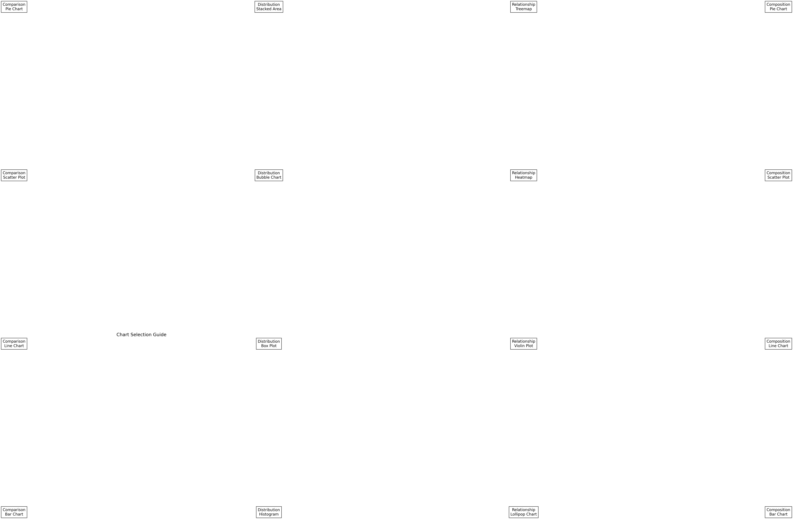
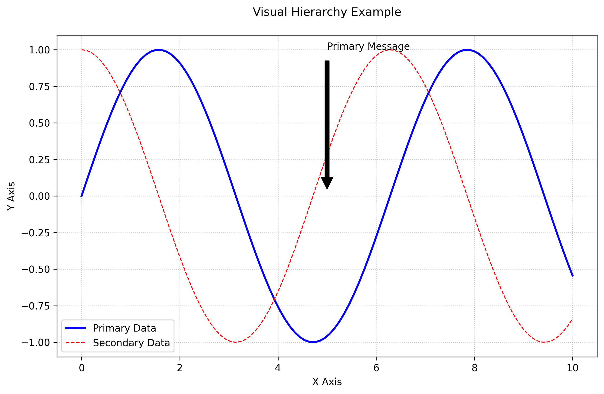
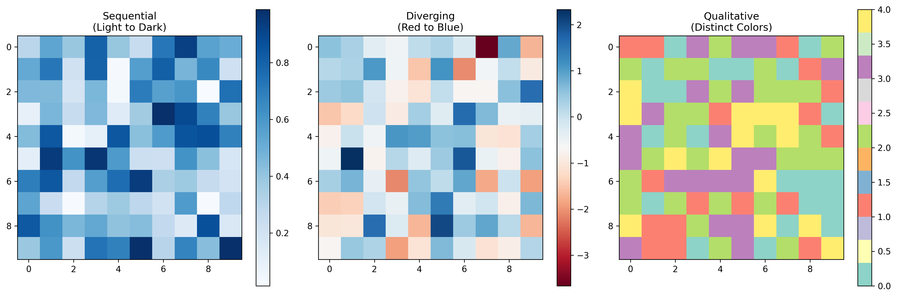
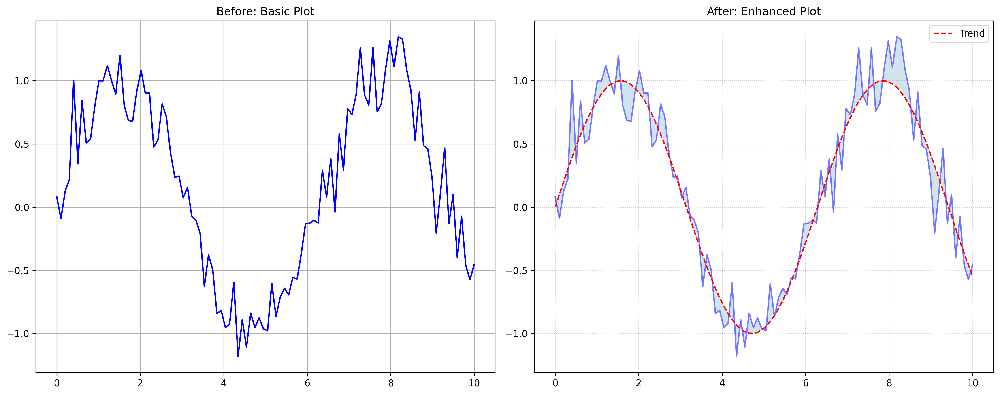

# Introduction to Data Visualization

## What is Data Visualization?

Data visualization is like translating a complex story into a picture book. Just as a picture is worth a thousand words, a well-crafted visualization can communicate complex data patterns and insights in an instant. Think of it as the bridge between raw numbers and human understanding.

### Why This Matters

- **Quick Understanding**: Our brains process visual information 60,000 times faster than text
- **Better Memory**: We remember 80% of what we see, compared to 20% of what we read
- **Pattern Recognition**: Visual patterns are easier to spot than numerical patterns
- **Decision Making**: Clear visualizations lead to better, faster decisions

## Real-World Applications

### Healthcare

- **Patient Monitoring**: Tracking vital signs over time
- **Disease Outbreaks**: Mapping spread patterns
- **Treatment Effectiveness**: Comparing before/after results

### Finance

- **Market Trends**: Stock price movements
- **Budget Analysis**: Expense breakdowns
- **Investment Performance**: Portfolio comparisons

### Retail

- **Sales Patterns**: Daily/weekly/monthly trends
- **Customer Behavior**: Shopping patterns
- **Inventory Management**: Stock levels and turnover

## Core Principles

### 1. Chart Selection Guide

Think of chart selection like choosing the right tool for a job:

- **Bar Charts**: Like comparing heights of different buildings
- **Line Charts**: Like tracking a journey on a map
- **Scatter Plots**: Like plotting stars in the night sky
- **Pie Charts**: Like slicing a pizza into portions



### 2. Visual Hierarchy

Imagine a newspaper:

- **Headlines**: Big, bold, and attention-grabbing
- **Subheadings**: Supporting information
- **Body Text**: Detailed context



### 3. Color Strategy

Think of colors like a language:

- **Sequential**: Like a thermometer (light to dark)
- **Diverging**: Like a weather map (hot to cold)
- **Qualitative**: Like different types of fruit (distinct colors)



## Getting Started with Matplotlib

### Your First Plot

```python
# Import the necessary libraries
import matplotlib.pyplot as plt
import numpy as np

# Create some sample data
x = np.linspace(0, 10, 100)
y = np.sin(x)

# Create your first plot
plt.figure(figsize=(10, 6))
plt.plot(x, y, 'b-', label='Sine Wave')
plt.title('My First Plot')
plt.xlabel('X Axis')
plt.ylabel('Y Axis')
plt.legend()
plt.grid(True)
plt.show()
```

### Before and After

See how a basic plot can be enhanced with proper styling and annotations:



## Learning Path

### Week 1: Foundations

- Understanding basic principles
- Learning chart selection
- Mastering color theory
- Grasping design fundamentals

### Week 2: Matplotlib Basics

- Creating your first plots
- Customizing plot elements
- Handling different data types
- Saving and sharing visualizations

### Week 3: Advanced Features

- Creating multiple plots
- Adding interactivity
- Custom styling
- Animations and dynamic updates

## Best Practices

### 1. Design Principles

- **Clarity**: Keep it simple and focused
- **Consistency**: Use the same style throughout
- **Context**: Provide necessary background information
- **Color**: Use colors meaningfully and accessibly

### 2. Common Mistakes to Avoid

- Overcrowding with too much information
- Using inappropriate chart types
- Poor color choices
- Missing labels or context

### 3. Accessibility Guidelines

- Use colorblind-friendly palettes
- Provide alternative text descriptions
- Ensure sufficient contrast
- Use clear, readable fonts

## Additional Resources

### Books

- "Storytelling with Data" by Cole Nussbaumer Knaflic
- "The Visual Display of Quantitative Information" by Edward Tufte
- "Data Visualization: A Practical Introduction" by Kieran Healy

### Online Courses

- DataCamp's "Introduction to Data Visualization with Python"
- Coursera's "Data Visualization and Communication"
- Udemy's "Data Visualization with Python"

### Tools

- Matplotlib: The foundation of Python visualization
- Seaborn: Statistical data visualization
- Plotly: Interactive visualizations
- Tableau: Business intelligence and analytics

## Next Steps

1. Start with simple plots and gradually add complexity
2. Practice with real-world datasets
3. Share your visualizations and get feedback
4. Explore different visualization libraries
5. Join data visualization communities

Remember: The best visualizations tell a story. Focus on clarity and purpose, and let your data speak for itself.
