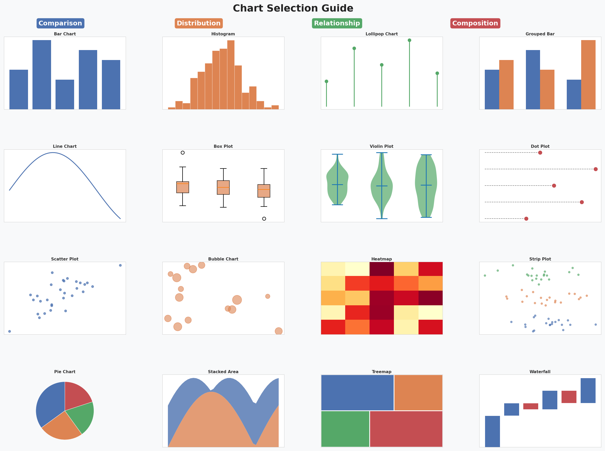

# Introduction to Data Visualization

**After this submodule:** you can use the lessons linked below and complete the exercises that match **Introduction to Data Visualization** in your course schedule.

> **Note:** This submodule starts with **why** charts work (perception, color, hierarchy), then moves to **Matplotlib** in code. Read [Visualization principles](visualization-principles.md) before [Matplotlib basics](matplotlib-basics.md) if you are new to design terms.

It now also includes a short lesson on [preparing data for visualization](data-prep-for-visualization.md) and a practical guide to [annotations and highlighting](annotations-and-highlighting.md), because a clean chart depends as much on framing and emphasis as on syntax.

## Helpful video

How one animated chart, in four minutes, shows 200 years of global progress, and why visualization changes how we understand data.

## What is Data Visualization?

Data visualization is like translating a complex story into a picture book. Just as a picture is worth a thousand words, a well-crafted visualization can communicate complex data patterns and insights in an instant. Think of it as the bridge between raw numbers and human understanding.

### Why This Matters

* **Quick Understanding**: Our brains process visual information 60,000 times faster than text
* **Better Memory**: We remember 80% of what we see, compared to 20% of what we read
* **Pattern Recognition**: Visual patterns are easier to spot than numerical patterns
* **Decision Making**: Clear visualizations lead to better, faster decisions

## Real-World Applications

### Healthcare

* **Patient Monitoring**: Tracking vital signs over time
* **Disease Outbreaks**: Mapping spread patterns
* **Treatment Effectiveness**: Comparing before/after results

### Finance

* **Market Trends**: Stock price movements
* **Budget Analysis**: Expense breakdowns
* **Investment Performance**: Portfolio comparisons

### Retail

* **Sales Patterns**: Daily/weekly/monthly trends
* **Customer Behavior**: Shopping patterns
* **Inventory Management**: Stock levels and turnover

## Core Principles

### 1. Chart Selection Guide

Think of chart selection like choosing the right tool for a job:

* **Bar Charts**: Like comparing heights of different buildings
* **Line Charts**: Like tracking a journey on a map
* **Scatter Plots**: Like plotting stars in the night sky
* **Pie Charts**: Like slicing a pizza into portions

### 2. Visual Hierarchy

Imagine a newspaper:

* **Headlines**: Big, bold, and attention-grabbing
* **Subheadings**: Supporting information
* **Body Text**: Detailed context

.png>)

### 3. Color Strategy

Think of colors like a language:

* **Sequential**: Like a thermometer (light to dark)
* **Diverging**: Like a weather map (hot to cold)
* **Qualitative**: Like different types of fruit (distinct colors)

## Getting Started with Matplotlib

### Your First Plot

**Purpose:** Draw a simple sine curve with pyplot: one figure, labeled axes, legend, and grid.

**Walkthrough:** `linspace` builds x; `plot` with `'b-'` sets color and linestyle; `show()` displays in scripts.

<figure><figcaption>
Figure 1: My First Plot
</figcaption></figure>

Imports

`matplotlib.pyplot` provides the plotting API; `numpy` generates the sample data points.

Sample Data

`np.linspace(0, 10, 100)` creates 100 evenly spaced x values; `np.sin(x)` computes the y values for a sine curve.

Plot Anatomy

`figure` sets canvas size; `plot` draws the line; `title`, `xlabel`, `ylabel`, `legend`, and `grid` add context before `show()` renders.

<figure><figcaption>
Figure 1: My First Plot
</figcaption></figure>

### Before and After

See how a basic plot can be enhanced with proper styling and annotations:

## Learning Path

### Week 1: Foundations

* Understanding basic principles
* Preparing data at the right level for charts
* Learning chart selection
* Mastering color theory
* Grasping design fundamentals

### Week 2: Matplotlib Basics

* Creating your first plots
* Customizing plot elements
* Handling different data types
* Saving and sharing visualizations

### Week 3: Advanced Features

* Creating multiple plots
* Adding annotations and highlights
* Custom styling
* Troubleshooting layout and rendering issues

## Best Practices

### 1. Design Principles

* **Clarity**: Keep it simple and focused
* **Consistency**: Use the same style throughout
* **Context**: Provide necessary background information
* **Color**: Use colors meaningfully and accessibly

### 2. Common Mistakes to Avoid

* Overcrowding with too much information
* Using inappropriate chart types
* Poor color choices
* Missing labels or context

### 3. Accessibility Guidelines

* Use colorblind-friendly palettes
* Provide alternative text descriptions
* Ensure sufficient contrast
* Use clear, readable fonts

## Additional Resources

### Books

* "Storytelling with Data" by Cole Nussbaumer Knaflic
* "The Visual Display of Quantitative Information" by Edward Tufte
* "Data Visualization: A Practical Introduction" by Kieran Healy

### Online Courses

* DataCamp's "Introduction to Data Visualization with Python"
* Coursera's "Data Visualization and Communication"
* Udemy's "Data Visualization with Python"

### Tools

* Matplotlib: The foundation of Python visualization
* Seaborn: Statistical data visualization
* Plotly: Interactive visualizations
* Tableau: Business intelligence and analytics

## Next steps

1. Work through [Visualization principles](visualization-principles.md), then [Preparing data for visualization](data-prep-for-visualization.md), then [Matplotlib basics](matplotlib-basics.md).
2. Use [Annotations and highlighting](annotations-and-highlighting.md) to turn a correct chart into a communicative one, and use [Troubleshooting guide](troubleshooting-guide.md) when plots misbehave.
3. Continue to [3.2 Advanced data visualization](../3.2-adv-data-viz/) for Seaborn, Plotly, time-series work, and a case-study workflow.
4. Use the [module assignment](../assignments/module-assignment.md) when assigned.

Remember: The best visualizations tell a story. Focus on clarity and purpose, and let your data speak for itself.
