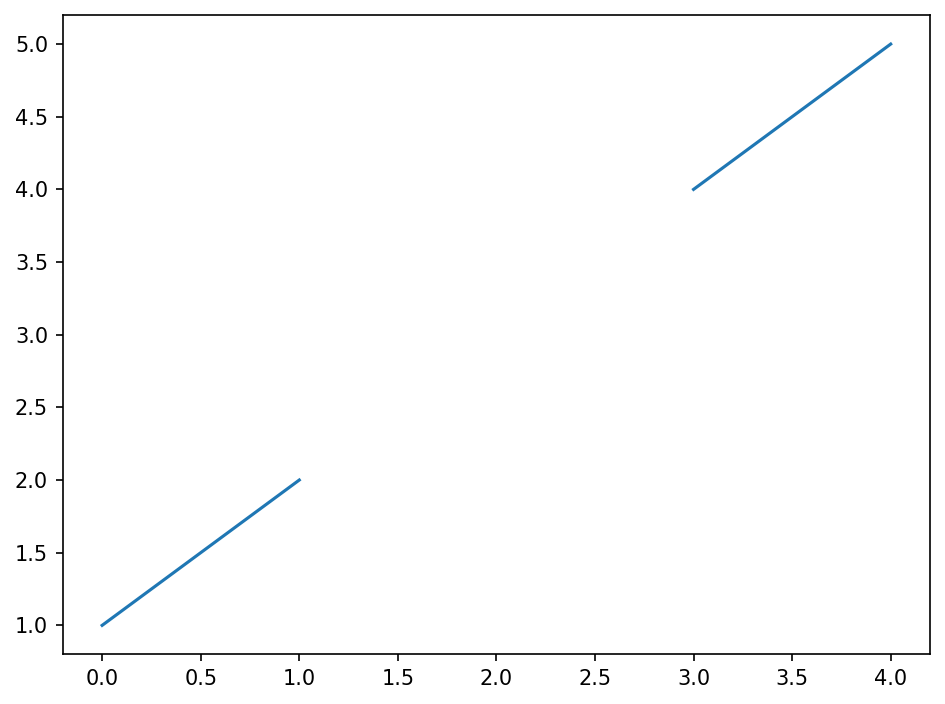

# Matplotlib Troubleshooting Guide

**After this lesson:** you can explain Matplotlib Troubleshooting Guide and try the examples in your own notebook.

Use this page when code runs but plots look wrong, fail to display, or raise backend errors. Pair it with [Matplotlib basics](matplotlib-basics.md) for API context.

> **Tip:** Most "nothing shows" issues in notebooks are fixed with **inline mode** and **plt.show()** (see below).

## Helpful video

Fixing one of the most common matplotlib pain points: controlling figure size and layout.

## Common Issues and Solutions

### 1. Display Problems

#### Plot Not Showing

Think of this as your TV not turning on:

**Purpose:** Know why a figure might not render in a script or notebook, and fix it with an explicit draw/show path or inline mode.

**Walkthrough:** `plt.show()` flushes the GUI event loop; `%matplotlib inline` embeds figures in Jupyter outputs; order matters (build the plot, then show).

```python
#  Problem: Your plot is invisible
plt.plot([1, 2, 3], [1, 2, 3])
# Nothing appears

#  Solution 1: Add plt.show() - like pressing the power button
plt.plot([1, 2, 3], [1, 2, 3])
plt.show()

#  Solution 2: For Jupyter - like setting up your TV
%matplotlib inline
plt.plot([1, 2, 3], [1, 2, 3])
```

#### Backend Issues

Think of this as your TV not being connected properly:

**Purpose:** Run Matplotlib on a machine without a display (servers, CI, SSH) by selecting a non-interactive backend before `pyplot` initializes.

**Walkthrough:** `matplotlib.use('Agg')` must run before `import matplotlib.pyplot as plt`; `Agg` renders to a buffer/file instead of opening a window.

```python
#  Error: No display name and no $DISPLAY environment variable
#  Solution: Switch to non-interactive backend - like using a different TV input
import matplotlib
matplotlib.use('Agg')  # Before importing pyplot
import matplotlib.pyplot as plt
```

### 2. Layout Problems

#### Overlapping Elements

Think of this as trying to fit too many things in a small room:

**Purpose:** Reduce label overlap and clipping by giving the figure more space and letting Matplotlib auto-adjust margins.

**Walkthrough:** Larger `figsize`, `labelpad` on axis labels, and `tight_layout`/`constrained_layout` fix most overlap issues.

```python
#  Problem: Cramped layout - like a crowded room
fig, ax = plt.subplots(figsize=(6, 4))
ax.plot(data)
ax.set_xlabel('Very Long X Label')
ax.set_ylabel('Very Long Y Label')

#  Solution: Adjust layout - like rearranging furniture
fig, ax = plt.subplots(figsize=(10, 6))
ax.plot(data)
ax.set_xlabel('Very Long X Label', labelpad=10)
ax.set_ylabel('Very Long Y Label', labelpad=10)
plt.tight_layout(pad=1.5)
```

#### Subplots Spacing

Think of this as arranging pictures on a wall:

**Purpose:** Separate stacked axes vertically so titles and tick labels do not collide.

**Walkthrough:** `gridspec_kw={'hspace': ...}` passes spacing into the `GridSpec` that `subplots` creates; tune `hspace`/`wspace` until labels clear.

```python
#  Problem: Overlapping subplots - like pictures too close together
fig, (ax1, ax2) = plt.subplots(2, 1)

#  Solution: Add spacing - like adding space between pictures
fig, (ax1, ax2) = plt.subplots(2, 1,
                              height_ratios=[1, 1],
                              gridspec_kw={'hspace': 0.3})
```

<figure><figcaption><p>Figure 1: Generated visualization</p></figcaption></figure>

<figure><figcaption><p>Figure 2: Generated visualization</p></figcaption></figure>

<figure><figcaption><p>Figure 3: Generated visualization</p></figcaption></figure>

### 3. Data Handling

#### Missing Data

Think of this as having gaps in your story:

**Purpose:** Keep plotting functions from propagating NaNs into broken lines or empty axes by filtering or interpolating first.

**Walkthrough:** List comprehension drops NaNs; `np.interp` fills gaps using neighboring valid points along the index.

<figure><figcaption><p>Figure 1: Generated visualization</p></figcaption></figure>

Problem Setup

A list with a `np.nan` in position 3, plotting this directly breaks line continuity.

Filter Approach

List comprehension drops NaN values entirely, fast but loses the original index positions.

Interpolation Approach

`np.interp` fills each NaN using neighboring valid values, preserving the original array length and index alignment.

#### Scale Issues

Think of this as trying to compare very different things:

**Purpose:** Plot series with very different magnitudes without misleading the reader, either twin axes or normalized units.

**Walkthrough:** `twinx()` shares x but draws a second y-axis; normalization maps each series to \[0, 1] for overlay comparison.

<figure><figcaption><p>Figure 5: Generated visualization</p></figcaption></figure>

Mismatched Scales

`y2` is 1000× larger than `y1`-on a single axis, `y1` would appear flat against the bottom.

Twin Axis

`twinx()` creates a second y-axis that shares the x-axis, each series keeping its own scale.

Normalization

Min-max normalization maps any series to \[0, 1], enabling direct overlay without a dual axis.

<figure><figcaption><p>Figure 4: Generated visualization</p></figcaption></figure>

### 4. Memory Management

#### Memory Leaks

Think of this as leaving too many windows open on your computer:

**Purpose:** Avoid leaking figure objects when creating many plots in a loop (especially in scripts or long notebooks).

**Walkthrough:** `plt.close('all')` after `show()` releases figures; the `try`/`finally` pattern ensures cleanup even if plotting errors.

<figure><figcaption><p>Figure 6: Generated visualization</p></figcaption></figure>

<figure><figcaption><p>Figure 7: Generated visualization</p></figcaption></figure>

<figure><figcaption><p>Figure 8: Generated visualization</p></figcaption></figure>

<figure><figcaption><p>Figure 9: Generated visualization</p></figcaption></figure>

<figure><figcaption><p>Figure 10: Generated visualization</p></figcaption></figure>

<figure><figcaption><p>Figure 11: Generated visualization</p></figcaption></figure>

<figure><figcaption><p>Figure 12: Generated visualization</p></figcaption></figure>

<figure><figcaption><p>Figure 13: Generated visualization</p></figcaption></figure>

<figure><figcaption><p>Figure 14: Generated visualization</p></figcaption></figure>

<figure><figcaption><p>Figure 15: Generated visualization</p></figcaption></figure>

<figure><figcaption><p>Figure 16: Generated visualization</p></figcaption></figure>

<figure><figcaption><p>Figure 17: Generated visualization</p></figcaption></figure>

<figure><figcaption><p>Figure 18: Generated visualization</p></figcaption></figure>

<figure><figcaption><p>Figure 19: Generated visualization</p></figcaption></figure>

<figure><figcaption><p>Figure 20: Generated visualization</p></figcaption></figure>

<figure><figcaption><p>Figure 21: Generated visualization</p></figcaption></figure>

<figure><figcaption><p>Figure 22: Generated visualization</p></figcaption></figure>

<figure><figcaption><p>Figure 23: Generated visualization</p></figcaption></figure>

<figure><figcaption><p>Figure 24: Generated visualization</p></figcaption></figure>

<figure><figcaption><p>Figure 25: Generated visualization</p></figcaption></figure>

<figure><figcaption><p>Figure 26: Generated visualization</p></figcaption></figure>

<figure><figcaption><p>Figure 27: Generated visualization</p></figcaption></figure>

<figure><figcaption><p>Figure 28: Generated visualization</p></figcaption></figure>

<figure><figcaption><p>Figure 29: Generated visualization</p></figcaption></figure>

<figure><figcaption><p>Figure 30: Generated visualization</p></figcaption></figure>

<figure><figcaption><p>Figure 31: Generated visualization</p></figcaption></figure>

<figure><figcaption><p>Figure 32: Generated visualization</p></figcaption></figure>

<figure><figcaption><p>Figure 33: Generated visualization</p></figcaption></figure>

<figure><figcaption><p>Figure 34: Generated visualization</p></figcaption></figure>

<figure><figcaption><p>Figure 35: Generated visualization</p></figcaption></figure>

<figure><figcaption><p>Figure 36: Generated visualization</p></figcaption></figure>

<figure><figcaption><p>Figure 37: Generated visualization</p></figcaption></figure>

<figure><figcaption><p>Figure 38: Generated visualization</p></figcaption></figure>

<figure><figcaption><p>Figure 39: Generated visualization</p></figcaption></figure>

<figure><figcaption><p>Figure 40: Generated visualization</p></figcaption></figure>

<figure><figcaption><p>Figure 41: Generated visualization</p></figcaption></figure>

<figure><figcaption><p>Figure 42: Generated visualization</p></figcaption></figure>

<figure><figcaption><p>Figure 43: Generated visualization</p></figcaption></figure>

<figure><figcaption><p>Figure 44: Generated visualization</p></figcaption></figure>

<figure><figcaption><p>Figure 45: Generated visualization</p></figcaption></figure>

<figure><figcaption><p>Figure 46: Generated visualization</p></figcaption></figure>

<figure><figcaption><p>Figure 47: Generated visualization</p></figcaption></figure>

<figure><figcaption><p>Figure 48: Generated visualization</p></figcaption></figure>

<figure><figcaption><p>Figure 49: Generated visualization</p></figcaption></figure>

<figure><figcaption><p>Figure 50: Generated visualization</p></figcaption></figure>

<figure><figcaption><p>Figure 51: Generated visualization</p></figcaption></figure>

<figure><figcaption><p>Figure 52: Generated visualization</p></figcaption></figure>

<figure><figcaption><p>Figure 53: Generated visualization</p></figcaption></figure>

<figure><figcaption><p>Figure 54: Generated visualization</p></figcaption></figure>

<figure><figcaption><p>Figure 55: Generated visualization</p></figcaption></figure>

<figure><figcaption><p>Figure 56: Generated visualization</p></figcaption></figure>

<figure><figcaption><p>Figure 57: Generated visualization</p></figcaption></figure>

<figure><figcaption><p>Figure 58: Generated visualization</p></figcaption></figure>

<figure><figcaption><p>Figure 59: Generated visualization</p></figcaption></figure>

<figure><figcaption><p>Figure 60: Generated visualization</p></figcaption></figure>

<figure><figcaption><p>Figure 61: Generated visualization</p></figcaption></figure>

<figure><figcaption><p>Figure 62: Generated visualization</p></figcaption></figure>

<figure><figcaption><p>Figure 63: Generated visualization</p></figcaption></figure>

<figure><figcaption><p>Figure 64: Generated visualization</p></figcaption></figure>

<figure><figcaption><p>Figure 65: Generated visualization</p></figcaption></figure>

<figure><figcaption><p>Figure 66: Generated visualization</p></figcaption></figure>

<figure><figcaption><p>Figure 67: Generated visualization</p></figcaption></figure>

<figure><figcaption><p>Figure 68: Generated visualization</p></figcaption></figure>

<figure><figcaption><p>Figure 69: Generated visualization</p></figcaption></figure>

<figure><figcaption><p>Figure 70: Generated visualization</p></figcaption></figure>

<figure><figcaption><p>Figure 71: Generated visualization</p></figcaption></figure>

<figure><figcaption><p>Figure 72: Generated visualization</p></figcaption></figure>

<figure><figcaption><p>Figure 73: Generated visualization</p></figcaption></figure>

<figure><figcaption><p>Figure 74: Generated visualization</p></figcaption></figure>

<figure><figcaption><p>Figure 75: Generated visualization</p></figcaption></figure>

<figure><figcaption><p>Figure 76: Generated visualization</p></figcaption></figure>

<figure><figcaption><p>Figure 77: Generated visualization</p></figcaption></figure>

<figure><figcaption><p>Figure 78: Generated visualization</p></figcaption></figure>

<figure><figcaption><p>Figure 79: Generated visualization</p></figcaption></figure>

<figure><figcaption><p>Figure 80: Generated visualization</p></figcaption></figure>

<figure><figcaption><p>Figure 81: Generated visualization</p></figcaption></figure>

<figure><figcaption><p>Figure 82: Generated visualization</p></figcaption></figure>

<figure><figcaption><p>Figure 83: Generated visualization</p></figcaption></figure>

<figure><figcaption><p>Figure 84: Generated visualization</p></figcaption></figure>

<figure><figcaption><p>Figure 85: Generated visualization</p></figcaption></figure>

<figure><figcaption><p>Figure 86: Generated visualization</p></figcaption></figure>

<figure><figcaption><p>Figure 87: Generated visualization</p></figcaption></figure>

<figure><figcaption><p>Figure 88: Generated visualization</p></figcaption></figure>

<figure><figcaption><p>Figure 89: Generated visualization</p></figcaption></figure>

<figure><figcaption><p>Figure 90: Generated visualization</p></figcaption></figure>

<figure><figcaption><p>Figure 91: Generated visualization</p></figcaption></figure>

<figure><figcaption><p>Figure 92: Generated visualization</p></figcaption></figure>

<figure><figcaption><p>Figure 93: Generated visualization</p></figcaption></figure>

<figure><figcaption><p>Figure 94: Generated visualization</p></figcaption></figure>

<figure><figcaption><p>Figure 95: Generated visualization</p></figcaption></figure>

<figure><figcaption><p>Figure 96: Generated visualization</p></figcaption></figure>

<figure><figcaption><p>Figure 97: Generated visualization</p></figcaption></figure>

<figure><figcaption><p>Figure 98: Generated visualization</p></figcaption></figure>

<figure><figcaption><p>Figure 99: Generated visualization</p></figcaption></figure>

<figure><figcaption><p>Figure 100: Generated visualization</p></figcaption></figure>

<figure><figcaption><p>Figure 101: Generated visualization</p></figcaption></figure>

<figure><figcaption><p>Figure 102: Generated visualization</p></figcaption></figure>

<figure><figcaption><p>Figure 103: Generated visualization</p></figcaption></figure>

<figure><figcaption><p>Figure 104: Generated visualization</p></figcaption></figure>

<figure><figcaption><p>Figure 105: Generated visualization</p></figcaption></figure>

Memory Leak Pattern

Each loop iteration creates a figure object but never closes it, 100 figures accumulate in memory.

Try/Finally Cleanup

Wrapping in `try/finally` ensures `plt.close('all')` runs even if plotting raises an exception.

#### Large Dataset Handling

Think of this as trying to show too many stars in the sky:

**Purpose:** Keep scatter plots responsive when `x` and `y` have millions of points by subsampling and raster-friendly rendering.

**Walkthrough:** Random subset caps point count; `alpha` and `rasterized=True` help when exporting dense scatters to vector formats.

<figure><figcaption><p>Figure 1: Generated visualization</p></figcaption></figure>

Large Dataset

One million random points, rendering all of them makes the scatter slow and the output visually saturated.

Random Sampling

`np.random.choice` picks `max_points` indices without replacement, slicing both `x` and `y` to match.

Raster Rendering

`alpha=0.1` reveals density through overlap; `rasterized=True` converts the scatter to a bitmap for smaller PDF exports.

### 5. Style and Formatting

#### Font Problems

Think of this as trying to use a font that's not installed:

**Purpose:** Set a preferred font while falling back to a generic family if the name is unavailable on the system.

**Walkthrough:** `rcParams['font.family']` applies globally; wrapping in try/except is illustrative, production code often uses `font_manager` to list available fonts.

```python
#  Problem: Font not found - like trying to use a font you don't have
plt.rcParams['font.family'] = 'NonExistentFont'

#  Solution: reliable font handling - like having backup fonts
def set_font_safely():
    """Set fonts with fallbacks"""
    try:
        plt.rcParams['font.family'] = 'Arial'
    except:
        plt.rcParams['font.family'] = 'sans-serif'
```

<figure><figcaption><p>Figure 1: Generated visualization</p></figcaption></figure>

#### Color Issues

Think of this as trying to read yellow text on a white background:

**Purpose:** Replace low-contrast or neon defaults with hex colors that stay readable on white backgrounds and in print.

**Walkthrough:** The dict holds named hex codes; swap `professional_colors['blue']` into `plt.plot(..., color=...)`.

```python
#  Problem: Poor color visibility - like hard-to-read colors
plt.plot(data1, color='yellow')  # Hard to see
plt.plot(data2, color='lime')    # Too bright

#  Solution: Professional color palette - like using readable colors
professional_colors = {
    'blue': '#2E86C1',
    'red': '#E74C3C',
    'green': '#2ECC71',
    'purple': '#8E44AD',
    'orange': '#E67E22'
}
```

### 6. Export and Saving

#### Resolution Problems

Think of this as taking a blurry photo:

**Purpose:** Export PNG/PDF suitable for slides or papers by controlling DPI, padding, and bounding box.

**Walkthrough:** `dpi` sets resolution; `bbox_inches='tight'` trims whitespace; `transparent=True` is useful for slides on non-white backgrounds.

```python
#  Problem: Blurry exports - like a low-resolution photo
plt.savefig('plot.png')

#  Solution: High-quality export settings - like using a better camera
def save_high_quality(fig, filename):
    """Save figure with high quality settings"""
    fig.savefig(filename,
                dpi=300,                # High DPI - like high resolution
                bbox_inches='tight',    # No cutoff - like proper framing
                pad_inches=0.1,         # Small padding - like a small border
                transparent=True)       # Transparent background - like a PNG
```

<figure><figcaption><p>Figure 4: Generated visualization</p></figcaption></figure>

## Debugging Tools

### 1. Plot Information

Think of this as checking your car's dashboard:

**Purpose:** Inspect the current figure and axes state (size, limits, child artists) when debugging layout or memory.

**Walkthrough:** `gcf()`/`gca()` grab the active figure and axes; `psutil` is optional and only valid if you import it elsewhere.

<figure><figcaption><p>Figure 1: Generated visualization</p></figcaption></figure>

Active Figure/Axes

`gcf()` and `gca()` grab the currently active figure and axes without needing explicit references.

Figure Properties

The dict collects size, DPI, axis limits, and child artist count, useful for diagnosing layout or clipping issues.

Memory Check

`psutil.Process().memory_info().rss` reads resident set size in bytes; dividing twice by 1024 converts to megabytes.

### 2. Performance Monitoring

Think of this as timing how long something takes:

**Purpose:** Measure how long plotting functions take when profiling slow notebooks or batch figure generation.

**Walkthrough:** The decorator wraps any callable; `functools.wraps` preserves metadata for introspection.

<figure><figcaption><p>Figure 1: Generated visualization</p></figcaption></figure>

Imports

`time` provides wall-clock measurement; `functools` enables proper decorator metadata preservation.

Decorator Definition

`@functools.wraps(func)` copies the original function's name and docstring onto `wrapper` for clean introspection.

Timing Wrapper

Records `start` before and `end` after the call, then prints elapsed seconds before returning the original result.

## Best Practices

### 1. Setup Template

Think of this as having a checklist before starting:

**Purpose:** Apply one consistent style, figure size, font, and grid defaults before building a plot.

**Walkthrough:** `plt.style.use` sets a named style; `rcParams` fine-tunes fonts and grids; returns current figure/axes for further drawing.

<figure><figcaption><p>Figure 1: Generated visualization</p></figcaption></figure>

Style Application

`plt.style.use('seaborn-v0_8-whitegrid')` applies a complete pre-built theme, clean backgrounds, muted palette, and subtle grid.

Canvas Size

10×6 inches at 100 DPI produces a clear figure for both notebook display and slide export.

Font and Grid Defaults

`rcParams` sets global font family and size; `linestyle=':'` and `alpha=0.7` keep the grid subtle and non-distracting.

Return Handles

Returning the figure and axes lets callers add plot-specific elements directly without calling `gcf()`/`gca()` again.

### 2. Common Mistakes to Avoid

* Not closing figures when done
* Using inappropriate chart types
* Poor color choices
* Missing labels or context

### 3. Tips for Success

* Start with a clear purpose
* Keep it simple
* Test your visualizations
* Get feedback from others

## Next Steps

1. Practice with different plot types
2. Experiment with customization
3. Learn from others' code
4. Share your visualizations
5. Join the community

Remember: The best way to learn is by doing. Start with simple plots and gradually add complexity as you become more comfortable with Matplotlib.

## Gotchas

* **`matplotlib.use('Agg')` must be called before any `import matplotlib.pyplot` statement**: once `pyplot` is imported, the backend is locked for the session; calling `matplotlib.use(...)` afterwards raises a warning and has no effect; if you cannot guarantee import order, restart the kernel and add the backend call to the very top of your script.
* **`plt.close('all')` inside a `finally` block will also close figures you opened intentionally before the loop**: if you have a figure already displayed in a notebook and then run a loop with `plt.close('all')` in the cleanup, the previously open figure disappears silently; use `plt.close(fig)` to close only the specific figure you created in that iteration.
* **`plt.tight_layout()` and `constrained_layout=True` cannot be used simultaneously**: enabling both will trigger a warning and constrained layout will be ignored; pick one: pass `layout='constrained'` to `plt.subplots()` for automatic spacing, or call `plt.tight_layout()` manually after plotting.
* **`twinx()` creates a second y-axis that does not appear in `ax.legend()`**: the twin axis is a separate `Axes` object, so its lines only appear in `ax2.legend()`, not in `ax1.legend()`; to combine legends from both axes, collect handles and labels from both and pass them to one `legend()` call: `ax1.legend(*[a + b for a, b in zip(ax1.get_legend_handles_labels(), ax2.get_legend_handles_labels())])`.
* **`np.interp` interpolation for missing data changes the shape of your chart**: filling NaN gaps with linearly interpolated values makes the line look continuous and smooth, but those values are invented; if the gap represents genuinely missing observations (e.g. a sensor outage), interpolating hides the gap and may mislead viewers into thinking data was collected continuously.
* **`rcParams` changes are global and persist for the entire session**: calling `plt.rcParams['font.size'] = 12` inside a setup function affects every subsequent figure, including those created in other cells or functions; reset to defaults with `plt.rcdefaults()` or scope your changes using `plt.rc_context({'font.size': 12})` as a context manager.

## Additional Resources

### Documentation Links

* [Matplotlib documentation](https://matplotlib.org/stable/)
* [Matplotlib FAQ](https://matplotlib.org/stable/faq/index.html)
* [Matplotlib backends](https://matplotlib.org/stable/users/explain/figure/backends.html)
