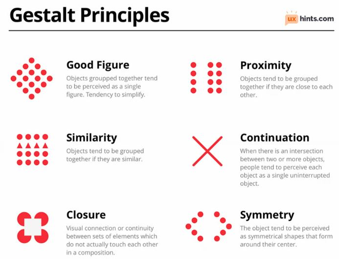

# Data Visualization Principles

**After this lesson:** you can explain Data Visualization Principles and try the examples in your own notebook.

> **Note:** This lesson is **concept-first**: it explains _how people see_ charts (pre-attentive vs attentive processing, Gestalt cues) before you lean on tool syntax. Use it with [Matplotlib basics](matplotlib-basics.md) when you implement ideas in code.

## Helpful video

Why bar charts beat pie charts, and the perceptual science behind choosing the right chart type.

## Understanding Visual Perception

Think of visual perception like reading a book. Just as your eyes quickly scan words and your brain processes them, your brain processes visual information in specific ways that we can use to create better visualizations.

### Why This Matters

* **Quick Processing**: Your brain processes visual information in milliseconds
* **Pattern Recognition**: You can spot patterns in images faster than in numbers
* **Memory**: Visual information is easier to remember than text
* **Understanding**: Complex relationships are clearer when visualized

## The Science Behind Visualization

### Pre-attentive Processing

Think of this as your brain's "first glance" processing:

* Happens in less than 250 milliseconds
* Automatic and parallel (processes multiple things at once)
* Detects basic visual properties like:
  * Color
  * Shape
  * Size
  * Position

### Attentive Processing

Think of this as your brain's "careful look" processing:

* Takes more than 250 milliseconds
* Requires focused attention
* Processes complex information
* Interprets meaning and relationships

_Design tip: if the insight you want viewers to notice is not pre-attentive (e.g. a length difference), use color or size to reinforce it._

## Visual Elements

### 1. Form Attributes

Think of these as the building blocks of your visualization:

#### Length

* **Bar Charts**: Like measuring the height of different buildings
* **Line Length**: Like comparing the length of different roads
* **Progress Bars**: Like showing how far you've run in a race

#### Size

* **Bubble Plots**: Like showing the population of different cities
* **Tree Maps**: Like showing the size of different files on your computer
* **Icon Size**: Like showing the importance of different features

#### Shape

* **Markers**: Like using different symbols on a map
* **Icons**: Like using different icons for different types of files
* **Symbols**: Like using different symbols for different categories

#### Enclosure

* **Boundaries**: Like drawing a circle around related items
* **Containers**: Like putting similar items in the same box
* **Groups**: Like organizing items into categories

### 2. Color Attributes

Think of colors as a language:

#### Hue (Color)

* **Categories**: Like using different colors for different types of fruit
* **Distinct Groups**: Like using different colors for different teams
* **Qualitative Data**: Like using different colors for different regions

#### Intensity (Brightness)

* **Sequential Data**: Like using darker colors for higher values
* **Heat Maps**: Like using color intensity to show temperature
* **Density Plots**: Like using color intensity to show concentration

#### Position

* **Coordinates**: Like plotting points on a map
* **Placement**: Like arranging items in a specific order
* **Alignment**: Like lining up items in a row

## Gestalt Principles

Think of these as the rules of visual organization:

### 1. Proximity

* Items that are close together are perceived as related
* Like grouping related items in a menu

### 2. Similarity

* Items that look similar are perceived as related
* Like using the same color for related items

### 3. Continuity

* The eye follows smooth, continuous lines
* Like following a path on a map

### 4. Closure

* The brain fills in missing parts of shapes
* Like seeing a complete circle even when part is missing

### 5. Figure/Ground

* The brain separates objects from their background
* Like seeing a person standing in front of a wall

## Chart Selection Framework

### 1. Comparison

Think of this as comparing different things:

#### Between Items

* **Few Items**: Bar Chart (like comparing heights)
* **Many Items**: Lollipop Chart (like comparing many values)
* **Over Time**: Line Chart (like tracking progress)

#### Distribution

Think of this as showing how data is spread:

#### Single Variable

* **Histogram**: Like showing the distribution of heights
* **Density Plot**: Like showing the concentration of data
* **Box Plot**: Like showing the range and outliers

#### Multiple Variables

* **Box Plots**: Like comparing distributions across groups
* **Violin Plots**: Like showing the shape of distributions
* **Ridge Plots**: Like showing multiple distributions

### 3. Relationship

Think of this as showing how things are connected:

#### Two Variables

* **Scatter Plot**: Like plotting height vs. weight
* **Line Plot**: Like showing how two things change together
* **Bubble Plot**: Like showing three variables at once

#### Many Variables

* **Parallel Coordinates**: Like showing many variables at once
* **Heat Map**: Like showing relationships between many things
* **Network Graph**: Like showing connections between items

## Color Theory

### 1. Color Schemes

Think of these as your color palettes:

#### Sequential

* Use for ordered data
* Like a thermometer (light to dark)
* Examples:
  * Light to dark blue
  * Yellow to red
  * Single hue progression

#### Diverging

* Use for data with a midpoint
* Like a weather map (hot to cold)
* Examples:
  * Red → White → Blue
  * Purple → White → Green
  * Diverging from neutral

#### Qualitative

* Use for categories
* Like different types of fruit
* Examples:
  * Distinct hues
  * Equal brightness
  * Maximum contrast

### 2. Accessibility Guidelines

Think of these as making your visualizations readable for everyone:

#### Colors

* Use colorblind-safe palettes
* Maintain sufficient contrast
* Provide alternative encodings

#### Text

* Use readable font sizes
* Create clear hierarchy
* Use high contrast labels

## Layout and Composition

### 1. Visual Hierarchy

Think of this as organizing information by importance:

#### Primary

* Key message or visual
* Like a headline in a newspaper

#### Secondary

* Supporting information
* Like subheadings in an article

#### Tertiary

* Details and context
* Like the body text of an article

### 2. Grid Systems

Think of this as organizing your layout:

#### 12-Column Grid

* Full Width: 12 columns
* Half Width: 6 columns
* Third Width: 4 columns
* Quarter Width: 3 columns

#### Spacing

* Margins: 24px
* Gutters: 16px
* Padding: 16px

## Common Pitfalls

### 1. Chart Junk

* Unnecessary decorative elements
* Like adding too many colors or patterns

### 2. Misleading Scales

* Inappropriate axis scales
* Like starting a scale from a non-zero point

### 3. Poor Color Choices

* Hard to distinguish colors
* Like using similar colors for different categories

### 4. Overcrowding

* Too much information
* Like trying to show everything at once

## Best Practices

### 1. Start with a Clear Purpose

* Know what you want to communicate
* Choose the right chart type
* Focus on your message

### 2. Keep it Simple

* Remove unnecessary elements
* Use clear labels
* Maintain consistent style

### 3. Consider Your Audience

* Use appropriate terminology
* Provide necessary context
* Make it accessible

### 4. Test Your Visualization

* Check for clarity
* Verify accuracy
* Get feedback

## Gotchas

* **Pre-attentive attributes lose their power when overused**: color pops out because everything else is grey; if you highlight five different categories in five bright colors, none of them are pre-attentive anymore and the viewer must read every element carefully, defeating the purpose.
* **Gestalt proximity can work against you in subplot grids**: when axes are spaced too tightly, viewers perceive the top and bottom panels as one chart rather than two separate ones; increase `hspace` in `plt.subplots` or add a visible divider so the grouping matches your intent.
* **Sequential color schemes are the wrong choice for categorical data**: using a blue gradient (light to dark) for unordered categories such as "Fruits", "Vegetables", "Grains" implies that darker means more or higher, misleading viewers; use a qualitative palette (equal brightness, distinct hues) for categories with no inherent order.
* **Chart junk and data-ink are separate problems**: removing a decorative 3D shadow reduces chart junk; adding a second grid line reduces data-ink ratio; conflating them causes people to remove useful elements (like reference lines) when they should only remove decorative ones.
* **The Figure/Ground principle means your background color becomes part of the message**: a dark background pushes bright data marks forward visually, which can increase perceived contrast but also makes small differences in similar colors harder to distinguish; test your chart on the actual background it will be displayed against.
* **Visual hierarchy is undone by uniform font sizes**: setting every text element (title, axis labels, tick labels, annotations) to the same `fontsize=12` removes the hierarchy that guides the viewer's eye; the title should be noticeably larger than axis labels, which should be noticeably larger than tick labels.

## Next steps

1. Apply these ideas in [Matplotlib basics](matplotlib-basics.md) and [Choosing the right visualization](../choosing-the-right-visualization.md).
2. Continue the module path in [3.1 README](./) and [3.2 Advanced data visualization](../3.2-adv-data-viz/).

Remember: The best visualizations are clear, informative, and tell a story. Focus on your message and let your data guide your design decisions.
