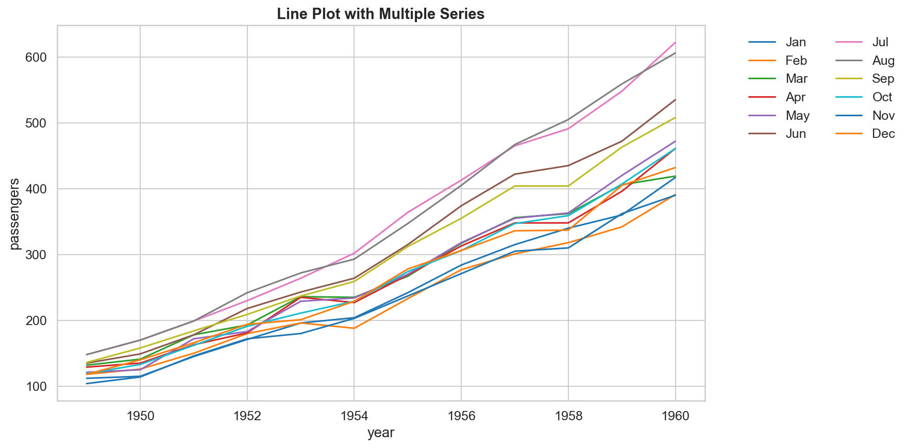
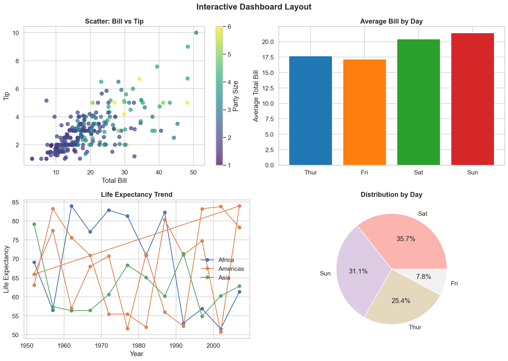

# Advanced Data Visualization

**After this submodule:** you can use the lessons linked below and complete the exercises that match **Advanced Data Visualization** in your course schedule.

## Overview

This submodule is **code-first**: you will write Python with **Seaborn** (statistical plots on top of Matplotlib) and **Plotly** (interactive charts and small dashboards). Think of it as moving from simple static plots to richer, exploratory, and interactive visuals, then applying them to time-based analysis and a realistic business case.

```yaml
Module Structure:
┌─────────────────────────┐
│ Statistical Analysis   │ → Seaborn Mastery
├─────────────────────────┤
│ Interactive Plots     │ → Plotly Excellence
├─────────────────────────┤
│ Time Series           │ → Trends, seasonality, events
├─────────────────────────┤
│ Real-world Projects   │ → Applied Learning
└─────────────────────────┘
```

## Prerequisites

* [3.1 Intro to data visualization](../3.1-intro-data-viz/): Matplotlib comfort and chart-choice basics.
* [3.1 Preparing data for visualization](../3.1-intro-data-viz/data-prep-for-visualization.md): chart-ready summaries and reshaping.
* Python environment with **matplotlib**, **pandas**, and (after install) **seaborn** and **plotly**.

## Which library for which job?

| Task                                                            | Use                      |
| --------------------------------------------------------------- | ------------------------ |
| Statistical exploration, distributions, correlation, regression | **Seaborn**              |
| Faceted views comparing many categories side by side            | **Seaborn**              |
| Charts that need zoom, hover, or interactive filtering          | **Plotly**               |
| Time series with a range slider or date-range buttons           | **Plotly**               |
| Browser-ready output or a stakeholder report                    | **Plotly**               |
| Static export for print or a slide deck                         | **Seaborn / Matplotlib** |

Rule of thumb: **Seaborn for understanding your data, Plotly for sharing it.**

## Why advanced visualization?

### Moving beyond a single static line

Compare a basic Matplotlib line to a Plotly scatter that encodes four extra dimensions, size, color, animation, and a trendline, all in one call.

Imports

Importing both `seaborn` and `plotly.express` sets up the two main advanced visualization libraries.

Basic Matplotlib Plot

Two lines with no color, animation, or interactivity, the baseline for comparison.

Advanced Plotly Scatter

`size`, `color`, `animation_frame`, and `hover_data` encode four dimensions in one interactive chart; `trendline='ols'` adds a regression line.

### Key capabilities

#### 1. Complex story simplification

Multi-panel facets, layered annotations, and interactive filters let a single chart carry information that would otherwise need three separate charts.

```yaml
Techniques:
  Multi-dimensional:
    - Bubble plots
    - 3D visualizations
    - Faceted plots

  Interactive:
    - Zoom/Pan
    - Tooltips
    - Filters

  Layered:
    - Multiple plots
    - Overlays
    - Annotations
```

#### 2. Interactive and real-time patterns

A Plotly figure with an animation-style control, a useful starting pattern for streaming dashboards.

<figure><figcaption><p>Figure 1: Generated visualization</p></figcaption></figure>

Figure Initialization

A blank `go.Figure()` is the canvas; traces and layout are added incrementally.

Live Trace

An empty `go.Scatter` with `x=[], y=[]` is a placeholder; `update_data` populates it when new frames arrive.

Update Callback

Replaces the trace's `x` and `y` arrays in place; wire this to your data source or Dash callback for streaming.

Play Button

`updatemenus` adds an animation-style Play button; `method: "animate"` triggers Plotly's built-in frame stepping.

#### 3. Statistical communication

One 2×2 Seaborn panel covering the four most common statistical views, distribution, box, regression, and time series, in a single figure.

<figure><figcaption><p>Figure 1: Generated visualization</p></figcaption></figure>

2×2 Grid Setup

`plt.subplots(2, 2)` unpacks four axes into named variables so each panel can be targeted independently.

Stacked Histogram

`multiple="stack"` stacks category bars rather than overlapping them, keeping the total height meaningful.

Box Plot and Regression

The box plot summarizes per-category spread; `regplot` overlays a scatter plus OLS trend line in a single call.

Time Series Panel

`hue` and `style` together differentiate categories by both color and line dash, aiding color-blind readers.

## Module content

### 1. Statistical Visualization with Seaborn

Topics covered in [seaborn-guide.md](seaborn-guide.md):

```yaml
Topics:
  Distribution Analysis:
    - Histograms and KDE
    - Box and Violin plots
    - ECDF plots

  Relationship Analysis:
    - Scatter plots
    - Regression plots
    - Pair plots

  Categorical Analysis:
    - Bar plots
    - Count plots
    - Strip plots

  Matrix Analysis:
    - Heat maps
    - Cluster maps
    - Joint plots
```

### 2. Interactive Visualization with Plotly

Topics covered in [plotly-guide.md](plotly-guide.md):

```yaml
Features:
  Basic Interactivity:
    - Zoom/Pan
    - Hover tooltips
    - Click events

  Advanced Features:
    - Animations
    - Custom controls
    - Real-time updates

  Dashboard Creation:
    - Multiple plots
    - Linked views
    - Dynamic filtering
```

## Learning path

This submodule has two lessons followed by two applied pieces. Complete them in order, each builds on the previous.

### Lesson 1: Seaborn: statistical visualization

Start here. The Seaborn guide covers environment setup, all major chart families, and best practices for exploratory and academic output.

A one-time environment setup aligning Seaborn theme, Matplotlib `rcParams`, and Plotly's default template, run once per notebook kernel.

<figure><figcaption><p>Figure 1: Generated visualization</p></figcaption></figure>

Seaborn Theme

`sns.set_theme` applies a global style, palette, and font scale that affects all subsequent Seaborn and Matplotlib figures.

rcParams Update

`plt.rcParams.update` overrides default figure size, DPI, and font sizes, run once per notebook kernel.

Plotly Template

Setting `pio.templates.default` to `"plotly_white"` gives all Plotly figures a clean white background by default.

### Lesson 2: Plotly: interactive visualization

Move here after Seaborn. The Plotly guide adds hover, animation, and web-ready output on top of the statistical understanding you built in Lesson 1.

The example below shows Seaborn's composable `JointGrid` API, a good bridge concept before moving into Plotly's figure-and-trace model.

<figure><figcaption><p>Figure 1: Generated visualization</p></figcaption></figure>

JointGrid Setup

`JointGrid` creates a central joint plot area with marginal axes for per-variable distributions.

Joint and Marginals

`plot_joint` fills the central scatter; `plot_marginals` fills the side histograms, both color by `hue`.

Regression Overlay

`scatter=False` draws only the OLS line onto `g.ax_joint` without duplicating the scatter points.

### Applied practice

After completing both lessons, work through the two applied pieces in order:

* [**Time series visualization**](time-series-visualization.md): apply both libraries to trend analysis, rolling averages, and event annotation on the built-in `flights` dataset.
* [**Real-world case study**](real-world-case-study.md): connect data prep, chart selection, and recommendation writing in one end-to-end e-commerce analysis.

The following shows a `make_subplots` dashboard combining mixed trace types, a preview of what the Plotly guide and case study build toward.

<figure><figcaption><p>Figure 1: Generated visualization</p></figcaption></figure>

Mixed Subplot Types

`specs` declares each cell's chart type-`scatter3d`, `heatmap`, and `bar` can coexist in one figure.

3D Scatter Trace

`add_trace(..., row=1, col=1)` places the 3D scatter into the top-left cell; repeat for other cells with different trace types.

Interaction Modes

`clickmode='event+select'` enables lasso/box selection for cross-filtering; `hovermode='closest'` pins tooltips to the nearest point.

## Best practices

### 1. Performance Optimization

Cap total rows by stratified sampling per category so large class imbalance does not disappear.

```python
def optimize_visualization(data, max_points=10000):
    """Optimize visualization for large datasets"""
    if len(data) > max_points:
        # Stratified sampling
        sampled = data.groupby('category').apply(
            lambda x: x.sample(min(len(x), max_points//len(data.category.unique())))
        ).reset_index(drop=True)
        return sampled
    return data
```

### 2. Design Excellence

High-level checklist spanning color, layout, and interaction, applies to Python and BI tools.

```yaml
Principles:
  Color Usage:
    - Purposeful encoding
    - Accessibility
    - Consistency

  Layout:
    - Clear hierarchy
    - White space
    - Alignment

  Interactivity:
    - Intuitive controls
    - Responsive feedback
    - Performance
```

## Recommended sequence

1. Start with [Seaborn guide](seaborn-guide.md) for statistical views and cleaner defaults.
2. Move to [Plotly guide](plotly-guide.md) for interactivity, hover detail, and browser-ready output.
3. Use [Time series visualization](time-series-visualization.md) for trends, rolling averages, and event markers.
4. Finish with [Real-world case study](real-world-case-study.md) to connect chart choice, data prep, and recommendation writing.

## Assignment

When you are ready, use the [module assignment](../assignments/module-assignment.md) (covers the full Module 3 scope).

## Resources

### Documentation

* [Seaborn Documentation](https://seaborn.pydata.org/)
* [Plotly Python](https://plotly.com/python/)
* [Matplotlib](https://matplotlib.org/)

### Tutorials

* [Seaborn Gallery](https://seaborn.pydata.org/examples/index.html)
* [Plotly Examples](https://plotly.com/python/plotly-express/)
* [Interactive Visualization](https://plotly.com/python/interactive-html-export/)

### Books

* "Python Data Visualization" by Mario Döbler
* "Interactive Data Visualization" by Scott Murray
* "Fundamentals of Data Visualization" by Claus Wilke

Remember: Advanced visualization is about finding the perfect balance between complexity and clarity. Always start with your data story, then choose the visualization techniques that best tell that story.
