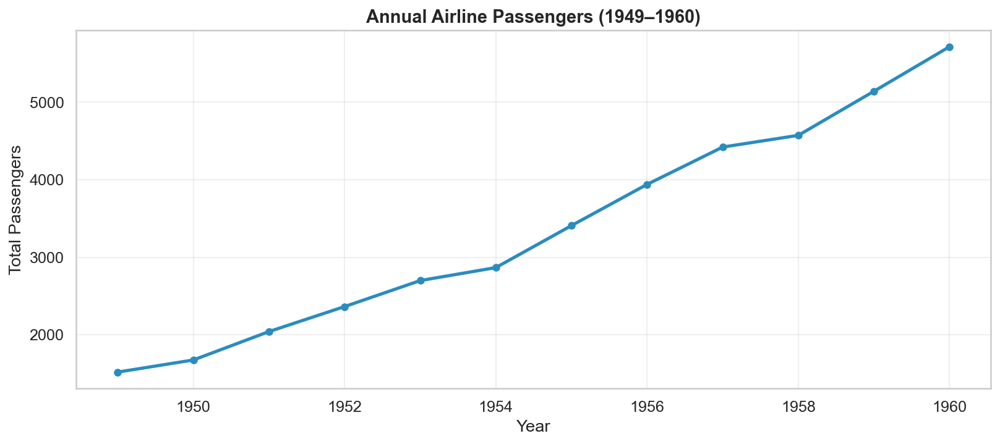
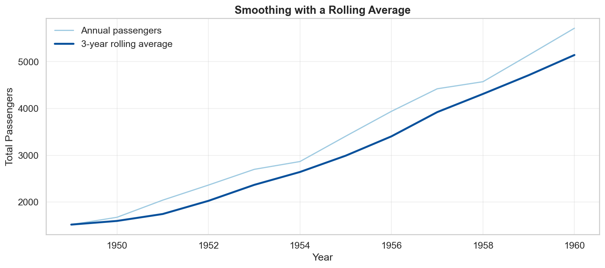
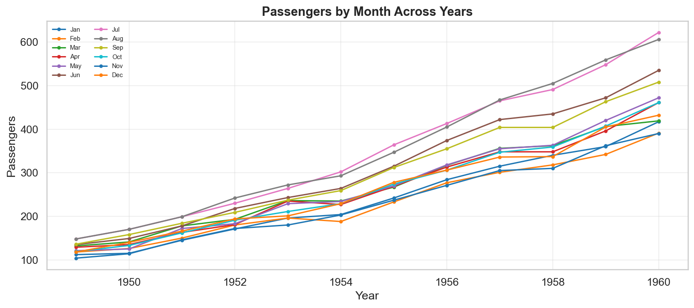
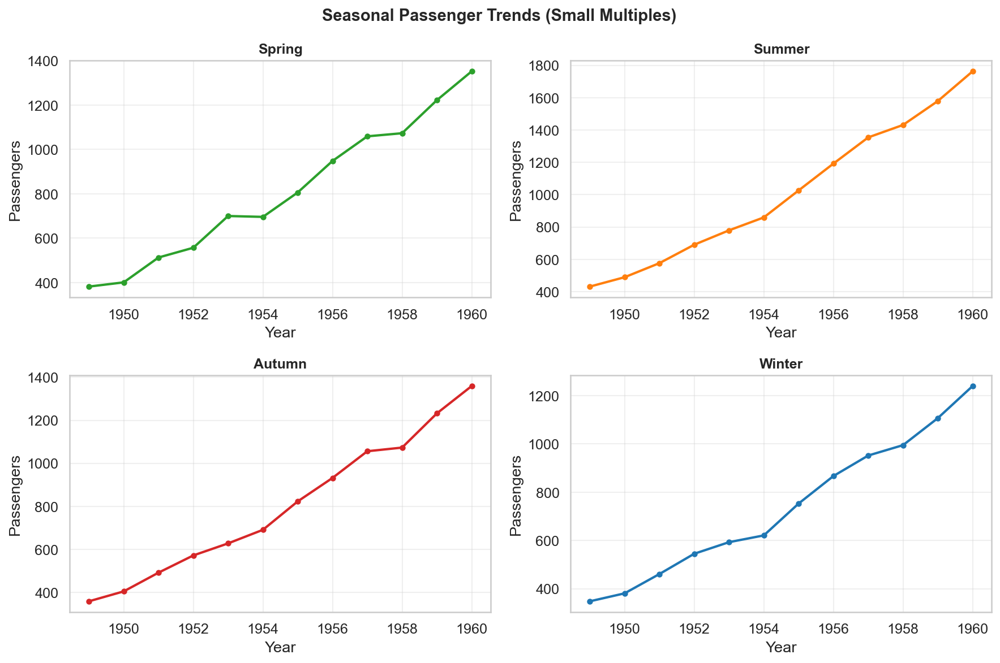
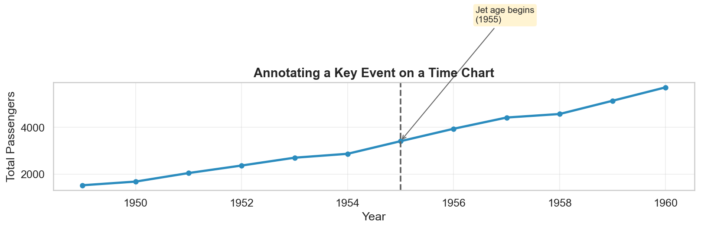

# Time Series Visualization

**After this lesson:** you can prepare and plot time-based data clearly, choose suitable time intervals, and annotate trends, seasonality, and events without misleading the viewer.

> **Note:** Build on [Matplotlib basics](../3.1-intro-data-viz/matplotlib-basics.md) first, then apply the richer styling and interactivity from the [Seaborn guide](seaborn-guide.md) and [Plotly guide](plotly-guide.md).

## What makes time data different?

Most charts treat data points as independent, swap two bars in a bar chart and the story barely changes. Time series data is different: the **order matters**.

Think about tracking monthly sales. If you accidentally sort by value instead of date, you'd see a perfectly smooth curve, and completely miss the seasonal dip in January. Or imagine comparing this month's revenue to last month's when this month isn't over yet. The chart would make things look worse than they are.

These are the specific traps time data sets for you:

* **Order matters**: points have a direction; swapping two values changes the story
* **Gaps matter**: a missing week is not the same as a zero week
* **Aggregation level matters**: daily data looks noisy; monthly data hides spikes
* **Partial periods mislead**: comparing an incomplete month to full months makes recent data look worse

This lesson shows you how to avoid each of these, and how to build charts that communicate time-based trends clearly.

## Setup

The examples below use the `flights` dataset, monthly airline passengers from 1949 to 1960. It is built into Seaborn so there is nothing to download.

Imports and theme

Set `sns.set_theme` once at the top so all charts in the session share the same grid, font, and colour palette.

Build a datetime column

The flights dataset stores months as strings ("Jan", "Feb"…). Map them to integers first, then use `pd.to_datetime(dict(...))` to build a proper date. This enables resampling, rolling windows, and time-based groupby.

Sort immediately

Always sort by date right after parsing. Rolling averages, resampling, and line plots all assume chronological order, unsorted data produces wrong results silently.

Annual rollup

Aggregating to annual totals reduces 144 monthly rows to 12 yearly rows, cleaner for the first trend chart, where the broad direction matters more than monthly detail.

## Choose the right time grain

Match the aggregation level to the question being asked.

| Question                          | Grain to use         |
| --------------------------------- | -------------------- |
| Is the server behaving right now? | Hourly or minute     |
| Is this week better than last?    | Daily                |
| What is the trend this quarter?   | Weekly               |
| How did we do this year?          | Monthly or quarterly |

resample

`resample` requires the date column to be the index. `"QS"` means quarter-start, each output row represents one quarter. Other useful offsets: `"W"` (weekly), `"MS"` (month-start), `"A"` (annual).

Two rules before publishing any time chart:

1. Do not compare a partial current period to complete prior periods, either exclude it or label it clearly.
2. Explain missing periods instead of silently skipping them.

## Basic time series patterns

### 1. Trend line

The simplest useful time chart: one line, clear axes, no clutter.

Figure size

`figsize=(11, 5)` gives a wide, shallow aspect ratio, the standard for time series because it makes horizontal trends easier to follow than a square chart.

Markers on a line

`marker="o"` places a dot at each data point. With annual data (12 points) the dots help the reader count years. With hundreds of daily points, omit them to avoid clutter.

Grid opacity

`alpha=0.3` makes the grid lines faint. The grid should help the reader estimate values, it should never compete with the data line for attention.

The upward slope is immediately obvious. A plain line is usually the right starting point, add complexity only when the data demands it.

### 2. Rolling average

Raw data often has short-term noise that hides the longer trend. A rolling average smooths this out.

rolling().mean()

`window=3` averages the current year and the two preceding years. `min_periods=1` prevents the first two rows from becoming NaN, useful when your series starts at a hard boundary.

Two-line contrast

Make the raw series light and thin, the smoothed series dark and thick. The reader immediately understands which carries the main message and which is context.

Keep the original series visible, if you only show the smoothed line, you hide information that may matter (like a sudden spike or a missing period).

### 3. Multiple series

Compare groups on the same time axis, but only when the number of lines is manageable (roughly five or fewer). Beyond that, use small multiples.

Colour palette

`sns.color_palette("tab10", n_colors=12)` returns 12 visually distinct colours. Access them by index inside the loop so each month gets a consistent colour throughout the session.

groupby loop

Looping over `groupby("month_num")` gives one subset per month in numeric order. `month_df["month"].iloc[0]` retrieves the abbreviated month name for the legend label.

Compact legend

`fontsize=7` and `ncol=2` fit 12 month labels into two columns without overflowing the chart. With this many series, the chart is already at the limit, use small multiples if you need more.

With 12 months the legend is already crowded. This is the point where small multiples become the better choice.

## Small multiples for clarity

When you have too many series for one chart, split them into separate panels. The viewer can compare patterns across panels without the lines overlapping.

Season mapping

A dictionary maps month numbers to season names. `flights["month_num"].map(season_map)` applies it in one step, no loops needed.

Seasonal aggregation

Group by year and season, then sum passengers. This collapses the 12-month series into four seasonal series, much easier to show in small multiples.

relplot with col

`col="season"` creates one panel per season automatically. `col_wrap=2` wraps after two panels so you get a 2×2 grid. `sharey=False` lets each panel use its own y-axis scale, important when summer totals are much larger than winter totals.

Each season gets its own panel. The growth trend is visible in every panel, and summer's higher absolute numbers do not visually dominate the others because `sharey=False` lets each panel scale independently.

## Annotating events

A vertical line at an event date often tells more of the story than the data alone.

axvline

`ax.axvline` draws a vertical line across the full y-axis at the given x-position. Use a dashed style and a neutral grey so it reads as context rather than data.

annotate

`xy` is where the arrow points; `xytext` is where the label sits. Separate them so the label does not overlap the line. `bbox` adds a light background that makes the text readable over the chart grid.

The annotation explains _why_ growth accelerated, without it the reader has to guess. Always prefer annotation directly on the chart over a caption below it.

## Plotly for interactive exploration

Plotly is useful when your audience needs to zoom in, hover for exact values, or explore a date range themselves.

px.line

`px.line` is the Plotly Express equivalent of Matplotlib's `ax.plot`. The `labels` dict replaces column names with readable strings in the axis and hover tooltip.

Range slider

`rangeslider_visible=True` adds a miniature navigator below the x-axis. The viewer can drag the handles to zoom into any time window without writing any code.

Tick format

`tickformat=","` adds thousand-separator commas to large numbers (e.g. 15,000 instead of 15000). For percentages use `".1%"`; for currency use `"$,.0f"`.

The range slider at the bottom lets the viewer drag to focus on any window. Use Plotly for dashboards and stakeholder reports where the audience will explore the data, use Matplotlib/Seaborn for static reports and presentations.

## Common mistakes

* Comparing an incomplete current period to complete prior periods, the current period will always look worse.
* Connecting points across missing dates without noting the gap.
* Putting more than \~5 series on one chart, use small multiples instead.
* Adding a second y-axis when normalising or using separate panels would be clearer.
* Over-smoothing and hiding important volatility.

## A practical checklist

Before publishing a time chart:

1. Are the dates parsed and sorted?
2. Is the aggregation level appropriate for the question?
3. Are incomplete periods excluded or clearly labelled?
4. Would a rolling average help, and if so, is the raw series still visible?
5. Are key events marked directly on the chart?

## Practice prompts

1. Turn the monthly `flights` data into quarterly totals and compare readability with the monthly version.
2. Add a 6-month rolling average to the monthly series and keep the raw line visible.
3. Replace the 12-line month chart above with a `sns.relplot` small-multiples version grouped by month instead of season.
4. Pick a year and annotate it with a made-up event label. What does the annotation make the viewer assume?

## Gotchas

* **`resample()` silently produces wrong results if the date column is not the index**: you must call `.set_index("date")` before `.resample("MS")`. If you forget, pandas raises a `TypeError`; but if your index happens to be a DatetimeIndex from a prior operation, resample runs without complaint on the wrong column.
* **`rolling(window=3)` without `min_periods=1` fills the first N-1 rows with NaN**: this is the correct statistical behaviour, but it means your smoothed line starts later than your raw line on the chart. The gap looks like missing data to an audience. Always decide explicitly: fill early NaNs with `min_periods=1` or drop them and annotate the chart.
* **`pd.to_datetime()` with ambiguous formats guesses month/day order based on locale**: the string `"01/02/2025"` becomes January 2nd in US locale and February 1st in European locale. Pass `dayfirst=True` or `format="%d/%m/%Y"` explicitly when your data source is ambiguous.
* **A second y-axis makes percentage-point differences appear identical to absolute differences**: synchronising two y-axes is technically available in both Matplotlib and Plotly, but the visual scale mismatch routinely misleads audiences into thinking two trends are more correlated than they are. Use separate panels or normalise to a common scale instead.
* **Comparing a partial current period to full prior periods makes recency look worse**: if the current month is only half over, its bar or line point will sit below prior complete months even if the pace is identical. Always exclude incomplete periods or label them with "(partial)" directly on the chart.
* **`line_shape='spline'` in Plotly interpolates between data points, inventing values that never existed**: a spline curve implies continuity and can show a dip or peak between two real points that isn't in your data. Use `line_shape='linear'` for factual time series; spline is for aesthetics only.

## Next steps

1. [Plotly guide](plotly-guide.md), richer interactive controls for time exploration.
2. [Real-world case study](real-world-case-study.md), combine time trends with category and distribution views.
3. [3.4 Data storytelling](../3.4-data-storytelling/), turn a time-based analysis into a stakeholder narrative.
