# Learning Power BI Through a Real Example: SuperStore Analysis

## Getting Started

### 1. Opening Power BI and Connecting to Data

1. Launch Power BI Desktop
2. On the start page, click "Get Data"
3. Select "Excel" from the data sources
4. Navigate to your Power BI samples folder:
   - Path: `Documents/Power BI Desktop/Samples/`
   - Select "Sample - Superstore.xlsx"
5. Click "Load" to import the dataset

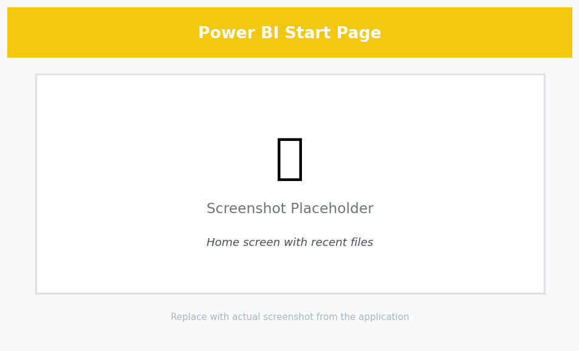
*Caption: The Power BI start page showing the Get Data option.*

### 2. Understanding the Power BI Workspace

The Power BI interface consists of several key areas:

1. **Report View**
   - Main canvas for creating visualizations
   - Multiple pages for different analyses
   - Formatting options in the right pane

2. **Data View**
   - Shows the imported data tables
   - Allows data cleaning and transformation
   - Displays data types and values

3. **Model View**
   - Shows table relationships
   - Allows relationship management
   - Displays data model structure

4. **Panels**
   - **Visualizations**: Chart types and formatting options
   - **Fields**: Available data fields
   - **Filters**: Filtering options
   - **Format**: Visual formatting controls

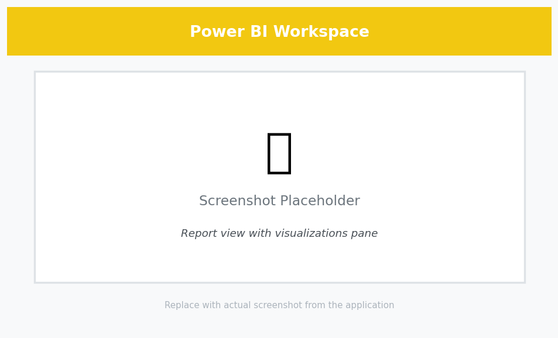
*Caption: The Power BI workspace showing key areas and their functions.*

## Project Overview

In this comprehensive case study, we'll analyze retail data to drive business decisions. By the end of this tutorial, you will create:

- A dynamic sales performance dashboard
- A geographical distribution analysis
- A product profitability analysis
- Interactive filters and drill-downs


*Caption: The complete dashboard we'll build, showing sales trends, geographical distribution, and product performance.*

## Dataset Introduction

We'll utilize the "Sample - Superstore" dataset included with Power BI. This dataset is ideal for learning because:

- It contains clean, pre-formatted data
- It includes realistic business scenarios
- It's readily available in Power BI
- It covers multiple analysis dimensions


*Caption: The Sample Superstore dataset in Power BI, showing the tables and their relationships.*

### Data Structure Overview

The dataset consists of four primary tables:

```yaml
Data Structure:
1. Orders Table:
   Primary Fields:
   - Order ID (Primary Key)
   - Order Date (Date/Time)
   - Ship Date (Date/Time)
   - Ship Mode (String)
   - Customer ID (Foreign Key)
   - Product ID (Foreign Key)
   - Quantity (Integer)
   - Sales (Decimal)
   - Profit (Decimal)
   
   Additional Metadata:
   - Row Count: ~9,000
   - Date Range: 4 years
   - NULL handling: No nulls
   
2. Products Table:
   Primary Fields:
   - Product ID (Primary Key)
   - Category (String)
   - Sub-Category (String)
   - Product Name (String)
   
   Classification:
   - Categories: 3
   - Sub-Categories: 17
   - Products: ~1,500

3. Customers Table:
   Primary Fields:
   - Customer ID (Primary Key)
   - Customer Name (String)
   - Segment (String)
   - Region (String)
   
   Segmentation:
   - Customer Types: 3
   - Regions: 4
   - States: 48

4. Returns Table (Optional):
   Primary Fields:
   - Order ID (Foreign Key)
   - Return Status (Boolean)
   
   Statistics:
   - Return Rate: ~10%
   - Tracking Period: Full dataset
```

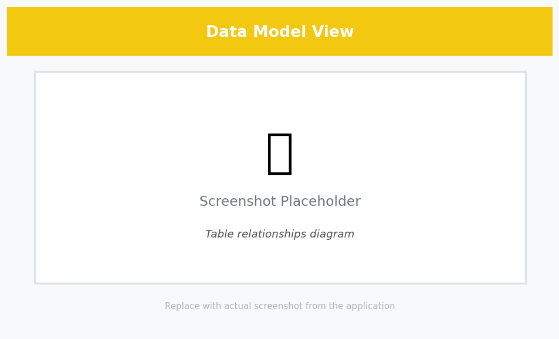
*Caption: The Data Model view showing table relationships and field properties.*

## Step-by-Step Visualization Guide

### 1. Creating Your First Chart: Sales by Category

1. In the Report view, click on a blank area of the canvas
2. In the Visualizations pane, select "Clustered Column Chart"
3. In the Fields pane:
   - Drag "Category" to the Axis field well
   - Drag "Sales" to the Values field well
4. To enhance:
   - Click on the chart to access formatting options
   - Add data labels from the Format pane
   - Customize colors and title


*Caption: Creating a basic column chart showing sales by category.*

### 2. Time Series Analysis

#### Line Chart with Multiple Measures

1. Create a new page (click the "+" icon at bottom)
2. Select "Line Chart" from Visualizations
3. Basic Setup:
   - Drag "Order Date" to Axis
   - Drag "Sales" to Values
   - Click "Add to existing values" and add "Profit"
4. Customization:
   - Format lines in the Format pane
   - Add markers for data points
   - Configure dual axis in the Format pane
   - Add reference lines from Analytics pane

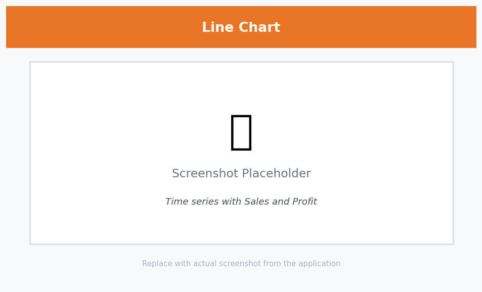
*Caption: Setting up a line chart with multiple measures for sales and profit.*

### 3. Geographic Analysis

#### Creating a Map Visualization

1. Create a new page
2. Select "Map" from Visualizations
3. Basic Setup:
   - Drag "State" to Location
   - Drag "Sales" to Size
   - Drag "Profit" to Color
4. Customization:
   - Adjust color gradient in Format pane
   - Add data labels
   - Configure tooltips
   - Add reference lines


*Caption: Creating a map visualization showing sales by state.*

### 4. Building a Dashboard

1. Arrange your visualizations on the canvas
2. Add a title using the Text Box tool
3. Adding Interactivity:
   - Set up cross-filtering in the Format pane
   - Add slicers from the Visualizations pane
   - Configure drill-through options
   - Set up bookmarks for different views


*Caption: Building a dashboard with multiple visualizations and interactive elements.*

## Advanced Features

### 1. DAX Measures

1. Creating a Basic Measure:
   - Click "New Measure" in the Modeling tab
   - Enter formula: `Profit Ratio = DIVIDE(SUM([Profit]), SUM([Sales]))`
   - Click the checkmark to save

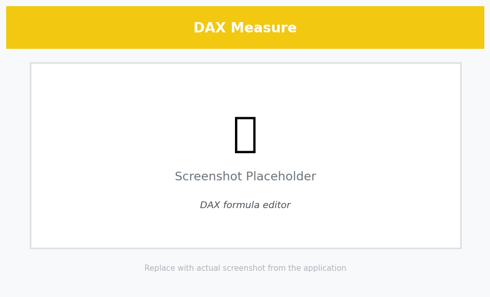
*Caption: Creating a DAX measure for profit ratio.*

### 2. Parameters

1. Creating a Parameter:
   - Go to Modeling tab
   - Click "New Parameter"
   - Configure settings (data type, range, etc.)
   - Click OK
2. Using the Parameter:
   - Add parameter control to report
   - Use in measures or filters


*Caption: Setting up a parameter for dynamic filtering.*

## Tips and Best Practices

1. **Data Organization**
   - Use consistent naming conventions
   - Create a clear folder structure in Fields pane
   - Document measures and calculations

2. **Performance**
   - Use DirectQuery for large datasets
   - Optimize DAX calculations
   - Limit the number of visuals per page

3. **User Experience**
   - Add clear instructions using text boxes
   - Include tooltips
   - Test on different screen sizes
   - Use bookmarks for guided analysis

## Saving and Publishing

1. Save your report:
   - File > Save As
   - Choose location and name
   - Select file type (.pbix)

2. Publishing options:
   - Publish to Power BI Service
   - Export as PDF/image
   - Share via Power BI Service
   - Create Power BI Apps

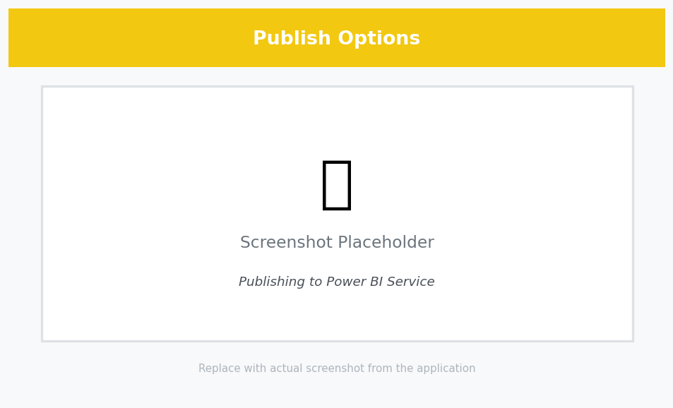
*Caption: Various options for saving and publishing your Power BI report.*

## Next Steps

1. Explore more advanced visualizations
2. Learn about Power Query transformations
3. Practice with different datasets
4. Join the Power BI community
5. Explore Power BI Service features

Remember: Practice makes perfect! Try recreating these visualizations and experiment with different options to build your Power BI skills.

## Power Query Transformations

### 1. Data Cleaning and Preparation

1. Access Power Query Editor:
   - Click "Transform Data" in the Home tab
   - Or right-click a table and select "Edit Query"

2. Common Transformations:
   - Remove duplicates
   - Split columns
   - Change data types
   - Create calculated columns
   - Merge queries
   - Pivot/unpivot data

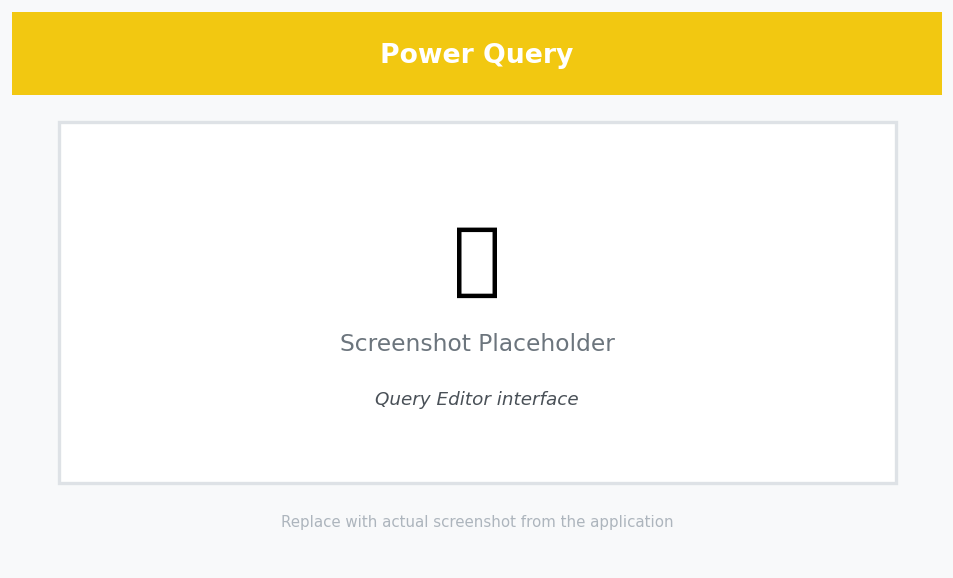
*Caption: The Power Query Editor interface showing transformation options.*

### 2. Advanced Data Modeling

1. Creating Hierarchies:
   - Right-click fields in the Fields pane
   - Select "Create Hierarchy"
   - Add related fields (e.g., Category > Sub-Category > Product)

2. Setting Up Relationships:
   - Go to Model view
   - Drag fields between tables to create relationships
   - Configure relationship properties (cardinality, cross-filter direction)


*Caption: Setting up hierarchies and relationships in the data model.*

## Advanced Visualizations

### 1. Custom Visuals

1. Adding Custom Visuals:
   - Click "..." in Visualizations pane
   - Select "Get More Visuals"
   - Browse and install from AppSource

2. Popular Custom Visuals:
   - Chiclet Slicer
   - Drill Down Combo PRO
   - Smart Filter PRO
   - Zebra BI Tables

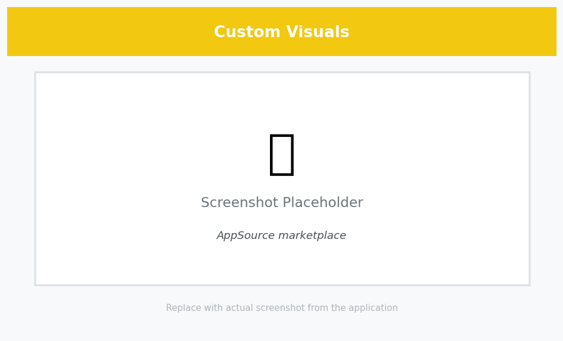
*Caption: Adding and using custom visuals from AppSource.*

### 2. Advanced Chart Types

1. Decomposition Tree:
   - Select "Decomposition Tree" from Visualizations
   - Add measure to Analyze
   - Add dimensions to Explain by
   - Configure drill-down options

2. Key Influencers:
   - Select "Key Influencers" visual
   - Add target measure
   - Add potential influencers
   - Configure analysis settings


*Caption: Using advanced chart types like Decomposition Tree and Key Influencers.*

## Advanced DAX Patterns

### 1. Time Intelligence Functions

```dax
// Year-to-Date Sales
YTD Sales = 
CALCULATE(
    SUM([Sales]),
    DATESYTD('Date'[Date])
)

// Previous Year Comparison
PY Sales = 
CALCULATE(
    SUM([Sales]),
    SAMEPERIODLASTYEAR('Date'[Date])
)

// Moving Average
MA Sales = 
AVERAGEX(
    DATESINPERIOD(
        'Date'[Date],
        LASTDATE('Date'[Date]),
        -3,
        MONTH
    ),
    [Sales]
)
```

### 2. Advanced Filter Context

```dax
// Top N Products by Category
Top N Products = 
VAR N = 5
RETURN
CALCULATE(
    SUM([Sales]),
    TOPN(
        N,
        VALUES(Products[Product Name]),
        [Sales],
        DESC
    )
)

// Dynamic Segmentation
Customer Segment = 
SWITCH(
    TRUE(),
    [Sales] > 10000, "High Value",
    [Sales] > 5000, "Medium Value",
    "Low Value"
)
```

## Power BI Service Features

### 1. Workspace Management

1. Creating Workspaces:
   - Access Power BI Service
   - Create new workspace
   - Configure access and roles
   - Set up data gateway

2. Content Management:
   - Schedule data refresh
   - Configure data alerts
   - Set up data lineage
   - Manage permissions

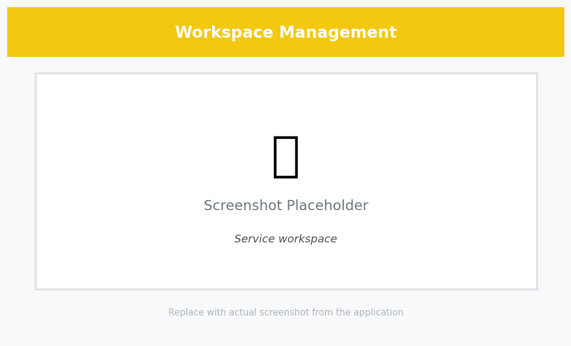
*Caption: Managing workspaces and content in Power BI Service.*

### 2. Collaboration Features

1. Sharing and Collaboration:
   - Publish to web
   - Share dashboards
   - Create apps
   - Set up row-level security

2. Mobile Experience:
   - Configure mobile layout
   - Set up push notifications
   - Optimize for mobile viewing
   - Enable offline access


*Caption: Sharing and collaboration options in Power BI Service.*

## Performance Optimization

### 1. Query Optimization

1. Best Practices:
   - Use DirectQuery for large datasets
   - Implement incremental refresh
   - Optimize DAX calculations
   - Use query folding

2. Monitoring:
   - Use Performance Analyzer
   - Check query execution times
   - Monitor refresh performance
   - Analyze storage usage

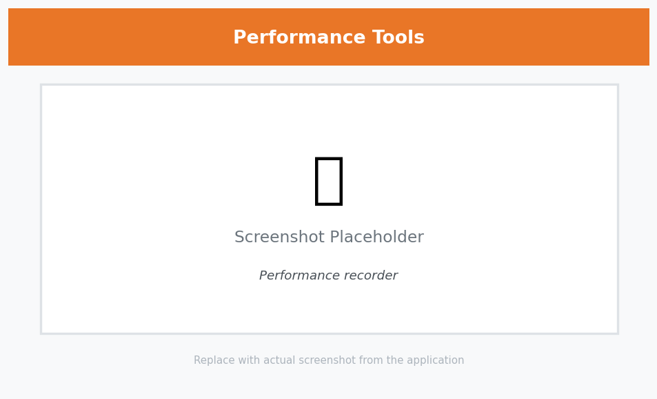
*Caption: Using Power BI's performance monitoring tools.*

### 2. Data Refresh Strategies

1. Scheduled Refresh:
   - Configure refresh schedule
   - Set up gateway
   - Monitor refresh history
   - Handle refresh failures

2. Incremental Refresh:
   - Define range parameters
   - Set up refresh policy
   - Configure archive settings
   - Monitor refresh performance

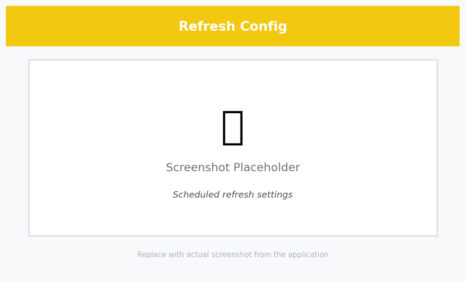
*Caption: Setting up and monitoring data refresh in Power BI.*

## Security and Governance

### 1. Row-Level Security

1. Implementing RLS:
   - Create security roles
   - Define DAX filters
   - Test security rules
   - Deploy to service

2. Dynamic Security:
   - User-based filters
   - Organization-based filters
   - Time-based filters
   - Custom security rules

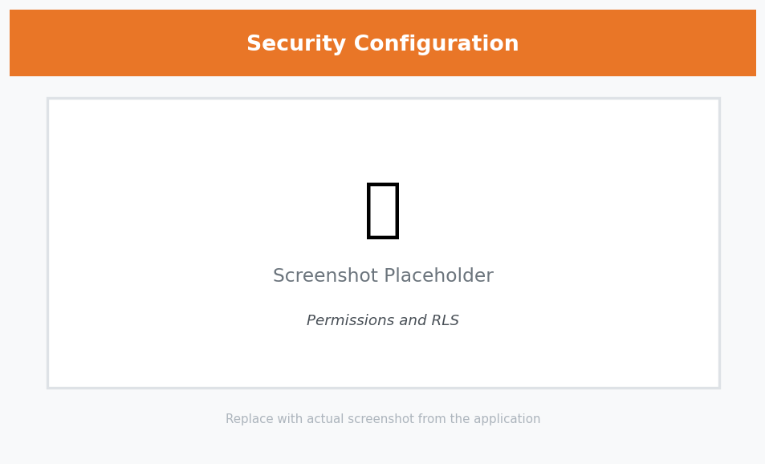
*Caption: Setting up row-level security in Power BI.*

### 2. Data Governance

1. Compliance Features:
   - Sensitivity labels
   - Data classification
   - Audit logs
   - Compliance reports

2. Monitoring:
   - Usage metrics
   - Performance monitoring
   - Security monitoring
   - Compliance reporting

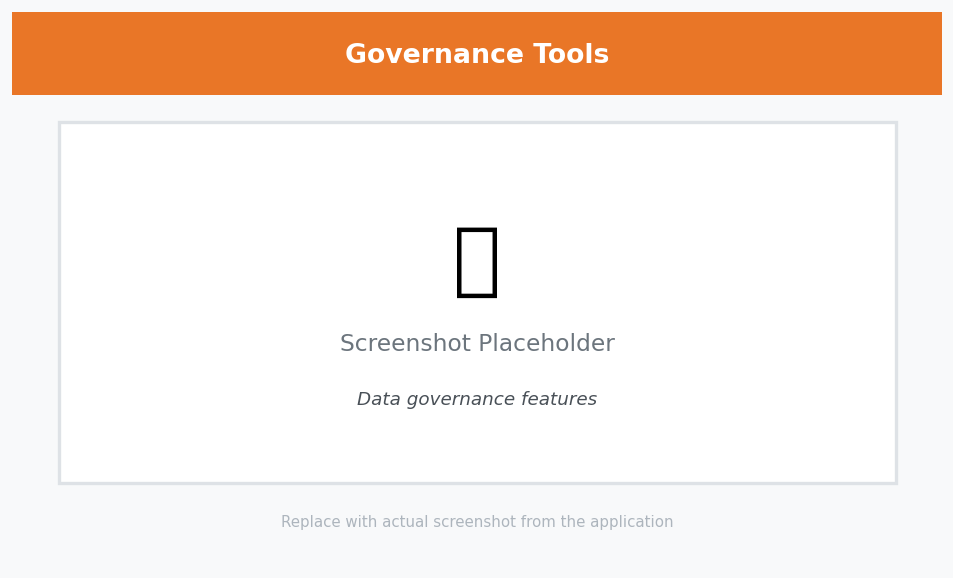
*Caption: Power BI's governance and compliance features.*
