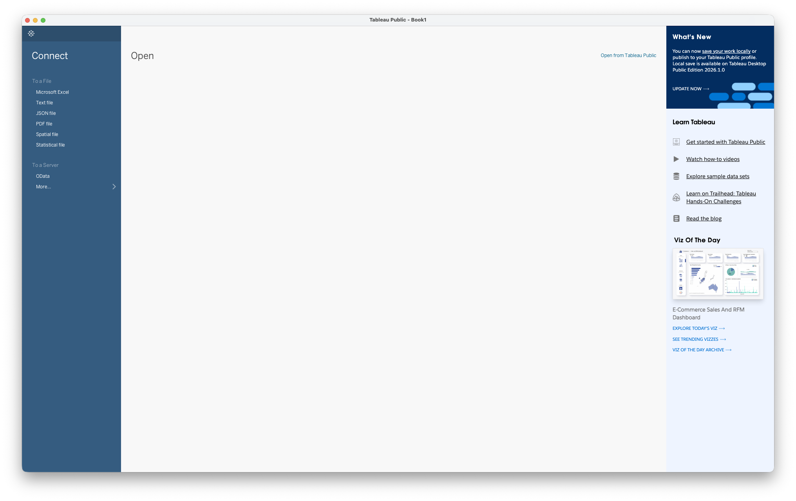

# Tableau Basics: Sample Superstore Guide

You will build an interactive dashboard that lets a manager explore sales trends by region and category in seconds. No coding, no SQL, pure point-and-click analytics. By the end, you'll have a working Tableau dashboard you built yourself from a real retail dataset.

**After this lesson:** you can explain Tableau Basics: Sample Superstore Guide and try the examples in your own notebook.

> **Note:** This submodule is **UI-first**. You will follow clicks and shelves in Tableau Desktop rather than writing Python for the main workflow.

## Helpful video

Short Tableau Public install; pair with the written guides in this folder.

## Introduction to Tableau with Sample Superstore

Tableau is a powerful data visualization tool that enables interactive analytics and visualizations. The Sample Superstore dataset is a built-in dataset that simulates a retail business, making it ideal for learning Tableau's features and capabilities. This guide covers:

* Tableau's intuitive visualization interface
* Real-time data analysis without coding
* Interactive dashboard creation
* Advanced visualization techniques

### Prerequisites

1. **Required Components:**
   * Tableau Desktop Public Edition 2026.1 or newer
   * Basic understanding of data analysis
   * Familiarity with business metrics
2. **System Requirements:**
   * Windows 10/11 or macOS 13 (Ventura) or newer
   * 8GB RAM minimum (16GB recommended)
   * 2GB free disk space
   * Modern multi-core processor (Apple Silicon supported)

### Beginner's Mental Model

Before you touch Tableau, get these six concepts in your head. Everything else is just applying them.

| Concept     | What it is                          | Real example                                |
| ----------- | ----------------------------------- | ------------------------------------------- |
| Dimension   | A category to group by (blue pills) | Region, Product Category, Order Date        |
| Measure     | A number to calculate (green pills) | Sales, Profit, Quantity                     |
| Shelf       | A drop zone where you drag fields   | Rows shelf = Y-axis, Columns shelf = X-axis |
| Marks Card  | Controls the visual appearance      | Color, Size, Label, Tooltip                 |
| Aggregation | How Tableau combines many rows      | SUM of all sales in a region                |
| Dashboard   | Multiple charts on one screen       | A sales overview with 4 charts              |

_The Tableau workspace: drag fields from the Data Pane to shelves and the Marks Card to build your chart._

### Getting Started: Step-by-Step Guide

#### 1. Connecting to Sample Superstore

1. **Download the Sample Superstore dataset**: [sample\_superstore.xls](assets/sample_superstore.xls). Save it somewhere easy to find (e.g. your Desktop).
2.  Launch Tableau Desktop.

    > **macOS:** Open Tableau from **Applications > Tableau Desktop** (or Spotlight: `⌘ Space`, type _Tableau_). **Windows:** Open from **Start > Tableau Desktop** or the desktop shortcut.

    The start screen shows a **Connect** panel on the left with file types listed under "To a File".

3. In the Connect panel, click **Microsoft Excel**, then navigate to and open `sample_superstore.xls`.

> **Before building:** Scan your Data pane. Postal codes and IDs should be Dimensions (blue), not Measures (green). If they're green, right-click → Convert to Dimension.

4. Preview the data source.

In your Data pane, you'll see two groups: **Dimensions** (blue, categories) and **Measures** (green, numbers). Tableau uses this distinction to decide how to aggregate your data.

* Review the data structure. Dimensions (blue) and measures (green) appear in the pane.
* Scan the first 1,000 rows to confirm fields look reasonable.

5. Open a new worksheet.

* Click **New Worksheet** and familiarize yourself with shelves, marks, and the Data pane.

> **What is a shelf?** Shelves are the drop zones in Tableau's workspace. Drag a field to the **Rows shelf** to put it on the Y-axis. Drag to **Columns** for X-axis. Drag to **Color** in the Marks card to color-code your data.

#### 2. Creating Your First Visualization

Example: **Sales by Category** bar chart.

1. Build the chart.

* Drag **Category** to **Rows**.
* Drag **Sales** to **Columns**. Tableau should show a horizontal bar chart.

2. Customize and refine.

* Use **Show Me** if needed.
* Sort bars by sales (descending), add color by category, and add data labels.

3. Format the view.

* Adjust axis labels, colors, title, and number formats.

> **Ask AI (Claude or ChatGPT)**
>
> "I've built a bar chart in Tableau showing Sales by Category. What else can I add to make it more informative, e.g. reference lines, labels, or secondary measures? Walk me through each enhancement step by step."

#### 3. Adding Filters and Interactivity

1. Add filters.

* Drag **Region** to **Filters**, choose regions, and apply.

2. Create parameters (optional).

* Right-click in the Data pane, choose **Create Parameter**, configure it, and add the control to the view.

3. Use dashboard actions.

* On a dashboard, add multiple sheets and configure filter or highlight actions.

#### 4. Building a Complete Dashboard

1. Layout.

* Create a **New Dashboard**, add worksheets, and arrange tiles.

2. Interactivity.

* Add filters, actions, parameter controls, and navigation as needed.

3. Final polish.

* Add legends, align colors, adjust spacing, and tune tooltips.

### Common Visualization Examples

#### 1. Sales Analysis Dashboard

1. Sales trend.

* **Order Date** (Month) on **Columns**, **Sales** on **Rows**. Add a trend line and format dates.

2. Geographic map.

* **State** on the map, **Sales** on **Color**, labels and tooltips as needed.

3. Category breakdown.

* **Category** on **Rows**, **Sales** on **Columns**, sort and add percentage labels if useful.

#### 2. Profit Analysis Dashboard

1. Profit by sub-category.

* **Sub-Category** on **Columns**, **Category** on **Rows**, **Profit** on **Color**.

2. Discount impact.

* **Discount** on one axis, **Profit Ratio** on the other; add a trend line or bins.

3. Regional performance.

* **Region** on the map, **Profit** on **Color**, reference lines and tooltips as needed.

### Advanced Features

#### 1. Calculated Fields

1. Profit ratio.

* Formula: `SUM([Profit])/SUM([Sales])`
* Right-click in the Data pane, **Create Calculated Field**, enter the formula, and name the field.

2. Year-over-year growth.

* Example: `(SUM([Sales]) - LOOKUP(SUM([Sales]), -1))/ABS(LOOKUP(SUM([Sales]), -1))`
* Set up as a table calculation and format as a percentage.

> **Ask AI (Claude or ChatGPT)**
>
> "I'm getting an error in this Tableau calculated field: `[paste your formula here]`. The error message says: \[paste the error]. My fields are: \[list relevant field names and types]. What's wrong and how do I fix it?"

> **Ask AI (Claude or ChatGPT)**
>
> "Write a Tableau calculated field that flags orders where the profit margin is below 10%. My data has \[Sales] and \[Profit] fields. I want to use it to color-code marks on a scatter plot."

#### 2. Level of Detail Expressions

1. Fixed LOD, pins the aggregation grain to a specific dimension, regardless of view context.

* Example: `{FIXED [Category] : SUM([Sales])}`
* Create a calculated field, enter the LOD expression, apply to the view.
* Note: `FIXED` ignores dimension filters unless you promote them to context filters (right-click the filter pill → **Add to Context**).

2. Include LOD, adds a dimension to the aggregation grain beyond what the current view groups by.

* Example: `{INCLUDE [Region] : AVG([Profit])}`
* Use when you need finer granularity than the view's current level. Create the calculated field the same way, then drag it to Color or another mark.

> **Ask AI (Claude or ChatGPT)**
>
> "Explain the difference between FIXED, INCLUDE, and EXCLUDE LOD expressions in Tableau with a simple analogy. Then tell me which one I should use if I want to \[describe your goal, e.g. 'compare each customer's total spend to the overall average spend, regardless of what filters are applied']."

### Best Practices for High-Performance Visualizations

#### 1. Data Source Optimization

_Live connection queries your data source directly; an Extract takes a fast local snapshot. Most beginners should start with Extract._

**Data Preparation**

* Clean and prepare data before connecting it to Tableau, messy data leads to messy charts.
* Set correct data types at the source (e.g., dates as Date, IDs as Dimensions).
* Remove fields you don't need; a leaner data source loads faster.
* Create a Tableau Extract (.hyper) instead of a live connection when working with large datasets, extracts are much faster for exploration.

**Query Optimization**

* Apply filters early (before building views) so Tableau queries less data.
* Keep calculated fields simple; nested calculations slow down rendering.
* Use context filters when a filter needs to apply before LOD expressions run.
* Check query performance with the built-in Performance Recorder (Help menu) if views feel slow.

**Resource Management**

* Watch memory usage when working with millions of rows, extracts help here too.
* Simpler views load faster; avoid stacking more than 3-4 chart layers in one sheet.
* For live connections, set an appropriate data refresh interval rather than refreshing on every interaction.
* Keep dashboard pixel dimensions reasonable (1200-1400px wide is a good default for desktop).

#### 2. Dashboard Design Optimization

**Layout**

* Use tiled layouts for precise alignment; floating layouts for overlays and small annotations.
* Set a fixed dashboard size that matches your audience's screen (e.g., 1200 × 800 for laptop).
* Group related charts together, put the summary KPIs at the top, detail charts below.
* Leave breathing room between sheets; cramped dashboards are hard to read.

**Performance**

* Limit dashboards to 4-6 views. Every additional sheet adds load time.
* Choose simpler chart types when a complex one isn't necessary (a bar chart beats a custom polygon map for speed).
* Use a single global filter rather than per-sheet filters where possible.
* Test load time with realistic data volumes, not just the first 1,000 rows.

**User Experience**

* Label every chart clearly, assume the viewer won't ask you what it means.
* Use consistent colors across the dashboard (one color = one category, always).
* Add tooltips with context, not just raw numbers (e.g., "Sales: $12,400 (+8% vs last year)").
* Add a title and a one-line description so users know what the dashboard shows at a glance.

#### 3. Visualization Best Practices

**Choosing the right chart type**

* Bar charts for comparing categories; line charts for trends over time; scatter plots for relationships.
* Avoid pie charts with more than 4-5 slices, a bar chart is clearer.
* Maps work well for geographic data but are slow with thousands of marks; consider a bar chart by region first.
* Match the chart to what you want the viewer to understand, not to what looks impressive.

**Color**

* Use color to encode meaning, not decoration (e.g., red = loss, blue = profit).
* Stick to a diverging palette for negative/positive values and a sequential palette for magnitudes.
* Always check your color choices work for people with color blindness, Tableau's built-in colorblind-safe palettes are a safe default.
* Keep the number of distinct colors in a single chart to 6 or fewer.

**Interactivity**

* Add a filter for the dimension viewers are most likely to want to slice by (e.g., Region, Category).
* Use dashboard actions (Filter, Highlight, URL) to let users drill in without overwhelming them upfront.
* Parameter controls are powerful but add complexity, only add them if users genuinely need to change a threshold or metric.
* Enable drill-down (e.g., Category → Sub-Category) by using hierarchies in the Data pane.

## Common Mistakes (and How to Avoid Them)

These are the errors almost every beginner makes. Read them now so you don't have to debug them later.

* **Date fields collapse to year only.** When you drag `Order Date` to Columns, Tableau defaults to `YEAR(Order Date)`, giving you just a few data points on your line chart. Right-click the date pill on the shelf and choose the date part you actually want, for monthly trends, pick **Month / Year (continuous)**.
* **Postal Code and Order ID end up as green Measures.** Tableau sees numbers and assumes they should be summed. `Postal Code` is a label, not a value. Before building any view, drag numeric identifier fields from the Measures section to the Dimensions section, or right-click → **Convert to Dimension**.
* **Filters on a dashboard don't apply to all sheets.** When you add a filter control, it only filters the sheet it was created on by default. Right-click the filter pill and choose **Apply to Worksheets → All Using This Data Source** to make it work across your whole dashboard.
* **Calculated field gives wrong profit margin.** Writing `[Profit] / [Sales]` computes a row-level ratio and then averages those ratios, which is almost never what you want. Always aggregate both sides independently: `SUM([Profit]) / SUM([Sales])`. The difference can be significant when order sizes vary widely.

## Gotchas

* **Dragging a date field to Columns defaults to YEAR, not the full date**: Tableau automatically aggregates `Order Date` to the year level. To see monthly or daily trends, right-click the pill on the Columns shelf and select the exact date part you need (e.g., Month/Year continuous). Many learners spend time wondering why their line chart shows only a few points.
* **Dimensions and Measures are assigned at connection time, not always correctly**: Tableau classifies numeric fields as Measures and string fields as Dimensions by default. Fields like `Postal Code` or `Order ID` are numeric but should be Dimensions. Drag them to the Dimensions section of the Data pane before building any view that groups by them.
* **LOD expressions are filtered by context filters, not regular filters**: a `FIXED` LOD calculates before dimension filters are applied. If you add a Region filter and expect the LOD to respect it, it won't unless you promote that filter to a context filter (right-click the filter pill → Add to Context). This is one of the most common sources of wrong totals in Tableau.
* **`SUM([Profit])/SUM([Sales])` in a calculated field is not the same as `[Profit]/[Sales]`**: the first computes the ratio of aggregated totals, which is the correct profit margin. The second computes a row-level ratio and then aggregates it, giving a different (usually wrong) result. Always aggregate numerator and denominator independently when computing rates.
* **Published workbooks to Tableau Public expose all data in the extract**: when you publish to Tableau Public, all rows in the underlying extract are downloadable by anyone who views the workbook. Never publish workbooks connected to sensitive or proprietary data sources to Tableau Public.

## Next steps

* Continue with [Tableau case study](tableau-case-study.md) or [advanced analytics](advanced-analytics.md).
* See the submodule overview in [README](./) and the [module assignment](../assignments/module-assignment.md) when you are ready for a graded exercise.

### Additional Resources

**Tableau Resources:**

* [Tableau Documentation](https://help.tableau.com/current/guides/get-started-tutorial/en-us/get-started-tutorial-home.htm)
* [Tableau Public Gallery](https://public.tableau.com/app/discover)
* [Tableau Community](https://community.tableau.com/s/)

**Support Channels:**

* Tableau Technical Support
* Community Forums
* Knowledge Base
* Training Resources
