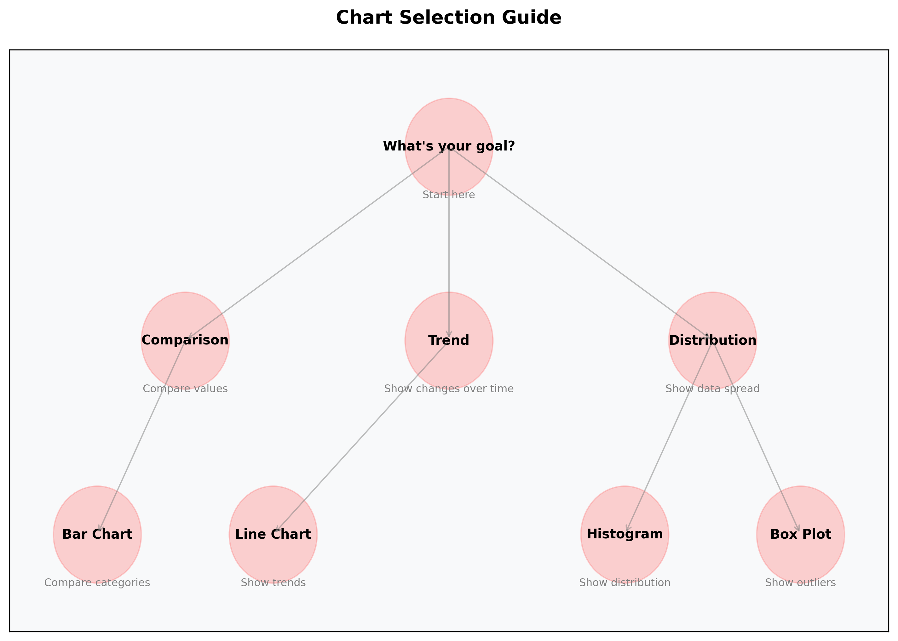

# Mastering Data Storytelling: A Beginner's Guide 📊

## Introduction: What is Data Storytelling?

Think of data storytelling like being a tour guide for your data. Just as a good tour guide helps visitors understand and appreciate a new place, data storytelling helps your audience understand and appreciate your data insights. It's the art of transforming raw numbers into compelling narratives that drive action.

### Why This Matters

- **Better Understanding**: Studies show that people remember stories 22 times more than facts alone
- **Clearer Communication**: Complex data becomes accessible to everyone
- **Stronger Impact**: Stories create emotional connections that drive action
- **Better Decisions**: Well-told data stories lead to more informed choices

## The Building Blocks of Data Storytelling

### 1. Story Architecture: Your Data's Blueprint

Think of this like building a house:

- **Foundation** (Setup): The context and background
- **Walls** (Conflict): The challenges and insights
- **Roof** (Resolution): The solutions and next steps


#### Why This Matters

Understanding story architecture helps you:

- Structure your data presentation logically
- Keep your audience engaged
- Make your message memorable
- Drive action effectively

### 2. Visual Grammar: Your Data's Language

Think of this like a traffic light system:

- **Red** (Primary Elements): Stop and look at these key points
- **Yellow** (Supporting Elements): Important context to consider
- **Green** (Background Elements): Additional information for reference


#### Why This Matters

Good visual grammar helps you:

- Guide your audience's attention
- Emphasize important information
- Create a clear visual hierarchy
- Make complex data easier to understand

## Storytelling Frameworks: Your Data's Structure

### 1. The Hero's Journey: Your Data's Adventure

Think of this like a movie plot:

- **Act 1**: Setup and context
- **Act 2**: Rising action and challenges
- **Act 3**: Climax and resolution

#### Real-World Example: Sales Analysis

1. **Setup**: "Our sales team is struggling to meet targets"
2. **Challenge**: "We discovered a 30% drop in customer retention"
3. **Resolution**: "Implementing a new customer success program increased retention by 45%"

### 2. Problem-Solution Framework: Your Data's Solution

Think of this like a doctor's visit:

- **Diagnosis**: What's the problem?
- **Analysis**: Why is it happening?
- **Treatment**: How do we fix it?

#### Real-World Example: Customer Churn

1. **Problem**: "We're losing 20% of customers monthly"
2. **Analysis**: "Survey data shows poor customer support experience"
3. **Solution**: "Implement 24/7 chat support and reduce churn by 15%"

## Visual Elements: Your Data's Presentation

### 1. Chart Selection: Choosing the Right Tool

Think of this like choosing the right tool for a job:

- **Bar Chart**: Like a ruler - great for comparing lengths
- **Line Chart**: Like a path - perfect for showing journeys
- **Pie Chart**: Like a pizza - best for showing parts of a whole



#### Common Mistakes to Avoid

1. **Overcomplicating**: Don't use complex charts when simple ones will do
2. **Wrong Chart Type**: Don't use a pie chart for time series data
3. **Missing Context**: Don't forget to label axes and provide units

### 2. Color Strategy: Your Data's Mood

Think of this like a traffic light:

- **Red**: Stop and pay attention (key metrics)
- **Yellow**: Caution and consider (supporting data)
- **Green**: Go ahead and explore (background info)

#### Best Practices

1. Use consistent colors for similar data types
2. Ensure sufficient contrast for readability
3. Consider color-blind friendly palettes

## Narrative Techniques: Your Data's Voice

### 1. Story Structures: Your Data's Flow

Think of this like a river:

- **Linear**: Like a straight river - clear and direct
- **Branching**: Like a delta - multiple paths to explore

#### Why This Matters

Choosing the right structure helps you:

- Guide your audience through complex data
- Maintain engagement
- Make your message memorable

### 2. Engagement Patterns: Your Data's Rhythm

Think of this like a song:

- **Hook**: The catchy opening
- **Verse**: The story development
- **Chorus**: The main message
- **Bridge**: The connection to action

#### Real-World Example: Marketing Campaign

1. **Hook**: "What if you could double your conversion rate?"
2. **Verse**: "Our analysis shows..."
3. **Chorus**: "The key insight is..."
4. **Bridge**: "Here's how to implement..."

## Common Mistakes to Avoid

### 1. Data Overload

❌ Don't: Show every data point you have
✅ Do: Focus on the most important insights

### 2. Missing Context

❌ Don't: Jump straight to conclusions
✅ Do: Build understanding gradually

### 3. Weak Structure

❌ Don't: Ramble through your data
✅ Do: Follow a clear narrative arc

## Additional Resources

### Books

- "Storytelling with Data" by Cole Nussbaumer Knaflic
- "Data Visualization: A Practical Introduction" by Kieran Healy

### Online Courses

- Coursera: "Data Visualization and Communication with Tableau"
- Udemy: "Data Storytelling and Visualization"

### Tools

- Tableau Public (Free)
- Power BI (Free)
- Python (matplotlib, seaborn)

## Practice Exercise: Build Your First Data Story

### Step 1: Gather Your Elements

```yaml
Story Elements:
  Data:
    - Key metrics
    - Supporting facts
    - Relevant context
  
  Narrative:
    - Main message
    - Key points
    - Flow structure
  
  Visuals:
    - Core charts
    - Supporting graphics
    - Highlights
```

### Step 2: Structure Your Story

1. Write your hook
2. Establish context
3. Present the challenge
4. Show your journey
5. Share insights

### Step 3: Create Your Visuals

1. Choose appropriate charts
2. Apply consistent styling
3. Add clear labels
4. Test for clarity

## Next Steps

1. Start with simple stories
2. Practice regularly
3. Get feedback
4. Iterate and improve

Remember: The best data stories are those that make complex information simple and actionable. Start small, practice often, and watch your storytelling skills grow!

```yaml
Impact Metrics:
┌─────────────────────────┐
│ Traditional Reports   │ → 40% Understanding
├─────────────────────────┤
│ Data Visualization   │ → 65% Understanding
├─────────────────────────┤
│ Data Storytelling    │ → 85% Understanding
└─────────────────────────┘
```
