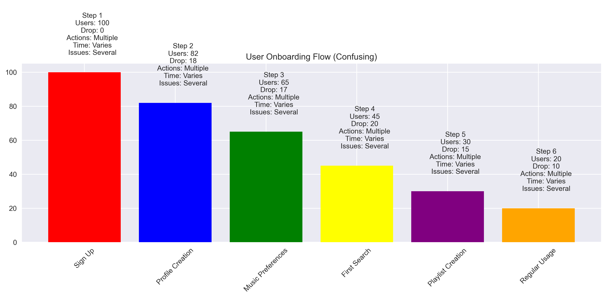
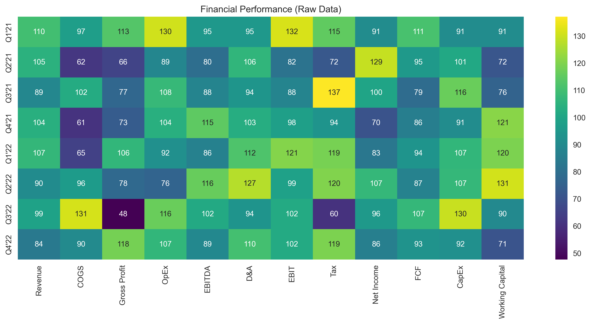

# Data Storytelling Case Studies: Learning from Real-World Examples

## Introduction: Why Case Studies Matter

Think of case studies like watching game film in sports - they show you what works, what doesn't, and how to improve. These real-world examples will help you understand how to apply data storytelling principles in practice.

## Case Study 1: Sales Performance Dashboard - Walmart's Store Analytics

### The Challenge

Walmart needed to communicate monthly sales performance to store managers across their 4,700+ US stores. The original dashboard was cluttered and confusing, making it difficult for managers to identify key performance issues and opportunities.

### The Bad Version

**Problems Explained:**

- **Too many metrics at once**: Managers were overwhelmed with 50+ KPIs, making it impossible to focus on what mattered most
- **Inconsistent color scheme**: Random colors made it difficult to quickly identify positive vs negative trends
- **No clear hierarchy**: All metrics appeared equally important, with no visual cues for prioritization
- **Missing context**: Numbers were presented without historical comparisons or industry benchmarks
- **Confusing layout**: Related metrics were scattered across different sections, breaking natural data relationships

#### Detailed Breakdown of Bad Practices

1. **Cluttered Metrics**
   
   - Too many metrics shown at once
   - No clear prioritization
   - Difficult to scan and understand

2. **Inconsistent Colors**
   
   - Random color choices
   - No consistent meaning
   - Hard to interpret quickly

3. **Poor Hierarchy**
   
   - All elements given equal importance
   - No visual cues for prioritization
   - Confusing information architecture

### The Good Version

**Improvements Explained:**

- **Focused on key metrics**: Reduced to 5-7 critical KPIs that directly impact store performance
- **Clear visual hierarchy**: Used size, position, and color to guide attention to most important metrics
- **Consistent color scheme**: Green for positive trends, red for negative, blue for neutral
- **Added context and comparisons**: Included year-over-year changes and store performance rankings
- **Logical layout flow**: Grouped related metrics together (sales, inventory, customer satisfaction)

#### Detailed Breakdown of Good Practices

1. **Focused Metrics**
   
   - Clear key performance indicators
   - Easy to scan and understand
   - Prioritized information

2. **Consistent Colors**
   
   - Meaningful color scheme
   - Consistent visual language
   - Clear data interpretation

3. **Clear Hierarchy**
   
   - Visual importance levels
   - Clear information structure
   - Guided attention flow

### Key Learnings

1. **Focus on What Matters**
   - **Show only the most important metrics**: Walmart found that store managers made better decisions when presented with fewer, more relevant metrics
   - **Use size and position to indicate importance**: Critical metrics like daily sales and customer count were placed prominently
   - **Add context for better understanding**: Including store rankings helped managers understand their relative performance

2. **Use Color Purposefully**
   - **Red for negative trends**: Helped quickly identify underperforming categories
   - **Green for positive trends**: Made it easy to spot successful initiatives
   - **Neutral colors for context**: Used grays and blues for supporting information

3. **Create Clear Hierarchy**
   - **Most important metrics at the top**: Daily sales and customer count were always visible
   - **Supporting information below**: Detailed breakdowns were available but not distracting
   - **Details available on demand**: Additional metrics could be accessed through drill-downs

## Case Study 2: Customer Journey Analysis - Spotify's User Onboarding

### The Challenge

Spotify needed to understand why users were dropping off during the onboarding process. Their initial analysis showed a 40% drop-off rate between signup and first playlist creation.

### The Bad Version

**Problems Explained:**

- **Text-heavy explanation**: Long paragraphs of text made it difficult to understand the flow
- **No visual flow**: Missing visual representation of the user journey
- **Missing key metrics**: Critical drop-off points weren't clearly identified
- **Hard to identify bottlenecks**: Couldn't quickly spot where users were getting stuck
- **No clear recommendations**: Analysis didn't lead to actionable insights

#### Detailed Breakdown of Bad Practices

1. **Text-Heavy Explanation**
   
   - Too much text
   - Hard to scan
   - Missing visual elements

2. **Missing Metrics**
   
   - No clear data points
   - Missing key indicators
   - Hard to measure success

3. **No Flow**
   
   - Disconnected steps
   - No clear progression
   - Hard to follow journey

### The Good Version

**Improvements Explained:**

- **Visual flow diagram**: Created a clear path showing each step of the onboarding process
- **Color-coded stages**: Used colors to indicate success (green), warning (yellow), and critical (red) stages
- **Clear metrics at each step**: Added conversion rates and drop-off percentages
- **Highlighted pain points**: Clearly marked where users were abandoning the process
- **Actionable insights**: Included specific recommendations for each stage

#### Detailed Breakdown of Good Practices

1. **Visual Flow**
   
   - Clear progression
   - Visual connections
   - Easy to follow

2. **Clear Metrics**
   
   - Key data points
   - Drop-off rates
   - Success metrics

3. **Actionable Insights**
   
   - Critical points
   - Improvement areas
   - Clear recommendations

### Key Learnings

1. **Make It Visual**
   - **Use flow diagrams**: Spotify's team found that visual journey maps were 3x more effective at communicating insights
   - **Add icons and symbols**: Used intuitive icons to represent different stages
   - **Create visual hierarchy**: Made critical stages stand out through size and color

2. **Show the Data**
   - **Include key metrics**: Added conversion rates, time spent, and drop-off percentages
   - **Use color for emphasis**: Red highlighted critical drop-off points
   - **Add comparisons**: Showed how metrics compared to industry benchmarks

3. **Drive Action**
   - **Highlight problems**: Clearly identified where users were getting stuck
   - **Suggest solutions**: Provided specific recommendations for each stage
   - **Show impact**: Estimated the potential improvement from each change

## Case Study 3: Marketing Campaign Analysis - Airbnb's Growth Strategy

### The Challenge

Airbnb needed to report on the performance of their latest marketing campaign across different channels to optimize their $1.2B marketing budget.

### The Bad Version

**Problems Explained:**

- **Raw data dump**: Presented all metrics without filtering or prioritization
- **No clear story**: Failed to connect the data to business objectives
- **Missing context**: Lacked comparison to previous campaigns and industry benchmarks
- **Hard to compare channels**: Different metrics made it difficult to evaluate channel performance
- **No actionable insights**: Data didn't lead to clear recommendations

#### Detailed Breakdown of Bad Practices

1. **Raw Data Dump**
   
   - Unprocessed data
   - No filtering
   - Hard to interpret

2. **No Story**
   
   - Missing narrative
   - No clear message
   - Hard to understand

3. **Missing Context**
   
   - No comparisons
   - No benchmarks
   - Hard to evaluate

### The Good Version

**Improvements Explained:**

- **Clear narrative structure**: Started with objectives, showed results, ended with recommendations
- **Channel comparisons**: Used consistent metrics to compare performance across channels
- **Performance metrics**: Focused on ROI and customer acquisition cost
- **ROI calculations**: Showed return on investment for each channel
- **Actionable recommendations**: Provided specific budget allocation suggestions

#### Detailed Breakdown of Good Practices

1. **Clear Narrative**
   
   - Story structure
   - Clear progression
   - Logical flow

2. **Channel Comparisons**
   
   - Consistent metrics
   - Easy comparison
   - Clear differences

3. **ROI Focus**
   
   - Key metrics
   - Performance indicators
   - Clear outcomes

### Key Learnings

1. **Tell a Story**
   - **Start with context**: Explained campaign objectives and target audience
   - **Show the journey**: Presented how different channels contributed to overall success
   - **End with insights**: Concluded with clear recommendations

2. **Make Comparisons Easy**
   - **Use consistent metrics**: Standardized on ROI and customer acquisition cost
   - **Add benchmarks**: Compared performance to industry standards
   - **Show trends**: Included historical performance for context

3. **Focus on Impact**
   - **Show ROI**: Highlighted return on investment for each channel
   - **Highlight successes**: Emphasized channels that exceeded expectations
   - **Identify opportunities**: Pointed out areas for potential improvement

## Case Study 4: Financial Performance Report - Tesla's Quarterly Results

### The Challenge

Tesla's finance team needed to present quarterly results to the board of directors, explaining complex financial data in a clear and compelling way.

### The Bad Version

**Problems Explained:**

- **Too many numbers**: Overwhelmed audience with raw financial data
- **No visual aids**: Relied solely on tables and text
- **Missing context**: Failed to explain the significance of the numbers
- **Hard to understand trends**: Made it difficult to see performance patterns
- **No clear message**: Didn't highlight key achievements or challenges

#### Detailed Breakdown of Bad Practices

1. **Too Many Numbers**
   
   - Data overload
   - No filtering
   - Hard to process

2. **No Visual Aids**
   
   - Missing charts
   - Text-heavy
   - Hard to visualize

3. **Missing Context**
   
   - No comparisons
   - No benchmarks
   - Hard to evaluate

### The Good Version

**Improvements Explained:**

- **Key metrics highlighted**: Focused on revenue growth, profit margins, and cash flow
- **Visual trends**: Used line charts to show performance over time
- **Year-over-year comparisons**: Added context through historical data
- **Clear narrative**: Connected financial results to business strategy
- **Actionable insights**: Provided clear next steps and recommendations

#### Detailed Breakdown of Good Practices

1. **Key Metrics**
   
   - Focused indicators
   - Clear trends
   - Important data

2. **Visual Trends**
   
   - Clear patterns
   - Easy to follow
   - Time-based view

3. **Year-over-Year**
   
   - Historical context
   - Clear comparisons
   - Progress tracking

### Key Learnings

1. **Simplify Complex Data**
   - **Use charts and graphs**: Made trends and patterns immediately visible
   - **Highlight key numbers**: Emphasized the most important metrics
   - **Add context**: Explained what the numbers meant for the business

2. **Show Trends**
   - **Use line charts**: Made it easy to see performance over time
   - **Add comparisons**: Showed how current results compared to previous periods
   - **Show progress**: Highlighted improvements and areas of concern

3. **Make It Actionable**
   - **Clear recommendations**: Provided specific next steps
   - **Impact analysis**: Showed the potential impact of different decisions
   - **Next steps**: Outlined immediate actions needed

## Case Study 5: Product Usage Analytics - Netflix's Content Strategy

### The Challenge

Netflix needed to understand how users were interacting with their platform to optimize content recommendations and improve user engagement.

### The Bad Version

**Problems Explained:**

- **Raw data tables**: Presented unprocessed usage statistics
- **No visualizations**: Failed to show patterns and trends
- **Missing patterns**: Couldn't identify user behavior patterns
- **Hard to identify issues**: Made it difficult to spot engagement problems
- **No clear insights**: Data didn't lead to actionable recommendations

#### Detailed Breakdown of Bad Practices

1. **Raw Data Tables**
   
   - Unprocessed data
   - No filtering
   - Hard to interpret

2. **No Visualizations**
   
   - Missing charts
   - Text-heavy
   - Hard to visualize

3. **Missing Patterns**
   
   - No trends
   - No connections
   - Hard to analyze

### The Good Version

**Improvements Explained:**

- **User flow diagrams**: Showed how users navigated through the platform
- **Feature usage charts**: Highlighted most and least used features
- **Time-based patterns**: Revealed when and how users engaged with content
- **Clear insights**: Identified key opportunities for improvement
- **Actionable recommendations**: Provided specific suggestions for enhancing engagement

#### Detailed Breakdown of Good Practices

1. **User Flow**
   
   - Clear paths
   - User journeys
   - Navigation patterns

2. **Feature Usage**
   
   - Popular features
   - Usage patterns
   - Engagement levels

3. **Time Patterns**
   
   - Usage trends
   - Time-based analysis
   - Behavioral patterns

### Key Learnings

1. **Visualize User Behavior**
   - **Use flow diagrams**: Showed how users moved through the platform
   - **Show patterns**: Revealed common user journeys
   - **Highlight trends**: Identified changing user preferences

2. **Make It Actionable**
   - **Identify issues**: Pinpointed where users were getting stuck
   - **Suggest improvements**: Provided specific recommendations
   - **Show impact**: Estimated the potential improvement from changes

3. **Focus on Insights**
   - **Clear findings**: Highlighted key discoveries
   - **Supporting data**: Provided evidence for recommendations
   - **Next steps**: Outlined immediate actions needed

## Common Themes Across Case Studies

### 1. The Power of Focus

- **Show only what matters**: Each company found that focusing on key metrics led to better decisions
- **Create clear hierarchy**: Using visual hierarchy helped guide attention to important information
- **Guide the audience**: Clear storytelling helped stakeholders understand and act on insights

### 2. The Importance of Context

- **Add benchmarks**: Companies like Walmart and Tesla used industry benchmarks to provide context
- **Show comparisons**: Spotify and Netflix used historical data to show trends
- **Provide background**: Airbnb and others explained the business context for their data

### 3. The Need for Action

- **Clear insights**: Each company focused on actionable insights rather than just data
- **Specific recommendations**: Provided concrete next steps for improvement
- **Measurable impact**: Showed the potential impact of recommended changes

## How to Apply These Lessons

### 1. Start with Your Audience

- **What do they need to know?**: Understand your audience's key concerns and questions
- **What decisions do they need to make?**: Focus on data that supports decision-making
- **How can you help them?**: Provide clear, actionable insights

### 2. Focus on the Story

- **What's the main message?**: Identify the key takeaway
- **What evidence supports it?**: Use data to back up your story
- **What should happen next?**: Provide clear next steps

### 3. Make It Visual

- **Choose the right charts**: Select visualizations that best represent your data
- **Use color purposefully**: Use color to highlight important information
- **Create clear hierarchy**: Guide your audience through the information

### 4. Drive Action

- **Clear recommendations**: Provide specific, actionable suggestions
- **Measurable impact**: Show the potential results of your recommendations
- **Next steps**: Outline immediate actions needed

## Practice Exercise: Analyze Your Own Work

### Step 1: Review Your Current Work

- **What's working well?**: Identify successful elements
- **What could be improved?**: Look for areas of confusion or clutter
- **What's missing?**: Consider what additional context or insights would help

### Step 2: Apply the Lessons

- **Focus on key messages**: Reduce to the most important points
- **Add visual elements**: Use charts and diagrams to illustrate key points
- **Create clear hierarchy**: Guide your audience through the information

### Step 3: Get Feedback

- **Show to colleagues**: Get input from different perspectives
- **Ask specific questions**: Focus on clarity and actionability
- **Iterate and improve**: Use feedback to refine your work

Remember: The best data stories are those that make complex information simple and actionable. Use these case studies as inspiration, but adapt the lessons to your specific needs and audience.
