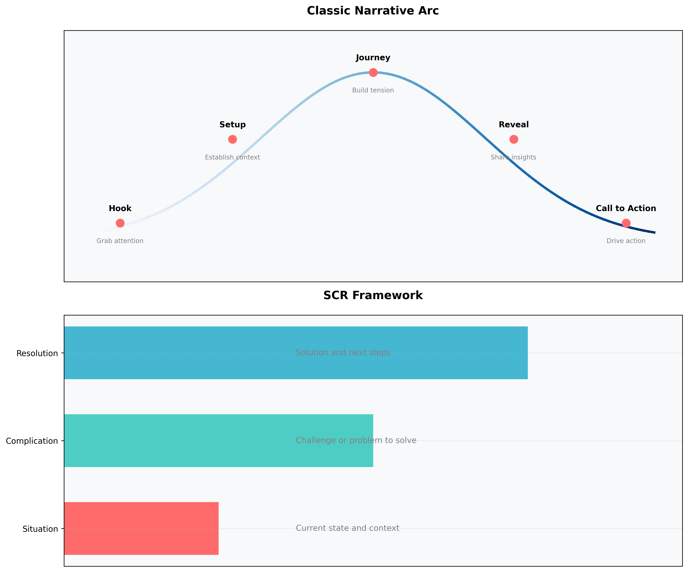
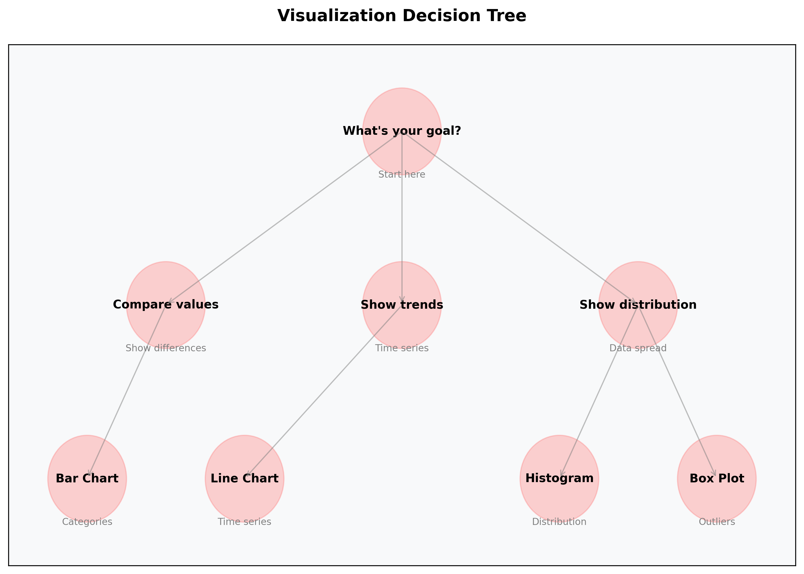
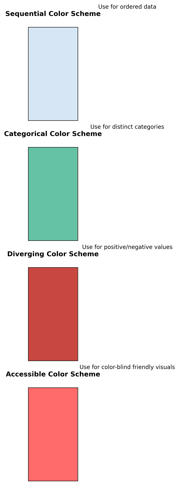
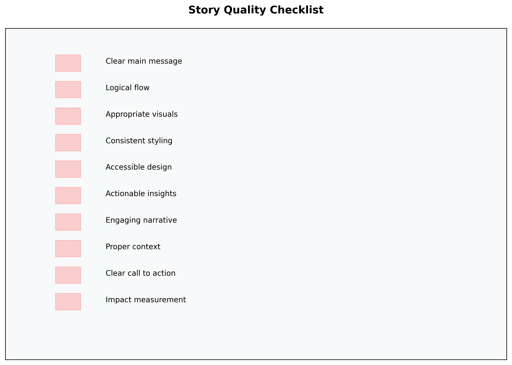

# Data Storytelling Narrative Techniques: A Beginner's Guide

## Table of Contents

1. [Introduction: The Power of Narrative in Data](#introduction-the-power-of-narrative-in-data)
2. [Story Structure Frameworks](#story-structure-frameworks)
3. [Core Narrative Elements](#core-narrative-elements)
4. [Data Visualization Best Practices](#data-visualization-best-practices)
5. [Story Creation Process](#story-creation-process)
6. [Quality Assurance](#quality-assurance)
7. [Real-World Examples](#real-world-examples)
8. [Tips for Success](#tips-for-success)
9. [Additional Resources](#additional-resources)

## Introduction: The Power of Narrative in Data

Picture this: You're standing in front of a room full of executives, armed with the most comprehensive data analysis your team has ever produced. The numbers are solid, the insights are groundbreaking, and the recommendations are clear. But as you start presenting, you notice eyes glazing over, phones coming out, and attention drifting away. Sound familiar?

This is where the magic of narrative comes in. Think of your data as a treasure map - the numbers are the landmarks, but the story is what guides your audience to the buried treasure. Without a compelling narrative, even the most valuable insights can remain hidden in plain sight.

### Why Narrative Matters

Think of data like ingredients and narrative like a recipe:

- **Raw Data** = Raw ingredients (flour, sugar, eggs)
  - Numbers and statistics alone are hard to digest
    (Like trying to eat flour by the spoonful)
  - No inherent meaning or context
    (Like ingredients without a recipe)
  - Difficult to remember or act upon
    (Like a grocery list without a meal plan)

- **Narrative** = Recipe (instructions on how to combine ingredients)
  - Provides structure and flow
    (The step-by-step guide to success)
  - Creates meaningful connections
    (How each piece contributes to the whole)
  - Makes information digestible
    (Transforms raw data into a satisfying meal)

- **Story** = Finished dish (delicious and easy to consume)
  - Engaging and memorable
    (The meal everyone talks about)
  - Clear purpose and meaning
    (Why we cooked it in the first place)
  - Drives action and change
    (Inspires others to try the recipe)

## Story Structure Frameworks

The diagram above shows two powerful approaches to structuring your data story:

### Classic Narrative Arc

1. **Hook**: The attention-grabbing opening
   - Creates curiosity or tension
     (Like a movie trailer that makes you want to see more)
   - Poses a compelling question
     (The kind that keeps you up at night)
   - Presents a surprising fact
     (That makes you say "Wait, what?")
   - Sets up the story's stakes
     (So everyone knows why they should care)

2. **Setup**: The context and background
   - Establishes the current situation
     (Like setting the scene in a movie)
   - Provides necessary history
     (The backstory that makes everything make sense)
   - Introduces key players/factors
     (The characters in your data drama)
   - Defines the problem space
     (The stage where your story unfolds)

3. **Journey**: The data exploration
   - Guides through key discoveries
     (Like following breadcrumbs to the truth)
   - Builds understanding gradually
     (One "aha" moment at a time)
   - Reveals patterns and insights
     (The hidden connections that change everything)
   - Creates "aha" moments
     (Those satisfying clicks when everything falls into place)

4. **Reveal**: The key insights
   - Presents main findings
     (The big reveal that changes everything)
   - Explains implications
     (Why this matters to everyone in the room)
   - Connects dots
     (How all the pieces fit together)
   - Delivers the "punch line"
     (The insight that makes it all worth it)

5. **Call to Action**: The next steps
   - Proposes specific solutions
     (Clear, actionable steps forward)
   - Outlines implementation steps
     (The roadmap to success)
   - Defines success metrics
     (How we'll know we've won)
   - Motivates change
     (The spark that ignites action)

### SCR Framework

A simpler alternative for business presentations:

- **Situation**: Current state and context
- **Complication**: Challenge or problem to solve
- **Resolution**: Solution and next steps

## Core Narrative Elements

### 1. The Hook: Grabbing Attention

The visual hierarchy above shows how to structure your hook and initial message:

- Primary Message: Your main insight or key finding
- Supporting Data: Evidence and data points that back up your message
- Additional Context: Background information that enriches understanding

1. **The Question Hook**
   Examples:
   - "What if we could predict customer churn before it happens?"
     (Creates curiosity about a valuable capability)
     (Like having a crystal ball for your business)
   - "How are the top 10% of our sales team outperforming everyone else by 300%?"
     (Highlights an impressive achievement and invites investigation)
     (Like discovering a secret formula for success)
   - "Why do 80% of our customers never use our most expensive feature?"
     (Reveals a surprising gap between investment and usage)
     (Like finding out your most expensive tool is gathering dust)

2. **The Surprise Hook**
   Examples:
   - "Our biggest competitor isn't who you think - it's actually our own website."
     (Challenges assumptions and creates immediate interest)
     (Like discovering the enemy is within)
   - "The solution to our retention problem was hiding in our lunch break data."
     (Shows unexpected insights can come from unlikely places)
     (Like finding a diamond in a pile of sand)
   - "We're spending 60% of our budget on features only 5% of users want."
     (Reveals a significant misalignment of resources)
     (Like discovering you've been watering the wrong garden)

3. **The Stakes Hook**
   Examples:
   - "Every minute we wait costs us another 100 customers."
     (Creates urgency and quantifies the impact)
     (Like watching sand slip through an hourglass)
   - "There's a $2M opportunity hiding in our support tickets."
     (Highlights a concrete financial opportunity)
     (Like finding a gold mine in your backyard)
   - "We have 3 months to fix this before it becomes irreversible."
     (Sets a clear timeline and emphasizes consequences)
     (Like seeing a storm on the horizon)

### 2. The Setup: Building Context

Think of this like setting up a mystery novel - provide enough context without giving away the ending.

## Data Visualization Best Practices

### Choosing the Right Visualization

Use this decision tree to select the most appropriate visualization for your data:

- For comparisons between categories  Bar charts
- For trends over time  Line charts
- For distributions and spread  Histograms or box plots
- For outlier analysis  Box plots

### Color Usage Guidelines

Choose your colors based on your data type and purpose:

- Sequential: For ordered data (e.g., low to high values)
- Categorical: For distinct categories that need clear differentiation
- Diverging: For data that spans positive and negative values
- Accessible: Color-blind friendly options for inclusive design

## Story Creation Process

Follow this systematic approach to create compelling data stories:

1. Data Collection: Gather relevant data
2. Analysis: Identify patterns and trends
3. Insight Generation: Extract meaningful insights
4. Story Structure: Organize your narrative
5. Visualization: Create supporting visuals
6. Review: Get feedback from stakeholders
7. Refine: Improve based on feedback
8. Finalize: Polish all elements
9. Present: Share with audience
10. Measure Impact: Track results and outcomes

## Quality Assurance

Before finalizing your data story, verify these essential elements:

- Clear main message: Is your key point immediately apparent?
- Logical flow: Does your story progress naturally?
- Appropriate visuals: Do your visualizations support your message?
- Consistent styling: Is your design cohesive throughout?
- Accessible design: Can all audience members understand your content?
- Actionable insights: Are next steps clear?
- Engaging narrative: Does your story maintain interest?
- Proper context: Is necessary background provided?
- Clear call to action: Do people know what to do next?
- Impact measurement: Can results be tracked?

## Real-World Examples

### Example 1: Customer Churn Story

#### Bad Version

"Our churn rate increased by 5% this quarter."

Why it's weak:

- No context or stakes
- No human element
- No clear action items

#### Good Version

"Imagine losing 500 loyal customers - that's like losing a full stadium of fans. That's what happened this quarter when our service response time doubled. But here's the good news: our analysis shows that by adding just two customer service representatives, we can bring back 60% of those customers."

Why it's strong:

- Uses vivid analogy (stadium of fans)
- Provides clear cause (response time)
- Offers specific solution
- Quantifies the impact

### Example 2: Marketing Campaign Story

#### Bad Version

"Email open rates vary by time of day."

Why it's weak:

- States obvious fact
- No actionable insight
- No compelling narrative

#### Good Version

"Think about your morning routine. When do you check your email? Our data shows a surprising pattern: 73% of our customers are most likely to read our emails during their morning coffee break - between 9:30 and 10:30 AM. By simply changing when we send our emails, we could reach 45,000 more customers every day."

Why it's strong:

- Relates to personal experience
- Provides specific timing
- Quantifies the opportunity
- Offers clear solution

### Example 3: Product Performance Story

#### Bad Version

"Feature X has low adoption rates."

Why it's weak:

- Vague problem statement
- No context or comparison
- No clear path forward

#### Good Version

"Picture a restaurant where 80% of customers never look at the menu. That's what's happening with our new feature - 80% of users never discover it. But when they do, they use it 3x more than any other feature. We've found the perfect placement that could increase adoption by 300%."

Why it's strong:

- Uses relatable analogy
- Provides clear metrics
- Shows potential value
- Offers specific solution

## Tips for Success

### 1. Know Your Audience

- What do they already know?
  Research:
  - Technical expertise level
     (Helps determine appropriate complexity)
  - Domain knowledge
     (Informs how much background to provide)
  - Current pain points
     (Identifies areas of interest)

- What do they care about?
  Identify:
  - Key motivations
     (Aligns story with audience goals)
  - Success metrics
     (Connects to their KPIs)
  - Career goals
     (Links to personal objectives)

- What decisions do they need to make?
  Clarify:
  - Action items
     (Provides clear next steps)
  - Resource allocation
     (Helps with planning)
  - Strategic choices
     (Supports decision-making)

### 2. Keep It Simple

- One main message per story
  Example:
  Main message: "Improving response time will reduce churn"
     (Clear, focused takeaway)
  Supporting points:
  1. Current response time impact
     (Shows the problem)
  2. Customer satisfaction correlation
     (Demonstrates the connection)
  3. Revenue implications
     (Quantifies the value)

- 3-5 supporting points
  Structure:
  1. Key evidence
     (Provides proof)
  2. Supporting data
     (Adds context)
  3. Real-world example
     (Makes it tangible)

- Clear call to action
  Format:
  1. What: Specific action
     (Defines the task)
  2. When: Timeline
     (Sets expectations)
  3. How: Implementation steps
     (Provides guidance)

### 3. Practice and Iterate

- Test your story on colleagues
  Get feedback on:
  - Clarity of message
     (Ensures understanding)
  - Flow of narrative
     (Verifies logical progression)
  - Impact of visuals
     (Assesses effectiveness)

- Get feedback early
  Ask about:
  - Understanding of key points
     (Confirms comprehension)
  - Engagement level
     (Measures interest)
  - Areas of confusion
     (Identifies improvements)

- Refine based on reactions
  Adjust:
  - Pacing
     (Optimizes flow)
  - Examples
     (Enhances clarity)
  - Visual aids
     (Improves impact)

### 4. Use Visual Aids

- Choose appropriate charts
  Match to purpose:
  - Comparison: Bar charts
     (Shows differences clearly)
  - Trends: Line charts
     (Displays changes over time)
  - Distribution: Histograms
     (Reveals patterns in data)

- Create clear diagrams
  Design principles:
  - Simple layouts
     (Reduces cognitive load)
  - Clear labels
     (Ensures understanding)
  - Consistent style
     (Maintains professionalism)

- Use consistent styling
  Elements:
  - Color scheme
     (Creates visual harmony)
  - Font choices
     (Ensures readability)
  - Layout patterns
     (Maintains structure)

### 5. Measure Impact

- Track engagement metrics
  Measure:
  - Audience attention
     (Indicates interest level)
  - Question quality
     (Shows understanding)
  - Follow-up actions
     (Demonstrates impact)

- Collect feedback
  Ask about:
  - Message clarity
     (Ensures comprehension)
  - Story impact
     (Measures effectiveness)
  - Action items
     (Verifies practical value)

- Monitor action taken
  Track:
  - Implementation progress
     (Shows adoption)
  - Results achieved
     (Demonstrates value)
  - Lessons learned
     (Informs future stories)

## Additional Resources

### Books

- "Storytelling with Data" by Cole Nussbaumer Knaflic
  Key topics:
  - Visual design
     (Improves presentation)
  - Chart selection
     (Ensures appropriate visualization)
  - Narrative structure
     (Creates compelling stories)

- "Data Story" by Nancy Duarte
  Focus areas:
  - Story patterns
     (Provides proven frameworks)
  - Audience engagement
     (Increases effectiveness)
  - Presentation design
     (Enhances delivery)

- "The Big Picture" by Steve Wexler
  Covers:
  - Data context
     (Provides background)
  - Pattern recognition
     (Identifies insights)
  - Visual analysis
     (Interprets data)

### Online Resources

- [Data Visualization Society](https://www.datavisualizationsociety.org/)
  Offers:
  - Best practices
     (Provides proven methods)
  - Community forums
     (Enables knowledge sharing)
  - Learning resources
     (Supports skill development)

- [Storytelling with Data Blog](https://www.storytellingwithdata.com/blog)
  Features:
  - Case studies
     (Shows real-world examples)
  - Design tips
     (Improves visuals)
  - Video tutorials
     (Provides step-by-step guidance)

- [Information is Beautiful](https://informationisbeautiful.net/)
  Provides:
  - Visualization examples
     (Inspires creativity)
  - Design inspiration
     (Enhances aesthetics)
  - Data sources
     (Supports analysis)

### Tools

- Tableau Public (Free)
  Best for:
  - Interactive dashboards
     (Enables exploration)
  - Data exploration
     (Facilitates discovery)
  - Public sharing
     (Enables collaboration)

- Power BI (Free)
  Ideal for:
  - Business analytics
     (Supports decision-making)
  - Report creation
     (Provides documentation)
  - Data modeling
     (Enables analysis)

- Python (matplotlib, seaborn)
  Great for:
  - Custom visualizations
     (Enables flexibility)
  - Data analysis
     (Supports investigation)
  - Automation
     (Improves efficiency)

- R (ggplot2)
  Perfect for:
  - Statistical graphics
     (Ensures accuracy)
  - Publication plots
     (Maintains quality)
  - Advanced analysis
     (Enables depth)

Remember: The best data stories are like good conversations - they're clear, engaging, and lead to meaningful action. Start simple, focus on your audience, and let your data guide the narrative.
