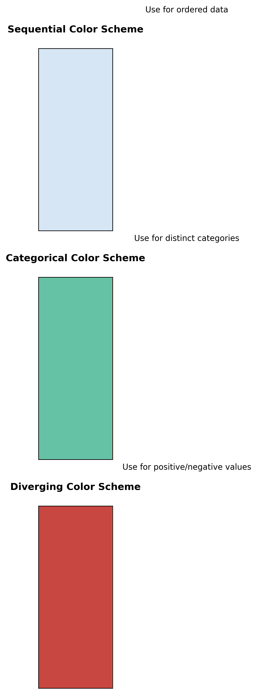

# Visual Storytelling: A Beginner's Guide to Data Visualization

## Introduction: The Power of Visual Communication

Imagine trying to explain a complex journey using only words versus showing a map. The map makes it instantly clear where you are, where you're going, and the best path to get there. That's the power of visual storytelling with data.

### Why Visuals Matter

Think of data visualization like a universal language:

- **Words** = One person speaking (linear, sequential)
- **Numbers** = Mathematical language (precise but abstract)
- **Visuals** = Universal language (instant understanding)

## The Building Blocks of Visual Storytelling

### 1. Choosing the Right Chart: Your Visual Vocabulary

Think of charts like different types of sentences:

- **Bar Chart** = Simple statement (comparing quantities)
- **Line Chart** = Story over time (showing trends)
- **Pie Chart** = Parts of a whole (showing proportions)


The chart selection guide above helps you choose the right visualization based on your goal:

1. **Comparison**: Use bar charts or column charts
2. **Trend**: Use line charts or area charts
3. **Distribution**: Use histograms or box plots

#### Common Chart Types and When to Use Them

1. **Comparison Charts**
   - **Bar Charts**: Like comparing heights of different people
     - Best for: Comparing values across categories
     - Example: Monthly sales by product
     - Tip: Use horizontal bars when you have long category names

   - **Column Charts**: Like comparing weights of different objects
     - Best for: Comparing values across categories with time
     - Example: Quarterly revenue by region
     - Tip: Limit to 7-10 categories for clarity

   - **Bullet Charts**: Like comparing targets vs. actual performance
     - Best for: Showing progress toward a goal
     - Example: Sales targets vs. actual sales
     - Tip: Use color to indicate performance levels

2. **Trend Charts**
   - **Line Charts**: Like tracking a journey on a map
     - Best for: Showing trends over time
     - Example: Stock price movements
     - Tip: Use smooth lines for trends, sharp lines for actual data

   - **Area Charts**: Like showing volume over time
     - Best for: Showing cumulative values
     - Example: Total sales over time
     - Tip: Use transparency to show overlapping areas

   - **Sparklines**: Like a quick weather forecast
     - Best for: Showing trends in a small space
     - Example: Daily temperature trends
     - Tip: Include min/max markers for context

3. **Distribution Charts**
   - **Histograms**: Like a population pyramid
     - Best for: Showing distribution of values
     - Example: Age distribution of customers
     - Tip: Choose appropriate bin sizes

   - **Box Plots**: Like a weather report
     - Best for: Showing statistical distribution
     - Example: Test scores by class
     - Tip: Include outliers for complete picture

   - **Violin Plots**: Like a sound wave
     - Best for: Showing probability density
     - Example: Income distribution by education
     - Tip: Use with box plots for more detail

4. **Relationship Charts**
   - **Scatter Plots**: Like stars in a constellation
     - Best for: Showing correlation between variables
     - Example: Height vs. weight
     - Tip: Add trend line for clarity

   - **Bubble Charts**: Like a galaxy of data points
     - Best for: Showing three variables
     - Example: Sales vs. marketing spend vs. profit
     - Tip: Use size consistently for third variable

   - **Heat Maps**: Like a weather map
     - Best for: Showing patterns in large datasets
     - Example: Website traffic by time and day
     - Tip: Use intuitive color scales

5. **Composition Charts**
   - **Pie Charts**: Like slicing a pizza
     - Best for: Showing parts of a whole
     - Example: Market share by company
     - Tip: Limit to 5-7 segments

   - **Donut Charts**: Like a pie chart with a hole
     - Best for: Showing parts with a center metric
     - Example: Budget allocation with total in center
     - Tip: Use for emphasis on total

   - **Stacked Bar Charts**: Like a layer cake
     - Best for: Showing parts and totals
     - Example: Sales by product and region
     - Tip: Order segments by size

6. **Hierarchical Charts**
   - **Treemaps**: Like a family tree
     - Best for: Showing hierarchical data
     - Example: File system usage
     - Tip: Use color for additional dimension

   - **Sunburst Charts**: Like tree rings
     - Best for: Showing hierarchical proportions
     - Example: Budget allocation by department
     - Tip: Limit depth for readability

   - **Tree Diagrams**: Like a decision tree
     - Best for: Showing hierarchical relationships
     - Example: Organizational structure
     - Tip: Use consistent spacing

### 2. Color and Design: Your Visual Grammar

Think of color like traffic signals:

- **Red**: Stop and pay attention (key metrics)
- **Yellow**: Caution and consider (supporting data)
- **Green**: Go ahead and explore (background info)



The color schemes above demonstrate three key approaches:

1. **Sequential**: For showing progression or intensity
2. **Categorical**: For distinguishing different categories
3. **Diverging**: For highlighting extremes from a center point

#### Color Best Practices

1. **Use Color Purposefully**
   - One color per category
   - Consistent meaning across charts
   - High contrast for readability

2. **Consider Color Blindness**
   - Use colorblind-friendly palettes
   - Add patterns or shapes as backup
   - Test your visualizations

3. **Create Visual Hierarchy**
   - Primary information: Bold, bright colors
   - Secondary information: Muted colors
   - Background elements: Light, neutral colors

#### Modern Color Schemes

1. **Sequential Color Schemes**

   ```markdown
   Light to Dark:
   - Single hue progression
   - Multiple hue progression
   - Diverging color schemes

   Example:
   - Light blue → Dark blue
   - Light green → Dark green
   - Light red → Dark red
   ```

2. **Categorical Color Schemes**

   ```markdown
   Distinct Colors:
   - Colorblind-friendly
   - High contrast
   - Limited palette

   Example:
   - Blue, Orange, Green
   - Purple, Yellow, Teal
   - Red, Blue, Green
   ```

3. **Diverging Color Schemes**

   ```markdown
   Center-Based:
   - Neutral center
   - Opposing colors
   - Clear separation

   Example:
   - Red → White → Blue
   - Green → White → Purple
   - Yellow → White → Blue
   ```

### 3. Layout and Composition: Your Visual Structure

Think of layout like arranging furniture in a room:

- **Focal Point**: The main piece (key insight)
- **Flow**: How people move through the space (story progression)
- **Balance**: Everything in its right place (visual harmony)


The layout examples above show three common structures:

1. **Dashboard Layout**: For interactive data exploration
2. **Report Layout**: For formal documentation
3. **Presentation Layout**: For storytelling flow

#### Layout Principles

1. **The Z-Pattern**
   - Top-left to top-right
   - Down to bottom-left
   - Across to bottom-right

2. **The F-Pattern**
   - Horizontal scan at top
   - Vertical scan down left
   - Horizontal scan for details

3. **The Golden Ratio**
   - 1:1.618 ratio for pleasing proportions
   - Natural focal points
   - Balanced composition

#### Modern Layout Examples

1. **Dashboard Layout**

   ```markdown
   Top Section:
   - Key metrics
   - Summary charts
   - Important alerts

   Middle Section:
   - Detailed analysis
   - Supporting charts
   - Context information

   Bottom Section:
   - Additional details
   - Related metrics
   - Action items
   ```

2. **Report Layout**

   ```markdown
   Header:
   - Title
   - Date
   - Author

   Body:
   - Main insights
   - Supporting data
   - Visualizations

   Footer:
   - Sources
   - Notes
   - Next steps
   ```

3. **Presentation Layout**

   ```markdown
   Opening:
   - Hook
   - Context
   - Overview

   Middle:
   - Key points
   - Evidence
   - Examples

   Closing:
   - Summary
   - Call to action
   - Next steps
   ```

## Real-World Examples

### Example 1: Sales Dashboard

#### Bad Version

- Cluttered with too many charts
- Inconsistent colors
- No clear hierarchy

#### Good Version

- Focused on key metrics
- Consistent color scheme
- Clear visual hierarchy

### Example 2: Customer Journey Map

#### Bad Version

- Linear, text-heavy
- No visual cues
- Hard to follow

#### Good Version

- Visual flow diagram
- Color-coded stages
- Clear progression

### Example 3: Financial Report

#### Bad Version

- Raw numbers only
- No visual elements
- Hard to understand

#### Good Version

- Key metrics highlighted
- Trend visualizations
- Clear comparisons

## Common Mistakes to Avoid

### 1. The Clutter Trap

 **Don't**: Put everything on one screen
 **Do**: Focus on key insights

### 2. The Color Chaos

 **Don't**: Use too many colors
 **Do**: Use a consistent color scheme

### 3. The Scale Problem

 **Don't**: Use misleading scales
 **Do**: Start axes at zero when appropriate

### 4. The Font Fiasco

 **Don't**: Use too many fonts
 **Do**: Stick to 2-3 font families

### 5. The Alignment Issue

 **Don't**: Randomly place elements
 **Do**: Use consistent alignment

## Practical Exercises

### Exercise 1: Chart Selection

Given these scenarios, choose the best chart type:

1. Comparing sales across regions
2. Showing temperature trends over a year
3. Displaying market share percentages

### Exercise 2: Color Scheme

Create a color scheme for:

1. A financial dashboard
2. A healthcare report
3. A marketing campaign analysis

### Exercise 3: Layout Design

Design a layout for:

1. A sales performance dashboard
2. A customer journey map
3. A project status report

## Tips for Success

### 1. Start Simple

- One message per visualization
- Clear, readable fonts
- Adequate white space

### 2. Test Your Visuals

- Show to colleagues
- Get feedback
- Iterate and improve

### 3. Consider Your Audience

- Technical vs. non-technical
- Color vision considerations
- Cultural context

### 4. Use Interactive Elements

- Tooltips for details
- Filters for exploration
- Drill-downs for depth

### 5. Maintain Consistency

- Use templates
- Follow style guides
- Keep branding consistent

## Next Steps

1. **Learn the Basics**
   - Study chart types
   - Practice color theory
   - Master layout principles

2. **Build Your Toolkit**
   - Choose visualization tools
   - Create templates
   - Develop style guides

3. **Practice Regularly**
   - Start with simple datasets
   - Experiment with different styles
   - Get feedback and improve

Remember: The best visualizations are those that make complex data simple and actionable. Start with these basics, practice regularly, and watch your visual storytelling skills grow!

## Additional Resources

### Books

- "The Visual Display of Quantitative Information" by Edward Tufte
- "Information Dashboard Design" by Stephen Few
- "Visualize This" by Nathan Yau

### Online Courses

- Coursera: "Data Visualization and Communication"
- Udemy: "Data Visualization with Python"
- DataCamp: "Data Visualization with Tableau"

### Tools

- Tableau Public (Free)
- Power BI (Free)
- Python (matplotlib, seaborn)
- R (ggplot2)

## Practice Exercise: Create Your First Visualization

### Step 1: Choose Your Data

- Pick a simple dataset
- Identify key metrics
- Define your message

### Step 2: Design Your Visualization

- Select appropriate chart type
- Choose color scheme
- Plan layout

### Step 3: Create and Refine

- Build initial visualization
- Get feedback
- Make improvements

Remember: The best visualizations are like good maps - they guide your audience to understanding without getting them lost in the details.
