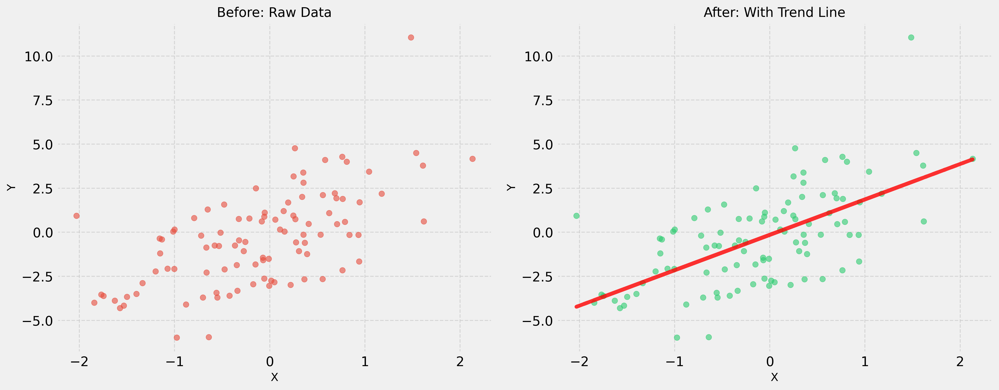
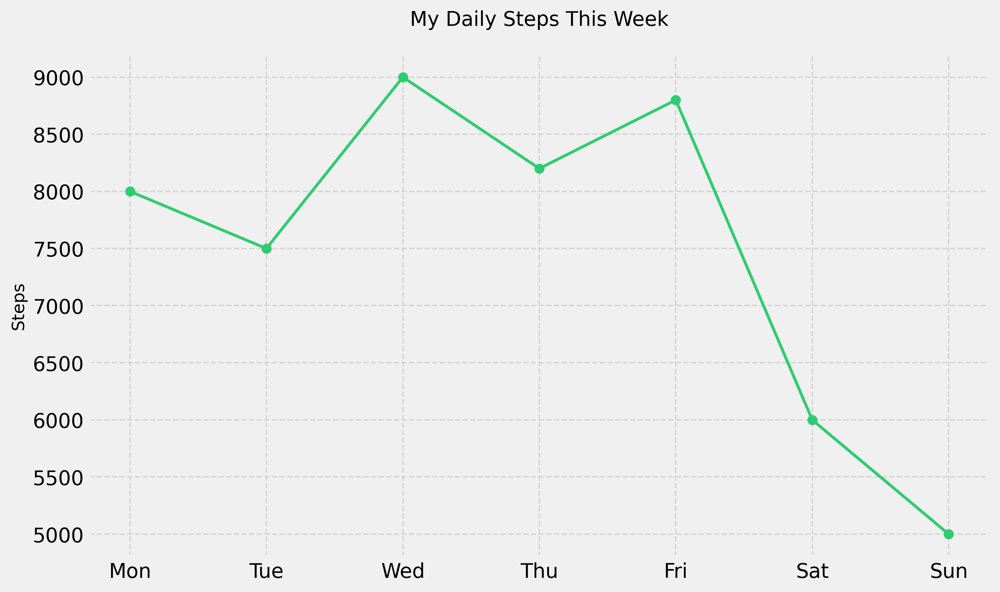
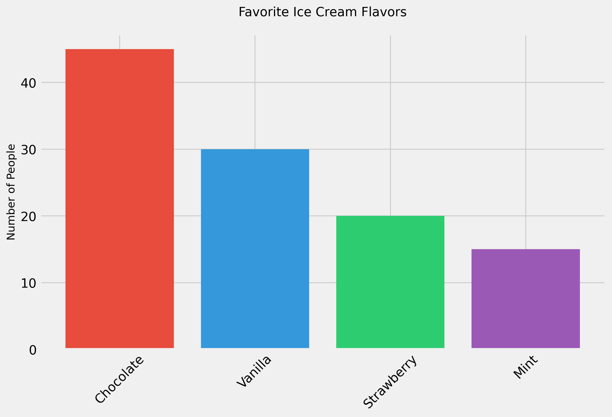
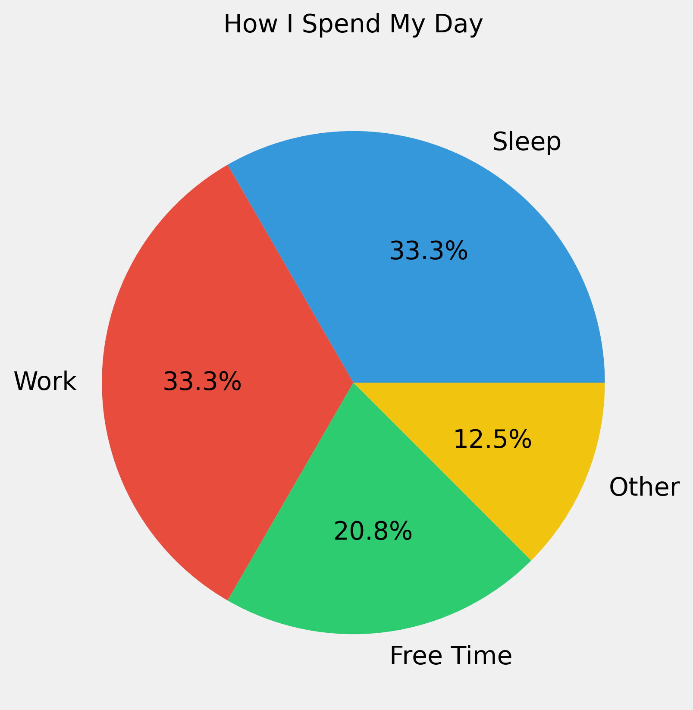
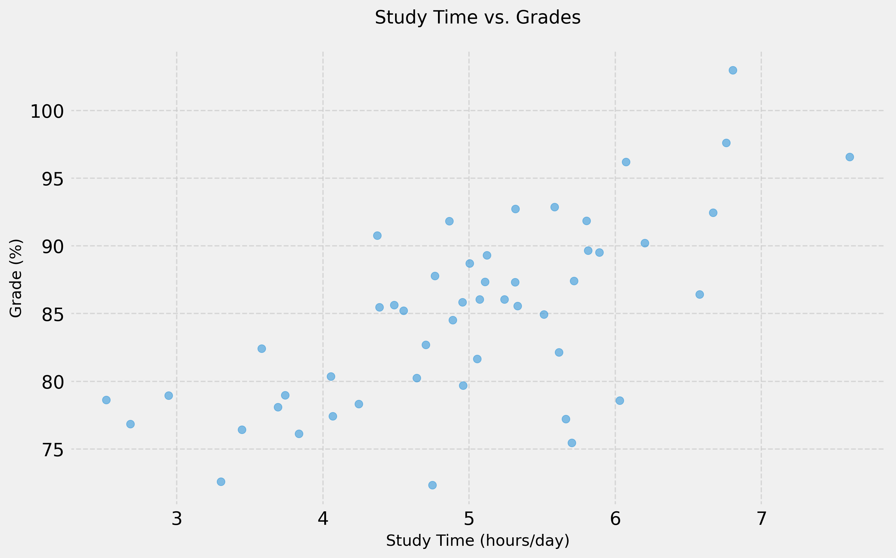

# Common Data Visualization Mistakes and How to Fix Them

## 1. Choosing the Wrong Chart Type

### The Mistake

Using an inappropriate chart type that doesn't effectively communicate your data's story. For example:

- Using a pie chart to show changes over time
- Using a line chart for unrelated categories
- Using a 3D chart when 2D would be clearer

### The Solution

Match your chart type to your data and goal:

- **Time-based data**: Use line charts
- **Comparing categories**: Use bar charts
- **Parts of a whole**: Use pie charts (but only for 2-6 segments)
- **Relationships**: Use scatter plots

### Example

*Left: Raw scattered data points. Right: Same data with a trend line that helps tell the story.*

## 2. Overwhelming Your Audience

### The Mistake

- Cramming too much information into one visualization
- Using too many colors or patterns
- Including unnecessary decimal places
- Adding distracting chart elements

### The Solution

- Focus on one main message per visualization
- Use colors purposefully and sparingly
- Round numbers appropriately
- Remove chart junk (gridlines, borders, etc.)

### Example

*A clean, focused visualization showing just what's needed: the trend of steps over time.*

## 3. Poor Color Choices

### The Mistake

- Using too many colors
- Choosing colors that clash
- Not considering color-blind viewers
- Using colors with no meaning

### The Solution

- Stick to a simple color palette
- Use contrasting colors that work well together
- Choose colorblind-friendly palettes
- Make colors meaningful (e.g., red for negative, green for positive)

### Example

*Using distinct but harmonious colors to differentiate categories.*

## 4. Missing Context

### The Mistake

- No title or unclear title
- Missing axis labels
- No units of measurement
- No source attribution

### The Solution

- Use clear, descriptive titles
- Label all axes and include units
- Add necessary context in subtitles
- Cite your data sources

### Example

*Clear title, labeled segments with percentages, and a straightforward presentation.*

## 5. Misleading Scales

### The Mistake

- Starting y-axis at non-zero
- Using inconsistent scales
- Manipulating aspect ratio
- Using deceptive comparisons

### The Solution

- Start y-axis at zero for bar charts
- Use consistent scales when comparing
- Maintain appropriate aspect ratios
- Make fair comparisons

### Example

*Using appropriate scales and clearly labeled axes.*

## 6. Poor Data-to-Ink Ratio

### The Mistake

- Too much decoration
- Unnecessary 3D effects
- Redundant elements
- Excessive gridlines

### The Solution

- Remove unnecessary elements
- Keep it simple and clean
- Use space effectively
- Include only essential gridlines

## 7. Not Considering Your Audience

### The Mistake

- Using technical jargon
- Assuming domain knowledge
- Not explaining complex concepts
- Ignoring audience needs

### The Solution

- Use plain language
- Provide necessary context
- Explain complex terms
- Consider audience expertise level

## 8. Inconsistent Formatting

### The Mistake

- Different fonts in one visualization
- Inconsistent color schemes
- Varying chart styles
- Mixed formatting

### The Solution

- Use consistent typography
- Maintain a color scheme
- Stick to one style
- Create a style guide

## Tips for Success

1. **Start Simple**
   - Begin with basic charts
   - Add elements gradually
   - Test with your audience
   - Iterate based on feedback

2. **Focus on Clarity**
   - Make it easy to understand
   - Highlight important information
   - Remove distractions
   - Tell a clear story

3. **Be Honest**
   - Present data accurately
   - Don't manipulate scales
   - Show uncertainty
   - Cite your sources

4. **Test Your Visualization**
   - Get feedback from others
   - View on different devices
   - Check for accessibility
   - Verify accuracy

Remember: The goal of data visualization is to communicate information clearly and effectively. When in doubt, simpler is usually better!
