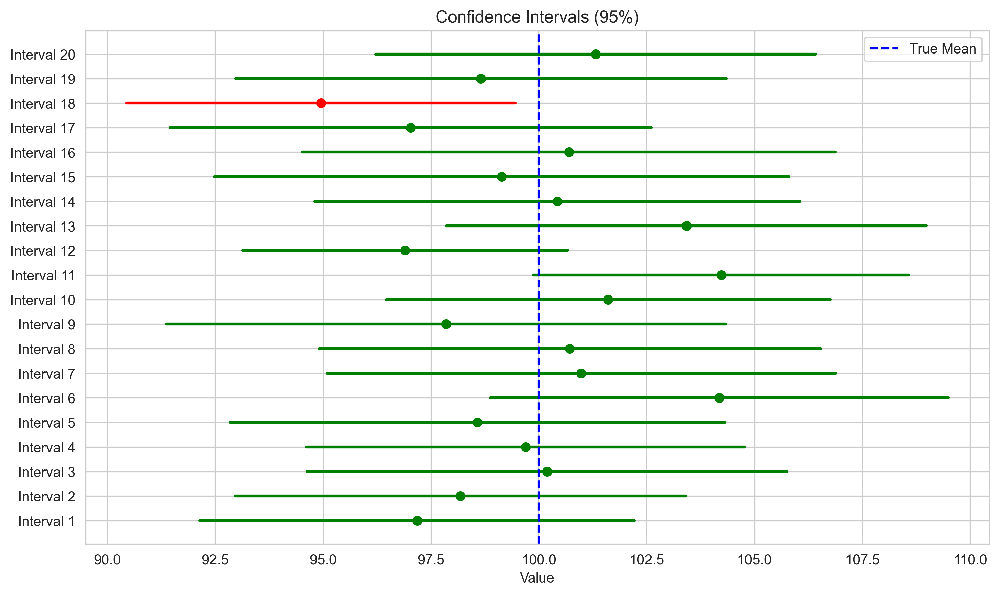
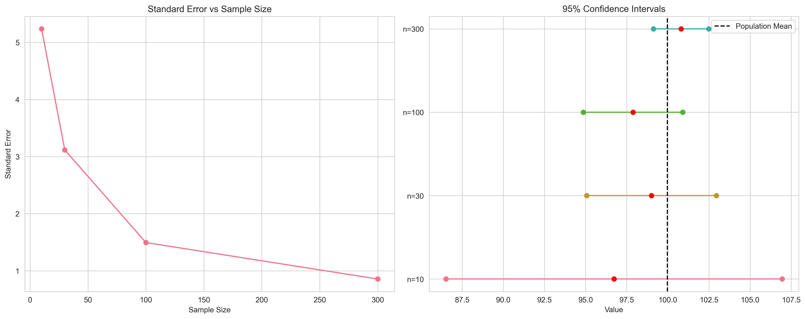
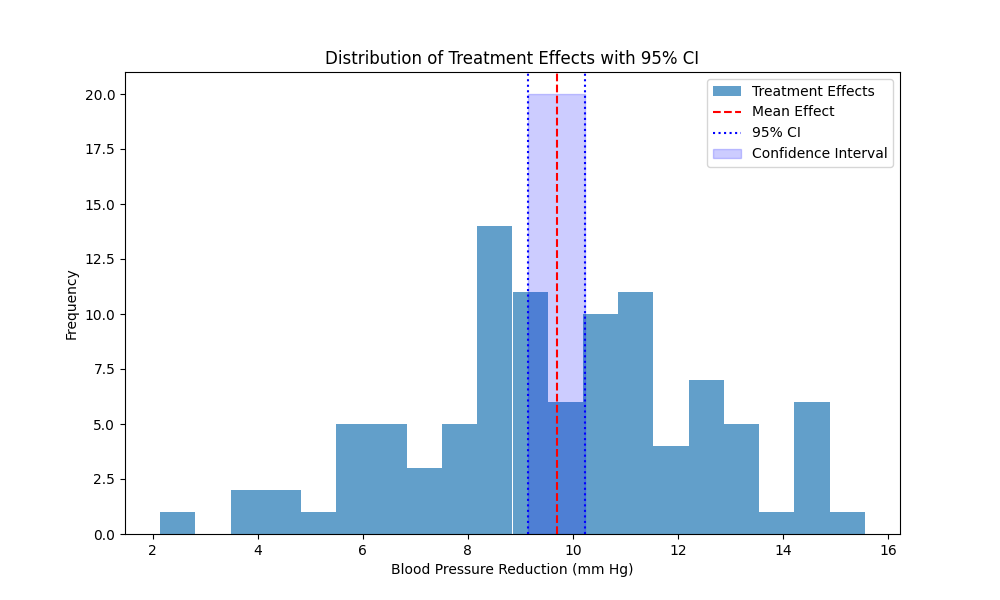
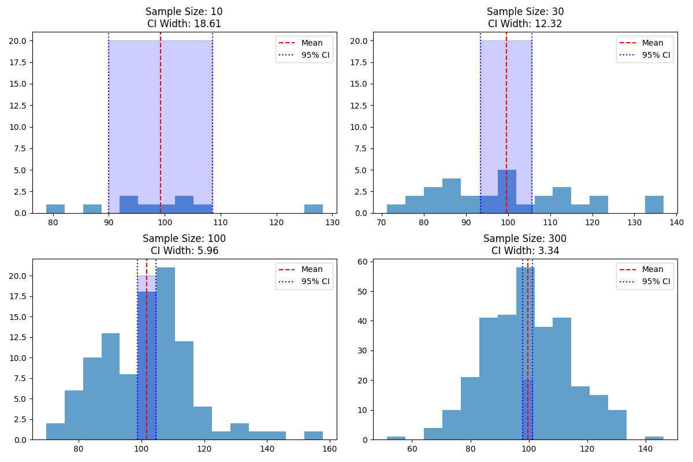
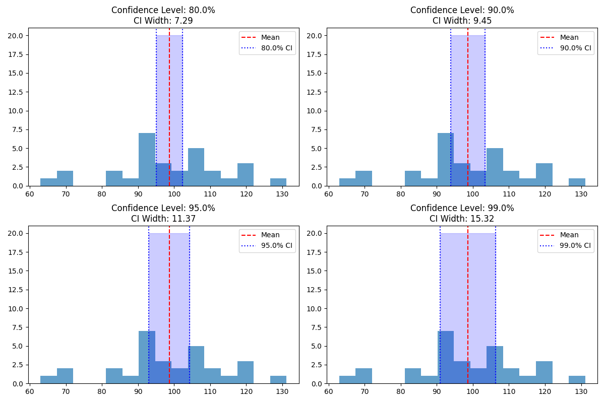
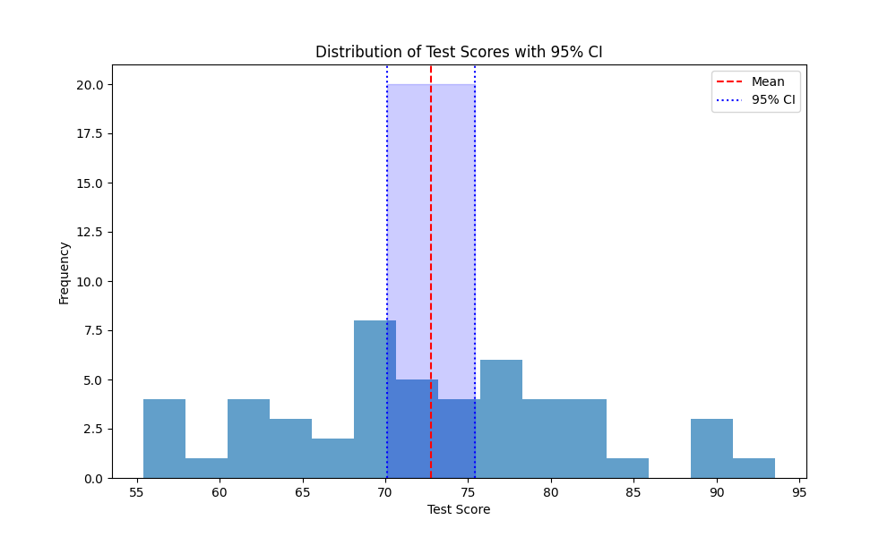
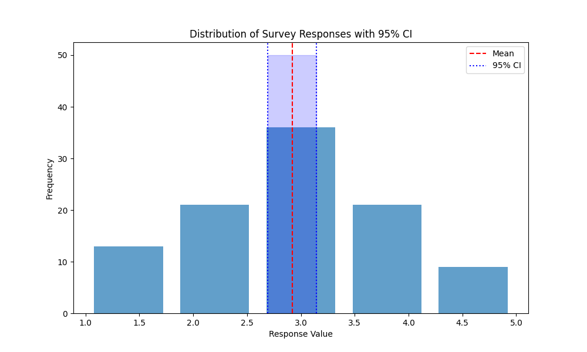
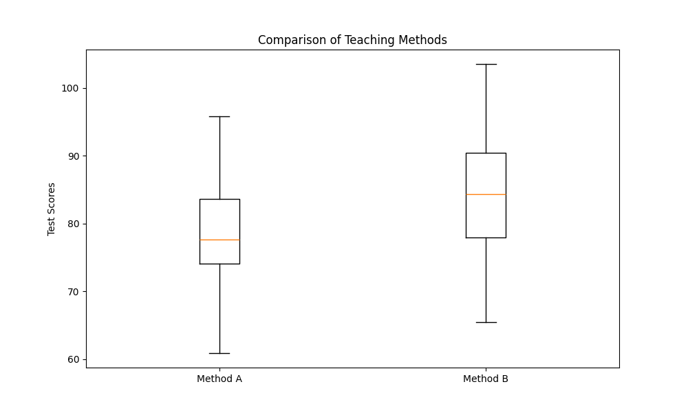

# Confidence Intervals: Quantifying Uncertainty in Statistics

## Introduction: Why Do We Need Confidence Intervals?

Imagine you're a weather forecaster trying to predict tomorrow's temperature. Instead of saying "it will be exactly 75°F," it's more realistic to say "it will be between 73°F and 77°F." That's the essence of confidence intervals - they help us express uncertainty in our estimates!

### Video Tutorial: Confidence Intervals Explained

<iframe width="560" height="315" src="https://www.youtube.com/embed/TqOeMYtOc1w" frameborder="0" allow="accelerometer; autoplay; clipboard-write; encrypted-media; gyroscope; picture-in-picture" allowfullscreen></iframe>

*StatQuest: Confidence Intervals, Clearly Explained!!! by Josh Starmer*


*Figure 1: The point estimate (red line) is surrounded by a range (blue shaded area) that likely contains the true parameter value.*

## What is a Confidence Interval?

A confidence interval is a range of values that likely contains the true population parameter, along with a measure of how confident we are in this range. Think of it as a "margin of error" around our best guess.

### The Mathematical Formula

For a mean with normal distribution:

$$CI = \bar{x} \pm (t_{\alpha/2} \times \frac{s}{\sqrt{n}})$$

where:

- x̄ is the sample mean
- t_α/2 is the t-value for desired confidence level
- s is the sample standard deviation
- n is the sample size


*Figure 2: The diagram shows how the margin of error is calculated using the t-value, standard error, and sample size.*

## Components of a Confidence Interval

### 1. Point Estimate (Center)

- Our best single guess at the parameter
- Usually the sample statistic (mean, proportion, etc.)

### 2. Margin of Error (Width)

- Measures the precision of our estimate
- Affected by:
  - Sample size
  - Confidence level
  - Population variability

### 3. Confidence Level

- Usually 95% or 99%
- Higher confidence = wider interval
- Trade-off between confidence and precision


*Figure 3: Visual breakdown of confidence interval components. The diagram shows how the point estimate, margin of error, and confidence level work together to create the interval.*

## Real-world Example: Clinical Trial

```python
import numpy as np
from scipy import stats
import matplotlib.pyplot as plt

# Simulate blood pressure reduction data
np.random.seed(42)

def analyze_clinical_trial():
    # Simulate blood pressure reduction in mm Hg
    treatment_effect = np.random.normal(loc=10, scale=3, size=100)
    
    # Calculate statistics
    mean_effect = np.mean(treatment_effect)
    std_effect = np.std(treatment_effect, ddof=1)
    
    # Calculate 95% CI
    confidence = 0.95
    df = len(treatment_effect) - 1
    t_value = stats.t.ppf((1 + confidence) / 2, df)
    margin_error = t_value * (std_effect / np.sqrt(len(treatment_effect)))
    
    ci_lower = mean_effect - margin_error
    ci_upper = mean_effect + margin_error
    
    # Visualize the results
    plt.figure(figsize=(10, 6))
    plt.hist(treatment_effect, bins=20, alpha=0.7, label='Treatment Effects')
    plt.axvline(mean_effect, color='red', linestyle='--', label='Mean Effect')
    plt.axvline(ci_lower, color='blue', linestyle=':', label='95% CI')
    plt.axvline(ci_upper, color='blue', linestyle=':')
    plt.fill_between([ci_lower, ci_upper], [0, 0], [20, 20], 
                     color='blue', alpha=0.2, label='Confidence Interval')
    plt.xlabel('Blood Pressure Reduction (mm Hg)')
    plt.ylabel('Frequency')
    plt.title('Distribution of Treatment Effects with 95% CI')
    plt.legend()
    plt.savefig('assets/treatment_effects_ci.png')
    plt.close()
    
    print("Clinical Trial Analysis")
    print(f"Average BP Reduction: {mean_effect:.1f} mm Hg")
    print(f"95% CI: ({ci_lower:.1f}, {ci_upper:.1f}) mm Hg")
    print(f"Interpretation: We're 95% confident that the true average")
    print(f"BP reduction lies between {ci_lower:.1f} and {ci_upper:.1f} mm Hg")

analyze_clinical_trial()
```

*Note: The visualization shows the distribution of treatment effects with the mean (red dashed line) and 95% confidence interval (blue shaded area). This helps us understand both the central tendency and the uncertainty in our estimate.*


*Figure 5: Distribution of treatment effects with mean and 95% confidence interval.*

## Common Misconceptions: What CIs Are NOT

### NOT the Range of the Data

The CI is about the population parameter, not individual values.

### NOT the Probability of Containing the Parameter

A specific interval either contains the parameter or doesn't.

### NOT All Equally Likely Within the Interval

The point estimate is our best guess.


*Figure 4: Visual explanation of common confidence interval misconceptions. The diagram contrasts what CIs are and what they are not.*

## Factors Affecting CI Width

### 1. Sample Size Effect

```python
def demonstrate_sample_size_effect():
    population_mean = 100
    population_std = 15
    sizes = [10, 30, 100, 300]
    
    # Visualize the effect of sample size
    plt.figure(figsize=(12, 8))
    for i, n in enumerate(sizes):
        plt.subplot(2, 2, i+1)
        sample = np.random.normal(population_mean, population_std, n)
        ci = stats.t.interval(0.95, len(sample)-1,
                            loc=np.mean(sample),
                            scale=stats.sem(sample))
        
        plt.hist(sample, bins=15, alpha=0.7)
        plt.axvline(np.mean(sample), color='red', linestyle='--', label='Mean')
        plt.axvline(ci[0], color='blue', linestyle=':', label='95% CI')
        plt.axvline(ci[1], color='blue', linestyle=':')
        plt.fill_between([ci[0], ci[1]], [0, 0], [20, 20], 
                        color='blue', alpha=0.2)
        plt.title(f'Sample Size: {n}\nCI Width: {ci[1]-ci[0]:.2f}')
        plt.legend()
    
    plt.tight_layout()
    plt.savefig('assets/sample_size_effect_ci.png')
    plt.close()
    
    print("\nSample Size Effect on CI Width")
    for n in sizes:
        sample = np.random.normal(population_mean, population_std, n)
        ci = stats.t.interval(0.95, len(sample)-1,
                            loc=np.mean(sample),
                            scale=stats.sem(sample))
        width = ci[1] - ci[0]
        print(f"\nSample size: {n}")
        print(f"CI width: {width:.2f}")
        print(f"Precision: {'*' * int(50/width)}")

demonstrate_sample_size_effect()
```

*Note: The visualization shows how confidence intervals become narrower as sample size increases, demonstrating the relationship between sample size and precision.*


*Figure 6: Effect of sample size on confidence interval width.*

### 2. Confidence Level Effect

```python
def demonstrate_confidence_level_effect():
    sample = np.random.normal(100, 15, 30)
    levels = [0.80, 0.90, 0.95, 0.99]
    
    # Visualize the effect of confidence level
    plt.figure(figsize=(12, 8))
    for i, level in enumerate(levels):
        plt.subplot(2, 2, i+1)
        ci = stats.t.interval(level, len(sample)-1,
                            loc=np.mean(sample),
                            scale=stats.sem(sample))
        
        plt.hist(sample, bins=15, alpha=0.7)
        plt.axvline(np.mean(sample), color='red', linestyle='--', label='Mean')
        plt.axvline(ci[0], color='blue', linestyle=':', label=f'{level*100}% CI')
        plt.axvline(ci[1], color='blue', linestyle=':')
        plt.fill_between([ci[0], ci[1]], [0, 0], [20, 20], 
                        color='blue', alpha=0.2)
        plt.title(f'Confidence Level: {level*100}%\nCI Width: {ci[1]-ci[0]:.2f}')
        plt.legend()
    
    plt.tight_layout()
    plt.savefig('assets/confidence_level_effect.png')
    plt.close()
    
    print("\nConfidence Level Effect on CI Width")
    for level in levels:
        ci = stats.t.interval(level, len(sample)-1,
                            loc=np.mean(sample),
                            scale=stats.sem(sample))
        width = ci[1] - ci[0]
        print(f"\n{level*100}% Confidence Level:")
        print(f"CI width: {width:.2f}")
        print(f"Reliability: {'*' * int(level*10)}")

demonstrate_confidence_level_effect()
```

*Note: The visualization shows how confidence intervals become wider as the confidence level increases, demonstrating the trade-off between confidence and precision.*


*Figure 7: Effect of confidence level on confidence interval width.*

## Different Types of Confidence Intervals

### 1. CI for a Mean (t-interval)

```python
def mean_ci(data, confidence=0.95):
    """Calculate CI for a mean using t-distribution"""
    mean = np.mean(data)
    sem = stats.sem(data)
    ci = stats.t.interval(confidence, len(data)-1, mean, sem)
    return ci, mean

# Example: Student test scores
scores = np.random.normal(75, 10, 50)
ci, mean = mean_ci(scores)

# Visualize the results
plt.figure(figsize=(10, 6))
plt.hist(scores, bins=15, alpha=0.7)
plt.axvline(mean, color='red', linestyle='--', label='Mean')
plt.axvline(ci[0], color='blue', linestyle=':', label='95% CI')
plt.axvline(ci[1], color='blue', linestyle=':')
plt.fill_between([ci[0], ci[1]], [0, 0], [20, 20], 
                 color='blue', alpha=0.2)
plt.xlabel('Test Score')
plt.ylabel('Frequency')
plt.title('Distribution of Test Scores with 95% CI')
plt.legend()
plt.savefig('assets/test_scores_ci.png')
plt.close()

print(f"\nTest Score Analysis")
print(f"Mean score: {mean:.1f}")
print(f"95% CI: ({ci[0]:.1f}, {ci[1]:.1f})")
```

*Note: The visualization shows the distribution of test scores with the mean and 95% confidence interval. This helps us understand both the average performance and the uncertainty in our estimate.*


*Figure 8: Distribution of test scores with mean and 95% confidence interval.*

### 2. CI for a Proportion

```python
def proportion_ci(successes, n, confidence=0.95):
    """Calculate CI for a proportion using Wilson score interval"""
    z = stats.norm.ppf((1 + confidence) / 2)
    p_hat = successes / n
    
    # Wilson score interval
    denominator = 1 + z**2/n
    center = (p_hat + z**2/(2*n))/denominator
    margin = z * np.sqrt(p_hat*(1-p_hat)/n + z**2/(4*n**2))/denominator
    
    return (center - margin, center + margin)

# Example: Survey responses
responses = 180  # positive responses
total = 200      # total responses
ci = proportion_ci(responses, total)

# Visualize the results
plt.figure(figsize=(8, 6))
plt.bar(['Response Rate'], [responses/total], yerr=[(ci[1]-ci[0])/2], 
        capsize=10, color='blue', alpha=0.7)
plt.axhline(y=ci[0], color='red', linestyle=':', label='95% CI')
plt.axhline(y=ci[1], color='red', linestyle=':')
plt.ylim(0, 1)
plt.ylabel('Proportion')
plt.title('Survey Response Rate with 95% CI')
plt.legend()
plt.savefig('assets/survey_response_ci.png')
plt.close()

print(f"\nSurvey Analysis")
print(f"Response rate: {responses/total:.1%}")
print(f"95% CI: ({ci[0]:.1%}, {ci[1]:.1%})")
```

*Note: The visualization shows the survey response rate with error bars representing the 95% confidence interval. This helps us understand both the proportion of positive responses and the uncertainty in our estimate.*


*Figure 9: Survey response rate with 95% confidence interval.*

### 3. CI for Difference Between Means

```python
def diff_means_ci(group1, group2, confidence=0.95):
    """Calculate CI for difference between two means"""
    diff = np.mean(group1) - np.mean(group2)
    
    # Pooled standard error
    n1, n2 = len(group1), len(group2)
    var1, var2 = np.var(group1, ddof=1), np.var(group2, ddof=1)
    se = np.sqrt(var1/n1 + var2/n2)
    
    # Welch-Satterthwaite degrees of freedom
    df = (var1/n1 + var2/n2)**2 / ((var1/n1)**2/(n1-1) + (var2/n2)**2/(n2-1))
    
    # Calculate CI
    t_val = stats.t.ppf((1 + confidence) / 2, df)
    margin = t_val * se
    
    return (diff - margin, diff + margin)

# Example: Comparing two teaching methods
method1_scores = np.random.normal(75, 10, 30)
method2_scores = np.random.normal(72, 10, 30)
ci = diff_means_ci(method1_scores, method2_scores)

# Visualize the results
plt.figure(figsize=(10, 6))
plt.boxplot([method1_scores, method2_scores], labels=['Method 1', 'Method 2'])
plt.title('Comparison of Teaching Methods')
plt.ylabel('Test Score')
plt.savefig('assets/teaching_methods_comparison.png')
plt.close()

print(f"\nTeaching Method Comparison")
print(f"Mean difference: {np.mean(method1_scores) - np.mean(method2_scores):.1f}")
print(f"95% CI: ({ci[0]:.1f}, {ci[1]:.1f})")
```

*Note: The visualization shows the distribution of test scores for both teaching methods using box plots. This helps us understand both the difference in means and the variability in each group.*


*Figure 10: Comparison of test scores between teaching methods.*

## Best Practices for Using CIs

### 1. Choose Appropriate Confidence Level

- 95% is standard but consider your needs
- Higher stakes = higher confidence level
- Remember the width trade-off

### 2. Report Complete Information

- Point estimate
- Confidence level
- Interval bounds
- Sample size

### 3. Consider Context

- Practical significance
- Cost of errors
- Required precision

### 4. Visualize When Possible

- Error bars
- Forest plots
- Confidence bands


*Figure 5: Visual guide to best practices for using confidence intervals. The diagram shows how to properly report and interpret confidence intervals.*

## Practice Questions

1. A 95% CI for mean customer satisfaction is (7.2, 7.8). What does this mean in practical terms?
2. Why might we prefer a 99% CI over a 95% CI in medical research?
3. How would you explain confidence intervals to a non-technical stakeholder?
4. If we increase sample size from 100 to 400, what happens to CI width? Why?
5. When would you use different types of confidence intervals?

## Key Takeaways

1. CIs quantify uncertainty in estimates
2. Larger samples = narrower intervals
3. Higher confidence = wider intervals
4. Different types of CIs for different parameters
5. Always consider both statistical and practical significance
6. Visualize your data to better understand the results
7. Report complete information about your intervals

## Additional Resources

- [Interactive CI Simulator](https://seeing-theory.brown.edu/frequentist-inference/index.html)
- [Understanding CIs in Medical Research](https://www.ncbi.nlm.nih.gov/pmc/articles/PMC2689604/)
- [Common CI Mistakes](https://statisticsbyjim.com/hypothesis-testing/confidence-intervals/)

Remember: Confidence intervals are powerful tools for quantifying uncertainty, but they must be used and interpreted correctly!
