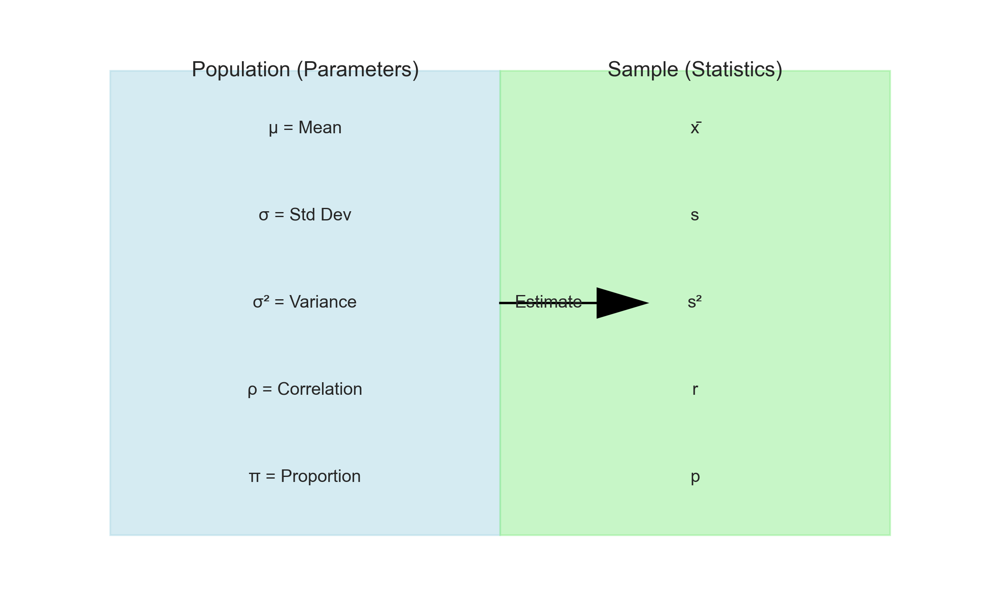
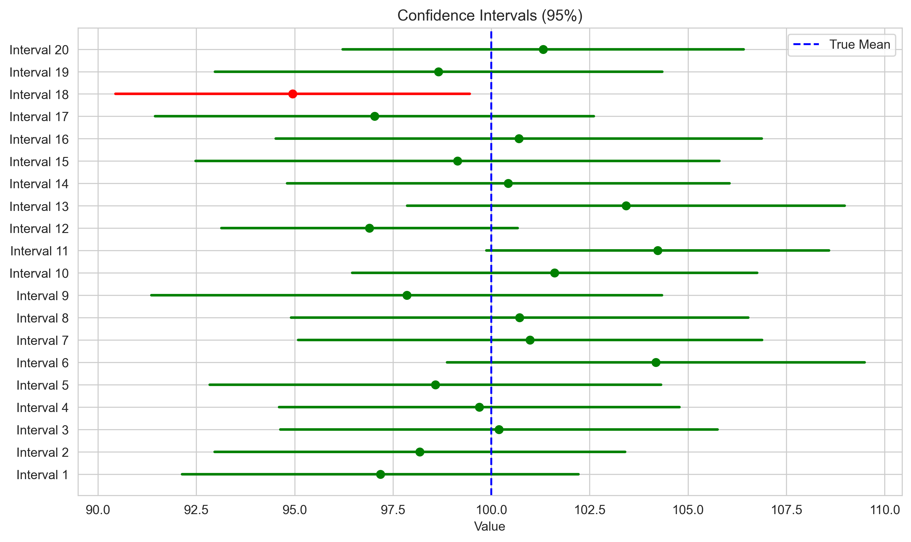
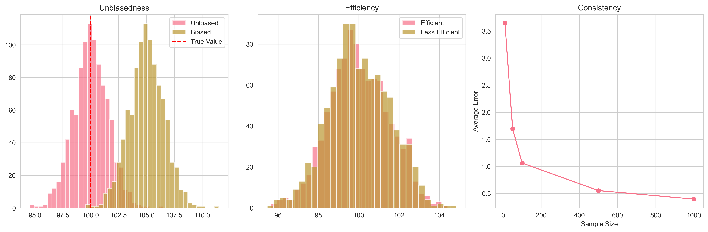
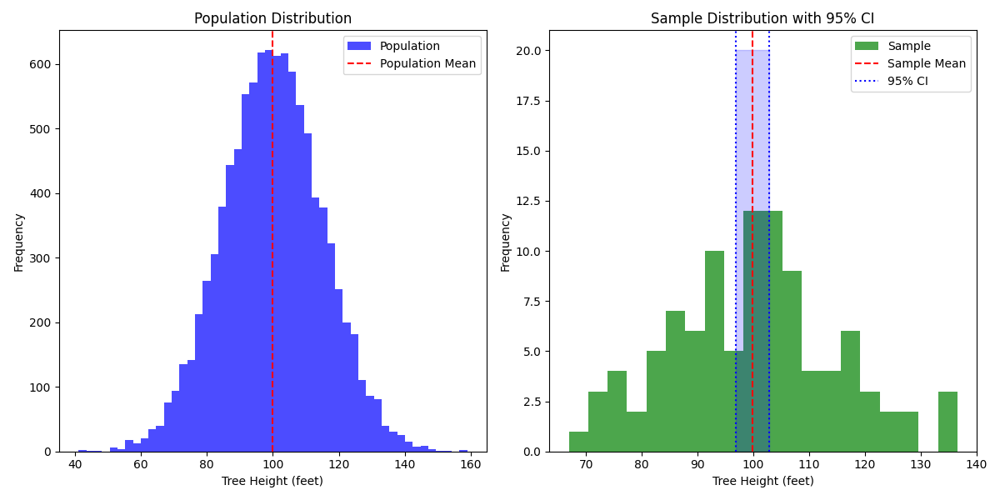
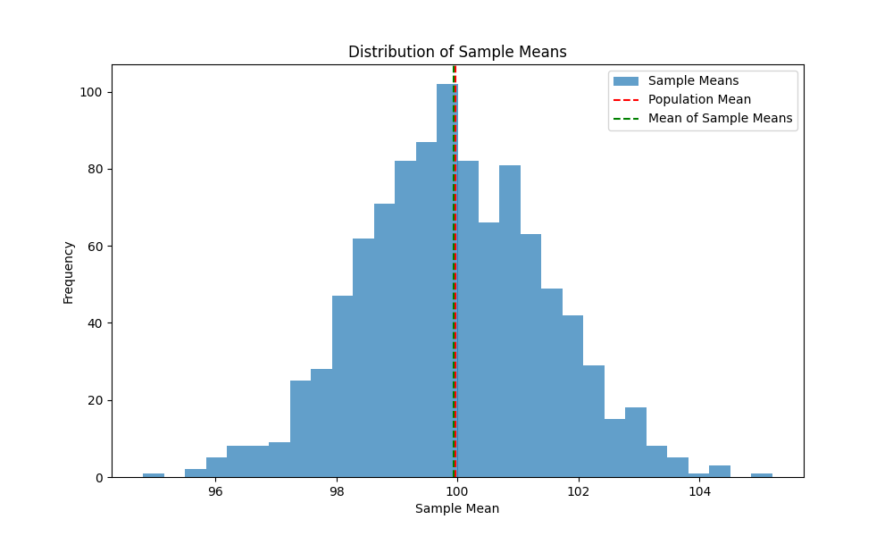
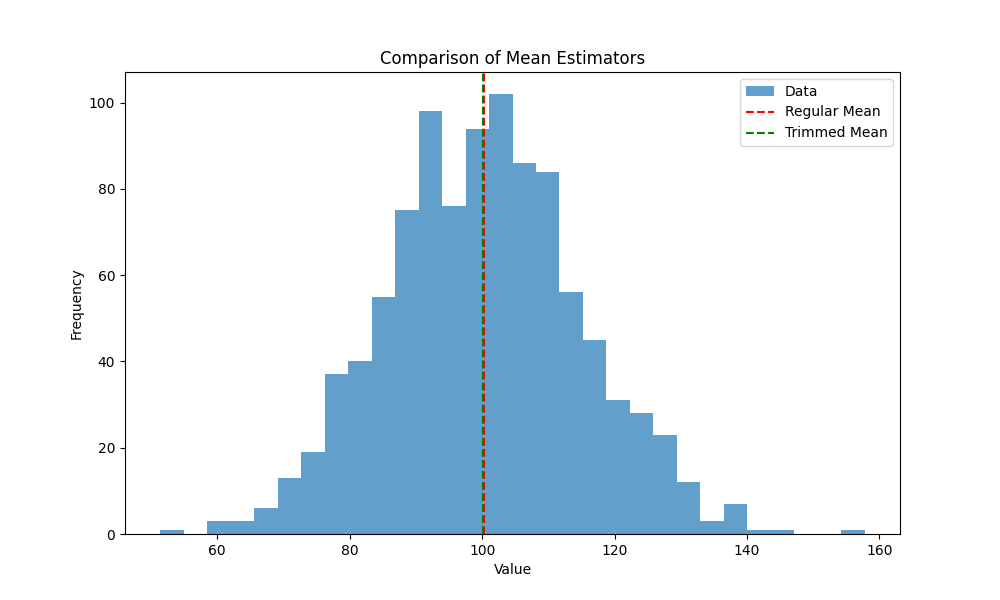
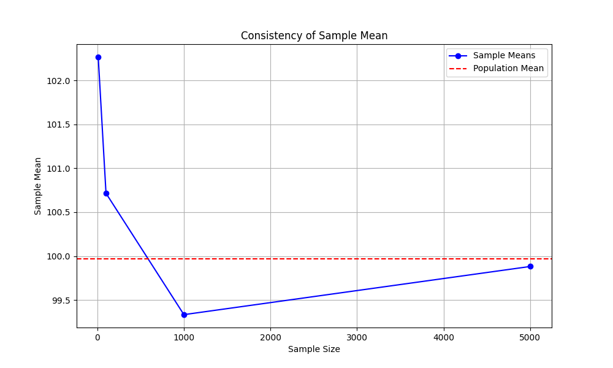
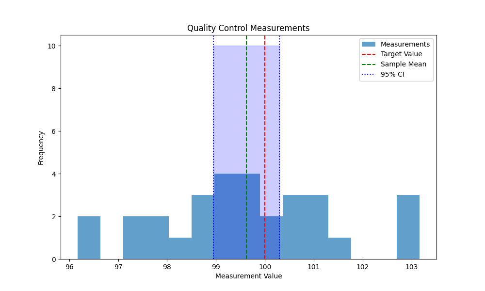
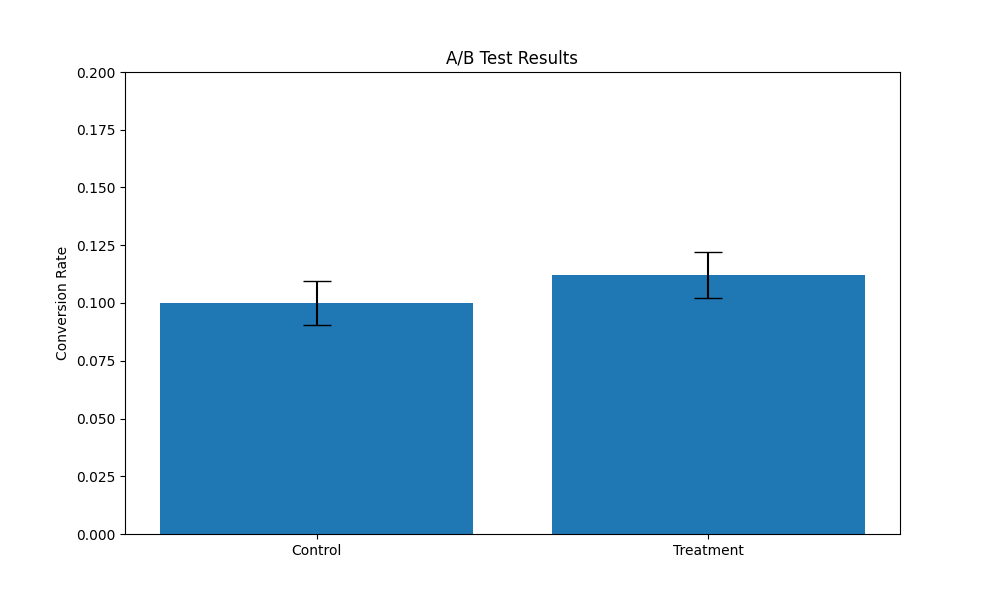

# Parameters and Statistics: The Bridge to Understanding Populations

**After this lesson:** you can explain Parameters and Statistics: The Bridge to Understanding Populations and try the examples in your own notebook.

## Overview

**Parameters** describe populations (usually unknown); **statistics** are computed from samples and estimate those parameters. This lesson pulls together notation, point and interval estimates, and properties of estimators, after you have already seen intervals, sampling behavior, and p-values in context.

## Why this matters

- You will separate **population parameters** (unknown, fixed) from **sample statistics** (computed from data) in every inference task.
- You will read notation (e.g. Greek vs Latin letters) the way textbooks and software reports use it.

## Prerequisites

- All earlier lessons in this submodule: [population vs sample](./population-sample.md), [sampling distributions](./sampling-distributions.md), [confidence intervals](./confidence-intervals.md), and [understanding p-values](./p-values.md).
- Optional: [Module 1.3 statistics](../../1-data-fundamentals/1.3-intro-statistics/README.md) for notation refresh.

> **Note:** This lesson consolidates vocabulary from earlier files in submodule 4.1; skim the headings if you are already comfortable with Greek vs Latin symbols.

## Introduction

Imagine you're a detective trying to understand the average height of all trees in the Amazon rainforest. It's impossible to measure every tree, but you can measure some trees and use that information to make educated guesses about all trees. This is where parameters and statistics come into play!

In statistical inference, we distinguish between parameters and statistics. Parameters are numerical characteristics of a population, while statistics are numerical characteristics of a sample. Understanding this distinction is important for making valid inferences about populations based on sample data.



## Definitions

### Parameters

- Fixed, unknown values that describe a population
- Typically denoted by Greek letters (e.g., \\(\mu\\), \\(\sigma\\), \\(\sigma^2\\), \\(\rho\\)), and by \\(p\\) for the population proportion (most modern texts use Latin \\(p\\) for the population proportion and \\(\hat p\\) for the sample proportion)
- Examples: population mean, population standard deviation, population proportion

### Statistics

- Calculated values from sample data
- Used to estimate population parameters
- Typically denoted by Latin letters (e.g., \\(\bar x\\), \\(s\\), \\(s^2\\), \\(r\\), \\(\hat p\\))
- Examples: sample mean, sample standard deviation, sample proportion

### Estimator vs estimate vs statistic

These three words sound interchangeable but mean different things, and the distinction matters once you start reasoning about hypothesis tests and regression:

- **Estimator**: the *rule or formula* you apply to data. Example: "take the arithmetic mean of the sample." An estimator is a function; it has properties like bias and variance regardless of which dataset you feed it.
- **Estimate**: the *single number* the estimator produces on one specific dataset. Example: \\(\bar x = 99.86\\) feet for the sample of 100 trees below. Run the estimator on a different sample and you get a different estimate.
- **Statistic**: any quantity computed from sample data. Every estimate is a statistic, but "statistic" is also the broader umbrella that covers things you would never use as estimators (e.g., the sample minimum, or a test statistic like \\(t\\)).

When the lesson says "the sample mean is unbiased," the subject is the estimator (the rule), not any one estimate. A specific value like \\(\bar x = 99.86\\) is neither biased nor unbiased, it's just a number.


*Figure 1: Visual representation of the relationship between population parameters and sample statistics. Parameters (Greek letters) describe the entire population, while statistics (Latin letters) are calculated from samples to estimate these parameters.*

## Point and Interval Estimates

### Point Estimates

- Single value estimates of population parameters
- Examples:
  - Sample mean (\\(\bar x\\)) as an estimate of population mean (\\(\mu\\))
  - Sample proportion (\\(\hat p\\)) as an estimate of population proportion (\\(p\\))

### Interval Estimates

- Range of values that likely contains the population parameter
- Provides more information than point estimates
- Example: Confidence intervals


*Figure 2: Visualization of confidence intervals. The red line represents our point estimate, while the blue shaded area shows the range where we're confident the true parameter lies.*

## Properties of Good Estimators

A good estimator should possess the following properties:

1. **Unbiasedness**
   - The expected value of the estimator equals the parameter being estimated
   - Example: Sample mean is an unbiased estimator of population mean

2. **Efficiency**
   - Among unbiased estimators, the one with the smallest variance is most efficient
   - Example: Sample mean is more efficient than sample median for normal distributions

3. **Consistency**
   - As sample size increases, the estimator converges to the parameter value
   - Example: Sample mean becomes more accurate as sample size increases


*Figure 3: Visual comparison of different estimator properties. The top panel shows unbiased vs biased estimators, the middle panel demonstrates efficiency, and the bottom panel illustrates consistency.*

## From Sample to Population: Making the Connection

### Point Estimates: Our Best Single Guess

A point estimate is like taking your best shot at the true value:

**Simulated forest: μ vs one \\(\bar x\\)**

<div class="code-explainer" data-code-explainer>
<div class="code-explainer__code">


import numpy as np
np.random.seed(42)  # For reproducibility

# Simulate a population of tree heights (in feet)
population = np.random.normal(loc=100, scale=15, size=10000)
population_mean = np.mean(population)

# Take a sample and calculate point estimate
sample = np.random.choice(population, size=100)
sample_mean = np.mean(sample)

print(f"Tree Height Analysis")
print(f"Population mean (μ): {population_mean:.2f} feet")
print(f"Sample mean (x̄): {sample_mean:.2f} feet")
print(f"Difference: {abs(population_mean - sample_mean):.2f} feet")

```
Tree Height Analysis
Population mean (μ): 99.97 feet
Sample mean (x̄): 99.86 feet
Difference: 0.11 feet
```


</div>
<aside class="code-explainer__callouts" aria-label="Code walkthrough">
  <div class="code-callout" data-lines="5-6" data-tint="1">
    <div class="code-callout__meta">
      <span class="code-callout__lines"></span>
      <span class="code-callout__title">Population (μ)</span>
    </div>
    <div class="code-callout__body">
      <p>Simulate 10,000 tree heights, in real research μ would be unknown; here we know it so we can grade the estimator below.</p>
    </div>
  </div>
  <div class="code-callout" data-lines="9-10" data-tint="2">
    <div class="code-callout__meta">
      <span class="code-callout__lines"></span>
      <span class="code-callout__title">Sample statistic (x̄)</span>
    </div>
    <div class="code-callout__body">
      <p>Draw 100 heights and compute the sample mean x̄, our point estimate of μ.</p>
    </div>
  </div>
</aside>
</div>


*Figure 4: Comparison of population and sample distributions for tree heights. The red dashed lines indicate the means, and the blue shaded area shows the 95% confidence interval.*

### Interval Estimates: Being Realistic About Uncertainty

Instead of a single guess, we provide a range where we believe the true value lies:

**t-interval continuing the same sample**

<div class="code-explainer" data-code-explainer>
<div class="code-explainer__code">


from scipy import stats

# Calculate 95% confidence interval
confidence_level = 0.95
sample_std = np.std(sample, ddof=1)  # ddof=1 for sample standard deviation
sample_size = len(sample)

# Calculate margin of error
# (1 + confidence_level) / 2 = 0.975: two-sided, upper tail at α/2.
margin_of_error = stats.t.ppf((1 + confidence_level) / 2, sample_size - 1) * \
                 (sample_std / np.sqrt(sample_size))

ci_lower = sample_mean - margin_of_error
ci_upper = sample_mean + margin_of_error

print(f"\nConfidence Interval Analysis")
print(f"{confidence_level*100}% Confidence Interval:")
print(f"({ci_lower:.2f}, {ci_upper:.2f}) feet")
print(f"Interpretation: across repeated samples, {confidence_level*100}% of intervals")
print(f"built this way would capture the true mean; this one is ({ci_lower:.2f}, {ci_upper:.2f}) feet")

```

Confidence Interval Analysis
95.0% Confidence Interval:
(96.90, 102.82) feet
Interpretation: across repeated samples, 95.0% of intervals
built this way would capture the true mean; this one is (96.90, 102.82) feet
```


</div>
<aside class="code-explainer__callouts" aria-label="Code walkthrough">
  <div class="code-callout" data-lines="1-7" data-tint="1">
    <div class="code-callout__meta">
      <span class="code-callout__lines"></span>
      <span class="code-callout__title">Margin of error</span>
    </div>
    <div class="code-callout__body">
      <p>Compute the t critical value for n−1 degrees of freedom and multiply by the standard error (s/√n) to get the margin of error for a 95% interval.</p>
    </div>
  </div>
  <div class="code-callout" data-lines="9-19" data-tint="2">
    <div class="code-callout__meta">
      <span class="code-callout__lines"></span>
      <span class="code-callout__title">Interval bounds</span>
    </div>
    <div class="code-callout__body">
      <p>Subtract and add the margin of error from the sample mean to form the interval, then print a plain-language interpretation of what 95% confidence means.</p>
    </div>
  </div>
</aside>
</div>

```

Confidence Interval Analysis
95.0% Confidence Interval:
(96.90, 102.82) feet
Interpretation: across repeated samples, 95.0% of intervals
built this way would capture the true mean; this one is (96.90, 102.82) feet
```

## What Makes a Good Estimator?

### 1. Unbiasedness: Hitting the Target on Average

An unbiased estimator's expected value equals the population parameter:

**Monte Carlo average of \\(\bar x\\)**

<div class="code-explainer" data-code-explainer>
<div class="code-explainer__code">


# Demonstrate unbiasedness of sample mean
n_simulations = 1000
sample_means = []

for _ in range(n_simulations):
    sample = np.random.choice(population, size=100)
    sample_means.append(np.mean(sample))

mean_of_means = np.mean(sample_means)

print(f"\nUnbiasedness Analysis")
print(f"True population mean: {population_mean:.2f}")
print(f"Average of {n_simulations} sample means: {mean_of_means:.2f}")
print(f"Difference: {abs(population_mean - mean_of_means):.2f}")

```

Unbiasedness Analysis
True population mean: 99.97
Average of 1000 sample means: 99.94
Difference: 0.03
```


</div>
<aside class="code-explainer__callouts" aria-label="Code walkthrough">
  <div class="code-callout" data-lines="1-8" data-tint="1">
    <div class="code-callout__meta">
      <span class="code-callout__lines"></span>
      <span class="code-callout__title">Monte Carlo simulation</span>
    </div>
    <div class="code-callout__body">
      <p>Draw 1,000 independent samples of size 100 and record each mean to build an empirical picture of the sampling distribution.</p>
    </div>
  </div>
  <div class="code-callout" data-lines="10-14" data-tint="2">
    <div class="code-callout__meta">
      <span class="code-callout__lines"></span>
      <span class="code-callout__title">Verify unbiasedness</span>
    </div>
    <div class="code-callout__body">
      <p>Compute the mean of 1,000 sample means and compare to μ-the tiny difference confirms the sample mean is an unbiased estimator.</p>
    </div>
  </div>
</aside>
</div>


*Figure 5: Distribution of sample means around the population mean. The green dashed line shows the mean of sample means, which is very close to the true population mean (red dashed line).*

### 2. Efficiency: Minimal Variance

An efficient estimator has less variability in its estimates:

**Mean vs 10% trimmed mean on the same draw**

<div class="code-explainer" data-code-explainer>
<div class="code-explainer__code">


def compare_estimators(data):
    """Compare mean estimators"""
    # Regular mean
    mean1 = np.mean(data)
    # Trimmed mean (less efficient for normal data)
    mean2 = stats.trim_mean(data, 0.1)

    return mean1, mean2

# Compare estimators
regular_mean, trimmed_mean = compare_estimators(sample)
print(f"\nEfficiency Analysis")
print(f"Regular mean: {regular_mean:.2f}")
print(f"Trimmed mean: {trimmed_mean:.2f}")

```

Efficiency Analysis
Regular mean: 99.80
Trimmed mean: 99.71
```


</div>
<aside class="code-explainer__callouts" aria-label="Code walkthrough">
  <div class="code-callout" data-lines="1-8" data-tint="1">
    <div class="code-callout__meta">
      <span class="code-callout__lines"></span>
      <span class="code-callout__title">Two estimators</span>
    </div>
    <div class="code-callout__body">
      <p>Compute the plain mean and a 10%-trimmed mean on the same data, the trimmed version drops the extreme 10% from each tail before averaging.</p>
    </div>
  </div>
  <div class="code-callout" data-lines="10-14" data-tint="2">
    <div class="code-callout__meta">
      <span class="code-callout__lines"></span>
      <span class="code-callout__title">Efficiency comparison</span>
    </div>
    <div class="code-callout__body">
      <p>Print both estimates side by side; for normal data the plain mean is more efficient (lower variance), while the trimmed mean becomes competitive with heavy tails.</p>
    </div>
  </div>
</aside>
</div>


*Figure 6: Comparison of regular mean (red) and trimmed mean (green) estimators. The regular mean is more efficient for normally distributed data.*

### 3. Consistency: Getting Better with More Data

A consistent estimator converges to the true value as sample size increases:

**One \\(\bar x\\) per n on a ladder of sizes**

<div class="code-explainer" data-code-explainer>
<div class="code-explainer__code">


# Demonstrate consistency with increasing sample sizes
sample_sizes = [10, 100, 1000, 5000]
results = []

for size in sample_sizes:
    sample = np.random.choice(population, size=size)
    sample_mean = np.mean(sample)
    results.append(sample_mean)

print(f"\nConsistency Analysis")
print(f"True population mean: {population_mean:.2f}")
for size, result in zip(sample_sizes, results):
    print(f"Sample size {size:4d}: {result:.2f} (Diff: {abs(result - population_mean):.2f})")

```

Consistency Analysis
True population mean: 99.97
Sample size   10: 105.13 (Diff: 5.17)
Sample size  100: 101.35 (Diff: 1.38)
Sample size 1000: 100.18 (Diff: 0.21)
Sample size 5000: 99.81 (Diff: 0.16)
```


</div>
<aside class="code-explainer__callouts" aria-label="Code walkthrough">
  <div class="code-callout" data-lines="1-8" data-tint="1">
    <div class="code-callout__meta">
      <span class="code-callout__lines"></span>
      <span class="code-callout__title">Size ladder</span>
    </div>
    <div class="code-callout__body">
      <p>Draw one independent sample at each of four sizes (10, 100, 1000, 5000) and record the resulting sample mean.</p>
    </div>
  </div>
  <div class="code-callout" data-lines="10-13" data-tint="2">
    <div class="code-callout__meta">
      <span class="code-callout__lines"></span>
      <span class="code-callout__title">Convergence printout</span>
    </div>
    <div class="code-callout__body">
      <p>Print the absolute difference between each sample mean and μ-it should generally shrink as n grows, illustrating consistency numerically.</p>
    </div>
  </div>
</aside>
</div>


*Figure 7: Demonstration of consistency. As sample size increases, the sample mean (blue line) converges to the true population mean (red dashed line).*

## Real-World Applications

### 1. Quality Control in Manufacturing

**One-shot manufacturing sample → t CI**

<div class="code-explainer" data-code-explainer>
<div class="code-explainer__code">


import numpy as np
from scipy import stats

def quality_control_example():
    # Simulate production measurements
    population_mean = 100  # Target value
    population_std = 2
    sample_size = 30

    # Generate sample
    sample = np.random.normal(population_mean, population_std, sample_size)

    # Calculate statistics
    sample_mean = np.mean(sample)
    sample_std = np.std(sample, ddof=1)

    # Calculate 95% confidence interval
    ci = stats.t.interval(0.95, len(sample)-1,
                         loc=sample_mean,
                         scale=stats.sem(sample))

    return {
        'sample_mean': sample_mean,
        'sample_std': sample_std,
        'confidence_interval': ci
    }



</div>
<aside class="code-explainer__callouts" aria-label="Code walkthrough">
  <div class="code-callout" data-lines="4-11" data-tint="1">
    <div class="code-callout__meta">
      <span class="code-callout__lines"></span>
      <span class="code-callout__title">QC sample</span>
    </div>
    <div class="code-callout__body">
      <p>Draw 30 production measurements from N(100, 2²) simulating a manufacturing process with a known target value.</p>
    </div>
  </div>
  <div class="code-callout" data-lines="13-22" data-tint="2">
    <div class="code-callout__meta">
      <span class="code-callout__lines"></span>
      <span class="code-callout__title">t-interval</span>
    </div>
    <div class="code-callout__body">
      <p>Use <code>stats.t.interval</code> with <code>stats.sem</code> as the scale parameter to produce a 95% CI, a one-line alternative to the manual ppf × SE formula.</p>
    </div>
  </div>
</aside>
</div>


*Figure 8: Quality control measurements with target value (red), sample mean (green), and 95% confidence interval (blue).*

### 2. A/B Testing in Tech

**Bernoulli arms and normal-approx CI on \\(\hat p_T - \hat p_C\\)**

<div class="code-explainer" data-code-explainer>
<div class="code-explainer__code">


def ab_testing_example():
    # Simulate conversion rates
    control_rate = 0.1
    treatment_rate = 0.12
    sample_size = 1000

    # Generate samples
    control = np.random.binomial(1, control_rate, sample_size)
    treatment = np.random.binomial(1, treatment_rate, sample_size)

    # Calculate statistics
    control_mean = np.mean(control)
    treatment_mean = np.mean(treatment)

    # Calculate difference and confidence interval
    diff = treatment_mean - control_mean
    diff_std = np.sqrt(control_mean*(1-control_mean)/sample_size +
                      treatment_mean*(1-treatment_mean)/sample_size)
    ci = stats.norm.interval(0.95, loc=diff, scale=diff_std)

    return {
        'control_rate': control_mean,
        'treatment_rate': treatment_mean,
        'difference': diff,
        'confidence_interval': ci
    }



</div>
<aside class="code-explainer__callouts" aria-label="Code walkthrough">
  <div class="code-callout" data-lines="1-11" data-tint="1">
    <div class="code-callout__meta">
      <span class="code-callout__lines"></span>
      <span class="code-callout__title">Bernoulli arms</span>
    </div>
    <div class="code-callout__body">
      <p>Simulate binary conversion events for 1,000 users in each arm using Bernoulli draws at 10% and 12% rates.</p>
    </div>
  </div>
  <div class="code-callout" data-lines="13-21" data-tint="2">
    <div class="code-callout__meta">
      <span class="code-callout__lines"></span>
      <span class="code-callout__title">Lift and CI</span>
    </div>
    <div class="code-callout__body">
      <p>Compute the difference in observed rates, build a normal-approx SE for the difference, and use <code>stats.norm.interval</code> to produce a 95% CI for the lift.</p>
    </div>
  </div>
</aside>
</div>


*Figure 9: A/B test results showing conversion rates for control and treatment groups with error bars.*

## Practice Questions

Try each question on your own first, then expand the answer to check.

**1.** A company measures the battery life of 100 phones and finds a mean of 12 hours. Is this a parameter or a statistic? Why?

<details>
<summary>Show answer</summary>

It's a **statistic** (\\(\bar x = 12\\) hours).

- A **parameter** would be the *true* mean battery life of *all* phones the company has produced (or will produce), call it \\(\mu\\). That's a single fixed number, almost always unknown, because they don't measure every phone.
- A **statistic** is computed from the sample, here, the average of those 100 phones. It's our best guess of \\(\mu\\), but it will be slightly different if a different 100 phones are tested.

Notation cue: Greek letter (\\(\mu\\)) → parameter. Latin letter (\\(\bar x\\)) → statistic.

</details>

**2.** How would increasing sample size affect the width of a confidence interval? Explain using the margin of error formula.

<details>
<summary>Show answer</summary>

The margin of error is:

\\[
\text{MOE} = t^* \cdot \dfrac{s}{\sqrt{n}}
\\]

So MOE shrinks like \\(1/\sqrt{n}\\). The CI width = 2 × MOE, so doubling \\(n\\) reduces the width by \\(1/\sqrt{2} \approx 0.71\\) (≈ 29% narrower). To **halve** the width, you need to **quadruple** \\(n\\).

Quick mental math:

| \\(n\\) | Relative CI width |
|---|---|
| 100 | 1.00 (baseline) |
| 200 | 0.71 |
| 400 | 0.50 |
| 1,600 | 0.25 |

This square-root relationship is why "just collect more data" hits diminishing returns fast.

</details>

**3.** Design a sampling strategy for estimating the average time users spend on a social media app. What statistics would you use?

<details>
<summary>Show answer</summary>

**Strategy:**

1. **Define the population.** All active users in the past 30 days (or whatever the product team cares about). Decide whether to include test accounts, internal users, and bots.
2. **Pick the unit of analysis.** Per-user *daily session minutes*, averaged over a window, much more stable than a single day per user.
3. **Stratify** by user segment (free vs. paid, region, device type, tenure). Time-on-app varies heavily by segment, so stratifying gives a tighter overall estimate.
4. **Use sufficient \\(n\\) per stratum.** Time-on-app is right-skewed (most use it briefly; a few use it for hours), so aim for \\(n \geq 50\text{-}100\\) per stratum so the CLT works.

**Statistics to report:**

| Statistic | Why |
|---|---|
| Sample mean \\(\bar x\\) | Standard estimate of average time |
| **Median** | Skewed data, the median is a better "typical user" summary |
| Standard error of the mean | For confidence intervals |
| 95% CI for the mean | So stakeholders see uncertainty |
| Quantiles (e.g., p50, p90, p95) | Show the spread, not just the average |

Always report **both** the mean and the median for skewed data, the gap between them tells you about heavy tails.

</details>

**4.** If you had to choose between an unbiased estimator with high variance and a slightly biased estimator with low variance, which would you pick? Why?

<details>
<summary>Show answer</summary>

In most practical settings, **the slightly biased estimator with low variance** wins. The right metric to compare them is **mean squared error (MSE)**:

\\[
\text{MSE} = \text{Bias}^2 + \text{Variance}
\\]

Suppose:

- **Unbiased estimator A:** Bias = 0, Variance = 100 → MSE = 100
- **Biased estimator B:** Bias = 1, Variance = 4 → MSE = 1 + 4 = 5

Estimator B's typical estimate lands much closer to the true value, even though it's slightly off-target on average. This is the **bias-variance trade-off** that comes up everywhere, regression regularization (ridge, lasso), shrinkage estimators, and smoothing all *intentionally* add bias to reduce variance.

**When unbiasedness wins instead:**

- When stakes are high and you specifically need "no systematic distortion" (regulated reports, scientific publication of effects).
- When the bias is hard to quantify or could compound across analyses.

**Default rule:** prefer lower MSE; document any bias clearly.

</details>

**5.** How could you use bootstrapping to assess the reliability of your sample statistics?

<details>
<summary>Show answer</summary>

**Bootstrapping** is "fake repeated sampling": you resample *from your existing data with replacement* many times to mimic what would happen if you ran the study again.

Recipe:

1. Have a sample of size \\(n\\). Compute your statistic of interest (mean, median, ratio, whatever).
2. Draw a **bootstrap sample** of size \\(n\\) from your data, **with replacement**. Compute the statistic on this resample.
3. Repeat step 2 about 1,000-10,000 times. You now have a distribution of bootstrap statistics.
4. Use the distribution to:
   - **Estimate standard error** = standard deviation of the bootstrap statistics.
   - **Build a 95% CI** = the 2.5th and 97.5th percentiles of the bootstrap statistics (the "percentile" method).

```python
import numpy as np
rng = np.random.default_rng(42)
data = rng.normal(50, 10, size=200)  # your original sample

n_boot = 10_000
boot_means = [np.mean(rng.choice(data, size=len(data), replace=True))
              for _ in range(n_boot)]

print(f"Bootstrap mean:  {np.mean(boot_means):.2f}")
print(f"Bootstrap SE:    {np.std(boot_means):.2f}")
ci = np.percentile(boot_means, [2.5, 97.5])
print(f"95% bootstrap CI: ({ci[0]:.2f}, {ci[1]:.2f})")
```

```
Bootstrap mean:  49.69
Bootstrap SE:    0.62
95% bootstrap CI: (48.49, 50.88)
```

**Why it's powerful:**

- Works for *any* statistic, medians, ratios, regression coefficients, model AUC. Not just means.
- Doesn't require the data to be normal, doesn't require a closed-form SE formula.
- Makes the abstract concept of "if I redid the study" concrete and visualizable.

**Limits:** assumes your sample is representative; doesn't fix bias. Works best with \\(n \geq 50\text{-}100\\).

</details>

## Key Takeaways

1. Parameters describe populations, statistics describe samples
2. Sample statistics help us estimate unknown population parameters
3. Larger samples generally provide more precise estimates
4. Good estimators are unbiased, efficient, and consistent
5. Confidence intervals provide a range of plausible values for population parameters
6. Real-world applications include quality control, A/B testing, and market research

## Gotchas

- **Swapping Greek and Latin notation in code comments**: writing `mu` when you mean `x_bar` (or vice versa) is not just cosmetic; it signals a conceptual confusion between the unknown population parameter and the computed sample statistic. Parameters are fixed but unknown; statistics are noisy estimates that change with every new sample.
- **Using `np.std(data)` to compute the sample SD for a confidence interval**: NumPy's default is `ddof=0` (population formula), which underestimates the variance for samples. Use `np.std(data, ddof=1)` or `scipy.stats.sem(data)` wherever you need the sample standard deviation.
- **Believing a biased estimator is always worse**: a biased estimator with lower variance can produce estimates closer to the truth (lower MSE) than an unbiased one with high variance. The lesson's trimmed mean example illustrates this: trimming biases the mean slightly but reduces variance when outliers are present.
- **Forgetting that consistency is a large-sample property**: a consistent estimator is not guaranteed to be close to the parameter for small n; it only converges as n → ∞. Drawing a single sample of size 10 and observing that x̄ ≈ μ does not demonstrate consistency.
- **Ignoring the finite population correction factor**: when you sample more than about 5-10% of a finite population *without* replacement, the standard error formula `σ/√n` overstates variability. Apply the FPC multiplier `√((N−n)/(N−1))` to get an accurate SE.
- **Treating x̄ as the population mean**: software often prints the sample mean prominently; it is easy to start writing "the average is 12.3" when the correct statement is "the sample estimate of the average is 12.3, with uncertainty." This distinction matters every time you communicate results.

## Additional Resources

- [Interactive Sampling Distribution Simulator](https://seeing-theory.brown.edu/sampling-distributions/index.html)
- [Confidence Interval Calculator](https://www.mathsisfun.com/data/confidence-interval-calculator.html)
- [Statistical Estimation Tutorial](https://www.khanacademy.org/math/statistics-probability/sampling-distributions-library)

Remember: The journey from sample to population is like building a bridge. The better your sampling and estimation, the more reliable your inference.

## Next steps

- Start [Hypothesis testing (module 4.2)](../4.2-hypotheses-testing/README.md) with [Experimental design](../4.2-hypotheses-testing/experimental-design.md).
