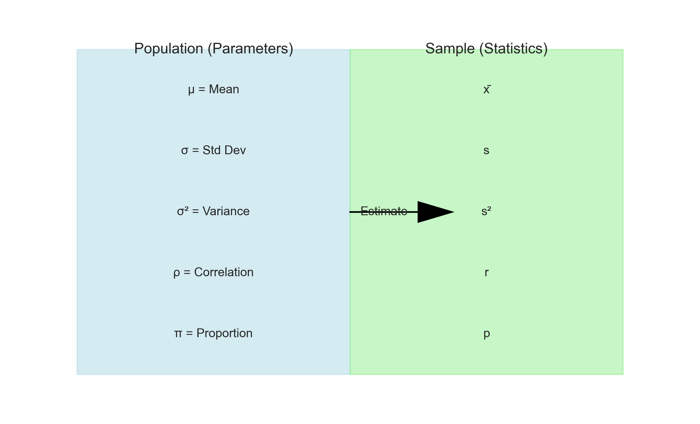
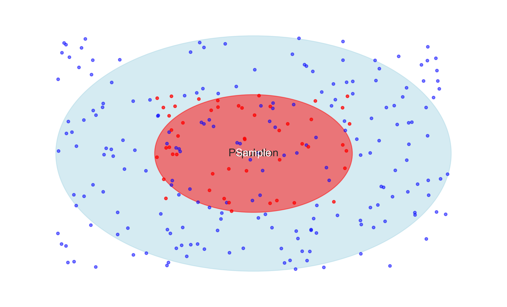
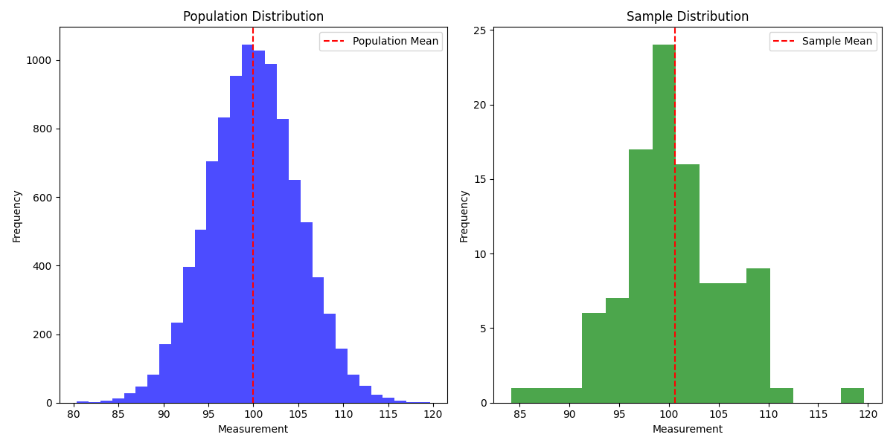
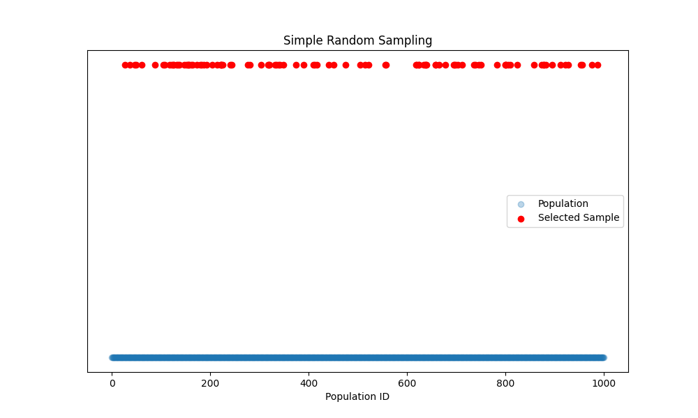
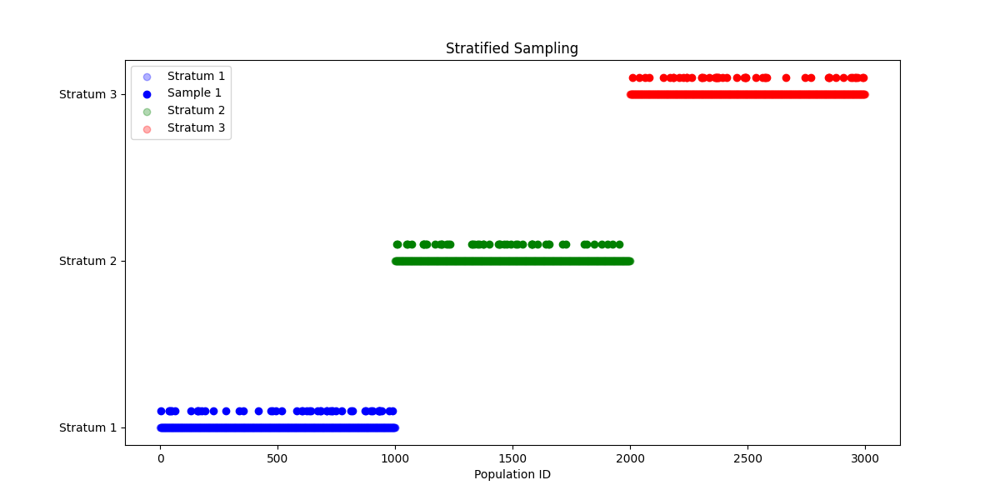
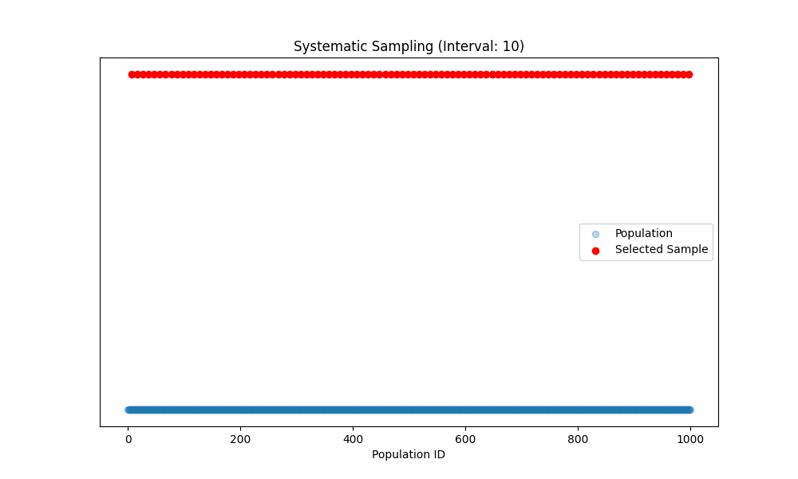
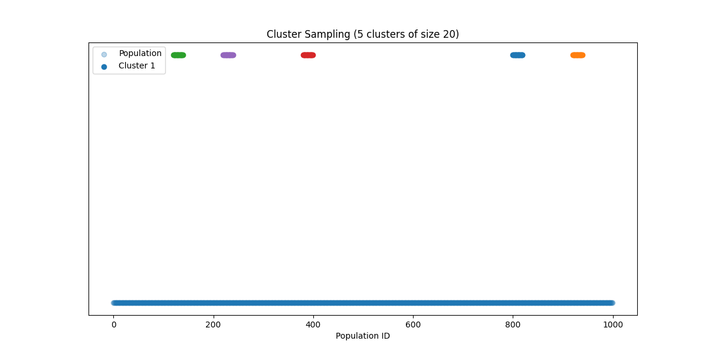
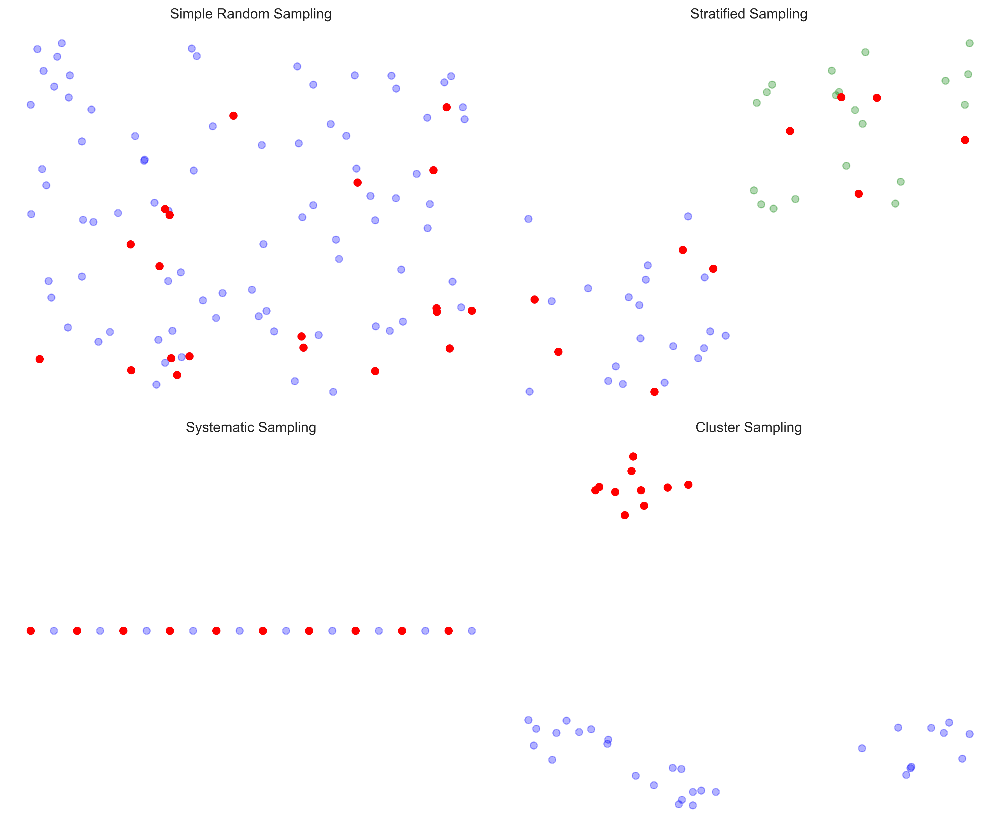
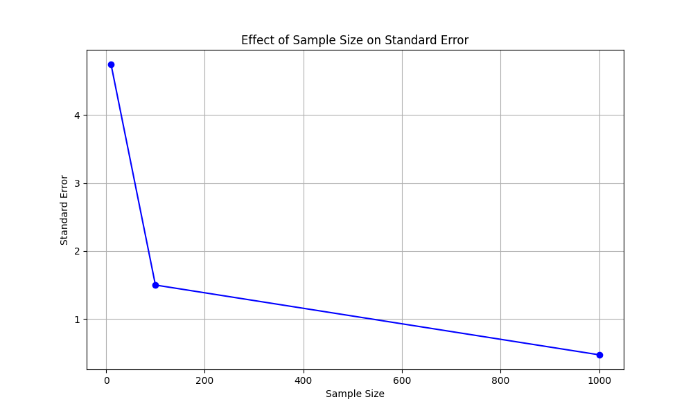
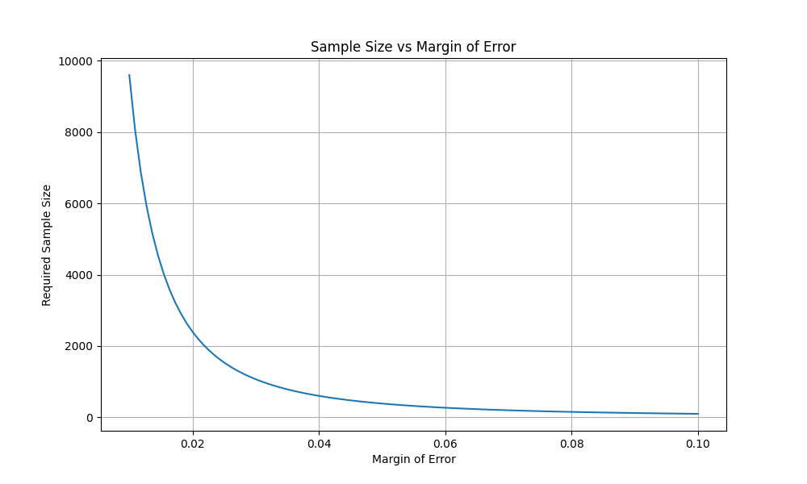

# Population vs Sample: The Foundation of Statistical Inference

## Before You Begin

- Basic understanding of descriptive statistics (mean, median, standard deviation)
- Familiarity with basic probability concepts
- Basic Python programming knowledge (for examples)

## Key Terms

- **Population**: The complete set of all items or individuals we want to study
- **Sample**: A subset of the population that we actually measure
- **Sampling**: The process of selecting a sample from a population
- **Parameter**: A numerical characteristic of a population
- **Statistic**: A numerical characteristic of a sample


*Figure 1: Visual representation of key terms in sampling. The diagram shows how parameters describe populations and statistics describe samples.*

## Introduction: The Detective Analogy

Imagine you're a detective trying to understand a city's crime patterns. You can't investigate every single crime (population), but you can study a carefully selected set of cases (sample) to make informed conclusions about the whole city. This is the essence of sampling in statistics!

## What is a Population?

### Definition

A population is the **complete set** of all items, individuals, or measurements that we're interested in studying. It's the "big picture" we want to understand.

### Real-world Examples

1. **Business Context**:
   - All customers who have ever shopped at an e-commerce store
   - Every transaction processed by a payment system
   - All products in a company's inventory

2. **Research Context**:
   - All students in a university
   - Every patient with a specific medical condition
   - All trees in a forest

### Visual Representation


*Figure 2: The relationship between population and sample. The larger circle represents the entire population, while the smaller circle inside represents our sample.*

## What is a Sample?

### Definition

A sample is a carefully selected **subset** of the population that we actually measure and analyze. Think of it as our "window" into the larger population.

### Real-world Examples

1. **Business Context**:
   - 1,000 randomly selected customers for a satisfaction survey
   - 10,000 transactions from last month for fraud analysis
   - 100 products for quality testing

2. **Research Context**:
   - 200 students surveyed about campus facilities
   - 50 patients participating in a clinical trial
   - 500 trees measured in a forest study

## Why Do We Need Samples?

### Practical Reasons

1. **Cost**: Studying entire populations is often expensive
2. **Time**: Complete enumeration takes too long
3. **Feasibility**: Some populations are infinite or constantly changing
4. **Destructive Testing**: Some measurements destroy the item being measured

### Example: Quality Control in Manufacturing

```python
import numpy as np
import matplotlib.pyplot as plt

# Simulate a production batch of 10,000 items
population = np.random.normal(loc=100, scale=5, size=10000)  # Target: 100 units

# Take a sample of 100 items
sample = np.random.choice(population, size=100, replace=False)

# Visualize population and sample
plt.figure(figsize=(12, 6))
plt.subplot(121)
plt.hist(population, bins=30, alpha=0.7, color='blue')
plt.axvline(np.mean(population), color='red', linestyle='--', label='Population Mean')
plt.title('Population Distribution')
plt.xlabel('Measurement')
plt.ylabel('Frequency')
plt.legend()

plt.subplot(122)
plt.hist(sample, bins=15, alpha=0.7, color='green')
plt.axvline(np.mean(sample), color='red', linestyle='--', label='Sample Mean')
plt.title('Sample Distribution')
plt.xlabel('Measurement')
plt.ylabel('Frequency')
plt.legend()

plt.tight_layout()
plt.savefig('assets/population_sample_dist.png')
plt.close()

# Print statistics
print("\nQuality Control Analysis")
print(f"Population mean: {np.mean(population):.2f}")
print(f"Sample mean: {np.mean(sample):.2f}")
print(f"Difference: {abs(np.mean(population) - np.mean(sample)):.2f}")
```


*Figure 3: Comparison of population and sample distributions in a quality control example. The red dashed lines indicate the means, showing how well the sample represents the population.*

## Sampling Methods: Choosing Your Strategy

### 1. Simple Random Sampling (SRS)

The statistical equivalent of drawing names from a hat - every member has an equal chance.

```python
def simple_random_sample(population, sample_size):
    """Generate a simple random sample"""
    return np.random.choice(population, size=sample_size, replace=False)

# Example usage with visualization
population = np.arange(1000)  # IDs 0-999
sample = simple_random_sample(population, 100)

# Visualize the sampling process
plt.figure(figsize=(10, 6))
plt.scatter(population, [0]*len(population), alpha=0.3, label='Population')
plt.scatter(sample, [0.1]*len(sample), color='red', label='Selected Sample')
plt.title('Simple Random Sampling')
plt.xlabel('Population ID')
plt.yticks([])
plt.legend()
plt.savefig('assets/simple_random_sampling.png')
plt.close()

print(f"Random sample IDs: {sample[:5]}...")  # Show first 5 IDs
```


*Figure 4: Visualization of simple random sampling. Each point represents a member of the population, with red points indicating selected sample members.*

### 2. Stratified Sampling

Like organizing a party where you ensure representation from different departments.

```python
def stratified_sample(population, strata_sizes, sample_sizes):
    """Generate a stratified sample"""
    samples = []
    start_idx = 0
    
    # Visualize the strata
    plt.figure(figsize=(12, 6))
    colors = ['blue', 'green', 'red']
    
    for i, (stratum_size, sample_size) in enumerate(zip(strata_sizes, sample_sizes)):
        stratum = population[start_idx:start_idx + stratum_size]
        sample = np.random.choice(stratum, size=sample_size, replace=False)
        samples.extend(sample)
        
        # Plot stratum
        plt.scatter(stratum, [i]*len(stratum), alpha=0.3, color=colors[i], 
                   label=f'Stratum {i+1}')
        plt.scatter(sample, [i+0.1]*len(sample), color=colors[i], 
                   label=f'Sample {i+1}' if i==0 else "")
        
        start_idx += stratum_size
    
    plt.title('Stratified Sampling')
    plt.xlabel('Population ID')
    plt.yticks(range(len(strata_sizes)), [f'Stratum {i+1}' for i in range(len(strata_sizes))])
    plt.legend()
    plt.savefig('assets/stratified_sampling.png')
    plt.close()
    
    return np.array(samples)

# Example: Sampling by age groups
population = np.arange(3000)  # 3000 people
strata_sizes = [1000, 1000, 1000]  # Equal size strata
sample_sizes = [50, 50, 50]  # Equal size samples
sample = stratified_sample(population, strata_sizes, sample_sizes)
```


*Figure 5: Visualization of stratified sampling. The population is divided into three strata (blue, green, red), and samples are taken from each stratum.*

### 3. Systematic Sampling

Like picking every 10th person who walks into a store.

```python
def systematic_sample(population, interval):
    """Generate a systematic sample"""
    start = np.random.randint(0, interval)
    sample = population[start::interval]
    
    # Visualize the sampling process
    plt.figure(figsize=(10, 6))
    plt.scatter(population, [0]*len(population), alpha=0.3, label='Population')
    plt.scatter(sample, [0.1]*len(sample), color='red', label='Selected Sample')
    plt.title(f'Systematic Sampling (Interval: {interval})')
    plt.xlabel('Population ID')
    plt.yticks([])
    plt.legend()
    plt.savefig('assets/systematic_sampling.png')
    plt.close()
    
    return sample

# Example: Select every 10th customer
population = np.arange(1000)
sample = systematic_sample(population, 10)
```


*Figure 6: Visualization of systematic sampling. The red points show how every 10th member is selected from the population.*

### 4. Cluster Sampling

Like studying a few neighborhoods to understand a city.

```python
def cluster_sample(population, n_clusters, cluster_size):
    """Generate a cluster sample"""
    clusters = np.random.choice(len(population) // cluster_size, size=n_clusters, replace=False)
    samples = []
    
    # Visualize the clusters
    plt.figure(figsize=(12, 6))
    plt.scatter(population, [0]*len(population), alpha=0.3, label='Population')
    
    for i, cluster in enumerate(clusters):
        start = cluster * cluster_size
        end = start + cluster_size
        cluster_members = population[start:end]
        samples.extend(cluster_members)
        
        # Plot cluster
        plt.scatter(cluster_members, [0.1]*len(cluster_members), 
                   color=f'C{i}', label=f'Cluster {i+1}' if i==0 else "")
    
    plt.title(f'Cluster Sampling ({n_clusters} clusters of size {cluster_size})')
    plt.xlabel('Population ID')
    plt.yticks([])
    plt.legend()
    plt.savefig('assets/cluster_sampling.png')
    plt.close()
    
    return np.array(samples)

# Example: Sample 5 clusters of 20 people each
population = np.arange(1000)
sample = cluster_sample(population, 5, 20)
```


*Figure 7: Visualization of cluster sampling. The colored points show how entire clusters are selected from the population.*

### Visual Comparison of Sampling Methods


*Figure 8: Visual comparison of different sampling methods. From top-left: Simple Random, Stratified, Systematic, and Cluster sampling.*

## Common Sampling Errors and How to Avoid Them

### 1. Selection Bias

When your sample isn't truly representative.

#### Example

❌ Surveying only mall shoppers about online shopping habits
✅ Using a mix of in-store and online customer lists

### 2. Sampling Error

Natural variation between sample and population.

```python
def calculate_sampling_error(population_std, sample_size):
    """Calculate standard error of the mean"""
    return population_std / np.sqrt(sample_size)

# Example with visualization
population_std = 15
sample_sizes = [10, 100, 1000]
ses = []

plt.figure(figsize=(10, 6))
for n in sample_sizes:
    se = calculate_sampling_error(population_std, n)
    ses.append(se)
    print(f"Sample size {n}: Standard Error = {se:.2f}")

plt.plot(sample_sizes, ses, 'bo-')
plt.xlabel('Sample Size')
plt.ylabel('Standard Error')
plt.title('Effect of Sample Size on Standard Error')
plt.grid(True)
plt.savefig('assets/sampling_error_effect.png')
plt.close()
```


*Figure 9: Effect of sample size on standard error. As sample size increases, the standard error decreases, showing improved precision.*

### 3. Coverage Error

When your sampling frame misses parts of the population.

#### Example

❌ Email survey missing customers without email
✅ Using multiple contact methods (phone, mail, in-person)

## Sample Size Determination

### The Sample Size Formula

For estimating a proportion with specified margin of error:

```python
def calculate_sample_size(confidence_level=0.95, margin_of_error=0.05, p=0.5):
    """Calculate required sample size for proportion estimation"""
    from scipy.stats import norm
    
    z_score = norm.ppf(1 - (1 - confidence_level) / 2)
    n = (z_score**2 * p * (1-p)) / margin_of_error**2
    
    # Visualize the relationship
    margins = np.linspace(0.01, 0.1, 100)
    sizes = [(z_score**2 * p * (1-p)) / m**2 for m in margins]
    
    plt.figure(figsize=(10, 6))
    plt.plot(margins, sizes)
    plt.xlabel('Margin of Error')
    plt.ylabel('Required Sample Size')
    plt.title('Sample Size vs Margin of Error')
    plt.grid(True)
    plt.savefig('assets/sample_size_relationship.png')
    plt.close()
    
    return int(n)

# Example usage
n = calculate_sample_size()
print(f"\nRequired sample size: {n}")
```


*Figure 10: Relationship between margin of error and required sample size. As the desired margin of error decreases, the required sample size increases.*

## Practice Questions

1. Why might a simple random sample not be the best choice for studying a city's crime patterns?
2. How would you design a sampling strategy for estimating the average income of a country's population?
3. What sampling method would you use to study the effectiveness of a new teaching method across different schools?
4. How does sample size affect the reliability of your estimates?
5. What are the advantages and disadvantages of each sampling method?

## Key Takeaways

1. Populations are complete sets, samples are subsets
2. Different sampling methods suit different situations
3. Sample size affects estimation precision
4. Sampling errors can be minimized with proper design
5. Visualizing sampling processes aids understanding
6. Real-world applications require careful sampling design
7. Common sampling errors can be avoided with proper planning

## Additional Resources

- [Interactive Sampling Simulator](https://seeing-theory.brown.edu/frequentist-inference/index.html)
- [Understanding Sampling Methods](https://statisticsbyjim.com/basics/sampling-methods/)
- [Sample Size Calculator](https://www.surveymonkey.com/mp/sample-size-calculator/)

Remember: Good sampling is the foundation of reliable statistical inference. Choose your sampling method wisely!
