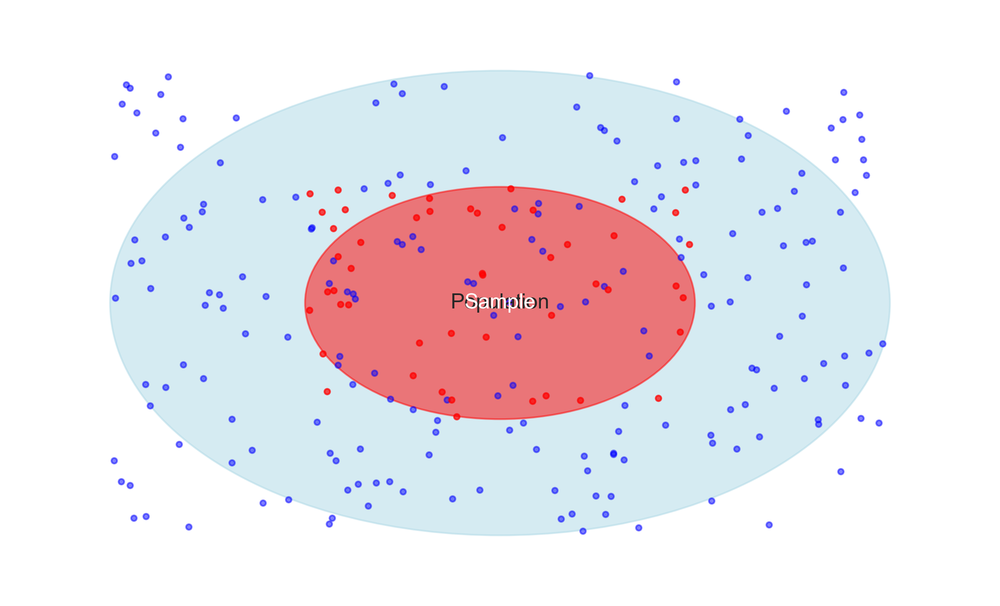
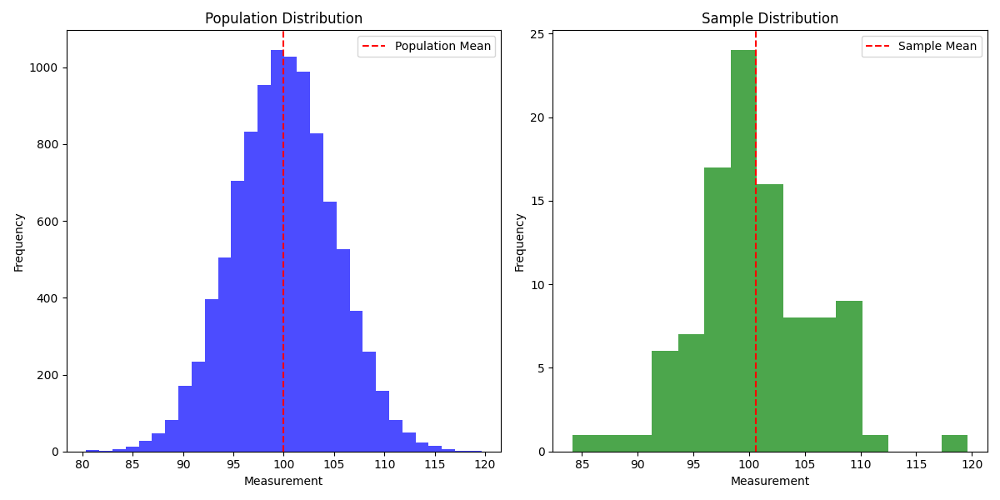
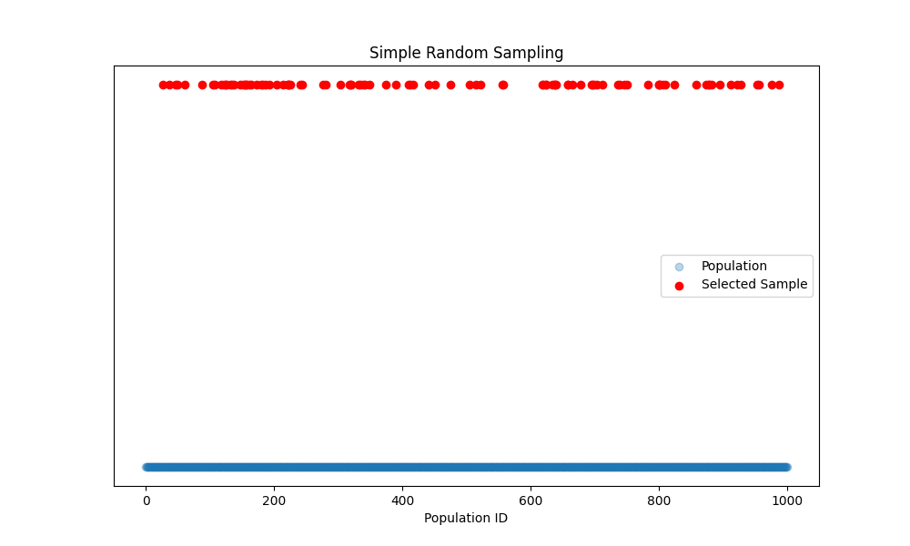
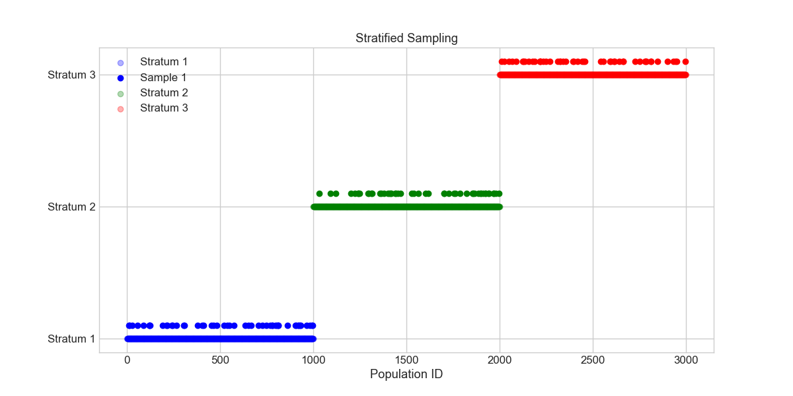
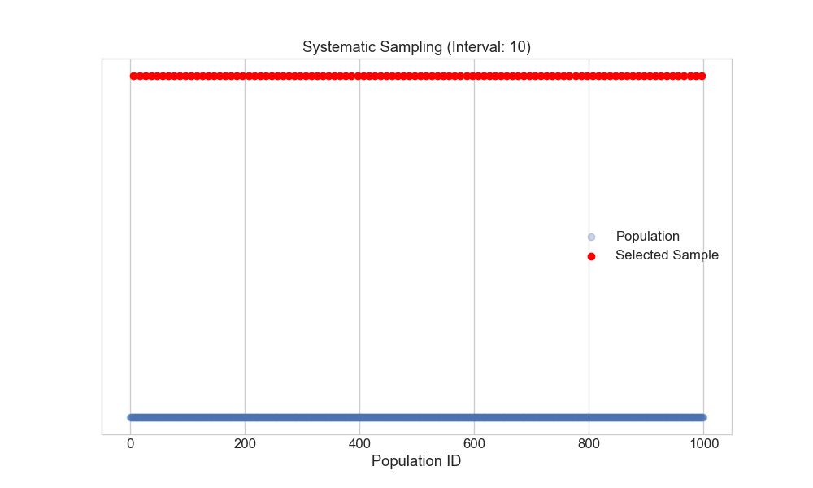
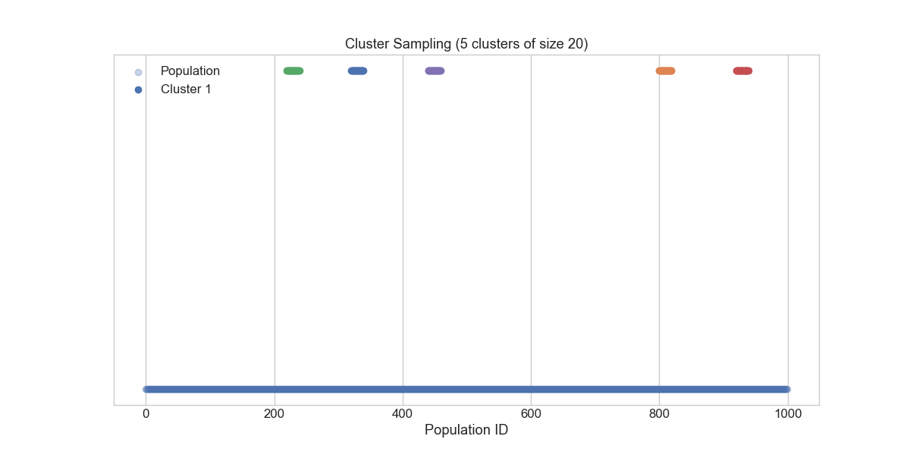
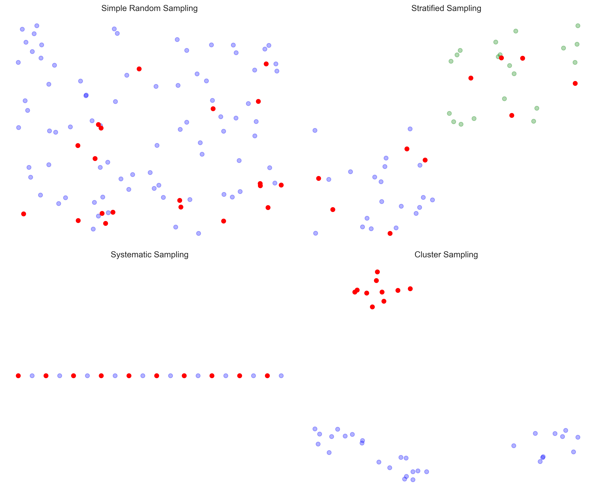
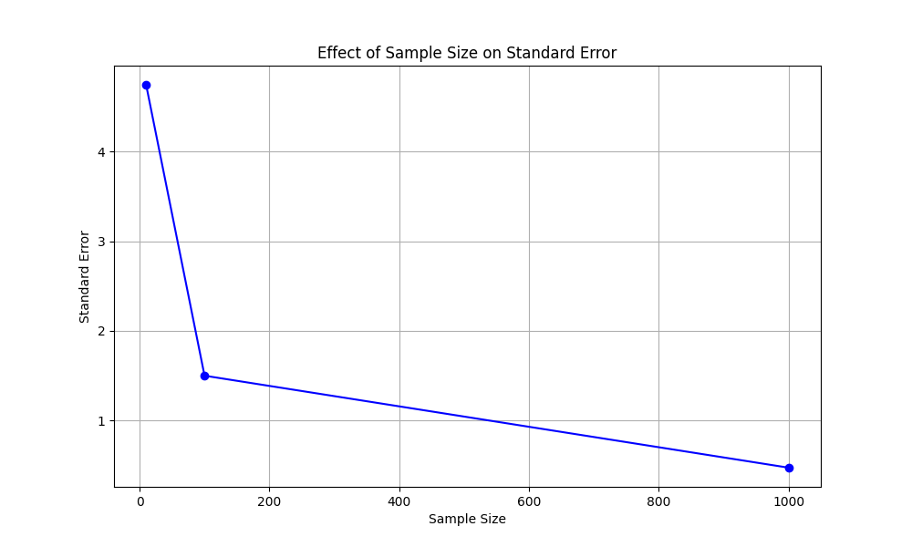
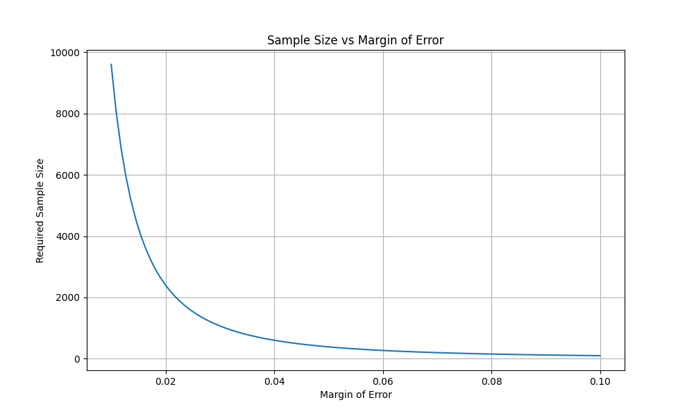

# Population vs Sample: The Foundation of Statistical Inference

**After this lesson:** you can explain Population vs Sample: The Foundation of Statistical Inference and try the examples in your own notebook.

## Overview

This lesson fixes vocabulary: **population** (what you want to learn about), **sample** (what you actually measure), and **how you pick** the sample. Every later idea, intervals, tests, models, assumes you can say clearly what was and was not included in the data.

## Why this matters

If "population" and "sample" are vague, every number you compute is easy to misread. This lesson matters because:

- You need precise **population** and **sample** language before confidence intervals, tests, or models.
- Sampling choices affect whether conclusions generalize beyond the rows in your spreadsheet.

## Prerequisites

- Descriptive statistics (mean, median, spread).
- Basic probability (random variables, variation). Optional: [Intro statistics (module 1.3)](../../1-data-fundamentals/1.3-intro-statistics/README.md).
- Short Python examples are optional to read; focus on the ideas first.

> **Note:** This is the first lesson in [4.1 Inferential statistics](./README.md).

## Key terms

The rest of the module reuses these words constantly. Memorize the definitions, not the metaphors.

- **Population**: The complete set of all items or individuals we want to study
- **Sample**: A subset of the population that we actually measure
- **Sampling**: The process of selecting a sample from a population
- **Parameter**: A numerical characteristic of a population (formal symbols come up in the [parameters and statistics](./parameters-statistics.md) lesson)
- **Statistic**: A numerical characteristic of a sample

## Introduction: The Detective Analogy

Imagine you're a detective trying to understand a city's crime patterns. You can't investigate every single crime (population), but you can study a carefully selected set of cases (sample) to make informed conclusions about the whole city. This is the essence of sampling in statistics!



## What is a Population?

### Definition

A population is the **complete set** of all items, individuals, or measurements that we're interested in studying. It's the "big picture" we want to understand.

### Real-world Examples

1. **Business Context**:
   - All customers who have ever shopped at an e-commerce store
   - Every transaction processed by a payment system
   - All products in a company's inventory

2. **Research Context**:
   - All students in a university
   - Every patient with a specific medical condition
   - All trees in a forest

### Visual Representation


*Figure 2: The relationship between population and sample. The larger circle represents the entire population, while the smaller circle inside represents our sample.*

## What is a Sample?

### Definition

A sample is a carefully selected **subset** of the population that we actually measure and analyze. Think of it as our "window" into the larger population.

### Real-world Examples

1. **Business Context**:
   - 1,000 randomly selected customers for a satisfaction survey
   - 10,000 transactions from last month for fraud analysis
   - 100 products for quality testing

2. **Research Context**:
   - 200 students surveyed about campus facilities
   - 50 patients participating in a clinical trial
   - 500 trees measured in a forest study

## Why Do We Need Samples?

### Practical Reasons

1. **Cost**: Studying entire populations is often expensive
2. **Time**: Complete enumeration takes too long
3. **Feasibility**: Some populations are infinite or constantly changing
4. **Destructive Testing**: Some measurements destroy the item being measured

### Example: Quality Control in Manufacturing

**Finite population vs one SRS**

<div class="code-explainer" data-code-explainer>
<div class="code-explainer__code">


import numpy as np
import matplotlib.pyplot as plt

# Simulate a production batch of 10,000 items
population = np.random.normal(loc=100, scale=5, size=10000)  # Target: 100 units

# Take a sample of 100 items
sample = np.random.choice(population, size=100, replace=False)

# Visualize population and sample
plt.figure(figsize=(12, 6))
plt.subplot(121)
plt.hist(population, bins=30, alpha=0.7, color='blue')
plt.axvline(np.mean(population), color='red', linestyle='--', label='Population Mean')
plt.title('Population Distribution')
plt.xlabel('Measurement')
plt.ylabel('Frequency')
plt.legend()

plt.subplot(122)
plt.hist(sample, bins=15, alpha=0.7, color='green')
plt.axvline(np.mean(sample), color='red', linestyle='--', label='Sample Mean')
plt.title('Sample Distribution')
plt.xlabel('Measurement')
plt.ylabel('Frequency')
plt.legend()

plt.tight_layout()
plt.savefig('assets/population_sample_dist.png')
plt.close()

# Print statistics
print("\nQuality Control Analysis")
print(f"Population mean: {np.mean(population):.2f}")
print(f"Sample mean: {np.mean(sample):.2f}")
print(f"Difference: {abs(np.mean(population) - np.mean(sample)):.2f}")

```

Quality Control Analysis
Population mean: 100.05
Sample mean: 100.57
Difference: 0.51
```


</div>
<aside class="code-explainer__callouts" aria-label="Code walkthrough">
  <div class="code-callout" data-lines="5" data-tint="1">
    <div class="code-callout__meta">
      <span class="code-callout__lines"></span>
      <span class="code-callout__title">The population</span>
    </div>
    <div class="code-callout__body">
      <p>10,000 production items with target mean 100, stand-in for "everything we made this batch."</p>
    </div>
  </div>
  <div class="code-callout" data-lines="8" data-tint="2">
    <div class="code-callout__meta">
      <span class="code-callout__lines"></span>
      <span class="code-callout__title">The sample</span>
    </div>
    <div class="code-callout__body">
      <p>Draw 100 items without replacement, what we'd actually inspect on the line.</p>
    </div>
  </div>
  <div class="code-callout" data-lines="34-36" data-tint="3">
    <div class="code-callout__meta">
      <span class="code-callout__lines"></span>
      <span class="code-callout__title">μ vs x̄</span>
    </div>
    <div class="code-callout__body">
      <p>Compare population mean to sample mean. The difference quantifies how much one draw of 100 wobbles from the truth.</p>
    </div>
  </div>
</aside>
</div>


*Figure 3: Comparison of population and sample distributions in a quality control example. The red dashed lines indicate the means, showing how well the sample represents the population.*

## Sampling Methods: Choosing Your Strategy

### 1. Simple Random Sampling (SRS)

The statistical equivalent of drawing names from a hat - every member has an equal chance.

**SRS on IDs with scatter "strip" plot**

<div class="code-explainer" data-code-explainer>
<div class="code-explainer__code">


def simple_random_sample(population, sample_size):
    """Generate a simple random sample"""
    return np.random.choice(population, size=sample_size, replace=False)

# Example usage with visualization
population = np.arange(1000)  # IDs 0-999
sample = simple_random_sample(population, 100)

# Visualize the sampling process
plt.figure(figsize=(10, 6))
plt.scatter(population, [0]*len(population), alpha=0.3, label='Population')
plt.scatter(sample, [0.1]*len(sample), color='red', label='Selected Sample')
plt.title('Simple Random Sampling')
plt.xlabel('Population ID')
plt.yticks([])
plt.legend()
plt.savefig('assets/simple_random_sampling.png')
plt.close()

print(f"Random sample IDs: {sample[:5]}...")  # Show first 5 IDs

```
Random sample IDs: [664 919 241 476 610]...
```


</div>
<aside class="code-explainer__callouts" aria-label="Code walkthrough">
  <div class="code-callout" data-lines="3" data-tint="1">
    <div class="code-callout__meta">
      <span class="code-callout__lines"></span>
      <span class="code-callout__title">The draw</span>
    </div>
    <div class="code-callout__body">
      <p><code>replace=False</code> means each ID can appear at most once in the sample, the defining feature of SRS without replacement.</p>
    </div>
  </div>
  <div class="code-callout" data-lines="7-8" data-tint="2">
    <div class="code-callout__meta">
      <span class="code-callout__lines"></span>
      <span class="code-callout__title">Population vs sample</span>
    </div>
    <div class="code-callout__body">
      <p>Frame of 1,000 IDs; SRS picks 100 at random. The strip plot below shows how those 100 are spread evenly across the frame.</p>
    </div>
  </div>
</aside>
</div>


*Figure 4: Visualization of simple random sampling. Each point represents a member of the population, with red points indicating selected sample members.*

### 2. Stratified Sampling

Like organizing a party where you ensure representation from different departments.

**Independent SRS within each stratum**

<div class="code-explainer" data-code-explainer>
<div class="code-explainer__code">


def stratified_sample(population, strata_sizes, sample_sizes):
    """Generate a stratified sample"""
    samples = []
    start_idx = 0

    # Visualize the strata
    plt.figure(figsize=(12, 6))
    colors = ['blue', 'green', 'red']

    for i, (stratum_size, sample_size) in enumerate(zip(strata_sizes, sample_sizes)):
        stratum = population[start_idx:start_idx + stratum_size]
        sample = np.random.choice(stratum, size=sample_size, replace=False)
        samples.extend(sample)

        # Plot stratum
        plt.scatter(stratum, [i]*len(stratum), alpha=0.3, color=colors[i],
                   label=f'Stratum {i+1}')
        plt.scatter(sample, [i+0.1]*len(sample), color=colors[i],
                   label=f'Sample {i+1}' if i==0 else "")

        start_idx += stratum_size

    plt.title('Stratified Sampling')
    plt.xlabel('Population ID')
    plt.yticks(range(len(strata_sizes)), [f'Stratum {i+1}' for i in range(len(strata_sizes))])
    plt.legend()
    plt.savefig('assets/stratified_sampling.png')
    plt.close()

    return np.array(samples)

# Example: Sampling by age groups
population = np.arange(3000)  # 3000 people
strata_sizes = [1000, 1000, 1000]  # Equal size strata
sample_sizes = [50, 50, 50]  # Equal size samples
sample = stratified_sample(population, strata_sizes, sample_sizes)


</div>
<aside class="code-explainer__callouts" aria-label="Code walkthrough">
  <div class="code-callout" data-lines="1-3" data-tint="1">
    <div class="code-callout__meta">
      <span class="code-callout__lines"></span>
      <span class="code-callout__title">Function signature</span>
    </div>
    <div class="code-callout__body">
      <p>Accept a population array, a list of stratum sizes, and a list of per-stratum sample counts to build a stratified draw.</p>
    </div>
  </div>
  <div class="code-callout" data-lines="10-21" data-tint="2">
    <div class="code-callout__meta">
      <span class="code-callout__lines"></span>
      <span class="code-callout__title">Per-stratum loop</span>
    </div>
    <div class="code-callout__body">
      <p>Slice each stratum from the population, sample without replacement, and plot both stratum members and selected units at staggered y-positions.</p>
    </div>
  </div>
  <div class="code-callout" data-lines="31-36" data-tint="3">
    <div class="code-callout__meta">
      <span class="code-callout__lines"></span>
      <span class="code-callout__title">Usage example</span>
    </div>
    <div class="code-callout__body">
      <p>Demonstrate with 3,000 people split into three equal strata of 1,000, drawing 50 from each to guarantee representation.</p>
    </div>
  </div>
</aside>
</div>


*Figure 5: Visualization of stratified sampling. The population is divided into three strata (blue, green, red), and samples are taken from each stratum.*

### 3. Systematic Sampling

Like picking every 10th person who walks into a store.

**Random start, fixed skip interval**

<div class="code-explainer" data-code-explainer>
<div class="code-explainer__code">


def systematic_sample(population, interval):
    """Generate a systematic sample"""
    start = np.random.randint(0, interval)
    sample = population[start::interval]

    # Visualize the sampling process
    plt.figure(figsize=(10, 6))
    plt.scatter(population, [0]*len(population), alpha=0.3, label='Population')
    plt.scatter(sample, [0.1]*len(sample), color='red', label='Selected Sample')
    plt.title(f'Systematic Sampling (Interval: {interval})')
    plt.xlabel('Population ID')
    plt.yticks([])
    plt.legend()
    plt.savefig('assets/systematic_sampling.png')
    plt.close()

    return sample

# Example: Select every 10th customer
population = np.arange(1000)
sample = systematic_sample(population, 10)


</div>
<aside class="code-explainer__callouts" aria-label="Code walkthrough">
  <div class="code-callout" data-lines="1-4" data-tint="1">
    <div class="code-callout__meta">
      <span class="code-callout__lines"></span>
      <span class="code-callout__title">Random start and stride</span>
    </div>
    <div class="code-callout__body">
      <p>Pick a random offset in [0, interval) and use Python slice notation <code>start::interval</code> to select every kth element, giving equal spacing throughout the frame.</p>
    </div>
  </div>
  <div class="code-callout" data-lines="6-16" data-tint="2">
    <div class="code-callout__meta">
      <span class="code-callout__lines"></span>
      <span class="code-callout__title">Strip plot</span>
    </div>
    <div class="code-callout__body">
      <p>Visualise population and selected IDs on a 1D strip to show the regular spacing pattern that distinguishes systematic from random selection.</p>
    </div>
  </div>
</aside>
</div>


*Figure 6: Visualization of systematic sampling. The red points show how every 10th member is selected from the population.*

### 4. Cluster Sampling

Like studying a few neighborhoods to understand a city.

**Take all units from randomly chosen blocks**

<div class="code-explainer" data-code-explainer>
<div class="code-explainer__code">


def cluster_sample(population, n_clusters, cluster_size):
    """Generate a cluster sample"""
    clusters = np.random.choice(len(population) // cluster_size, size=n_clusters, replace=False)
    samples = []

    # Visualize the clusters
    plt.figure(figsize=(12, 6))
    plt.scatter(population, [0]*len(population), alpha=0.3, label='Population')

    for i, cluster in enumerate(clusters):
        start = cluster * cluster_size
        end = start + cluster_size
        cluster_members = population[start:end]
        samples.extend(cluster_members)

        # Plot cluster
        plt.scatter(cluster_members, [0.1]*len(cluster_members),
                   color=f'C{i}', label=f'Cluster {i+1}' if i==0 else "")

    plt.title(f'Cluster Sampling ({n_clusters} clusters of size {cluster_size})')
    plt.xlabel('Population ID')
    plt.yticks([])
    plt.legend()
    plt.savefig('assets/cluster_sampling.png')
    plt.close()

    return np.array(samples)

# Example: Sample 5 clusters of 20 people each
population = np.arange(1000)
sample = cluster_sample(population, 5, 20)


</div>
<aside class="code-explainer__callouts" aria-label="Code walkthrough">
  <div class="code-callout" data-lines="1-2" data-tint="1">
    <div class="code-callout__meta">
      <span class="code-callout__lines"></span>
      <span class="code-callout__title">Select clusters</span>
    </div>
    <div class="code-callout__body">
      <p>Randomly choose which cluster blocks to include; all units within selected blocks enter the sample.</p>
    </div>
  </div>
  <div class="code-callout" data-lines="9-17" data-tint="2">
    <div class="code-callout__meta">
      <span class="code-callout__lines"></span>
      <span class="code-callout__title">Per-cluster loop</span>
    </div>
    <div class="code-callout__body">
      <p>For each selected block, take all units in the contiguous slice and plot them at a raised y-position with a distinct colour.</p>
    </div>
  </div>
  <div class="code-callout" data-lines="27-29" data-tint="3">
    <div class="code-callout__meta">
      <span class="code-callout__lines"></span>
      <span class="code-callout__title">Usage example</span>
    </div>
    <div class="code-callout__body">
      <p>Sample 5 clusters of 20 people each from a population of 1,000 to demonstrate the whole-block selection pattern.</p>
    </div>
  </div>
</aside>
</div>


*Figure 7: Visualization of cluster sampling. The colored points show how entire clusters are selected from the population.*

### Visual Comparison of Sampling Methods


*Figure 8: Visual comparison of different sampling methods. From top-left: Simple Random, Stratified, Systematic, and Cluster sampling.*

## Common Sampling Errors and How to Avoid Them

### 1. Selection bias

Selection bias means the people or units in your data **do not represent** the population you claim to study. The sample is often easy to reach, willing to respond, or already filtered by another process, none of which guarantees a fair picture of everyone.

#### Example

- **Risky:** Surveying only mall shoppers about *online* shopping habits (people who still go to malls may differ from those who shop only online).
- **Better:** Draw from a frame that mixes channels, or separate reporting by segment so you do not overclaim.

### 2. Sampling error

Even with a perfect design, **random samples differ** from each other and from the population. That unavoidable wiggle is sampling error, not a mistake, but variation you account for with intervals, standard errors, and larger *n* when feasible.

**SE curve vs sample size**

<div class="code-explainer" data-code-explainer>
<div class="code-explainer__code">


def calculate_sampling_error(population_std, sample_size):
    """Calculate standard error of the mean"""
    return population_std / np.sqrt(sample_size)

# Example with visualization
population_std = 15
sample_sizes = [10, 100, 1000]
ses = []

plt.figure(figsize=(10, 6))
for n in sample_sizes:
    se = calculate_sampling_error(population_std, n)
    ses.append(se)
    print(f"Sample size {n}: Standard Error = {se:.2f}")

plt.plot(sample_sizes, ses, 'bo-')
plt.xlabel('Sample Size')
plt.ylabel('Standard Error')
plt.title('Effect of Sample Size on Standard Error')
plt.grid(True)
plt.savefig('assets/sampling_error_effect.png')
plt.close()

```
Sample size 10: Standard Error = 4.74
Sample size 100: Standard Error = 1.50
Sample size 1000: Standard Error = 0.47
```


</div>
<aside class="code-explainer__callouts" aria-label="Code walkthrough">
  <div class="code-callout" data-lines="1-3" data-tint="1">
    <div class="code-callout__meta">
      <span class="code-callout__lines"></span>
      <span class="code-callout__title">SE formula</span>
    </div>
    <div class="code-callout__body">
      <p>Implement σ/√n as a one-liner to compute the standard error of the mean when the population standard deviation is known.</p>
    </div>
  </div>
  <div class="code-callout" data-lines="5-21" data-tint="2">
    <div class="code-callout__meta">
      <span class="code-callout__lines"></span>
      <span class="code-callout__title">SE curve</span>
    </div>
    <div class="code-callout__body">
      <p>Evaluate SE at sizes 10, 100, and 1,000; print each result and plot the curve to show the square-root law driving diminishing returns from larger samples.</p>
    </div>
  </div>
</aside>
</div>


*Figure 9: Effect of sample size on standard error. As sample size increases, the standard error decreases, showing improved precision.*

### 3. Coverage error

Coverage error happens when your **sampling frame**-the list or mechanism you draw from, does not cover the full population. You might still run a clean random draw *within* the frame and still miss entire groups.

#### Example

- **Risky:** Email-only survey for "all customers" when many never gave an email.
- **Better:** Combine contact modes where appropriate, document who is excluded, or narrow the claim to "customers with email on file."

## Sample Size Determination

### The intuition (before any formula)

Before looking at maths, ask three questions in plain English:

1. **How precise do I need the answer to be?** "Within 5 percentage points" is a much easier target than "within 1 percentage point."
2. **How sure do I need to be that the truth is inside that range?** 95% confident is the default; 99% costs a lot more data.
3. **How varied is what I'm measuring?** A yes/no question is bounded; people's spending in dollars can be anywhere from $0 to $5,000.

The sample size formula is just a tidy way of turning those three answers into a number of people to survey. **More precision, more confidence, or more variation → more data.** Less of any of those → less data.

### The sample size formula (for a proportion)

If you're estimating a proportion (e.g., "what fraction of customers will buy?") here is the standard recipe:

\\[
n = \dfrac{z^2 \cdot p(1-p)}{\text{MOE}^2}
\\]

| Symbol | Plain meaning | Example |
|---|---|---|
| \\(n\\) | The sample size you want to find | "How many people do I need to survey?" |
| \\(z\\) | A confidence-level multiplier | 1.96 for 95% confidence; 2.58 for 99% |
| \\(p\\) | A guess of the true proportion | If unsure, use 0.5, it's the worst case (largest \\(n\\)), so it's the safe default |
| \\(p(1-p)\\) | How spread out a yes/no answer is | Biggest at \\(p = 0.5\\) (= 0.25); smallest near 0 or 1 |
| MOE | Margin of error you can live with | 0.05 means "answer within ±5 percentage points" |

### A worked example

> *I want to estimate the proportion of users who will click a new button, within ±5 percentage points, and I want to be 95% confident.*

Plug in \\(z = 1.96\\), \\(p = 0.5\\) (no prior info, use the safe default), MOE = 0.05:

\\[
n = \dfrac{1.96^2 \times 0.5 \times 0.5}{0.05^2} = \dfrac{0.9604}{0.0025} \approx 384
\\]

So **about 384 users** is the answer. That's why so many polls and A/B tests target around 400 respondents, it's the magic number for "±5% at 95% confidence."

### What happens if you tighten the requirements?

Each tightening multiplies the cost:

| Change | New \\(n\\) | What happened |
|---|---|---|
| MOE = 5% (baseline) | 384 | Default plan |
| MOE = 2.5% (half the error) | 1,537 | **4× more data** to halve the margin |
| MOE = 1% | 9,604 | **25× more data** for fivefold tighter precision |
| Confidence 99% (z = 2.58), MOE = 5% | 666 | Higher confidence → more data |

**The key insight:** because the formula has MOE *squared* in the denominator, halving the MOE quadruples the cost. This is the same square-root rule we keep meeting, it's expensive to be very precise.

### When can you use a smaller sample?

- If you have a **good prior estimate** of \\(p\\) (e.g., previous data shows \\(p \approx 0.1\\)), use that instead of 0.5: \\(p(1-p) = 0.09\\) instead of 0.25, so the required sample shrinks by ~64%.
- If you can tolerate **wider margins** (e.g., 10% instead of 5%), the cost drops fourfold.
- If you're estimating a **mean** rather than a proportion, the formula is similar but uses your best guess of the population standard deviation in place of \\(\sqrt{p(1-p)}\\).

The code below shows the same formula and plots how \\(n\\) explodes as MOE shrinks.

**Normal-approx sample size for a proportion**

<div class="code-explainer" data-code-explainer>
<div class="code-explainer__code">


def calculate_sample_size(confidence_level=0.95, margin_of_error=0.05, p=0.5):
    """Calculate required sample size for proportion estimation"""
    from scipy.stats import norm

    z_score = norm.ppf(1 - (1 - confidence_level) / 2)
    n = (z_score**2 * p * (1-p)) / margin_of_error**2

    # Visualize the relationship
    margins = np.linspace(0.01, 0.1, 100)
    sizes = [(z_score**2 * p * (1-p)) / m**2 for m in margins]

    plt.figure(figsize=(10, 6))
    plt.plot(margins, sizes)
    plt.xlabel('Margin of Error')
    plt.ylabel('Required Sample Size')
    plt.title('Sample Size vs Margin of Error')
    plt.grid(True)
    plt.savefig('assets/sample_size_relationship.png')
    plt.close()

    return int(n)

# Example usage
n = calculate_sample_size()
print(f"\nRequired sample size: {n}")

```

Required sample size: 384
```


</div>
<aside class="code-explainer__callouts" aria-label="Code walkthrough">
  <div class="code-callout" data-lines="1-6" data-tint="1">
    <div class="code-callout__meta">
      <span class="code-callout__lines"></span>
      <span class="code-callout__title">Wald formula</span>
    </div>
    <div class="code-callout__body">
      <p>Compute the z critical value then apply the standard sample-size formula: n = z²·p(1-p) / MOE².</p>
    </div>
  </div>
  <div class="code-callout" data-lines="8-17" data-tint="2">
    <div class="code-callout__meta">
      <span class="code-callout__lines"></span>
      <span class="code-callout__title">Curve of n vs MOE</span>
    </div>
    <div class="code-callout__body">
      <p>Plot required n against a range of margins from 1% to 10% to visualise the hyperbolic trade-off between precision and cost.</p>
    </div>
  </div>
  <div class="code-callout" data-lines="21-23" data-tint="3">
    <div class="code-callout__meta">
      <span class="code-callout__lines"></span>
      <span class="code-callout__title">Example call</span>
    </div>
    <div class="code-callout__body">
      <p>Call with defaults (95% confidence, 5% MOE, p=0.5) and print the recommended sample size.</p>
    </div>
  </div>
</aside>
</div>


*Figure 10: Relationship between margin of error and required sample size. As the desired margin of error decreases, the required sample size increases.*

## Practice Questions

Try each question on your own first, then expand the answer to check.

**1.** Why might a simple random sample not be the best choice for studying a city's crime patterns?

<details>
<summary>Show answer</summary>

Crime patterns are very uneven across a city, some neighborhoods have 50× the crime rate of others. A simple random sample of, say, 1,000 incidents could easily miss low-frequency but important categories (e.g., a few high-impact violent crimes scattered across boroughs).

A better strategy is **stratified sampling** by neighborhood and crime type so that every stratum is represented even when its rate is low. This keeps the sample size manageable while making sure the picture is complete.

Another concern: SRS gives each *case* an equal chance, but *people* may be the unit of interest. If you sample cases you'll over-represent neighborhoods with many cases.

</details>

**2.** How would you design a sampling strategy for estimating the average income of a country's population?

<details>
<summary>Show answer</summary>

Income is highly variable and very right-skewed (a few people earn enormous amounts). A reasonable plan:

1. **Stratify by region** (urban / rural / specific provinces). Income varies sharply by location, so stratifying makes the overall estimate much more precise.
2. **Stratify by employment status / income bracket** if you have rough prior data. Sampling proportionally to the variance in each stratum (Neyman allocation) further reduces the SE.
3. **Choose \\(n\\) per stratum** large enough that the CLT applies inside each stratum, for highly skewed income data this means \\(n \geq 50\text{-}100\\) per stratum.
4. **Use cluster sampling within strata** if you must visit households in person (cost matters). Pick random villages/blocks, then survey every household in the chosen cluster.
5. **Report the median** alongside the mean, for skewed distributions like income, the median is often more informative.

</details>

**3.** What sampling method would you use to study the effectiveness of a new teaching method across different schools?

<details>
<summary>Show answer</summary>

**Cluster sampling**, with the school (or classroom) as the cluster.

- It's usually impractical to randomly assign individual *students* to teaching methods across many schools, schools and classrooms have to coordinate. So you assign *whole classrooms or schools* to control vs. treatment.
- Then sample a random subset of schools to study, and inside each chosen school survey every student.

If you want to *guarantee* representation across school types (urban / rural / public / private / size), combine cluster with **stratified sampling**: stratify by school type, then cluster-sample within each stratum.

Note that cluster sampling reduces cost but *increases* the standard error compared to SRS of the same size, students in the same school are more alike than two random students, so each cluster contributes less independent information.

</details>

**4.** How does sample size affect the reliability of your estimates?

<details>
<summary>Show answer</summary>

Larger samples → smaller **standard error** → narrower **confidence intervals** → more reliable estimates. Specifically:

- \\(SE = \sigma / \sqrt{n}\\), so SE shrinks like \\(1/\sqrt{n}\\). Doubling \\(n\\) multiplies SE by ~0.71 (29% reduction). Quadrupling \\(n\\) halves the SE.
- Larger \\(n\\) also makes the Central Limit Theorem approximation work better, so CIs and p-values are more trustworthy for non-normal data.

**But:** more data only fixes *random* error. If the sampling method is biased (e.g., only mall shoppers, only email subscribers), a bigger sample just gives you a more precise wrong answer. This is why "n = 2.4 million" couldn't save the *Literary Digest* in 1936.

</details>

**5.** What are the advantages and disadvantages of each sampling method?

<details>
<summary>Show answer</summary>

| Method | Pros | Cons | Use when |
|---|---|---|---|
| **Simple random sampling (SRS)** | Easy to understand; unbiased if frame is good | Can miss small subgroups; needs full frame list | Population is small/medium and you have a clean list |
| **Stratified sampling** | Guarantees representation per group; smaller SE for the overall estimate | Need clear strata definitions; need to know strata sizes | Subgroups differ a lot (region, age, income brackets) |
| **Systematic sampling** | Easy to do in person (e.g., "every 10th customer"); no need for random number generator | Vulnerable to *periodicity bias*, if the list has a hidden cycle, you'll lock onto one phase | List has no obvious order related to the outcome |
| **Cluster sampling** | Much cheaper when units are far apart geographically | Higher SE per unit (cluster members are similar) | Travel/cost is a major constraint (door-to-door surveys, school studies) |
| **Convenience sampling** *(non-probability, included for contrast)* | Cheap and fast | Strong selection bias; not generalizable | Pilot tests, scoping work, not for production estimates |

</details>

## Key Takeaways

1. Populations are complete sets, samples are subsets
2. Different sampling methods suit different situations
3. Sample size affects estimation precision
4. Sampling errors can be minimized with proper design
5. Visualizing sampling processes aids understanding
6. Real-world applications require careful sampling design
7. Common sampling errors can be avoided with proper planning

## Gotchas

- **Confusing the sampling frame with the population**: the sampling frame is the *list or mechanism you actually draw from* (e.g., email addresses on file), which often covers only a subset of the true population (e.g., all customers). Conclusions drawn from the sample technically apply only to the frame, not the full population.
- **`systematic_sample` can lock onto periodic patterns**: `population[start::interval]` is convenient, but if the frame's order is correlated with the outcome (e.g., every 12th row is December data), the stride will silently sample only one phase of that cycle. Shuffle the frame or switch to SRS when periodicity is plausible.
- **Equating stratified sampling with representative sampling**: stratified sampling guarantees minimum representation per stratum, but if the strata themselves are defined incorrectly or key segments are omitted entirely, the combined sample can still be badly biased.
- **Assuming a larger sample fixes a biased design**: collecting 100,000 responses from a convenience sample does not reduce selection bias; it only reduces sampling error. A small, well-drawn probability sample is more valuable than a massive but non-representative one.
- **Using the Wald sample-size formula (`n = z²·p(1-p)/MOE²`) when p is near 0 or 1**: the normal approximation behind this formula breaks down for extreme proportions. For rare events (p < 0.1 or p > 0.9) the formula tends to underestimate the required n; use exact or Wilson-based planning equations instead.
- **Forgetting to set a random seed before sharing code**: sampling code without a fixed seed produces different splits every run, making results unreproducible. Always set `np.random.seed` (or pass `rng=np.random.default_rng(seed)`) in any sampling demo you share or submit.

## Next steps

- Continue to [Sampling distributions](./sampling-distributions.md).

## Additional Resources

- [Interactive Sampling Simulator](https://seeing-theory.brown.edu/frequentist-inference/index.html)
- [Understanding Sampling Methods](https://statisticsbyjim.com/basics/sampling-methods/)
- [Sample Size Calculator](https://www.surveymonkey.com/mp/sample-size-calculator/)

Remember: Good sampling is the foundation of reliable statistical inference. Choose your sampling method wisely!
