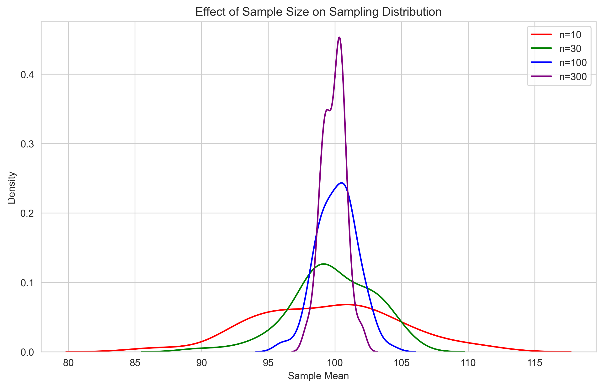

# Population vs Sample: The Foundation of Statistical Inference

## Before You Begin

- Basic understanding of descriptive statistics (mean, median, standard deviation)
- Familiarity with basic probability concepts
- Basic Python programming knowledge (for examples)

## Key Terms

- **Population**: The complete set of all items or individuals we want to study
- **Sample**: A subset of the population that we actually measure
- **Sampling**: The process of selecting a sample from a population
- **Parameter**: A numerical characteristic of a population
- **Statistic**: A numerical characteristic of a sample

## Introduction: The Detective Analogy

Imagine you're a detective trying to understand a city's crime patterns. You can't investigate every single crime (population), but you can study a carefully selected set of cases (sample) to make informed conclusions about the whole city. This is the essence of sampling in statistics!

## What is a Population?

### Definition

A population is the **complete set** of all items, individuals, or measurements that we're interested in studying. It's the "big picture" we want to understand.

### Real-world Examples

1. **Business Context**:
   - All customers who have ever shopped at an e-commerce store
   - Every transaction processed by a payment system
   - All products in a company's inventory

2. **Research Context**:
   - All students in a university
   - Every patient with a specific medical condition
   - All trees in a forest

### Visual Representation


*Figure 1: The relationship between population and sample. The larger circle represents the entire population, while the smaller circle inside represents our sample.*

## What is a Sample?

### Definition

A sample is a carefully selected **subset** of the population that we actually measure and analyze. Think of it as our "window" into the larger population.

### Real-world Examples

1. **Business Context**:
   - 1,000 randomly selected customers for a satisfaction survey
   - 10,000 transactions from last month for fraud analysis
   - 100 products for quality testing

2. **Research Context**:
   - 200 students surveyed about campus facilities
   - 50 patients participating in a clinical trial
   - 500 trees measured in a forest study

## Why Do We Need Samples?

### Practical Reasons

1. **Cost**: Studying entire populations is often expensive
2. **Time**: Complete enumeration takes too long
3. **Feasibility**: Some populations are infinite or constantly changing
4. **Destructive Testing**: Some measurements destroy the item being measured

### Example: Quality Control in Manufacturing

```python
import numpy as np
import matplotlib.pyplot as plt

# Simulate a production batch of 10,000 items
population = np.random.normal(loc=100, scale=5, size=10000)  # Target: 100 units

# Take a sample of 100 items
sample = np.random.choice(population, size=100, replace=False)

# Visualize population and sample
plt.figure(figsize=(12, 6))
plt.subplot(121)
plt.hist(population, bins=30, alpha=0.7, color='blue')
plt.title('Population Distribution')
plt.xlabel('Measurement')
plt.ylabel('Frequency')

plt.subplot(122)
plt.hist(sample, bins=15, alpha=0.7, color='green')
plt.title('Sample Distribution')
plt.xlabel('Measurement')
plt.ylabel('Frequency')

plt.tight_layout()
plt.savefig('docs/4-stat-analysis/4.1-inferential-stats/assets/population_sample_dist.png')
```

## Sampling Methods: Choosing Your Strategy

### 1. Simple Random Sampling (SRS)

The statistical equivalent of drawing names from a hat - every member has an equal chance.

```python
def simple_random_sample(population, sample_size):
    """Generate a simple random sample"""
    return np.random.choice(population, size=sample_size, replace=False)

# Example usage
population = np.arange(1000)  # IDs 0-999
sample = simple_random_sample(population, 100)
print(f"Random sample IDs: {sample[:5]}...")  # Show first 5 IDs
```

#### Visual Representation

[Recommended Image: A hat with names being drawn randomly]

### 2. Stratified Sampling

Like organizing a party where you ensure representation from different departments.

```python
def stratified_sample(population, strata_sizes, sample_sizes):
    """Generate a stratified sample"""
    samples = []
    start_idx = 0
    
    for stratum_size, sample_size in zip(strata_sizes, sample_sizes):
        stratum = population[start_idx:start_idx + stratum_size]
        sample = np.random.choice(stratum, size=sample_size, replace=False)
        samples.extend(sample)
        start_idx += stratum_size
    
    return np.array(samples)

# Example: Sampling by age groups
population = np.arange(3000)  # 3000 people
strata_sizes = [1000, 1000, 1000]  # Equal size strata
sample_sizes = [50, 50, 50]  # Equal size samples
sample = stratified_sample(population, strata_sizes, sample_sizes)
```

#### Visual Representation

[Recommended Image: Population divided into colored sections with samples taken from each]

### 3. Systematic Sampling

Like picking every 10th person who walks into a store.

```python
def systematic_sample(population, interval):
    """Generate a systematic sample"""
    start = np.random.randint(0, interval)
    return population[start::interval]

# Example: Select every 10th customer
population = np.arange(1000)
sample = systematic_sample(population, 10)
```

#### Visual Representation

[Recommended Image: A line of people with every 10th person highlighted]

### 4. Cluster Sampling

Like studying a few neighborhoods to understand a city.

```python
def cluster_sample(population, n_clusters, cluster_size):
    """Generate a cluster sample"""
    clusters = np.random.choice(len(population), size=n_clusters, replace=False)
    samples = []
    
    for cluster in clusters:
        start = cluster * cluster_size
        end = start + cluster_size
        samples.extend(population[start:end])
    
    return np.array(samples)

# Example: Sample 5 clusters of 20 people each
population = np.arange(1000)
sample = cluster_sample(population, 5, 20)
```

#### Visual Representation

[Recommended Image: Map showing selected neighborhoods/clusters]

### Visual Comparison of Sampling Methods


*Figure 2: Visual comparison of different sampling methods. From top-left: Simple Random, Stratified, Systematic, and Cluster sampling.*

## Common Sampling Errors and How to Avoid Them

### 1. Selection Bias

When your sample isn't truly representative.

#### Example

❌ Surveying only mall shoppers about online shopping habits
✅ Using a mix of in-store and online customer lists

### 2. Sampling Error

Natural variation between sample and population.

```python
def calculate_sampling_error(population_std, sample_size):
    """Calculate standard error of the mean"""
    return population_std / np.sqrt(sample_size)

# Example
population_std = 15
sample_sizes = [10, 100, 1000]
for n in sample_sizes:
    se = calculate_sampling_error(population_std, n)
    print(f"Sample size {n}: Standard Error = {se:.2f}")
```

### 3. Coverage Error

When your sampling frame misses parts of the population.

#### Example

❌ Email survey missing customers without email
✅ Using multiple contact methods (phone, mail, in-person)

## Sample Size Determination

### The Sample Size Formula

For estimating a proportion with specified margin of error:

```python
def calculate_sample_size(confidence_level=0.95, margin_of_error=0.05, p=0.5):
    """Calculate required sample size for proportion estimation"""
    from scipy.stats import norm
    
    z_score = norm.ppf(1 - (1 - confidence_level) / 2)
    n = (z_score**2 * p * (1-p)) / margin_of_error**2
    return int(np.ceil(n))

# Example
n = calculate_sample_size(confidence_level=0.95, margin_of_error=0.03)
print(f"Required sample size: {n}")
```

## Interactive Learning

### Mini-Exercise: Sampling Simulation

Try this code to see how sample means compare to population mean:

```python
def sampling_simulation(population_mean=100, population_std=15, sample_sizes=[10, 100, 1000]):
    """Demonstrate the effect of sample size on estimation"""
    population = np.random.normal(loc=population_mean, scale=population_std, size=10000)
    pop_mean = population.mean()
    
    print(f"Population mean: {pop_mean:.2f}\n")
    
    for size in sample_sizes:
        sample = np.random.choice(population, size=size)
        print(f"Sample size: {size}")
        print(f"Sample mean: {sample.mean():.2f}")
        print(f"Difference from population mean: {abs(sample.mean() - pop_mean):.2f}\n")

sampling_simulation()
```

### Visualizing Sampling Error


*Figure 3: Visualization of sampling error. The blue curve shows the population distribution, while the red curve shows the distribution of sample means.*

### Effect of Sample Size


*Figure 4: How sample size affects the sampling distribution. Larger samples (purple) show less variability than smaller samples (red).*

## Common Questions and Answers

1. **Q: Why can't we just study the entire population?**
   A: Often impractical due to cost, time, or the population being too large or constantly changing.

2. **Q: How do I know if my sample is representative?**
   A: Use random sampling methods and check if sample characteristics match known population characteristics.

3. **Q: What's the minimum sample size I need?**
   A: Depends on your desired confidence level and margin of error. Use the sample size calculator provided.

## Practice Problems

1. A company wants to estimate the average time customers spend on their website. They have 1 million monthly visitors. What sampling method would you recommend and why?

2. Calculate the required sample size for a survey with:
   - 95% confidence level
   - 3% margin of error
   - Expected proportion of 0.5

3. A researcher wants to study student satisfaction across different faculties. Design a sampling strategy that ensures representation from each faculty.

## Key Takeaways

1. Populations are complete sets, samples are subsets
2. Good sampling is crucial for valid inferences
3. Larger samples generally give more precise estimates
4. Be aware of potential sampling errors
5. Different sampling methods suit different situations

## Additional Resources

- [Interactive Sampling Distribution Simulator](https://seeing-theory.brown.edu/sampling-distributions/index.html)
- [Sample Size Calculator](https://www.surveymonkey.com/mp/sample-size-calculator/)
- [Sampling Methods Tutorial](https://stattrek.com/survey-research/sampling-methods)

## Next Steps

- Learn about parameters and statistics
- Understand sampling distributions
- Explore confidence intervals
- Study hypothesis testing

Remember: Sampling is like taking a photograph - the better your technique, the clearer your picture of the population! 📸
