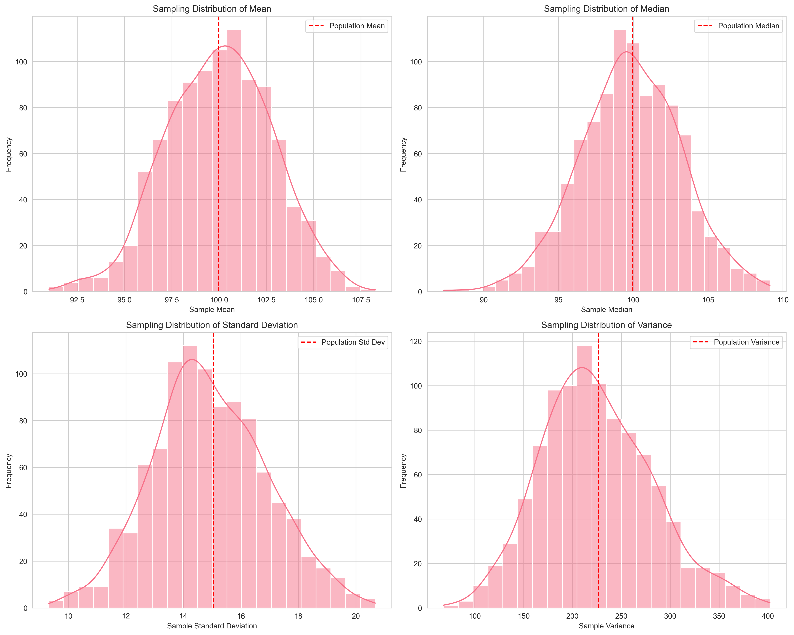
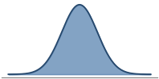
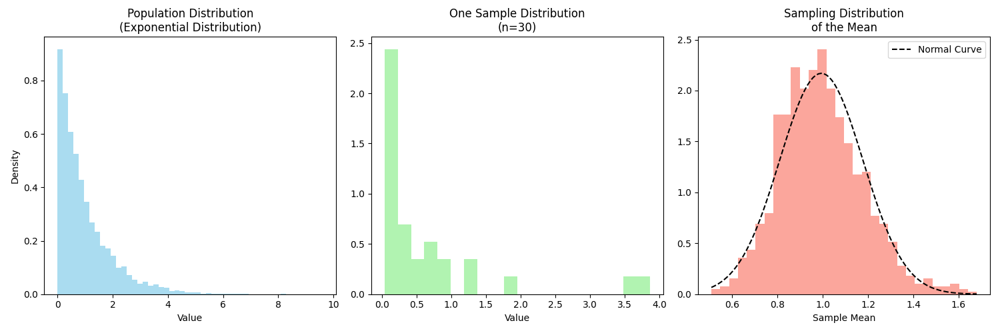
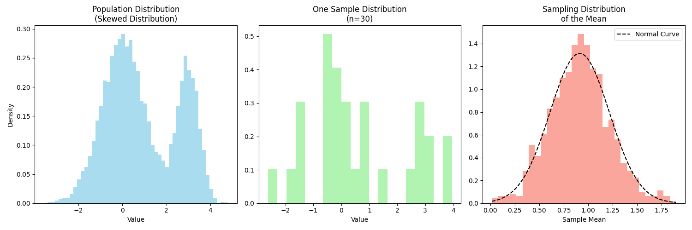
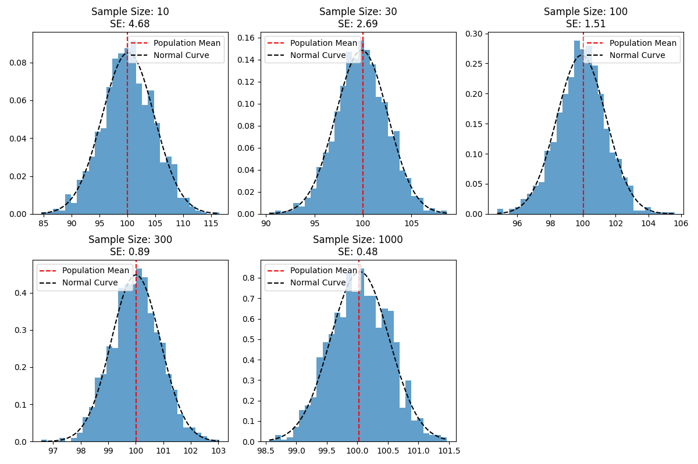
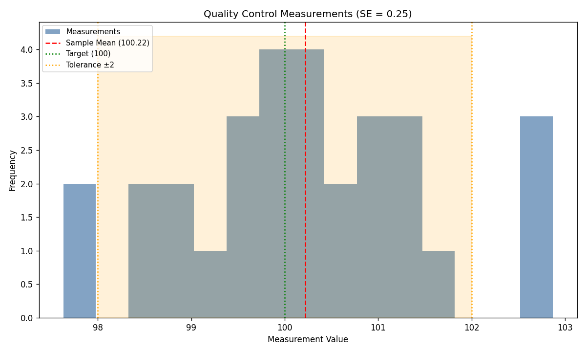
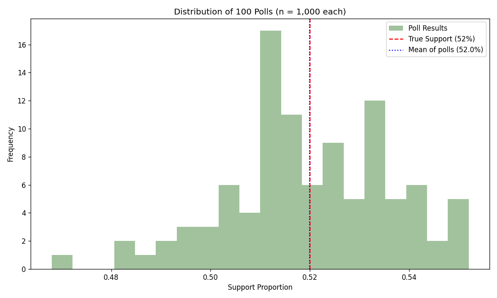
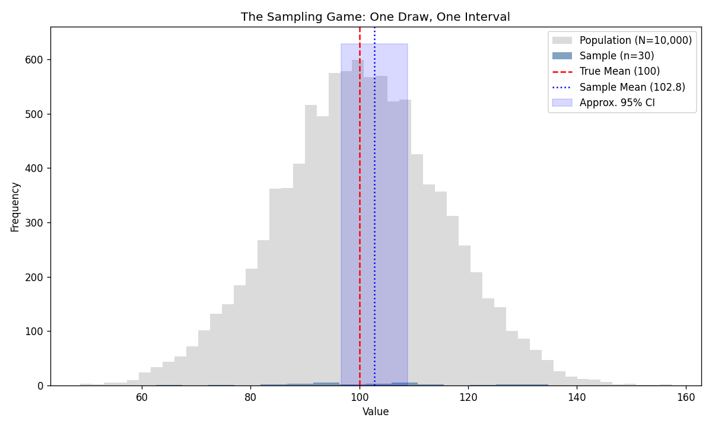

# Sampling Distributions: The Heart of Statistical Inference

**After this lesson:** you can explain Sampling Distributions: The Heart of Statistical Inference and try the examples in your own notebook.

## Overview

If you drew another sample tomorrow, your mean would change slightly. A **sampling distribution** describes how a statistic (like \\(\bar x\\)) would vary under repeated sampling. That distribution is what makes [confidence intervals](confidence-intervals.md), p-values, and tests behave the way they do, including the famous **Central Limit Theorem** for means. Read this lesson before confidence intervals so the margin-of-error formula has a foundation.

## Why this matters

* **Sampling distributions** explain why means and proportions vary from sample to sample.
* The **Central Limit Theorem** and **standard error** underpin confidence intervals and tests.

## Prerequisites

* [Population vs sample](population-sample.md) for the population/sample/parameter/statistic vocabulary.
* Comfort with means, standard deviation, and basic probability.

> **Note:** Simulation plots in this lesson are optional; the written CLT summary is the core outcome.

## Introduction: Why Sampling Distributions Matter

Imagine you're a chef trying to perfect a recipe. You taste-test small portions (samples) to understand how the entire dish (population) tastes. But how reliable are these taste tests? That's where sampling distributions come in - they help us understand how sample statistics vary and how well they represent the true population!

 _Figure 1: Visual representation of sampling distributions. The diagram shows how multiple samples from a population create a distribution of sample statistics._

## What is a Sampling Distribution?

A sampling distribution is the distribution of a statistic (like mean or proportion) calculated from repeated random samples of the same size from a population. Think of it as the "distribution of distributions" - it shows us how sample statistics bounce around the true population value.

### Mathematical Definition

For a sample mean \\(\bar x\\):

* Mean: \\(E(\bar x) = \mu\\) (population mean)
* Standard Error: \\(SE(\bar x) = \dfrac{\sigma}{\sqrt{n\}}\\)
  * where \\(\sigma\\) is the population standard deviation
  * and \\(n\\) is the sample size

 _Figure 2: Visual explanation of the sampling distribution formula. The diagram shows how the standard error decreases as sample size increases._

## The Central Limit Theorem (CLT): Statistical Magic

### What is CLT?

The Central Limit Theorem states that for sufficiently large samples:

1. The sampling distribution of the mean is approximately normal
2. This holds true regardless of the population's distribution
3. The larger the sample size, the more normal it becomes

#### How large is "sufficiently large"?

The folklore answer is "n ≥ 30," which is fine as a default but hides important nuance: how fast the sampling distribution becomes approximately normal depends on the _shape_ of the underlying population. The mini-pictures below show the rough shape implied by each row.

| Shape                                                                    | Population shape                                                  | Approximate \\(n\\) needed                                               |
| ------------------------------------------------------------------------ | ----------------------------------------------------------------- | ------------------------------------------------------------------------ |
|                      | Already normal (bell curve)                                       | any \\(n\\), the sampling distribution of \\(\bar x\\) is exactly normal |
|                    | Roughly symmetric with light tails (e.g., uniform / "flat top")   | \\(n \approx 15\text{-}20\\)                                             |
|                | Mild skew or moderate outliers (gentle lean to one side)          | \\(n \approx 30\text{-}40\\), the textbook rule                          |
|            | Strong skew (long tail, e.g., exponential, income, waiting times) | \\(n \approx 50\text{-}100\\) or more                                    |
|  | Binomial with \\(p\\) near 0 or 1 (most weight on one side)       | check \\(np \geq 10\\) **and** \\(n(1-p) \geq 10\\)                      |

**How to read this:** the bumpier or more lop-sided the population, the more data you need before the _average_ of a sample starts to look like a clean bell. So when you read "n = 30 is enough," ask: _enough for what kind of population?_ If your data have a long tail or many extreme values (think incomes, waiting times, customer spend), aim for the higher end of the table.

Look at it in action!

**CLT simulation: population → one sample → distribution of \\(\bar x\\)**

Build population

Switch on `distribution` to build an exponential, uniform, or bimodal skewed population of 10,000 values.

Collect sample means

Repeatedly sample n=30 from the population and store each mean. This list is the empirical sampling distribution.

Overlay the normal curve

Fit a normal curve to the simulated means and overlay it on the histogram, the visual signature of CLT.

### What the simulation produces

Three side-by-side panels per population type:

1. **Population**: the raw shape we sampled from (could be very non-normal).
2. **One sample**: what 30 randomly drawn values look like (still messy).
3. **Sampling distribution**: histogram of _means_ from 1,000 such samples, with a normal curve overlaid.

Look at panel 3 in each image: even for the lopsided exponential and bimodal "skewed" populations, the histogram of means is a clean bell.

 _Figure 2a: An exponential (long-tail) population. Individual draws are skewed, but the sampling distribution of the mean (right) is approximately normal._

 _Figure 2b: A uniform (flat) population. Same story, the mean's distribution looks like a bell even though the population doesn't._

 _Figure 2c: A bumpy, two-bump population. CLT still kicks in for the mean._

**Big idea:** CLT is a statement about _averages_, not about individual data points. The raw data can stay weird; the mean smooths out.

### Interactive simulation: try it yourself

Use the **dropdown** to switch the population shape (normal, uniform, exponential, bimodal) and the **slider** to change the sample size \\(n\\). Watch the right-hand panel: even when the population (left) is wildly non-normal, the histogram of sample means becomes increasingly bell-shaped as \\(n\\) grows.

**Things to try:**

* Set the population to **right-skew (exponential)** with \\(n = 5\\). Notice the sampling distribution is still skewed.
* Bump \\(n\\) to 30, then 100. The right panel becomes a textbook bell.
* Switch to **bimodal**. Even though the population has two humps, the _means_ land in a single bell. That's CLT.

## Standard Error: Measuring the Spread

The standard error (SE) tells us how much sample statistics typically deviate from the population parameter. It's like a "margin of wobble" for our estimates!

### Formula for Different Statistics

1. For means: \\(SE(\bar x) = \dfrac{\sigma}{\sqrt{n\}}\\)
2. For proportions: \\(SE(\hat p) = \sqrt{\dfrac{p(1-p)}{n\}}\\)
3. For differences: \\(SE(\bar x\_1 - \bar x\_2) = \sqrt{\dfrac{\sigma\_1^2}{n\_1} + \dfrac{\sigma\_2^2}{n\_2\}}\\)

#### Symbol legend

| Symbol                      | Read aloud                  | What it means                                                                                        |
| --------------------------- | --------------------------- | ---------------------------------------------------------------------------------------------------- |
| \\(SE\\)                    | "standard error"            | How much the statistic typically wobbles from sample to sample                                       |
| \\(\bar x\\)                | "x-bar"                     | The **sample mean** (one number computed from your data)                                             |
| \\(\sigma\\)                | "sigma"                     | The **population standard deviation**, the spread of individual values across the whole population   |
| \\(\sigma^2\\)              | "sigma squared"             | The **population variance** (just \\(\sigma\\) squared)                                              |
| \\(n\\)                     | "n"                         | The **sample size**, how many observations you collected                                             |
| \\(\sqrt{n}\\)              | "square root of n"          | Why bigger samples shrink the SE more slowly than you'd hope (you need 4× more data to halve the SE) |
| \\(\hat p\\)                | "p-hat"                     | The **sample proportion**, the fraction of "yes" outcomes in your sample (e.g., 184 / 200 = 0.92)    |
| \\(p\\)                     | "p"                         | The **true population proportion** that \\(\hat p\\) is estimating                                   |
| \\(p(1-p)\\)                | "p times one minus p"       | A measure of how "spread out" a yes/no variable is; biggest at \\(p = 0.5\\), smallest near 0 or 1   |
| \\(\bar x\_1 - \bar x\_2\\) | "x-bar one minus x-bar two" | The **difference between two group means** (e.g., treatment minus control)                           |
| \\(n\_1, n\_2\\)            | "n one, n two"              | The sample sizes of group 1 and group 2                                                              |
| \\(\sigma\_1, \sigma\_2\\)  | "sigma one, sigma two"      | The population standard deviations of group 1 and group 2                                            |

In plain words, all three formulas have the same shape: **noise in the data ÷ a function of how many points you have**. More data → smaller SE → tighter estimates.

Look at how sample size affects SE:

**Empirical vs theoretical standard error across n**

Population setup

Create a synthetic normal population of 10,000 values with mean 100 and SD 15 as the reference distribution.

Subplot grid

For each n, simulate 1,000 sample means, plot the sampling distribution as a histogram with a normal curve overlay and the SE in the title.

Theoretical vs empirical

Compute both the formula-based SE (σ/√n) and the Monte Carlo SE for each sample size and store them for the table printout.

Comparison table

Print a formatted table comparing theoretical and empirical SE values so students can verify the formula against simulation.

 _Figure 3: As sample size grows from 10 to 1,000, the sampling distribution of the mean (each panel) gets narrower, the standard error shrinks roughly by 1/√n._

#### Interactive: SE vs sample size

Slide \\(n\\) from 5 to 500. Left: the sampling distribution of \\(\bar x\\) gets narrower. Right: the empirical SE (orange dot) lands close to the theoretical \\(\sigma/\sqrt{n}\\) curve (blue line), and the gap shows the cost of being too aggressive with small samples.

_Note: The visualization shows how the sampling distribution becomes narrower (smaller standard error) as sample size increases. This demonstrates the relationship between sample size and estimation precision._

## Real-world Applications

### 1. Quality Control in Manufacturing

**Single hour's sample vs spec band**

Spec limits

Define the nominal target (100) and acceptable tolerance band (±2 units) for the production specification.

Hourly sample

Simulate 30 production measurements drawn from a slightly off-target normal and compute the mean and standard error.

Control chart

Plot the histogram with lines for the sample mean, nominal target, and tolerance bounds shaded in orange.

Status report

Print mean, SE, and a simple "In Control / Out of Control" status based on whether the mean falls within tolerance.

 _Figure 4: One hour's sample of 30 measurements (blue bars). Red dashed line = sample mean; green dotted = target (100); orange dotted = tolerance band (±2). The process is "in control" if the sample mean falls inside the orange band._

_Note: The visualization shows the distribution of quality control measurements with the target value and tolerance limits. This helps us understand if the production process is in control._

### 2. Political Polling

**Monte Carlo distribution of \\(\hat p\\) and one poll's MOE**

Poll parameters

Set the true support level at 52% and simulate 100 independent polls of 1,000 voters each.

Sampling distribution of p̂

List comprehension builds 100 Bernoulli-draw means, creating an empirical sampling distribution of the proportion.

Poll histogram

Visualize the spread of poll results with vertical lines marking the true support and the mean of simulated polls.

Single poll margin

Compute p̂ and the normal-approximation SE for one poll, then print the margin of error (±1.96·SE) as a percentage.

 _Figure 5: Histogram of 100 simulated polls of 1,000 voters each. The true support is 52% (red dashed). Most polls land within a couple of percentage points, that wobble is the sampling distribution of \\(\hat p\\)._

_Note: The visualization shows the distribution of poll results from multiple samples. This helps us understand the variability in polling estimates and the role of sampling error._

## Common misconceptions to clear up

### 1. Sampling Distribution vs. Sample Distribution

* Sample Distribution: The spread of values in ONE sample
* Sampling Distribution: The spread of statistics from MANY samples

### 2. Standard Deviation vs. Standard Error

* Standard Deviation: Spread of individual values
* Standard Error: Spread of sample statistics

### 3. Sample Size Effects

* **Misconception:** "Larger samples always give the right answer." Larger samples reduce _random_ error but cannot fix a biased design.
* **Reality:** Larger samples give more _precise_ estimates of whatever the design measures, accurate or not.

## Interactive Learning: Try It Yourself

### Mini-Exercise: The Sampling Game

**One draw + approximate 95% band (z = 1.96)**

One draw

Generate a population and take one random sample; compute the sample mean and approximate SE using the sample SD.

Overlaid histograms

Plot the population (transparent) and sample (opaque) with vertical lines for both means and a shaded approximate 95% CI band.

Coverage check

Print the CI and check whether the true mean falls inside it, a simple illustration of what "95% confidence" means in one run.

 _Figure 6: One run of the sampling game. Grey histogram = population, blue histogram = the single sample, red dashed = the true mean, blue dotted = our sample mean, blue band = the approximate 95% CI for the mean. Run the code repeatedly and count how often the band covers the red line, it should be close to 95 out of 100 times._

#### Interactive: 30 samples, 30 intervals

The widget below shows 30 independent samples drawn from the same population, each with its 95% CI. Blue intervals **cover** the true mean (red dashed line); red intervals **miss**. The header reports the coverage rate, across many runs it converges to 95%.

This is the _operational_ meaning of "95% confidence", not "this specific interval has a 95% probability of being right," but "this _procedure_ gets it right 95% of the time."

_Note: The visualization shows how a single sample relates to the population distribution. The confidence interval helps us understand the uncertainty in our sample mean estimate._

## Practice Questions

Try each question on your own first, then expand the answer to check.

**1.** A sample of 100 customers shows mean spending of $85 with SE = $5. What's the 95% CI?

Show answer

For \\(n = 100\\) the t critical value is essentially 1.98, close enough to the rule-of-thumb \\(z = 1.96\\), so:

\\\[ \text{95% CI} \approx \bar x \pm 1.96 \cdot SE = 85 \pm 1.96 \times 5 = 85 \pm 9.8 \\]

That gives **roughly $75.20 to $94.80**. Plain reading: based on this sample, the procedure used produces an interval that captures the true average customer spend about 95% of the time, and this particular interval is $75.20-$94.80.

**2.** How would doubling sample size affect the standard error? Show the math.

Show answer

\\(SE = \dfrac{\sigma}{\sqrt{n\}}\\). If \\(n\\) becomes \\(2n\\):

\\\[ SE\_{\text{new\}} = \dfrac{\sigma}{\sqrt{2n\}} = \dfrac{1}{\sqrt{2\}} \cdot \dfrac{\sigma}{\sqrt{n\}} \approx 0.707 \cdot SE\_{\text{old\}} \\]

So doubling \\(n\\) shrinks the SE by a factor of \\(1/\sqrt{2} \approx 0.71\\), a **\~29% reduction**, _not_ 50%. To halve the SE you need to **quadruple** the sample size.

**3.** Why might the CLT not work well with very small samples?

Show answer

The CLT promises that the sampling distribution of the mean is approximately normal **as \\(n\\) grows**. With small \\(n\\):

* A handful of extreme values can dominate the average, so individual sample means swing wildly.
* If the population is heavily skewed (income, waiting times) or has long tails, \\(n = 5\\) or \\(n = 10\\) is far too small for the bell-curve approximation to hold.
* Inferences (CIs, p-values) that rely on the normal approximation will be off, typically too narrow / too confident.

Rule of thumb: aim for \\(n \geq 30\\) for mildly skewed populations, \\(n \geq 50\text{-}100\\) for strongly skewed ones (see the table earlier in the lesson).

**4.** Design a sampling strategy for estimating average daily website traffic.

Show answer

A reasonable plan:

1. **Define the population clearly**: e.g., "daily unique visitors to the site for a calendar year." Decide whether bots are included.
2. **Pick the sampling unit**: usually the _day_, not individual visits, so each draw is one day's traffic count.
3. **Use stratified sampling by day-of-week**: traffic on Mondays and weekends behaves very differently. Strata: Mon, Tue, Wed, Thu, Fri, Sat, Sun. Sample several days from each.
4. **Cover seasonality**: sample across the whole year (or at least several months) to avoid period-specific bias (e.g., holiday spikes).
5. **Set sample size from desired precision**: choose how tight you want the CI for the average and back-solve via \\(n = (z\sigma/\text{MOE})^2\\) using a pilot estimate of the day-to-day standard deviation.
6. **Report \\(\bar x\\) with a confidence interval**, not just a point estimate, so consumers see the uncertainty.

If you have analytics for _every_ day, you don't need to sample at all, just compute the mean directly. Sampling matters when measurement is costly (e.g., manual log review, paid tools with quotas).

**5.** How would you explain sampling distributions to a non-technical stakeholder?

Show answer

> "Imagine we ran our survey 100 different times, each with a fresh group of customers. We'd get 100 slightly different averages, that's not a mistake, that's just life. The _sampling distribution_ is the picture of those 100 averages.
>
> Two things to know:
>
> 1. The averages cluster around the true value, not on top of it. So our single survey number is _near_ the truth, not exactly the truth.
> 2. The bigger our survey, the tighter that cluster, meaning our number is closer to the truth.
>
> That's why we report a _range_ (a confidence interval) instead of a single number: it's an honest way of saying 'here's our best guess, and here's how much that guess could move if we redid the survey'."

## Key Takeaways

1. Sampling distributions help us understand estimation uncertainty
2. The Central Limit Theorem is a powerful tool for inference
3. Standard error decreases with larger sample sizes
4. Different statistics have different sampling distributions
5. Visualizing sampling distributions aids understanding
6. Real-world applications include quality control and polling
7. Common misconceptions can lead to incorrect interpretations

## Gotchas

* **Confusing the sampling distribution with the sample distribution**: the _sample distribution_ is the histogram of values in one dataset; the _sampling distribution_ is the distribution of a statistic (e.g., x̄) across hypothetical repeated samples. The CLT applies to the second, not the first.
* **Believing the CLT means "your data become normal with more observations"**: the CLT says the _sampling distribution of the mean_ becomes approximately normal; the raw data can stay skewed or bimodal regardless of n. Using CLT to justify normality of individual values leads to wrong model choices downstream.
* **Using `np.random.choice(population, size=n)` to build a sampling distribution when n is small**: for a population of size 10,000 and n=5, each resample is highly sensitive to outliers and the normal approximation is poor. The lesson's threshold of n=30 is a common rule of thumb; skewed populations may need n>50 before the CLT kicks in.
* **Equating standard deviation with standard error**: `np.std(data)` gives the spread of individual observations; `scipy.stats.sem(data)` gives how much the _mean_ varies across samples. Using the wrong one in a CI formula inflates or deflates the interval by a factor of √n.
* **Overlaying a normal curve on a sampling distribution and concluding CLT "proved"**: the lesson's `stats.norm.pdf` overlay is fitted to the simulated means, so it will always look like a decent fit. A formal normality check (Shapiro-Wilk or Q-Q plot) is needed to verify CLT has kicked in adequately for a given n and population shape.
* **Running the demonstration code without a fixed seed and expecting stable output**: the lesson's CLT simulation uses `np.random.choice` inside a loop without a per-run seed; re-running will produce slightly different empirical SEs. Always seed before benchmarking or sharing, and report that values are approximate.

## Next steps

* Continue to [Confidence intervals](confidence-intervals.md), where the σ/√n formula you just met becomes the margin of error.

## Additional Resources

* [Interactive Sampling Distribution Simulator](https://seeing-theory.brown.edu/frequentist-inference/index.html)
* [Understanding Sampling Distributions](https://statisticsbyjim.com/basics/sampling-distribution/)
* [CLT in Practice](https://www.khanacademy.org/math/statistics-probability/sampling-distributions-library)

Remember: Sampling distributions are the foundation of statistical inference. Understanding them helps us make better decisions with data!
