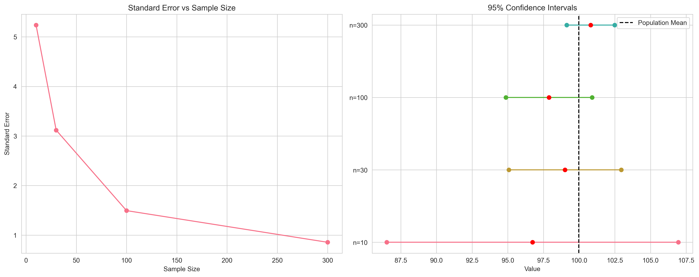

# Sampling Distributions: The Heart of Statistical Inference

## Introduction: Why Sampling Distributions Matter

Imagine you're a chef trying to perfect a recipe. You taste-test small portions (samples) to understand how the entire dish (population) tastes. But how reliable are these taste tests? That's where sampling distributions come in - they help us understand how sample statistics vary and how well they represent the true population!


*Figure 1: Visual representation of sampling distributions. The diagram shows how multiple samples from a population create a distribution of sample statistics.*

## What is a Sampling Distribution?

A sampling distribution is the distribution of a statistic (like mean or proportion) calculated from repeated random samples of the same size from a population. Think of it as the "distribution of distributions" - it shows us how sample statistics bounce around the true population value.

### Mathematical Definition

For a sample mean X̄:

- Mean: $$E(X̄) = μ$$ (population mean)
- Standard Error: $$SE(X̄) = \frac{σ}{\sqrt{n}}$$
  - where σ is population standard deviation
  - and n is sample size


*Figure 2: Visual explanation of the sampling distribution formula. The diagram shows how the standard error decreases as sample size increases.*

## The Central Limit Theorem (CLT): Statistical Magic

### What is CLT?

The Central Limit Theorem states that for sufficiently large samples:

1. The sampling distribution of the mean is approximately normal
2. This holds true regardless of the population's distribution
3. The larger the sample size, the more normal it becomes

Let's see it in action!

```python
import numpy as np
import matplotlib.pyplot as plt
from scipy import stats

def demonstrate_clt(distribution='exponential', sample_size=30, n_samples=1000):
    """
    Demonstrate CLT with different distributions
    """
    plt.figure(figsize=(15, 5))
    
    # Generate population
    if distribution == 'exponential':
        population = np.random.exponential(scale=1.0, size=10000)
        title = 'Exponential Distribution'
    elif distribution == 'uniform':
        population = np.random.uniform(0, 1, 10000)
        title = 'Uniform Distribution'
    else:  # Skewed custom distribution
        population = np.concatenate([
            np.random.normal(0, 1, 7000),
            np.random.normal(3, 0.5, 3000)
        ])
        title = 'Skewed Distribution'
    
    # Take many samples and calculate their means
    sample_means = [
        np.mean(np.random.choice(population, size=sample_size))
        for _ in range(n_samples)
    ]
    
    # Plot results
    plt.subplot(131)
    plt.hist(population, bins=50, density=True, alpha=0.7, color='skyblue')
    plt.title(f'Population Distribution\n({title})')
    plt.xlabel('Value')
    plt.ylabel('Density')
    
    plt.subplot(132)
    sample = np.random.choice(population, size=sample_size)
    plt.hist(sample, bins=20, density=True, alpha=0.7, color='lightgreen')
    plt.title(f'One Sample Distribution\n(n={sample_size})')
    plt.xlabel('Value')
    
    plt.subplot(133)
    plt.hist(sample_means, bins=30, density=True, alpha=0.7, color='salmon')
    x = np.linspace(min(sample_means), max(sample_means), 100)
    plt.plot(x, stats.norm.pdf(x, np.mean(sample_means), np.std(sample_means)),
             'k--', label='Normal Curve')
    plt.title(f'Sampling Distribution\nof the Mean')
    plt.xlabel('Sample Mean')
    plt.legend()
    
    plt.tight_layout()
    return plt

# Create and save plots for different distributions
distributions = ['exponential', 'uniform', 'skewed']
for dist in distributions:
    plt = demonstrate_clt(distribution=dist)
    plt.savefig(f'docs/4-stat-analysis/4.1-inferential-stats/assets/clt_{dist}.png')
    plt.close()
```

*Note: The visualization shows how the sampling distribution of the mean becomes approximately normal regardless of the population distribution. This is the essence of the Central Limit Theorem.*

## Standard Error: Measuring the Spread

The standard error (SE) tells us how much sample statistics typically deviate from the population parameter. It's like a "margin of wobble" for our estimates!

### Formula for Different Statistics

1. For means: $$SE(X̄) = \frac{σ}{\sqrt{n}}$$
2. For proportions: $$SE(p) = \sqrt{\frac{p(1-p)}{n}}$$
3. For differences: $$SE(X̄_1 - X̄_2) = \sqrt{\frac{σ_1^2}{n_1} + \frac{σ_2^2}{n_2}}$$

Let's see how sample size affects SE:

```python
def demonstrate_standard_error():
    """
    Show how SE changes with sample size
    """
    # Generate population
    np.random.seed(42)
    population = np.random.normal(100, 15, 10000)
    
    # Test different sample sizes
    sizes = [10, 30, 100, 300, 1000]
    results = []
    
    # Visualize the effect of sample size on SE
    plt.figure(figsize=(12, 8))
    for i, n in enumerate(sizes):
        plt.subplot(2, 3, i+1)
        
        # Take multiple samples
        sample_means = [
            np.mean(np.random.choice(population, size=n))
            for _ in range(1000)
        ]
        
        # Plot sampling distribution
        plt.hist(sample_means, bins=30, density=True, alpha=0.7)
        plt.axvline(np.mean(population), color='red', linestyle='--', 
                   label='Population Mean')
        
        # Add normal curve
        x = np.linspace(min(sample_means), max(sample_means), 100)
        plt.plot(x, stats.norm.pdf(x, np.mean(sample_means), np.std(sample_means)),
                'k--', label='Normal Curve')
        
        plt.title(f'Sample Size: {n}\nSE: {np.std(sample_means):.2f}')
        plt.legend()
    
    plt.tight_layout()
    plt.savefig('docs/4-stat-analysis/4.1-inferential-stats/assets/standard_error_effect.png')
    plt.close()
    
    # Calculate theoretical and empirical SE
    for n in sizes:
        # Theoretical SE
        theoretical_se = np.std(population) / np.sqrt(n)
        
        # Empirical SE (from sampling distribution)
        sample_means = [
            np.mean(np.random.choice(population, size=n))
            for _ in range(1000)
        ]
        empirical_se = np.std(sample_means)
        
        results.append({
            'size': n,
            'theoretical': theoretical_se,
            'empirical': empirical_se
        })
    
    return results

# Run demonstration
se_results = demonstrate_standard_error()
print("\nStandard Error Analysis")
print("Sample Size | Theoretical SE | Empirical SE")
print("-" * 45)
for r in se_results:
    print(f"{r['size']:^10d} | {r['theoretical']:^13.3f} | {r['empirical']:^11.3f}")
```

*Note: The visualization shows how the sampling distribution becomes narrower (smaller standard error) as sample size increases. This demonstrates the relationship between sample size and estimation precision.*

## Real-world Applications

### 1. Quality Control in Manufacturing

```python
def quality_control_demo():
    """
    Simulate quality control in manufacturing
    """
    # Target specification: 100 ± 2 units
    target = 100
    tolerance = 2
    
    # Production line measurements (30 samples per hour)
    measurements = np.random.normal(100.5, 1.5, 30)
    mean = np.mean(measurements)
    se = stats.sem(measurements)
    
    # Visualize the results
    plt.figure(figsize=(10, 6))
    plt.hist(measurements, bins=15, alpha=0.7, label='Measurements')
    plt.axvline(mean, color='red', linestyle='--', label='Sample Mean')
    plt.axvline(target, color='green', linestyle=':', label='Target')
    plt.axvline(target + tolerance, color='orange', linestyle=':', label='Tolerance')
    plt.axvline(target - tolerance, color='orange', linestyle=':')
    plt.fill_between([target-tolerance, target+tolerance], [0, 0], [10, 10], 
                     color='orange', alpha=0.2)
    plt.title('Quality Control Measurements')
    plt.xlabel('Measurement Value')
    plt.ylabel('Frequency')
    plt.legend()
    plt.savefig('docs/4-stat-analysis/4.1-inferential-stats/assets/quality_control.png')
    plt.close()
    
    print("\nQuality Control Report")
    print(f"Specification: {target} ± {tolerance}")
    print(f"Sample Mean: {mean:.2f}")
    print(f"Standard Error: {se:.3f}")
    print(f"Status: {'In Control' if abs(mean - target) <= tolerance else 'Out of Control'}")

quality_control_demo()
```

*Note: The visualization shows the distribution of quality control measurements with the target value and tolerance limits. This helps us understand if the production process is in control.*

### 2. Political Polling

```python
def polling_demo():
    """
    Simulate political polling
    """
    # True population support: 52%
    true_support = 0.52
    sample_size = 1000
    
    # Simulate multiple polls
    n_polls = 100
    poll_results = [
        np.mean(np.random.binomial(1, true_support, sample_size))
        for _ in range(n_polls)
    ]
    
    # Visualize the results
    plt.figure(figsize=(10, 6))
    plt.hist(poll_results, bins=20, alpha=0.7, label='Poll Results')
    plt.axvline(true_support, color='red', linestyle='--', label='True Support')
    plt.axvline(np.mean(poll_results), color='blue', linestyle=':', label='Mean Support')
    plt.title('Distribution of Poll Results')
    plt.xlabel('Support Proportion')
    plt.ylabel('Frequency')
    plt.legend()
    plt.savefig('docs/4-stat-analysis/4.1-inferential-stats/assets/polling_results.png')
    plt.close()
    
    # Calculate statistics for a single poll
    poll = np.random.binomial(1, true_support, sample_size)
    p_hat = np.mean(poll)
    se = np.sqrt(p_hat * (1-p_hat) / sample_size)
    
    print("\nPolitical Poll Results")
    print(f"Support: {p_hat:.1%}")
    print(f"Margin of Error (95% CI): ±{1.96*se:.1%}")
    print(f"Sample Size: {sample_size:,}")
```

*Note: The visualization shows the distribution of poll results from multiple samples. This helps us understand the variability in polling estimates and the role of sampling error.*

## Common Misconceptions: Let's Clear Them Up

### 1. Sampling Distribution vs. Sample Distribution

- Sample Distribution: The spread of values in ONE sample
- Sampling Distribution: The spread of statistics from MANY samples

### 2. Standard Deviation vs. Standard Error

- Standard Deviation: Spread of individual values
- Standard Error: Spread of sample statistics

### 3. Sample Size Effects

- "Larger samples always give the right answer"
- "Larger samples give more precise estimates"


*Figure 3: Visual explanation of common sampling misconceptions. The diagram contrasts correct and incorrect interpretations of sampling concepts.*

## Interactive Learning: Try It Yourself

### Mini-Exercise: The Sampling Game

```python
def sampling_game(true_mean=100, true_std=15, sample_size=30):
    """
    Interactive demonstration of sampling variability
    """
    population = np.random.normal(true_mean, true_std, 10000)
    sample = np.random.choice(population, size=sample_size)
    sample_mean = np.mean(sample)
    se = np.std(sample) / np.sqrt(sample_size)
    
    # Visualize the results
    plt.figure(figsize=(10, 6))
    plt.hist(population, bins=50, alpha=0.3, label='Population')
    plt.hist(sample, bins=15, alpha=0.7, label='Sample')
    plt.axvline(true_mean, color='red', linestyle='--', label='True Mean')
    plt.axvline(sample_mean, color='blue', linestyle=':', label='Sample Mean')
    plt.fill_between([sample_mean-1.96*se, sample_mean+1.96*se], [0, 0], [100, 100], 
                     color='blue', alpha=0.2, label='95% CI')
    plt.title('The Sampling Game')
    plt.xlabel('Value')
    plt.ylabel('Frequency')
    plt.legend()
    plt.savefig('docs/4-stat-analysis/4.1-inferential-stats/assets/sampling_game.png')
    plt.close()
    
    print("\nThe Sampling Game")
    print(f"Sample Mean: {sample_mean:.1f}")
    print(f"Standard Error: {se:.2f}")
    print(f"95% CI: ({sample_mean - 1.96*se:.1f}, {sample_mean + 1.96*se:.1f})")
    print(f"Contains true mean? {'Yes' if true_mean-1.96*se <= sample_mean <= true_mean+1.96*se else 'No'}")

sampling_game()
```

*Note: The visualization shows how a single sample relates to the population distribution. The confidence interval helps us understand the uncertainty in our sample mean estimate.*

## Practice Questions

1. A sample of 100 customers shows mean spending of $85 with SE=$5. What's the 95% CI?
2. How would doubling sample size affect the standard error? Show the math!
3. Why might the CLT not work well with very small samples?
4. Design a sampling strategy for estimating average daily website traffic.
5. How would you explain sampling distributions to a non-technical stakeholder?

## Key Takeaways

1. Sampling distributions help us understand estimation uncertainty
2. The Central Limit Theorem is a powerful tool for inference
3. Standard error decreases with larger sample sizes
4. Different statistics have different sampling distributions
5. Visualizing sampling distributions aids understanding
6. Real-world applications include quality control and polling
7. Common misconceptions can lead to incorrect interpretations

## Additional Resources

- [Interactive Sampling Distribution Simulator](https://seeing-theory.brown.edu/frequentist-inference/index.html)
- [Understanding Sampling Distributions](https://statisticsbyjim.com/basics/sampling-distribution/)
- [CLT in Practice](https://www.khanacademy.org/math/statistics-probability/sampling-distributions-library)

Remember: Sampling distributions are the foundation of statistical inference. Understanding them helps us make better decisions with data!
