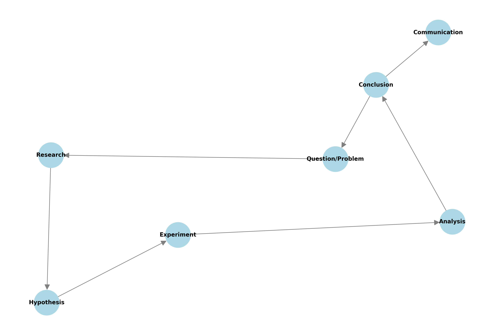
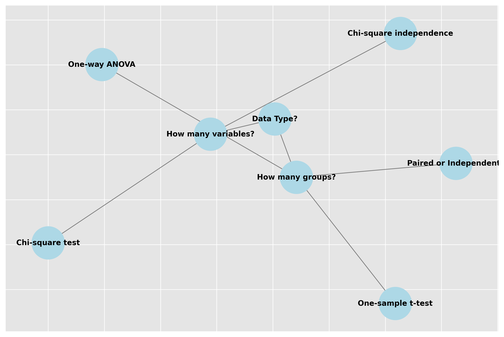
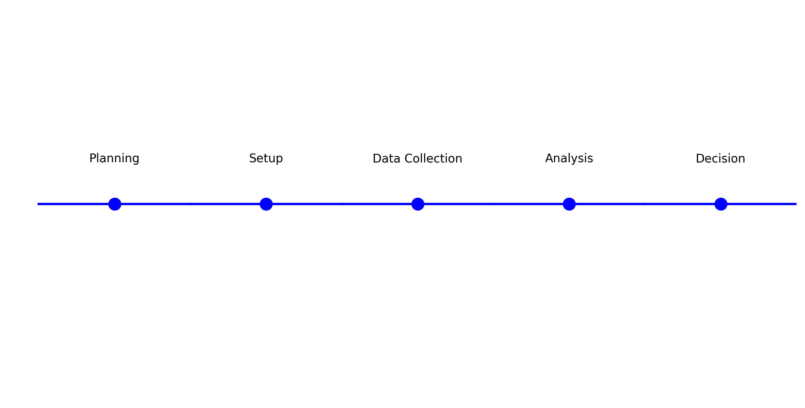
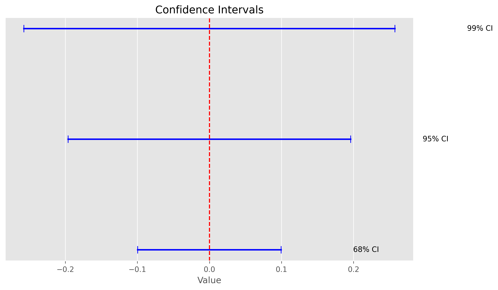
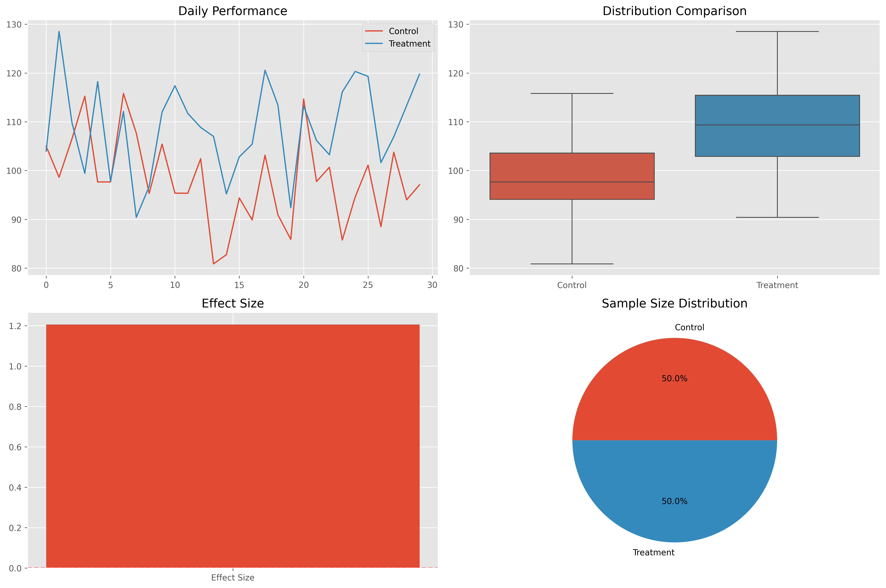
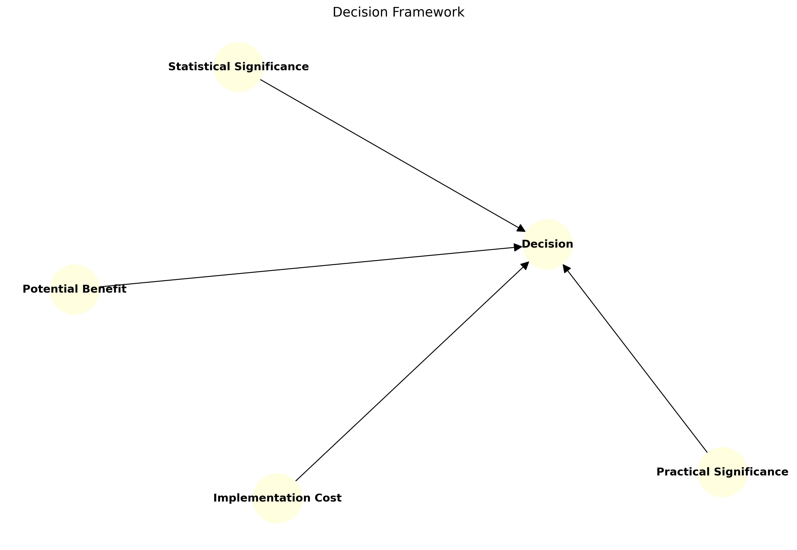
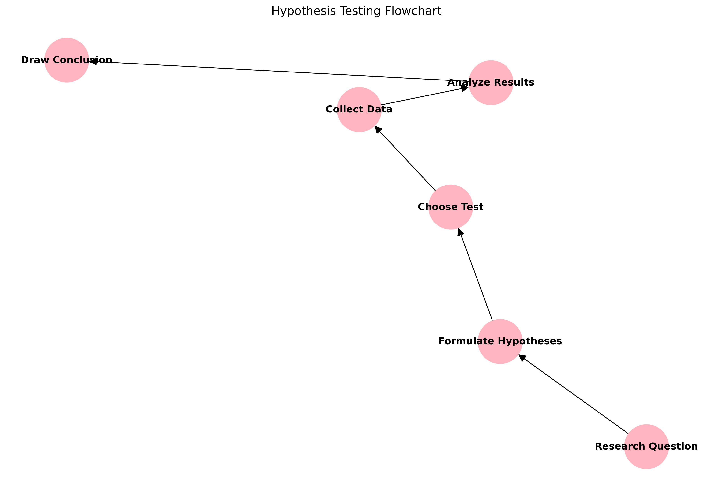
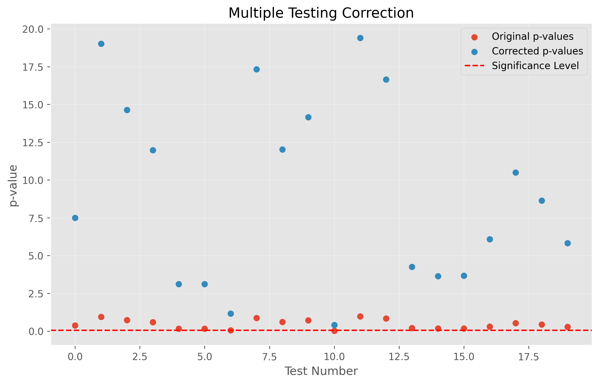

# Testing Hypotheses: From Questions to Answers

**After this submodule:** you can use the lessons linked below and complete the exercises that match **Testing Hypotheses: From Questions to Answers** in your course schedule.

## Overview

This unit turns a vague question into a **designed comparison**, a **null and alternative**, a **chosen test**, and a **report** that separates statistical noise from practical importance. Submodule 4.1 gave you uncertainty and p-values; here you use them inside disciplined experiments—especially A/B-style work—before you move on to modelling relationships in [module 4.3](../4.3-rship-in-data/README.md).

See the [Module 4 overview](../README.md) for prerequisites and how this unit connects to inference and regression.

## Helpful video

Core ideas behind hypothesis tests and the null hypothesis.

<iframe width="560" height="315" src="https://www.youtube.com/embed/0oc49DyA3hU" title="Hypothesis Testing and The Null Hypothesis, Clearly Explained" frameborder="0" allow="accelerometer; autoplay; clipboard-write; encrypted-media; gyroscope; picture-in-picture" allowfullscreen></iframe>

## Learning Objectives

By the end of this module, you will be able to:

- Understand and apply experimental design principles
- Formulate clear, testable hypotheses
- Conduct and analyze A/B tests
- Choose and apply appropriate statistical tests
- Communicate results effectively to stakeholders
- Identify and avoid common pitfalls

## Topics covered (lesson order)

Follow this sequence (it matches the site lesson navigation):

1. [Experimental design](./experimental-design.md) — Control, randomization, replication, blocking basics  
2. [Hypothesis formulation](./hypothesis-formulation.md) — Null vs alternative, one- vs two-sided tests, clarity  
3. [Statistical tests](./statistical-tests.md) — Matching tests to data types and assumptions  
4. [A/B testing](./ab-testing.md) — Metrics, execution, and product-style workflows  
5. [Results analysis](./results-analysis.md) — Effect sizes, intervals, and communication  

## Prerequisites

Before diving in, you should be comfortable with:

- Basic inferential statistics
- Probability theory fundamentals
- Python programming basics
- Descriptive statistics

## Why this matters

Hypothesis testing is not only for academic papers. The same structure applies whenever you must justify a change with data. The following lists show typical arenas—each still needs clean design and honest reporting.

### In business

- Optimize website conversions
- Test marketing campaigns
- Improve product features
- Enhance customer experience
- Make pricing decisions

### In research

- Validate scientific hypotheses
- Compare treatment effects
- Study behavioral patterns
- Analyze experimental results

### In technology

- Test new algorithms
- Optimize system performance
- Validate UI/UX changes
- Improve recommendation systems

## Real-world Applications

### E-commerce Example

**Two-proportion style table → chi-square**

<div class="code-explainer" data-code-explainer>
<div class="code-explainer__code">


import numpy as np
from scipy import stats

# A/B test on website conversion rates
def ab_test_demo():
    # Control group (current design)
    control_conversions = np.random.binomial(n=1000, p=0.10)

    # Treatment group (new design)
    treatment_conversions = np.random.binomial(n=1000, p=0.12)

    # Perform chi-square test
    contingency = np.array([
        [sum(control_conversions), 1000 - sum(control_conversions)],
        [sum(treatment_conversions), 1000 - sum(treatment_conversions)]
    ])

    chi2, p_value = stats.chi2_contingency(contingency)[:2]

    print("E-commerce A/B Test Results")
    print(f"Control Conversion: {sum(control_conversions)/1000:.1%}")
    print(f"Treatment Conversion: {sum(treatment_conversions)/1000:.1%}")
    print(f"P-value: {p_value:.4f}")
    print(f"Significant? {'Yes' if p_value < 0.05 else 'No'}")

# Run demonstration
ab_test_demo()


</div>
<aside class="code-explainer__callouts" aria-label="Code walkthrough">
  <div class="code-callout" data-lines="5-16" data-tint="1">
    <div class="code-callout__meta">
      <span class="code-callout__lines"></span>
      <span class="code-callout__title">Simulate conversions</span>
    </div>
    <div class="code-callout__body">
      <p>Draw binomial samples for control (10% rate) and treatment (12% rate) arms, then arrange them into a 2×2 contingency table of successes and failures.</p>
    </div>
  </div>
  <div class="code-callout" data-lines="17-25" data-tint="2">
    <div class="code-callout__meta">
      <span class="code-callout__lines"></span>
      <span class="code-callout__title">Chi-square test</span>
    </div>
    <div class="code-callout__body">
      <p>Pass the contingency table to <code>chi2_contingency</code> and print conversion rates alongside the p-value to test whether the difference in rates is statistically significant.</p>
    </div>
  </div>
</aside>
</div>

### Medical Research Example

**Two-sample t-test on continuous endpoints**

<div class="code-explainer" data-code-explainer>
<div class="code-explainer__code">


def clinical_trial_demo():
    # Control group (standard treatment)
    control = np.random.normal(loc=10, scale=2, size=100)

    # Treatment group (new drug)
    treatment = np.random.normal(loc=9, scale=2, size=100)

    # Perform t-test
    t_stat, p_value = stats.ttest_ind(control, treatment)

    print("\nClinical Trial Analysis")
    print(f"Control Mean: {np.mean(control):.1f} days")
    print(f"Treatment Mean: {np.mean(treatment):.1f} days")
    print(f"P-value: {p_value:.4f}")
    print(f"Improvement: {'Yes' if p_value < 0.05 else 'No'}")

# Run demonstration
clinical_trial_demo()


</div>
<aside class="code-explainer__callouts" aria-label="Code walkthrough">
  <div class="code-callout" data-lines="1-9" data-tint="1">
    <div class="code-callout__meta">
      <span class="code-callout__lines"></span>
      <span class="code-callout__title">Simulate trial arms</span>
    </div>
    <div class="code-callout__body">
      <p>Draw 100 normally distributed recovery times for each arm—control at mean 10 and treatment at mean 9—to represent a one-day improvement in continuous outcomes.</p>
    </div>
  </div>
  <div class="code-callout" data-lines="10-17" data-tint="2">
    <div class="code-callout__meta">
      <span class="code-callout__lines"></span>
      <span class="code-callout__title">Independent t-test</span>
    </div>
    <div class="code-callout__body">
      <p>Apply <code>ttest_ind</code> to compare group means and print the group averages alongside the p-value and a plain-language improvement flag.</p>
    </div>
  </div>
</aside>
</div>

**Captured output (clinical trial demo; stochastic — one representative run):**

```

Clinical Trial Analysis
Control Mean: 10.4 days
Treatment Mean: 9.1 days
P-value: 0.0000
Improvement: Yes
```

## Common Pitfalls to Avoid

1. P-hacking (multiple testing without correction)
2. Insufficient sample size
3. Ignoring assumptions
4. Confounding variables
5. Stopping tests too early

## Additional Resources

- [Statistical Tests Guide](https://www.scipy.org/docs.html)
- [A/B Testing Calculator](https://www.evanmiller.org/ab-testing/)
- [Effect Size Calculator](https://www.psychometrica.de/effect_size.html)
- [Power Analysis Tools](https://www.statmethods.net/stats/power.html)

## Learning path

Work through the [Topics covered](#topics-covered-lesson-order) list in order: design and hypotheses before test selection, then A/B specifics, then interpretation and reporting.

## Key Diagrams

Here are all the key diagrams and assets referenced in this module:

- 
- 
- 
- 
- 
- 
- 
- 
- 
- 
- 
- 

---

## Example Statistical Test Formula

The t-test statistic for comparing two means is:

\\[
t = \frac{\bar x_1 - \bar x_2}{\sqrt{\frac{s_1^2}{n_1} + \frac{s_2^2}{n_2}}}
\\]

where:

- \\( \bar x_1, \bar x_2 \\): sample means
- \\( s_1^2, s_2^2 \\): sample variances
- \\( n_1, n_2 \\): sample sizes

Remember: Good hypothesis testing is about asking the right questions and using the right tools to find reliable answers!
