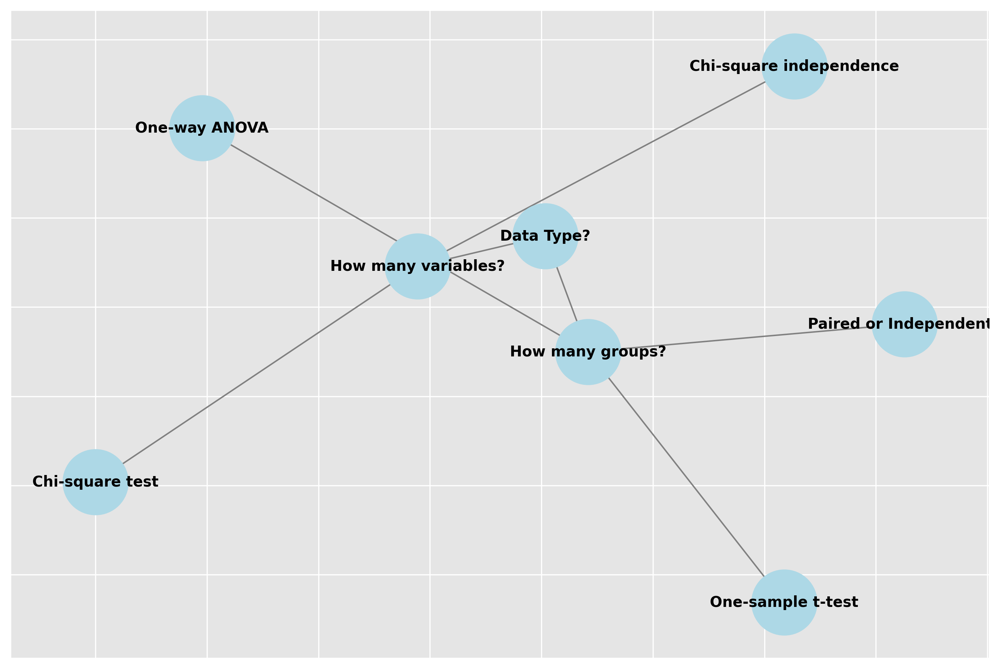

# A/B Testing: Making Data-Driven Decisions 🎯

## Introduction: Why A/B Testing? 🤔

Imagine you're a chef trying to improve a recipe. Instead of guessing what changes might work better, you could serve two versions and see which one customers prefer. That's A/B testing in a nutshell - a scientific way to compare options and make data-driven decisions!

## The Basics: Control vs Treatment 🔄

### What is A/B Testing?

A/B testing (or split testing) is like running a scientific experiment where you:

1. Take two versions of something (A and B)
2. Show them randomly to different groups
3. Measure which performs better

### Common Applications 🌟

- 🌐 Website optimization
- 📧 Email marketing campaigns
- 📱 Mobile app features
- 💰 Pricing strategies
- 🎨 UI/UX design choices

```python
import numpy as np
import pandas as pd
from scipy import stats
import matplotlib.pyplot as plt
import seaborn as sns

class ABTest:
    """
    A comprehensive A/B testing framework
    """
    def __init__(self, control_data, treatment_data, metric_name="conversion"):
        self.control = control_data
        self.treatment = treatment_data
        self.metric_name = metric_name
        
        # Calculate basic statistics
        self.control_stats = self._calculate_stats(control_data)
        self.treatment_stats = self._calculate_stats(treatment_data)
        
    def _calculate_stats(self, data):
        """Calculate key statistics for a group"""
        return {
            'mean': np.mean(data),
            'std': np.std(data),
            'size': len(data),
            'ci': stats.t.interval(
                0.95, 
                len(data)-1,
                loc=np.mean(data),
                scale=stats.sem(data)
            )
        }
    
    def visualize(self):
        """Create comprehensive visualization of results"""
        plt.figure(figsize=(15, 5))
        
        # Distribution comparison
        plt.subplot(131)
        sns.kdeplot(self.control, label='Control (A)', shade=True)
        sns.kdeplot(self.treatment, label='Treatment (B)', shade=True)
        plt.title('Distribution Comparison')
        plt.xlabel(self.metric_name)
        plt.legend()
        
        # Box plot
        plt.subplot(132)
        sns.boxplot(data=[self.control, self.treatment])
        plt.xticks([0, 1], ['Control (A)', 'Treatment (B)'])
        plt.title('Box Plot Comparison')
        
        # Effect size visualization
        plt.subplot(133)
        effect_size = (np.mean(self.treatment) - np.mean(self.control)) / \
                     np.std(self.control)
        plt.bar(['Effect Size'], [effect_size])
        plt.axhline(y=0, color='r', linestyle='--')
        plt.title('Standardized Effect Size')
        
        plt.tight_layout()
        plt.savefig('docs/4-stat-analysis/4.2-hypotheses-testing/assets/ab_test_results.png')
        plt.close()
        
        return self
```

## Setting Up Your A/B Test 🎬

### 1. Sample Size Calculation 📊

Don't start without knowing how many samples you need!

```python
def calculate_sample_size(
    baseline_rate=0.1,    # Current conversion rate
    mde=0.02,            # Minimum detectable effect
    alpha=0.05,          # Significance level
    power=0.8            # Statistical power
):
    """
    Calculate required sample size for A/B test
    
    Parameters:
    -----------
    baseline_rate : float
        Current conversion rate (e.g., 0.10 for 10%)
    mde : float
        Minimum detectable effect (e.g., 0.02 for 2% increase)
    alpha : float
        Significance level (Type I error rate)
    power : float
        Statistical power (1 - Type II error rate)
        
    Returns:
    --------
    dict with required sample sizes and test parameters
    """
    # Standard normal critical values
    z_alpha = stats.norm.ppf(1 - alpha/2)
    z_beta = stats.norm.ppf(power)
    
    # Calculate pooled standard deviation
    p_pooled = baseline_rate + (baseline_rate * mde/2)
    
    # Calculate sample size
    n = np.ceil(
        (2 * p_pooled * (1 - p_pooled) * (z_alpha + z_beta)**2) / mde**2
    )
    
    return {
        'sample_size_per_group': int(n),
        'total_sample_size': int(2 * n),
        'parameters': {
            'baseline_rate': baseline_rate,
            'mde': mde,
            'alpha': alpha,
            'power': power
        }
    }

# Example usage
sample_size_calc = calculate_sample_size(
    baseline_rate=0.10,  # 10% current conversion
    mde=0.02,           # Want to detect 2% improvement
    alpha=0.05,         # 5% significance level
    power=0.8           # 80% power
)
```

### 2. Random Assignment 🎲

Ensure fair comparison with proper randomization:

```python
def assign_to_groups(user_ids, split_ratio=0.5, seed=None):
    """
    Randomly assign users to control and treatment groups
    
    Parameters:
    -----------
    user_ids : array-like
        List of user IDs to assign
    split_ratio : float
        Proportion to assign to treatment (default: 0.5)
    seed : int, optional
        Random seed for reproducibility
    
    Returns:
    --------
    dict with group assignments
    """
    if seed is not None:
        np.random.seed(seed)
    
    # Shuffle user IDs
    user_ids = np.array(user_ids)
    np.random.shuffle(user_ids)
    
    # Split into groups
    split_point = int(len(user_ids) * split_ratio)
    
    assignments = {
        'control': user_ids[:split_point],
        'treatment': user_ids[split_point:]
    }
    
    # Verify split
    print(f"Control group size: {len(assignments['control'])}")
    print(f"Treatment group size: {len(assignments['treatment'])}")
    print(f"Actual split ratio: {len(assignments['treatment'])/len(user_ids):.2%}")
    
    return assignments
```

## Running Your Test 🏃‍♂️

### 1. Data Collection 📝

Track everything systematically:

```python
class ABTestDataCollector:
    def __init__(self):
        self.data = []
        self.start_time = pd.Timestamp.now()
        
    def record_observation(self, user_id, group, metric_value, metadata=None):
        """Record a single observation"""
        observation = {
            'user_id': user_id,
            'group': group,
            'value': metric_value,
            'timestamp': pd.Timestamp.now(),
            'days_in_test': (pd.Timestamp.now() - self.start_time).days
        }
        
        if metadata:
            observation.update(metadata)
            
        self.data.append(observation)
    
    def get_results(self):
        """Get current test results"""
        df = pd.DataFrame(self.data)
        
        # Calculate key metrics by group
        results = df.groupby('group').agg({
            'value': ['count', 'mean', 'std'],
            'user_id': 'nunique'
        })
        
        return results
```

### 2. Monitoring 📊

Watch your test without peeking too much:

```python
def monitor_test(data_collector, min_sample_size):
    """
    Monitor ongoing A/B test
    
    Parameters:
    -----------
    data_collector : ABTestDataCollector
        Object containing test data
    min_sample_size : int
        Minimum required sample size
        
    Returns:
    --------
    dict with monitoring metrics
    """
    results = data_collector.get_results()
    
    # Check if we've reached minimum sample size
    current_size = results.loc[:, ('value', 'count')].min()
    size_reached = current_size >= min_sample_size
    
    # Calculate current p-value
    control_data = [x['value'] for x in data_collector.data 
                   if x['group'] == 'control']
    treatment_data = [x['value'] for x in data_collector.data 
                     if x['group'] == 'treatment']
    
    _, p_value = stats.ttest_ind(treatment_data, control_data)
    
    return {
        'current_size': current_size,
        'target_size': min_sample_size,
        'size_reached': size_reached,
        'p_value': p_value,
        'can_conclude': size_reached and p_value < 0.05
    }
```

## Analysis and Decision Making 📈

### 1. Statistical Analysis

Don't just look at the numbers - understand them:

```python
def analyze_results(control_data, treatment_data, alpha=0.05):
    """
    Comprehensive A/B test analysis
    
    Returns:
    --------
    dict with test results and recommendations
    """
    # Basic statistics
    control_mean = np.mean(control_data)
    treatment_mean = np.mean(treatment_data)
    
    # Effect size (relative change)
    relative_change = (treatment_mean - control_mean) / control_mean
    
    # Statistical test
    t_stat, p_value = stats.ttest_ind(treatment_data, control_data)
    
    # Confidence interval for difference
    ci = stats.t.interval(
        1 - alpha,
        len(control_data) + len(treatment_data) - 2,
        loc=treatment_mean - control_mean,
        scale=np.sqrt(np.var(treatment_data)/len(treatment_data) + 
                     np.var(control_data)/len(control_data))
    )
    
    return {
        'metrics': {
            'control_mean': control_mean,
            'treatment_mean': treatment_mean,
            'relative_change': relative_change,
            'absolute_change': treatment_mean - control_mean
        },
        'statistical_tests': {
            't_statistic': t_stat,
            'p_value': p_value,
            'confidence_interval': ci
        },
        'recommendation': 'accept' if p_value < alpha and relative_change > 0 
                         else 'reject'
    }
```

## Common Pitfalls and Solutions ⚠️

### 1. Peeking Problem 👀

Don't keep checking results - it increases false positives!

```python
def adjust_for_peeking(p_values, total_looks):
    """Adjust significance level for multiple looks at the data"""
    from statsmodels.stats.multitest import multipletests
    
    # Use Bonferroni correction
    alpha_per_peek = 0.05 / total_looks
    
    # Adjust p-values
    rejected, adjusted_p_values, _, _ = multipletests(
        p_values, 
        alpha=alpha_per_peek, 
        method='bonferroni'
    )
    
    return {
        'original_p_values': p_values,
        'adjusted_p_values': adjusted_p_values,
        'significant': rejected
    }
```

### 2. Sample Ratio Mismatch 🔄

Check if your randomization is working:

```python
def check_sample_ratio(control_size, treatment_size, expected_ratio=0.5):
    """
    Check if sample ratio matches expected split
    
    Returns:
    --------
    dict with ratio analysis results
    """
    total = control_size + treatment_size
    actual_ratio = treatment_size / total
    
    # Chi-square test for ratio
    expected = [total * (1-expected_ratio), total * expected_ratio]
    observed = [control_size, treatment_size]
    
    _, p_value = stats.chisquare(observed, expected)
    
    return {
        'expected_ratio': expected_ratio,
        'actual_ratio': actual_ratio,
        'p_value': p_value,
        'is_valid': p_value > 0.05,
        'recommendation': 'valid split' if p_value > 0.05 else 'investigate split'
    }
```

## Best Practices for Success 🌟

### 1. Pre-register Your Test 📝

Document everything before starting:

```python
class ABTestRegistry:
    def __init__(self):
        self.tests = {}
        
    def register_test(
        self,
        test_id,
        hypothesis,
        metrics,
        sample_size,
        start_date=None
    ):
        """Register a new A/B test"""
        self.tests[test_id] = {
            'hypothesis': hypothesis,
            'metrics': metrics,
            'sample_size': sample_size,
            'start_date': start_date or pd.Timestamp.now(),
            'status': 'registered'
        }
        
    def update_status(self, test_id, status):
        """Update test status"""
        valid_statuses = ['registered', 'running', 'completed', 'stopped']
        if status not in valid_statuses:
            raise ValueError(f"Status must be one of: {valid_statuses}")
        
        self.tests[test_id]['status'] = status
```

### 2. Calculate Business Impact 💰

Translate statistics into business metrics:

```python
def calculate_business_impact(
    control_data,
    treatment_data,
    revenue_per_conversion=10,
    cost_per_user=0.1
):
    """
    Calculate business impact of test results
    
    Returns:
    --------
    dict with business metrics
    """
    # Calculate conversion rates
    conv_rate_control = np.mean(control_data > 0)
    conv_rate_treatment = np.mean(treatment_data > 0)
    
    # Calculate revenue
    revenue_control = conv_rate_control * revenue_per_conversion
    revenue_treatment = conv_rate_treatment * revenue_per_conversion
    
    # Calculate ROI
    roi_control = (revenue_control - cost_per_user) / cost_per_user
    roi_treatment = (revenue_treatment - cost_per_user) / cost_per_user
    
    return {
        'conversion_lift': conv_rate_treatment - conv_rate_control,
        'revenue_lift': revenue_treatment - revenue_control,
        'roi_lift': roi_treatment - roi_control
    }
```

## Practice Questions 🤔

1. A website has 10% conversion rate. How many visitors do you need to detect a 2% improvement?
2. Your A/B test shows statistical significance but tiny effect size. What should you do?
3. How would you handle seasonality in your A/B test?
4. What metrics would you track for an e-commerce website redesign?
5. How would you communicate A/B test results to non-technical stakeholders?

## Key Takeaways 🎯

1. 📊 Plan your test thoroughly before starting
2. 🎲 Ensure proper randomization
3. 📈 Wait for sufficient sample size
4. ⚠️ Be aware of common pitfalls
5. 💰 Consider business impact, not just statistics

## Additional Resources 📚

- [A/B Testing Guide](https://www.optimizely.com/optimization-glossary/ab-testing/)
- [Sample Size Calculator](https://www.evanmiller.org/ab-testing/sample-size.html)
- [Statistical Significance Calculator](https://www.abtasty.com/ab-test-significance-calculator/)

Remember: A well-designed A/B test is your compass for data-driven decisions! 🧭

## Recommended Visualizations

To enhance understanding of A/B testing concepts, we recommend adding the following visualizations:

1. **A/B Testing Process Flowchart**
   - Step-by-step guide to running an A/B test
   - Show relationship between planning, execution, and analysis
   - Include decision points and checkpoints

2. **Sample Size Calculator Interface**
   - Interactive tool showing relationship between:
     - Baseline conversion rate
     - Minimum detectable effect
     - Statistical power
     - Required sample size
   - Include visual feedback on trade-offs

3. **Test Results Dashboard**
   - Real-time monitoring of key metrics
   - Show confidence intervals
   - Include statistical significance indicators
   - Display cumulative results over time

4. **Distribution Comparison**
   - Side-by-side comparison of control and treatment distributions
   - Show overlap and differences
   - Include effect size visualization
   - Demonstrate practical significance

5. **Segmentation Analysis**
   - Break down results by user segments
   - Show interaction effects
   - Include confidence intervals
   - Highlight significant differences

## Common Mistakes to Avoid

1. **Insufficient Sample Size**
   - Always calculate required sample size before starting
   - Consider power analysis
   - Account for potential dropouts

2. **Poor Randomization**
   - Ensure true random assignment
   - Document randomization procedure
   - Check for balance after assignment

3. **Multiple Testing Without Correction**
   - Plan all comparisons in advance
   - Use appropriate correction methods
   - Report adjusted p-values

4. **Stopping Tests Too Early**
   - Define stopping rules before starting
   - Consider interim analyses
   - Document all decisions

5. **Ignoring Practical Significance**
   - Consider effect sizes
   - Think about real-world impact
   - Balance statistical and practical significance

## Best Practices

1. **Planning Phase**
   - Define clear objectives
   - Calculate required sample size
   - Control for confounders
   - Document methodology

2. **Execution Phase**
   - Randomize properly
   - Monitor data quality
   - Track all variables
   - Maintain consistency

3. **Analysis Phase**
   - Check assumptions
   - Use appropriate tests
   - Calculate effect sizes
   - Consider practical significance

4. **Reporting Phase**
   - Be transparent
   - Include visualizations
   - Acknowledge limitations
   - Make actionable recommendations

## Additional Resources

1. **Books**
   - "Trustworthy Online Controlled Experiments" by Kohavi
   - "A/B Testing: The Most Powerful Way to Turn Clicks Into Customers" by Siroker
   - "Experimentation Works" by Thomke

2. **Online Tools**
   - [A/B Testing Calculator](https://www.evanmiller.org/ab-testing/)
   - [Sample Size Calculator](https://www.stat.ubc.ca/~rollin/stats/ssize/)
   - [Power Analysis Tool](https://www.statmethods.net/stats/power.html)

3. **Software Packages**
   - Python: statsmodels, scipy
   - R: pwr, Experiment
   - Commercial: Optimizely, Google Optimize

Remember: A/B testing is a powerful tool for making data-driven decisions. Take the time to plan carefully, and your results will be much more reliable!

## The A/B Testing Process

Follow this timeline for successful A/B tests:


## Planning Your Test

### 1. Define Your Hypothesis

Start with a clear, testable hypothesis:


### 2. Choose Your Metrics

Select metrics that are:

- Relevant to your goals
- Measurable
- Sensitive to changes

### 3. Calculate Sample Size

Determine how many samples you need:


## Implementation

### Setting Up Groups

```python
import numpy as np

def assign_groups(user_ids, split_ratio=0.5):
    """Randomly assign users to control and treatment groups"""
    n_users = len(user_ids)
    n_treatment = int(n_users * split_ratio)
    
    # Randomly shuffle user IDs
    shuffled_ids = np.random.permutation(user_ids)
    
    return {
        'control': shuffled_ids[n_treatment:],
        'treatment': shuffled_ids[:n_treatment]
    }
```

### Data Collection

```python
class DataCollector:
    def __init__(self):
        self.observations = []
    
    def record(self, user_id, group, metric, value):
        """Record an observation"""
        self.observations.append({
            'user_id': user_id,
            'group': group,
            'metric': metric,
            'value': value,
            'timestamp': pd.Timestamp.now()
        })
    
    def get_data(self):
        """Get collected data as a DataFrame"""
        return pd.DataFrame(self.observations)
```

## Analysis

### Statistical Tests

Choose the right test for your data:


### Effect Size

Understand the magnitude of differences:


### Confidence Intervals

Interpret your results with confidence:


## Common Pitfalls to Avoid

1. Insufficient sample size
2. Multiple testing without correction
3. Stopping tests too early
4. Ignoring external factors
5. Selection bias

## Best Practices

### Planning

1. Define clear success metrics
2. Calculate required sample size
3. Document hypothesis and methodology
4. Plan for adequate test duration

### Implementation

1. Use proper randomization
2. Monitor data quality
3. Track external factors
4. Document any issues

### Analysis

1. Check statistical assumptions
2. Consider practical significance
3. Look at effect sizes
4. Use confidence intervals

### Reporting

1. Document methodology
2. Report all results
3. Include limitations
4. Make clear recommendations

## Additional Resources

1. Books:
   - "Trustworthy Online Controlled Experiments" by Ron Kohavi
   - "A/B Testing" by Dan Siroker

2. Online Tools:
   - Sample Size Calculator
   - A/B Test Duration Calculator
   - Statistical Significance Calculator

3. Software:
   - Python's scipy for statistics
   - R's experimentation packages
   - Specialized A/B testing platforms
