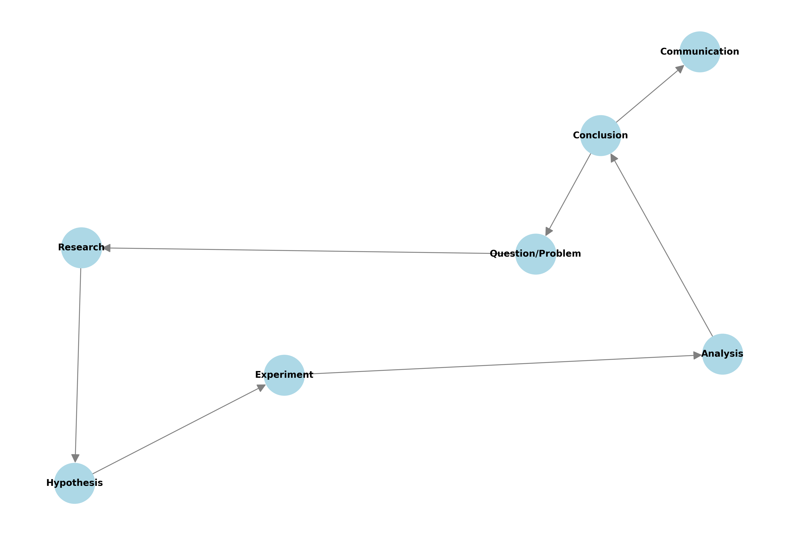
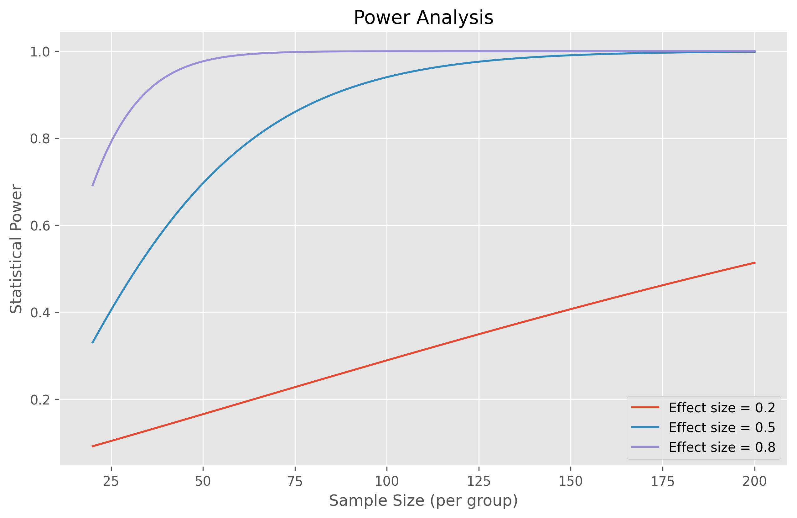
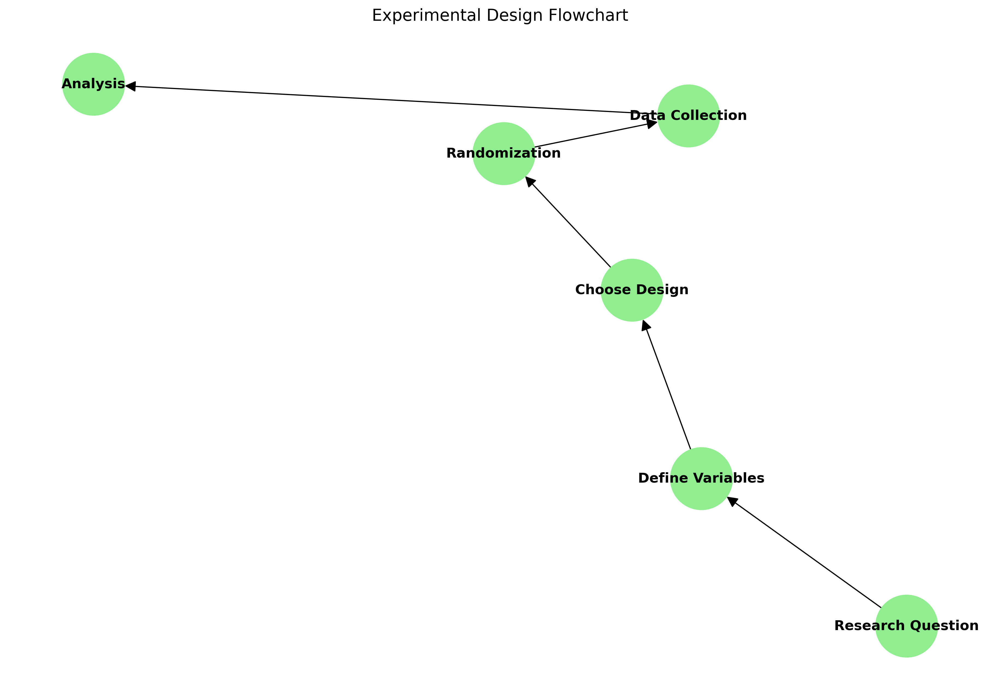
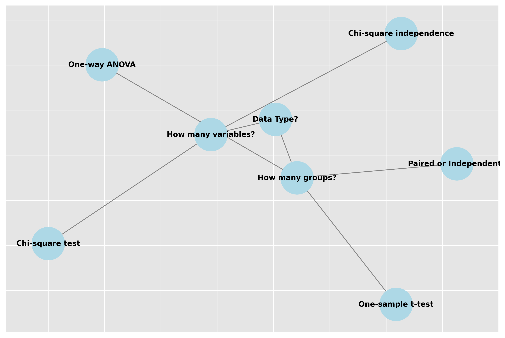
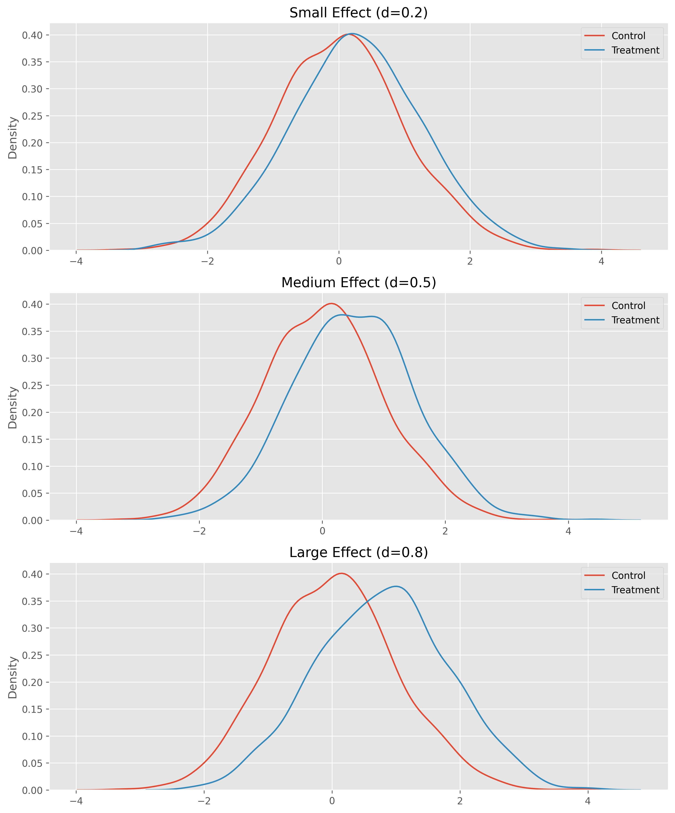
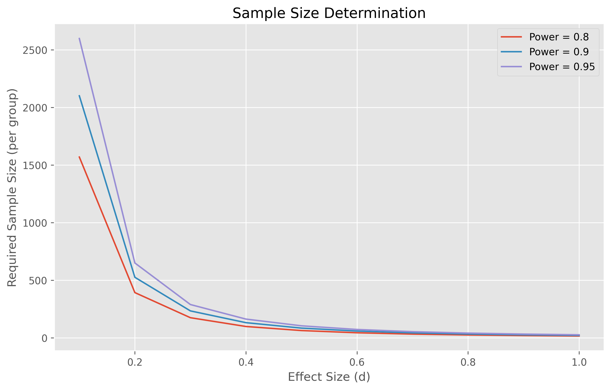

# Experimental Design: Building a Strong Foundation

## Introduction

**What is Experimental Design?**

Imagine you're baking a cake. You need a recipe, the right ingredients, and a plan for how to mix and bake everything. Experimental design is like a recipe for scientific discovery: it's a plan that helps you test ideas in a way that gives you reliable answers. If you skip steps or mix things up, your results might not turn out right!

This guide will help you understand the basics of experimental design, with simple explanations, real-world examples, and easy-to-follow code. Whether you're new to experiments or just want a refresher, you'll find practical tips and best practices here.



---

## The Three Pillars of Experimental Design

### 1. Control

**In simple terms:** Control means making sure you're only testing what you want to test. If you want to know if a new fertilizer helps plants grow, you need to make sure that sunlight, water, and soil are the same for all plants. That way, any difference in growth is likely due to the fertilizer, not something else.

- **Control groups**: A group that doesn't get the treatment. This is your baseline for comparison.
- **Controlled variables**: Things you keep the same for everyone (like water, sunlight, etc.).
- **Randomization**: Mixing things up so there's no hidden bias.

> **Real-world example:**
> In a clinical trial, the control group gets a sugar pill (placebo), while the treatment group gets the real medicine. If the treatment group gets better and the control group doesn't, you have evidence the medicine works.

**Key Takeaway:**
> Always compare your treatment to something! Without a control, you can't tell if your treatment really works.

**Common Question:**
> *Why do I need a control group?*  
> Without a control, you can't be sure your results are due to your treatment and not something else.

### 2. Randomization

**In simple terms:** Randomization means assigning people or things to groups by chance, like flipping a coin. This helps make sure the groups are similar and that your results aren't biased by something you didn't notice.

**Why randomize?**

- Prevents selection bias (accidentally putting all the healthiest people in one group)
- Balances out unknown factors
- Makes your results more trustworthy

**Python Example: Randomly Assigning Groups**

Suppose you have 10 participants and want to assign them to two groups at random:

```python
# Self-contained example: Randomly assign 10 participants to two groups
import numpy as np

participants = [f'P{i+1}' for i in range(10)]  # Create participant IDs
np.random.seed(42)  # For reproducibility
# Shuffle and split evenly for equal group sizes
shuffled = np.random.permutation(participants)
group_size = len(participants) // 2
control_group = shuffled[:group_size]
treatment_group = shuffled[group_size:]
print("Control group:", control_group)
print("Treatment group:", treatment_group)
```

**What to look for:**

- Each participant is randomly assigned to a group.
- The split may not be exactly even, but over many experiments, it will average out.

> **Best Practice:**
> Always set a random seed when sharing code for reproducibility.

**Try it yourself:**

- How would you ensure an equal number of participants in each group? (Hint: Use `np.random.permutation` and split the list in half.)

**Key Takeaway:**
> Randomization helps make your groups fair and your results believable.

**Common Question:**
> *What if my groups aren't exactly equal in size?*  
> That's okay for most experiments, but if you need equal groups, use a method that splits them evenly.

### 3. Replication

**In simple terms:** Replication means repeating your experiment or having enough samples so you can trust your results. If you only test something once, you might get a fluke result. More trials = more confidence.

- **Multiple trials**: Do the experiment several times.
- **Sample size calculations**: Figure out how many samples you need to be sure of your results.



> **Reflect:**
> Why is it risky to draw conclusions from a single experiment? (Because you might just be seeing a coincidence!)

**Key Takeaway:**
> The more you repeat your experiment, the more confident you can be in your results.

**Common Question:**
> *How many times should I repeat my experiment?*  
> It depends, but more is usually better. Use a sample size calculator if you can.

---

## Types of Experimental Designs

Experimental design is about how you assign treatments to units (like people, plants, or objects). Here are two common designs:

### 1. Completely Randomized Design (CRD)

**In simple terms:** Every unit has an equal chance of getting any treatment. Use this when your units are all similar.

**Real-world example:**
Suppose you're testing two fertilizers (A and B) on 20 identical plants. You want to assign each plant to a fertilizer at random.

```python
# Self-contained example: Completely Randomized Design (CRD)
import numpy as np

def completely_randomized_design(treatments, units):
    """
    Randomly assign treatments to experimental units.
    treatments: list of treatment labels (e.g., ['A', 'B'])
    units: list of unit identifiers (e.g., plant IDs)
    Returns a dict mapping unit to assigned treatment.
    """
    np.random.seed(42)
    assignments = np.random.choice(treatments, size=len(units))
    return dict(zip(units, assignments))

# Example usage:
units = [f'Plant_{i+1}' for i in range(20)]
treatments = ['A', 'B']
assignment = completely_randomized_design(treatments, units)
print("Assignments:")
for unit, treatment in assignment.items():
    print(f"{unit}: {treatment}")
```

**What to look for:**

- Each plant is randomly assigned to either fertilizer A or B.
- This helps ensure that any observed differences in plant growth are due to the fertilizer, not to pre-existing differences between plants.

> **Best Practice:**
> Use a random seed for reproducibility.

**Try it yourself:**

- How would you modify the code if you had three fertilizers instead of two?

**Key Takeaway:**
> Random assignment helps make sure your results are fair and not due to chance.

**Common Question:**
> *What if my plants aren't all the same?*  
> If your units are different in some way, consider using a block design (see below).

### 2. Randomized Block Design (RBD)

**In simple terms:** If your units can be grouped by something they have in common (like sunny vs. shady spots), assign treatments randomly within each group (block). This helps control for known differences.

**Real-world example:**
Suppose you're testing two fertilizers on plants, but your garden has sunny and shady areas. You want to make sure both fertilizers are tested in both conditions.

```python
# Self-contained example: Randomized Block Design (RBD)
import numpy as np

def randomized_block_design(treatments, blocks):
    """
    Assign treatments within each block.
    treatments: list of treatments (e.g., ['A', 'B'])
    blocks: dict mapping block name to list of unit IDs
    Returns a dict mapping unit to assigned treatment.
    """
    np.random.seed(42)
    assignments = {}
    for block, units in blocks.items():
        # Repeat treatments to match block size, then shuffle
        reps = len(units) // len(treatments)
        block_treatments = (treatments * reps)[:len(units)]
        block_assignments = np.random.permutation(block_treatments)
        assignments.update(dict(zip(units, block_assignments)))
    return assignments

# Example usage:
blocks = {
    'Sunny': [f'Sunny_{i+1}' for i in range(6)],
    'Shady': [f'Shady_{i+1}' for i in range(6)]
}
treatments = ['A', 'B']
assignment = randomized_block_design(treatments, blocks)
print("Assignments:")
for unit, treatment in assignment.items():
    print(f"{unit}: {treatment}")
```

**What to look for:**

- Each block (e.g., sunny or shady) gets a random mix of treatments.
- This controls for the effect of sunlight on plant growth.

> **Common Pitfall:**
> Forgetting to block for important sources of variation can lead to misleading results.

**Try it yourself:**

- How would you handle blocks of different sizes?

**Key Takeaway:**
> Block designs help you control for known differences between groups.

**Common Question:**
> *What if I don't know what to block for?*  
> Block for things you think might affect your results. If you're not sure, start simple and learn as you go.



---

## Statistical Considerations

Choosing the right statistical test for your design is crucial. The test you use depends on your data type, number of groups, and design.



> **Tip:**
> Always check the assumptions of your chosen test (e.g., normality, equal variances).

**Key Takeaway:**
> The right test helps you make sense of your data. Don't just pick one at random—match it to your question and data type.

**Common Question:**
> *How do I know which test to use?*  
> Use a decision tree or guide (like the one above) to help you choose.

---

## Effect Size and Power

**In simple terms:**

- **Effect size** tells you how big the difference is between groups.
- **Power** tells you how likely you are to detect a real effect if there is one.

If your sample is too small, you might miss real effects. If it's too large, you might waste resources.



### Sample Size Determination

The required sample size for comparing two means can be calculated as:

\[
n = 2 \left( \frac{z_{\alpha/2} + z_{\beta}}{d} \right)^2
\]

where:

- \( z_{\alpha/2} \): critical value for significance level
- \( z_{\beta} \): critical value for desired power
- \( d \): effect size (Cohen's d)



> **Best Practice:**
> Use a power analysis tool (like G*Power or Python's `statsmodels`) to calculate sample size before you start collecting data.

**Reflect:**

- What happens if you run an experiment with too few samples? (You might not be able to detect real effects.)

**Key Takeaway:**
> Plan your sample size before you start. It saves time and makes your results stronger.

**Common Question:**
> *What is a "power analysis"?*  
> It's a way to figure out how many samples you need to detect an effect of a certain size.

---

## Common Mistakes to Avoid

1. **Insufficient sample size** – leads to low power and inconclusive results.
2. **Poor randomization** – introduces bias.
3. **Inadequate controls** – makes it hard to attribute effects to your treatment.
4. **Confounding variables** – can mask or mimic treatment effects.
5. **Measurement bias** – inaccurate or inconsistent measurements can ruin your study.

**Key Takeaway:**
> Avoid these mistakes to make your experiments more reliable and trustworthy.

**Common Question:**
> *What is a confounding variable?*  
> It's something other than your treatment that could affect your results.

---

## Best Practices

### Planning Phase

1. Define clear objectives
2. Calculate required sample size
3. Identify potential confounders
4. Plan data collection methods

### Implementation Phase

1. Follow randomization protocols
2. Maintain consistent conditions
3. Document everything
4. Monitor for issues

### Analysis Phase

1. Check assumptions
2. Use appropriate tests
3. Consider effect sizes
4. Account for multiple testing

### Reporting Phase

1. Be transparent about methods
2. Report all relevant statistics
3. Acknowledge limitations
4. Share raw data when possible

---

## Additional Resources

1. Books:
   - "Design of Experiments" by R.A. Fisher
   - "Experimental Design for Biologists" by David J. Glass

2. Online Tools:
   - G*Power for sample size calculations
   - R's experimental design packages
   - Python's statsmodels library

3. Software:
   - SAS JMP for design of experiments
   - Minitab for industrial experiments
   - Python's scipy for statistical analysis

---

## Glossary (Beginner-Friendly)

- **Control group:** The group that does not get the treatment; used for comparison.
- **Treatment group:** The group that gets the treatment you're testing.
- **Randomization:** Assigning people or things to groups by chance.
- **Replication:** Repeating the experiment or having enough samples.
- **Block:** A group of similar units (like all plants in the sun).
- **Confounding variable:** Something other than your treatment that could affect your results.
- **Effect size:** A measure of how big the difference is between groups.
- **Power:** The chance you'll detect a real effect if there is one.
- **Sample size:** The number of units (people, plants, etc.) in your experiment.
- **Bias:** Anything that unfairly influences your results.
- **Assumptions:** Conditions that must be true for your statistical test to work properly.

---

**Remember:**
> Experimental design is about planning ahead, being fair, and making sure your results are trustworthy. Start simple, ask questions, and don't be afraid to learn as you go!
