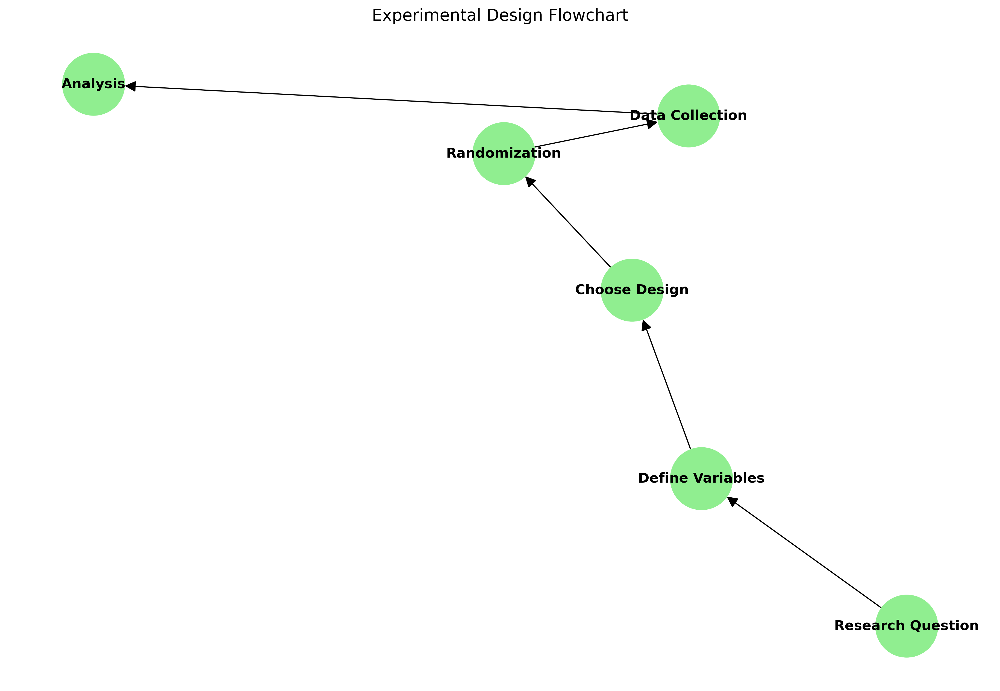
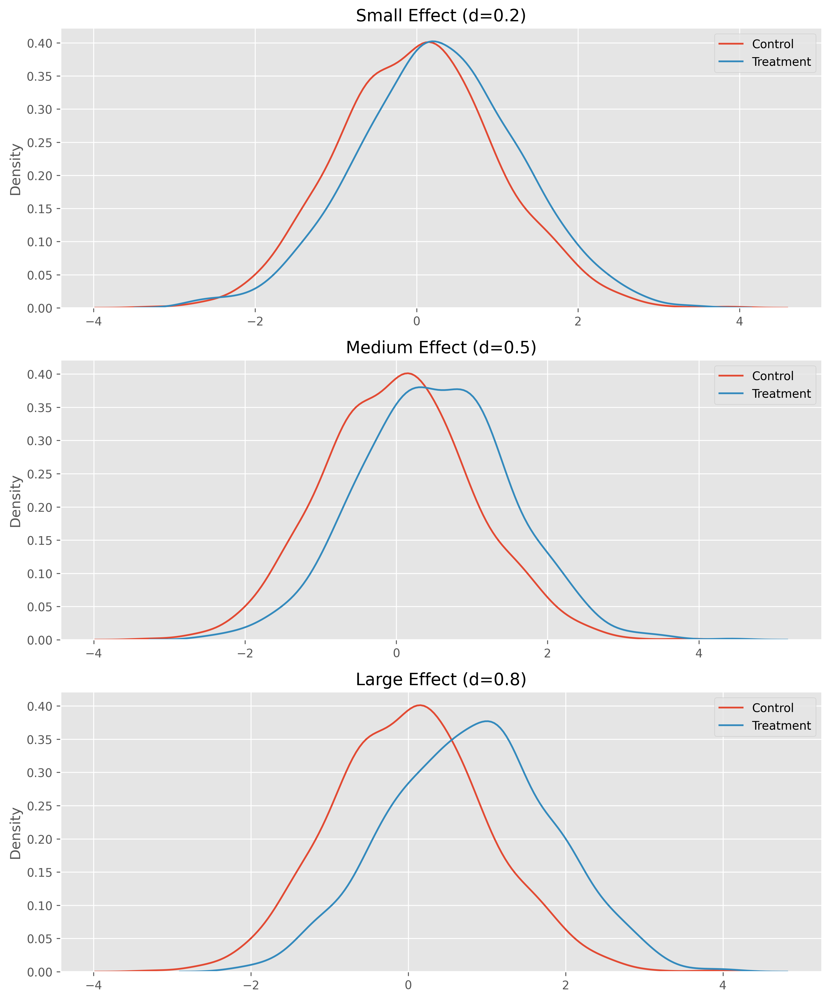
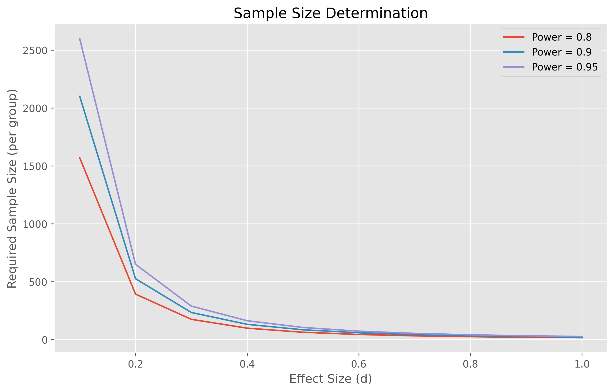

# Experimental Design: Building a Strong Foundation

**After this lesson:** you can explain the core ideas in “Experimental Design: Building a Strong Foundation” and reproduce the examples here in your own notebook or environment.

## Overview

No p-value rescues a study that measured the wrong thing or mixed treatments with hidden causes. Experimental design is the plan: **what** you manipulate, **who** gets which condition, **what** you hold fixed, and **how** you will know you had enough data. This lesson comes first in submodule 4.2 so later files on hypotheses, tests, and A/B metrics sit on solid ground.

## Why this matters

- Strong **design** determines whether statistics can answer the question you care about.
- You will control bias, confounding, and power before you run a test or open a report.

## Prerequisites

- [Inferential statistics (module 4.1)](../4.1-inferential-stats/README.md), especially [sampling distributions](../4.1-inferential-stats/sampling-distributions.md) and [confidence intervals](../4.1-inferential-stats/confidence-intervals.md).

> **Note:** This is the first lesson in [Hypothesis testing (4.2)](./README.md).

## Introduction

**What is Experimental Design?**

Imagine you're baking a cake. You need a recipe, the right ingredients, and a plan for how to mix and bake everything. Experimental design is like a recipe for scientific discovery: it's a plan that helps you test ideas in a way that gives you reliable answers. If you skip steps or mix things up, your results might not turn out right!

### Video Tutorial: Experimental Design

<div class="video-embed">
<iframe width="560" height="315" src="https://www.youtube.com/embed/0oc49DyA3hU" frameborder="0" allow="accelerometer; autoplay; clipboard-write; encrypted-media; gyroscope; picture-in-picture" allowfullscreen></iframe>
</div>

*StatQuest: Hypothesis Testing and The Null Hypothesis, Clearly Explained!!! by Josh Starmer*

This guide will help you understand the basics of experimental design, with simple explanations, real-world examples, and easy-to-follow code. Whether you're new to experiments or just want a refresher, you'll find practical tips and best practices here.



## The Three Pillars of Experimental Design

### 1. Control

**In simple terms:** Control means making sure you're only testing what you want to test. If you want to know if a new fertilizer helps plants grow, you need to make sure that sunlight, water, and soil are the same for all plants. That way, any difference in growth is likely due to the fertilizer, not something else.

- **Control groups**: A group that doesn't get the treatment. This is your baseline for comparison.
- **Controlled variables**: Things you keep the same for everyone (like water, sunlight, etc.).
- **Randomization**: Mixing things up so there's no hidden bias.

> **Real-world example:**
> In a clinical trial, the control group gets a sugar pill (placebo), while the treatment group gets the real medicine. If the treatment group gets better and the control group doesn't, you have evidence the medicine works.

### 2. Randomization

**In simple terms:** Randomization means assigning people or things to groups by chance, like flipping a coin. This helps make sure the groups are similar and that your results aren't biased by something you didn't notice.

**Why randomize?**

- Prevents selection bias (accidentally putting all the healthiest people in one group)
- Balances out unknown factors
- Makes your results more trustworthy

**Python Example: Randomly Assigning Groups**

Suppose you have 10 participants and want to assign them to two groups at random:

**Random split into two arms**

<div class="code-explainer" data-code-explainer>
<div class="code-explainer__code">


# Example: Randomly assign 10 participants to two groups
import numpy as np

participants = [f'P{i+1}' for i in range(10)]  # Create participant IDs
np.random.seed(42)  # For reproducibility
# Shuffle and split evenly for equal group sizes
shuffled = np.random.permutation(participants)
group_size = len(participants) // 2
control_group = shuffled[:group_size]
treatment_group = shuffled[group_size:]
print("Control group:", control_group)
print("Treatment group:", treatment_group)

</div>
<aside class="code-explainer__callouts" aria-label="Code walkthrough">
  <div class="code-callout" data-lines="1-6" data-tint="1">
    <div class="code-callout__meta">
      <span class="code-callout__lines"></span>
      <span class="code-callout__title">Participant list</span>
    </div>
    <div class="code-callout__body">
      <p>Build 10 participant IDs and set a random seed so the split is reproducible across runs and course materials.</p>
    </div>
  </div>
  <div class="code-callout" data-lines="7-10" data-tint="2">
    <div class="code-callout__meta">
      <span class="code-callout__lines"></span>
      <span class="code-callout__title">Permute and slice</span>
    </div>
    <div class="code-callout__body">
      <p>Shuffle all IDs with <code>np.random.permutation</code> and split at the midpoint to assign each participant to exactly one group.</p>
    </div>
  </div>
</aside>
</div>

```
Control group: ['P9' 'P2' 'P6' 'P1' 'P8']
Treatment group: ['P3' 'P10' 'P5' 'P4' 'P7']
```

**What to look for:**

- Each participant is randomly assigned to a group.
- The split may not be exactly even, but over many experiments, it will average out.

> **Best Practice:**
> Always set a random seed when sharing code for reproducibility.

**Try it yourself:**

- How would you ensure an equal number of participants in each group? (Hint: Use `np.random.permutation` and split the list in half.)

### 3. Replication

**In simple terms:** Replication means repeating your experiment or having enough samples so you can trust your results. If you only test something once, you might get a fluke result. More trials = more confidence.

- **Multiple trials**: Do the experiment several times.
- **Sample size calculations**: Figure out how many samples you need to be sure of your results.

---

## Types of Experimental Designs

Experimental design is about how you assign treatments to units (like people, plants, or objects). Here are two common designs:

### 1. Completely Randomized Design (CRD)

**In simple terms:** Every unit has an equal chance of getting any treatment. Use this when your units are all similar.

**Real-world example:**
Suppose you're testing two fertilizers (A and B) on 20 identical plants. You want to assign each plant to a fertilizer at random.

**Completely randomized assignment map**

<div class="code-explainer" data-code-explainer>
<div class="code-explainer__code">


# Example: Completely Randomized Design (CRD)
import numpy as np

def completely_randomized_design(treatments, units):
    """
    Randomly assign treatments to experimental units.
    treatments: list of treatment labels (e.g., ['A', 'B'])
    units: list of unit identifiers (e.g., plant IDs)
    Returns a dict mapping unit to assigned treatment.
    """
    np.random.seed(42)
    assignments = np.random.choice(treatments, size=len(units))
    return dict(zip(units, assignments))

# Example usage:
units = [f'Plant_{i+1}' for i in range(6)]
treatments = ['A', 'B']
assignment = completely_randomized_design(treatments, units)
print("Assignments:")
for unit, treatment in assignment.items():
    print(f"{unit}: {treatment}")

</div>
<aside class="code-explainer__callouts" aria-label="Code walkthrough">
  <div class="code-callout" data-lines="4-13" data-tint="1">
    <div class="code-callout__meta">
      <span class="code-callout__lines"></span>
      <span class="code-callout__title">CRD function</span>
    </div>
    <div class="code-callout__body">
      <p>Use <code>np.random.choice</code> to draw an independent treatment label for each unit—the simplest CRD, appropriate when units are exchangeable.</p>
    </div>
  </div>
  <div class="code-callout" data-lines="15-20" data-tint="2">
    <div class="code-callout__meta">
      <span class="code-callout__lines"></span>
      <span class="code-callout__title">Build and inspect</span>
    </div>
    <div class="code-callout__body">
      <p>Create 6 plant IDs, call the function, and print the resulting unit-to-treatment dict to verify each plant gets exactly one label.</p>
    </div>
  </div>
</aside>
</div>

```
Assignments:
Plant_1: A
Plant_2: B
Plant_3: A
Plant_4: A
Plant_5: A
Plant_6: B
```

**What to look for:**

- Each plant is randomly assigned to either fertilizer A or B.
- This helps ensure that any observed differences in plant growth are due to the fertilizer, not to pre-existing differences between plants.

> **Best Practice:**
> Use a random seed for reproducibility.

**Try it yourself:**

- How would you modify the code if you had three fertilizers instead of two?

### 2. Randomized Block Design (RBD)

**In simple terms:** If your units can be grouped by something they have in common (like sunny vs. shady spots), assign treatments randomly within each group (block). This helps control for known differences.

**Real-world example:**
Suppose you're testing two fertilizers on plants, but your garden has sunny and shady areas. You want to make sure both fertilizers are tested in both conditions.

**Randomized block: permute treatments within each block**

<div class="code-explainer" data-code-explainer>
<div class="code-explainer__code">


# Example: Randomized Block Design (RBD)
import numpy as np

def randomized_block_design(treatments, blocks):
    """
    Assign treatments within each block.
    treatments: list of treatments (e.g., ['A', 'B'])
    blocks: dict mapping block name to list of unit IDs
    Returns a dict mapping unit to assigned treatment.
    """
    np.random.seed(42)
    assignments = {}
    for block, units in blocks.items():
        reps = len(units) // len(treatments)
        block_treatments = (treatments * reps)[:len(units)]
        block_assignments = np.random.permutation(block_treatments)
        assignments.update(dict(zip(units, block_assignments)))
    return assignments

# Example usage:
blocks = {
    'Sunny': [f'Sunny_{i+1}' for i in range(4)],
    'Shady': [f'Shady_{i+1}' for i in range(4)]
}
treatments = ['A', 'B']
assignment = randomized_block_design(treatments, blocks)
print("Assignments:")
for unit, treatment in assignment.items():
    print(f"{unit}: {treatment}")

</div>
<aside class="code-explainer__callouts" aria-label="Code walkthrough">
  <div class="code-callout" data-lines="4-18" data-tint="1">
    <div class="code-callout__meta">
      <span class="code-callout__lines"></span>
      <span class="code-callout__title">Block-wise randomization</span>
    </div>
    <div class="code-callout__body">
      <p>For each block, repeat the treatment list to cover all units in that block, then <code>np.random.permutation</code> randomizes order within the block before zipping to unit IDs.</p>
    </div>
  </div>
  <div class="code-callout" data-lines="20-29" data-tint="2">
    <div class="code-callout__meta">
      <span class="code-callout__lines"></span>
      <span class="code-callout__title">Two-block example</span>
    </div>
    <div class="code-callout__body">
      <p>Create Sunny and Shady blocks of 4 plants each, run the function, and print assignments to confirm each block gets a balanced mix of treatments A and B.</p>
    </div>
  </div>
</aside>
</div>

```
Assignments:
Sunny_1: B
Sunny_2: B
Sunny_3: A
Sunny_4: A
Shady_1: B
Shady_2: B
Shady_3: A
Shady_4: A
```

**What to look for:**

- Each block (e.g., sunny or shady) gets a random mix of treatments.
- This controls for the effect of sunlight on plant growth.

> **Common Pitfall:**
> Forgetting to block for important sources of variation can lead to misleading results.

**Try it yourself:**

- How would you handle blocks of different sizes?



---

## Statistical Considerations

Choosing the right statistical test for your design is crucial. The test you use depends on your data type, number of groups, and design — see [Statistical tests](./statistical-tests.md) for the full decision tree.

> **Tip:**
> Always check the assumptions of your chosen test (e.g., normality, equal variances).

---

## Effect Size and Power

**In simple terms:**

- **Effect size** tells you how big the difference is between groups.
- **Power** tells you how likely you are to detect a real effect if there is one.

If your sample is too small, you might miss real effects. If it's too large, you might waste resources.



### Sample Size Determination

The required sample size for comparing two means can be calculated as:

\\[
n = 2 \left( \frac{z_{\alpha/2} + z_{\beta}}{d} \right)^2
\\]

where:

- \\( z_{\alpha/2} \\): critical value for significance level
- \\( z_{\beta} \\): critical value for desired power
- \\( d \\): effect size (Cohen's d)



> **Best Practice:** Use a power analysis tool (like G*Power or Python's `statsmodels`) to calculate sample size before you start collecting data — running underpowered tests means you may not detect real effects.

---

## Common Mistakes to Avoid

1. **Insufficient sample size** – leads to low power and inconclusive results.
2. **Poor randomization** – introduces bias.
3. **Inadequate controls** – makes it hard to attribute effects to your treatment.
4. **Confounding variables** – can mask or mimic treatment effects.
5. **Measurement bias** – inaccurate or inconsistent measurements can ruin your study.

---

## Gotchas

- **Setting a random seed only in demos, not in real assignment code** — the lesson uses `np.random.seed(42)` to make splits reproducible in course materials, but production randomization should use a *cryptographically secure* or independently auditable mechanism, not a fixed seed, to prevent anyone from predicting which group a user will land in.
- **Completely randomized design when units are not exchangeable** — `np.random.choice(treatments, size=len(units))` in the CRD example draws each label independently, which can accidentally assign all of one treatment to the "sunny" side of your garden. If a known nuisance factor (location, time, batch) exists, you should block for it rather than hope randomization balances it by chance.
- **Mistaking the block label for the treatment label** — in the `randomized_block_design` function, the dict key is the *unit ID*, not the block; when you later merge treatment assignments back to outcome data, joining on the wrong column silently assigns every unit the wrong condition.
- **Under-powering by ignoring the effect of blocking on required sample size** — blocking reduces within-group variance, which typically allows a smaller n for the same power. Using the un-blocked formula `n = 2(z_α + z_β)²/d²` when you have a blocked design overestimates the required sample size; use a model that accounts for block variance instead.
- **Confounding experimental units with observational units** — if you assign treatment at the *classroom* level but measure outcomes at the *student* level, students within the same classroom are not independent. Ignoring this clustering (i.e., treating each student as a separate replication) inflates degrees of freedom and produces misleadingly small p-values.
- **Collecting data before finalizing the design** — deciding to add a third treatment arm or extend the study duration after seeing early results introduces bias that no amount of post-hoc correction fully removes. The experimental design, including stopping rules, must be locked before data collection begins.

## Next steps

- Continue to [Formulating hypotheses](./hypothesis-formulation.md).

## Additional Resources

1. Books:
   - "Design of Experiments" by R.A. Fisher
   - "Experimental Design for Biologists" by David J. Glass

2. Online Tools:
   - G*Power for sample size calculations
   - R's experimental design packages
   - Python's statsmodels library

3. Software:
   - SAS JMP for design of experiments
   - Minitab for industrial experiments
   - Python's scipy for statistical analysis

---

## Glossary (Beginner-Friendly)

- **Control group:** The group that does not get the treatment; used for comparison.
- **Treatment group:** The group that gets the treatment you're testing.
- **Randomization:** Assigning people or things to groups by chance.
- **Replication:** Repeating the experiment or having enough samples.
- **Block:** A group of similar units (like all plants in the sun).
- **Confounding variable:** Something other than your treatment that could affect your results.
- **Effect size:** A measure of how big the difference is between groups.
- **Power:** The chance you'll detect a real effect if there is one.
- **Sample size:** The number of units (people, plants, etc.) in your experiment.
- **Bias:** Anything that unfairly influences your results.
- **Assumptions:** Conditions that must be true for your statistical test to work properly.

---

**Remember:**
> Experimental design is about planning ahead, being fair, and making sure your results are trustworthy. Start simple, ask questions, and don't be afraid to learn as you go!
