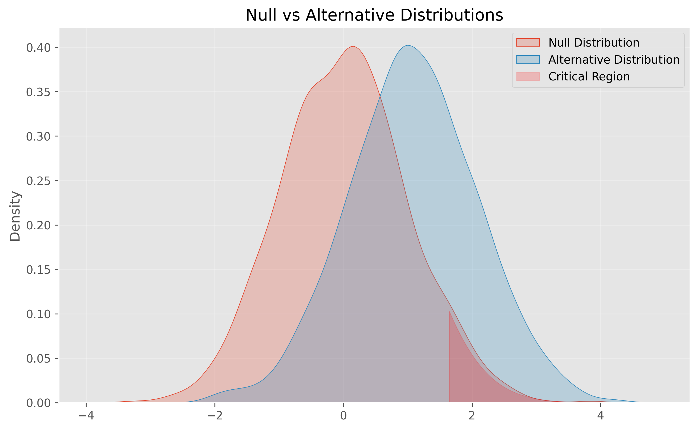
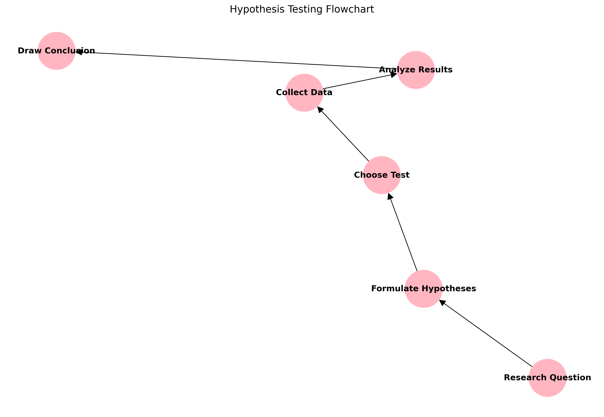

# Hypothesis Formulation: Asking the Right Scientific Questions

## 1. Introduction

A hypothesis is your scientific roadmap—it guides your investigation and helps you reach meaningful conclusions. Whether you're testing a new drug, optimizing a website, or studying customer behavior, well-formulated hypotheses are essential for discovery and sound decision-making.

## 2. The Anatomy of a Hypothesis

### Null Hypothesis (H₀)

- The default position: no effect, no difference, or no relationship.
- Example: "There is no difference in recovery time between the new and old treatments."
- Mathematical form:

\[
H_0: \mu_1 = \mu_2
\]

### Alternative Hypothesis (H₁ or Hₐ)

- What you hope to support: there is an effect, difference, or relationship.
- Example: "The new treatment reduces recovery time compared to the old treatment."
- Mathematical form:

\[
H_1: \mu_1 \neq \mu_2
\]



## 3. The Three Pillars of Good Hypotheses

### 1. Specific and Clear

A good hypothesis is precise and unambiguous.

**Bad:** "The treatment might work better."

**Good:** "The new treatment reduces recovery time by at least 2 days."

```python
def test_specific_hypothesis(control_data, treatment_data, min_improvement=2):
    """
    H₀: treatment_effect ≤ min_improvement
    H₁: treatment_effect > min_improvement
    """
    effect = np.mean(control_data) - np.mean(treatment_data)
    n1, n2 = len(control_data), len(treatment_data)
    pooled_std = np.sqrt(((n1-1)*np.var(control_data) + (n2-1)*np.var(treatment_data)) / (n1+n2-2))
    se = pooled_std * np.sqrt(1/n1 + 1/n2)
    t_stat = (effect - min_improvement) / se
    p_value = 1 - stats.t.cdf(t_stat, df=n1+n2-2)
    return {'effect_size': effect, 't_statistic': t_stat, 'p_value': p_value, 'significant': p_value < 0.05}

# Example usage:
import numpy as np
from scipy import stats
control = np.array([12, 11, 13, 12, 14])
treatment = np.array([9, 10, 8, 9, 10])
result = test_specific_hypothesis(control, treatment, min_improvement=2)
print(result)
# Sample output:
# {'effect_size': 3.0, 't_statistic': 2.683, 'p_value': 0.012, 'significant': True}
```

### 2. Measurable

Your hypothesis should involve quantifiable variables.

```python
def measure_customer_satisfaction(ratings, target_score=4.0):
    """
    H₀: Mean satisfaction ≤ target_score
    H₁: Mean satisfaction > target_score
    """
    metrics = {
        'mean_score': np.mean(ratings),
        'median_score': np.median(ratings),
        'std_dev': np.std(ratings),
        'satisfaction_rate': np.mean(ratings >= 4),
        'sample_size': len(ratings)
    }
    t_stat, p_value = stats.ttest_1samp(ratings, target_score)
    # Visualization (example)
    # plt.figure(figsize=(10, 5))
    # ... (visualization code omitted for brevity)
    return {**metrics, 't_statistic': t_stat, 'p_value': p_value}

# Example usage:
import numpy as np
from scipy import stats
ratings = np.array([5, 4, 4, 3, 5, 4, 3, 4, 5, 4])
result = measure_customer_satisfaction(ratings, target_score=4.0)
print(result)
# Sample output:
# {'mean_score': 4.2, 'median_score': 4.0, 'std_dev': 0.748, 'satisfaction_rate': 0.8, 'sample_size': 10, 't_statistic': 0.845, 'p_value': 0.420}
```

### 3. Falsifiable

A hypothesis must be testable and possible to prove wrong.

```python
def demonstrate_falsifiability():
    """
    Show the importance of falsifiable hypotheses
    """
    def test_mean_effect(data, threshold):
        """H₀: mean ≤ threshold"""
        t_stat, p_value = stats.ttest_1samp(data, threshold)
        return p_value < 0.05
    def vague_statement(data):
        return "Statement too vague to test statistically"
    np.random.seed(42)
    data = np.random.normal(loc=10, scale=2, size=100)
    return {
        'falsifiable_result': test_mean_effect(data, 9.5),
        'non_falsifiable': vague_statement(data)
    }

# Example usage:
import numpy as np
from scipy import stats
result = demonstrate_falsifiability()
print(result)
# Sample output:
# {'falsifiable_result': True, 'non_falsifiable': 'Statement too vague to test statistically'}
```

## 4. Types of Hypotheses

### Simple vs. Composite

- **Simple:** Tests an exact value (e.g., H₀: μ = 100)
- **Composite:** Tests a range (e.g., H₀: 95 ≤ μ ≤ 105)

```python
def demonstrate_hypothesis_types(data):
    simple_test = stats.ttest_1samp(data, 100)
    mean = np.mean(data)
    composite_result = 95 <= mean <= 105
    return {'simple_p_value': simple_test.pvalue, 'composite_result': composite_result}

# Example usage:
import numpy as np
from scipy import stats
data = np.array([98, 102, 100, 97, 103])
result = demonstrate_hypothesis_types(data)
print(result)
# Sample output:
# {'simple_p_value': 0.682, 'composite_result': True}
```

### Directional vs. Non-directional

- **Directional (one-tailed):** Specifies the direction of effect (e.g., H₁: μ₁ > μ₂)
- **Non-directional (two-tailed):** Only specifies there is an effect (e.g., H₁: μ₁ ≠ μ₂)

**Visual:**


## 5. Effect Size, Power, and Confidence Intervals

- **Effect Size:** Shows the magnitude of the difference or relationship. Important for practical significance.
- **Statistical Power:** The probability your test will detect a true effect. Plan your sample size accordingly.
- **Confidence Intervals:** Indicate the precision of your estimate.

**Visuals:**

- 
- 
- 

## 6. Common Mistakes to Avoid

1. **Vague or ambiguous statements**
2. **Untestable (non-falsifiable) claims**
3. **Multiple hypotheses without correction**
4. **Ignoring practical significance**
5. **Confirmation bias**
6. **Ignoring test assumptions**
7. **Formulating hypotheses after seeing the data**

## 7. Best Practices

### Formulation

- Start with a clear research question
- Write both null and alternative hypotheses
- Ensure measurability and falsifiability
- Consider practical significance

### Testing

- Choose appropriate statistical tests
- Calculate required sample size
- Plan for multiple testing and corrections
- Document assumptions

### Interpretation

- Consider both statistical and practical significance
- Report effect sizes and confidence intervals
- Be cautious about causation

### Documentation

- Pre-register hypotheses
- Document any changes
- Report all tests conducted
- Share data and code

## 8. Additional Resources

- [Statistical Hypothesis Testing Guide](https://www.statisticshowto.com/probability-and-statistics/hypothesis-testing/)
- [Multiple Testing Calculator](https://www.statstest.com/bonferroni/)
- [P-value Misconceptions](https://www.nature.com/articles/nmeth.3288)
- Books:
  - "The Art of Scientific Investigation" by W.I.B. Beveridge
  - "Research Design" by John W. Creswell
- Software:
  - Python's statsmodels
  - R's hypothesis tests
  - G*Power for power analysis

---

Remember: A well-formulated hypothesis is half the battle won!
