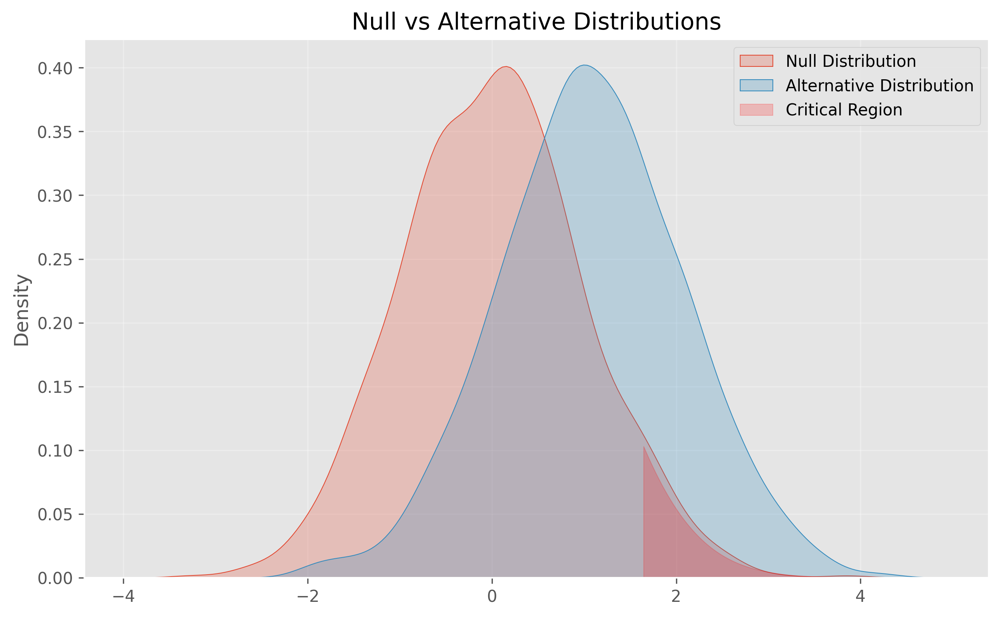

# Hypothesis Formulation: Asking the Right Scientific Questions

**After this lesson:** you can explain the core ideas in “Hypothesis Formulation: Asking the Right Scientific Questions” and reproduce the examples here in your own notebook or environment.

## Overview

A hypothesis ties a **decision** to a **testable claim**: what would the world look like if nothing interesting were happening (null), and what pattern would convince you otherwise (alternative)? Clear wording prevents “significant” results that no one can act on. This lesson follows [experimental design](./experimental-design.md) and feeds directly into [statistical tests](./statistical-tests.md).

## Why this matters

- Clear **null** and **alternative** hypotheses keep your analysis aligned with the decision you need to make.
- You will avoid vague claims that cannot be tested with data.

## Prerequisites

- [Experimental design](./experimental-design.md).
- [Understanding p-values](../4.1-inferential-stats/p-values.md) for null/alternative language.

> **Warning:** Do not choose your hypotheses after peeking at the data.

## Introduction

A hypothesis is your scientific roadmap—it guides your investigation and helps you reach meaningful conclusions. Whether you're testing a new drug, optimizing a website, or studying customer behavior, well-formulated hypotheses are essential for discovery and sound decision-making.

### Video Tutorial: Hypothesis Testing Explained

<div class="video-embed">
<iframe width="560" height="315" src="https://www.youtube.com/embed/0oc49DyA3hU" frameborder="0" allow="accelerometer; autoplay; clipboard-write; encrypted-media; gyroscope; picture-in-picture" allowfullscreen></iframe>
</div>

*StatQuest: Hypothesis Testing and The Null Hypothesis, Clearly Explained!!! by Josh Starmer*



*Choose your hypotheses before you look at the data. Peeking (p-hacking) inflates Type I error.*

## The Anatomy of a Hypothesis

### Null Hypothesis (H₀)

- The default position: no effect, no difference, or no relationship.
- Example: "There is no difference in recovery time between the new and old treatments."
- Mathematical form:

\\[
H_0: \mu_1 = \mu_2
\\]

### Alternative Hypothesis (H₁ or Hₐ)

- What you hope to support: there is an effect, difference, or relationship.
- Example: "The new treatment reduces recovery time compared to the old treatment."
- Mathematical form:

\\[
H_1: \mu_1 \neq \mu_2
\\]



## The Three Pillars of Good Hypotheses

### 1. Specific and Clear

A good hypothesis is precise and unambiguous.

**Bad:** "The treatment might work better."

**Good:** "The new treatment reduces recovery time by at least 2 days."

**One-sided test for a minimum improvement**

<div class="code-explainer" data-code-explainer>
<div class="code-explainer__code">


def test_specific_hypothesis(control_data, treatment_data, min_improvement=2):
    """
    H₀: treatment_effect ≤ min_improvement
    H₁: treatment_effect > min_improvement
    """
    effect = np.mean(control_data) - np.mean(treatment_data)
    n1, n2 = len(control_data), len(treatment_data)
    pooled_std = np.sqrt(((n1-1)*np.var(control_data) + (n2-1)*np.var(treatment_data)) / (n1+n2-2))
    se = pooled_std * np.sqrt(1/n1 + 1/n2)
    t_stat = (effect - min_improvement) / se
    p_value = 1 - stats.t.cdf(t_stat, df=n1+n2-2)
    return {'effect_size': effect, 't_statistic': t_stat, 'p_value': p_value, 'significant': p_value < 0.05}

# Example usage:
import numpy as np
from scipy import stats
control = np.array([12, 11, 13, 12, 14])
treatment = np.array([9, 10, 8, 9, 10])
result = test_specific_hypothesis(control, treatment, min_improvement=2)
print(result)

</div>
<aside class="code-explainer__callouts" aria-label="Code walkthrough">
  <div class="code-callout" data-lines="1-12" data-tint="1">
    <div class="code-callout__meta">
      <span class="code-callout__lines"></span>
      <span class="code-callout__title">One-sided t-test</span>
    </div>
    <div class="code-callout__body">
      <p>Compute the observed effect, build a pooled standard error for a two-sample design, then shift the t-statistic by <code>min_improvement</code> to test a directional minimum-gain hypothesis.</p>
    </div>
  </div>
  <div class="code-callout" data-lines="14-22" data-tint="2">
    <div class="code-callout__meta">
      <span class="code-callout__lines"></span>
      <span class="code-callout__title">Run the test</span>
    </div>
    <div class="code-callout__body">
      <p>Pass small control and treatment arrays to the function and print the result dict containing effect size, t-statistic, p-value, and significance flag.</p>
    </div>
  </div>
</aside>
</div>

```
{'effect_size': np.float64(3.200000000000001), 't_statistic': np.float64(2.121320343559645), 'p_value': np.float64(0.03334399999999982), 'significant': np.True_}
```

### 2. Measurable

Your hypothesis should involve quantifiable variables.

**Descriptive metrics + one-sample t-test vs a target**

<div class="code-explainer" data-code-explainer>
<div class="code-explainer__code">


def measure_customer_satisfaction(ratings, target_score=4.0):
    """
    H₀: Mean satisfaction ≤ target_score
    H₁: Mean satisfaction > target_score
    """
    metrics = {
        'mean_score': np.mean(ratings),
        'median_score': np.median(ratings),
        'std_dev': np.std(ratings),
        'satisfaction_rate': np.mean(ratings >= 4),
        'sample_size': len(ratings)
    }
    t_stat, p_value = stats.ttest_1samp(ratings, target_score)
    # Visualization (example)
    # plt.figure(figsize=(10, 5))
    # ... (visualization code omitted for brevity)
    return {**metrics, 't_statistic': t_stat, 'p_value': p_value}

# Example usage:
import numpy as np
from scipy import stats
ratings = np.array([5, 4, 4, 3, 5, 4, 3, 4, 5, 4])
result = measure_customer_satisfaction(ratings, target_score=4.0)
print(result)

</div>
<aside class="code-explainer__callouts" aria-label="Code walkthrough">
  <div class="code-callout" data-lines="1-12" data-tint="1">
    <div class="code-callout__meta">
      <span class="code-callout__lines"></span>
      <span class="code-callout__title">Descriptive metrics</span>
    </div>
    <div class="code-callout__body">
      <p>Compute mean, median, std, proportion ≥ 4, and sample size into a single dict—these are the quantifiable measures that make the hypothesis testable.</p>
    </div>
  </div>
  <div class="code-callout" data-lines="13-17" data-tint="2">
    <div class="code-callout__meta">
      <span class="code-callout__lines"></span>
      <span class="code-callout__title">One-sample t-test</span>
    </div>
    <div class="code-callout__body">
      <p>Run <code>stats.ttest_1samp</code> against the target score and merge the t-statistic and p-value into the metrics dict for a unified return value.</p>
    </div>
  </div>
  <div class="code-callout" data-lines="19-26" data-tint="3">
    <div class="code-callout__meta">
      <span class="code-callout__lines"></span>
      <span class="code-callout__title">Run the test</span>
    </div>
    <div class="code-callout__body">
      <p>Pass 10 ratings to the function and print the full result dict to see all metrics alongside the test statistics.</p>
    </div>
  </div>
</aside>
</div>

```
{'mean_score': np.float64(4.1), 'median_score': np.float64(4.0), 'std_dev': np.float64(0.7000000000000001), 'satisfaction_rate': np.float64(0.8), 'sample_size': 10, 't_statistic': np.float64(0.42857142857142705), 'p_value': np.float64(0.6783097418055807)}
```

### 3. Falsifiable

A hypothesis must be testable and possible to prove wrong.

**Falsifiable vs vague statements**

<div class="code-explainer" data-code-explainer>
<div class="code-explainer__code">


def demonstrate_falsifiability():
    """
    Show the importance of falsifiable hypotheses
    """
    def test_mean_effect(data, threshold):
        """H₀: mean ≤ threshold"""
        t_stat, p_value = stats.ttest_1samp(data, threshold)
        return p_value < 0.05
    def vague_statement(data):
        return "Statement too vague to test statistically"
    np.random.seed(42)
    data = np.random.normal(loc=10, scale=2, size=100)
    return {
        'falsifiable_result': test_mean_effect(data, 9.5),
        'non_falsifiable': vague_statement(data)
    }

# Example usage:
import numpy as np
from scipy import stats
result = demonstrate_falsifiability()
print(result)

</div>
<aside class="code-explainer__callouts" aria-label="Code walkthrough">
  <div class="code-callout" data-lines="4-8" data-tint="1">
    <div class="code-callout__meta">
      <span class="code-callout__lines"></span>
      <span class="code-callout__title">Falsifiable inner function</span>
    </div>
    <div class="code-callout__body">
      <p><code>test_mean_effect</code> uses <code>ttest_1samp</code> to produce a concrete Boolean—any dataset can in principle reject this claim, making it falsifiable.</p>
    </div>
  </div>
  <div class="code-callout" data-lines="9-10" data-tint="2">
    <div class="code-callout__meta">
      <span class="code-callout__lines"></span>
      <span class="code-callout__title">Non-falsifiable contrast</span>
    </div>
    <div class="code-callout__body">
      <p><code>vague_statement</code> returns a string regardless of the data—no statistical test can ever reject it, illustrating why vague hypotheses are scientifically useless.</p>
    </div>
  </div>
  <div class="code-callout" data-lines="11-22" data-tint="3">
    <div class="code-callout__meta">
      <span class="code-callout__lines"></span>
      <span class="code-callout__title">Side-by-side comparison</span>
    </div>
    <div class="code-callout__body">
      <p>Generate 100 normal samples, run both branches, and print the dict so the Boolean result from the statistical test stands in sharp contrast to the vague string.</p>
    </div>
  </div>
</aside>
</div>

```
{'falsifiable_result': np.False_, 'non_falsifiable': 'Statement too vague to test statistically'}
```

## Types of Hypotheses

### Simple vs. Composite

- **Simple:** Tests an exact value (e.g., H₀: μ = 100)
- **Composite:** Tests a range (e.g., H₀: 95 ≤ μ ≤ 105)

**Simple null vs composite range check**

<div class="code-explainer" data-code-explainer>
<div class="code-explainer__code">


def demonstrate_hypothesis_types(data):
    simple_test = stats.ttest_1samp(data, 100)
    mean = np.mean(data)
    composite_result = 95 <= mean <= 105
    return {'simple_p_value': simple_test.pvalue, 'composite_result': composite_result}

# Example usage:
import numpy as np
from scipy import stats
data = np.array([98, 102, 100, 97, 103])
result = demonstrate_hypothesis_types(data)
print(result)

</div>
<aside class="code-explainer__callouts" aria-label="Code walkthrough">
  <div class="code-callout" data-lines="1-5" data-tint="1">
    <div class="code-callout__meta">
      <span class="code-callout__lines"></span>
      <span class="code-callout__title">Simple vs composite</span>
    </div>
    <div class="code-callout__body">
      <p>Run <code>ttest_1samp</code> for an exact-value null (H₀: μ = 100), then separately check whether the sample mean falls inside the composite interval [95, 105].</p>
    </div>
  </div>
  <div class="code-callout" data-lines="7-13" data-tint="2">
    <div class="code-callout__meta">
      <span class="code-callout__lines"></span>
      <span class="code-callout__title">Example run</span>
    </div>
    <div class="code-callout__body">
      <p>Pass five values centered near 100 and print the result to see the p-value from the simple test alongside the Boolean composite flag.</p>
    </div>
  </div>
</aside>
</div>

```
{'simple_p_value': np.float64(1.0), 'composite_result': np.True_}
```

### Directional vs. Non-directional

- **Directional (one-tailed):** Specifies the direction of effect (e.g., H₁: μ₁ > μ₂)
- **Non-directional (two-tailed):** Only specifies there is an effect (e.g., H₁: μ₁ ≠ μ₂)

## Type I and Type II Errors

Every hypothesis test makes one of two types of mistake. Knowing which one you're trading off against helps you set α and design the study.

| | H₀ is actually true | H₀ is actually false |
|---|---|---|
| **Reject H₀** | **Type I error (false positive)** — rate = α | Correct (True Positive) — rate = power |
| **Fail to reject H₀** | Correct (True Negative) | **Type II error (false negative)** — rate = β |

- **α (significance level):** The rate at which you're willing to incorrectly reject a true null. Convention is 0.05, but the right value depends on the cost of false positives in your context.
- **β:** The rate of missing a real effect. **Power = 1 − β** — the probability of detecting an effect when one truly exists.

**The tradeoff:** Lowering α (stricter test) reduces false positives but increases false negatives. The only way to reduce both simultaneously is to collect more data.

```python
import numpy as np
from scipy import stats

def error_rates(n, true_effect, sigma, alpha=0.05):
    """
    Compute Type II error rate (beta) and power for a two-sample t-test.

    n          : sample size per group
    true_effect: actual difference in means (mu1 - mu2)
    sigma      : common standard deviation
    alpha      : significance level
    """
    # Standard error of the difference in means
    se = sigma * np.sqrt(2 / n)

    # Non-centrality parameter
    ncp = true_effect / se

    # Critical value for the two-sided test
    critical_value = stats.norm.ppf(1 - alpha / 2)

    # Power = P(reject H0 | H1 true)
    power = 1 - stats.norm.cdf(critical_value - ncp) + stats.norm.cdf(-critical_value - ncp)
    beta = 1 - power

    return {'alpha': alpha, 'beta': round(beta, 3), 'power': round(power, 3), 'n_per_group': n}

# Effect of sample size on error rates
for n in [30, 100, 300, 1000]:
    print(error_rates(n, true_effect=0.5, sigma=2.0))
```

```
{'alpha': 0.05, 'beta': 0.915, 'power': 0.085, 'n_per_group': 30}
{'alpha': 0.05, 'beta': 0.718, 'power': 0.282, 'n_per_group': 100}
{'alpha': 0.05, 'beta': 0.291, 'power': 0.709, 'n_per_group': 300}
{'alpha': 0.05, 'beta': 0.017, 'power': 0.983, 'n_per_group': 1000}
```

With n=30 and a 0.5-unit effect in a population with σ=2, power is only 8.5% — you'll miss the real effect 91.5% of the time. This is why sample size planning belongs in hypothesis formulation, not after data collection.

### Interactive: see Type I, Type II, and power

The widget below shows the null and alternative distributions side by side. The **red shading** is the rejection region (Type I, area = α); the **orange shading** is the missed-detection region (Type II, area = β); the **green shading** is power (1 − β). Move the slider to change effect size and sample size, and switch the dropdown to see how a stricter α shifts the critical value.

<iframe src="../4.1-inferential-stats/assets/interactive/power_simulation.html" width="100%" height="520" frameborder="0" loading="lazy" title="Interactive Type I, Type II, and power simulation"></iframe>

**Try this:**

- Set d = 0.2 (small effect). How big does n need to get before power crosses 0.80?
- Hold d = 0.5, increase n: power rises smoothly. This is the curve sample-size planning rides.
- Switch α from 0.05 to 0.01 (dropdown). The critical value moves right, the red region shrinks, and the orange region grows — fewer false positives, more missed detections.

## Effect Size and Power

Effect size is the bridge between "is the result real?" (statistical significance) and "does the result matter?" (practical significance). You need it in two places: before the test (to calculate required sample size) and after (to report alongside the p-value).

**Cohen's d for two groups:**

\\[
d = \frac{\bar x_1 - \bar x_2}{s_p}
\\]

where \\(s_p\\) is the pooled standard deviation.

| Cohen's d | Interpretation |
|---|---|
| 0.2 | Small — noticeable in large datasets |
| 0.5 | Medium — visible to careful observation |
| 0.8 | Large — visible to the naked eye |

```python
def cohens_d(group1, group2):
    """Compute Cohen's d effect size for two independent groups."""
    n1, n2 = len(group1), len(group2)
    var1, var2 = np.var(group1, ddof=1), np.var(group2, ddof=1)
    pooled_std = np.sqrt(((n1 - 1) * var1 + (n2 - 1) * var2) / (n1 + n2 - 2))
    return (np.mean(group1) - np.mean(group2)) / pooled_std

# Power analysis: required sample size for target power
from scipy.stats import norm

def required_sample_size(effect_size_d, alpha=0.05, power=0.80):
    """
    Approximate per-group n to achieve target power for a two-sample t-test.
    Uses the normal approximation (exact requires NCP t-distribution).
    """
    z_alpha = norm.ppf(1 - alpha / 2)
    z_beta = norm.ppf(power)
    n = 2 * ((z_alpha + z_beta) / effect_size_d) ** 2
    return int(np.ceil(n))

# How many participants do we need?
for d in [0.2, 0.5, 0.8]:
    n = required_sample_size(d)
    print(f"Cohen's d = {d:.1f} → n = {n} per group ({2*n} total)")
```

```
Cohen's d = 0.2 → n = 394 per group (788 total)
Cohen's d = 0.5 → n = 64 per group (128 total)
Cohen's d = 0.8 → n = 26 per group (52 total)
```

Detecting a small effect (d=0.2) requires ~6x more data than a large effect (d=0.8). This is why defining the minimum practically meaningful effect *before* the study determines the feasibility of the entire experiment.

## Common Mistakes to Avoid

1. **Vague or ambiguous statements**
2. **Untestable (non-falsifiable) claims**
3. **Multiple hypotheses without correction**
4. **Ignoring practical significance**
5. **Confirmation bias**
6. **Ignoring test assumptions**
7. **Formulating hypotheses after seeing the data**

## Gotchas

- **Choosing a one-tailed vs two-tailed test based on seeing the data** — the lesson's `test_specific_hypothesis` uses a one-tailed test because the alternative was stated as "reduces by *at least* 2 days" *before* data were collected. Switching from two-tailed to one-tailed after observing which direction the effect went halves the p-value without scientific justification.
- **Writing the alternative hypothesis as the complement of the null** — `H₁: μ₁ ≠ μ₂` is not simply "H₀ is false"; it must be a specific, testable claim tied to a particular test and effect direction. Vague alternatives like "something changed" cannot guide test selection or power calculations.
- **Testing whether the sample mean is above a target when the correct frame is a one-sample t-test** — `ttest_1samp(ratings, target_score)` in `measure_customer_satisfaction` is two-sided by default; if your hypothesis is directional (mean *above* 4.0), the p-value should be halved (or you should use `alternative='greater'` in newer SciPy versions) to match the stated H₁.
- **Treating "statistically significant" as the same as "the hypothesis is correct"** — rejecting H₀ only means the data are unlikely under H₀; it does not confirm H₁ or rule out other explanations. The lesson's `falsifiable_result: True` means evidence exceeded the threshold, not that the mechanism is proven.
- **Formulating composite hypotheses without a formal test for the range** — the lesson shows `95 <= mean <= 105` as a Python comparison, not a proper statistical equivalence test (TOST). For truly asserting that a parameter falls within bounds you need two one-sided tests; the simple range check is a descriptive screen, not a rigorous inference procedure.
- **Forgetting to pre-register hypotheses before seeing outcomes** — the file warns explicitly against peeking, but in practice learners often run exploratory analysis first and then pick the hypothesis that matches the interesting result. Pre-registration (even in a notebook cell timestamped before data load) is the simplest safeguard.

## Next steps

- Continue to [Statistical tests](./statistical-tests.md), then [A/B testing](./ab-testing.md) and [Results analysis](./results-analysis.md).

## Additional Resources

- [Statistical Hypothesis Testing Guide](https://www.statisticshowto.com/probability-and-statistics/hypothesis-testing/)
- [Multiple Testing Calculator](https://www.statstest.com/bonferroni/)
- [P-value Misconceptions](https://www.nature.com/articles/nmeth.3288)
- Books:
  - "The Art of Scientific Investigation" by W.I.B. Beveridge
  - "Research Design" by John W. Creswell
- Software:
  - Python's statsmodels
  - R's hypothesis tests
  - G*Power for power analysis

---

Remember: A well-formulated hypothesis is half the battle won!
