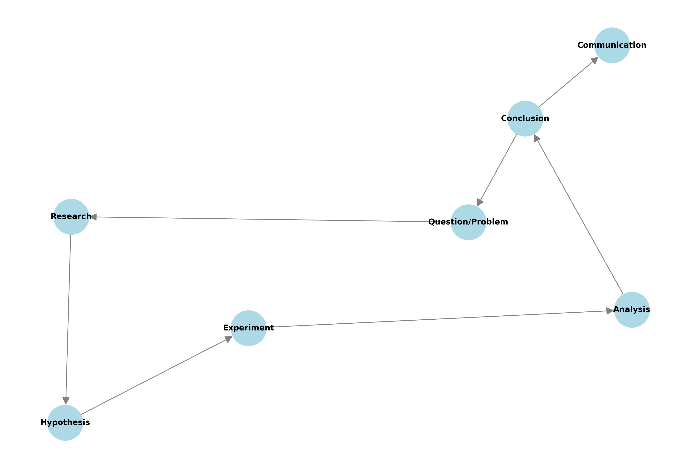

# Formulating Hypotheses: The Art of Scientific Questions 🔍

## Introduction: Why Hypotheses Matter 🎯

Think of a hypothesis as your scientific GPS - it guides your investigation and helps you arrive at meaningful conclusions. Whether you're testing a new drug, optimizing a website, or studying customer behavior, well-formulated hypotheses are your roadmap to discovery!

## The Anatomy of a Hypothesis 🔬

### The Dynamic Duo: Null and Alternative

1. **Null Hypothesis (H₀)** 🚫
   - The "nothing special happening" hypothesis
   - States no effect or no difference
   - What we try to disprove

2. **Alternative Hypothesis (H₁ or Hₐ)** ✨
   - The "something's happening" hypothesis
   - States there is an effect or difference
   - What we hope to support

```python
import numpy as np
from scipy import stats
import matplotlib.pyplot as plt
import seaborn as sns

def demonstrate_hypotheses():
    """
    Visualize the concept of null vs alternative hypotheses
    """
    # Generate data
    np.random.seed(42)
    
    # Null hypothesis data (no effect)
    null_data = np.random.normal(100, 15, 1000)
    
    # Alternative hypothesis data (with effect)
    alt_data = np.random.normal(105, 15, 1000)
    
    # Visualization
    plt.figure(figsize=(12, 6))
    
    plt.subplot(121)
    sns.histplot(null_data, label='Control', alpha=0.5)
    sns.histplot(alt_data, label='Treatment', alpha=0.5)
    plt.title('Data Distribution')
    plt.legend()
    
    plt.subplot(122)
    sns.boxplot(data=[null_data, alt_data])
    plt.xticks([0, 1], ['Control', 'Treatment'])
    plt.title('Group Comparison')
    
    plt.tight_layout()
    plt.savefig('docs/4-stat-analysis/4.2-hypotheses-testing/assets/hypothesis_visualization.png')
    plt.close()
    
    # Statistical test
    t_stat, p_value = stats.ttest_ind(null_data, alt_data)
    return t_stat, p_value

# Example usage
t_stat, p_value = demonstrate_hypotheses()
```

## The Three Pillars of Good Hypotheses 🏛️

### 1. Specific and Clear 📝

Transform vague ideas into testable statements:

❌ Bad: "The treatment might work better"
✅ Good: "The new treatment reduces recovery time by at least 2 days"

```python
def test_specific_hypothesis(control_data, treatment_data, min_improvement=2):
    """
    Test a specific hypothesis about treatment improvement
    
    H₀: treatment_effect ≤ min_improvement
    H₁: treatment_effect > min_improvement
    """
    # Calculate treatment effect
    effect = np.mean(control_data) - np.mean(treatment_data)
    
    # Calculate standard error
    n1, n2 = len(control_data), len(treatment_data)
    pooled_std = np.sqrt(((n1-1)*np.var(control_data) + (n2-1)*np.var(treatment_data)) / (n1+n2-2))
    se = pooled_std * np.sqrt(1/n1 + 1/n2)
    
    # Calculate test statistic
    t_stat = (effect - min_improvement) / se
    
    # One-tailed test
    p_value = 1 - stats.t.cdf(t_stat, df=n1+n2-2)
    
    return {
        'effect_size': effect,
        't_statistic': t_stat,
        'p_value': p_value,
        'significant': p_value < 0.05
    }
```

### 2. Measurable 📊

Your hypothesis should involve quantifiable variables:

```python
def measure_customer_satisfaction(ratings, target_score=4.0):
    """
    Analyze customer satisfaction metrics
    
    H₀: Mean satisfaction ≤ target_score
    H₁: Mean satisfaction > target_score
    """
    metrics = {
        'mean_score': np.mean(ratings),
        'median_score': np.median(ratings),
        'std_dev': np.std(ratings),
        'satisfaction_rate': np.mean(ratings >= 4),
        'sample_size': len(ratings)
    }
    
    # Statistical test
    t_stat, p_value = stats.ttest_1samp(ratings, target_score)
    
    # Create visualization
    plt.figure(figsize=(10, 5))
    
    plt.subplot(121)
    sns.histplot(ratings, bins=20)
    plt.axvline(target_score, color='r', linestyle='--', label=f'Target ({target_score})')
    plt.title('Distribution of Ratings')
    plt.legend()
    
    plt.subplot(122)
    sns.boxplot(y=ratings)
    plt.axhline(target_score, color='r', linestyle='--')
    plt.title('Rating Summary')
    
    plt.tight_layout()
    plt.savefig('docs/4-stat-analysis/4.2-hypotheses-testing/assets/satisfaction_analysis.png')
    plt.close()
    
    return {**metrics, 't_statistic': t_stat, 'p_value': p_value}
```

### 3. Falsifiable ❌

Your hypothesis must be able to be proven wrong:

```python
def demonstrate_falsifiability():
    """
    Show the importance of falsifiable hypotheses
    """
    # Example 1: Falsifiable hypothesis
    def test_mean_effect(data, threshold):
        """H₀: mean ≤ threshold"""
        t_stat, p_value = stats.ttest_1samp(data, threshold)
        return p_value < 0.05
    
    # Example 2: Non-falsifiable statement
    def vague_statement(data):
        """'The treatment might help some people'"""
        return "Statement too vague to test statistically"
    
    # Demonstrate with simulated data
    np.random.seed(42)
    data = np.random.normal(loc=10, scale=2, size=100)
    
    return {
        'falsifiable_result': test_mean_effect(data, 9.5),
        'non_falsifiable': vague_statement(data)
    }
```

## Types of Hypotheses 📚

### 1. Simple vs Composite Hypotheses

- Simple: Tests exact value
- Composite: Tests range of values

```python
def demonstrate_hypothesis_types(data):
    """Compare simple and composite hypotheses"""
    # Simple hypothesis (H₀: μ = 100)
    simple_test = stats.ttest_1samp(data, 100)
    
    # Composite hypothesis (H₀: 95 ≤ μ ≤ 105)
    mean = np.mean(data)
    composite_result = 95 <= mean <= 105
    
    return {
        'simple_p_value': simple_test.pvalue,
        'composite_result': composite_result
    }
```

### 2. Directional vs Non-directional 🔄

```python
def compare_directional_tests(control, treatment):
    """
    Compare one-tailed and two-tailed tests
    
    One-tailed: H₁: treatment > control
    Two-tailed: H₁: treatment ≠ control
    """
    # Two-tailed test
    two_tail = stats.ttest_ind(treatment, control)
    
    # One-tailed test
    one_tail = stats.ttest_ind(treatment, control, alternative='greater')
    
    # Visualize
    plt.figure(figsize=(12, 5))
    
    plt.subplot(121)
    sns.histplot(control, label='Control', alpha=0.5)
    sns.histplot(treatment, label='Treatment', alpha=0.5)
    plt.title('Distribution Comparison')
    plt.legend()
    
    plt.subplot(122)
    plt.text(0.1, 0.7, f"Two-tailed p-value: {two_tail.pvalue:.4f}")
    plt.text(0.1, 0.5, f"One-tailed p-value: {one_tail.pvalue:.4f}")
    plt.axis('off')
    plt.title('Test Results')
    
    plt.tight_layout()
    plt.savefig('docs/4-stat-analysis/4.2-hypotheses-testing/assets/directional_tests.png')
    plt.close()
    
    return {
        'two_tailed': two_tail,
        'one_tailed': one_tail
    }
```

## Recommended Visualizations

To enhance understanding of hypothesis formulation, we recommend adding the following visualizations:

1. **Hypothesis Testing Flowchart**
   - Step-by-step guide to hypothesis formulation
   - Show relationship between research question and hypothesis
   - Include decision points for test selection

2. **Null vs Alternative Distribution**
   - Side-by-side comparison of null and alternative distributions
   - Show critical regions and significance levels
   - Demonstrate Type I and Type II errors

3. **Effect Size Visualization**
   - Visual representation of different effect sizes
   - Show relationship between effect size and power
   - Include practical significance thresholds

4. **Test Selection Decision Tree**
   - Interactive flowchart for choosing statistical tests
   - Based on data type and research question
   - Include common test scenarios

5. **Multiple Testing Correction**
   - Visual explanation of correction methods
   - Show impact on significance levels
   - Demonstrate family-wise error rate

## Common Mistakes to Avoid

1. **Vague Hypotheses**
   - Be specific about variables
   - Define measurement methods
   - Specify expected direction

2. **Multiple Hypotheses Without Correction**
   - Plan all tests in advance
   - Use appropriate correction methods
   - Report adjusted significance levels

3. **Ignoring Assumptions**
   - Check test assumptions
   - Use appropriate tests
   - Report violations

4. **Data-Driven Hypotheses**
   - Formulate before data collection
   - Avoid post-hoc hypotheses
   - Document all analyses

5. **Overlooking Practical Significance**
   - Consider effect sizes
   - Think about real-world impact
   - Balance statistical and practical significance

## Best Practices

1. **Formulation Phase**
   - Start with research question
   - Review existing literature
   - Consider practical implications
   - Write clear, testable statements

2. **Testing Phase**
   - Choose appropriate test
   - Check assumptions
   - Calculate required sample size
   - Plan analysis methods

3. **Interpretation Phase**
   - Consider both statistical and practical significance
   - Report effect sizes
   - Discuss limitations
   - Make recommendations

4. **Documentation Phase**
   - Record all hypotheses
   - Document test procedures
   - Report all results
   - Include sensitivity analyses

## Additional Resources 📚

- [Statistical Hypothesis Testing Guide](https://www.statisticshowto.com/probability-and-statistics/hypothesis-testing/)
- [Multiple Testing Calculator](https://www.statstest.com/bonferroni/)
- [P-value Misconceptions](https://www.nature.com/articles/nmeth.3288)

Remember: A well-formulated hypothesis is half the battle won! 🎯

# Hypothesis Formulation: Asking the Right Questions

## Introduction

Think of hypothesis formulation as being a scientific detective. Just like a detective starts with a theory about what happened, we start with a hypothesis about what we expect to find. This guide will help you formulate clear, testable hypotheses.



## The Anatomy of a Hypothesis

### Null Hypothesis (H₀)

The null hypothesis is your default position - what you'd expect if nothing interesting is happening:

- No difference between groups
- No relationship between variables
- No effect of treatment

### Alternative Hypothesis (H₁ or Hₐ)

The alternative hypothesis is what you're really interested in proving:

- There is a difference between groups
- There is a relationship between variables
- The treatment has an effect

## The Three Pillars of Good Hypotheses

### 1. Specific and Clear

Your hypothesis should be precise and unambiguous:

```python
# Bad hypothesis: "The treatment improves outcomes"
# Good hypothesis: "The new website design increases conversion rate by at least 5%"

def calculate_improvement(control_data, treatment_data):
    """Calculate percentage improvement"""
    control_mean = np.mean(control_data)
    treatment_mean = np.mean(treatment_data)
    return ((treatment_mean - control_mean) / control_mean) * 100
```

### 2. Measurable

Your hypothesis should involve quantifiable variables:

```python
def is_measurable(metric, data):
    """Check if a metric is measurable in the data"""
    return (
        metric in data.columns and
        data[metric].dtype in ['int64', 'float64']
    )
```

### 3. Falsifiable

Your hypothesis must be testable and possible to prove wrong:


## Types of Hypotheses

### Simple vs. Composite

- Simple: Specifies exact values
- Composite: Specifies ranges or inequalities

### Directional vs. Non-directional

- Directional: Specifies the direction of effect
- Non-directional: Only specifies that there is an effect

## Effect Size Considerations

Understanding the magnitude of effects:


## Statistical Power

Ensure your study can detect meaningful effects:


## Confidence Intervals

Understand the precision of your estimates:


## Common Mistakes to Avoid

1. Vague or ambiguous statements
2. Untestable claims
3. Multiple hypotheses without correction
4. Ignoring practical significance
5. Confirmation bias

## Best Practices

### Formulation

1. Start with a clear research question
2. Write both null and alternative hypotheses
3. Ensure measurability
4. Consider practical significance

### Testing

1. Choose appropriate statistical tests
2. Calculate required sample size
3. Plan for multiple testing
4. Document assumptions

### Interpretation

1. Consider both statistical and practical significance
2. Look at effect sizes
3. Use confidence intervals
4. Be cautious about causation

### Documentation

1. Pre-register hypotheses
2. Document any changes
3. Report all tests conducted
4. Share data and code

## Additional Resources

1. Books:
   - "The Art of Scientific Investigation" by W.I.B. Beveridge
   - "Research Design" by John W. Creswell

2. Online Resources:
   - Open Science Framework
   - Statistical Power Calculator
   - Hypothesis Registry

3. Software:
   - Python's statsmodels
   - R's hypothesis tests
   - G*Power for power analysis
