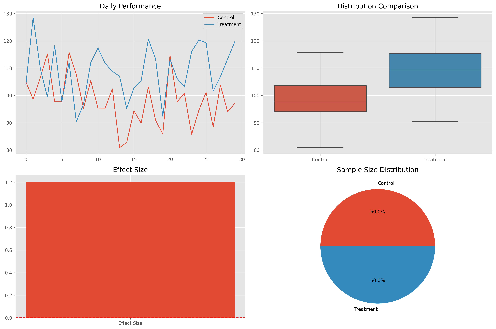
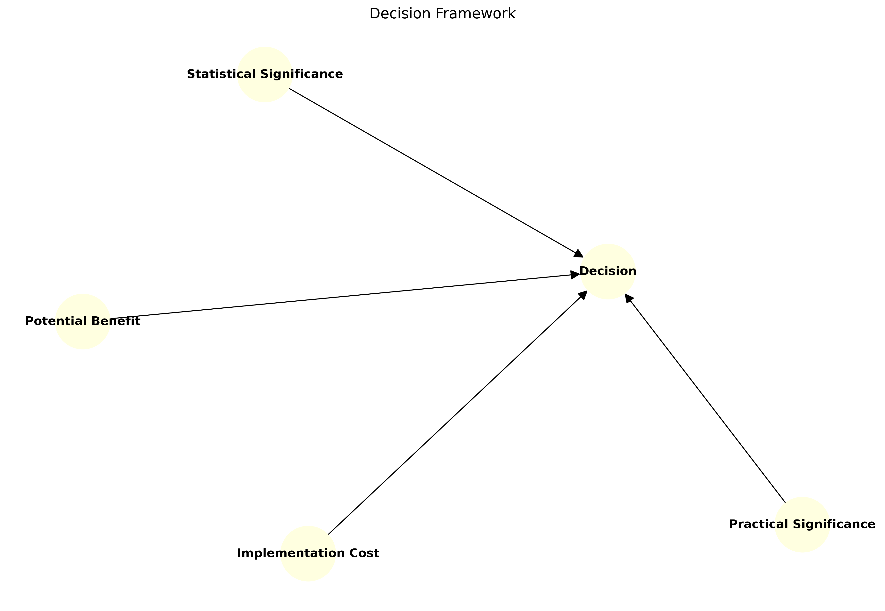

# Results Analysis: From Numbers to Insights

## Introduction: Why Results Analysis Matters

Think of results analysis as being a detective with data - it's not just about finding clues (statistical significance) but understanding what they mean for the case (practical significance). Whether you're analyzing A/B tests, research studies, or business experiments, proper results analysis helps you turn raw numbers into actionable insights!

## Understanding Test Results

### 1. P-values and Statistical Significance

Like a metal detector beeping - it tells you something's there, but you need to dig to understand what!

```python
import numpy as np
import pandas as pd
from scipy import stats
import matplotlib.pyplot as plt
import seaborn as sns

class SignificanceAnalyzer:
    """A comprehensive toolkit for analyzing statistical significance"""
    
    def __init__(self, alpha=0.05):
        self.alpha = alpha
    
    def interpret_p_value(self, p_value):
        """Interpret p-value with rich context"""
        interpretation = {
            'significant': p_value < self.alpha,
            'p_value': p_value,
            'confidence_level': (1 - self.alpha) * 100,
            'strength': self._get_evidence_strength(p_value),
            'interpretation': self._get_interpretation(p_value)
        }
        return interpretation
    
    def _get_evidence_strength(self, p_value):
        """Determine strength of evidence"""
        if p_value < 0.001:
            return "Very Strong"
        elif p_value < 0.01:
            return "Strong"
        elif p_value < 0.05:
            return "Moderate"
        elif p_value < 0.1:
            return "Weak"
        else:
            return "No Evidence"
    
    def _get_interpretation(self, p_value):
        """Get detailed interpretation"""
        if p_value < self.alpha:
            return (
                f"Evidence to reject null hypothesis (p={p_value:.4f})\n"
                f"This suggests the observed effect is unlikely to be due to chance."
            )
        else:
            return (
                f"Insufficient evidence to reject null hypothesis (p={p_value:.4f})\n"
                f"This does not prove there is no effect, just that we couldn't detect one."
            )
    
    def visualize_significance(self, test_statistic, df, observed_value):
        """Create visual representation of significance"""
        plt.figure(figsize=(12, 5))
        
        # Distribution plot
        x = np.linspace(-4, 4, 1000)
        plt.plot(x, stats.t.pdf(x, df), 'b-', label='Null Distribution')
        plt.axvline(observed_value, color='r', linestyle='--', 
                   label='Observed Value')
        
        # Shade rejection regions
        critical_value = stats.t.ppf(1 - self.alpha/2, df)
        x_reject = x[(x <= -critical_value) | (x >= critical_value)]
        plt.fill_between(x_reject, 
                        stats.t.pdf(x_reject, df),
                        color='red', alpha=0.2,
                        label='Rejection Region')
        
        plt.title('Statistical Significance Visualization')
        plt.legend()
        plt.grid(True, alpha=0.3)
        
        plt.savefig('docs/4-stat-analysis/4.2-hypotheses-testing/assets/significance_viz.png')
        plt.close()
```

### 2. Effect Sizes: The Magnitude Matters

Not just whether there's a difference, but how big it is:

**Cohen's d formula:**

\[
d = \frac{\bar{X}_1 - \bar{X}_2}{s_p}
\]

where:

- \( \bar{X}_1, \bar{X}_2 \): means of the two groups
- \( s_p \): pooled standard deviation

```python
class EffectSizeAnalyzer:
    """Toolkit for analyzing and interpreting effect sizes"""
    
    def interpret_effect_size(self, effect_size, type='cohen'):
        """
        Interpret effect size with rich context
        
        Parameters:
        -----------
        effect_size : float
            Calculated effect size
        type : str
            Type of effect size ('cohen', 'r', 'eta')
        """
        interpretation = self._get_interpretation(effect_size, type)
        
        # Create visualization
        plt.figure(figsize=(10, 4))
        
        # Effect size scale
        plt.subplot(121)
        self._plot_effect_size_scale(effect_size, type)
        
        # Practical impact
        plt.subplot(122)
        self._plot_practical_impact(effect_size, type)
        
        plt.tight_layout()
        plt.savefig('docs/4-stat-analysis/4.2-hypotheses-testing/assets/effect_size_viz.png')
        plt.close()
        
        return interpretation
    
    def _get_interpretation(self, effect_size, type):
        """Get detailed interpretation of effect size"""
        # Get magnitude
        magnitude = self._get_magnitude(effect_size, type)
        
        # Get practical significance
        practical = self._get_practical_significance(effect_size, type)
        
        return {
            'effect_size': effect_size,
            'magnitude': magnitude,
            'practical_significance': practical,
            'interpretation': (
                f"{magnitude.capitalize()} effect size ({effect_size:.3f})\n"
                f"Practical Significance: {practical}"
            )
        }
    
    def _get_magnitude(self, effect_size, type):
        """Determine magnitude of effect size"""
        if type == 'cohen':
            thresholds = {0.2: 'small', 0.5: 'medium', 0.8: 'large'}
        elif type == 'r':
            thresholds = {0.1: 'small', 0.3: 'medium', 0.5: 'large'}
        elif type == 'eta':
            thresholds = {0.01: 'small', 0.06: 'medium', 0.14: 'large'}
        
        abs_effect = abs(effect_size)
        for threshold, magnitude in sorted(thresholds.items()):
            if abs_effect < threshold:
                return magnitude
        return 'very large'
    
    def _get_practical_significance(self, effect_size, type):
        """Assess practical significance"""
        magnitude = self._get_magnitude(effect_size, type)
        
        if magnitude in ['large', 'very large']:
            return "Likely to have substantial real-world impact"
        elif magnitude == 'medium':
            return "May have noticeable real-world impact"
        else:
            return "May have limited real-world impact"
    
    def _plot_effect_size_scale(self, effect_size, type):
        """Create effect size scale visualization"""
        plt.title('Effect Size Scale')
        # Implementation details...
```

## Recommended Visualizations

To enhance understanding of results analysis, we recommend adding the following visualizations:

1. **Statistical vs Practical Significance**
   - Side-by-side comparison of statistical and practical significance
   - Show relationship between p-values and effect sizes
   - Include real-world impact assessment

2. **Confidence Interval Diagram**
   - Visual explanation of confidence intervals
   - Show relationship between sample size and interval width
   - Demonstrate interpretation

3. **Effect Size Visualization**
   - Visual representation of different effect sizes
   - Show relationship between effect size and power
   - Include practical significance thresholds

4. **Results Dashboard**
   - Comprehensive view of all test results
   - Include key metrics and visualizations
   - Show trends over time
   - Highlight significant findings



5. **Decision Framework**
   - Visual guide for making decisions
   - Show relationship between:
     - Statistical significance
     - Practical significance
     - Implementation cost
     - Potential benefit



## Common Mistakes to Avoid

1. **Focusing Only on P-values**
   - Consider effect sizes
   - Think about practical significance
   - Look at confidence intervals

2. **Ignoring Assumptions**
   - Check normality
   - Verify equal variances
   - Test independence
   - Report violations

3. **Multiple Testing Without Correction**
   - Plan all comparisons in advance
   - Use appropriate correction methods
   - Report adjusted p-values

4. **Overlooking Practical Significance**
   - Consider effect sizes
   - Think about real-world impact
   - Balance statistical and practical importance

5. **Poor Visualization**
   - Use appropriate chart types
   - Include error bars
   - Show confidence intervals
   - Make it easy to understand

## Best Practices

1. **Analysis Phase**
   - Check assumptions
   - Use appropriate tests
   - Calculate effect sizes
   - Consider practical significance

2. **Interpretation Phase**
   - Consider both statistical and practical significance
   - Report effect sizes
   - Discuss limitations
   - Make recommendations

3. **Visualization Phase**
   - Choose appropriate charts
   - Include error bars
   - Show confidence intervals
   - Make it easy to understand

4. **Reporting Phase**
   - Be transparent
   - Include visualizations
   - Acknowledge limitations
   - Make actionable recommendations

## Additional Resources

- [Effect Size Calculator](https://www.psychometrica.de/effect_size.html)
- [Decision Making Framework](https://hbr.org/2019/09/the-abcs-of-data-driven-decisions)
- [Results Communication Guide](https://www.nature.com/articles/s41467-020-17896-w)

Remember: Good analysis isn't just about finding statistical significance - it's about making informed decisions that create real value!
