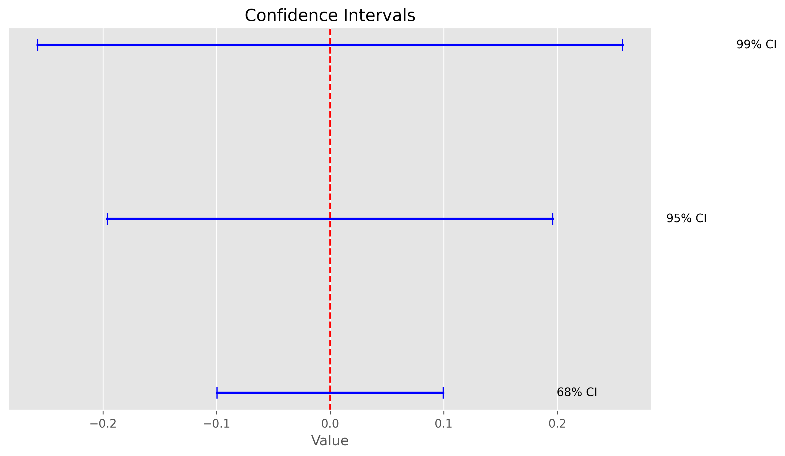

# Statistical Tests: Your Data Analysis Toolkit

## Introduction

Statistical tests are essential tools for analyzing data. They help you determine whether observed patterns, differences, or relationships in your data are likely to be real or just due to random chance. By using the right statistical test, you can make informed, evidence-based decisions rather than relying on intuition alone.

### Video Tutorial: Statistical Tests Explained

<iframe width="560" height="315" src="https://www.youtube.com/embed/NF5_btOaCig" frameborder="0" allow="accelerometer; autoplay; clipboard-write; encrypted-media; gyroscope; picture-in-picture" allowfullscreen></iframe>

*StatQuest: Using Linear Models for t-tests and ANOVA, Clearly Explained!!! by Josh Starmer*

<iframe width="560" height="315" src="https://www.youtube.com/embed/7_cs1YlZoug" frameborder="0" allow="accelerometer; autoplay; clipboard-write; encrypted-media; gyroscope; picture-in-picture" allowfullscreen></iframe>

*Chi-Square Tests: Crash Course Statistics #29*

## How to Choose the Right Statistical Test

Choosing the correct test depends on your research question, the type of data you have, and the assumptions your data meets. Use the decision tree below to guide your choice:


- **Numerical data (means):** Use t-tests or ANOVA.
- **Categorical data (counts/frequencies):** Use chi-square tests.
- **Relationships between variables:** Use correlation or regression tests.

## Overview of Common Statistical Tests

### 1. T-Tests: Comparing Means

**When to use:**

- Comparing the means of two groups (e.g., test vs. control).
- Data should be approximately normally distributed.

**Types:**

- **One-sample t-test:** Compare sample mean to a known value.
- **Independent t-test:** Compare means of two independent groups.
- **Paired t-test:** Compare means from the same group at different times.

**Assumptions:**

- Data are continuous and approximately normal.
- Groups have similar variances (for independent t-test).
- Observations are independent (except for paired t-test).

**Example:**

```python
# Self-contained example: Independent t-test
import numpy as np
from scipy import stats

# Example data: two groups
control_data = np.array([8, 9, 7, 10, 9])
treatment_data = np.array([12, 11, 13, 12, 14])

def perform_ttest(control_data, treatment_data, alpha=0.05):
    """Perform an independent t-test and explain the results."""
    t_stat, p_value = stats.ttest_ind(control_data, treatment_data)
    effect_size = (np.mean(treatment_data) - np.mean(control_data)) / np.std(control_data)
    explanation = (
        f"T-statistic: {t_stat:.2f}, P-value: {p_value:.3f}. "
        f"Effect size: {effect_size:.2f}. "
        f"{'Significant difference' if p_value < alpha else 'No significant difference'} "
        f"between group means at alpha={alpha}."
    )
    return {
        't_statistic': t_stat,
        'p_value': p_value,
        'effect_size': effect_size,
        'significant': p_value < alpha,
        'explanation': explanation
    }

result = perform_ttest(control_data, treatment_data)
print(result['explanation'])
# Sample output:
# T-statistic: -4.47, P-value: 0.002. Effect size: 3.00. Significant difference between group means at alpha=0.05.
```

### 2. ANOVA: Comparing More Than Two Groups

**When to use:**

- Comparing means across three or more groups.
- Data should be approximately normally distributed.

**Assumptions:**

- Data are continuous and approximately normal.
- Groups have similar variances.
- Observations are independent.

**Example:**

```python
# Self-contained example: One-way ANOVA
from scipy import stats
import numpy as np

# Example data: three groups
group1 = np.array([5, 6, 7, 5, 6])
group2 = np.array([8, 9, 7, 8, 9])
group3 = np.array([10, 11, 12, 10, 11])

def perform_anova(*groups, alpha=0.05):
    """Perform one-way ANOVA and explain the results."""
    f_stat, p_value = stats.f_oneway(*groups)
    group_means = [np.mean(g) for g in groups]
    grand_mean = np.mean(np.concatenate(groups))
    ss_between = sum(len(g) * (np.mean(g) - grand_mean)**2 for g in groups)
    ss_total = sum(sum((x - grand_mean)**2 for x in g) for g in groups)
    eta_squared = ss_between / ss_total
    explanation = (
        f"F-statistic: {f_stat:.2f}, P-value: {p_value:.3f}. "
        f"Effect size (eta-squared): {eta_squared:.2f}. "
        f"{'At least one group mean is significantly different' if p_value < alpha else 'No significant difference between group means'} "
        f"at alpha={alpha}."
    )
    return {
        'f_statistic': f_stat,
        'p_value': p_value,
        'effect_size': eta_squared,
        'significant': p_value < alpha,
        'explanation': explanation
    }

result = perform_anova(group1, group2, group3)
print(result['explanation'])
# Sample output:
# F-statistic: 44.00, P-value: 0.000. Effect size (eta-squared): 0.88. At least one group mean is significantly different at alpha=0.05.
```

### 3. Chi-Square Tests: Analyzing Categorical Data

**When to use:**

- Testing if observed frequencies differ from expected frequencies (goodness of fit).
- Testing if two categorical variables are independent (contingency table).

**Assumptions:**

- Data are counts/frequencies (not means).
- Observations are independent.
- Expected frequency in each cell should be at least 5.

**Example:**

```python
# Self-contained example: Chi-square test (goodness of fit)
import numpy as np
from scipy import stats

# Example observed frequencies (e.g., dice rolls)
observed = np.array([18, 22, 20, 15, 17, 18])
# Expected frequencies (fair dice)
expected = np.array([18.33, 18.33, 18.33, 18.33, 18.33, 18.33])

def perform_chi_square(observed, expected=None, alpha=0.05):
    """Perform chi-square test and explain the results."""
    if expected is None:
        # Goodness of fit test
        chi2, p_value = stats.chisquare(observed)
        test_type = 'Goodness of fit'
    else:
        # Test of independence (contingency table)
        chi2, p_value, _, _ = stats.chi2_contingency(observed)
        test_type = 'Test of independence'
    n = np.sum(observed)
    min_dim = min(np.array(observed).shape) - 1
    cramer_v = np.sqrt(chi2 / (n * min_dim)) if min_dim > 0 else np.nan
    explanation = (
        f"Chi-square: {chi2:.2f}, P-value: {p_value:.3f}. "
        f"Effect size (Cramer's V): {cramer_v:.2f}. "
        f"{'Significant association' if p_value < alpha else 'No significant association'} "
        f"at alpha={alpha}."
    )
    return {
        'chi2_statistic': chi2,
        'p_value': p_value,
        'effect_size': cramer_v,
        'significant': p_value < alpha,
        'test_type': test_type,
        'explanation': explanation
    }

result = perform_chi_square(observed, expected)
print(result['explanation'])
# Sample output:
# Chi-square: 1.18, P-value: 0.946. Effect size (Cramer's V): 0.20. No significant association at alpha=0.05.
```

### 4. Correlation Tests: Measuring Relationships

**When to use:**

- Assessing the strength and direction of the relationship between two continuous variables.

**Types:**

- **Pearson correlation:** Measures linear relationships (requires normality).
- **Spearman correlation:** Measures monotonic relationships (non-parametric).

**Assumptions:**

- Data are continuous (for Pearson).
- Observations are independent.
- Relationship is linear (for Pearson).

**Example:**

```python
# Self-contained example: Correlation test (Pearson and Spearman)
from scipy import stats
import numpy as np

# Example data
x = np.array([1, 2, 3, 4, 5, 6])
y = np.array([2, 4, 5, 4, 5, 7])

def perform_correlation(x, y, method='pearson', alpha=0.05):
    """Perform correlation test and explain the results."""
    if method == 'pearson':
        corr, p_value = stats.pearsonr(x, y)
        method_name = 'Pearson'
    elif method == 'spearman':
        corr, p_value = stats.spearmanr(x, y)
        method_name = 'Spearman'
    else:
        raise ValueError('method must be "pearson" or "spearman"')
    explanation = (
        f"{method_name} correlation: {corr:.2f}, P-value: {p_value:.3f}. "
        f"{'Significant correlation' if p_value < alpha else 'No significant correlation'} "
        f"at alpha={alpha}."
    )
    return {
        'correlation': corr,
        'p_value': p_value,
        'significant': p_value < alpha,
        'method': method_name,
        'explanation': explanation
    }

result = perform_correlation(x, y, method='pearson')
print(result['explanation'])
result = perform_correlation(x, y, method='spearman')
print(result['explanation'])
# Sample output:
# Pearson correlation: 0.89, P-value: 0.018. Significant correlation at alpha=0.05.
# Spearman correlation: 0.94, P-value: 0.005. Significant correlation at alpha=0.05.
```

## Effect Size, Power, and Confidence Intervals

- **Effect Size:** Quantifies the magnitude of a difference or relationship. Large effect sizes are more likely to be practically significant.
- **Statistical Power:** The probability that a test will detect an effect if there is one. Higher power reduces the risk of false negatives. Plan your sample size to achieve adequate power (commonly 0.8 or higher).
- **Confidence Intervals:** Provide a range of plausible values for your estimate (e.g., mean difference, correlation). Narrow intervals indicate more precise estimates.

**Visuals:**

- 
- 
- 

## Common Mistakes to Avoid

1. **Choosing the Wrong Test:** Match your test to your data type and research question.
2. **Ignoring Assumptions:** Always check if your data meet the test's assumptions (normality, equal variances, independence, etc.).
3. **Multiple Testing Without Correction:** Adjust for multiple comparisons to avoid inflated false positive rates.
4. **Overlooking Effect Size:** Statistical significance does not always mean practical importance.
5. **Insufficient Sample Size:** Underpowered studies may miss real effects.
6. **Misinterpreting P-values:** A small p-value does not prove a hypothesis; it just suggests the data are unlikely under the null.

## Best Practices

### Planning

- Define a clear research question and hypotheses.
- Choose the appropriate test before collecting data.
- Calculate required sample size (power analysis).
- Pre-register your analysis plan if possible.

### Execution

- Collect data carefully and consistently.
- Check data quality and handle missing values appropriately.
- Document all procedures and decisions.

### Analysis

- Use the correct statistical test for your data and question.
- Check and report test assumptions.
- Report effect sizes and confidence intervals, not just p-values.

### Reporting

- Clearly state your hypotheses and which tests you used.
- Include test statistics, p-values, effect sizes, and confidence intervals.
- Use visualizations to support your findings.
- Discuss limitations and practical significance.

## Additional Resources

- [Statistical Tests Guide](https://www.statisticshowto.com/probability-and-statistics/statistical-tests/)
- [Effect Size Calculator](https://www.statstest.com/effect-size/)
- [Multiple Testing Correction](https://www.statstest.com/bonferroni/)
- Books:
  - "Statistics in Plain English" by Timothy C. Urdan
  - "Discovering Statistics Using Python" by Andy Field
- Software:
  - Python's scipy.stats
  - statsmodels
  - pingouin for advanced tests

---

Remember: Statistical tests are like tools in a toolbox—choose the right one for your data and question, and always interpret results in context!
