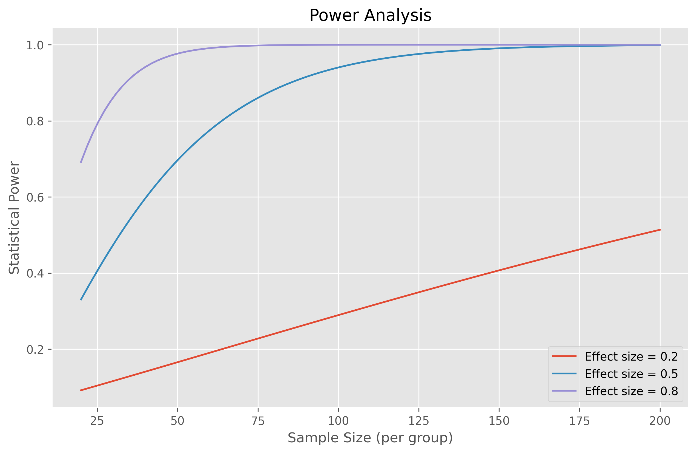

# Statistical Tests: Your Data Analysis Toolkit 🧰

## Introduction: Why Statistical Tests Matter 🎯

Think of statistical tests as your data detective tools - they help you uncover patterns, relationships, and differences that might not be obvious at first glance. Whether you're comparing customer groups, analyzing experimental results, or exploring relationships between variables, statistical tests help you make informed decisions based on evidence rather than intuition!

## The Statistical Tests Family Tree 🌳

### 1. T-Tests: Comparing Means 📊

Like comparing recipes by taste-testing - are they really different or just slightly varied?

```python
import numpy as np
import pandas as pd
from scipy import stats
import matplotlib.pyplot as plt
import seaborn as sns

class TTestAnalyzer:
    """A comprehensive t-test analysis toolkit"""
    
    def __init__(self, data1, data2=None, population_mean=None):
        self.data1 = data1
        self.data2 = data2
        self.pop_mean = population_mean
        
    def run_all_tests(self):
        """Run all applicable t-tests"""
        results = {}
        
        # One-sample t-test
        if self.pop_mean is not None:
            results['one_sample'] = self._one_sample_test()
        
        # Two-sample tests
        if self.data2 is not None:
            results['independent'] = self._independent_test()
            if len(self.data1) == len(self.data2):
                results['paired'] = self._paired_test()
        
        return pd.DataFrame(results).T
    
    def _one_sample_test(self):
        """Perform one-sample t-test"""
        t_stat, p_val = stats.ttest_1samp(self.data1, self.pop_mean)
        effect_size = (np.mean(self.data1) - self.pop_mean) / np.std(self.data1)
        return {
            'test_type': 'One-sample t-test',
            't_statistic': t_stat,
            'p_value': p_val,
            'effect_size': effect_size
        }
    
    def _independent_test(self):
        """Perform independent t-test"""
        t_stat, p_val = stats.ttest_ind(self.data1, self.data2)
        effect_size = (np.mean(self.data1) - np.mean(self.data2)) / \
                     np.sqrt((np.var(self.data1) + np.var(self.data2)) / 2)
        return {
            'test_type': 'Independent t-test',
            't_statistic': t_stat,
            'p_value': p_val,
            'effect_size': effect_size
        }
    
    def _paired_test(self):
        """Perform paired t-test"""
        t_stat, p_val = stats.ttest_rel(self.data1, self.data2)
        effect_size = np.mean(self.data1 - self.data2) / np.std(self.data1 - self.data2)
        return {
            'test_type': 'Paired t-test',
            't_statistic': t_stat,
            'p_value': p_val,
            'effect_size': effect_size
        }
    
    def visualize(self):
        """Create comprehensive visualization"""
        plt.figure(figsize=(15, 5))
        
        # Distribution plot
        plt.subplot(131)
        if self.data2 is not None:
            sns.kdeplot(self.data1, label='Group 1')
            sns.kdeplot(self.data2, label='Group 2')
        else:
            sns.kdeplot(self.data1)
            plt.axvline(self.pop_mean, color='r', linestyle='--', 
                       label=f'Population Mean ({self.pop_mean})')
        plt.title('Distribution Comparison')
        plt.legend()
        
        # Box plot
        plt.subplot(132)
        if self.data2 is not None:
            sns.boxplot(data=[self.data1, self.data2])
            plt.xticks([0, 1], ['Group 1', 'Group 2'])
        else:
            sns.boxplot(data=self.data1)
        plt.title('Box Plot')
        
        # Q-Q plot
        plt.subplot(133)
        stats.probplot(self.data1, dist="norm", plot=plt)
        plt.title('Q-Q Plot (Group 1)')
        
        plt.tight_layout()
        plt.savefig('docs/4-stat-analysis/4.2-hypotheses-testing/assets/t_test_analysis.png')
        plt.close()
```

### 2. ANOVA: Comparing Multiple Groups 🎭

Like being a judge in a cooking competition - are any of these dishes significantly different?

```python
class ANOVAAnalyzer:
    """ANOVA analysis toolkit"""
    
    def __init__(self, *groups, group_names=None):
        self.groups = groups
        self.group_names = group_names or [f'Group {i+1}' for i in range(len(groups))]
        
    def analyze(self):
        """Perform comprehensive ANOVA analysis"""
        # One-way ANOVA
        f_stat, p_val = stats.f_oneway(*self.groups)
        
        # Effect size (eta-squared)
        df_between = len(self.groups) - 1
        df_total = sum(len(group) for group in self.groups) - 1
        grand_mean = np.mean([np.mean(group) for group in self.groups])
        
        ss_between = sum(len(group) * (np.mean(group) - grand_mean)**2 
                        for group in self.groups)
        ss_total = sum(sum((x - grand_mean)**2) for group in self.groups)
        eta_squared = ss_between / ss_total
        
        # Post-hoc tests
        from itertools import combinations
        posthoc = []
        for i, j in combinations(range(len(self.groups)), 2):
            t_stat, p_val = stats.ttest_ind(self.groups[i], self.groups[j])
            posthoc.append({
                'comparison': f'{self.group_names[i]} vs {self.group_names[j]}',
                't_statistic': t_stat,
                'p_value': p_val
            })
        
        return {
            'anova_results': {
                'f_statistic': f_stat,
                'p_value': p_val,
                'eta_squared': eta_squared
            },
            'posthoc_tests': pd.DataFrame(posthoc)
        }
    
    def visualize(self):
        """Create comprehensive visualization"""
        plt.figure(figsize=(15, 5))
        
        # Box plot
        plt.subplot(131)
        sns.boxplot(data=self.groups)
        plt.xticks(range(len(self.groups)), self.group_names)
        plt.title('Group Comparisons')
        
        # Violin plot
        plt.subplot(132)
        sns.violinplot(data=self.groups)
        plt.xticks(range(len(self.groups)), self.group_names)
        plt.title('Distribution Shapes')
        
        # Mean plot with error bars
        plt.subplot(133)
        means = [np.mean(group) for group in self.groups]
        sems = [stats.sem(group) for group in self.groups]
        plt.errorbar(range(len(self.groups)), means, yerr=sems, fmt='o')
        plt.xticks(range(len(self.groups)), self.group_names)
        plt.title('Means with Standard Errors')
        
        plt.tight_layout()
        plt.savefig('docs/4-stat-analysis/4.2-hypotheses-testing/assets/anova_analysis.png')
        plt.close()
```

### 3. Chi-Square Tests: Analyzing Categories 📊

Like checking if dice are fair - are the outcomes distributed as expected?

```python
class ChiSquareAnalyzer:
    """Chi-square analysis toolkit"""
    
    def __init__(self, observed, expected=None):
        self.observed = np.array(observed)
        self.expected = np.array(expected) if expected is not None else None
        
    def analyze(self):
        """Perform chi-square analysis"""
        if self.expected is None:
            # Goodness of fit test
            chi2, p_val = stats.chisquare(self.observed)
            test_type = 'Goodness of fit'
        else:
            # Test of independence
            chi2, p_val = stats.chisquare(self.observed, self.expected)
            test_type = 'Test of independence'
        
        # Effect size (Cramer's V)
        n = np.sum(self.observed)
        min_dim = min(self.observed.shape) - 1
        cramer_v = np.sqrt(chi2 / (n * min_dim))
        
        return {
            'test_type': test_type,
            'chi_square': chi2,
            'p_value': p_val,
            'cramer_v': cramer_v
        }
    
    def visualize(self):
        """Create visualization"""
        plt.figure(figsize=(12, 5))
        
        # Observed vs Expected
        plt.subplot(121)
        x = np.arange(len(self.observed))
        width = 0.35
        
        plt.bar(x - width/2, self.observed, width, label='Observed')
        if self.expected is not None:
            plt.bar(x + width/2, self.expected, width, label='Expected')
        
        plt.title('Observed vs Expected Frequencies')
        plt.legend()
        
        # Residuals
        if self.expected is not None:
            plt.subplot(122)
            residuals = self.observed - self.expected
            plt.bar(x, residuals)
            plt.axhline(y=0, color='r', linestyle='--')
            plt.title('Residuals')
        
        plt.tight_layout()
        plt.savefig('docs/4-stat-analysis/4.2-hypotheses-testing/assets/chi_square_analysis.png')
        plt.close()
```

### 4. Correlation Tests: Measuring Relationships 🔄

Like checking if ice cream sales and temperature are related!

```python
class CorrelationAnalyzer:
    """Correlation analysis toolkit"""
    
    def __init__(self, x, y):
        self.x = x
        self.y = y
        
    def analyze(self):
        """Perform multiple correlation tests"""
        # Pearson correlation
        pearson_r, pearson_p = stats.pearsonr(self.x, self.y)
        
        # Spearman correlation
        spearman_r, spearman_p = stats.spearmanr(self.x, self.y)
        
        # Kendall's Tau
        kendall_tau, kendall_p = stats.kendalltau(self.x, self.y)
        
        return pd.DataFrame({
            'correlation': [pearson_r, spearman_r, kendall_tau],
            'p_value': [pearson_p, spearman_p, kendall_p]
        }, index=['Pearson', 'Spearman', 'Kendall'])
    
    def visualize(self):
        """Create correlation visualizations"""
        plt.figure(figsize=(15, 5))
        
        # Scatter plot
        plt.subplot(131)
        sns.scatterplot(x=self.x, y=self.y)
        plt.title('Scatter Plot')
        
        # Regression plot
        plt.subplot(132)
        sns.regplot(x=self.x, y=self.y)
        plt.title('Regression Plot')
        
        # Hexbin plot for large datasets
        plt.subplot(133)
        plt.hexbin(self.x, self.y, gridsize=20)
        plt.colorbar(label='Count')
        plt.title('Hexbin Plot')
        
        plt.tight_layout()
        plt.savefig('docs/4-stat-analysis/4.2-hypotheses-testing/assets/correlation_analysis.png')
        plt.close()
```

## Recommended Visualizations

To enhance understanding of statistical tests, we recommend adding the following visualizations:

1. **Statistical Test Decision Tree**
   - Interactive flowchart for choosing the right test
   - Based on data type and research question
   - Include common scenarios and examples

2. **Distribution Comparison**
   - Side-by-side comparison of different distributions
   - Show normal vs non-normal distributions
   - Demonstrate effect of sample size

3. **Effect Size Visualization**
   - Visual representation of different effect sizes
   - Show relationship between effect size and power
   - Include practical significance thresholds

4. **Confidence Interval Diagram**
   - Visual explanation of confidence intervals
   - Show relationship between sample size and interval width
   - Demonstrate interpretation

5. **Power Analysis Interface**
   - Interactive tool showing relationship between:
     - Sample size
     - Effect size
     - Power
     - Significance level

## Common Mistakes to Avoid

1. **Choosing the Wrong Test**
   - Consider data type and distribution
   - Check assumptions
   - Use appropriate test for your question

2. **Ignoring Assumptions**
   - Check normality
   - Verify equal variances
   - Test independence
   - Report violations

3. **Multiple Testing Without Correction**
   - Plan all comparisons in advance
   - Use appropriate correction methods
   - Report adjusted p-values

4. **Overlooking Effect Size**
   - Report effect sizes
   - Consider practical significance
   - Balance statistical and practical importance

5. **Insufficient Sample Size**
   - Calculate required sample size
   - Consider power analysis
   - Account for potential dropouts

## Best Practices

1. **Planning Phase**
   - Define clear research question
   - Choose appropriate test
   - Calculate required sample size
   - Check assumptions

2. **Execution Phase**
   - Collect data properly
   - Document procedures
   - Monitor data quality
   - Maintain consistency

3. **Analysis Phase**
   - Use appropriate software
   - Check assumptions
   - Report all results
   - Include effect sizes

4. **Reporting Phase**
   - Be transparent
   - Include visualizations
   - Discuss limitations
   - Make recommendations

## Additional Resources 📚

- [Statistical Test Calculator](https://www.socscistatistics.com/)
- [Effect Size Calculator](https://www.psychometrica.de/effect_size.html)
- [Interactive Test Selection Guide](https://stats.idre.ucla.edu/other/mult-pkg/whatstat/)

Remember: Statistical tests are like tools in a toolbox - choose the right one for the job! 🛠️

# Statistical Tests: Choosing and Using the Right Tools

## Introduction

Statistical tests are like different tools in a toolbox - each one has its specific purpose. This guide will help you choose and use the right statistical test for your data.

## Choosing the Right Test

Follow this decision tree to select the appropriate test:


## Understanding Effect Sizes

Different effect sizes and their interpretation:


## Statistical Power

Ensure your test can detect meaningful effects:


## Confidence Intervals

Interpret your results with precision:


## Common Statistical Tests

### T-Tests

```python
import numpy as np
from scipy import stats

def perform_ttest(control_data, treatment_data, alpha=0.05):
    """Perform an independent t-test"""
    t_stat, p_value = stats.ttest_ind(control_data, treatment_data)
    effect_size = (np.mean(treatment_data) - np.mean(control_data)) / np.std(control_data)
    
    return {
        't_statistic': t_stat,
        'p_value': p_value,
        'effect_size': effect_size,
        'significant': p_value < alpha
    }
```

### ANOVA

```python
def perform_anova(*groups, alpha=0.05):
    """Perform one-way ANOVA"""
    f_stat, p_value = stats.f_oneway(*groups)
    
    # Calculate effect size (eta-squared)
    groups_array = [np.array(g) for g in groups]
    grand_mean = np.mean([np.mean(g) for g in groups_array])
    
    ss_between = sum(len(g) * (np.mean(g) - grand_mean)**2 for g in groups_array)
    ss_total = sum(sum((x - grand_mean)**2) for g in groups_array for x in g)
    
    eta_squared = ss_between / ss_total
    
    return {
        'f_statistic': f_stat,
        'p_value': p_value,
        'effect_size': eta_squared,
        'significant': p_value < alpha
    }
```

### Chi-Square Tests

```python
def perform_chi_square(observed, expected=None, alpha=0.05):
    """Perform chi-square test"""
    if expected is None:
        # Goodness of fit test
        chi2, p_value = stats.chisquare(observed)
    else:
        # Test of independence
        chi2, p_value = stats.chi2_contingency(observed)[:2]
    
    # Calculate effect size (Cramer's V)
    n = np.sum(observed)
    min_dim = min(observed.shape) - 1
    cramer_v = np.sqrt(chi2 / (n * min_dim))
    
    return {
        'chi2_statistic': chi2,
        'p_value': p_value,
        'effect_size': cramer_v,
        'significant': p_value < alpha
    }
```

## Common Mistakes to Avoid

1. Using the wrong test
2. Violating assumptions
3. Ignoring effect sizes
4. Multiple testing without correction
5. Misinterpreting p-values

## Best Practices

### Test Selection

1. Consider your data type
2. Check test assumptions
3. Think about effect sizes
4. Plan for multiple testing

### Test Execution

1. Verify data quality
2. Check for outliers
3. Handle missing values
4. Document procedures

### Result Interpretation

1. Look beyond p-values
2. Consider effect sizes
3. Use confidence intervals
4. Think about practical significance

### Reporting

1. State hypotheses clearly
2. Report test statistics
3. Include effect sizes
4. Acknowledge limitations

## Additional Resources

1. Books:
   - "Statistics in Plain English" by Timothy C. Urdan
   - "Discovering Statistics Using Python" by Andy Field

2. Online Resources:
   - UCLA Statistical Computing
   - Penn State STAT 500
   - R Statistics Handbook

3. Software:
   - Python's scipy.stats
   - statsmodels
   - pingouin for advanced tests
