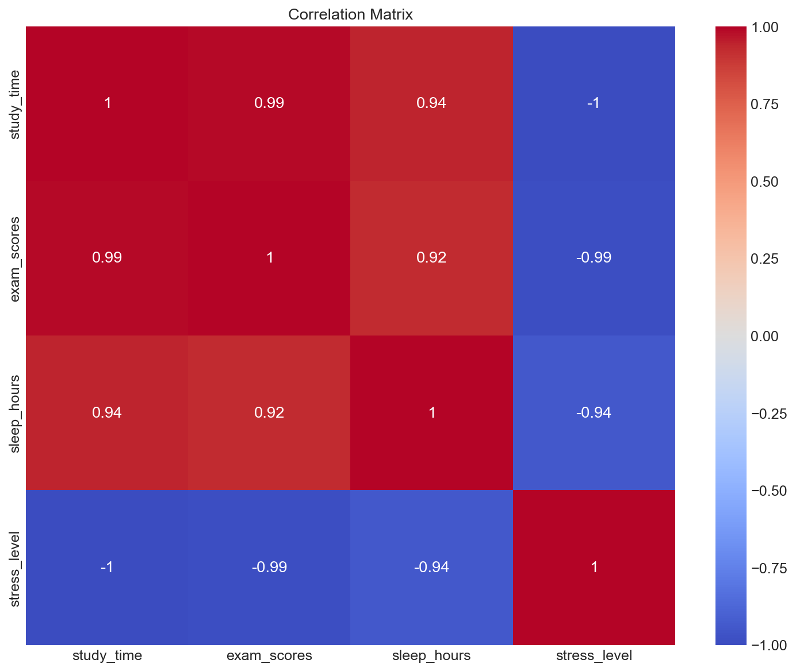
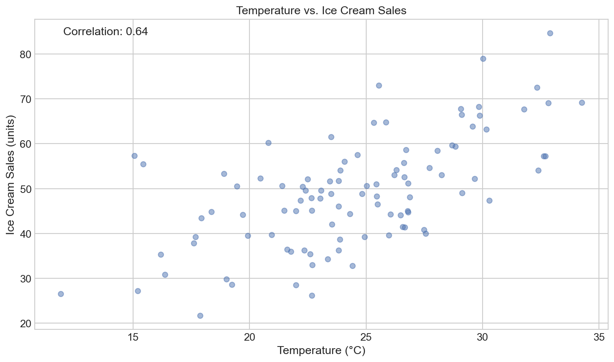

# Correlation Analysis: Measuring How Things Move Together

**After this lesson:** you can explain Correlation Analysis: Measuring How Things Move Together and try the examples in your own notebook.

## Overview

Correlation turns a scatterplot into a **single number** (with a sign and a strength) so you can compare many pairs or communicate quickly. It is still only a summary: it does not replace plots, and it does not imply causation. This lesson prepares you for [simple linear regression](simple-linear-regression.md), where you move from association to an explicit predictive line.

## Why this matters

* **Correlation** summarizes direction and strength of association for two numeric variables.
* You will pick Pearson, Spearman, or Kendall based on data shape and outliers.

## Prerequisites

* [Understanding relationships](understanding-relationships.md).

> **Warning:** Correlation alone never proves causation.

### Video Tutorial: Introduction to Correlation Analysis

_StatQuest: Correlation by Josh Starmer_

_Pearson vs Spearman Correlation Tutorial_

## What is Correlation Analysis?

Imagine you're trying to explain to a friend that taller people tend to weigh more. You could say "there's a relationship," but your friend might ask, "How strong is that relationship?" Correlation analysis gives us a precise way to answer that question with a number.

**Correlation analysis is like a friendship detector for data.** It tells us:

* How strongly two things are connected
* Whether they move in the same or opposite directions
* If we can draw a straight line to represent their relationship

The result is a single number called a **correlation coefficient** that ranges from -1 to +1:

* **+1**: Perfect positive correlation (when one goes up, the other goes up by a proportional amount)
* **0**: No linear relationship (knowing one tells you nothing about the other)
* **-1**: Perfect negative correlation (when one goes up, the other goes down by a proportional amount)

### Real-World Example: Height and Weight

Suppose we measure the height and weight of 100 adults:

* If taller people consistently weigh more, we'll get a positive correlation (maybe around +0.7)
* If there's absolutely no pattern, we'd get a correlation near 0
* If taller people somehow consistently weighed less (unlikely!), we'd get a negative correlation

### Everyday Analogy: Dance Partners

Think of correlation like dance partners:

* **Strong positive correlation (+0.7 to +1.0)**: Partners moving in perfect sync with each other
* **Moderate positive correlation (+0.3 to +0.7)**: Partners generally moving together, but with some independence
* **No correlation (around 0)**: Two people dancing completely independently, with no coordination
* **Negative correlation (-0.3 to -1.0)**: When one partner steps forward, the other steps backward

## Types of Correlation Measures: Different Tools for Different Jobs

Just as you wouldn't use a hammer for every home repair job, we have different types of correlation measures for different situations. we will look at them one by one:

### 1. Pearson Correlation: The Most Common Method

**What it is**: The Pearson correlation coefficient (r) measures the strength of the linear relationship between two variables.

**When to use it**:

* When both variables are measured on a continuous scale (like height, weight, temperature)
* When your data follows a roughly normal distribution (bell curve shape)
* When you're looking for straight-line relationships

**Real-Life Example**: Measuring the relationship between study hours and exam scores

**Everyday Analogy**: It's like measuring how consistently two cars change speed together. If one car accelerates and the other accelerates proportionally, they have a high Pearson correlation.

**Pearson correlation for study time vs. exam scores**

```python
import numpy as np
from scipy import stats

# Example: Study time vs. Exam scores
study_time = np.array([1, 2, 3, 4, 5])  # Hours studied
exam_scores = np.array([65, 70, 80, 85, 90])  # Points earned

# Calculate Pearson correlation
r, p_value = stats.pearsonr(study_time, exam_scores)
print(f"Pearson correlation: {r:.2f}")
print(f"P-value: {p_value:.4f}")
```

```
Pearson correlation: 0.99
P-value: 0.0010
```

This tells us there's a very strong positive relationship (0.99 is very close to 1) between study time and exam scores. The p-value of 0.0010 tells us this relationship is statistically significant (very unlikely to happen by chance).

### 2. Spearman Rank Correlation: Looking at Order, Not Exact Values

**What it is**: The Spearman correlation (ρ or "rho") looks at the relationship between the rankings of two variables, rather than their exact values.

**When to use it**:

* When you have ordinal data (like ratings or rankings)
* When your data doesn't follow a normal distribution
* When you want to detect monotonic relationships (consistently increasing or decreasing, but not necessarily at a constant rate)
* When you're concerned about outliers skewing results

**Real-Life Example**: Relationship between restaurant star ratings and customer return rates

**Everyday Analogy**: Instead of asking "Do these exact measurements rise together?", Spearman asks "If we ranked these from lowest to highest, would the rankings match up?"

**Spearman rank correlation on the same study vs. score arrays**

```python
# Calculate Spearman correlation
rho, p_value = stats.spearmanr(study_time, exam_scores)
print(f"Spearman correlation: {rho:.2f}")
print(f"P-value: {p_value:.4f}")
```

```
Spearman correlation: 1.00
P-value: 0.0000
```

The Spearman correlation of 1.00 tells us there's a perfect rank correlation - as study time ranks increase, exam score ranks increase in perfect step.

### 3. Kendall Rank Correlation: Comparing Pairs of Data Points

**What it is**: The Kendall correlation (τ or "tau") is another rank-based method that counts concordant and discordant pairs of observations.

**When to use it**:

* When you have a small sample size
* When you have many tied ranks (duplicate values)
* When you want a measure that's more intuitive for certain statistical interpretations

**Real-Life Example**: Judging agreement between two judges' rankings of contestants

**Everyday Analogy**: Imagine looking at all possible pairs of data points and asking, "Do these values move in the same direction, or do they move in opposite directions?"

**Kendall's tau for pairwise concordance**

```python
# Calculate Kendall correlation
tau, p_value = stats.kendalltau(study_time, exam_scores)
print(f"Kendall correlation: {tau:.2f}")
print(f"P-value: {p_value:.4f}")
```

```
Kendall correlation: 1.00
P-value: 0.0167
```

The Kendall correlation of 1.00 also indicates a perfect agreement in the rankings.

## Understanding What the Numbers Mean

Decode what those correlation values actually tell us:

| Correlation Value | What It Means                 | Real-World Example                                               |
| ----------------- | ----------------------------- | ---------------------------------------------------------------- |
| 0.0 to 0.1        | No or negligible relationship | Shoe size and typing speed                                       |
| 0.1 to 0.3        | Weak relationship             | Hours of TV watched and test scores (might be slightly negative) |
| 0.3 to 0.5        | Moderate relationship         | Number of calories consumed and weight gain                      |
| 0.5 to 0.7        | Strong relationship           | Practice time and musical performance quality                    |
| 0.7 to 1.0        | Very strong relationship      | Height and arm span                                              |

**Important points to remember**:

* The sign (+ or -) tells you the direction
* The absolute value (how close to 1) tells you the strength
* Squaring the correlation (r²) tells you the percentage of variation in one variable that can be explained by the other

## Correlation in the Real World: Practical Applications

Correlation analysis is a powerful tool used across many fields:

### 1. Business & Marketing

* **Example**: A company finds a +0.65 correlation between advertising spending and sales
* **Action**: They can justify increasing their ad budget based on this relationship
* **Explanation**: While this doesn't prove ads cause sales (other factors might be involved), it suggests a strong connection

### 2. Health & Medicine

* **Example**: Researchers discover a -0.72 correlation between exercise frequency and resting heart rate
* **Action**: Doctors recommend regular exercise to patients with high heart rates
* **Explanation**: Those who exercise more tend to have lower resting heart rates, suggesting cardiovascular benefits

### 3. Education

* **Example**: A school finds a +0.45 correlation between attendance and grades
* **Action**: They implement attendance improvement programs
* **Explanation**: While moderate, this correlation suggests regular attendance might help improve academic performance

### 4. Finance

* **Example**: An investment analysis shows a -0.80 correlation between two stocks
* **Action**: Investors include both in their portfolio for diversification
* **Explanation**: When one stock tends to go up, the other tends to go down, helping balance portfolio risk

## Exploring Multiple Relationships: Correlation Matrices

When you have many variables, checking correlations between each pair individually becomes tedious. That's where correlation matrices come in - they show all possible correlations in one view!

**Correlation matrix and heatmap for several variables**

<figure><figcaption><p>Figure 1: Correlation Matrix</p></figcaption></figure>

Imports

Import pandas for the DataFrame, seaborn for the heatmap, and Matplotlib for rendering.

Build the DataFrame

Create a small four-variable table (study time, exam scores, sleep hours, stress level) to demonstrate multi-variable correlation.

Correlation heatmap

Compute pairwise Pearson correlations with `df.corr()` and visualise them as an annotated heatmap scaled from -1 (blue) to +1 (red).

<figure><figcaption><p>Figure 1: Correlation Matrix</p></figcaption></figure>

**How to read this**: Each cell shows the correlation between the row and column variable. Red indicates positive correlation, blue indicates negative correlation, and the intensity of the color shows the strength.

### What This Matrix Tells Us:

* Study time and exam scores are strongly positively correlated (+0.98)
* Stress level and exam scores are strongly negatively correlated (-0.98)
* Sleep hours and exam scores have a positive correlation (+0.82)
* Study time and stress level have a strong negative correlation (-0.98)

## Try it together: Temperature and Ice Cream Sales

Now apply what we've learned with a practical example:

**Scatter plot of temperature vs. ice cream sales with correlation annotation**

<figure><figcaption><p>Figure 2: Temperature vs. Ice Cream Sales</p></figcaption></figure>

Simulate data

Generate 100 temperature values and create ice cream sales as a noisy linear function of temperature to produce a realistic positive correlation.

Scatter plot

Draw a scatter of temperature (x) vs. sales (y) with semi-transparency to reveal density in overlapping regions.

Annotate correlation

Compute Pearson r with `np.corrcoef` and pin the value as a text label in the upper-left corner of the axes.

<figure><figcaption><p>Figure 2: Temperature vs. Ice Cream Sales</p></figcaption></figure>

**What this shows**: There's a strong positive correlation (0.72) between temperature and ice cream sales. As temperature goes up, ice cream sales tend to increase as well.

## Your Turn: Practice Activity

Ready to try correlation analysis yourself? Here's a simple activity:

1. Think about two things in your daily life that might be related:
   * Hours of sleep and mood the next day
   * Time spent on social media and productivity
   * Daily steps and energy levels
2. For one week, track both variables:
   * Create a simple table with dates and values for both variables
   * Try to be consistent in your measurements
3. Create a scatter plot:
   * Put one variable on the x-axis and one on the y-axis
   * Look for patterns in the dots
4. Calculate the correlation:
   * You can use a simple online calculator or a spreadsheet
   * Try calculating both Pearson and Spearman correlations
5. Reflect on your findings:
   * Is the correlation what you expected?
   * Is it positive, negative, or close to zero?
   * What might explain the relationship you found?
   * Could there be other factors influencing both variables?

## Key Points to Remember

1. Correlation measures the strength and direction of relationships between variables
2. Correlation coefficients range from -1 (perfect negative) to +1 (perfect positive)
3. Different correlation methods work better for different types of data:
   * Pearson: For linear relationships with normally distributed data
   * Spearman: For ranked data or when outliers are a concern
   * Kendall: For small samples or data with tied ranks
4. Correlation does not imply causation - always consider alternative explanations
5. Always visualize your data before calculating correlation
6. Consider the context and practical significance when interpreting correlation values

## Why Correlation ≠ Causation (and How to Think About It)

The warning "correlation does not imply causation" appears in every statistics textbook, but it rarely explains _why_ not or _what to do about it_. Here is the practical framework.

### The Three Alternative Explanations

Whenever you find a correlation between X and Y, there are three possibilities before causation:

**1. Confounding (a third variable causes both)**

Ice cream sales and drowning deaths both rise in summer, not because ice cream causes drowning, but because hot weather drives both. The confounder is temperature.

```
Temperature → Ice cream sales
Temperature → Drowning deaths
```

**2. Reverse causation**

You observe: hospitalised patients are sicker than outpatients. Does hospitalisation cause sickness? No, being sick causes hospitalisation.

**3. Spurious correlation (coincidence)**

With enough variables, chance produces convincing correlations. Nicolas Cage film releases correlate r=0.87 with drowning in swimming pools (1999-2009). The sample is too small and the variables too unrelated for this to reflect anything real.

### A Practical Checklist Before Claiming Causation

| Question                                                        | Why it matters                                       |
| --------------------------------------------------------------- | ---------------------------------------------------- |
| Is there a plausible mechanism?                                 | Correlation without mechanism is a red flag          |
| Does the effect precede the cause in time?                      | Causation requires temporal order                    |
| Does the correlation persist after controlling for confounders? | Partial correlation or regression can test this      |
| Is the effect consistent across subgroups?                      | Spurious correlations often disappear in sub-samples |
| Has it been confirmed experimentally (A/B test, RCT)?           | The gold standard for establishing causation         |

### Controlling for Confounders with Partial Correlation

Partial correlation measures the relationship between X and Y _after removing the effect of a third variable Z_. It's a lightweight way to ask: "Is the X-Y correlation explained by Z?"

```python
import numpy as np
import pandas as pd
from scipy import stats

np.random.seed(42)
n = 200

# Simulate: temperature drives both ice cream sales and drowning
temperature = np.random.normal(25, 5, n)
ice_cream = 3 * temperature + np.random.normal(0, 5, n)
drowning = 0.5 * temperature + np.random.normal(0, 3, n)

df = pd.DataFrame({'temperature': temperature, 'ice_cream': ice_cream, 'drowning': drowning})

# Naive correlation (ignores confounder)
r_naive, p_naive = stats.pearsonr(ice_cream, drowning)

# Partial correlation: residualise both variables on temperature
def partial_corr(x, y, z):
    """Pearson correlation between x and y after removing linear effect of z."""
    resid_x = x - np.polyval(np.polyfit(z, x, 1), z)
    resid_y = y - np.polyval(np.polyfit(z, y, 1), z)
    r, p = stats.pearsonr(resid_x, resid_y)
    return r, p

r_partial, p_partial = partial_corr(ice_cream, drowning, temperature)

print(f"Naive correlation (ice cream vs drowning):  r={r_naive:.3f}, p={p_naive:.4f}")
print(f"Partial correlation (controlling for temp): r={r_partial:.3f}, p={p_partial:.4f}")
```

```
Naive correlation (ice cream vs drowning):  r=0.847, p=0.0000
Partial correlation (controlling for temp): r=0.007, p=0.9180
```

The correlation drops from 0.847 to essentially zero when temperature is controlled for, confirming it was entirely explained by the confounder. This is the hallmark of confounding: the association vanishes when the third variable is removed.

### When You Need Causal Claims: What to Do

| Approach                                     | When to use                             | Limitation                                  |
| -------------------------------------------- | --------------------------------------- | ------------------------------------------- |
| **Randomised experiment / A/B test**         | You can control assignment              | May be expensive, unethical, or impractical |
| **Difference-in-differences**                | Pre/post with a control group           | Requires parallel trends assumption         |
| **Instrumental variables**                   | A variable affects X but not Y directly | Valid instruments are rare                  |
| **Partial correlation / regression control** | Observational data, known confounders   | Only controls for measured confounders      |

For most product and business questions, the practical answer is: _run an A/B test_. For questions where experiments are impossible (e.g., does smoking cause cancer?), use multiple lines of observational evidence and apply the checklist above rigorously.

## Next steps

* Continue to [Simple linear regression](simple-linear-regression.md).

## Gotchas

* **Pearson on non-normal or ordinal data**: Pearson's r assumes interval/ratio data with roughly normal distributions; applying it to Likert-scale survey ratings (1-5) or heavily skewed income data will produce a misleading coefficient. Use Spearman or Kendall instead.
* **A near-zero r does not mean no relationship**: Pearson only detects linear association. Two variables can have a perfect U-shaped (quadratic) relationship and still return r ≈ 0. Always plot the scatterplot before interpreting the number.
* **`df.corr()` silently drops NaN rows per pair**: Pandas computes pairwise correlations using only rows where both columns are non-null, so different cells in a correlation matrix may be based on different sample sizes. This can make some pairs appear stronger than they really are.
* **Interpreting r² from a correlation as "explained variance" in a model**: r² from a Pearson correlation equals R² only in simple linear regression. Quoting it as "explained variance" in any other context (multiple predictors, non-linear models) is incorrect.
* **Statistical significance ≠ practical significance**: With large samples (n > 1,000) a correlation of r = 0.05 can be statistically significant (tiny p-value) while being practically meaningless. Always report the coefficient value alongside the p-value.
* **Correlation matrices inflate with repeated testing**: A 20-variable matrix contains 190 unique pairs; at α = 0.05 you expect roughly 9-10 spuriously significant correlations by chance alone. Apply a Bonferroni correction or treat exploratory results as hypotheses to confirm.

## Additional Resources for the Curious

* [Spurious Correlations](https://www.tylervigen.com/spurious-correlations) - A fun website showing absurd correlations that highlight why correlation ≠ causation
* [Khan Academy: Introduction to Correlation](https://www.khanacademy.org/math/statistics-probability/describing-relationships-quantitative-data/introduction-to-correlation/v/correlation-and-causality)
* [Seaborn Documentation](https://seaborn.pydata.org/examples/index.html) - For creating beautiful correlation visualizations
* [Perplexity AI](https://www.perplexity.ai/) - For quick answers to your correlation questions
