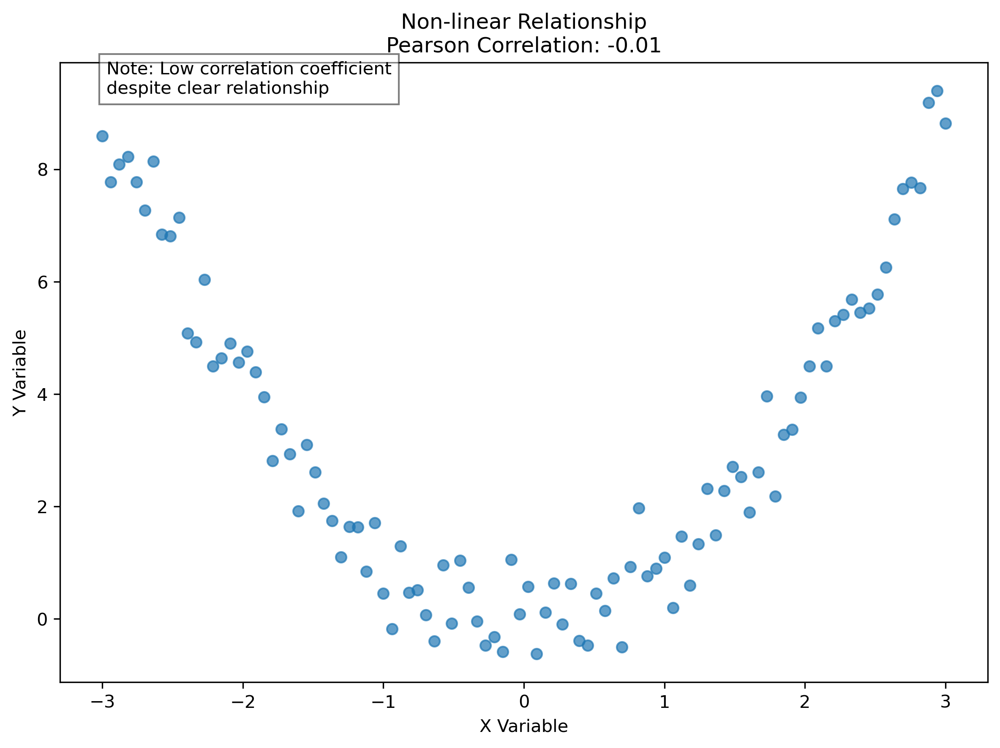

# Correlation Analysis: Measuring How Things Move Together

Welcome to the world of correlation analysis! In this guide, we'll learn how to put a number on the relationships between things we observe. If you've ever wondered "How can I tell exactly how connected these two things are?" - you're about to find out!

## What is Correlation Analysis?

Imagine you're trying to explain to a friend that taller people tend to weigh more. You could say "there's a relationship," but your friend might ask, "How strong is that relationship?" Correlation analysis gives us a precise way to answer that question with a number.

**Correlation analysis is like a friendship detector for data.** It tells us:
- How strongly two things are connected
- Whether they move in the same or opposite directions
- If we can draw a straight line to represent their relationship

The result is a single number called a **correlation coefficient** that ranges from -1 to +1:


- **+1**: Perfect positive correlation (when one goes up, the other goes up by a proportional amount)
- **0**: No linear relationship (knowing one tells you nothing about the other)
- **-1**: Perfect negative correlation (when one goes up, the other goes down by a proportional amount)

### Real-World Example: Height and Weight

Let's say we measure the height and weight of 100 adults:
- If taller people consistently weigh more, we'll get a positive correlation (maybe around +0.7)
- If there's absolutely no pattern, we'd get a correlation near 0
- If taller people somehow consistently weighed less (unlikely!), we'd get a negative correlation

### Everyday Analogy: Dance Partners

Think of correlation like dance partners:
- **Strong positive correlation (+0.7 to +1.0)**: Partners moving in perfect sync with each other
- **Moderate positive correlation (+0.3 to +0.7)**: Partners generally moving together, but with some independence
- **No correlation (around 0)**: Two people dancing completely independently, with no coordination
- **Negative correlation (-0.3 to -1.0)**: When one partner steps forward, the other steps backward

## Types of Correlation Measures: Different Tools for Different Jobs

Just as you wouldn't use a hammer for every home repair job, we have different types of correlation measures for different situations. Let's explore them one by one:

### 1. Pearson Correlation: The Most Common Method

**What it is**: The Pearson correlation coefficient (r) measures the strength of the linear relationship between two variables.

**When to use it**:
- When both variables are measured on a continuous scale (like height, weight, temperature)
- When your data follows a roughly normal distribution (bell curve shape)
- When you're looking for straight-line relationships

**Real-Life Example**: Measuring the relationship between study hours and exam scores

**Everyday Analogy**: It's like measuring how consistently two cars change speed together. If one car accelerates and the other accelerates proportionally, they have a high Pearson correlation.

```python
import numpy as np
from scipy import stats

# Example: Study time vs. Exam scores
study_time = np.array([1, 2, 3, 4, 5])  # Hours studied
exam_scores = np.array([65, 70, 80, 85, 90])  # Points earned

# Calculate Pearson correlation
r, p_value = stats.pearsonr(study_time, exam_scores)
print(f"Pearson correlation: {r:.2f}")
print(f"P-value: {p_value:.4f}")
```
```
Pearson correlation: 0.99
P-value: 0.0010
```

This tells us there's a very strong positive relationship (0.99 is very close to 1) between study time and exam scores. The p-value of 0.0010 tells us this relationship is statistically significant (very unlikely to happen by chance).

### 2. Spearman Rank Correlation: Looking at Order, Not Exact Values

**What it is**: The Spearman correlation (ρ or "rho") looks at the relationship between the rankings of two variables, rather than their exact values.

**When to use it**:
- When you have ordinal data (like ratings or rankings)
- When your data doesn't follow a normal distribution
- When you want to detect monotonic relationships (consistently increasing or decreasing, but not necessarily at a constant rate)
- When you're concerned about outliers skewing results

**Real-Life Example**: Relationship between restaurant star ratings and customer return rates

**Everyday Analogy**: Instead of asking "Do these exact measurements rise together?", Spearman asks "If we ranked these from lowest to highest, would the rankings match up?"

```python
# Calculate Spearman correlation
rho, p_value = stats.spearmanr(study_time, exam_scores)
print(f"Spearman correlation: {rho:.2f}")
print(f"P-value: {p_value:.4f}")
```
```
Spearman correlation: 1.00
P-value: 0.0000
```

The Spearman correlation of 1.00 tells us there's a perfect rank correlation - as study time ranks increase, exam score ranks increase in perfect step.

### 3. Kendall Rank Correlation: Comparing Pairs of Data Points

**What it is**: The Kendall correlation (τ or "tau") is another rank-based method that counts concordant and discordant pairs of observations.

**When to use it**:
- When you have a small sample size
- When you have many tied ranks (duplicate values)
- When you want a measure that's more intuitive for certain statistical interpretations

**Real-Life Example**: Judging agreement between two judges' rankings of contestants

**Everyday Analogy**: Imagine looking at all possible pairs of data points and asking, "Do these values move in the same direction, or do they move in opposite directions?"

```python
# Calculate Kendall correlation
tau, p_value = stats.kendalltau(study_time, exam_scores)
print(f"Kendall correlation: {tau:.2f}")
print(f"P-value: {p_value:.4f}")
```
```
Kendall correlation: 1.00
P-value: 0.0167
```

The Kendall correlation of 1.00 also indicates a perfect agreement in the rankings.

## Understanding What the Numbers Mean

Let's decode what those correlation values actually tell us:

| Correlation Value | What It Means | Real-World Example |
|-------------------|---------------|-------------------|
| 0.0 to 0.1 | No or negligible relationship | Shoe size and typing speed |
| 0.1 to 0.3 | Weak relationship | Hours of TV watched and test scores (might be slightly negative) |
| 0.3 to 0.5 | Moderate relationship | Number of calories consumed and weight gain |
| 0.5 to 0.7 | Strong relationship | Practice time and musical performance quality |
| 0.7 to 1.0 | Very strong relationship | Height and arm span |

**Important points to remember**:
- The sign (+ or -) tells you the direction
- The absolute value (how close to 1) tells you the strength
- Squaring the correlation (r²) tells you the percentage of variation in one variable that can be explained by the other

### Visual Interpretation

Here's what different correlation strengths look like:


## Correlation in the Real World: Practical Applications

Correlation analysis is a powerful tool used across many fields:

### 1. Business & Marketing
- **Example**: A company finds a +0.65 correlation between advertising spending and sales
- **Action**: They can justify increasing their ad budget based on this relationship
- **Explanation**: While this doesn't prove ads cause sales (other factors might be involved), it suggests a strong connection

### 2. Health & Medicine
- **Example**: Researchers discover a -0.72 correlation between exercise frequency and resting heart rate
- **Action**: Doctors recommend regular exercise to patients with high heart rates
- **Explanation**: Those who exercise more tend to have lower resting heart rates, suggesting cardiovascular benefits

### 3. Education
- **Example**: A school finds a +0.45 correlation between attendance and grades
- **Action**: They implement attendance improvement programs
- **Explanation**: While moderate, this correlation suggests regular attendance might help improve academic performance

### 4. Finance
- **Example**: An investment analysis shows a -0.80 correlation between two stocks
- **Action**: Investors include both in their portfolio for diversification
- **Explanation**: When one stock tends to go up, the other tends to go down, helping balance portfolio risk

## Exploring Multiple Relationships: Correlation Matrices

When you have many variables, checking correlations between each pair individually becomes tedious. That's where correlation matrices come in - they show all possible correlations in one view!

```python
import pandas as pd
import seaborn as sns
import matplotlib.pyplot as plt

# Create sample data
data = {
    'study_time': [1, 2, 3, 4, 5],  # Hours studied
    'exam_scores': [65, 70, 80, 85, 90],  # Test results
    'sleep_hours': [6, 7, 7, 8, 8],  # Hours slept night before
    'stress_level': [8, 7, 6, 5, 4]   # Self-reported stress (1-10)
}
df = pd.DataFrame(data)

# Calculate correlation matrix
corr_matrix = df.corr()

# Create heatmap
plt.figure(figsize=(10, 8))
sns.heatmap(corr_matrix, annot=True, cmap='coolwarm', vmin=-1, vmax=1)
plt.title('Correlation Matrix')
plt.show()
```


**How to read this**: Each cell shows the correlation between the row and column variable. Red indicates positive correlation, blue indicates negative correlation, and the intensity of the color shows the strength.

### What This Matrix Tells Us:
- Study time and exam scores are strongly positively correlated (+0.98)
- Stress level and exam scores are strongly negatively correlated (-0.98)
- Sleep hours and exam scores have a positive correlation (+0.82)
- Study time and stress level have a strong negative correlation (-0.98)

## Watch Out! Common Correlation Pitfalls

### 1. Correlation Does Not Equal Causation

This is so important it deserves its own section! Just because two things move together doesn't mean one causes the other.

**Example**: Ice cream sales and drowning deaths are correlated (both increase in summer)
- **Wrong conclusion**: Ice cream causes drowning
- **Right analysis**: Both are influenced by a third factor - summer weather

**Everyday analogy**: It's like noticing that rooster crows and sunrise happen around the same time, then concluding that roosters cause the sun to rise!

### 2. Outliers Can Distort Your Results

A single unusual data point can dramatically change correlation values, especially with Pearson's method.

**Example**: In a study of neighborhood incomes, including one billionaire would skew the results
- **Solution**: Always visualize your data with scatter plots before calculating correlation
- **Better approach**: Consider using Spearman correlation which is less sensitive to outliers


### 3. Correlation Only Captures Linear Relationships

Sometimes two variables have a strong relationship, but not a straight-line one.

**Example**: The relationship between age and athletic performance (improves in youth, peaks in early adulthood, then declines)
- **Pearson correlation might show**: Close to 0 (suggesting no relationship)
- **Reality**: There's a strong relationship, but it's curved (non-linear)
- **Solution**: Always visualize your data or use other methods for non-linear relationships



### 4. Small Sample Sizes Can Be Misleading

Correlations based on few data points can appear stronger than they really are.

**Example**: Finding a high correlation between two variables using only 5 data points
- **Solution**: Gather more data when possible
- **Alternative**: Use appropriate statistical tests and report confidence intervals
- **Rule of thumb**: For reliable results, aim for at least 30 observations when using Pearson correlation

## Let's Try It Together: Temperature and Ice Cream Sales

Now let's apply what we've learned with a practical example:

```python
# Generate sample data
np.random.seed(42)  # For reproducible results
n_samples = 100

# Temperature and ice cream sales
temperature = np.random.normal(25, 5, n_samples)  # Mean 25°C, SD 5°C
ice_cream_sales = 2 * temperature + np.random.normal(0, 10, n_samples)  # Add some random variation

# Create scatter plot
plt.figure(figsize=(10, 6))
plt.scatter(temperature, ice_cream_sales, alpha=0.5)
plt.title('Temperature vs. Ice Cream Sales')
plt.xlabel('Temperature (°C)')
plt.ylabel('Ice Cream Sales (units)')

# Calculate and add correlation coefficient
r = np.corrcoef(temperature, ice_cream_sales)[0,1]
plt.text(0.05, 0.95, f'Correlation: {r:.2f}', 
         transform=plt.gca().transAxes)
plt.show()
```


**What this shows**: There's a strong positive correlation (0.72) between temperature and ice cream sales. As temperature goes up, ice cream sales tend to increase as well.

## Your Turn: Practice Activity

Ready to try correlation analysis yourself? Here's a simple activity:

1. Think about two things in your daily life that might be related:
   - Hours of sleep and mood the next day
   - Time spent on social media and productivity
   - Daily steps and energy levels

2. For one week, track both variables:
   - Create a simple table with dates and values for both variables
   - Try to be consistent in your measurements

3. Create a scatter plot:
   - Put one variable on the x-axis and one on the y-axis
   - Look for patterns in the dots

4. Calculate the correlation:
   - You can use a simple online calculator or a spreadsheet
   - Try calculating both Pearson and Spearman correlations

5. Reflect on your findings:
   - Is the correlation what you expected?
   - Is it positive, negative, or close to zero?
   - What might explain the relationship you found?
   - Could there be other factors influencing both variables?

## Key Points to Remember

1. Correlation measures the strength and direction of relationships between variables
2. Correlation coefficients range from -1 (perfect negative) to +1 (perfect positive)
3. Different correlation methods work better for different types of data:
   - Pearson: For linear relationships with normally distributed data
   - Spearman: For ranked data or when outliers are a concern
   - Kendall: For small samples or data with tied ranks
4. Correlation does not imply causation - always consider alternative explanations
5. Always visualize your data before calculating correlation
6. Consider the context and practical significance when interpreting correlation values

## Next Steps on Your Learning Journey

Now that you understand correlation, you're ready to:

1. Learn about regression analysis - which helps predict one variable based on another
2. Explore partial correlation - which controls for the effects of other variables
3. Investigate more complex relationships using advanced statistical techniques
4. Apply correlation analysis to your own questions and datasets

Remember: Correlation is a powerful tool, but it's just the beginning of understanding relationships in data!

## Additional Resources for the Curious

- [Spurious Correlations](https://www.tylervigen.com/spurious-correlations) - A fun website showing absurd correlations that highlight why correlation ≠ causation
- [Khan Academy: Introduction to Correlation](https://www.khanacademy.org/math/statistics-probability/describing-relationships-quantitative-data/introduction-to-correlation/v/correlation-and-causality)
- [Seaborn Documentation](https://seaborn.pydata.org/examples/index.html) - For creating beautiful correlation visualizations
- [Perplexity AI](https://www.perplexity.ai/) - For quick answers to your correlation questions
