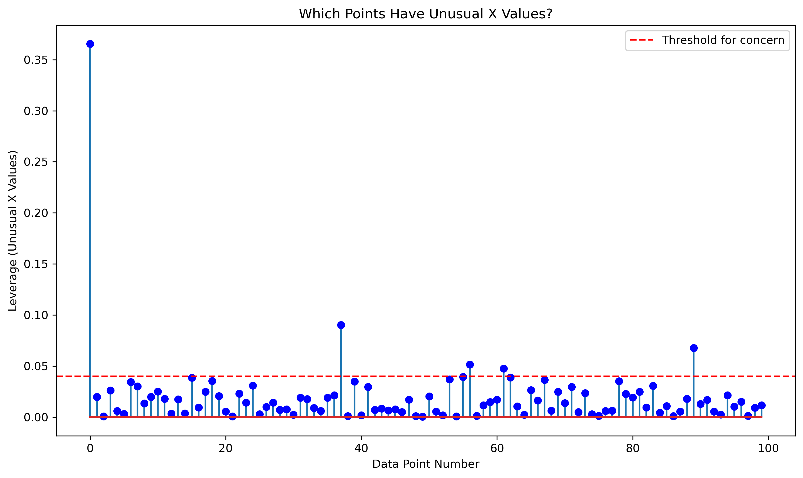

# Model Check-Ups: Making Sure Your Predictions Are Trustworthy

Welcome to the world of model diagnostics! Think of this guide as a "health check" for your regression models. Just like doctors run tests to make sure you're healthy, we need to run tests on our models to make sure they're giving us reliable predictions.

## Why Do We Need Model Check-Ups?

Imagine building a bridge without checking if your materials and design are good enough. That would be dangerous! Similarly, using a prediction model without checking its quality could lead to poor decisions.

Model check-ups help us:

1. Make sure our model works the way it's supposed to
2. Find and fix any problems early
3. Ensure our predictions will be reliable
4. Gain confidence in our results

## Four Key Questions to Ask About Your Model

To make sure your model is healthy, we need to check four main assumptions. Think of these as the "vital signs" of your model:

### 1. Is the Relationship Actually Straight? (Linearity)

**What it means**: A linear regression model works by drawing a straight line through your data. But what if the true relationship isn't a straight line?

**Everyday analogy**: Imagine measuring a child's growth. Growth is usually linear for a few years, but not over an entire lifetime - babies grow quickly, teens grow in spurts, and adults stop growing. If you try to use a straight line to predict height based on age from birth to adulthood, it won't work well.

**How to check it**: Look at a "residual plot" - a graph showing the difference between our predictions and the actual values.

```python
import numpy as np
import pandas as pd
import matplotlib.pyplot as plt
import seaborn as sns
from scipy import stats

def check_if_relationship_is_straight(model, X, y):
    """Check if our model's relationship is actually linear."""
    # Get predictions
    y_pred = model.predict(X)
    errors = y - y_pred  # These are called "residuals"
    
    # Create plot
    plt.figure(figsize=(10, 6))
    plt.scatter(y_pred, errors, alpha=0.7)
    plt.axhline(y=0, color='r', linestyle='--')
    plt.xlabel('What our model predicted')
    plt.ylabel('How wrong we were (errors)')
    plt.title('Are Our Errors Random? (They Should Be!)')
    plt.show()
    
    print("What to look for:")
    print("✓ GOOD: Random scatter around the zero line with no pattern")
    print("✗ BAD: Any curves, funnels, or patterns in the dots")
```

**What good looks like**: Dots randomly scattered around the horizontal line with no clear pattern.

**What bad looks like**: A curved pattern in the dots, like a smile or frown shape.

### 2. Are the Observations Independent? (Independence)

**What it means**: Each data point should not influence other data points.

**Everyday analogy**: Imagine surveying family members about their favorite ice cream. Their answers might be influenced by each other (siblings might have similar tastes), so they wouldn't be independent.

**How to check it**: For time-based data, we can use a test called the Durbin-Watson test to check for patterns over time.

```python
from statsmodels.stats.stattools import durbin_watson

def check_if_points_are_independent(errors):
    """Check if our observations don't influence each other."""
    # Durbin-Watson test
    dw_statistic = durbin_watson(errors)
    print(f"Durbin-Watson test result: {dw_statistic:.2f}")
    print("\nHow to interpret this number:")
    print("Around 2.0 = Good (errors are independent)")
    print("Below 1.0 = Bad (adjacent errors tend to be similar)")
    print("Above 3.0 = Bad (adjacent errors tend to be opposite)")
```

**What good looks like**: A Durbin-Watson value close to 2.0.

**What bad looks like**: Values below 1.0 or above 3.0.

### 3. Is the Error Spread Consistent? (Homoscedasticity)

**What it means**: The amount of error in our predictions should be consistent across all predicted values.

**Everyday analogy**: Imagine a weather forecast. A good forecasting system should be equally accurate whether predicting for summer or winter, not more accurate in one season than another.

**How to check it**: We look at how the size of errors changes across different predicted values.

```python
def check_if_error_spread_is_even(model, X, y):
    """Check if the errors have consistent spread."""
    # Get predictions and errors
    y_pred = model.predict(X)
    errors = y - y_pred
    
    # Create plot to look at absolute error values
    plt.figure(figsize=(10, 6))
    plt.scatter(y_pred, np.abs(errors), alpha=0.7)
    plt.xlabel('What our model predicted')
    plt.ylabel('How big our errors were (absolute value)')
    plt.title('Is Our Error Spread Consistent?')
    plt.show()
    
    print("What to look for:")
    print("✓ GOOD: Random scatter with consistent spread throughout")
    print("✗ BAD: Fan or funnel shapes that get wider or narrower")
```

**What good looks like**: Errors with similar spread across all predictions.

**What bad looks like**: A funnel shape where errors get bigger or smaller as the predicted value changes.

### 4. Do the Errors Follow a Bell Curve? (Normality)

**What it means**: The errors in our predictions should follow a normal distribution (bell curve).

**Everyday analogy**: Think of archery. If you aim at a target many times, most arrows will land close to the bullseye, with fewer and fewer landing as you move further away, creating a bell curve pattern around your target.

**How to check it**: We look at the distribution of errors with histograms and what's called a "Q-Q plot."

```python
def check_if_errors_follow_bell_curve(errors):
    """Check if our errors follow a normal distribution (bell curve)."""
    # Create plots
    fig, (ax1, ax2) = plt.subplots(1, 2, figsize=(15, 6))
    
    # Histogram to see the distribution shape
    ax1.hist(errors, bins=30, density=True, alpha=0.7)
    ax1.set_title('Distribution of Errors (Should Look Like a Bell Curve)')
    
    # Q-Q plot compares our errors to a perfect bell curve
    stats.probplot(errors, dist="norm", plot=ax2)
    ax2.set_title('Q-Q Plot (Points Should Follow the Line)')
    
    plt.tight_layout()
    plt.show()
    
    # Statistical test
    stat, p_value = stats.shapiro(errors)
    print(f"Bell curve test p-value: {p_value:.4f}")
    print("If p-value < 0.05, errors likely don't follow a bell curve")
```

**What good looks like**: A histogram that looks like a bell curve and points following the diagonal line in the Q-Q plot.

**What bad looks like**: Skewed histograms or points that curve away from the line in the Q-Q plot.

## Checking for Troublemakers: Identifying Influential Points

Sometimes, just a few unusual data points can have an outsized impact on your model. Think of them as the "troublemakers" that can distort your results.

### 1. Cook's Distance: Finding All-Around Troublemakers

**What it means**: Cook's Distance helps us find data points that, if removed, would significantly change our model.

**Everyday analogy**: In a classroom discussion, some students might significantly change the direction of the conversation if they were absent. Cook's Distance helps us identify those influential "conversation changers."

```python
def find_all_around_troublemakers(model, X, y):
    """Find data points with high overall influence on the model."""
    # Get predictions and errors
    y_pred = model.predict(X)
    errors = y - y_pred
    
    # Calculate leverage (how extreme each point's x-values are)
    hat_matrix = X @ np.linalg.inv(X.T @ X) @ X.T
    leverage = np.diagonal(hat_matrix)
    
    # Calculate Cook's distance
    n = len(y)
    p = X.shape[1]
    mse = np.sum(errors**2) / (n - p)
    cooks_d = (errors**2 * leverage) / (p * mse * (1 - leverage)**2)
    
    # Plot
    plt.figure(figsize=(10, 6))
    plt.stem(range(len(cooks_d)), cooks_d, markerfmt='ro')
    plt.axhline(y=4/n, color='r', linestyle='--', label='Threshold for concern')
    plt.xlabel('Data Point Number')
    plt.ylabel("Cook's Distance (Influence)")
    plt.title("Which Points Have Too Much Influence?")
    plt.legend()
    plt.show()
    
    return cooks_d
```

**What to look for**: Points with Cook's Distance values that stand out above the threshold line.

### 2. Leverage: Finding X-Value Outliers

**What it means**: Leverage identifies observations with unusual predictor values.

**Everyday analogy**: In a study about the relationship between age and height among children, a 45-year-old would have high leverage because their age is unusual compared to the other subjects.

```python
def find_unusual_x_values(X):
    """Find data points with unusual X values."""
    # Calculate hat values (another name for leverage)
    hat_matrix = X @ np.linalg.inv(X.T @ X) @ X.T
    leverage = np.diagonal(hat_matrix)
    
    # Plot
    plt.figure(figsize=(10, 6))
    plt.stem(range(len(leverage)), leverage, markerfmt='bo')
    plt.axhline(y=2*X.shape[1]/len(X), color='r', linestyle='--', label='Threshold for concern')
    plt.xlabel('Data Point Number')
    plt.ylabel('Leverage (Unusual X Values)')
    plt.title('Which Points Have Unusual X Values?')
    plt.legend()
    plt.show()
    
    return leverage
```

**What to look for**: Points with leverage values above the threshold line.

## Let's Put It All Together: A Complete Check-Up

Here's a function that performs all these checks at once:

```python
def give_model_complete_checkup(model, X, y):
    """
    Run a complete diagnostic check-up on our regression model.
    
    Parameters:
    model: our fitted regression model
    X: our predictor variables
    y: what we're trying to predict
    """
    # Get predictions and errors
    y_pred = model.predict(X)
    errors = y - y_pred
    
    print("=== MODEL CHECK-UP RESULTS ===\n")
    
    # 1. Linearity check
    print("✅ CHECKING IF RELATIONSHIP IS STRAIGHT...")
    check_if_relationship_is_straight(model, X, y)
    
    # 2. Independence check
    print("\n✅ CHECKING IF POINTS ARE INDEPENDENT...")
    check_if_points_are_independent(errors)
    
    # 3. Consistent error spread check
    print("\n✅ CHECKING IF ERROR SPREAD IS CONSISTENT...")
    check_if_error_spread_is_even(model, X, y)
    
    # 4. Bell curve check
    print("\n✅ CHECKING IF ERRORS FOLLOW A BELL CURVE...")
    check_if_errors_follow_bell_curve(errors)
    
    # 5. Troublemaker identification
    print("\n✅ FINDING TROUBLEMAKER POINTS...")
    cooks_d = find_all_around_troublemakers(model, X, y)
    leverage = find_unusual_x_values(X)
    
    # Summary of issues found
    print("\n=== SUMMARY OF POTENTIAL ISSUES ===")
    print(f"Points with unusual X values: {sum(leverage > 2*X.shape[1]/len(X))}")
    print(f"Points with too much overall influence: {sum(cooks_d > 4/len(y))}")
    
    return {
        'errors': errors,
        'cooks_distance': cooks_d,
        'leverage': leverage
    }
```

## Let's Try It: A Hands-On Example

Let's see how this works with some example data:

```python
# Create some example data
np.random.seed(42)  # This makes the "random" numbers the same each time
n_samples = 100

# Create predictors with an unusual outlier point
X = np.random.normal(0, 1, (n_samples, 2))  # 100 data points with 2 predictors
X[0] = [5, 5]  # Make the first point an extreme outlier

# Create a response variable with errors that get bigger as X gets bigger
y = 2 * X[:, 0] + 3 * X[:, 1] + np.random.normal(0, np.abs(X[:, 0]), n_samples)

# Fit a regression model
from sklearn.linear_model import LinearRegression
model = LinearRegression()
model.fit(X, y)

# Run our complete check-up
results = give_model_complete_checkup(model, X, y)
```



```
=== MODEL CHECK-UP RESULTS ===

✅ CHECKING IF RELATIONSHIP IS STRAIGHT...
What to look for:
✓ GOOD: Random scatter around the zero line with no pattern
✗ BAD: Any curves, funnels, or patterns in the dots

✅ CHECKING IF POINTS ARE INDEPENDENT...
Durbin-Watson test result: 2.03

How to interpret this number:
Around 2.0 = Good (errors are independent)
Below 1.0 = Bad (adjacent errors tend to be similar)
Above 3.0 = Bad (adjacent errors tend to be opposite)

✅ CHECKING IF ERROR SPREAD IS CONSISTENT...
What to look for:
✓ GOOD: Random scatter with consistent spread throughout
✗ BAD: Fan or funnel shapes that get wider or narrower

✅ CHECKING IF ERRORS FOLLOW A BELL CURVE...
Bell curve test p-value: 0.0000
If p-value < 0.05, errors likely don't follow a bell curve

✅ FINDING TROUBLEMAKER POINTS...

=== SUMMARY OF POTENTIAL ISSUES ===
Points with unusual X values: 5
Points with too much overall influence: 8
```


## Common Problems and How to Fix Them

Let's look at common problems you might discover and what to do about them:

### Problem 1: The Relationship Isn't Actually Straight

**Signs of this problem**:
- Curved pattern in the residual plot
- Poor predictions

**Solutions**:
- **Transform your variables**: Try using log(x), square root(x), or x² instead of just x
- **Try polynomial regression**: Add squared or cubed terms (x²)
- **Use a non-linear model**: Consider a different type of model altogether

**Real-world example**: When predicting house prices, the relationship between size and price might not be straight - each additional square foot might add less value as houses get very large.

### Problem 2: Inconsistent Error Spread

**Signs of this problem**:
- Funnel shape in the scale-location plot
- Errors get bigger or smaller as predicted values change

**Solutions**:
- **Transform your y variable**: Try log(y) or square root(y)
- **Use weighted regression**: Give less weight to observations with potentially larger errors
- **Try robust regression methods**: These are less affected by uneven error spreads

**Real-world example**: When predicting company revenue, errors might be bigger for large companies than for small ones.

### Problem 3: Errors Don't Follow a Bell Curve

**Signs of this problem**:
- Skewed histogram of residuals
- Points deviating from the line in the Q-Q plot

**Solutions**:
- **Transform your y variable**: Try log(y) or another transformation
- **Consider if you're missing important predictors**: Add more relevant variables
- **Look for natural limits in your data**: Is there a floor or ceiling effect?

**Real-world example**: When predicting salaries, errors might not follow a bell curve because salaries have a lower bound (they can't be negative) but no upper bound.

### Problem 4: Troublemaker Points with Too Much Influence

**Signs of this problem**:
- High Cook's distance values
- High leverage points

**Solutions**:
- **Investigate these points carefully**: Are they errors, or just unusual but valid data?
- **Try robust regression methods**: These are less affected by outliers
- **Run the analysis with and without these points**: Compare the results to see how much they matter
- **Transform your predictors**: This can sometimes reduce the impact of extreme values

**Real-world example**: In a customer spending analysis, a few ultra-high-net-worth individuals might have too much influence on your model if not handled properly.

## Your Turn: Practice Exercise

Try running a model check-up on a dataset you're working with. Here are the steps:

1. Create a model using linear regression
2. Run the `give_model_complete_checkup` function on your model
3. Look for any issues in the diagnostic plots
4. If you find problems, try one of the solutions mentioned above
5. Run the check-up again to see if your solutions worked

## Key Takeaways

1. Always check your model assumptions - don't just assume they're met!
2. Use visual tools (plots) to help you spot problems
3. Look for unusual data points that might have too much influence
4. Be ready to transform variables or try alternative models if needed
5. Remember that no model is perfect - the goal is to make it useful for your specific question

## Next Steps on Your Learning Journey

Now that you understand how to check if your model is reliable, you can:

1. Apply these tests to your own regression models
2. Learn more about robust regression methods that work better with imperfect data
3. Explore more advanced diagnostic techniques
4. Study specific solutions for common regression problems

Remember: A good model isn't just about getting a high R-squared value. It's about creating a tool that works reliably for the question you're trying to answer!

## Helpful Resources for Going Deeper

- [STHDA Regression Diagnostics](https://www.sthda.com/english/articles/39-regression-model-diagnostics/) - With code examples and visuals
- [Practical Statistics for Data Scientists](https://www.oreilly.com/library/view/practical-statistics-for/9781491952955/) - A very accessible book with practical advice
- [Khan Academy's Regression Course](https://www.khanacademy.org/math/statistics-probability/advanced-regression-inference-transformations) - Free interactive lessons
- [Perplexity AI](https://www.perplexity.ai/) - For quick answers to your specific questions
