# Model Check-Ups: Making Sure Your Predictions Are Trustworthy

**After this lesson:** you can explain Model Check-Ups: Making Sure Your Predictions Are Trustworthy and try the examples in your own notebook.

## Overview

Fitting a model is cheap; **trusting** it requires checking whether the errors look like the theory assumes (linearity, independence, constant variance, approximate normality of residuals for inference). Residual plots, influence measures, and simple fixes are how you defend a line or plane, or decide to switch to a richer model in [module 4.4](../4.4-stat-modelling/).

## Why this matters

* **Residuals** and diagnostic plots turn "the model ran" into "the model fits the problem."
* You will fix violations (transformations, robust methods, or different models) before forecasting.

## Prerequisites

* [Multiple linear regression](multiple-linear-regression.md).

> **Important:** Diagnostics apply to many models beyond ordinary least squares.

### Video Tutorial: Model Diagnostics and Residual Analysis

_Model Adequacy Checking - Regression Assumptions and Residuals_

## Why Do We Need Model Check-Ups?

Imagine building a bridge without checking if your materials and design are good enough. That would be dangerous! Similarly, using a prediction model without checking its quality could lead to poor decisions.

Model check-ups help us:

1. Make sure our model works the way it's supposed to
2. Find and fix any problems early
3. Ensure our predictions will be reliable
4. Gain confidence in our results

## Four Key Questions to Ask About Your Model

To make sure your model is healthy, we need to check four main assumptions. Think of these as the "vital signs" of your model:

### 1. Is the Relationship Actually Straight? (Linearity)

**What it means**: A linear regression model works by drawing a straight line through your data. But what if the true relationship isn't a straight line?

**Everyday analogy**: Imagine measuring a child's growth. Growth is usually linear for a few years, but not over an entire lifetime - babies grow quickly, teens grow in spurts, and adults stop growing. If you try to use a straight line to predict height based on age from birth to adulthood, it won't work well.

**How to check it**: Look at a "residual plot" - a graph showing the difference between our predictions and the actual values.

<figure>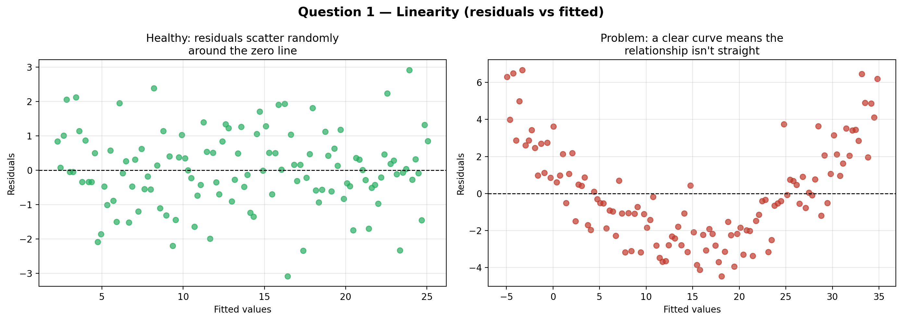<figcaption><p>Linearity check: a healthy residual plot scatters randomly around zero (left); a clear curve means the relationship isn't straight (right).</p></figcaption></figure>

**Residuals vs fitted for the linear mean structure**

Imports

Import NumPy, pandas, Matplotlib, seaborn, and SciPy, the standard diagnostic toolkit used across all helper functions in this lesson.

Residuals vs fitted

Compute residuals as y − ŷ, scatter them against fitted values, and draw a zero reference line; a random scatter around zero indicates no systematic pattern (good linearity).

**What good looks like**: Dots randomly scattered around the horizontal line with no clear pattern.

**What bad looks like**: A curved pattern in the dots, like a smile or frown shape.

### 2. Are the Observations Independent? (Independence)

**What it means**: Each data point should not influence other data points.

**Everyday analogy**: Imagine surveying family members about their favorite ice cream. Their answers might be influenced by each other (siblings might have similar tastes), so they wouldn't be independent.

**How to check it**: For time-based data, we can use a test called the Durbin-Watson test to check for patterns over time.

<figure>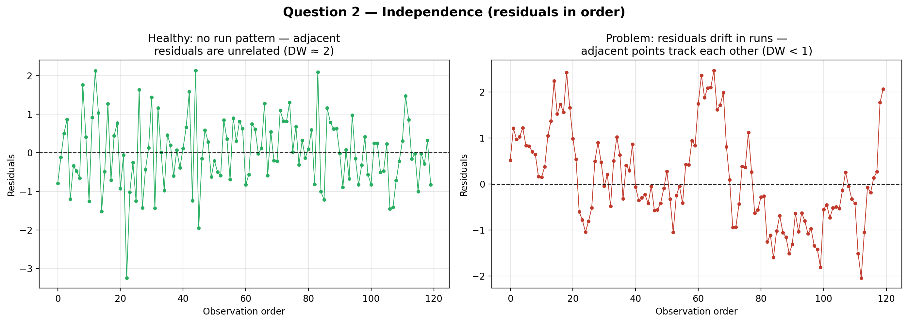<figcaption><p>Independence check: healthy residuals show no run pattern in observation order, giving a Durbin-Watson statistic near 2 (left); residuals that drift in runs signal autocorrelation and a statistic well below 1 (right).</p></figcaption></figure>

**Durbin-Watson statistic on a residual series**

```python
from statsmodels.stats.stattools import durbin_watson

def check_if_points_are_independent(errors):
    """Check if our observations don't influence each other."""
    # Durbin-Watson test
    dw_statistic = durbin_watson(errors)
    print(f"Durbin-Watson test result: {dw_statistic:.2f}")
    print("\nHow to interpret this number:")
    print("Around 2.0 = Good (errors are independent)")
    print("Below 1.0 = Bad (adjacent errors tend to be similar)")
    print("Above 3.0 = Bad (adjacent errors tend to be opposite)")
```

**What good looks like**: A Durbin-Watson value close to 2.0.

**What bad looks like**: Values below 1.0 or above 3.0.

### 3. Is the Error Spread Consistent? (Homoscedasticity)

**What it means**: The amount of error in our predictions should be consistent across all predicted values.

**Everyday analogy**: Imagine a weather forecast. A good forecasting system should be equally accurate whether predicting for summer or winter, not more accurate in one season than another.

**How to check it**: We look at how the size of errors changes across different predicted values.

<figure>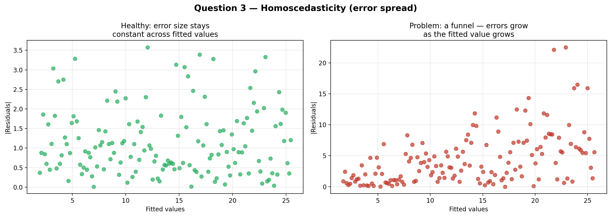<figcaption><p>Homoscedasticity check: a healthy plot keeps the error size roughly constant across fitted values (left); a funnel shape means the spread grows with the prediction (right).</p></figcaption></figure>

**Absolute residuals vs fitted (scale-location style)**

Absolute residuals

Take the absolute value of residuals to focus on error magnitude and plot it against fitted values, a scale-location style diagnostic.

Homoscedasticity check

Plot and describe what consistent (homoscedastic) versus fanning (heteroscedastic) spread looks like so the learner knows what to look for.

**What good looks like**: Errors with similar spread across all predictions.

**What bad looks like**: A funnel shape where errors get bigger or smaller as the predicted value changes.

### 4. Do the Errors Follow a Bell Curve? (Normality)

**What it means**: The errors in our predictions should follow a normal distribution (bell curve).

**Everyday analogy**: Think of archery. If you aim at a target many times, most arrows will land close to the bullseye, with fewer and fewer landing as you move further away, creating a bell curve pattern around your target.

**How to check it**: We look at the distribution of errors with histograms and what's called a "Q-Q plot."

**What's a Q-Q plot?** "Q-Q" is short for **quantile-quantile**. It compares two distributions by plotting their quantiles (think percentiles) against each other. For a normality check, we plot the quantiles of our residuals against the quantiles of a theoretical normal distribution. If the two distributions have the same shape, the points fall along a straight diagonal line, so reading a Q-Q plot is just asking "how far do the points stray from that line?"

* **Points hug the line** → residuals are approximately normal.
* **Points curve away, especially at the ends** → skewness, heavy tails, or outliers.

The same idea works beyond residuals: you can put one dataset's quantiles on each axis to check whether two samples come from the same underlying distribution.

<figure>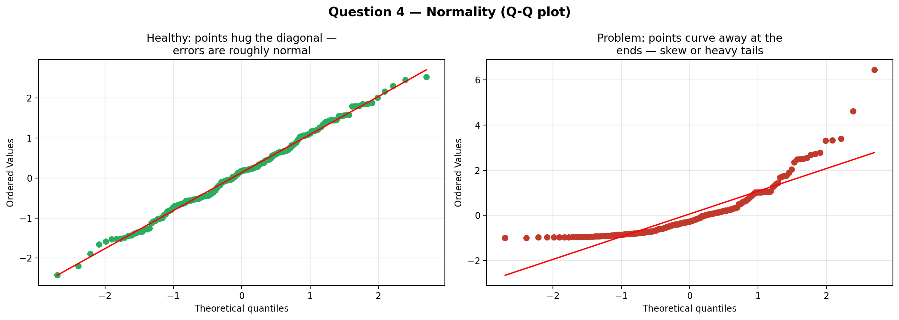<figcaption><p>Normality check: healthy residuals hug the diagonal line (left); points curving away at the ends indicate skew or heavy tails (right).</p></figcaption></figure>

**Histogram, Q-Q plot, and Shapiro-Wilk on residuals**

Histogram and Q-Q plot

Plot a density histogram alongside a Q-Q plot from `stats.probplot`; points following the diagonal line indicate normally distributed residuals.

Shapiro-Wilk test

Run the Shapiro-Wilk normality test and print the p-value; a p-value below 0.05 suggests the residuals depart from normality.

**What good looks like**: A histogram that looks like a bell curve and points following the diagonal line in the Q-Q plot.

**What bad looks like**: Skewed histograms or points that curve away from the line in the Q-Q plot.

## Checking for Troublemakers: Identifying Influential Points

Sometimes, just a few unusual data points can have an outsized impact on your model. Think of them as the "troublemakers" that can distort your results.

### 1. Cook's Distance: Finding All-Around Troublemakers

**What it means**: Cook's Distance helps us find data points that, if removed, would significantly change our model.

**Everyday analogy**: In a classroom discussion, some students might significantly change the direction of the conversation if they were absent. Cook's Distance helps us identify those influential "conversation changers."

**Cook's distance from residuals, leverage, and MSE**

Hat matrix and leverage

Build the hat matrix H = X(XᵀX)⁻¹Xᵀ and extract its diagonal to obtain per-observation leverage values.

Cook's distance formula

Compute Cook's D using residuals, leverage, and MSE; each value measures how much all fitted values would shift if this observation were deleted.

Stem plot with threshold

Stem-plot each Cook's D value and overlay a 4/n reference line; points above it are worth investigating as high-influence observations.

**What to look for**: Points with Cook's Distance values that stand out above the threshold line.

### 2. Leverage: Finding X-Value Outliers

**What it means**: Leverage identifies observations with unusual predictor values.

**Everyday analogy**: In a study about the relationship between age and height among children, a 45-year-old would have high leverage because their age is unusual compared to the other subjects.

**Leverage (hat values) for each row of X**

Leverage via hat matrix

Extract diagonal elements of the hat matrix H = X(XᵀX)⁻¹Xᵀ; high values indicate observations with extreme predictor values that can pull the fitted line.

Stem plot with 2p/n threshold

Plot leverage per observation and add a 2p/n reference line; points above it have unusually extreme predictor values and deserve closer inspection.

**What to look for**: Points with leverage values above the threshold line.

## Put it all together: a complete check-up

Here's a function that performs all these checks at once:

**End-to-end diagnostic runner**

Function setup

Accept a fitted model, predictor matrix, and target vector; compute predictions and residuals for all downstream checks.

Four assumption checks

Call helper functions in sequence for linearity, independence (Durbin-Watson), homoscedasticity, and normality of residuals.

Influence summary

Compute Cook's distance and leverage, print counts of flagged observations using common rule-of-thumb thresholds, and return all diagnostics.

## Try it: A Hands-On Example

Look at how this works with some example data:

**Synthetic data with an outlier and heteroscedastic noise, then full check-up**

Synthetic data with outlier

Generate a 100×2 predictor matrix and manually set the first row to \[5, 5] to create a high-leverage outlier point.

Heteroscedastic response

Scale the noise by `|X[:,0]|` so error variance grows with the predictor, deliberately violating homoscedasticity.

Fit and check

Fit `LinearRegression` and pass the model to `give_model_complete_checkup` to run all four diagnostic plots and the influence summary.

<figure>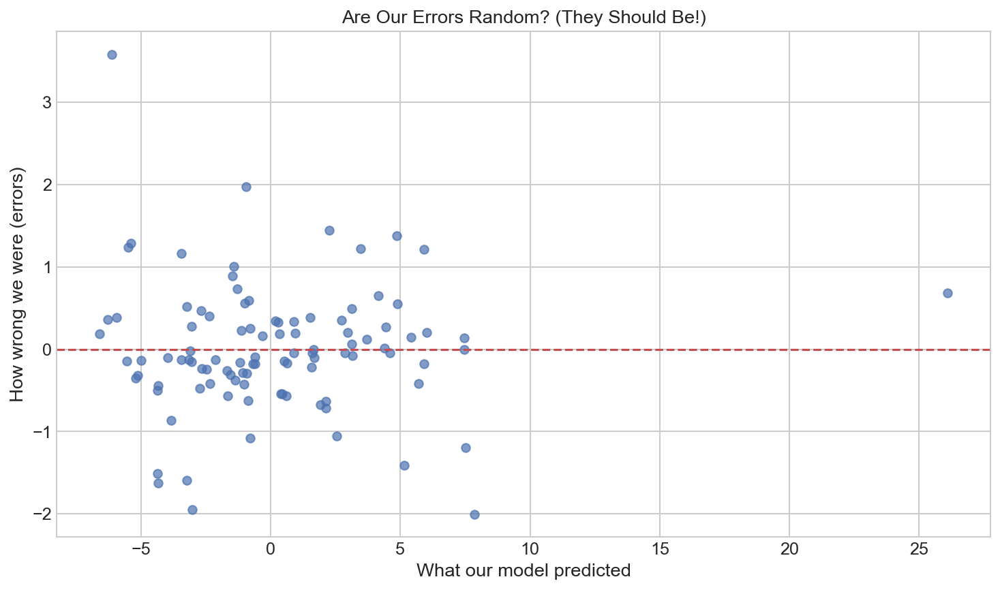<figcaption><p>Figure 1: Are Our Errors Random? (They Should Be!)</p></figcaption></figure>

<figure>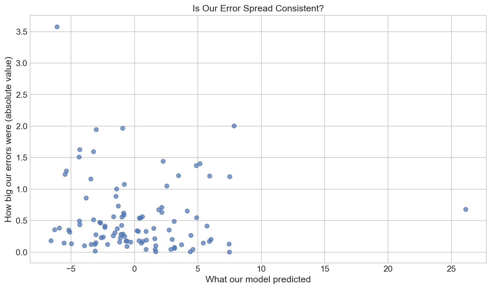<figcaption><p>Figure 2: Is Our Error Spread Consistent?</p></figcaption></figure>

<figure>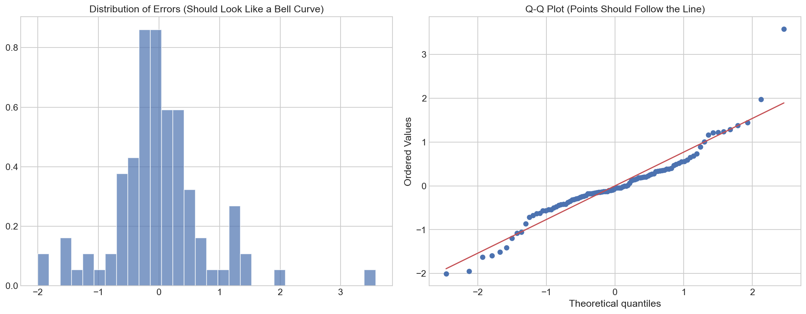<figcaption><p>Figure 3: Distribution of Errors (Should Look Like a Bell Curve)</p></figcaption></figure>

<figure>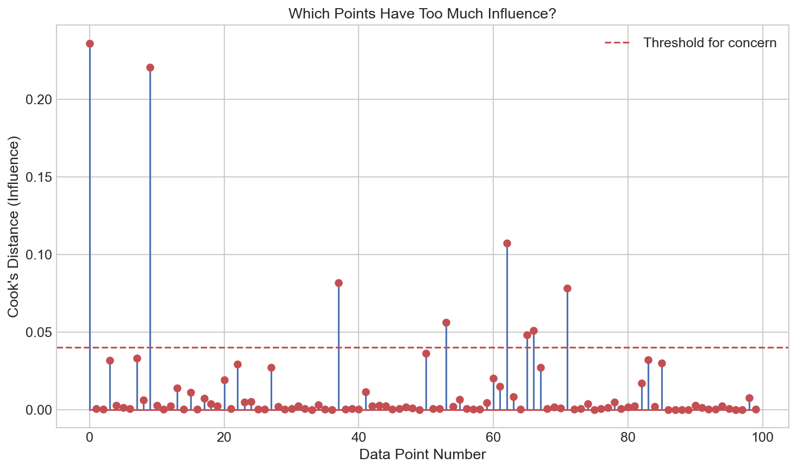<figcaption><p>Figure 4: Which Points Have Too Much Influence?</p></figcaption></figure>

<figure>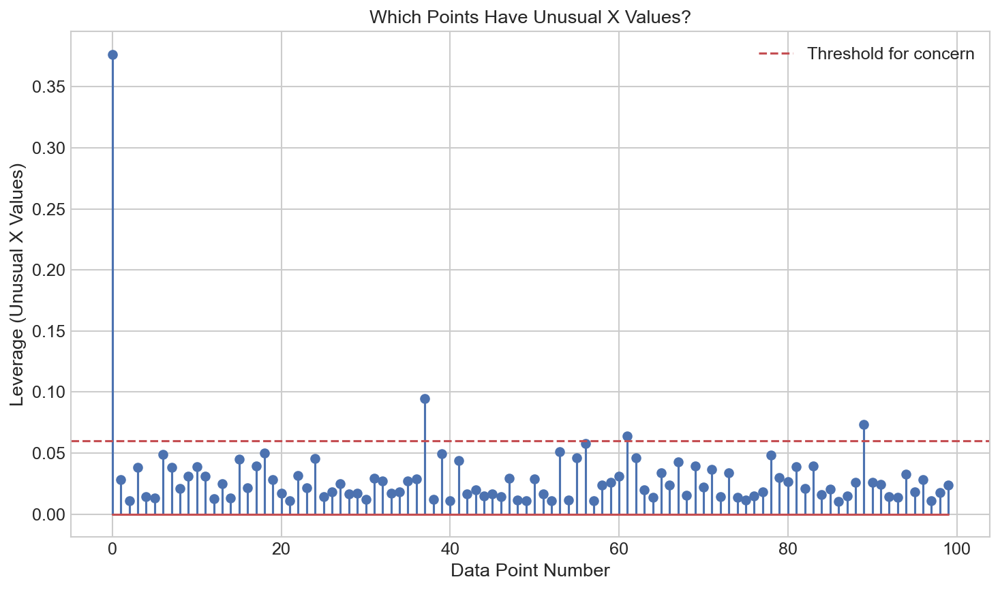<figcaption><p>Figure 5: Which Points Have Unusual X Values?</p></figcaption></figure>

```
=== MODEL CHECK-UP RESULTS ===

✅ CHECKING IF RELATIONSHIP IS STRAIGHT...
What to look for:
✓ GOOD: Random scatter around the zero line with no pattern
✗ BAD: Any curves, funnels, or patterns in the dots

✅ CHECKING IF POINTS ARE INDEPENDENT...
Durbin-Watson test result: 2.03

How to interpret this number:
Around 2.0 = Good (errors are independent)
Below 1.0 = Bad (adjacent errors tend to be similar)
Above 3.0 = Bad (adjacent errors tend to be opposite)

✅ CHECKING IF ERROR SPREAD IS CONSISTENT...
What to look for:
✓ GOOD: Random scatter with consistent spread throughout
✗ BAD: Fan or funnel shapes that get wider or narrower

✅ CHECKING IF ERRORS FOLLOW A BELL CURVE...
Bell curve test p-value: 0.0000
If p-value < 0.05, errors likely don't follow a bell curve

✅ FINDING TROUBLEMAKER POINTS...

=== SUMMARY OF POTENTIAL ISSUES ===
Points with unusual X values: 4
Points with too much overall influence: 8
```

## Common Problems and How to Fix Them

look at common problems you might discover and what to do about them:

### Problem 1: The Relationship Isn't Actually Straight

**Signs of this problem**:

* Curved pattern in the residual plot
* Poor predictions

**Solutions**:

* **Transform your variables**: Try using log(x), square root(x), or x² instead of just x
* **Try polynomial regression**: Add squared or cubed terms (x²)
* **Use a non-linear model**: Consider a different type of model altogether

**Real-world example**: When predicting house prices, the relationship between size and price might not be straight - each additional square foot might add less value as houses get very large.

<figure>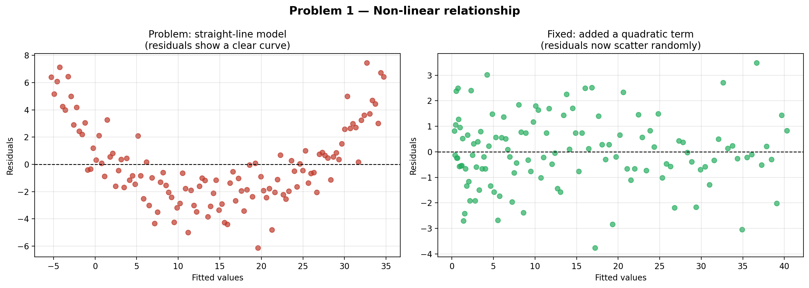<figcaption><p>Left: a straight-line model leaves a clear curve in the residuals. Right: adding a quadratic term removes the pattern.</p></figcaption></figure>

### Problem 2: Inconsistent Error Spread

**Signs of this problem**:

* Funnel shape in the scale-location plot
* Errors get bigger or smaller as predicted values change

**Solutions**:

* **Transform your y variable**: Try log(y) or square root(y)
* **Use weighted regression**: Give less weight to observations with potentially larger errors
* **Try robust regression methods**: These are less affected by uneven error spreads

**Real-world example**: When predicting company revenue, errors might be bigger for large companies than for small ones.

<figure>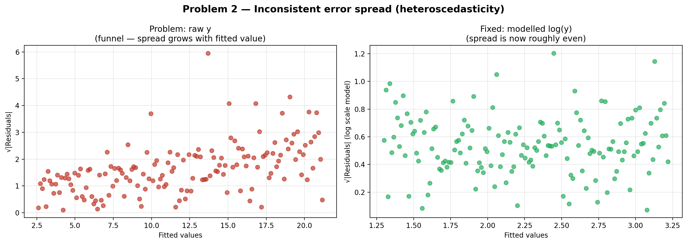<figcaption><p>Left: residual spread fans out as fitted values grow. Right: modelling log(y) makes the spread roughly even.</p></figcaption></figure>

### Problem 3: Errors Don't Follow a Bell Curve

**Signs of this problem**:

* Skewed histogram of residuals
* Points deviating from the line in the Q-Q plot

**Solutions**:

* **Transform your y variable**: Try log(y) or another transformation
* **Consider if you're missing important predictors**: Add more relevant variables
* **Look for natural limits in your data**: Is there a floor or ceiling effect?

**Real-world example**: When predicting salaries, errors might not follow a bell curve because salaries have a lower bound (they can't be negative) but no upper bound.

<figure>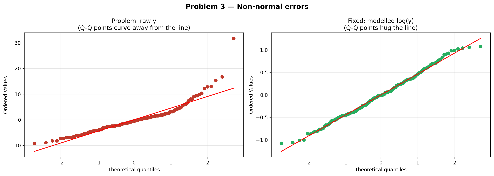<figcaption><p>Left: right-skewed residuals pull the Q-Q points away from the line. Right: modelling log(y) brings them back onto it.</p></figcaption></figure>

### Problem 4: Troublemaker Points with Too Much Influence

**Signs of this problem**:

* High Cook's distance values
* High leverage points

**Solutions**:

* **Investigate these points carefully**: Are they errors, or just unusual but valid data?
* **Try robust regression methods**: These are less affected by outliers
* **Run the analysis with and without these points**: Compare the results to see how much they matter
* **Transform your predictors**: This can sometimes reduce the impact of extreme values

**Real-world example**: In a customer spending analysis, a few ultra-high-net-worth individuals might have too much influence on your model if not handled properly.

<figure>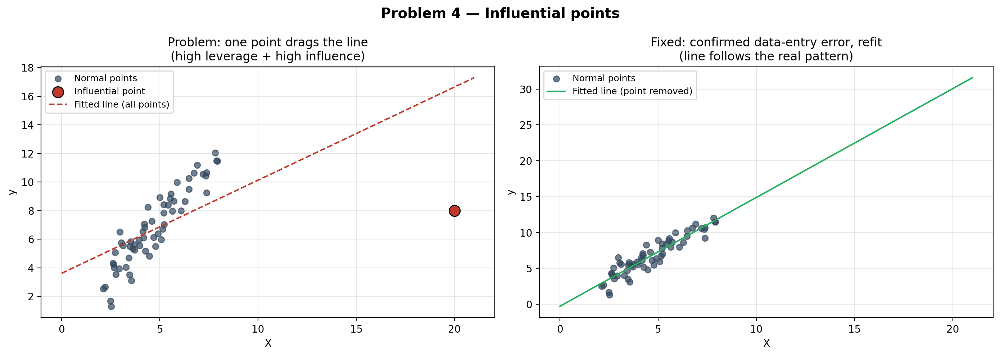<figcaption><p>Left: a single high-leverage point pulls the fitted line away from the data. Right: after confirming it was a data-entry error, the refit follows the real pattern.</p></figcaption></figure>

## Your Turn: Practice Exercise

Try running a model check-up on a dataset you're working with. Here are the steps:

1. Create a model using linear regression
2. Run the `give_model_complete_checkup` function on your model
3. Look for any issues in the diagnostic plots
4. If you find problems, try one of the solutions mentioned above
5. Run the check-up again to see if your solutions worked

## Key Takeaways

1. Always check your model assumptions - don't just assume they're met!
2. Use visual tools (plots) to help you spot problems
3. Look for unusual data points that might have too much influence
4. Be ready to transform variables or try alternative models if needed
5. Remember that no model is perfect - the goal is to make it useful for your specific question

## Next steps

* Start [Statistical modelling (module 4.4)](../4.4-stat-modelling/) with [Logistic regression](../4.4-stat-modelling/logistic-regression.md).

## Gotchas

* **Running diagnostics on training-set residuals only**: Diagnostic plots computed on the same data used to fit the model can look acceptable even when the model generalises poorly. Always check residual patterns on a held-out validation set if generalisation is your goal.
* **Shapiro-Wilk rejects normality for large samples trivially**: With n > 5,000 the test flags tiny, irrelevant departures from normality as significant. At that scale, inspect the Q-Q plot visually instead of relying on the p-value alone.
* **The Durbin-Watson test only catches lag-1 autocorrelation**: A DW value near 2 does not guarantee independence; it only checks whether adjacent residuals are correlated. Seasonal patterns (lag 12, lag 52) will pass Durbin-Watson while still violating independence.
* **High leverage is not the same as high influence**: A point can sit far out in predictor space (high leverage) but still fall exactly on the regression surface, giving it near-zero Cook's distance. Only combine leverage with large residuals makes a point truly influential.
* **Deleting influential points without investigating them**: Automatically removing observations above the 4/n Cook's threshold destroys valid data. First check whether the point is a data-entry error, an out-of-scope observation, or a real signal the model is failing to capture.
* **Ignoring heteroscedasticity and still reporting standard errors**: OLS standard errors assume constant variance; heteroscedastic residuals make those errors (and therefore p-values and confidence intervals) wrong. Use heteroscedasticity-robust standard errors (`HC3` in statsmodels) or transform the response before trusting inference.

## Helpful Resources for Going Deeper

* [STHDA Regression Diagnostics](https://www.sthda.com/english/articles/39-regression-model-diagnostics/) - With code examples and visuals
* [Practical Statistics for Data Scientists](https://www.oreilly.com/library/view/practical-statistics-for/9781491952955/) - A very accessible book with practical advice
* [Khan Academy's Regression Course](https://www.khanacademy.org/math/statistics-probability/advanced-regression-inference-transformations) - Free interactive lessons
* [Perplexity AI](https://www.perplexity.ai/) - For quick answers to your specific questions
