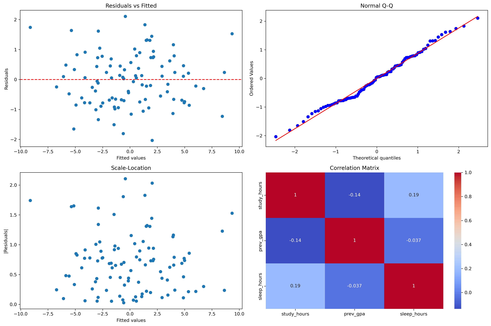

# Multiple Linear Regression: Prediction with Multiple Factors

**After this lesson:** you can explain Multiple Linear Regression: Prediction with Multiple Factors and try the examples in your own notebook.

## Overview

Multiple linear regression extends the simple case to a **linear combination of several predictors**. Each coefficient answers a conditional question: "How does the outcome change with this predictor **holding the others fixed**?" That conditioning is powerful and easy to misread, especially when predictors are correlated, so this lesson pairs intuition with careful wording before [diagnostics](./model-diagnostics.md).

## Why this matters

- Real outcomes usually depend on **more than one** predictor; MLR separates overlapping effects where the design allows.
- You will read coefficients **given** the other variables in the model (not the same as raw correlations).

## Prerequisites

- [Simple linear regression](./simple-linear-regression.md).

> **Note:** Watch for multicollinearity and omitted-variable bias when adding predictors.

### Video Tutorial: Introduction to Multiple Regression

<div class="video-embed">
<iframe width="560" height="315" src="https://www.youtube.com/embed/zITIFTsivN8" frameborder="0" allow="accelerometer; autoplay; clipboard-write; encrypted-media; gyroscope; picture-in-picture" allowfullscreen></iframe>
</div>

*StatQuest: Multiple Regression, Clearly Explained!!! by Josh Starmer*

## What is Multiple Linear Regression?

In real life, outcomes are rarely influenced by just one factor. Think about it:

- Your exam score isn't just determined by study time, but also by sleep quality, previous knowledge, and stress levels
- House prices aren't just based on square footage, but also location, number of bedrooms, age of the house, and more
- A plant's growth isn't just affected by water, but also by sunlight, soil quality, and temperature

**Multiple linear regression (MLR) is like having a team of predictors instead of a single predictor.** It allows us to use several pieces of information to make more accurate predictions.

### The Family Recipe Analogy

Think of simple linear regression like trying to bake cookies with just flour. You can make something, but it won't be great.

Multiple linear regression is like using a complete recipe with flour, sugar, butter, eggs, and vanilla. Each ingredient contributes to the final product, and the recipe tells you exactly how much of each to use!



### The Math (Don't Worry, We'll Explain It Simply!)

The formula looks like this:

\\[ y = \beta_0 + \beta_1 x_1 + \beta_2 x_2 + \dots + \beta_p x_p + \epsilon \\]

This might look intimidating, but break it down:

- **y** is what we're trying to predict (like exam score)
- **x₁, x₂, …** are our predictors (like hours studied, hours slept, previous knowledge)
- **β₀** is our starting point (intercept)
- **β₁, β₂, …** tell us how much each predictor contributes to our prediction
- **ε** represents the error (because no prediction is perfect)

### Real-World Example: Predicting House Prices

Imagine we want to predict house prices:
- x₁ might be the house size in square feet
- x₂ might be the number of bedrooms
- x₃ might be the house's age
- y would be the house price

Our equation might look like:
Price = $50,000 + ($100 × SquareFeet) + ($5,000 × Bedrooms) - ($1,000 × Age)

This tells us:
- A house with zero square feet, zero bedrooms, and zero years old would cost $50,000 (not realistic, just a starting point!)
- Each square foot adds $100 to the price
- Each bedroom adds $5,000 to the price
- Each year of age reduces the price by $1,000

## Before We Start: Important Assumptions

Just like a recipe only works under certain conditions, multiple linear regression works best when certain assumptions are met. Understand these in simple terms:

### 1. The Relationships Should Be Linear

Each predictor should have a straight-line relationship with what we're predicting.

**Garden Analogy**: If doubling the amount of water always roughly doubles plant growth, that's linear. If too much water starts drowning the plant, that's non-linear.

### 2. Each Observation Should Be Independent

One data point shouldn't influence another.

**Classroom Analogy**: Students should take tests independently. If they copy from each other, their scores are no longer independent, and our analysis won't be valid.

### 3. The Spread Should Be Consistent Throughout (Homoscedasticity)

The amount of "error" or "noise" in our predictions should be similar across all values.

**Weather Forecast Analogy**: A good forecasting system should be equally reliable whether predicting temperatures for summer or winter, not more accurate in one season.

### 4. The Errors Should Follow a Normal Distribution

The mistakes in our predictions should follow a bell curve pattern.

**Archery Analogy**: Most arrows land close to the bullseye, with fewer arrows landing farther away.

### 5. Predictors Shouldn't Be Too Similar (No Multicollinearity)

The factors you use should be relatively independent of each other.

**Recipe Analogy**: Adding both butter and margarine to a recipe might not give you independent effects since they serve similar purposes. Using butter and sugar would be better since they contribute differently.

## Building Your First Multiple Regression Model

Walk through a concrete example using Python. Don't worry if the code looks complex - focus on understanding the concepts!

**Multiple regression with coefficients, R², and VIF**

<div class="code-explainer" data-code-explainer>
<div class="code-explainer__code">


import numpy as np
import pandas as pd
from sklearn.linear_model import LinearRegression
import matplotlib.pyplot as plt
import seaborn as sns
from statsmodels.stats.outliers_influence import variance_inflation_factor

# Create example data for student exam scores
np.random.seed(42)  # For reproducible results
n_samples = 100  # 100 students

# Create factors that might affect exam scores
study_hours = np.random.normal(0, 1, n_samples)  # Hours spent studying
prev_gpa = np.random.normal(0, 1, n_samples)     # Previous GPA
sleep_hours = np.random.normal(0, 1, n_samples)  # Hours of sleep before exam

# Create exam scores based on these factors
# Notice each factor has a different weight (2, 3, and 1.5)
exam_scores = 2*study_hours + 3*prev_gpa + 1.5*sleep_hours + np.random.normal(0, 1, n_samples)

# Put everything in a nice table (DataFrame)
student_data = pd.DataFrame({
    'study_hours': study_hours,
    'prev_gpa': prev_gpa,
    'sleep_hours': sleep_hours,
    'exam_score': exam_scores
})

# Create and fit our model
X = student_data[['study_hours', 'prev_gpa', 'sleep_hours']]  # Predictors
y = student_data['exam_score']  # What we're predicting

model = LinearRegression()
model.fit(X, y)

# Print results
print("Contribution of each factor:")
for name, coef in zip(X.columns, model.coef_):
    print(f"{name}: {coef:.2f} points")
print(f"\nStarting point (intercept): {model.intercept_:.2f}")
print(f"Model accuracy (R-squared): {model.score(X, y):.2f}")

# Check for predictor similarity (multicollinearity)
def check_predictor_similarity(X):
    vif_data = pd.DataFrame()
    vif_data["Variable"] = X.columns
    vif_data["VIF"] = [variance_inflation_factor(X.values, i)
                       for i in range(X.shape[1])]
    return vif_data

print("\nMulticollinearity Check (VIF values):")
print(check_predictor_similarity(X))

```
Contribution of each factor:
study_hours: 1.82 points
prev_gpa: 2.96 points
sleep_hours: 1.53 points

Starting point (intercept): 0.09
Model accuracy (R-squared): 0.94

Multicollinearity Check (VIF values):
      Variable       VIF
0  study_hours  1.053354
1     prev_gpa  1.019570
2  sleep_hours  1.034520
```


</div>
<aside class="code-explainer__callouts" aria-label="Code walkthrough">
  <div class="code-callout" data-lines="1-15" data-tint="1">
    <div class="code-callout__meta">
      <span class="code-callout__lines"></span>
      <span class="code-callout__title">Imports and synthetic predictors</span>
    </div>
    <div class="code-callout__body">
      <p>Import sklearn, statsmodels, and plotting libraries. <code>np.random.seed(42)</code> fixes reproducibility. Three independent predictors, study hours, GPA, sleep, are each drawn from a standard normal distribution so they don't correlate with each other (ideal for isolating individual effects).</p>
    </div>
  </div>
  <div class="code-callout" data-lines="17-19" data-tint="2">
    <div class="code-callout__meta">
      <span class="code-callout__lines"></span>
      <span class="code-callout__title">Known ground truth</span>
    </div>
    <div class="code-callout__body">
      <p>Exam scores are built with <em>known</em> coefficients (2, 3, 1.5), after fitting, the model should recover these. This "check your answer" trick is useful whenever you're learning a new model: generate data with known structure, then verify the model finds it.</p>
    </div>
  </div>
  <div class="code-callout" data-lines="29-34" data-tint="3">
    <div class="code-callout__meta">
      <span class="code-callout__lines"></span>
      <span class="code-callout__title">Multi-column feature matrix</span>
    </div>
    <div class="code-callout__body">
      <p>Unlike simple regression, <code>X</code> now has 3 columns (one per predictor). sklearn requires a 2D DataFrame or array, double brackets <code>[[ ]]</code> select multiple columns at once. No <code>.reshape</code> needed.</p>
    </div>
  </div>
  <div class="code-callout" data-lines="36-41" data-tint="4">
    <div class="code-callout__meta">
      <span class="code-callout__lines"></span>
      <span class="code-callout__title">One coefficient per predictor</span>
    </div>
    <div class="code-callout__body">
      <p><code>model.coef_</code> gives one weight per column in <code>X</code>. Each coefficient means: "how much does the outcome change if this predictor increases by 1, <em>holding the others fixed</em>?" That last part is what makes MLR more powerful than running separate simple regressions.</p>
    </div>
  </div>
  <div class="code-callout" data-lines="43-52" data-tint="1">
    <div class="code-callout__meta">
      <span class="code-callout__lines"></span>
      <span class="code-callout__title">Variance Inflation Factor (VIF)</span>
    </div>
    <div class="code-callout__body">
      <p>VIF measures how much each predictor's variance inflates due to correlation with others. A VIF above 5-10 signals multicollinearity, the model can't reliably separate the overlapping effects. VIF ≈ 1 here because the three predictors were generated independently.</p>
    </div>
  </div>
</aside>
</div>

```
Contribution of each factor:
study_hours: 1.82 points
prev_gpa: 2.96 points
sleep_hours: 1.53 points

Starting point (intercept): 0.09
Model accuracy (R-squared): 0.94

Multicollinearity Check (VIF values):
      Variable       VIF
0  study_hours  1.053354
1     prev_gpa  1.019570
2  sleep_hours  1.034520
```

### Understanding the Results

Interpret what our model is telling us:

1. **Contribution of each factor**:
   - Each additional hour studied adds 1.82 points to the exam score
   - Each point of previous GPA adds 2.96 points
   - Each additional hour of sleep adds 1.53 points

2. **Starting point (0.09)**:
   - The baseline score is nearly zero (just a mathematical starting point)

3. **Model accuracy (0.94)**:
   - Our model explains 94% of the variation in exam scores (that's excellent!)
   - Only 6% is due to factors we haven't included or random chance

4. **Multicollinearity check**:
   - All VIF values are close to 1, which is great!
   - This means our predictors aren't too similar to each other
   - Rule of thumb: VIF values above 10 indicate problematic similarity

## Choosing the Right Predictors

One of the biggest challenges in multiple regression is deciding which factors to include in your model. There are three main approaches:

### 1. Knowledge-Based Selection

This is when you use your understanding of the subject to choose predictors.

**Example**: If predicting crop yield, you might include rainfall, temperature, soil quality, and fertilizer use because agricultural science tells us these factors matter.

### 2. Statistical Selection

You can let the numbers guide you by including only statistically significant predictors.

**Univariate F-test feature selection (`SelectKBest`)**

```python
from sklearn.feature_selection import SelectKBest, f_regression

# Find the two strongest predictors
selector = SelectKBest(score_func=f_regression, k=2)
X_selected = selector.fit_transform(X, y)

# See which ones were selected
selected_features = X.columns[selector.get_support()].tolist()
print("\nStatistically strongest features:", selected_features)
```

```
Statistically strongest features: ['prev_gpa', 'sleep_hours']
```

### 3. Stepwise Selection

This is like building a team one player at a time - you add predictors one by one, keeping only those that improve the model.

**Recursive feature elimination (`RFE`)**

```python
from sklearn.feature_selection import RFE

# Recursively eliminate features
selector = RFE(estimator=model, n_features_to_select=2)
selector = selector.fit(X, y)

# See which ones were kept
selected_features = X.columns[selector.support_].tolist()
print("\nFeatures selected by stepwise method:", selected_features)
```

```
Features selected by stepwise method: ['study_hours', 'prev_gpa']
```

Notice how different methods can select different predictors! This shows why it's important to combine statistical methods with subject knowledge.

## Checking If Your Model Is Valid

Just like we check a car before a long journey, we should check our model before relying on its predictions. Here are some key diagnostics:

**Residual panels plus predictor correlation heatmap**

```python
# Function for diagnostic plots
def check_model_validity(model, X, y):
    # Make predictions
    y_pred = model.predict(X)
    residuals = y - y_pred

    # Create diagnostic plots
    fig, axes = plt.subplots(2, 2, figsize=(15, 10))

    # 1. Residuals vs Fitted (checks linearity)
    axes[0,0].scatter(y_pred, residuals)
    axes[0,0].axhline(y=0, color='r', linestyle='--')
    axes[0,0].set_xlabel('Predicted values')
    axes[0,0].set_ylabel('Errors (residuals)')
    axes[0,0].set_title('Residuals vs Fitted (should be random scatter)')

    # 2. Q-Q plot (checks normality)
    from scipy import stats
    stats.probplot(residuals, dist="norm", plot=axes[0,1])
    axes[0,1].set_title('Normal Q-Q (points should follow diagonal)')

    # 3. Scale-Location (checks equal variance)
    axes[1,0].scatter(y_pred, np.abs(residuals))
    axes[1,0].set_xlabel('Predicted values')
    axes[1,0].set_ylabel('|Errors|')
    axes[1,0].set_title('Scale-Location (spread should be even)')

    # 4. Correlation matrix (checks multicollinearity)
    corr = X.corr()
    sns.heatmap(corr, ax=axes[1,1], annot=True, cmap='coolwarm')
    axes[1,1].set_title('Correlation Matrix (should not have values near 1)')

    plt.tight_layout()
    plt.show()

# Check our model
check_model_validity(model, X, y)
```

<figure>

<figcaption>Figure 4: Residual panels, residuals vs fitted, Q-Q, scale-location, plus the predictor correlation heatmap</figcaption>
</figure>

### What Good Diagnostic Plots Look Like:

1. **Residuals vs Fitted (top left)**:
   - Should look like a random cloud of points around the zero line
   - No patterns or curves should be visible

2. **Q-Q Plot (top right)**:
   - Points should follow the diagonal line closely
   - Significant deviations suggest non-normal errors

3. **Scale-Location (bottom left)**:
   - Should show a relatively even spread across all predicted values
   - A funnel shape suggests the errors aren't consistent

4. **Correlation Matrix (bottom right)**:
   - Shows the relationships between predictors
   - Values close to 1 or -1 indicate potential multicollinearity

## Real-World Applications

Multiple linear regression is an incredibly versatile tool used across many fields:

### Business & Marketing
- **Sales Forecasting**: Predicting sales based on advertising budget, price, competitor activity, and seasonality
- **Customer Value**: Estimating lifetime customer value based on demographics, purchase history, and engagement metrics
- **Pricing Strategy**: Determining optimal pricing by analyzing price sensitivity, competitor prices, and product features

### Healthcare
- **Patient Risk Assessment**: Predicting disease risk based on age, family history, lifestyle factors, and biomarkers
- **Hospital Resource Planning**: Estimating length of stay based on diagnosis, treatment, age, and comorbidities
- **Treatment Effectiveness**: Analyzing how different factors affect treatment outcomes

### Real Estate
- **Property Valuation**: Estimating house prices based on size, location, age, number of rooms, and nearby amenities
- **Investment Analysis**: Predicting return on investment based on property characteristics, location trends, and economic indicators
- **Rental Price Optimization**: Setting optimal rent prices based on unit features, location, and market demand

### Environmental Science
- **Climate Modeling**: Understanding how different factors contribute to temperature changes
- **Pollution Prediction**: Forecasting air quality based on traffic volume, industrial activity, and weather conditions
- **Resource Management**: Predicting water usage based on population, season, and weather patterns

## Hands-On Practice: Sales Prediction Exercise

Try working through this example to solidify your understanding:

**Sales prediction exercise scaffold**

```python
# Generate a realistic sales dataset
np.random.seed(42)
n = 100  # 100 observations

# Create predictors
advertising = np.random.uniform(10, 100, n)  # Advertising spend ($1000s)
price = np.random.uniform(50, 200, n)        # Product price ($)
competition = np.random.uniform(1, 10, n)    # Number of competitors

# Create sales (dependent variable)
# Note: Advertising has positive effect, price and competition have negative effects
sales = (3 * advertising - 2 * price - competition +
        np.random.normal(0, 20, n))  # Sales in units

# Create DataFrame
data = pd.DataFrame({
    'advertising': advertising,
    'price': price,
    'competition': competition,
    'sales': sales
})

# Your Tasks:
# 1. Create scatter plots between each predictor and sales
# 2. Check for multicollinearity between predictors
# 3. Fit a multiple regression model
# 4. Interpret the coefficients (what do they mean for business decisions?)
# 5. Check model assumptions using diagnostic plots
# 6. Make predictions for a new scenario:
#    - $80,000 advertising budget
#    - $120 price
#    - 5 competitors
```

### What You Should Find:

- **Advertising** should have a positive coefficient (more advertising = more sales)
- **Price** should have a negative coefficient (higher price = fewer sales)
- **Competition** should have a negative coefficient (more competition = fewer sales)
- The model should capture these relationships well with an R-squared of around 0.85-0.95

## Key Points to Remember

1. Multiple linear regression lets us predict an outcome using several predictors at once
2. Each predictor gets its own coefficient showing its unique contribution
3. R-squared tells us how much of the variation our model explains
4. Always check model assumptions using diagnostic plots
5. Watch out for common issues: overfitting, multicollinearity, missing variables, and extrapolation
6. The best models combine statistical methods with subject-matter knowledge

## Next steps

- Continue to [Model diagnostics](./model-diagnostics.md).

## Gotchas

- **Misreading coefficients when predictors are correlated**: Each MLR coefficient answers "how much does y change with this predictor, *holding all others fixed*?" When predictors are correlated (e.g., square footage and number of rooms), the coefficient can flip sign or shrink dramatically compared to a simple regression, confusing learners who expect it to match a pairwise correlation.
- **Adding more predictors always raises training R²**: sklearn's `model.score(X, y)` is in-sample R², which can only increase as you add columns. Use adjusted R² or cross-validated R² to check whether extra predictors actually improve generalization.
- **VIF does not detect nonlinear multicollinearity**: VIF measures linear dependencies between predictors. Two predictors that are related by a square (e.g., age and age²) can produce near-zero pairwise correlation yet still cause coefficient instability; check condition numbers as well.
- **`SelectKBest` selects features before splitting data, causing data leakage**: Running `SelectKBest.fit_transform(X, y)` on the full dataset and then splitting incorporates label information from the test set into feature selection. Always perform selection inside a pipeline or only on the training fold.
- **Interpreting the intercept as a meaningful baseline**: When predictor ranges do not include zero (e.g., house age, square footage), the intercept is purely a mathematical anchor and has no physical interpretation. Contextualising it as a "starting price" misleads stakeholders.
- **Forgetting to encode categorical predictors**: Including a raw categorical column (e.g., neighborhood as a string) will silently fail or coerce to meaningless integers. Use one-hot encoding and drop one dummy level to avoid the dummy variable trap.

## Helpful Resources for Learning More

- [StatQuest Videos](https://www.youtube.com/c/joshstarmer) - Excellent visual explanations of regression concepts
- [Khan Academy's Multiple Regression Course](https://www.khanacademy.org/math/statistics-probability/advanced-regression-inference-transformations)
- [An Introduction to Statistical Learning](https://www.statlearning.com/) - Free online textbook with accessible explanations
- [Scikit-learn Documentation](https://scikit-learn.org/stable/modules/linear_model.html) - For when you're ready to implement more advanced models
- [Perplexity AI](https://www.perplexity.ai/) - For quick answers to specific questions
