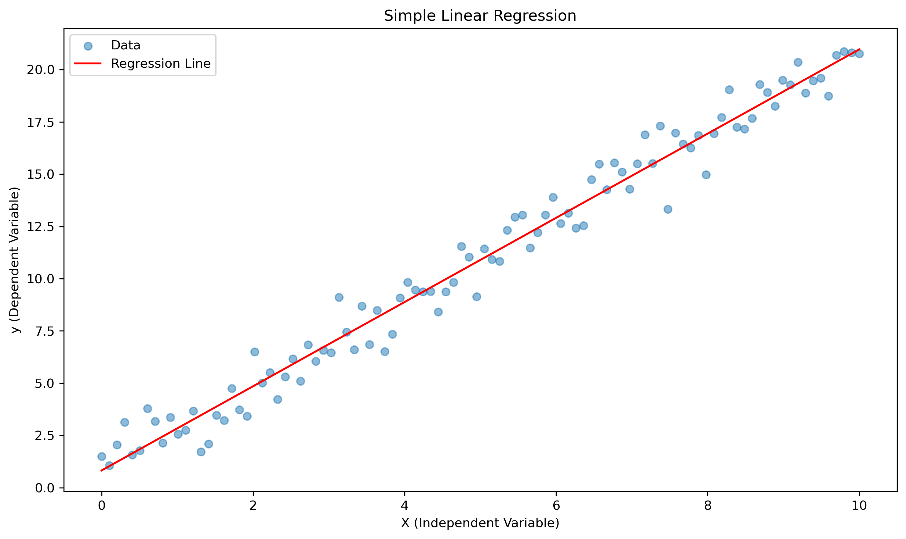
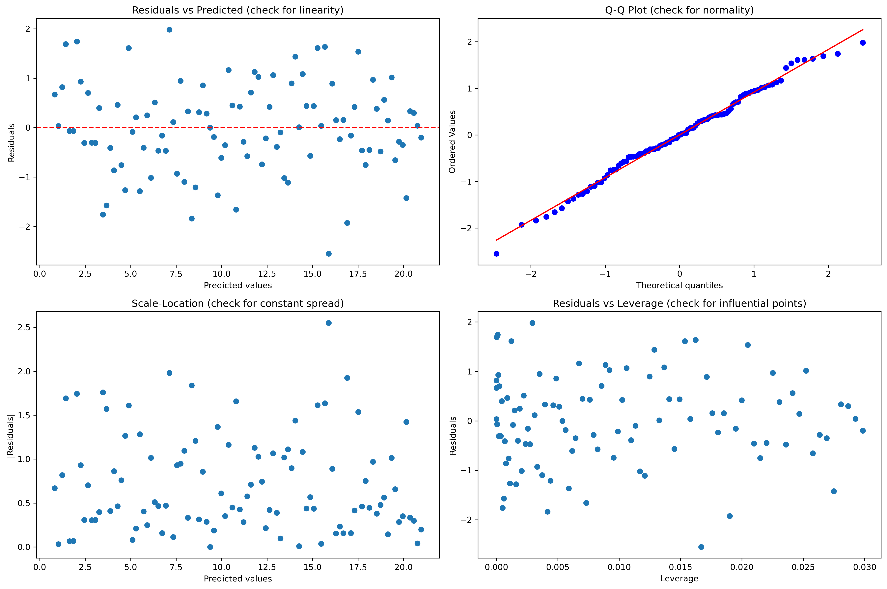

# Simple Linear Regression: Building Your First Predictive Model

Welcome to the world of predictive modeling! In this guide, we'll explore simple linear regression, a fundamental technique for understanding and predicting relationships between two variables.

## What is Simple Linear Regression?

Simple linear regression is a statistical method that models the relationship between two continuous variables:

- One independent (predictor) variable (x)
- One dependent (outcome) variable (y)

The goal is to find the best-fitting straight line that predicts y from x using the equation:

\[ \hat{y} = a + bx \]

where:

- \(\hat{y}\) is the predicted value
- \(a\) is the y-intercept (value of y when x = 0)
- \(b\) is the slope (change in y for a one-unit change in x)
- \(x\) is the independent variable

## Key Assumptions

For simple linear regression to be valid, these assumptions must be met:

1. **Linearity**
   - The relationship between x and y is linear
   - Check using scatter plots and residual plots

2. **Independence of Errors**
   - Each observation is independent
   - No patterns in residuals over time

3. **Homoscedasticity**
   - Constant variance of residuals
   - No fan or funnel shapes in residual plots

4. **Normality of Residuals**
   - Errors follow a normal distribution
   - Check using Q-Q plots

## Building a Simple Linear Regression Model

Let's build a model using Python:

```python
import numpy as np
import pandas as pd
from sklearn.linear_model import LinearRegression
import matplotlib.pyplot as plt
from sklearn.metrics import r2_score

# Generate sample data
np.random.seed(42)
X = np.linspace(0, 10, 100).reshape(-1, 1)
y = 2 * X.ravel() + 1 + np.random.normal(0, 1, 100)

# Create and fit the model
model = LinearRegression()
model.fit(X, y)

# Make predictions
y_pred = model.predict(X)

# Print model parameters
print(f"Intercept (a): {model.intercept_:.2f}")
print(f"Slope (b): {model.coef_[0]:.2f}")
print(f"R-squared: {r2_score(y, y_pred):.2f}")

# Plot the results
plt.figure(figsize=(10, 6))
plt.scatter(X, y, alpha=0.5, label='Data')
plt.plot(X, y_pred, 'r-', label='Regression Line')
plt.xlabel('X (Independent Variable)')
plt.ylabel('y (Dependent Variable)')
plt.title('Simple Linear Regression')
plt.legend()
plt.show()
```



```
Intercept (a): 0.83
Slope (b): 2.01
R-squared: 0.98
```


```
Intercept (a): 0.83
Slope (b): 2.01
R-squared: 0.98
```

```
Intercept (a): 0.83
Slope (b): 2.01
R-squared: 0.98
Saved figure to assets/simple-linear-regression_fig_1.png
```


```
Intercept (a): 0.83
Slope (b): 2.01
R-squared: 0.98
Saved figure to assets/simple-linear-regression_fig_1.png
```


## Model Interpretation

Understanding your model's output:

1. **Intercept (a)**
   - The expected value of y when x = 0
   - May not always have practical meaning
   - Example: If x is age and y is salary, a is the predicted salary at age 0

2. **Slope (b)**
   - Change in y for a one-unit increase in x
   - Direction indicates positive/negative relationship
   - Example: If b = 2, y increases by 2 units for each 1-unit increase in x

3. **R-squared (R²)**
   - Proportion of variance explained by the model
   - Ranges from 0 to 1
   - Higher values indicate better fit
   - Example: R² = 0.75 means 75% of y's variance is explained by x

## Model Diagnostics

Always check your model's validity using these diagnostic plots:

```python
# Function to create diagnostic plots
def plot_diagnostics(X, y, y_pred):
    # Calculate residuals
    residuals = y - y_pred
    
    # Create figure with subplots
    fig, axes = plt.subplots(2, 2, figsize=(15, 10))
    
    # Residuals vs Fitted
    axes[0,0].scatter(y_pred, residuals)
    axes[0,0].axhline(y=0, color='r', linestyle='--')
    axes[0,0].set_xlabel('Fitted values')
    axes[0,0].set_ylabel('Residuals')
    axes[0,0].set_title('Residuals vs Fitted')
    
    # Q-Q plot
    from scipy import stats
    stats.probplot(residuals, dist="norm", plot=axes[0,1])
    axes[0,1].set_title('Normal Q-Q')
    
    # Scale-Location
    axes[1,0].scatter(y_pred, np.abs(residuals))
    axes[1,0].set_xlabel('Fitted values')
    axes[1,0].set_ylabel('|Residuals|')
    axes[1,0].set_title('Scale-Location')
    
    # Residuals vs Leverage
    leverage = np.diagonal(X @ np.linalg.inv(X.T @ X) @ X.T)
    axes[1,1].scatter(leverage, residuals)
    axes[1,1].set_xlabel('Leverage')
    axes[1,1].set_ylabel('Residuals')
    axes[1,1].set_title('Residuals vs Leverage')
    
    plt.tight_layout()
    plt.show()

# Create diagnostic plots
plot_diagnostics(X, y, y_pred)
```




```
Saved figure to assets/simple-linear-regression_fig_2.png
```


## Practical Applications

Simple linear regression is used across many fields:

1. **Economics & Finance**
   - Predicting consumer spending from interest rates
   - Analyzing inflation-unemployment relationships

2. **Marketing & Sales**
   - Forecasting sales based on advertising spend
   - Analyzing price-demand relationships

3. **Healthcare**
   - Modeling age vs. medical costs
   - Analyzing dosage vs. treatment outcomes

4. **Sports Analytics**
   - Linking training intensity to performance
   - Predicting game outcomes

5. **Energy & Utilities**
   - Predicting energy consumption from temperature
   - Forecasting resource usage

## Common Pitfalls

1. **Extrapolation**
   - Avoid predicting beyond the range of your data
   - Model may not hold for extreme values

2. **Outliers**
   - Can significantly affect the regression line
   - Consider robust regression methods if needed

3. **Non-linear Relationships**
   - Don't force linear fit on non-linear data
   - Consider transformations or non-linear models

4. **Correlation ≠ Causation**
   - A strong relationship doesn't imply causality
   - Consider confounding variables

## Practice Exercise

Try this hands-on exercise:

```python
# Generate your own dataset
np.random.seed(42)
hours_studied = np.random.uniform(0, 10, 50)
exam_scores = 60 + 3 * hours_studied + np.random.normal(0, 5, 50)

# Create DataFrame
data = pd.DataFrame({
    'hours_studied': hours_studied,
    'exam_scores': exam_scores
})

# Your task:
# 1. Create a scatter plot
# 2. Fit a linear regression model
# 3. Make predictions
# 4. Calculate R-squared
# 5. Create diagnostic plots
# 6. Interpret the results
```

## Key Takeaways

1. Simple linear regression models linear relationships between two variables
2. Check assumptions before trusting model results
3. Use diagnostic plots to validate your model
4. Consider context when interpreting results
5. Be aware of limitations and common pitfalls

## Next Steps

Now that you understand simple linear regression, you can:

1. Learn about multiple linear regression
2. Explore non-linear regression techniques
3. Study more advanced diagnostic methods
4. Apply these concepts to real-world problems

## Additional Resources

- [DataCamp Tutorial](https://www.datacamp.com/tutorial/simple-linear-regression)
- [Penn State Statistics](https://online.stat.psu.edu/stat501/lesson/1/1.1)
- [Scikit-learn Documentation](https://scikit-learn.org/stable/modules/linear_model.html)
- [Seaborn Regression Plots](https://seaborn.pydata.org/tutorial/regression.html)
- [Perplexity AI](https://www.perplexity.ai/) - For quick statistical questions and clarifications
