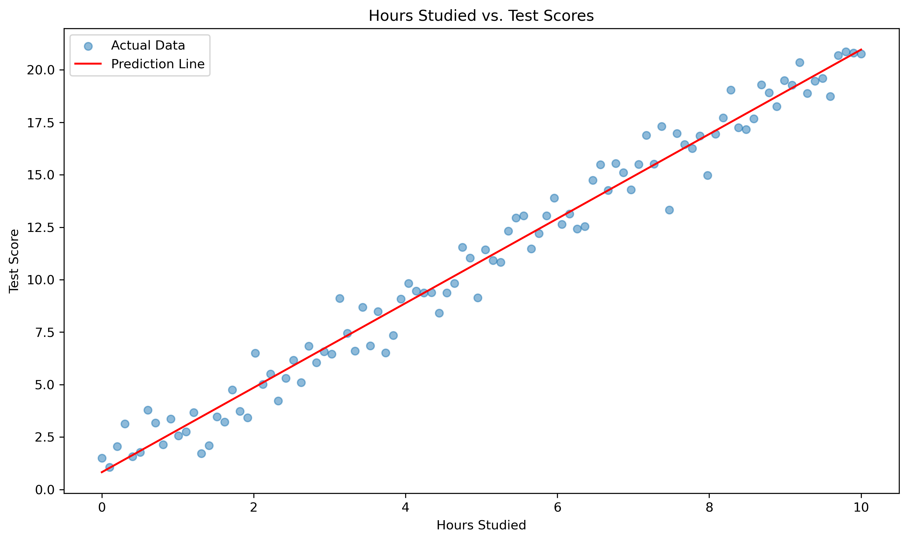

# Simple Linear Regression: Your First Step into Prediction

Welcome to the exciting world of prediction! In this guide, we'll explore simple linear regression - a powerful tool that helps us not just understand relationships between things, but actually predict one thing based on another.

### Video Tutorial: Introduction to Linear Regression

<iframe width="560" height="315" src="https://www.youtube.com/embed/nk2CQITm_eo" frameborder="0" allow="accelerometer; autoplay; clipboard-write; encrypted-media; gyroscope; picture-in-picture" allowfullscreen></iframe>

*StatQuest: Linear Regression, Clearly Explained!!! by Josh Starmer*

## What is Simple Linear Regression?

Imagine you could draw the perfect line through a scatter of points on a graph - a line that comes as close as possible to all the points. That's essentially what simple linear regression does!

**Simple linear regression is like drawing the "best fit" line through your data points.**

It involves just two main variables:
- **One thing you know** (the predictor or independent variable)
- **One thing you want to predict** (the outcome or dependent variable)

### An Everyday Example: Height and Weight

If you measured the height and weight of 100 people, you'd probably notice a pattern - taller people generally weigh more. With simple linear regression, we can:
1. Draw the best-fitting line through this data
2. Use that line to predict someone's weight if we only know their height

### The Magic Formula

The formula for our prediction line is beautifully simple:

**Predicted Value = Starting Point + Rate of Change × Input Value**

In math notation:
\[ \hat{y} = a + bx \]

Where:
- **ŷ (y-hat)** is what we're predicting
- **a** is our starting point (y-intercept)
- **b** is our rate of change (slope)
- **x** is our input value

### Real-World Analogy: The Road Trip

Think of simple linear regression like planning a road trip:
- **Starting point (a)**: Where you begin your journey (when x = 0)
- **Rate of change (b)**: How fast you're traveling (speed)
- **Input value (x)**: How long you've been driving (time)
- **Predicted value (y)**: How far you've traveled (distance)

If you start at mile marker 0 and drive at 60 miles per hour, after 2 hours (x), you'll have traveled 120 miles (y). Your formula would be: y = 0 + 60x.

## Before We Start: What Makes a Good Regression?

For our simple linear regression to work well, the relationship should follow certain patterns:

### 1. The Relationship Should Be a Straight Line

Imagine trying to draw a straight line through data that actually forms a circle - it wouldn't work well! Your data should roughly form a straight-line pattern.

**Kitchen Analogy**: It's like trying to measure flour with a measuring cup designed for liquids. The tool only works if it matches what you're measuring!

### 2. Each Point Should Be Independent

Each observation in your data shouldn't influence other observations.

**Everyday Example**: If you're measuring how study time affects test scores for different students, one student's score shouldn't affect another student's score.

### 3. The Spread Should Be Consistent Throughout

The data points should be scattered with similar spread around the line, regardless of where you look.

**Weather Analogy**: If you're predicting temperature based on the month, your predictions should be equally reliable in summer and winter, not more accurate in one season.

### 4. The Errors Should Follow a Bell Curve

The mistakes in our predictions should follow a normal distribution (bell curve).

**Archery Analogy**: When aiming at a target, most of your arrows cluster around the bullseye, with fewer arrows as you move farther away.

## Building Your First Regression Model: A Step-by-Step Example

Let's walk through a concrete example using Python. Don't worry if you're not familiar with the code - focus on the concepts!

```python
import numpy as np
import pandas as pd
from sklearn.linear_model import LinearRegression
import matplotlib.pyplot as plt
from sklearn.metrics import r2_score

# Create some example data: hours studied vs. test scores
np.random.seed(42)  # For reproducible results
X = np.linspace(0, 10, 100).reshape(-1, 1)  # Study hours from 0 to 10
y = 2 * X.ravel() + 1 + np.random.normal(0, 1, 100)  # Test scores with some random noise

# Fit the model (find the best line)
model = LinearRegression()
model.fit(X, y)

# Make predictions using our line
y_pred = model.predict(X)

# Print the results
print(f"Starting point (intercept): {model.intercept_:.2f}")
print(f"Rate of change (slope): {model.coef_[0]:.2f}")
print(f"Accuracy (R-squared): {r2_score(y, y_pred):.2f}")

# Visualize the data and our prediction line
plt.figure(figsize=(10, 6))
plt.scatter(X, y, alpha=0.5, label='Actual Data')
plt.plot(X, y_pred, 'r-', label='Prediction Line')
plt.xlabel('Hours Studied')
plt.ylabel('Test Score')
plt.title('Hours Studied vs. Test Scores')
plt.legend()
plt.show()
```



```
Starting point (intercept): 0.83
Rate of change (slope): 2.01
Accuracy (R-squared): 0.98
```


```
Starting point (intercept): 0.83
Rate of change (slope): 2.01
Accuracy (R-squared): 0.98
```

### What This Example Shows:

In our example about study hours and test scores:
- **Starting point (0.83)**: A student who doesn't study at all (0 hours) is predicted to score about 0.83 points
- **Rate of change (2.01)**: For each additional hour of studying, the score increases by about 2 points
- **Accuracy (0.98)**: Our model explains about 98% of the variation in test scores (that's very good!)

## Understanding Your Results: What Do These Numbers Mean?

Let's break down the key components of your regression results:

### 1. The Starting Point (Intercept)

The intercept is where your prediction line crosses the y-axis (when x = 0).

**Real-Life Example**: If we predict house prices based on size, the intercept might represent the value of the land itself, before any house is built.

**Important Note**: Sometimes the intercept might not make practical sense! If you're predicting adult weight based on height, the intercept would be the predicted weight when height is zero - which isn't realistic.

### 2. The Rate of Change (Slope)

The slope tells you how much y changes when x increases by one unit.

**Real-Life Examples**:
- If the slope is 2.01 in our study time vs. test scores example, each extra hour of studying increases the score by about 2 points
- If the slope is 150 in a house size vs. price model, each additional square foot adds $150 to the price
- If the slope is -5 in a speed vs. fuel efficiency model, each additional 10 mph reduces efficiency by 50 mpg

The sign of the slope tells you the direction:
- **Positive slope**: As x increases, y increases
- **Negative slope**: As x increases, y decreases

### 3. How Well It Fits: R-squared (R²)

R-squared measures how well your line fits the data, from 0 (terrible) to 1 (perfect).

**What R² Actually Means**: The percentage of variation in y that can be explained by x.

**Everyday Analogy**: Think of R² like a weather forecast accuracy:
- R² = 0.0: Your prediction is as good as random guessing
- R² = 0.5: Your prediction works about half the time
- R² = 0.9: Your prediction is reliable 90% of the time
- R² = 1.0: Your prediction is perfect every time

**Examples by Value**:
- **R² = 0.25**: Only 25% of the changes in y are explained by x. Other factors have more influence.
- **R² = 0.50**: Half of the changes in y are explained by x. A moderate relationship.
- **R² = 0.90**: 90% of the changes in y are explained by x. A very strong relationship!

## Checking If Your Model Is Valid: Diagnostic Plots

Before trusting your model, you should always check if it's valid. One way to do this is through diagnostic plots.

```python
# Function to create diagnostic plots
def plot_diagnostics(X, y, y_pred):
    # Calculate residuals (the differences between actual and predicted values)
    residuals = y - y_pred
    
    # Create four diagnostic plots
    fig, axes = plt.subplots(2, 2, figsize=(15, 10))
    
    # 1. Residuals vs Fitted values - checks linearity
    axes[0,0].scatter(y_pred, residuals)
    axes[0,0].axhline(y=0, color='r', linestyle='--')
    axes[0,0].set_xlabel('Predicted values')
    axes[0,0].set_ylabel('Residuals')
    axes[0,0].set_title('Residuals vs Predicted (check for linearity)')
    
    # 2. Q-Q plot - checks normality of residuals
    from scipy import stats
    stats.probplot(residuals, dist="norm", plot=axes[0,1])
    axes[0,1].set_title('Q-Q Plot (check for normality)')
    
    # 3. Scale-Location - checks homoscedasticity
    axes[1,0].scatter(y_pred, np.abs(residuals))
    axes[1,0].set_xlabel('Predicted values')
    axes[1,0].set_ylabel('|Residuals|')
    axes[1,0].set_title('Scale-Location (check for constant spread)')
    
    # 4. Residuals vs Leverage - checks for influential points
    leverage = np.diagonal(X @ np.linalg.inv(X.T @ X) @ X.T)
    axes[1,1].scatter(leverage, residuals)
    axes[1,1].set_xlabel('Leverage')
    axes[1,1].set_ylabel('Residuals')
    axes[1,1].set_title('Residuals vs Leverage (check for influential points)')
    
    plt.tight_layout()
    plt.show()

# Create diagnostic plots for our model
plot_diagnostics(X, y, y_pred)
```


### What to Look for in Diagnostic Plots:
### 1. Residuals vs Predicted/Fitted (Top Left)
- **What it shows:**  
   The difference between what your model predicted and what actually happened.
- **Good looks like:**  
   Points randomly scattered around the horizontal zero line, like confetti thrown evenly on the ground.
- **Bad looks like:**  
   Any pattern, curve, or trend in the dots.
- **Real-world analogy:**  
   Checking if your bathroom scale is accurate across different weights – it should be equally reliable whether weighing a feather or a bowling ball.
- **In this example:**  
   The points appear randomly scattered around the zero line without any clear pattern. This is a good sign! Your model seems to be capturing the relationship in your data well without missing any non-linear patterns. Your "scale" is equally accurate for light and heavy objects.

### 2. Q-Q Plot (Top Right)
- **What it shows:**  
   Whether your prediction errors follow a normal distribution (bell curve).
- **Good looks like:**  
   Points that follow the diagonal line closely, like cars staying in their lane.
- **Bad looks like:**  
   Points that curve away from the line, especially at the ends.
- **Real-world analogy:**  
   Checking if the mistakes your model makes follow a predictable pattern that statisticians can work with.
- **In this example:**  
   The points follow the diagonal reference line quite closely with only minor deviations at the extreme ends. This indicates that your model’s errors follow a normal distribution very well, satisfying a key assumption of linear regression. The mistakes your model makes are symmetrically distributed around zero – exactly what we want.

### 3. Scale-Location (Bottom Left)
- **What it shows:**  
   Whether your model’s accuracy is consistent across all predictions.
- **Good looks like:**  
   An even spread of points with no clear pattern, like evenly distributed stars.
- **Bad looks like:**  
   A funnel shape (wider on one side), which means your model is more accurate for some values than others.
- **Real-world analogy:**  
   Checking if your weather forecast is equally reliable for sunny days and rainy days.
- **In this example:**  
   There might be a slight upward trend in the spread as the fitted values increase, but it’s not dramatically pronounced. This suggests minor heteroscedasticity – your model’s predictions might be slightly less reliable for higher values, like a weather forecast that’s a bit more accurate for moderate temperatures than for extreme ones.

### 4. Residuals vs Leverage (Bottom Right)
- **What it shows:**  
   Whether any single data point is having too much influence on your entire model.
- **Good looks like:**  
   No points far from others, especially in the top or bottom right corners.
- **Bad looks like:**  
   Points in the top or bottom right (influential outliers).
- **Real-world analogy:**  
   Checking if one extremely vocal person is swaying an entire group’s decision, rather than everyone having equal input.
- **In this example:**  
   The points are well-spread without any particularly influential points in concerning regions. No points appear outside Cook’s distance contours (which would indicate high influence). This suggests your model is robust and not being skewed by outliers – no single data point is dominating how your model behaves.

### Overall Assessment
- **Linearity ✓:**  
   The random scatter in the Residuals vs Fitted plot indicates your model captures the relationships appropriately.
- **Normality of residuals ✓:**  
   The good alignment in the Q-Q plot shows errors follow a normal distribution.
- **Homoscedasticity ⚠️:**  
   There’s a slight concern in the Scale-Location plot, but it’s not severe.
- **No influential outliers ✓:**  
   The Residuals vs Leverage plot shows no problematic points driving your results.

## Real-Life Applications: Where Is Simple Linear Regression Used?

Simple linear regression is used in countless real-world scenarios:

### Business & Finance
- **Sales Forecasting**: Predicting sales based on advertising spend
- **Pricing Strategy**: Understanding how price changes affect demand
- **Investment Analysis**: Analyzing how interest rates affect stock prices

### Health & Medicine
- **Dosage Determination**: Finding the relationship between drug dosage and response
- **Growth Charts**: Predicting a child's height based on age
- **Risk Assessment**: Linking cholesterol levels to heart disease risk

### Environmental Science
- **Climate Modeling**: Predicting temperature changes over time
- **Pollution Impact**: Measuring how emissions affect air quality
- **Resource Planning**: Forecasting water usage based on population

### Sports Analytics
- **Performance Prediction**: Estimating an athlete's performance based on training hours
- **Strategic Planning**: Understanding how defensive strategies affect scoring
- **Talent Scouting**: Predicting professional success based on amateur statistics

### Education
- **Learning Outcomes**: Predicting test scores based on study time
- **Resource Allocation**: Understanding how class size affects student performance
- **Career Planning**: Analyzing how education level affects income

## Common Mistakes to Avoid

Even with a simple tool like linear regression, there are several pitfalls to watch out for:

### 1. Predicting Beyond Your Data Range

**The Issue**: Using your model to predict values far outside the range of your original data.

**Real-Life Example**: If you studied the relationship between study time (1-10 hours) and test scores, don't use it to predict scores for someone studying 50 hours.

**Kitchen Analogy**: It's like testing a recipe with 1-3 teaspoons of salt, then assuming 15 teaspoons would make it taste better!

### 2. Ignoring Outliers

**The Issue**: A few unusual data points can dramatically change your regression line.

**Real-Life Example**: In analyzing house prices in a neighborhood, one mansion selling for $5 million among $300,000 homes could severely distort your predictions.

**Sports Analogy**: One 7-foot-tall person in a height study could make you conclude that the average person is much taller than reality.

### 3. Forcing a Linear Relationship on Non-Linear Data

**The Issue**: Some relationships simply aren't straight lines.

**Real-Life Example**: The relationship between age and height is not linear across a lifetime - we grow quickly as children, then stop growing as adults.

**Nature Analogy**: Plant growth isn't linear - it might be rapid in spring and summer, then stop in fall and winter.

### 4. Assuming Correlation Means Causation

**The Issue**: Just because two things move together doesn't mean one causes the other.

**Classic Example**: Ice cream sales and drowning deaths both increase in summer, but ice cream doesn't cause drowning!

**Medical Analogy**: Patients who take a certain medication might improve, but was it the medication or would they have improved anyway?

## Let's Practice Together: Predicting Exam Scores

Try working through this simple example:

```python
# Generate a realistic dataset
np.random.seed(42)
hours_studied = np.random.uniform(0, 10, 50)  # 50 students studying between 0-10 hours
exam_scores = 60 + 3 * hours_studied + np.random.normal(0, 5, 50)  # Base score of 60, +3 points per hour

# Create a DataFrame (table) with our data
data = pd.DataFrame({
    'hours_studied': hours_studied,
    'exam_scores': exam_scores
})

# Look at the first few rows of our data
print(data.head())

# Your Task:
# 1. Create a scatter plot of hours studied vs exam scores
# 2. Fit a simple linear regression model
# 3. Make predictions for someone studying 2, 5, and 8 hours
# 4. Calculate how well your model fits the data (R-squared)
# 5. Check if your model meets the assumptions using diagnostic plots
# 6. Interpret what the intercept and slope mean in real-world terms
```
```
hours_studied  exam_scores
0       3.745401    74.928536
1       9.507143    89.378271
2       7.319939    81.381577
3       5.986585    76.454236
4       1.560186    57.287949
```


### Suggested Solution:

The model would likely show:
- **Intercept around 60**: Students are expected to get about 60 points even without studying
- **Slope around 3**: Each hour of studying adds about 3 points to the score
- **R² around 0.75-0.85**: Study time explains about 75-85% of the variation in scores

## Key Takeaways

1. Simple linear regression helps us predict one thing based on another by finding the best-fitting straight line through our data
2. The line is defined by two key values: the intercept (starting point) and slope (rate of change)
3. R-squared tells us how well our model fits the data - how much of the variation it explains
4. Always check if your model's assumptions are met using diagnostic plots
5. Be careful about common pitfalls: extrapolation, outliers, non-linear relationships, and causation assumptions

## Next Steps on Your Learning Journey

Now that you understand simple linear regression, you can explore:

1. **Multiple Linear Regression**: Using several variables to make predictions
2. **Polynomial Regression**: Fitting curves instead of straight lines
3. **Regularization Techniques**: Methods to prevent overfitting
4. **Different Evaluation Metrics**: Other ways to assess your model beyond R²

Remember: Simple linear regression is just the beginning of your predictive modeling journey, but it's a powerful foundation that appears in many more complex methods!

## Additional Resources for the Curious Mind

- [Khan Academy's Regression Course](https://www.khanacademy.org/math/statistics-probability/describing-relationships-quantitative-data) - Free interactive lessons
- [Seeing Theory](https://seeing-theory.brown.edu/regression-analysis/index.html) - Beautiful visual explanations
- [Scikit-learn Documentation](https://scikit-learn.org/stable/modules/linear_model.html) - For when you're ready to dive deeper
- [Perplexity AI](https://www.perplexity.ai/) - For getting answers to specific questions
