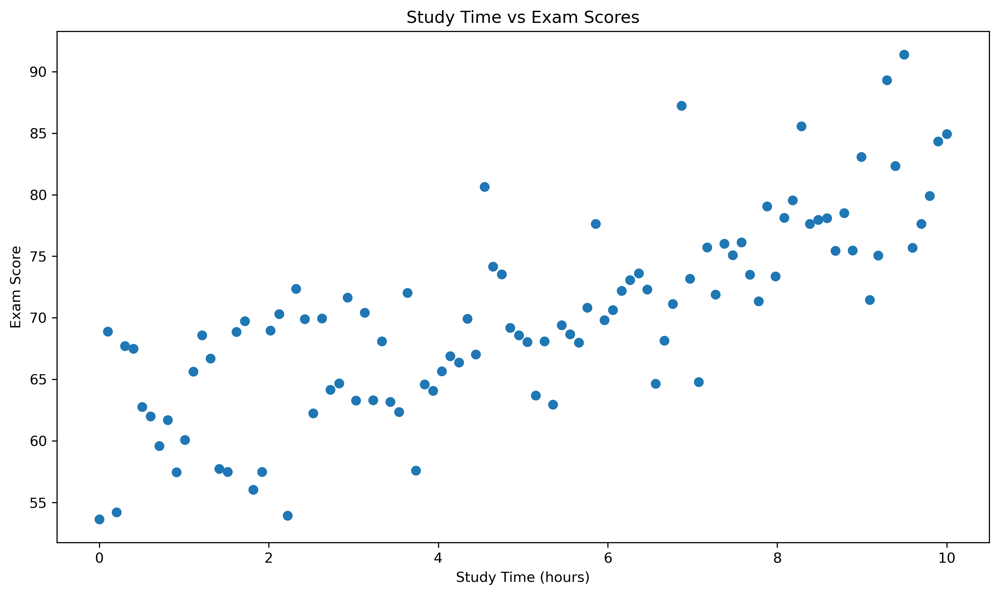
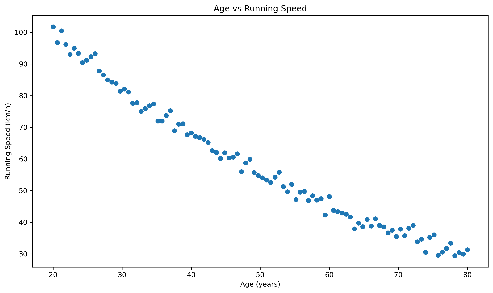
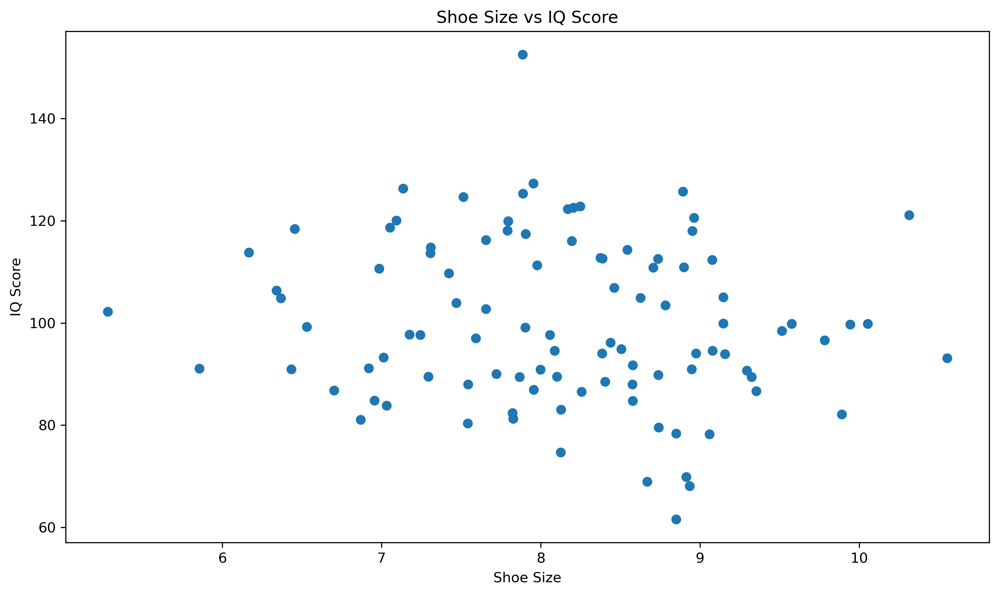

# Understanding Relationships in Data

Welcome to the first step in your journey of understanding relationships in data! This guide will help you identify and interpret different types of relationships between variables. We'll start with the basics and gradually build up to more complex concepts.

## What is a Relationship?

A relationship between two variables exists when changes in one variable are associated with changes in another variable. Think of it like this: if you're studying how study time affects exam scores, you're looking for a relationship between these two variables.

For example:

- When study time increases, do exam scores tend to increase as well?
- When temperature rises, do ice cream sales go up?
- When exercise frequency increases, does weight tend to decrease?

These are all examples of relationships we might want to study.

## Core Concepts in Data Relationships

Before diving into specific types of relationships, let's understand some fundamental concepts:

1. **Entities and Attributes**
   - An entity is what we're measuring or observing (e.g., students, temperatures, sales)
   - Attributes are the specific characteristics we measure (e.g., study time, test scores)

2. **Data Integrity**
   - Ensuring our data is accurate and consistent
   - Checking for missing or incorrect values
   - Validating that relationships make logical sense

3. **Measurement Scales**
   - Nominal (categories)
   - Ordinal (ordered categories)
   - Interval (equal intervals)
   - Ratio (true zero point)

## Types of Relationships

### 1. Linear Relationships

A linear relationship is when the change in one variable is proportional to the change in another variable. Imagine a straight line on a graph.

Example: The relationship between study time and exam scores

```python
# Example of a linear relationship
import numpy as np
import matplotlib.pyplot as plt

# Generate data
study_time = np.linspace(0, 10, 100)  # Creates 100 evenly spaced numbers from 0 to 10
exam_scores = 2 * study_time + 60 + np.random.normal(0, 5, 100)  # Creates scores with some random variation

# Plot
plt.figure(figsize=(10, 6))
plt.scatter(study_time, exam_scores)
plt.title('Study Time vs Exam Scores')
plt.xlabel('Study Time (hours)')
plt.ylabel('Exam Score')
plt.show()
```




In this example:

- The x-axis shows study time in hours
- The y-axis shows exam scores
- Each point represents one student
- The general trend shows that more study time leads to higher scores

### 2. Non-linear Relationships

Not all relationships are straight lines! Some relationships curve or have more complex patterns.

Example: The relationship between age and running speed

```python
# Example of a non-linear relationship
age = np.linspace(20, 80, 100)  # Creates 100 evenly spaced ages from 20 to 80
running_speed = 100 * np.exp(-0.02 * (age - 20)) + np.random.normal(0, 2, 100)  # Creates speeds that decrease with age

plt.figure(figsize=(10, 6))
plt.scatter(age, running_speed)
plt.title('Age vs Running Speed')
plt.xlabel('Age (years)')
plt.ylabel('Running Speed (km/h)')
plt.show()
```




In this example:

- The x-axis shows age
- The y-axis shows running speed
- The curve shows that running speed tends to decrease as people get older
- The decrease is not constant - it's faster at younger ages and slower at older ages

### 3. No Relationship

Sometimes variables don't have any meaningful connection.

Example: Shoe size and IQ scores

```python
# Example of no relationship
shoe_size = np.random.normal(8, 1, 100)  # Creates random shoe sizes
iq_score = np.random.normal(100, 15, 100)  # Creates random IQ scores

plt.figure(figsize=(10, 6))
plt.scatter(shoe_size, iq_score)
plt.title('Shoe Size vs IQ Score')
plt.xlabel('Shoe Size')
plt.ylabel('IQ Score')
plt.show()
```




In this example:

- The x-axis shows shoe size
- The y-axis shows IQ score
- The points are scattered randomly
- There's no clear pattern or trend

## Relationship Structures in Data

### 1. One-to-One (1:1)

- Each value in one variable corresponds to exactly one value in another
- Example: Each person has one passport number
- Rare in practice, often indicates data could be combined

### 2. One-to-Many (1:N)

- One value in a variable can relate to multiple values in another
- Example: One customer can make many purchases
- Most common type in real-world data

### 3. Many-to-Many (M:N)

- Values in both variables can relate to multiple values in the other
- Example: Students can take many courses, courses can have many students
- Requires special handling in analysis

## Strength of Relationships

Relationships can be:

- Strong: Points cluster closely around a pattern
  - Example: The relationship between height and weight in adults
  - Visual: Points form a clear, tight pattern

- Weak: Points are more scattered
  - Example: The relationship between daily steps and weight loss
  - Visual: Points form a loose, scattered pattern

- Perfect: All points fall exactly on a line or curve
  - Example: The relationship between Celsius and Fahrenheit temperatures
  - Visual: All points lie exactly on a straight line

## Direction of Relationships

- Positive: As one variable increases, the other increases
  - Example: Study time and exam scores
  - Visual: Points trend upward from left to right

- Negative: As one variable increases, the other decreases
  - Example: Temperature and heating costs
  - Visual: Points trend downward from left to right

- No direction: In non-linear relationships
  - Example: Age and running speed
  - Visual: Points form a curve

## Common Misconceptions and Pitfalls

1. Confusing Correlation with Causation
   - Just because two variables are related doesn't mean one causes the other
   - Example: Ice cream sales and drowning incidents both increase in summer, but one doesn't cause the other
   - Always ask: Is there a third factor that might explain the relationship?
   - Consider confounding variables and lurking variables

2. Ignoring Outliers
   - Extreme values can distort the apparent relationship
   - Always check your data for outliers
   - Example: A billionaire in a study of income and spending habits
   - Use appropriate techniques to handle outliers

3. Overlooking Non-linear Patterns
   - Not all relationships are straight lines
   - Look beyond simple linear patterns
   - Example: The relationship between study time and exam scores might level off after a certain point
   - Consider transformations when appropriate

4. Assuming Relationships are Static
   - Relationships can change over time
   - Example: The relationship between education and income varies by generation
   - Regular revalidation is important

5. Ignoring Context
   - Relationships that hold in one context might not in another
   - Example: Temperature and energy use relationship differs by climate
   - Consider domain knowledge and external factors

## Practice Exercise

Try this exercise to test your understanding:

1. Collect data on two variables you're interested in
   - Example: Daily steps and hours of sleep
   - Example: Study time and grades
   - Example: Temperature and energy usage

2. Create a scatter plot
   - Use the code examples above as a guide
   - Make sure to label your axes
   - Add a title to your plot

3. Describe the relationship you observe:
   - Type (linear/non-linear/none)
   - Strength (strong/weak)
   - Direction (positive/negative/none)
   - Any interesting patterns or outliers

## Key Takeaways

1. Understand the nature of your variables before analyzing relationships
2. Choose appropriate visualization methods
3. Consider multiple types of relationships
4. Be aware of common pitfalls
5. Always validate your findings
6. Consider context and practical significance

## Next Steps

Now that you understand the basics of relationships, you're ready to:

1. Learn how to measure these relationships using correlation
2. Build regression models to predict outcomes
3. Test the significance of relationships
4. Apply these concepts to real-world data

Remember: The key to understanding relationships is practice and patience. Don't be afraid to experiment with different variables and visualize their relationships!

## Additional Resources

- [Python Data Science Handbook - Visualization](https://jakevdp.github.io/PythonDataScienceHandbook/04.00-introduction-to-matplotlib.html)
- [Seaborn Gallery](https://seaborn.pydata.org/examples/index.html)
- [Matplotlib Tutorial](https://matplotlib.org/stable/tutorials/index.html)
- [Perplexity AI](https://www.perplexity.ai/) - A helpful tool for getting quick answers to your statistics questions
- [Practical Data Modeling Guide](https://practicaldatamodeling.substack.com/p/relationships)
- [Database Relationships Guide](https://www.acceldata.io/blog/database-relationships-explained-key-concepts-and-best-practices)
