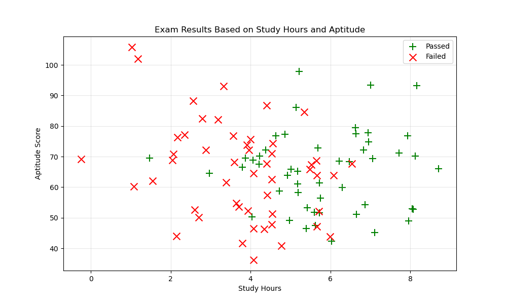
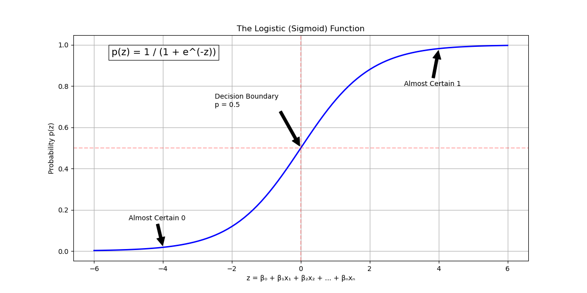
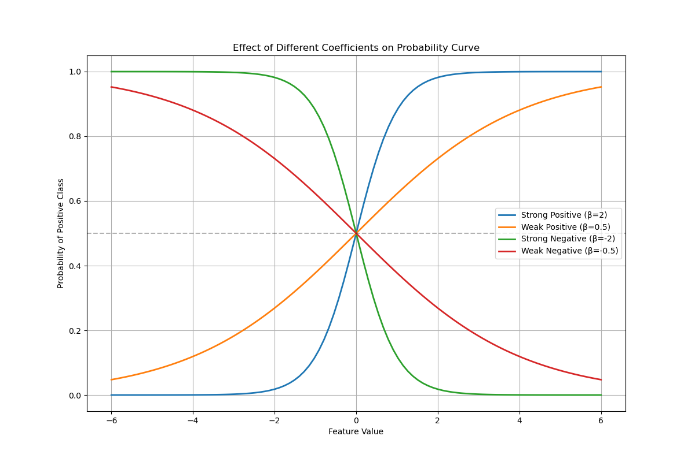
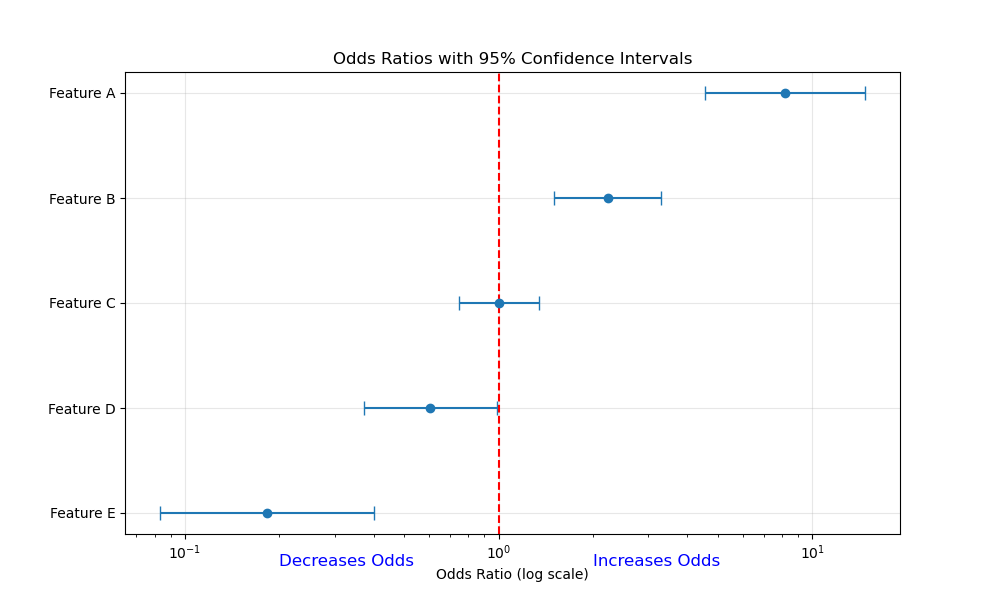
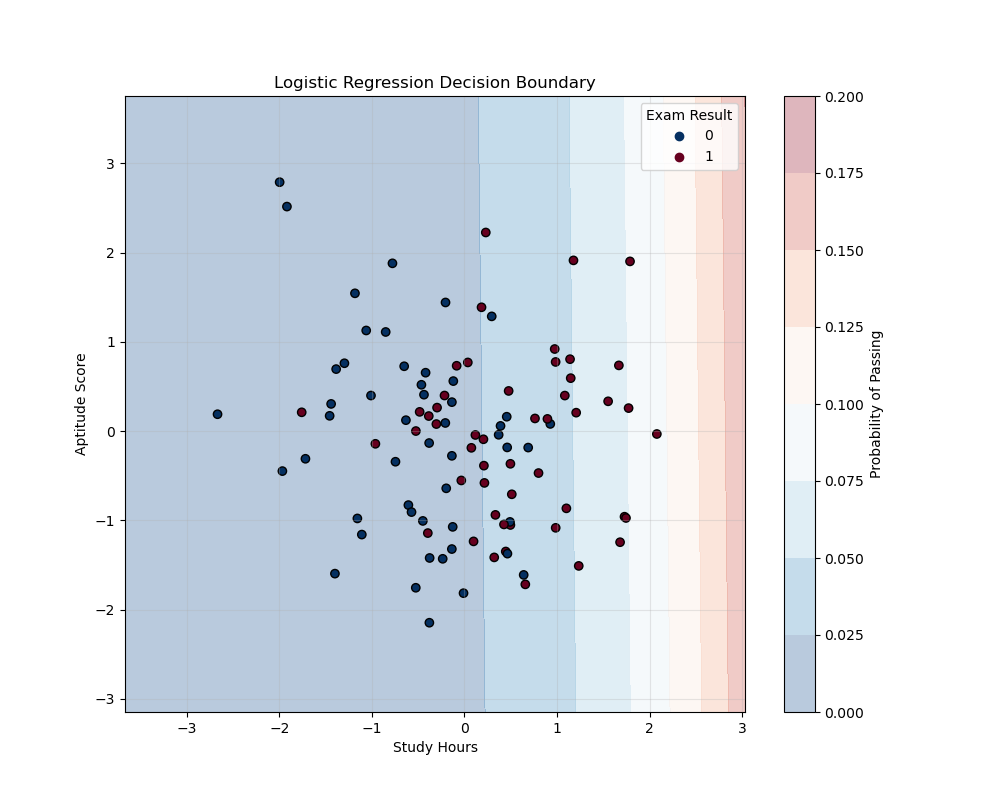
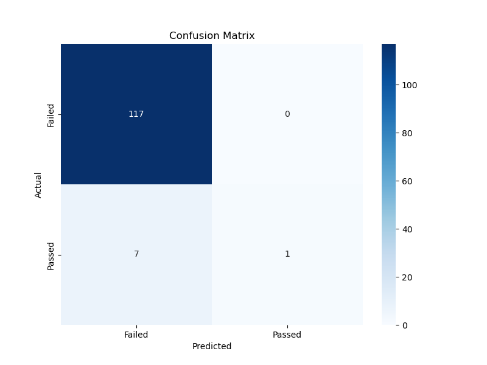
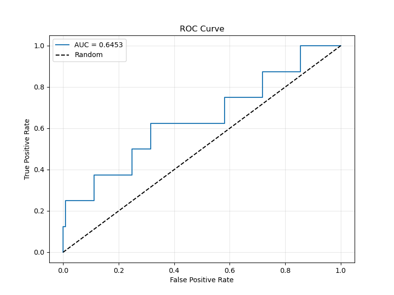
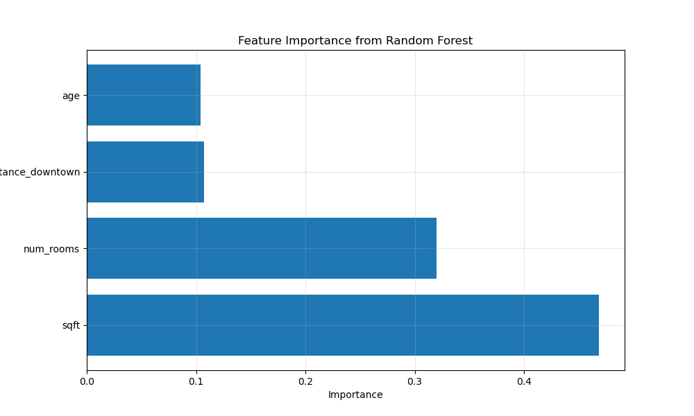

# Logistic Regression Fundamentals

## Introduction

Logistic regression is one of the most fundamental and widely used classification algorithms in statistics and machine learning. Despite its name containing "regression," it's primarily used for classification tasks - specifically, for predicting categorical outcomes like yes/no, true/false, or 0/1.

### What is Logistic Regression?

Logistic regression is a statistical method that:

- Estimates the probability that an instance belongs to a particular class
- Uses the logistic function to transform a linear combination of features into a probability (0 to 1)
- Sets a threshold (typically 0.5) to convert probabilities into class predictions
- Works best for binary classification problems but can be extended to multi-class scenarios

### Real-world Examples

Before diving into the technical details, let's look at some everyday examples where logistic regression is used:

1. **Email Spam Detection**
   - **Input**: Email content, sender information, subject line characteristics
   - **Output**: Spam (1) or Not Spam (0)
   - **Benefits**: Easy to interpret which features contribute most to "spamminess"

2. **Medical Diagnosis**
   - **Input**: Patient symptoms, test results, demographic information
   - **Output**: Disease Present (1) or Not Present (0)
   - **Benefits**: Provides probability estimates that help doctors assess risk levels

3. **Credit Risk Assessment**
   - **Input**: Customer financial history, income, debt ratio, payment history
   - **Output**: High Risk (1) or Low Risk (0)
   - **Benefits**: Transparent model that regulatory agencies can audit

4. **Customer Purchase Prediction**
   - **Input**: Customer browsing history, demographic info, past purchases
   - **Output**: Will Purchase (1) or Won't Purchase (0)
   - **Benefits**: Provides probability scores that can be used for targeted marketing

### Visualizing the Classification Problem

Let's visualize a simple binary classification problem that logistic regression can solve:

```python
import numpy as np
import matplotlib.pyplot as plt
import pandas as pd
from sklearn.linear_model import LogisticRegression
from sklearn.model_selection import train_test_split
from sklearn.metrics import accuracy_score, confusion_matrix, classification_report
from sklearn.preprocessing import StandardScaler
import seaborn as sns

# Set a random seed for reproducibility
np.random.seed(42)

# Generate synthetic data for student exam results
study_hours = np.random.normal(5, 2, 100)
aptitude_scores = np.random.normal(65, 15, 100)

# Create a relationship where both study time and aptitude affect passing probability
# with some randomness
# Higher study hours and higher aptitude scores increase passing probability
passing_probability = 1 / (1 + np.exp(-(0.75 * (study_hours - 5) + 0.02 * (aptitude_scores - 65))))
passed = np.random.binomial(1, passing_probability)

# Create a DataFrame for easier data handling
exam_data = pd.DataFrame({
    'StudyHours': study_hours,
    'AptitudeScore': aptitude_scores,
    'Passed': passed
})

# Plot the data
plt.figure(figsize=(10, 6))
plt.scatter(exam_data.StudyHours[exam_data.Passed == 1], 
            exam_data.AptitudeScore[exam_data.Passed == 1], 
            c='green', marker='+', s=100, label='Passed')
plt.scatter(exam_data.StudyHours[exam_data.Passed == 0], 
            exam_data.AptitudeScore[exam_data.Passed == 0], 
            c='red', marker='x', s=100, label='Failed')
plt.xlabel('Study Hours')
plt.ylabel('Aptitude Score')
plt.title('Exam Results Based on Study Hours and Aptitude')
plt.legend()
plt.grid(True, alpha=0.3)
plt.savefig('binary_classification_example.png')
plt.show()

print(exam_data.head())
```

This code generates and visualizes a dataset representing student exam results based on study hours and aptitude scores. When you run it, you'll see a scatter plot like this (saved as `binary_classification_example.png`):



In this plot:

- **Green plus signs (+)** represent students who passed the exam
- **Red x marks** represent students who failed the exam
- The challenge is to build a model that can predict whether a new student will pass based on their study hours and aptitude score

## Understanding the Basics

### From Linear to Logistic Regression

To understand how logistic regression works, let's start with what we know about linear regression:

**Linear Regression**: $y = \beta_0 + \beta_1 x_1 + \beta_2 x_2 + ... + \beta_n x_n$

The problem with using linear regression for classification is that it can produce values outside the range [0,1], making them difficult to interpret as probabilities. This is where the logistic function comes in.

### The Logistic Function

Logistic regression uses a special S-shaped curve called the logistic function (or sigmoid function):

$$p = \frac{1}{1 + e^{-z}}$$

Where:

- $p$ is the probability of the positive class (between 0 and 1)
- $z$ is the linear combination of features: $z = \beta_0 + \beta_1 x_1 + \beta_2 x_2 + ... + \beta_n x_n$
- $e$ is the base of natural logarithm (approximately 2.718)

Let's visualize this function:

```python
def plot_logistic_curve():
    """Visualize the logistic function with annotations"""
    x = np.linspace(-6, 6, 100)
    y = 1 / (1 + np.exp(-x))
    
    plt.figure(figsize=(12, 6))
    plt.plot(x, y, 'b-', linewidth=2)
    
    # Add annotations
    plt.annotate('Almost Certain 0', xy=(-4, 0.02), xytext=(-5, 0.15),
                arrowprops=dict(facecolor='black', shrink=0.05))
    plt.annotate('Decision Boundary\np = 0.5', xy=(0, 0.5), xytext=(-2.5, 0.7),
                arrowprops=dict(facecolor='black', shrink=0.05))
    plt.annotate('Almost Certain 1', xy=(4, 0.98), xytext=(3, 0.8),
                arrowprops=dict(facecolor='black', shrink=0.05))
    
    # Add a horizontal line at p = 0.5
    plt.axhline(y=0.5, color='r', linestyle='--', alpha=0.3)
    # Add a vertical line at z = 0
    plt.axvline(x=0, color='r', linestyle='--', alpha=0.3)
    
    plt.title('The Logistic (Sigmoid) Function')
    plt.xlabel('z = β₀ + β₁x₁ + β₂x₂ + ... + βₙxₙ')
    plt.ylabel('Probability p(z)')
    plt.grid(True)
    plt.text(-5.5, 0.95, 'p(z) = 1 / (1 + e^(-z))', fontsize=14, bbox=dict(facecolor='white', alpha=0.8))
    plt.savefig('logistic_curve_annotated.png')
    plt.show()

# Plot the logistic curve
plot_logistic_curve()
```

When you run this code, you'll see a visualization of the logistic function (saved as `logistic_curve_annotated.png`):



Key characteristics of the logistic function:

1. **Range**: Always between 0 and 1 (perfect for representing probabilities)
2. **S-shape**: Gradually transitions from 0 to 1
3. **Symmetry**: Centered at z = 0, where p = 0.5
4. **Asymptotes**: Approaches but never reaches exactly 0 or 1

### Mathematical Foundation

The logistic regression model uses the following equation to calculate probabilities:

$$P(Y=1|X) = \frac{1}{1 + e^{-(\beta_0 + \beta_1X_1 + ... + \beta_pX_p)}}$$

Where:

- $P(Y=1|X)$ is the probability of the positive class given the input features X
- $\beta_0$ is the intercept (bias)
- $\beta_1, ..., \beta_p$ are the coefficients for each feature
- $X_1, ..., X_p$ are the input features

To make the model more useful, we can transform this equation to get the "log odds" or "logit" function:

$$\log\left(\frac{P(Y=1|X)}{1-P(Y=1|X)}\right) = \beta_0 + \beta_1X_1 + ... + \beta_pX_p$$

This is the "logistic" part of logistic regression - we're modeling the log of the odds rather than the probability directly.

### Understanding the Coefficients

Interpreting coefficients in logistic regression is slightly different than in linear regression:

1. **Sign of Coefficient**:
   - **Positive**: As the feature increases, the probability of the positive class increases
   - **Negative**: As the feature increases, the probability of the positive class decreases

2. **Magnitude**: Larger absolute values indicate stronger influence

3. **Interpretation**: For a one-unit increase in feature Xᵢ, the log odds of the positive class change by βᵢ

Let's visualize how different coefficients affect the probability curve:

```python
def plot_coefficient_effects():
    """Visualize how coefficients affect the probability curve"""
    x = np.linspace(-6, 6, 100)
    
    # Different coefficient scenarios
    scenarios = {
        'Strong Positive (β=2)': 2*x,
        'Weak Positive (β=0.5)': 0.5*x,
        'Strong Negative (β=-2)': -2*x,
        'Weak Negative (β=-0.5)': -0.5*x
    }
    
    plt.figure(figsize=(12, 8))
    for label, z in scenarios.items():
        y = 1 / (1 + np.exp(-z))
        plt.plot(x, y, linewidth=2, label=label)
    
    plt.title('Effect of Different Coefficients on Probability Curve')
    plt.xlabel('Feature Value')
    plt.ylabel('Probability of Positive Class')
    plt.legend()
    plt.grid(True)
    plt.axhline(y=0.5, color='black', linestyle='--', alpha=0.3)
    plt.savefig('coefficient_effects.png')
    plt.show()

# Plot how coefficients affect the probability curve
plot_coefficient_effects()
```

When you run this code, you'll see how different coefficients affect the probability curve (saved as `coefficient_effects.png`):



From this visualization, you can see that:

1. **Strong coefficients** (β=2 or β=-2) create a steep curve, meaning the probability changes quickly over a small range of X
2. **Weak coefficients** (β=0.5 or β=-0.5) create a gradual curve, meaning the probability changes slowly over a wider range of X
3. **Positive coefficients** shift the "crossover point" (where p=0.5) to the left
4. **Negative coefficients** shift the "crossover point" to the right

### Odds Ratio

Another important concept in logistic regression is the odds ratio. When we exponentiate a coefficient (e^β), we get the odds ratio, which tells us how the odds of the positive class change with a one-unit increase in the feature:

- If odds ratio > 1: Feature increases odds of positive class
- If odds ratio < 1: Feature decreases odds of positive class
- If odds ratio = 1: Feature has no effect on odds

Here's a way to visualize odds ratios:

```python
def plot_odds_ratios():
    """Visualize odds ratios from coefficients"""
    # Sample coefficients
    coefficients = np.array([2.1, 0.8, 0.0, -0.5, -1.7])
    odds_ratios = np.exp(coefficients)
    feature_names = ['Feature A', 'Feature B', 'Feature C', 'Feature D', 'Feature E']
    
    # Calculate confidence intervals (just for illustration)
    std_errors = np.array([0.3, 0.2, 0.15, 0.25, 0.4])
    ci_lower = np.exp(coefficients - 1.96 * std_errors)
    ci_upper = np.exp(coefficients + 1.96 * std_errors)
    
    # Create DataFrame
    df = pd.DataFrame({
        'Feature': feature_names,
        'Odds_Ratio': odds_ratios,
        'CI_Lower': ci_lower,
        'CI_Upper': ci_upper
    })
    df = df.sort_values('Odds_Ratio')
    
    # Plot
    plt.figure(figsize=(10, 6))
    plt.errorbar(df.Odds_Ratio, range(len(df)), 
                 xerr=[df.Odds_Ratio - df.CI_Lower, df.CI_Upper - df.Odds_Ratio],
                 fmt='o', capsize=5)
    
    plt.axvline(x=1, color='r', linestyle='--', label='No Effect Line')
    plt.yticks(range(len(df)), df.Feature)
    plt.xscale('log')  # Log scale makes interpretation easier
    plt.xlabel('Odds Ratio (log scale)')
    plt.title('Odds Ratios with 95% Confidence Intervals')
    plt.grid(True, alpha=0.3)
    
    # Add annotations
    plt.text(0.2, -0.5, 'Decreases Odds', color='blue', fontsize=12)
    plt.text(2, -0.5, 'Increases Odds', color='blue', fontsize=12)
    plt.savefig('odds_ratios.png')
    plt.show()

# Plot odds ratios
plot_odds_ratios()
```

When you run this code, you'll see a visualization of odds ratios (saved as `odds_ratios.png`):



This visualization shows:

1. Features with odds ratios > 1 (to the right of the red line) increase the odds of the positive class
2. Features with odds ratios < 1 (to the left of the red line) decrease the odds of the positive class
3. The further from 1, the stronger the effect

## Building Your First Logistic Regression Model

Now, let's build a logistic regression model on our student exam data:

### Step 1: Prepare Your Data

Before building a model, you need to:

1. Clean your data
2. Handle missing values
3. Scale numerical features
4. Split into training and test sets

```python
# Let's use our exam data from earlier
X = exam_data[['StudyHours', 'AptitudeScore']]
y = exam_data['Passed']

# Split the data
X_train, X_test, y_train, y_test = train_test_split(X, y, test_size=0.25, random_state=42)

# Scale the features
scaler = StandardScaler()
X_train_scaled = scaler.fit_transform(X_train)
X_test_scaled = scaler.transform(X_test)

print("Data preparation complete.")
print(f"Training set shape: {X_train.shape}")
print(f"Test set shape: {X_test.shape}")
```

### Step 2: Train the Model

```python
# Create and train the model
model = LogisticRegression(random_state=42)
model.fit(X_train_scaled, y_train)

# Extract coefficients
coefficients = pd.DataFrame({
    'Feature': X.columns,
    'Coefficient': model.coef_[0],
    'Odds Ratio': np.exp(model.coef_[0])
})

print("Model trained successfully!")
print("\nCoefficients:")
print(coefficients)
print(f"\nIntercept: {model.intercept_[0]:.4f}")

# Calculate probability threshold at the decision boundary
# z = β₀ + β₁x₁ + β₂x₂ = 0
# Solving for x₂ (AptitudeScore): x₂ = -(β₀ + β₁x₁) / β₂
```

### Step 3: Visualize the Decision Boundary

```python
def plot_decision_boundary(X, y, model, scaler):
    """Plot the decision boundary of a logistic regression model"""
    # Create a mesh grid of points to evaluate the model on
    h = 0.05  # step size in the mesh
    x_min, x_max = X[:, 0].min() - 1, X[:, 0].max() + 1
    y_min, y_max = X[:, 1].min() - 1, X[:, 1].max() + 1
    xx, yy = np.meshgrid(np.arange(x_min, x_max, h),
                         np.arange(y_min, y_max, h))
    
    # Scale the mesh points
    mesh_points_scaled = scaler.transform(np.c_[xx.ravel(), yy.ravel()])
    
    # Get predictions for each point in the mesh
    Z = model.predict_proba(mesh_points_scaled)[:, 1]
    Z = Z.reshape(xx.shape)
    
    # Plot the contour
    plt.figure(figsize=(10, 8))
    
    # Plot decision regions
    contour = plt.contourf(xx, yy, Z, alpha=0.3, cmap=plt.cm.RdBu_r)
    plt.colorbar(contour, label='Probability of Passing')
    
    # Plot decision boundary (where probability = 0.5)
    plt.contour(xx, yy, Z, levels=[0.5], linestyles='dashed', colors='k')
    
    # Plot data points
    scatter = plt.scatter(X[:, 0], X[:, 1], c=y, edgecolor='k', cmap=plt.cm.RdBu_r)
    plt.legend(*scatter.legend_elements(), title="Exam Result")
    
    plt.xlabel('Study Hours')
    plt.ylabel('Aptitude Score')
    plt.title('Logistic Regression Decision Boundary')
    plt.grid(True, alpha=0.3)
    plt.savefig('logistic_decision_boundary.png')
    plt.show()

# Plot the decision boundary
X_scaled = scaler.transform(X)
plot_decision_boundary(X_scaled, y, model, scaler)
```

When you run this code, you'll see a visualization of the decision boundary (saved as `logistic_decision_boundary.png`):



In this plot:

- The **color gradient** represents the probability of passing (blue = low, red = high)
- The **dashed line** is the decision boundary where the probability equals 0.5
- **Blue points** are students who failed the exam
- **Red points** are students who passed the exam

### Step 4: Evaluate the Model

```python
def evaluate_model(model, X_test, y_test):
    """Evaluate logistic regression model performance"""
    # Make predictions
    y_pred = model.predict(X_test)
    y_pred_prob = model.predict_proba(X_test)[:, 1]
    
    # Calculate accuracy
    accuracy = accuracy_score(y_test, y_pred)
    
    # Create confusion matrix
    cm = confusion_matrix(y_test, y_pred)
    
    # Print results
    print(f"Model Accuracy: {accuracy:.4f}")
    print("\nConfusion Matrix:")
    
    # Plot confusion matrix
    plt.figure(figsize=(8, 6))
    sns.heatmap(cm, annot=True, fmt='d', cmap='Blues',
                xticklabels=['Failed', 'Passed'],
                yticklabels=['Failed', 'Passed'])
    plt.xlabel('Predicted')
    plt.ylabel('Actual')
    plt.title('Confusion Matrix')
    plt.savefig('confusion_matrix.png')
    plt.show()
    
    # Print classification report
    print("\nClassification Report:")
    print(classification_report(y_test, y_pred, target_names=['Failed', 'Passed']))
    
    # Plot ROC curve
    from sklearn.metrics import roc_curve, roc_auc_score
    fpr, tpr, thresholds = roc_curve(y_test, y_pred_prob)
    auc = roc_auc_score(y_test, y_pred_prob)
    
    plt.figure(figsize=(8, 6))
    plt.plot(fpr, tpr, label=f'AUC = {auc:.4f}')
    plt.plot([0, 1], [0, 1], 'k--', label='Random')
    plt.xlabel('False Positive Rate')
    plt.ylabel('True Positive Rate')
    plt.title('ROC Curve')
    plt.legend()
    plt.grid(True, alpha=0.3)
    plt.savefig('roc_curve.png')
    plt.show()

# Evaluate the model
evaluate_model(model, X_test_scaled, y_test)
```

When you run this code, you'll see the confusion matrix (saved as `confusion_matrix.png`):



And the ROC curve (saved as `roc_curve.png`):



## Practical Applications and Extensions

### 1. Handling Multiple Features

Logistic regression can handle multiple features. Let's create an example with more variables:

```python
# Generate a more complex dataset
np.random.seed(42)
n_samples = 500

# Generate features
age = np.random.normal(35, 10, n_samples)
income = np.random.normal(50000, 15000, n_samples)
education_years = np.random.normal(16, 3, n_samples)
debt_to_income = np.random.beta(2, 5, n_samples) * 0.5

# Create some correlations
credit_score = 600 + 0.01 * income - 20 * debt_to_income + 5 * education_years + np.random.normal(0, 50, n_samples)
credit_score = np.clip(credit_score, 300, 850)

# Create logit for probability of loan approval
z = (-5 +                           # Intercept
     0.05 * (age - 35) +            # Age effect
     0.00003 * (income - 50000) +   # Income effect
     0.2 * (education_years - 16) + # Education effect
     -5 * debt_to_income +          # Debt to income effect
     0.01 * (credit_score - 650))   # Credit score effect

# Generate probabilities and outcomes
approval_prob = 1 / (1 + np.exp(-z))
approved = np.random.binomial(1, approval_prob)

# Create DataFrame
loan_data = pd.DataFrame({
    'Age': age,
    'Income': income,
    'EducationYears': education_years,
    'DebtToIncome': debt_to_income,
    'CreditScore': credit_score,
    'Approved': approved
})

print("Loan approval dataset created.")
print(loan_data.describe())

# Build a model with multiple features
X_loan = loan_data.drop('Approved', axis=1)
y_loan = loan_data['Approved']

# Split and scale
X_train, X_test, y_train, y_test = train_test_split(X_loan, y_loan, test_size=0.25, random_state=42)
scaler = StandardScaler()
X_train_scaled = scaler.fit_transform(X_train)
X_test_scaled = scaler.transform(X_test)

# Train model
loan_model = LogisticRegression(random_state=42)
loan_model.fit(X_train_scaled, y_train)

# Show coefficients and odds ratios
loan_coefficients = pd.DataFrame({
    'Feature': X_loan.columns,
    'Coefficient': loan_model.coef_[0],
    'Odds_Ratio': np.exp(loan_model.coef_[0])
})
loan_coefficients = loan_coefficients.sort_values('Odds_Ratio', ascending=False)

print("\nLoan Approval Model Coefficients:")
print(loan_coefficients)

# Evaluate the model
evaluate_model(loan_model, X_test_scaled, y_test)
```

### 2. Feature Importance and Interpretation

```python
def plot_feature_importance(model, feature_names):
    """Plot the feature importance from logistic regression coefficients"""
    # Get absolute coefficient values
    coefs = model.coef_[0]
    abs_coefs = np.abs(coefs)
    
    # Create DataFrame
    importance_df = pd.DataFrame({
        'Feature': feature_names,
        'Absolute_Coefficient': abs_coefs,
        'Coefficient': coefs,
        'Odds_Ratio': np.exp(coefs)
    })
    importance_df = importance_df.sort_values('Absolute_Coefficient', ascending=False)
    
    # Plot
    plt.figure(figsize=(10, 6))
    colors = ['green' if c > 0 else 'red' for c in importance_df['Coefficient']]
    plt.barh(importance_df['Feature'], importance_df['Absolute_Coefficient'], color=colors)
    plt.xlabel('Absolute Coefficient Value')
    plt.title('Feature Importance in Logistic Regression')
    plt.grid(True, alpha=0.3)
    
    # Add a legend for the colors
    from matplotlib.patches import Patch
    legend_elements = [
        Patch(facecolor='green', label='Positive Effect (Increases Probability)'),
        Patch(facecolor='red', label='Negative Effect (Decreases Probability)')
    ]
    plt.legend(handles=legend_elements)
    
    plt.tight_layout()
    plt.savefig('feature_importance.png')
    plt.show()

# Plot feature importance
plot_feature_importance(loan_model, X_loan.columns)
```

When you run this code, you'll see a visualization of feature importance (saved as `feature_importance.png`):



### 3. Handling Class Imbalance

In many real-world applications, the classes are imbalanced (e.g., rare medical conditions, fraud detection). Here's how to handle this:

```python
# Create an imbalanced dataset (10% positive class)
np.random.seed(42)
n_samples = 1000
n_positive = int(n_samples * 0.1)  # 10% positive class

# Generate features
feature1 = np.random.normal(0, 1, n_samples)
feature2 = np.random.normal(0, 1, n_samples)

# Create imbalanced classes
z = 1 + 2 * feature1 - 1 * feature2
prob = 1 / (1 + np.exp(-z))
class_label = np.zeros(n_samples)

# Assign most likely probabilities to ensure imbalance
sorted_indices = np.argsort(prob)
class_label[sorted_indices[-n_positive:]] = 1

# Create DataFrame
imbalanced_data = pd.DataFrame({
    'Feature1': feature1,
    'Feature2': feature2,
    'Class': class_label
})

print(f"Class distribution: {imbalanced_data['Class'].value_counts()}")

# Plot class distribution
plt.figure(figsize=(8, 6))
sns.countplot(x='Class', data=imbalanced_data)
plt.title('Class Distribution in Imbalanced Dataset')
plt.xlabel('Class')
plt.ylabel('Count')
plt.grid(True, alpha=0.3)
plt.savefig('class_imbalance.png')
plt.show()

# Split data
X_imb = imbalanced_data[['Feature1', 'Feature2']]
y_imb = imbalanced_data['Class']
X_train, X_test, y_train, y_test = train_test_split(X_imb, y_imb, test_size=0.25, random_state=42, 
                                                    stratify=y_imb)  # Stratify to maintain class distribution

# Create models
# Regular model
regular_model = LogisticRegression(random_state=42)
regular_model.fit(X_train, y_train)

# Model with class weight adjustment
balanced_model = LogisticRegression(class_weight='balanced', random_state=42)
balanced_model.fit(X_train, y_train)

# Compare models
def compare_models_on_imbalanced_data(models, X_test, y_test):
    """Compare different models on imbalanced data"""
    from sklearn.metrics import precision_recall_curve, average_precision_score
    
    plt.figure(figsize=(12, 5))
    
    # Plot ROC curves
    plt.subplot(121)
    for name, model in models.items():
        y_pred_prob = model.predict_proba(X_test)[:, 1]
        fpr, tpr, _ = roc_curve(y_test, y_pred_prob)
        auc = roc_auc_score(y_test, y_pred_prob)
        plt.plot(fpr, tpr, label=f'{name} (AUC = {auc:.3f})')
    
    plt.plot([0, 1], [0, 1], 'k--', label='Random')
    plt.xlabel('False Positive Rate')
    plt.ylabel('True Positive Rate')
    plt.title('ROC Curve')
    plt.legend()
    plt.grid(True, alpha=0.3)
    
    # Plot precision-recall curves
    plt.subplot(122)
    for name, model in models.items():
        y_pred_prob = model.predict_proba(X_test)[:, 1]
        precision, recall, _ = precision_recall_curve(y_test, y_pred_prob)
        ap = average_precision_score(y_test, y_pred_prob)
        plt.plot(recall, precision, label=f'{name} (AP = {ap:.3f})')
    
    plt.xlabel('Recall')
    plt.ylabel('Precision')
    plt.title('Precision-Recall Curve')
    plt.legend()
    plt.grid(True, alpha=0.3)
    
    plt.tight_layout()
    plt.savefig('imbalanced_comparison.png')
    plt.show()
    
    # Print classification reports
    for name, model in models.items():
        print(f"\nClassification Report for {name}:")
        y_pred = model.predict(X_test)
        print(classification_report(y_test, y_pred))

# Compare models
models = {
    'Regular Logistic Regression': regular_model,
    'Balanced Logistic Regression': balanced_model
}
compare_models_on_imbalanced_data(models, X_test, y_test)
```

When you run this code, you'll see a comparison of regular and balanced models on imbalanced data (saved as `imbalanced_comparison.png`):


This comparison shows that:

1. The **balanced model** (which gives more weight to the minority class) typically has better recall
2. For imbalanced datasets, the **precision-recall curve** is often more informative than the ROC curve
3. Using appropriate metrics like F1-score or average precision is crucial

## Common Pitfalls and Solutions

### 1. Class Imbalance

**Problem**: One class has many more examples than the other, leading to biased models.

**Solutions**:

- Use `class_weight='balanced'` parameter in LogisticRegression
- Oversample the minority class (using techniques like SMOTE)
- Undersample the majority class
- Use different evaluation metrics (F1-score, precision-recall AUC)

```python
# Example of using class weights
from sklearn.linear_model import LogisticRegression

# Option 1: Let sklearn calculate optimal weights
weighted_model = LogisticRegression(class_weight='balanced')

# Option 2: Custom weights
class_weights = {0: 1, 1: 10}  # Give 10x importance to class 1
weighted_model = LogisticRegression(class_weight=class_weights)
```

### 2. Multicollinearity

**Problem**: Features are highly correlated, making coefficient interpretation difficult.

**Solutions**:

- Remove redundant features
- Use regularization (L1 or L2)
- Apply dimensionality reduction techniques (like PCA)

```python
# Example of using regularization to handle multicollinearity
from sklearn.linear_model import LogisticRegression

# L1 regularization (Lasso)
l1_model = LogisticRegression(penalty='l1', solver='liblinear', C=0.1)

# L2 regularization (Ridge)
l2_model = LogisticRegression(penalty='l2', C=0.1)

# Note: C is inverse of regularization strength (smaller C = stronger regularization)
```

### 3. Non-linearity

**Problem**: Logistic regression assumes a linear relationship in log-odds space.

**Solutions**:

- Add polynomial features
- Use feature transformations
- Consider non-linear models (random forests, neural networks)

```python
# Example of adding polynomial features
from sklearn.preprocessing import PolynomialFeatures
from sklearn.pipeline import make_pipeline

# Create pipeline with polynomial features and logistic regression
poly_model = make_pipeline(
    PolynomialFeatures(degree=2, include_bias=False),
    LogisticRegression()
)
poly_model.fit(X_train, y_train)
```

## Extending to Multi-class Classification

Logistic regression can be extended to handle multiple classes using two approaches:

### 1. One-vs-Rest (OvR)

Trains one binary classifier per class and selects the class with the highest probability.

```python
from sklearn.linear_model import LogisticRegression
from sklearn.datasets import load_iris
from sklearn.model_selection import train_test_split

# Load multi-class dataset
iris = load_iris()
X, y = iris.data, iris.target
X_train, X_test, y_train, y_test = train_test_split(X, y, test_size=0.3, random_state=42)

# Train multi-class logistic regression model
multi_class_model = LogisticRegression(multi_class='ovr', random_state=42)
multi_class_model.fit(X_train, y_train)

# Evaluate
accuracy = multi_class_model.score(X_test, y_test)
print(f"Accuracy on multi-class problem: {accuracy:.4f}")

# Get probabilities for each class
class_probabilities = multi_class_model.predict_proba(X_test)
print("Shape of probability matrix:", class_probabilities.shape)
```

### 2. Multinomial Logistic Regression (Softmax Regression)

Generalizes logistic regression to multiple classes using the softmax function.

```python
# Train multinomial logistic regression
softmax_model = LogisticRegression(multi_class='multinomial', solver='lbfgs', random_state=42)
softmax_model.fit(X_train, y_train)

# Compare performance
softmax_accuracy = softmax_model.score(X_test, y_test)
print(f"Multinomial (Softmax) accuracy: {softmax_accuracy:.4f}")
```

## Interactive Example: Predict Customer Purchase

Let's create an interactive example where we predict if a customer will make a purchase based on their behavior:

```python
# Create a function to predict purchase probability
def predict_purchase_probability(age, time_on_site, pages_visited, is_returning_customer):
    """Predict the probability of purchase based on customer characteristics"""
    # Create a synthetic model (in real applications, you would load a trained model)
    model = LogisticRegression()
    model.coef_ = np.array([[0.03, 0.05, 0.1, 0.8]])
    model.intercept_ = np.array([-4])
    
    # Create input features
    X = np.array([[age, time_on_site, pages_visited, int(is_returning_customer)]])
    
    # Scale features (using typical means and stds)
    means = np.array([35, 3, 5, 0.5])
    stds = np.array([15, 2, 3, 0.5])
    X_scaled = (X - means) / stds
    
    # Predict probability
    purchase_prob = model.predict_proba(X_scaled)[0, 1]
    
    return purchase_prob

# Example usage
age = 28
time_on_site = 5  # minutes
pages_visited = 8
is_returning = True

prob = predict_purchase_probability(age, time_on_site, pages_visited, is_returning)
print(f"Customer profile: {age} years old, {time_on_site} mins on site, viewed {pages_visited} pages, returning customer: {is_returning}")
print(f"Probability of purchase: {prob:.2%}")

if prob > 0.5:
    print("Action: Target with special offer!")
else:
    print("Action: No special offer needed.")
```

## Practice Exercise

Try building a logistic regression model to predict diabetes using the Pima Indians Diabetes dataset:

```python
# Import libraries
import pandas as pd
import numpy as np
from sklearn.linear_model import LogisticRegression
from sklearn.model_selection import train_test_split
from sklearn.preprocessing import StandardScaler
from sklearn.metrics import classification_report, confusion_matrix

# Download the dataset (you could use from sklearn.datasets or a direct URL)
url = "https://raw.githubusercontent.com/jbrownlee/Datasets/master/pima-indians-diabetes.data.csv"
column_names = ['Pregnancies', 'Glucose', 'BloodPressure', 'SkinThickness', 
                'Insulin', 'BMI', 'DiabetesPedigreeFunction', 'Age', 'Outcome']
                
diabetes_data = pd.read_csv(url, names=column_names)

# Explore data
print(diabetes_data.info())
print(diabetes_data.describe())

# Split features and target
X = diabetes_data.drop('Outcome', axis=1)
y = diabetes_data['Outcome']

# Split into train and test sets
X_train, X_test, y_train, y_test = train_test_split(X, y, test_size=0.25, random_state=42)

# Scale features
scaler = StandardScaler()
X_train_scaled = scaler.fit_transform(X_train)
X_test_scaled = scaler.transform(X_test)

# Train model
model = LogisticRegression(random_state=42)
model.fit(X_train_scaled, y_train)

# Evaluate model
y_pred = model.predict(X_test_scaled)
print("\nConfusion Matrix:")
print(confusion_matrix(y_test, y_pred))
print("\nClassification Report:")
print(classification_report(y_test, y_pred))

# Analyze feature importance
coefficients = pd.DataFrame({
    'Feature': X.columns,
    'Coefficient': model.coef_[0],
    'Odds_Ratio': np.exp(model.coef_[0])
})
coefficients = coefficients.sort_values('Odds_Ratio', ascending=False)
print("\nFeature Importance:")
print(coefficients)
```

## Additional Resources

- [Scikit-learn Logistic Regression Documentation](https://scikit-learn.org/stable/modules/generated/sklearn.linear_model.LogisticRegression.html)
- [Introduction to Statistical Learning](https://www.statlearning.com/) (Chapter 4)
- [Logistic Regression in Python Tutorial](https://realpython.com/logistic-regression-python/)
- [Handling Class Imbalance](https://machinelearningmastery.com/tactics-to-combat-imbalanced-classes-in-your-machine-learning-dataset/)

Remember: While logistic regression is one of the simplest classification algorithms, it's often surprisingly effective in practice. Its simplicity, interpretability, and efficiency make it an excellent starting point for many classification problems, especially in domains where understanding the impact of each feature is important!
