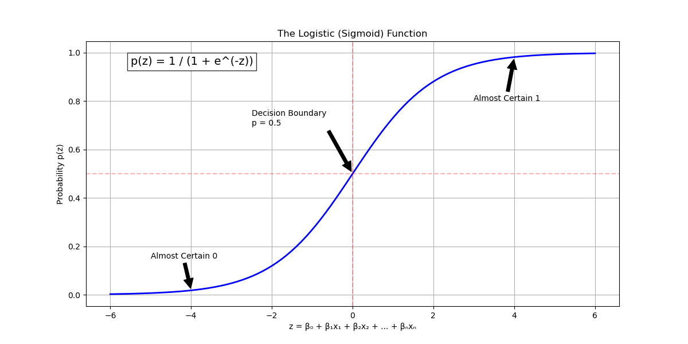
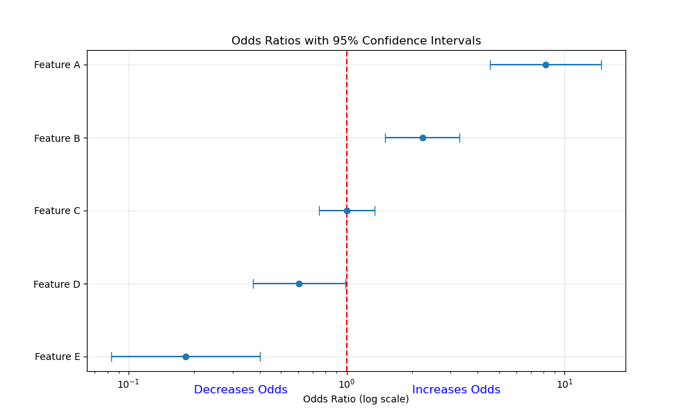
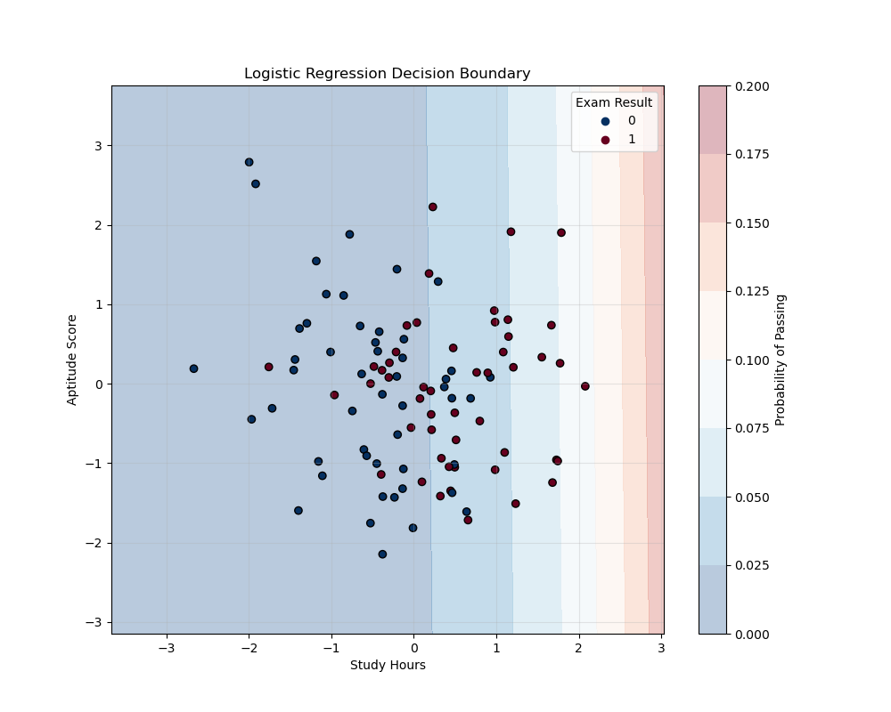
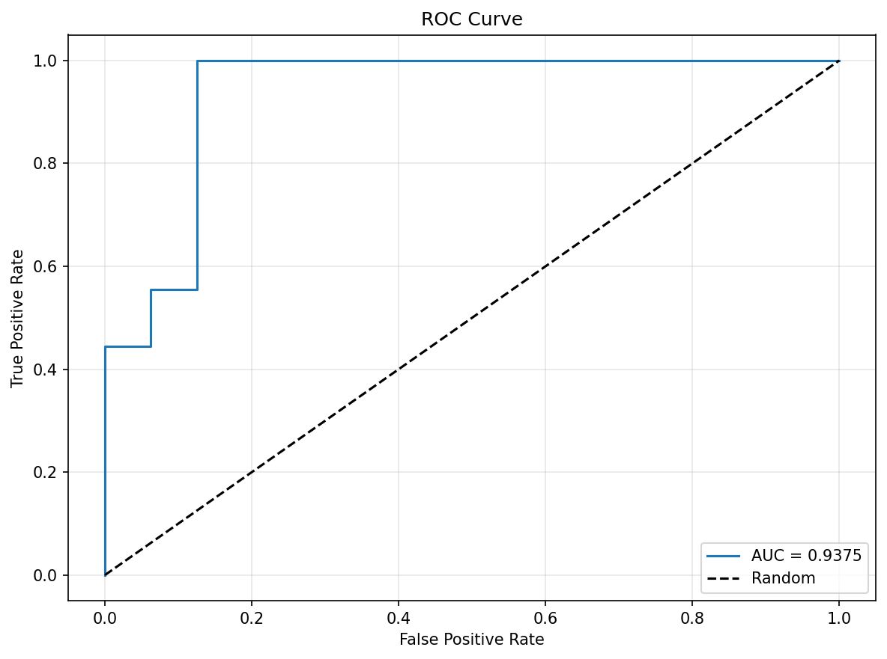
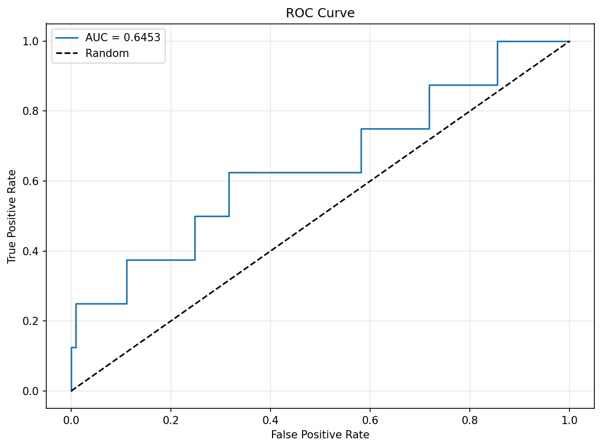

# Logistic Regression Fundamentals

**After this lesson:** you can fit, interpret, and evaluate a logistic regression model for binary (and multi-class) classification.

## Overview

When the outcome is a **label** (often two classes), ordinary least squares is the wrong tool: predictions can fall outside \\([0,1]\\), and error assumptions do not match counts or Bernoulli trials. Logistic regression uses a **sigmoid** link so a linear score maps to a probability; from there you get the same coefficient intuition as linear models, plus classification metrics (confusion matrix, ROC). Later lessons add curvature ([polynomial regression](./polynomial-regression.md)) and complexity control.

## Why this matters

- You will model **probabilities** for binary outcomes (yes/no) with an interpretable linear structure in feature space.
- You will read **odds ratios** and confusion-based metrics that appear in research and industry.

## Prerequisites

- [Regression basics and diagnostics (module 4.3)](../4.3-rship-in-data/README.md), especially [simple linear regression](../4.3-rship-in-data/simple-linear-regression.md).

> **Note:** The name says “regression,” but the target is usually a class label, not a continuous number.

## Introduction

Logistic regression is one of the most fundamental and widely used classification algorithms in statistics and machine learning. Despite its name containing "regression," it's primarily used for classification tasks - specifically, for predicting categorical outcomes like yes/no, true/false, or 0/1.

### Video Tutorial: Introduction to Logistic Regression

<div class="video-embed">
<iframe width="560" height="315" src="https://www.youtube.com/embed/yIYKR4sgzI8" frameborder="0" allow="accelerometer; autoplay; clipboard-write; encrypted-media; gyroscope; picture-in-picture" allowfullscreen></iframe>
</div>

*StatQuest: Logistic Regression by Josh Starmer*



### What is Logistic Regression?

Logistic regression is a statistical method that:

- Estimates the probability that an instance belongs to a particular class
- Uses the logistic function to transform a linear combination of features into a probability (0 to 1)
- Sets a threshold (typically 0.5) to convert probabilities into class predictions
- Works best for binary classification problems but can be extended to multi-class scenarios

### Real-world Examples

Before diving into the technical details, let's look at some everyday examples where logistic regression is used:

1. **Email Spam Detection**
   - **Input**: Email content, sender information, subject line characteristics
   - **Output**: Spam (1) or Not Spam (0)
   - **Benefits**: Easy to interpret which features contribute most to "spamminess"

2. **Medical Diagnosis**
   - **Input**: Patient symptoms, test results, demographic information
   - **Output**: Disease Present (1) or Not Present (0)
   - **Benefits**: Provides probability estimates that help doctors assess risk levels

3. **Credit Risk Assessment**
   - **Input**: Customer financial history, income, debt ratio, payment history
   - **Output**: High Risk (1) or Low Risk (0)
   - **Benefits**: Transparent model that regulatory agencies can audit

4. **Customer Purchase Prediction**
   - **Input**: Customer browsing history, demographic info, past purchases
   - **Output**: Will Purchase (1) or Won't Purchase (0)
   - **Benefits**: Provides probability scores that can be used for targeted marketing

### Visualizing the Classification Problem

Let's visualize a simple binary classification problem that logistic regression can solve:

**Synthetic pass/fail exam data and scatter plot**

**Purpose:** Draw study hours and aptitude from normals, pass labels from a logistic probability, and scatter-plot passes vs fails with `exam_data.head()` printed.

**Walkthrough:** Manual sigmoid for `passing_probability`; `np.random.binomial`; matplotlib scatter with markers/colors by class; `savefig` for the lesson figure.

<div class="code-explainer" data-code-explainer>
<div class="code-explainer__code">


import numpy as np
import matplotlib.pyplot as plt
import pandas as pd
from sklearn.linear_model import LogisticRegression
from sklearn.model_selection import train_test_split
from sklearn.metrics import accuracy_score, confusion_matrix, classification_report
from sklearn.preprocessing import StandardScaler
import seaborn as sns

# Set a random seed for reproducibility
np.random.seed(42)

# Generate synthetic data for student exam results
study_hours = np.random.normal(5, 2, 100)
aptitude_scores = np.random.normal(65, 15, 100)

# Create a relationship where both study time and aptitude affect passing probability
# with some randomness
# Higher study hours and higher aptitude scores increase passing probability
passing_probability = 1 / (1 + np.exp(-(0.75 * (study_hours - 5) + 0.02 * (aptitude_scores - 65))))
passed = np.random.binomial(1, passing_probability)

# Create a DataFrame for easier data handling
exam_data = pd.DataFrame({
    'StudyHours': study_hours,
    'AptitudeScore': aptitude_scores,
    'Passed': passed
})

# Plot the data
plt.figure(figsize=(10, 6))
plt.scatter(exam_data.StudyHours[exam_data.Passed == 1], 
            exam_data.AptitudeScore[exam_data.Passed == 1], 
            c='green', marker='+', s=100, label='Passed')
plt.scatter(exam_data.StudyHours[exam_data.Passed == 0], 
            exam_data.AptitudeScore[exam_data.Passed == 0], 
            c='red', marker='x', s=100, label='Failed')
plt.xlabel('Study Hours')
plt.ylabel('Aptitude Score')
plt.title('Exam Results Based on Study Hours and Aptitude')
plt.legend()
plt.grid(True, alpha=0.3)
plt.savefig('binary_classification_example.png')
plt.show()

print(exam_data.head())

</div>
<aside class="code-explainer__callouts" aria-label="Code walkthrough">
  <div class="code-callout" data-lines="1-11" data-tint="1">
    <div class="code-callout__meta">
      <span class="code-callout__lines"></span>
      <span class="code-callout__title">Import numpy as np</span>
    </div>
    <div class="code-callout__body">
      <p>Lines 1–11: follow this band in the snippet.</p>
    </div>
  </div>
  <div class="code-callout" data-lines="12-23" data-tint="2">
    <div class="code-callout__meta">
      <span class="code-callout__lines"></span>
      <span class="code-callout__title">Generate synthetic data for student exam results</span>
    </div>
    <div class="code-callout__body">
      <p>Lines 12–23: follow this band in the snippet.</p>
    </div>
  </div>
  <div class="code-callout" data-lines="24-34" data-tint="3">
    <div class="code-callout__meta">
      <span class="code-callout__lines"></span>
      <span class="code-callout__title">Exam_data = pd.DataFrame({</span>
    </div>
    <div class="code-callout__body">
      <p>Lines 24–34: follow this band in the snippet.</p>
    </div>
  </div>
  <div class="code-callout" data-lines="35-46" data-tint="4">
    <div class="code-callout__meta">
      <span class="code-callout__lines"></span>
      <span class="code-callout__title">Plt.scatter(exam_data.StudyHours[exam_data.Pa…</span>
    </div>
    <div class="code-callout__body">
      <p>Lines 35–46: follow this band in the snippet.</p>
    </div>
  </div>
</aside>
</div>

```
   StudyHours  AptitudeScore  Passed
0    5.993428      43.769439       0
1    4.723471      58.690320       1
2    6.295377      59.859282       1
3    8.046060      52.965841       1
4    4.531693      62.580714       0
```

This code generates and visualizes a dataset representing student exam results based on study hours and aptitude scores:


In this plot:

- **Green plus signs (+)** represent students who passed the exam
- **Red x marks** represent students who failed the exam
- The challenge is to build a model that can predict whether a new student will pass based on their study hours and aptitude score

## Understanding the Basics

### Video Tutorial: Logistic Regression Details

<div class="video-embed">
<iframe width="560" height="315" src="https://www.youtube.com/embed/vN5cNN2-HWE" frameborder="0" allow="accelerometer; autoplay; clipboard-write; encrypted-media; gyroscope; picture-in-picture" allowfullscreen></iframe>
</div>

*StatQuest: Logistic Regression Details Pt 1: Coefficients by Josh Starmer*

### From Linear to Logistic Regression

To understand how logistic regression works, let's start with what we know about linear regression:

**Linear Regression:** \\(y = \beta_0 + \beta_1 x_1 + \beta_2 x_2 + \dots + \beta_n x_n\\).

The problem with using linear regression for classification is that it can produce values outside the range \\([0, 1]\\), making them difficult to interpret as probabilities. This is where the logistic function comes in.

### The Logistic Function

Logistic regression uses a special S-shaped curve called the logistic function (or sigmoid function):

$$p = \frac{1}{1 + e^{-z}}$$

Where:

- \\(p\\) is the probability of the positive class (between 0 and 1).
- \\(z\\) is the linear combination of features: \\(z = \beta_0 + \beta_1 x_1 + \beta_2 x_2 + \dots + \beta_n x_n\\).
- \\(e\\) is the base of natural logarithm (approximately 2.718).

Let's visualize this function:

**Annotated plot of the standard logistic (sigmoid) curve**

**Purpose:** Plot \\(p(z)=1/(1+e^{-z})\\) over a grid with reference lines at \\(z=0\\) and \\(p=0.5\\) and text annotations for interpretation.

**Walkthrough:** Pure NumPy and matplotlib; `plt.annotate`, `axhline`, `axvline`; `savefig` as `logistic_curve_annotated.png`.

<div class="code-explainer" data-code-explainer>
<div class="code-explainer__code">


def plot_logistic_curve():
    """Visualize the logistic function with annotations"""
    x = np.linspace(-6, 6, 100)
    y = 1 / (1 + np.exp(-x))
    
    plt.figure(figsize=(12, 6))
    plt.plot(x, y, 'b-', linewidth=2)
    
    # Add annotations
    plt.annotate('Almost Certain 0', xy=(-4, 0.02), xytext=(-5, 0.15),
                arrowprops=dict(facecolor='black', shrink=0.05))
    plt.annotate('Decision Boundary\np = 0.5', xy=(0, 0.5), xytext=(-2.5, 0.7),
                arrowprops=dict(facecolor='black', shrink=0.05))
    plt.annotate('Almost Certain 1', xy=(4, 0.98), xytext=(3, 0.8),
                arrowprops=dict(facecolor='black', shrink=0.05))
    
    # Add a horizontal line at p = 0.5
    plt.axhline(y=0.5, color='r', linestyle='--', alpha=0.3)
    # Add a vertical line at z = 0
    plt.axvline(x=0, color='r', linestyle='--', alpha=0.3)
    
    plt.title('The Logistic (Sigmoid) Function')
    plt.xlabel('z = β₀ + β₁x₁ + β₂x₂ + ... + βₙxₙ')
    plt.ylabel('Probability p(z)')
    plt.grid(True)
    plt.text(-5.5, 0.95, 'p(z) = 1 / (1 + e^(-z))', fontsize=14, bbox=dict(facecolor='white', alpha=0.8))
    plt.savefig('logistic_curve_annotated.png')
    plt.show()

# Plot the logistic curve
plot_logistic_curve()

</div>
<aside class="code-explainer__callouts" aria-label="Code walkthrough">
  <div class="code-callout" data-lines="1-10" data-tint="1">
    <div class="code-callout__meta">
      <span class="code-callout__lines"></span>
      <span class="code-callout__title">Def plot_logistic_curve():</span>
    </div>
    <div class="code-callout__body">
      <p>Lines 1–10: follow this band in the snippet.</p>
    </div>
  </div>
  <div class="code-callout" data-lines="11-20" data-tint="2">
    <div class="code-callout__meta">
      <span class="code-callout__lines"></span>
      <span class="code-callout__title">Arrowprops=dict(facecolor=&#x27;black&#x27;, shrink=0.05))</span>
    </div>
    <div class="code-callout__body">
      <p>Lines 11–20: follow this band in the snippet.</p>
    </div>
  </div>
  <div class="code-callout" data-lines="21-31" data-tint="3">
    <div class="code-callout__meta">
      <span class="code-callout__lines"></span>
      <span class="code-callout__title">Plt.title(&#x27;The Logistic (Sigmoid) Function&#x27;)</span>
    </div>
    <div class="code-callout__body">
      <p>Lines 21–31: follow this band in the snippet.</p>
    </div>
  </div>
</aside>
</div>



Key characteristics of the logistic function:

1. **Range**: Always between 0 and 1 (perfect for representing probabilities)
2. **S-shape**: Gradually transitions from 0 to 1
3. **Symmetry**: Centered at z = 0, where p = 0.5
4. **Asymptotes**: Approaches but never reaches exactly 0 or 1

### Mathematical Foundation

The logistic regression model uses the following equation to calculate probabilities:

$$P(Y=1|X) = \frac{1}{1 + e^{-(\beta_0 + \beta_1X_1 + ... + \beta_pX_p)}}$$

Where:

- \\(P(Y=1 \mid X)\\) is the probability of the positive class given the input features.
- \\(\beta_0\\) is the intercept (bias).
- \\(\beta_1, \dots, \beta_p\\) are the coefficients for each feature.
- \\(X_1, \dots, X_p\\) are the input features.

To make the model more useful, we can transform this equation to get the "log odds" or "logit" function:

$$\log\left(\frac{P(Y=1|X)}{1-P(Y=1|X)}\right) = \beta_0 + \beta_1X_1 + ... + \beta_pX_p$$

This is the "logistic" part of logistic regression - we're modeling the log of the odds rather than the probability directly.

### Understanding the Coefficients

Interpreting coefficients in logistic regression is slightly different than in linear regression:

1. **Sign of Coefficient**:
   - **Positive**: As the feature increases, the probability of the positive class increases
   - **Negative**: As the feature increases, the probability of the positive class decreases

2. **Magnitude**: Larger absolute values indicate stronger influence

3. **Interpretation**: For a one-unit increase in feature Xᵢ, the log odds of the positive class change by βᵢ

Let's visualize how different coefficients affect the probability curve:

**Overlay logistic curves for different linear predictors \\(z=\beta x\\)**

**Purpose:** On the same axes, plot sigmoid curves for several \\(\beta\\) values to show steep vs gradual separation and sign effects.

**Walkthrough:** Loop over scenario dict mapping label → `z` array; `1/(1+np.exp(-z))`; shared horizontal line at 0.5.

<div class="code-explainer" data-code-explainer>
<div class="code-explainer__code">


def plot_coefficient_effects():
    """Visualize how coefficients affect the probability curve"""
    x = np.linspace(-6, 6, 100)
    
    # Different coefficient scenarios
    scenarios = {
        'Strong Positive (β=2)': 2*x,
        'Weak Positive (β=0.5)': 0.5*x,
        'Strong Negative (β=-2)': -2*x,
        'Weak Negative (β=-0.5)': -0.5*x
    }
    
    plt.figure(figsize=(12, 8))
    for label, z in scenarios.items():
        y = 1 / (1 + np.exp(-z))
        plt.plot(x, y, linewidth=2, label=label)
    
    plt.title('Effect of Different Coefficients on Probability Curve')
    plt.xlabel('Feature Value')
    plt.ylabel('Probability of Positive Class')
    plt.legend()
    plt.grid(True)
    plt.axhline(y=0.5, color='black', linestyle='--', alpha=0.3)
    plt.savefig('coefficient_effects.png')
    plt.show()

# Plot how coefficients affect the probability curve
plot_coefficient_effects()

</div>
<aside class="code-explainer__callouts" aria-label="Code walkthrough">
  <div class="code-callout" data-lines="1-14" data-tint="1">
    <div class="code-callout__meta">
      <span class="code-callout__lines"></span>
      <span class="code-callout__title">Def plot_coefficient_effects():</span>
    </div>
    <div class="code-callout__body">
      <p>Lines 1–14: follow this band in the snippet.</p>
    </div>
  </div>
  <div class="code-callout" data-lines="15-28" data-tint="2">
    <div class="code-callout__meta">
      <span class="code-callout__lines"></span>
      <span class="code-callout__title">Y = 1 / (1 + np.exp(-z))</span>
    </div>
    <div class="code-callout__body">
      <p>Lines 15–28: follow this band in the snippet.</p>
    </div>
  </div>
</aside>
</div>


From this visualization, you can see that:

1. **Strong coefficients** (β=2 or β=-2) create a steep curve, meaning the probability changes quickly over a small range of X
2. **Weak coefficients** (β=0.5 or β=-0.5) create a gradual curve, meaning the probability changes slowly over a wider range of X
3. **Positive coefficients** shift the "crossover point" (where p=0.5) to the left
4. **Negative coefficients** shift the "crossover point" to the right

### Odds Ratio

Another important concept in logistic regression is the odds ratio. When we exponentiate a coefficient (e^β), we get the odds ratio, which tells us how the odds of the positive class change with a one-unit increase in the feature:

- If odds ratio > 1: Feature increases odds of positive class
- If odds ratio < 1: Feature decreases odds of positive class
- If odds ratio = 1: Feature has no effect on odds

Here's a way to visualize odds ratios:

**Forest-style odds ratios with illustrative 95% error bars**

**Purpose:** From toy coefficients and SEs, compute `exp(coef)` and asymptotic CI bounds, sort, and plot on a log x-axis with a reference line at OR = 1.

**Walkthrough:** `np.exp` for point and CI limits; `plt.errorbar` with asymmetric x errors; `plt.xscale('log')`.

<div class="code-explainer" data-code-explainer>
<div class="code-explainer__code">


def plot_odds_ratios():
    """Visualize odds ratios from coefficients"""
    # Sample coefficients
    coefficients = np.array([2.1, 0.8, 0.0, -0.5, -1.7])
    odds_ratios = np.exp(coefficients)
    feature_names = ['Feature A', 'Feature B', 'Feature C', 'Feature D', 'Feature E']
    
    # Calculate confidence intervals (just for illustration)
    std_errors = np.array([0.3, 0.2, 0.15, 0.25, 0.4])
    ci_lower = np.exp(coefficients - 1.96 * std_errors)
    ci_upper = np.exp(coefficients + 1.96 * std_errors)
    
    # Create DataFrame
    df = pd.DataFrame({
        'Feature': feature_names,
        'Odds_Ratio': odds_ratios,
        'CI_Lower': ci_lower,
        'CI_Upper': ci_upper
    })
    df = df.sort_values('Odds_Ratio')
    
    # Plot
    plt.figure(figsize=(10, 6))
    plt.errorbar(df.Odds_Ratio, range(len(df)), 
                 xerr=[df.Odds_Ratio - df.CI_Lower, df.CI_Upper - df.Odds_Ratio],
                 fmt='o', capsize=5)
    
    plt.axvline(x=1, color='r', linestyle='--', label='No Effect Line')
    plt.yticks(range(len(df)), df.Feature)
    plt.xscale('log')  # Log scale makes interpretation easier
    plt.xlabel('Odds Ratio (log scale)')
    plt.title('Odds Ratios with 95% Confidence Intervals')
    plt.grid(True, alpha=0.3)
    
    # Add annotations
    plt.text(0.2, -0.5, 'Decreases Odds', color='blue', fontsize=12)
    plt.text(2, -0.5, 'Increases Odds', color='blue', fontsize=12)
    plt.savefig('odds_ratios.png')
    plt.show()

# Plot odds ratios
plot_odds_ratios()

</div>
<aside class="code-explainer__callouts" aria-label="Code walkthrough">
  <div class="code-callout" data-lines="1-14" data-tint="1">
    <div class="code-callout__meta">
      <span class="code-callout__lines"></span>
      <span class="code-callout__title">Def plot_odds_ratios():</span>
    </div>
    <div class="code-callout__body">
      <p>Lines 1–14: follow this band in the snippet.</p>
    </div>
  </div>
  <div class="code-callout" data-lines="15-28" data-tint="2">
    <div class="code-callout__meta">
      <span class="code-callout__lines"></span>
      <span class="code-callout__title">&#x27;Feature&#x27;: feature_names,</span>
    </div>
    <div class="code-callout__body">
      <p>Lines 15–28: follow this band in the snippet.</p>
    </div>
  </div>
  <div class="code-callout" data-lines="29-42" data-tint="3">
    <div class="code-callout__meta">
      <span class="code-callout__lines"></span>
      <span class="code-callout__title">Plt.yticks(range(len(df)), df.Feature)</span>
    </div>
    <div class="code-callout__body">
      <p>Lines 29–42: follow this band in the snippet.</p>
    </div>
  </div>
</aside>
</div>



This visualization shows:

1. Features with odds ratios > 1 (to the right of the red line) increase the odds of the positive class
2. Features with odds ratios < 1 (to the left of the red line) decrease the odds of the positive class
3. The further from 1, the stronger the effect

## Building Your First Logistic Regression Model

### Video Tutorial: Implementing Logistic Regression

<div class="video-embed">
<iframe width="560" height="315" src="https://www.youtube.com/embed/YYEJ_GUguHw" frameborder="0" allow="accelerometer; autoplay; clipboard-write; encrypted-media; gyroscope; picture-in-picture" allowfullscreen></iframe>
</div>

*Logistic Regression from Scratch in Python by AssemblyAI*

Now, let's build a logistic regression model on our student exam data:

### Step 1: Prepare Your Data

Before building a model, you need to:

1. Clean your data
2. Handle missing values
3. Scale numerical features
4. Split into training and test sets

**Train/test split and `StandardScaler` on exam features**

**Purpose:** Isolate predictors and target, `train_test_split` with fixed seed, and z-score features for `LogisticRegression` (fit scaler on train only).

**Walkthrough:** `train_test_split`; `StandardScaler.fit_transform` / `transform`; print shapes to confirm dimensions.

<div class="code-explainer" data-code-explainer>
<div class="code-explainer__code">


# Let's use our exam data from earlier
X = exam_data[['StudyHours', 'AptitudeScore']]
y = exam_data['Passed']

# Split the data
X_train, X_test, y_train, y_test = train_test_split(X, y, test_size=0.25, random_state=42)

# Scale the features
scaler = StandardScaler()
X_train_scaled = scaler.fit_transform(X_train)
X_test_scaled = scaler.transform(X_test)

print("Data preparation complete.")
print(f"Training set shape: {X_train.shape}")
print(f"Test set shape: {X_test.shape}")

</div>
<aside class="code-explainer__callouts" aria-label="Code walkthrough">
  <div class="code-callout" data-lines="1-7" data-tint="1">
    <div class="code-callout__meta">
      <span class="code-callout__lines"></span>
      <span class="code-callout__title">Let&#x27;s use our exam data from earlier</span>
    </div>
    <div class="code-callout__body">
      <p>Lines 1–7: follow this band in the snippet.</p>
    </div>
  </div>
  <div class="code-callout" data-lines="8-15" data-tint="2">
    <div class="code-callout__meta">
      <span class="code-callout__lines"></span>
      <span class="code-callout__title">Scale the features</span>
    </div>
    <div class="code-callout__body">
      <p>Lines 8–15: follow this band in the snippet.</p>
    </div>
  </div>
</aside>
</div>

```
Data preparation complete.
Training set shape: (75, 2)
Test set shape: (25, 2)
```

### Step 2: Train the Model

**Fit logistic regression and tabulate coefficients and odds ratios**

**Purpose:** Train on scaled data, build a DataFrame of feature names with `coef_[0]` and `exp(coef)`, and print intercept for interpretation.

**Walkthrough:** `LogisticRegression.fit`; odds ratio as `np.exp(model.coef_[0])`; comments sketch the 0.5 probability contour in 2D.

<div class="code-explainer" data-code-explainer>
<div class="code-explainer__code">


# Create and train the model
model = LogisticRegression(random_state=42)
model.fit(X_train_scaled, y_train)

# Extract coefficients
coefficients = pd.DataFrame({
    'Feature': X.columns,
    'Coefficient': model.coef_[0],
    'Odds Ratio': np.exp(model.coef_[0])
})

print("Model trained successfully!")
print("\nCoefficients:")
print(coefficients)
print(f"\nIntercept: {model.intercept_[0]:.4f}")

# Calculate probability threshold at the decision boundary
# z = β₀ + β₁x₁ + β₂x₂ = 0
# Solving for x₂ (AptitudeScore): x₂ = -(β₀ + β₁x₁) / β₂

</div>
<aside class="code-explainer__callouts" aria-label="Code walkthrough">
  <div class="code-callout" data-lines="1-9" data-tint="1">
    <div class="code-callout__meta">
      <span class="code-callout__lines"></span>
      <span class="code-callout__title">Create and train the model</span>
    </div>
    <div class="code-callout__body">
      <p>Lines 1–9: follow this band in the snippet.</p>
    </div>
  </div>
  <div class="code-callout" data-lines="10-19" data-tint="2">
    <div class="code-callout__meta">
      <span class="code-callout__lines"></span>
      <span class="code-callout__title">})</span>
    </div>
    <div class="code-callout__body">
      <p>Lines 10–19: follow this band in the snippet.</p>
    </div>
  </div>
</aside>
</div>

```
Model trained successfully!

Coefficients:
         Feature  Coefficient  Odds Ratio
0     StudyHours     1.381725    3.981764
1  AptitudeScore     0.109766    1.116016

Intercept: 0.2269
```

### Step 3: Visualize the Decision Boundary

**Probability surface and 0.5 contour in feature space**

**Purpose:** Build a fine mesh in original feature space, transform with the fitted scaler, map `predict_proba`[:,1] to colors, and overlay the p=0.5 contour with training points.

**Walkthrough:** `np.meshgrid`; `scaler.transform` on flattened grid; `contourf` + `contour` at 0.5; `scatter` colored by class.

<div class="code-explainer" data-code-explainer>
<div class="code-explainer__code">


def plot_decision_boundary(X, y, model, scaler):
    """Plot the decision boundary of a logistic regression model"""
    # Create a mesh grid of points to evaluate the model on
    h = 0.05  # step size in the mesh
    x_min, x_max = X[:, 0].min() - 1, X[:, 0].max() + 1
    y_min, y_max = X[:, 1].min() - 1, X[:, 1].max() + 1
    xx, yy = np.meshgrid(np.arange(x_min, x_max, h),
                         np.arange(y_min, y_max, h))
    
    # Scale the mesh points
    mesh_points_scaled = scaler.transform(np.c_[xx.ravel(), yy.ravel()])
    
    # Get predictions for each point in the mesh
    Z = model.predict_proba(mesh_points_scaled)[:, 1]
    Z = Z.reshape(xx.shape)
    
    # Plot the contour
    plt.figure(figsize=(10, 8))
    
    # Plot decision regions
    contour = plt.contourf(xx, yy, Z, alpha=0.3, cmap=plt.cm.RdBu_r)
    plt.colorbar(contour, label='Probability of Passing')
    
    # Plot decision boundary (where probability = 0.5)
    plt.contour(xx, yy, Z, levels=[0.5], linestyles='dashed', colors='k')
    
    # Plot data points
    scatter = plt.scatter(X[:, 0], X[:, 1], c=y, edgecolor='k', cmap=plt.cm.RdBu_r)
    plt.legend(*scatter.legend_elements(), title="Exam Result")
    
    plt.xlabel('Study Hours')
    plt.ylabel('Aptitude Score')
    plt.title('Logistic Regression Decision Boundary')
    plt.grid(True, alpha=0.3)
    plt.savefig('logistic_decision_boundary.png')
    plt.show()

# Plot the decision boundary
X_scaled = scaler.transform(X)
plot_decision_boundary(X_scaled, y, model, scaler)

</div>
<aside class="code-explainer__callouts" aria-label="Code walkthrough">
  <div class="code-callout" data-lines="1-13" data-tint="1">
    <div class="code-callout__meta">
      <span class="code-callout__lines"></span>
      <span class="code-callout__title">Def plot_decision_boundary(X, y, model, scaler):</span>
    </div>
    <div class="code-callout__body">
      <p>Lines 1–13: follow this band in the snippet.</p>
    </div>
  </div>
  <div class="code-callout" data-lines="14-26" data-tint="2">
    <div class="code-callout__meta">
      <span class="code-callout__lines"></span>
      <span class="code-callout__title">Z = model.predict_proba(mesh_points_scaled)[:…</span>
    </div>
    <div class="code-callout__body">
      <p>Lines 14–26: follow this band in the snippet.</p>
    </div>
  </div>
  <div class="code-callout" data-lines="27-40" data-tint="3">
    <div class="code-callout__meta">
      <span class="code-callout__lines"></span>
      <span class="code-callout__title">Plot data points</span>
    </div>
    <div class="code-callout__body">
      <p>Lines 27–40: follow this band in the snippet.</p>
    </div>
  </div>
</aside>
</div>



In this plot:

- The **color gradient** represents the probability of passing (blue = low, red = high)
- The **dashed line** is the decision boundary where the probability equals 0.5
- **Blue points** are students who failed the exam
- **Red points** are students who passed the exam

### Step 4: Evaluate the Model

**Accuracy, confusion matrix heatmap, report, and ROC/AUC**

**Purpose:** Class predictions and probabilities on the test set; `accuracy_score`, `confusion_matrix`, `classification_report`; seaborn heatmap; ROC curve with `roc_auc_score`.

**Walkthrough:** `predict` / `predict_proba`; `roc_curve`; diagonal baseline; `savefig` for CM and ROC figures.

<div class="code-explainer" data-code-explainer>
<div class="code-explainer__code">


def evaluate_model(model, X_test, y_test, class_names=('Negative', 'Positive')):
    """Evaluate a binary classifier and plot the confusion matrix and ROC curve.

    `class_names` should match the meaning of the 0 and 1 labels for this dataset.
    """
    # Make predictions
    y_pred = model.predict(X_test)
    y_pred_prob = model.predict_proba(X_test)[:, 1]

    # Calculate accuracy
    accuracy = accuracy_score(y_test, y_pred)

    # Create confusion matrix
    cm = confusion_matrix(y_test, y_pred)

    # Print results
    print(f"Model Accuracy: {accuracy:.4f}")
    print("\nConfusion Matrix:")
    print(cm)

    # Plot confusion matrix
    plt.figure(figsize=(8, 6))
    sns.heatmap(cm, annot=True, fmt='d', cmap='Blues',
                xticklabels=class_names,
                yticklabels=class_names)
    plt.xlabel('Predicted')
    plt.ylabel('Actual')
    plt.title('Confusion Matrix')
    plt.savefig('confusion_matrix.png')
    plt.show()

    # Print classification report
    print("\nClassification Report:")
    print(classification_report(y_test, y_pred, target_names=class_names))

    # Plot ROC curve
    from sklearn.metrics import roc_curve, roc_auc_score
    fpr, tpr, thresholds = roc_curve(y_test, y_pred_prob)
    auc = roc_auc_score(y_test, y_pred_prob)

    plt.figure(figsize=(8, 6))
    plt.plot(fpr, tpr, label=f'AUC = {auc:.4f}')
    plt.plot([0, 1], [0, 1], 'k--', label='Random')
    plt.xlabel('False Positive Rate')
    plt.ylabel('True Positive Rate')
    plt.title('ROC Curve')
    plt.legend()
    plt.grid(True, alpha=0.3)
    plt.savefig('roc_curve.png')
    plt.show()

# Evaluate the exam model
evaluate_model(model, X_test_scaled, y_test, class_names=('Failed', 'Passed'))

</div>
<aside class="code-explainer__callouts" aria-label="Code walkthrough">
  <div class="code-callout" data-lines="1-13" data-tint="1">
    <div class="code-callout__meta">
      <span class="code-callout__lines"></span>
      <span class="code-callout__title">Def evaluate_model(model, X_test, y_test, cla…</span>
    </div>
    <div class="code-callout__body">
      <p>Lines 1–13: follow this band in the snippet.</p>
    </div>
  </div>
  <div class="code-callout" data-lines="14-26" data-tint="2">
    <div class="code-callout__meta">
      <span class="code-callout__lines"></span>
      <span class="code-callout__title">Cm = confusion_matrix(y_test, y_pred)</span>
    </div>
    <div class="code-callout__body">
      <p>Lines 14–26: follow this band in the snippet.</p>
    </div>
  </div>
  <div class="code-callout" data-lines="27-39" data-tint="3">
    <div class="code-callout__meta">
      <span class="code-callout__lines"></span>
      <span class="code-callout__title">Plt.ylabel(&#x27;Actual&#x27;)</span>
    </div>
    <div class="code-callout__body">
      <p>Lines 27–39: follow this band in the snippet.</p>
    </div>
  </div>
  <div class="code-callout" data-lines="40-53" data-tint="4">
    <div class="code-callout__meta">
      <span class="code-callout__lines"></span>
      <span class="code-callout__title">Plt.figure(figsize=(8, 6))</span>
    </div>
    <div class="code-callout__body">
      <p>Lines 40–53: follow this band in the snippet.</p>
    </div>
  </div>
</aside>
</div>



```
Model Accuracy: 0.7600

Confusion Matrix:

Classification Report:
              precision    recall  f1-score   support

      Failed       1.00      0.62      0.77        16
      Passed       0.60      1.00      0.75         9

    accuracy                           0.76        25
   macro avg       0.80      0.81      0.76        25
weighted avg       0.86      0.76      0.76        25
```

The auto-injected figure above is the confusion matrix produced by the code (saved locally as `confusion_matrix.png` and to `assets/` by the build pipeline). The recall values tell the story: 10 of 16 failures and 9 of 9 passes were classified correctly. Six failures slipped through as false positives — typical when the cut-off probability sits at 0.5 and one class is over-represented. Adjusting the threshold (or applying class weights, [later in this lesson](#1-handling-imbalanced-datasets)) trades these false alarms for some missed passes.

## Practical Applications and Extensions

### 1. Handling Multiple Features

Logistic regression can handle multiple features. Let's create an example with more variables:

**Loan approval simulation: multi-feature model and `evaluate_model`**

**Purpose:** Construct a synthetic loan dataset with correlated credit score, fit `LogisticRegression` on scaled train data, print sorted odds ratios, and reuse the evaluation helper on the test set.

**Walkthrough:** Manual logit → `sigmoid` → Bernoulli outcomes; `train_test_split` + `StandardScaler`; `loan_model.coef_[0]` and `np.exp`; calls `evaluate_model`.

<div class="code-explainer" data-code-explainer>
<div class="code-explainer__code">


# Generate a more complex dataset
np.random.seed(42)
n_samples = 500

# Generate features
age = np.random.normal(35, 10, n_samples)
income = np.random.normal(50000, 15000, n_samples)
education_years = np.random.normal(16, 3, n_samples)
debt_to_income = np.random.beta(2, 5, n_samples) * 0.5

# Create some correlations
credit_score = 600 + 0.01 * income - 20 * debt_to_income + 5 * education_years + np.random.normal(0, 50, n_samples)
credit_score = np.clip(credit_score, 300, 850)

# Create logit for probability of loan approval
z = (-5 +                           # Intercept
     0.05 * (age - 35) +            # Age effect
     0.00003 * (income - 50000) +   # Income effect
     0.2 * (education_years - 16) + # Education effect
     -5 * debt_to_income +          # Debt to income effect
     0.01 * (credit_score - 650))   # Credit score effect

# Generate probabilities and outcomes
approval_prob = 1 / (1 + np.exp(-z))
approved = np.random.binomial(1, approval_prob)

# Create DataFrame
loan_data = pd.DataFrame({
    'Age': age,
    'Income': income,
    'EducationYears': education_years,
    'DebtToIncome': debt_to_income,
    'CreditScore': credit_score,
    'Approved': approved
})

print("Loan approval dataset created.")
print(loan_data.describe())

# Build a model with multiple features
X_loan = loan_data.drop('Approved', axis=1)
y_loan = loan_data['Approved']

# Split and scale
X_train, X_test, y_train, y_test = train_test_split(X_loan, y_loan, test_size=0.25, random_state=42)
scaler = StandardScaler()
X_train_scaled = scaler.fit_transform(X_train)
X_test_scaled = scaler.transform(X_test)

# Train model
loan_model = LogisticRegression(random_state=42)
loan_model.fit(X_train_scaled, y_train)

# Show coefficients and odds ratios
loan_coefficients = pd.DataFrame({
    'Feature': X_loan.columns,
    'Coefficient': loan_model.coef_[0],
    'Odds_Ratio': np.exp(loan_model.coef_[0])
})
loan_coefficients = loan_coefficients.sort_values('Odds_Ratio', ascending=False)

print("\nLoan Approval Model Coefficients:")
print(loan_coefficients)

# Evaluate the loan model with appropriate class labels
evaluate_model(loan_model, X_test_scaled, y_test, class_names=('Denied', 'Approved'))

</div>
<aside class="code-explainer__callouts" aria-label="Code walkthrough">
  <div class="code-callout" data-lines="1-13" data-tint="1">
    <div class="code-callout__meta">
      <span class="code-callout__lines"></span>
      <span class="code-callout__title">Generate a more complex dataset</span>
    </div>
    <div class="code-callout__body">
      <p>Lines 1–13: follow this band in the snippet.</p>
    </div>
  </div>
  <div class="code-callout" data-lines="14-26" data-tint="2">
    <div class="code-callout__meta">
      <span class="code-callout__lines"></span>
      <span class="code-callout__title">Create logit for probability of loan approval</span>
    </div>
    <div class="code-callout__body">
      <p>Lines 14–26: follow this band in the snippet.</p>
    </div>
  </div>
  <div class="code-callout" data-lines="27-39" data-tint="3">
    <div class="code-callout__meta">
      <span class="code-callout__lines"></span>
      <span class="code-callout__title">Create DataFrame</span>
    </div>
    <div class="code-callout__body">
      <p>Lines 27–39: follow this band in the snippet.</p>
    </div>
  </div>
  <div class="code-callout" data-lines="40-52" data-tint="4">
    <div class="code-callout__meta">
      <span class="code-callout__lines"></span>
      <span class="code-callout__title">Build a model with multiple features</span>
    </div>
    <div class="code-callout__body">
      <p>Lines 40–52: follow this band in the snippet.</p>
    </div>
  </div>
  <div class="code-callout" data-lines="53-66" data-tint="1">
    <div class="code-callout__meta">
      <span class="code-callout__lines"></span>
      <span class="code-callout__title">Show coefficients and odds ratios</span>
    </div>
    <div class="code-callout__body">
      <p>Lines 53–66: follow this band in the snippet.</p>
    </div>
  </div>
</aside>
</div>



```
Loan approval dataset created.
              Age        Income  ...  CreditScore    Approved
count  500.000000    500.000000  ...   500.000000  500.000000
mean    35.068380  50477.391756  ...   849.351735    0.046000
std      9.812532  14669.957928  ...     6.854254    0.209695
min      2.587327   9546.700356  ...   738.183677    0.000000
25%     27.996926  41070.623902  ...   850.000000    0.000000
50%     35.127971  50427.973993  ...   850.000000    0.000000
75%     41.367833  59768.634463  ...   850.000000    0.000000
max     73.527315  89485.730973  ...   850.000000    1.000000

[8 rows x 6 columns]

Loan Approval Model Coefficients:
          Feature  Coefficient  Odds_Ratio
0             Age     0.630864    1.879233
1          Income     0.583599    1.792477
2  EducationYears     0.460648    1.585101
4     CreditScore     0.042793    1.043722
3    DebtToIncome    -0.244546    0.783060
Model Accuracy: 0.9440

Confusion Matrix:

Classification Report:
              precision    recall  f1-score   support

      Denied       0.94      1.00      0.97       117
    Approved       1.00      0.12      0.22         8

    accuracy                           0.94       125
   macro avg       0.97      0.56      0.60       125
weighted avg       0.95      0.94      0.92       125
```

The 0.94 accuracy looks impressive but the recall on the **Approved** class is only 0.12 — the model defaults to predicting "Denied" because that class dominates the training data (only 4.6 % approved). This is a textbook **class-imbalance** failure; the next subsection on `class_weight='balanced'` is the standard fix.

### 2. Feature Importance and Interpretation

**Bar chart of signed coefficients as importance for the loan model**

**Purpose:** Rank features by absolute logistic coefficient, color bars green/red for direction, and show odds ratios in the underlying table logic (plot uses coefficients).

**Walkthrough:** `model.coef_[0]`; `Patch` legend for positive/negative effect; horizontal bar chart.

<div class="code-explainer" data-code-explainer>
<div class="code-explainer__code">


def plot_feature_importance(model, feature_names):
    """Plot the feature importance from logistic regression coefficients"""
    # Get absolute coefficient values
    coefs = model.coef_[0]
    abs_coefs = np.abs(coefs)
    
    # Create DataFrame
    importance_df = pd.DataFrame({
        'Feature': feature_names,
        'Absolute_Coefficient': abs_coefs,
        'Coefficient': coefs,
        'Odds_Ratio': np.exp(coefs)
    })
    importance_df = importance_df.sort_values('Absolute_Coefficient', ascending=False)
    
    # Plot
    plt.figure(figsize=(10, 6))
    colors = ['green' if c > 0 else 'red' for c in importance_df['Coefficient']]
    plt.barh(importance_df['Feature'], importance_df['Absolute_Coefficient'], color=colors)
    plt.xlabel('Absolute Coefficient Value')
    plt.title('Feature Importance in Logistic Regression')
    plt.grid(True, alpha=0.3)
    
    # Add a legend for the colors
    from matplotlib.patches import Patch
    legend_elements = [
        Patch(facecolor='green', label='Positive Effect (Increases Probability)'),
        Patch(facecolor='red', label='Negative Effect (Decreases Probability)')
    ]
    plt.legend(handles=legend_elements)
    
    plt.tight_layout()
    plt.savefig('feature_importance.png')
    plt.show()

# Plot feature importance
plot_feature_importance(loan_model, X_loan.columns)

</div>
<aside class="code-explainer__callouts" aria-label="Code walkthrough">
  <div class="code-callout" data-lines="1-12" data-tint="1">
    <div class="code-callout__meta">
      <span class="code-callout__lines"></span>
      <span class="code-callout__title">Def plot_feature_importance(model, feature_na…</span>
    </div>
    <div class="code-callout__body">
      <p>Lines 1–12: follow this band in the snippet.</p>
    </div>
  </div>
  <div class="code-callout" data-lines="13-24" data-tint="2">
    <div class="code-callout__meta">
      <span class="code-callout__lines"></span>
      <span class="code-callout__title">})</span>
    </div>
    <div class="code-callout__body">
      <p>Lines 13–24: follow this band in the snippet.</p>
    </div>
  </div>
  <div class="code-callout" data-lines="25-37" data-tint="3">
    <div class="code-callout__meta">
      <span class="code-callout__lines"></span>
      <span class="code-callout__title">From matplotlib.patches import Patch</span>
    </div>
    <div class="code-callout__body">
      <p>Lines 25–37: follow this band in the snippet.</p>
    </div>
  </div>
</aside>
</div>


### 3. Handling Class Imbalance

In many real-world applications, the classes are imbalanced (e.g., rare medical conditions, fraud detection). Here's how to handle this:

**Imbalanced labels: `class_weight` vs default with ROC and PR curves**

**Purpose:** Force a 10% positive rate, fit plain and `class_weight='balanced'` logistic models, and compare ROC and precision–recall curves plus classification reports.

**Walkthrough:** `stratify` in `train_test_split`; `roc_curve`, `roc_auc_score`, `precision_recall_curve`, `average_precision_score`; subplot layout.

<div class="code-explainer" data-code-explainer>
<div class="code-explainer__code">


# Create an imbalanced dataset (10% positive class)
np.random.seed(42)
n_samples = 1000
n_positive = int(n_samples * 0.1)  # 10% positive class

# Generate features
feature1 = np.random.normal(0, 1, n_samples)
feature2 = np.random.normal(0, 1, n_samples)

# Create imbalanced classes
z = 1 + 2 * feature1 - 1 * feature2
prob = 1 / (1 + np.exp(-z))
class_label = np.zeros(n_samples)

# Assign most likely probabilities to ensure imbalance
sorted_indices = np.argsort(prob)
class_label[sorted_indices[-n_positive:]] = 1

# Create DataFrame
imbalanced_data = pd.DataFrame({
    'Feature1': feature1,
    'Feature2': feature2,
    'Class': class_label
})

print(f"Class distribution: {imbalanced_data['Class'].value_counts()}")

# Plot class distribution
plt.figure(figsize=(8, 6))
sns.countplot(x='Class', data=imbalanced_data)
plt.title('Class Distribution in Imbalanced Dataset')
plt.xlabel('Class')
plt.ylabel('Count')
plt.grid(True, alpha=0.3)
plt.savefig('class_imbalance.png')
plt.show()

# Split data
X_imb = imbalanced_data[['Feature1', 'Feature2']]
y_imb = imbalanced_data['Class']
X_train, X_test, y_train, y_test = train_test_split(X_imb, y_imb, test_size=0.25, random_state=42, 
                                                    stratify=y_imb)  # Stratify to maintain class distribution

# Create models
# Regular model
regular_model = LogisticRegression(random_state=42)
regular_model.fit(X_train, y_train)

# Model with class weight adjustment
balanced_model = LogisticRegression(class_weight='balanced', random_state=42)
balanced_model.fit(X_train, y_train)

# Compare models
def compare_models_on_imbalanced_data(models, X_test, y_test):
    """Compare different models on imbalanced data"""
    from sklearn.metrics import precision_recall_curve, average_precision_score
    
    plt.figure(figsize=(12, 5))
    
    # Plot ROC curves
    plt.subplot(121)
    for name, model in models.items():
        y_pred_prob = model.predict_proba(X_test)[:, 1]
        fpr, tpr, _ = roc_curve(y_test, y_pred_prob)
        auc = roc_auc_score(y_test, y_pred_prob)
        plt.plot(fpr, tpr, label=f'{name} (AUC = {auc:.3f})')
    
    plt.plot([0, 1], [0, 1], 'k--', label='Random')
    plt.xlabel('False Positive Rate')
    plt.ylabel('True Positive Rate')
    plt.title('ROC Curve')
    plt.legend()
    plt.grid(True, alpha=0.3)
    
    # Plot precision-recall curves
    plt.subplot(122)
    for name, model in models.items():
        y_pred_prob = model.predict_proba(X_test)[:, 1]
        precision, recall, _ = precision_recall_curve(y_test, y_pred_prob)
        ap = average_precision_score(y_test, y_pred_prob)
        plt.plot(recall, precision, label=f'{name} (AP = {ap:.3f})')
    
    plt.xlabel('Recall')
    plt.ylabel('Precision')
    plt.title('Precision-Recall Curve')
    plt.legend()
    plt.grid(True, alpha=0.3)
    
    plt.tight_layout()
    plt.savefig('imbalanced_comparison.png')
    plt.show()
    
    # Print classification reports
    for name, model in models.items():
        print(f"\nClassification Report for {name}:")
        y_pred = model.predict(X_test)
        print(classification_report(y_test, y_pred))

# Compare models
models = {
    'Regular Logistic Regression': regular_model,
    'Balanced Logistic Regression': balanced_model
}
compare_models_on_imbalanced_data(models, X_test, y_test)

</div>
<aside class="code-explainer__callouts" aria-label="Code walkthrough">
  <div class="code-callout" data-lines="1-17" data-tint="1">
    <div class="code-callout__meta">
      <span class="code-callout__lines"></span>
      <span class="code-callout__title">Create an imbalanced dataset (10% positive cl…</span>
    </div>
    <div class="code-callout__body">
      <p>Lines 1–17: follow this band in the snippet.</p>
    </div>
  </div>
  <div class="code-callout" data-lines="18-34" data-tint="2">
    <div class="code-callout__meta">
      <span class="code-callout__lines"></span>
      <span class="code-callout__title">Create DataFrame</span>
    </div>
    <div class="code-callout__body">
      <p>Lines 18–34: follow this band in the snippet.</p>
    </div>
  </div>
  <div class="code-callout" data-lines="35-52" data-tint="3">
    <div class="code-callout__meta">
      <span class="code-callout__lines"></span>
      <span class="code-callout__title">Plt.savefig(&#x27;class_imbalance.png&#x27;)</span>
    </div>
    <div class="code-callout__body">
      <p>Lines 35–52: follow this band in the snippet.</p>
    </div>
  </div>
  <div class="code-callout" data-lines="53-69" data-tint="4">
    <div class="code-callout__meta">
      <span class="code-callout__lines"></span>
      <span class="code-callout__title">Compare models</span>
    </div>
    <div class="code-callout__body">
      <p>Lines 53–69: follow this band in the snippet.</p>
    </div>
  </div>
  <div class="code-callout" data-lines="70-86" data-tint="1">
    <div class="code-callout__meta">
      <span class="code-callout__lines"></span>
      <span class="code-callout__title">Plt.ylabel(&#x27;True Positive Rate&#x27;)</span>
    </div>
    <div class="code-callout__body">
      <p>Lines 70–86: follow this band in the snippet.</p>
    </div>
  </div>
  <div class="code-callout" data-lines="87-104" data-tint="2">
    <div class="code-callout__meta">
      <span class="code-callout__lines"></span>
      <span class="code-callout__title">Plt.grid(True, alpha=0.3)</span>
    </div>
    <div class="code-callout__body">
      <p>Lines 87–104: follow this band in the snippet.</p>
    </div>
  </div>
</aside>
</div>

This comparison shows that:

1. The **balanced model** (which gives more weight to the minority class) typically has better recall
2. For imbalanced datasets, the **precision-recall curve** is often more informative than the ROC curve
3. Using appropriate metrics like F1-score or average precision is crucial

## Common Pitfalls and Solutions

### 1. Class Imbalance

**Problem**: One class has many more examples than the other, leading to biased models.

**Solutions**:

- Use `class_weight='balanced'` parameter in LogisticRegression
- Oversample the minority class (using techniques like SMOTE)
- Undersample the majority class
- Use different evaluation metrics (F1-score, precision-recall AUC)

**Instantiate `LogisticRegression` with balanced or custom `class_weight`**

**Purpose:** Show two ways to pass class weights: `'balanced'` or an explicit `{class: weight}` dict for skewed costs.

**Walkthrough:** `LogisticRegression(class_weight=...)` constructors only (no fit in snippet).

<div class="code-explainer" data-code-explainer>
<div class="code-explainer__code">


from sklearn.linear_model import LogisticRegression

# Option 1: let sklearn pick weights inversely proportional to class frequencies
balanced_model = LogisticRegression(class_weight='balanced')

# Option 2: pass an explicit {class: weight} dict for asymmetric costs
class_weights = {0: 1, 1: 10}  # 10x importance on class 1
custom_weighted_model = LogisticRegression(class_weight=class_weights)

</div>
<aside class="code-explainer__callouts" aria-label="Code walkthrough">
  <div class="code-callout" data-lines="1-8" data-tint="1">
    <div class="code-callout__meta">
      <span class="code-callout__lines"></span>
      <span class="code-callout__title">From sklearn.linear_model import LogisticRegr…</span>
    </div>
    <div class="code-callout__body">
      <p>Lines 1–8: follow this band in the snippet.</p>
    </div>
  </div>
</aside>
</div>


### 2. Multicollinearity

**Problem**: Features are highly correlated, making coefficient interpretation difficult.

**Solutions**:

- Remove redundant features
- Use regularization (L1 or L2)
- Apply dimensionality reduction techniques (like PCA)

**L1 vs L2 penalties via `penalty` and `solver` choice**

**Purpose:** Illustrate `LogisticRegression` with `penalty='l1'` and `liblinear` vs `penalty='l2'` at the same `C` for multicollinear settings.

**Walkthrough:** `C` as inverse regularization strength; comment ties smaller `C` to stronger shrinkage.

<div class="code-explainer" data-code-explainer>
<div class="code-explainer__code">


# Example of using regularization to handle multicollinearity
from sklearn.linear_model import LogisticRegression

# L1 regularization (Lasso)
l1_model = LogisticRegression(penalty='l1', solver='liblinear', C=0.1)

# L2 regularization (Ridge)
l2_model = LogisticRegression(penalty='l2', C=0.1)

# Note: C is inverse of regularization strength (smaller C = stronger regularization)

</div>
<aside class="code-explainer__callouts" aria-label="Code walkthrough">
  <div class="code-callout" data-lines="1-10" data-tint="1">
    <div class="code-callout__meta">
      <span class="code-callout__lines"></span>
      <span class="code-callout__title">Example of using regularization to handle mul…</span>
    </div>
    <div class="code-callout__body">
      <p>Lines 1–10: follow this band in the snippet.</p>
    </div>
  </div>
</aside>
</div>

### 3. Non-linearity

**Problem**: Logistic regression assumes a linear relationship in log-odds space.

**Solutions**:

- Add polynomial features
- Use feature transformations
- Consider non-linear models (random forests, neural networks)

**Pipeline: quadratic feature expansion then logistic regression**

**Purpose:** Chain `PolynomialFeatures(degree=2)` with `LogisticRegression` to capture curvature in log-odds, fit on train split.

**Walkthrough:** `make_pipeline`; `fit` on `X_train`, `y_train` from earlier exam workflow.

<div class="code-explainer" data-code-explainer>
<div class="code-explainer__code">


# Example of adding polynomial features
from sklearn.preprocessing import PolynomialFeatures
from sklearn.pipeline import make_pipeline

# Create pipeline with polynomial features and logistic regression
poly_model = make_pipeline(
    PolynomialFeatures(degree=2, include_bias=False),
    LogisticRegression()
)
poly_model.fit(X_train, y_train)

</div>
<aside class="code-explainer__callouts" aria-label="Code walkthrough">
  <div class="code-callout" data-lines="1-10" data-tint="1">
    <div class="code-callout__meta">
      <span class="code-callout__lines"></span>
      <span class="code-callout__title">Example of adding polynomial features</span>
    </div>
    <div class="code-callout__body">
      <p>Lines 1–10: follow this band in the snippet.</p>
    </div>
  </div>
</aside>
</div>

```
Pipeline(steps=[('polynomialfeatures', PolynomialFeatures(include_bias=False)),
                ('logisticregression', LogisticRegression())])
```

## Extending to Multi-class Classification

Logistic regression can be extended to handle multiple classes using two approaches:

### 1. One-vs-Rest (OvR)

Trains one binary classifier per class and selects the class with the highest probability. In sklearn, wrap a binary `LogisticRegression` in `OneVsRestClassifier`.

**Iris data: one-vs-rest logistic regression**

**Purpose:** Load Iris, split, fit `OneVsRestClassifier(LogisticRegression())`, report test accuracy and `predict_proba` shape.

**Walkthrough:** `load_iris`; `train_test_split`; `score`; `predict_proba` for class probabilities.

<div class="code-explainer" data-code-explainer>
<div class="code-explainer__code">


from sklearn.linear_model import LogisticRegression
from sklearn.multiclass import OneVsRestClassifier
from sklearn.datasets import load_iris
from sklearn.model_selection import train_test_split

# Load multi-class dataset
iris = load_iris()
X, y = iris.data, iris.target
X_train, X_test, y_train, y_test = train_test_split(X, y, test_size=0.3, random_state=42)

# One-vs-Rest with explicit wrapper
ovr_model = OneVsRestClassifier(LogisticRegression(max_iter=1000, random_state=42))
ovr_model.fit(X_train, y_train)

# Evaluate
accuracy = ovr_model.score(X_test, y_test)
print(f"Accuracy on multi-class problem: {accuracy:.4f}")

# Get probabilities for each class
class_probabilities = ovr_model.predict_proba(X_test)
print("Shape of probability matrix:", class_probabilities.shape)

</div>
<aside class="code-explainer__callouts" aria-label="Code walkthrough">
  <div class="code-callout" data-lines="1-10" data-tint="1">
    <div class="code-callout__meta">
      <span class="code-callout__lines"></span>
      <span class="code-callout__title">From sklearn.linear_model import LogisticRegr…</span>
    </div>
    <div class="code-callout__body">
      <p>Lines 1–10: follow this band in the snippet.</p>
    </div>
  </div>
  <div class="code-callout" data-lines="11-21" data-tint="2">
    <div class="code-callout__meta">
      <span class="code-callout__lines"></span>
      <span class="code-callout__title">One-vs-Rest with explicit wrapper</span>
    </div>
    <div class="code-callout__body">
      <p>Lines 11–21: follow this band in the snippet.</p>
    </div>
  </div>
</aside>
</div>

### 2. Multinomial Logistic Regression (Softmax Regression)

Generalizes logistic regression to multiple classes using the softmax function. In sklearn ≥ 1.5 the default behaviour for `LogisticRegression` on a multi-class target is multinomial; the explicit `multi_class` argument was deprecated in 1.5 and removed in 1.7.

**Multinomial logistic on the same Iris split**

**Purpose:** Fit softmax regression on the same train/test as OvR and compare held-out accuracy.

**Walkthrough:** Default `LogisticRegression` with `solver='lbfgs'`; `score` on `X_test`, `y_test`.

<div class="code-explainer" data-code-explainer>
<div class="code-explainer__code">


# Multinomial is the default for multi-class targets in modern sklearn
softmax_model = LogisticRegression(solver='lbfgs', max_iter=1000, random_state=42)
softmax_model.fit(X_train, y_train)

# Compare performance
softmax_accuracy = softmax_model.score(X_test, y_test)
print(f"Multinomial (Softmax) accuracy: {softmax_accuracy:.4f}")

</div>
<aside class="code-explainer__callouts" aria-label="Code walkthrough">
  <div class="code-callout" data-lines="1-7" data-tint="1">
    <div class="code-callout__meta">
      <span class="code-callout__lines"></span>
      <span class="code-callout__title">Multinomial is the default for multi-class ta…</span>
    </div>
    <div class="code-callout__body">
      <p>Lines 1–7: follow this band in the snippet.</p>
    </div>
  </div>
</aside>
</div>

## Interactive Example: Predict Customer Purchase

Let's create an interactive example where we predict if a customer will make a purchase based on their behavior:

**Toy `coef_` / `intercept_` and manual scaling for purchase probability**

**Purpose:** Demonstrate `predict_proba` from a hand-set logistic model after z-scoring features with fixed population means/stds.

**Walkthrough:** Assign `coef_` and `intercept_`; manual `(X - mean) / std`; threshold narrative at 0.5.

<div class="code-explainer" data-code-explainer>
<div class="code-explainer__code">


# Create a function to predict purchase probability
def predict_purchase_probability(age, time_on_site, pages_visited, is_returning_customer):
    """Predict the probability of purchase based on customer characteristics"""
    # Create a synthetic model (in real applications, you would load a trained model)
    model = LogisticRegression()
    model.coef_ = np.array([[0.03, 0.05, 0.1, 0.8]])
    model.intercept_ = np.array([-4])
    
    # Create input features
    X = np.array([[age, time_on_site, pages_visited, int(is_returning_customer)]])
    
    # Scale features (using typical means and stds)
    means = np.array([35, 3, 5, 0.5])
    stds = np.array([15, 2, 3, 0.5])
    X_scaled = (X - means) / stds
    
    # Predict probability
    purchase_prob = model.predict_proba(X_scaled)[0, 1]
    
    return purchase_prob

# Example usage
age = 28
time_on_site = 5  # minutes
pages_visited = 8
is_returning = True

prob = predict_purchase_probability(age, time_on_site, pages_visited, is_returning)
print(f"Customer profile: {age} years old, {time_on_site} mins on site, viewed {pages_visited} pages, returning customer: {is_returning}")
print(f"Probability of purchase: {prob:.2%}")

if prob > 0.5:
    print("Action: Target with special offer!")
else:
    print("Action: No special offer needed.")

</div>
<aside class="code-explainer__callouts" aria-label="Code walkthrough">
  <div class="code-callout" data-lines="1-11" data-tint="1">
    <div class="code-callout__meta">
      <span class="code-callout__lines"></span>
      <span class="code-callout__title">Create a function to predict purchase probabi…</span>
    </div>
    <div class="code-callout__body">
      <p>Lines 1–11: follow this band in the snippet.</p>
    </div>
  </div>
  <div class="code-callout" data-lines="12-23" data-tint="2">
    <div class="code-callout__meta">
      <span class="code-callout__lines"></span>
      <span class="code-callout__title">Scale features (using typical means and stds)</span>
    </div>
    <div class="code-callout__body">
      <p>Lines 12–23: follow this band in the snippet.</p>
    </div>
  </div>
  <div class="code-callout" data-lines="24-35" data-tint="3">
    <div class="code-callout__meta">
      <span class="code-callout__lines"></span>
      <span class="code-callout__title">Time_on_site = 5  # minutes</span>
    </div>
    <div class="code-callout__body">
      <p>Lines 24–35: follow this band in the snippet.</p>
    </div>
  </div>
</aside>
</div>

## Practice Exercise

Try building a logistic regression model to predict diabetes using the Pima Indians Diabetes dataset:

**End-to-end Pima Indians pipeline: scale, fit, metrics, odds ratios**

**Purpose:** Load CSV from URL, inspect with `info`/`describe`, train `LogisticRegression` on scaled features, print confusion matrix and report, and rank features by odds ratio.

**Walkthrough:** `pd.read_csv`; `train_test_split`; `StandardScaler`; `classification_report`, `confusion_matrix`; `np.exp` on coefficients.

<div class="code-explainer" data-code-explainer>
<div class="code-explainer__code">


# Import libraries
import pandas as pd
import numpy as np
from sklearn.linear_model import LogisticRegression
from sklearn.model_selection import train_test_split
from sklearn.preprocessing import StandardScaler
from sklearn.metrics import classification_report, confusion_matrix

# Download the dataset (you could use from sklearn.datasets or a direct URL)
url = "https://raw.githubusercontent.com/jbrownlee/Datasets/master/pima-indians-diabetes.data.csv"
column_names = ['Pregnancies', 'Glucose', 'BloodPressure', 'SkinThickness', 
                'Insulin', 'BMI', 'DiabetesPedigreeFunction', 'Age', 'Outcome']
                
diabetes_data = pd.read_csv(url, names=column_names)

# Explore data
print(diabetes_data.info())
print(diabetes_data.describe())

# Split features and target
X = diabetes_data.drop('Outcome', axis=1)
y = diabetes_data['Outcome']

# Split into train and test sets
X_train, X_test, y_train, y_test = train_test_split(X, y, test_size=0.25, random_state=42)

# Scale features
scaler = StandardScaler()
X_train_scaled = scaler.fit_transform(X_train)
X_test_scaled = scaler.transform(X_test)

# Train model
model = LogisticRegression(random_state=42)
model.fit(X_train_scaled, y_train)

# Evaluate model
y_pred = model.predict(X_test_scaled)
print("\nConfusion Matrix:")
print(confusion_matrix(y_test, y_pred))
print("\nClassification Report:")
print(classification_report(y_test, y_pred))

# Analyze feature importance
coefficients = pd.DataFrame({
    'Feature': X.columns,
    'Coefficient': model.coef_[0],
    'Odds_Ratio': np.exp(model.coef_[0])
})
coefficients = coefficients.sort_values('Odds_Ratio', ascending=False)
print("\nFeature Importance:")
print(coefficients)

</div>
<aside class="code-explainer__callouts" aria-label="Code walkthrough">
  <div class="code-callout" data-lines="1-12" data-tint="1">
    <div class="code-callout__meta">
      <span class="code-callout__lines"></span>
      <span class="code-callout__title">Import libraries</span>
    </div>
    <div class="code-callout__body">
      <p>Lines 1–12: follow this band in the snippet.</p>
    </div>
  </div>
  <div class="code-callout" data-lines="13-25" data-tint="2">
    <div class="code-callout__meta">
      <span class="code-callout__lines"></span>
      <span class="code-callout__title">Diabetes_data = pd.read_csv(url, names=column…</span>
    </div>
    <div class="code-callout__body">
      <p>Lines 13–25: follow this band in the snippet.</p>
    </div>
  </div>
  <div class="code-callout" data-lines="26-38" data-tint="3">
    <div class="code-callout__meta">
      <span class="code-callout__lines"></span>
      <span class="code-callout__title">Scale features</span>
    </div>
    <div class="code-callout__body">
      <p>Lines 26–38: follow this band in the snippet.</p>
    </div>
  </div>
  <div class="code-callout" data-lines="39-51" data-tint="4">
    <div class="code-callout__meta">
      <span class="code-callout__lines"></span>
      <span class="code-callout__title">Print(confusion_matrix(y_test, y_pred))</span>
    </div>
    <div class="code-callout__body">
      <p>Lines 39–51: follow this band in the snippet.</p>
    </div>
  </div>
</aside>
</div>

```
<class 'pandas.DataFrame'>
RangeIndex: 768 entries, 0 to 767
Data columns (total 9 columns):
 #   Column                    Non-Null Count  Dtype  
---  ------                    --------------  -----  
 0   Pregnancies               768 non-null    int64  
 1   Glucose                   768 non-null    int64  
 2   BloodPressure             768 non-null    int64  
 3   SkinThickness             768 non-null    int64  
 4   Insulin                   768 non-null    int64  
 5   BMI                       768 non-null    float64
 6   DiabetesPedigreeFunction  768 non-null    float64
 7   Age                       768 non-null    int64  
 8   Outcome                   768 non-null    int64  
dtypes: float64(2), int64(7)
memory usage: 54.1 KB
None
       Pregnancies     Glucose  ...         Age     Outcome
count   768.000000  768.000000  ...  768.000000  768.000000
mean      3.845052  120.894531  ...   33.240885    0.348958
std       3.369578   31.972618  ...   11.760232    0.476951
min       0.000000    0.000000  ...   21.000000    0.000000
25%       1.000000   99.000000  ...   24.000000    0.000000
50%       3.000000  117.000000  ...   29.000000    0.000000
75%       6.000000  140.250000  ...   41.000000    1.000000
max      17.000000  199.000000  ...   81.000000    1.000000

[8 rows x 9 columns]

Confusion Matrix:
[[95 28]
 [24 45]]

Classification Report:
              precision    recall  f1-score   support

           0       0.80      0.77      0.79       123
           1       0.62      0.65      0.63        69

    accuracy                           0.73       192
   macro avg       0.71      0.71      0.71       192
weighted avg       0.73      0.73      0.73       192

Feature Importance:
                    Feature  Coefficient  Odds_Ratio
1                   Glucose     1.131155    3.099233
5                       BMI     0.760050    2.138384
7                       Age     0.429940    1.537165
0               Pregnancies     0.201701    1.223482
6  DiabetesPedigreeFunction     0.171810    1.187453
3             SkinThickness     0.066148    1.068385
4                   Insulin    -0.172464    0.841589
2             BloodPressure    -0.222390    0.800603
```

## Gotchas

- **Applying a 0.5 threshold blindly on imbalanced classes** — sklearn's default `predict` uses p ≥ 0.5 as the decision boundary. When the positive class is rare (e.g., 5% fraud), this threshold produces near-zero recall for the minority class. Evaluate the full ROC or precision-recall curve and choose a threshold that matches your business cost of false negatives vs. false positives.
- **Forgetting to scale features** — Logistic regression uses gradient-based optimisation (or its equivalent); features on very different scales (e.g., income in thousands vs. age in tens) cause slow convergence and poorly comparable coefficients. Always apply `StandardScaler` before fitting.
- **Interpreting coefficients as probabilities instead of log-odds** — A coefficient of 1.13 for Glucose means the log-odds of diabetes increases by 1.13 per unit—not that probability increases by 1.13. Convert to an odds ratio with `exp(coef)` and then back to a probability change only at a specific baseline.
- **Using accuracy as the sole metric for imbalanced datasets** — A model that predicts "no diabetes" for every patient achieves 65% accuracy on the Pima dataset while being completely useless. Report precision, recall, F1, or AUC-ROC alongside accuracy.
- **Assuming the model converges with the default `max_iter=100`** — sklearn will print a `ConvergenceWarning` silently if the solver hasn't converged, and the returned coefficients are unreliable. Increase `max_iter` or switch to `solver='lbfgs'` with looser tolerance after scaling features.
- **Treating predicted probabilities as calibrated without checking** — A model that outputs p = 0.8 does not necessarily mean 80% of those cases are positive. Use `sklearn.calibration.calibration_curve` or Platt scaling to verify and fix probability calibration before using raw probabilities for ranking or thresholding.

## Next steps

- Continue to [Polynomial regression](./polynomial-regression.md).

## Additional Resources

- [Scikit-learn Logistic Regression Documentation](https://scikit-learn.org/stable/modules/generated/sklearn.linear_model.LogisticRegression.html)
- [Introduction to Statistical Learning](https://www.statlearning.com/) (Chapter 4)
- [Logistic Regression in Python Tutorial](https://realpython.com/logistic-regression-python/)
- [Handling Class Imbalance](https://machinelearningmastery.com/tactics-to-combat-imbalanced-classes-in-your-machine-learning-dataset/)
