# Logistic Regression Fundamentals

**After this lesson:** you can fit, interpret, and evaluate a logistic regression model for binary (and multi-class) classification.

## Overview

When the outcome is a **label** (often two classes), ordinary least squares is the wrong tool: predictions can fall outside \\(\[0,1]\\), and error assumptions do not match counts or Bernoulli trials. Logistic regression uses a **sigmoid** link so a linear score maps to a probability; from there you get the same coefficient intuition as linear models, plus classification metrics (confusion matrix, ROC). Later lessons add curvature ([polynomial regression](polynomial-regression.md)) and complexity control.

## Why this matters

* You will model **probabilities** for binary outcomes (yes/no) with an interpretable linear structure in feature space.
* You will read **odds ratios** and confusion-based metrics that appear in research and industry.

## Prerequisites

* [Regression basics and diagnostics (module 4.3)](../4.3-rship-in-data/), especially [simple linear regression](../4.3-rship-in-data/simple-linear-regression.md).

> **Note:** The name says "regression," but the target is usually a class label, not a continuous number.

## Introduction

Logistic regression is one of the most fundamental and widely used classification algorithms in statistics and machine learning. Despite its name containing "regression," it's primarily used for classification tasks - specifically, for predicting categorical outcomes like yes/no, true/false, or 0/1.

### Video Tutorial: Introduction to Logistic Regression

_StatQuest: Logistic Regression by Josh Starmer_

### What is Logistic Regression?

Logistic regression is a statistical method that:

* Estimates the probability that an instance belongs to a particular class
* Uses the logistic function to transform a linear combination of features into a probability (0 to 1)
* Sets a threshold (typically 0.5) to convert probabilities into class predictions
* Works best for binary classification problems but can be extended to multi-class scenarios

### Real-world Examples

Before the technical details, look at some everyday examples where logistic regression is used:

1. **Email Spam Detection**
   * **Input**: Email content, sender information, subject line characteristics
   * **Output**: Spam (1) or Not Spam (0)
   * **Benefits**: Easy to interpret which features contribute most to "spamminess"
2. **Medical Diagnosis**
   * **Input**: Patient symptoms, test results, demographic information
   * **Output**: Disease Present (1) or Not Present (0)
   * **Benefits**: Provides probability estimates that help doctors assess risk levels
3. **Credit Risk Assessment**
   * **Input**: Customer financial history, income, debt ratio, payment history
   * **Output**: High Risk (1) or Low Risk (0)
   * **Benefits**: Transparent model that regulatory agencies can audit
4. **Customer Purchase Prediction**
   * **Input**: Customer browsing history, demographic info, past purchases
   * **Output**: Will Purchase (1) or Won't Purchase (0)
   * **Benefits**: Provides probability scores that can be used for targeted marketing

### Visualizing the Classification Problem

Visualize a simple binary classification problem that logistic regression can solve:

**Synthetic pass/fail exam data and scatter plot**

**Purpose:** Draw study hours and aptitude from normals, pass labels from a logistic probability, and scatter-plot passes vs fails with `exam_data.head()` printed.

**Walkthrough:** Manual sigmoid for `passing_probability`; `np.random.binomial`; matplotlib scatter with markers/colors by class; `savefig` for the lesson figure.

<figure>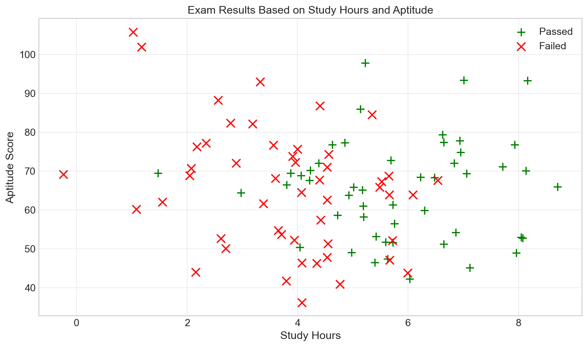<figcaption><p>Figure 1: Exam Results Based on Study Hours and Aptitude</p></figcaption></figure>

```
   StudyHours  AptitudeScore  Passed
0    5.993428      43.769439       0
1    4.723471      58.690320       1
2    6.295377      59.859282       1
3    8.046060      52.965841       1
4    4.531693      62.580714       0
```

Import numpy as np

Lines 1-11: follow this band in the snippet.

Generate synthetic data for student exam results

Lines 12-23: follow this band in the snippet.

Exam\_data = pd.DataFrame({

Lines 24-34: follow this band in the snippet.

Plt.scatter(exam\_data.StudyHours\[exam\_data.Pa…

Lines 35-46: follow this band in the snippet.

```
   StudyHours  AptitudeScore  Passed
0    5.993428      43.769439       0
1    4.723471      58.690320       1
2    6.295377      59.859282       1
3    8.046060      52.965841       1
4    4.531693      62.580714       0
```

This code generates and visualizes a dataset representing student exam results based on study hours and aptitude scores: 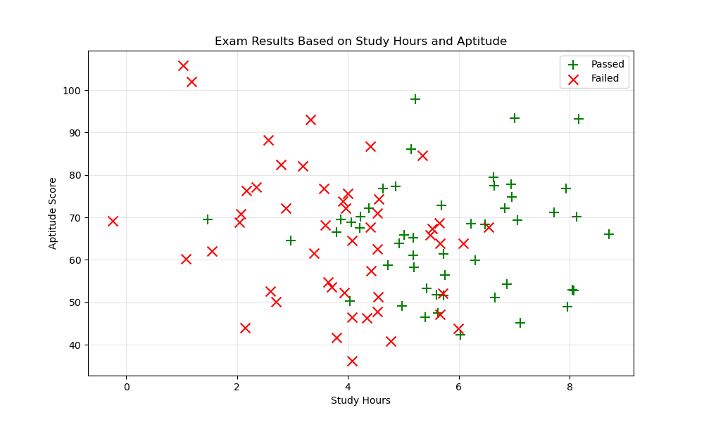

In this plot:

* **Green plus signs (+)** represent students who passed the exam
* **Red x marks** represent students who failed the exam
* The challenge is to build a model that can predict whether a new student will pass based on their study hours and aptitude score

## Understanding the Basics

### Video Tutorial: Logistic Regression Details

_StatQuest: Logistic Regression Details Pt 1: Coefficients by Josh Starmer_

### From Linear to Logistic Regression

To understand how logistic regression works, start with what we know about linear regression:

**Linear Regression:** \\(y = \beta\_0 + \beta\_1 x\_1 + \beta\_2 x\_2 + \dots + \beta\_n x\_n\\).

The problem with using linear regression for classification is that it can produce values outside the range \\(\[0, 1]\\), making them difficult to interpret as probabilities. This is where the logistic function comes in.

### The Logistic Function

Logistic regression uses a special S-shaped curve called the logistic function (or sigmoid function):

$$p = \frac{1}{1 + e^{-z}}$$

Where:

* \\(p\\) is the probability of the positive class (between 0 and 1).
* \\(z\\) is the linear combination of features: \\(z = \beta\_0 + \beta\_1 x\_1 + \beta\_2 x\_2 + \dots + \beta\_n x\_n\\).
* \\(e\\) is the base of natural logarithm (approximately 2.718).

Visualize this function:

**Annotated plot of the standard logistic (sigmoid) curve**

**Purpose:** Plot \\(p(z)=1/(1+e^{-z})\\) over a grid with reference lines at \\(z=0\\) and \\(p=0.5\\) and text annotations for interpretation.

**Walkthrough:** Pure NumPy and matplotlib; `plt.annotate`, `axhline`, `axvline`; `savefig` as `logistic_curve_annotated.png`.

<figure>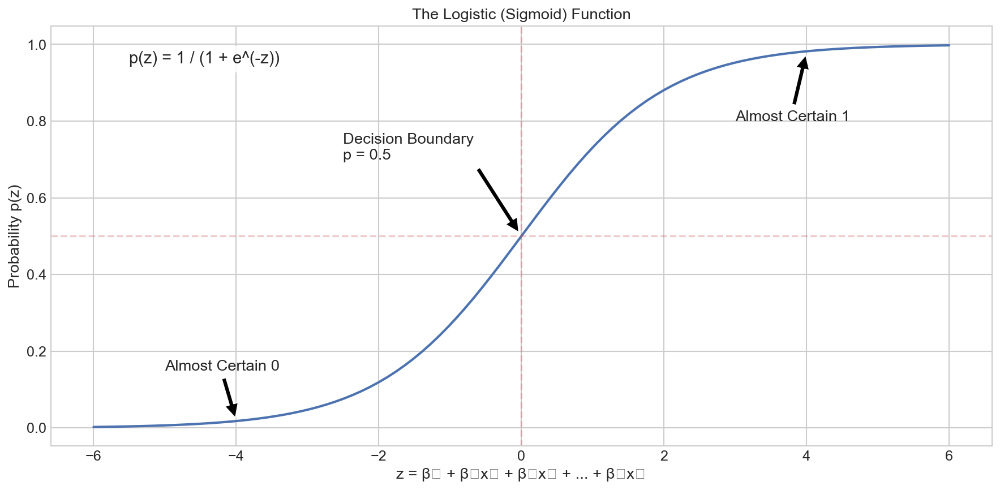<figcaption><p>Figure 2: The Logistic (Sigmoid) Function</p></figcaption></figure>

Def plot\_logistic\_curve():

Lines 1-10: follow this band in the snippet.

Arrowprops=dict(facecolor='black', shrink=0.05))

Lines 11-20: follow this band in the snippet.

Plt.title('The Logistic (Sigmoid) Function')

Lines 21-31: follow this band in the snippet.


Key characteristics of the logistic function:

1. **Range**: Always between 0 and 1 (perfect for representing probabilities)
2. **S-shape**: Gradually transitions from 0 to 1
3. **Symmetry**: Centered at z = 0, where p = 0.5
4. **Asymptotes**: Approaches but never reaches exactly 0 or 1

### Mathematical Foundation

The logistic regression model uses the following equation to calculate probabilities:

$$P(Y=1|X) = \frac{1}{1 + e^{-(\beta_0 + \beta_1X_1 + ... + \beta_pX_p)}}$$

Where:

* \\(P(Y=1 \mid X)\\) is the probability of the positive class given the input features.
* \\(\beta\_0\\) is the intercept (bias).
* \\(\beta\_1, \dots, \beta\_p\\) are the coefficients for each feature.
* \\(X\_1, \dots, X\_p\\) are the input features.

To make the model more useful, we can transform this equation to get the "log odds" or "logit" function:

$$\log\left(\frac{P(Y=1|X)}{1-P(Y=1|X)}\right) = \beta_0 + \beta_1X_1 + ... + \beta_pX_p$$

This is the "logistic" part of logistic regression - we're modeling the log of the odds rather than the probability directly.

### Understanding the Coefficients

Interpreting coefficients in logistic regression is slightly different than in linear regression:

1. **Sign of Coefficient**:
   * **Positive**: As the feature increases, the probability of the positive class increases
   * **Negative**: As the feature increases, the probability of the positive class decreases
2. **Magnitude**: Larger absolute values indicate stronger influence
3. **Interpretation**: For a one-unit increase in feature Xᵢ, the log odds of the positive class change by βᵢ

Visualize how different coefficients affect the probability curve:

**Overlay logistic curves for different linear predictors \\(z=\beta x\\)**

**Purpose:** On the same axes, plot sigmoid curves for several \\(\beta\\) values to show steep vs gradual separation and sign effects.

**Walkthrough:** Loop over scenario dict mapping label → `z` array; `1/(1+np.exp(-z))`; shared horizontal line at 0.5.

<figure>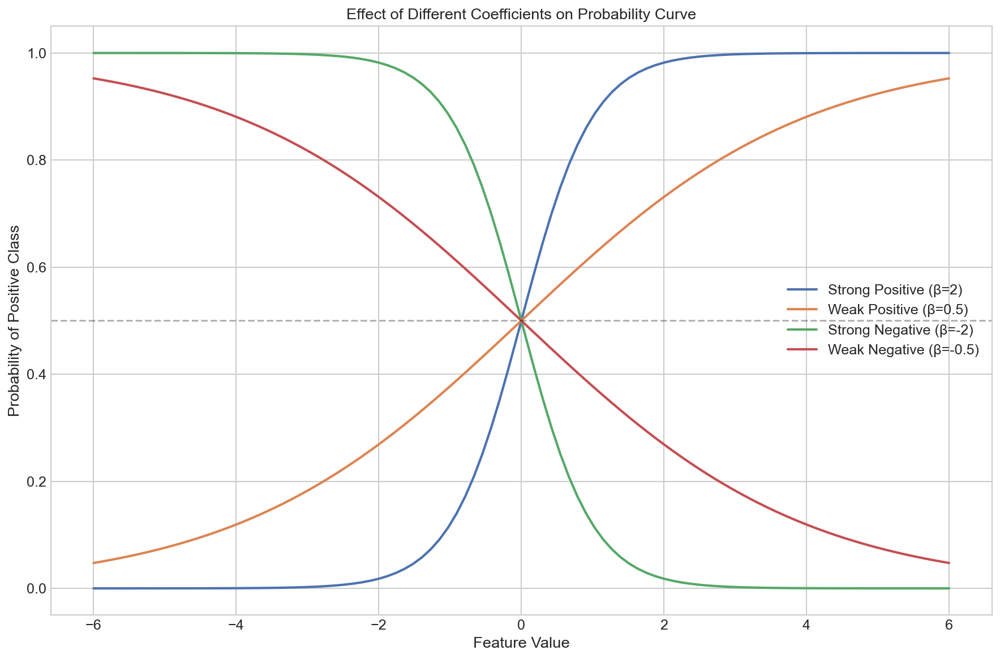<figcaption><p>Figure 3: Effect of Different Coefficients on Probability Curve</p></figcaption></figure>

Def plot\_coefficient\_effects():

Lines 1-14: follow this band in the snippet.

Y = 1 / (1 + np.exp(-z))

Lines 15-28: follow this band in the snippet.

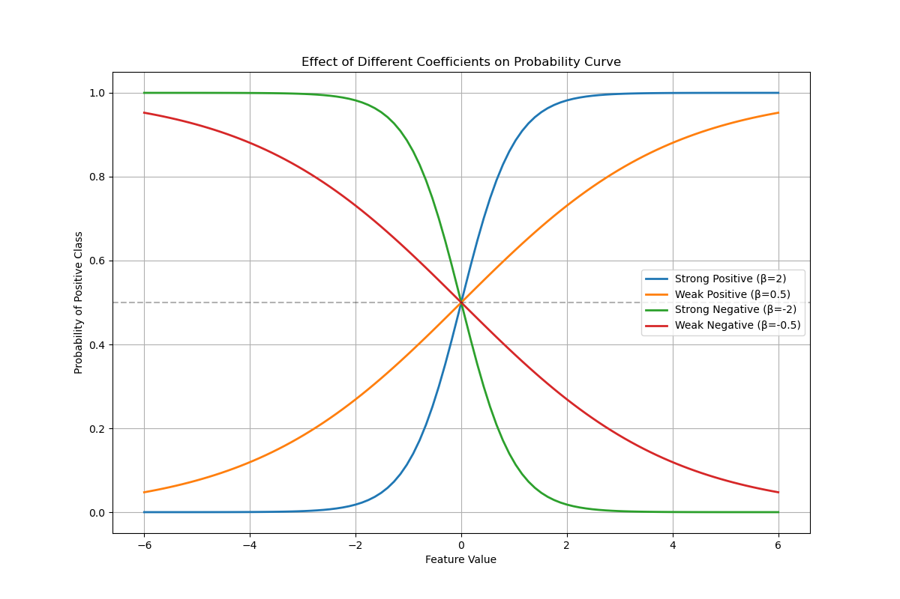

From this visualization, you can see that:

1. **Strong coefficients** (β=2 or β=-2) create a steep curve, meaning the probability changes quickly over a small range of X
2. **Weak coefficients** (β=0.5 or β=-0.5) create a gradual curve, meaning the probability changes slowly over a wider range of X
3. **Positive coefficients** shift the "crossover point" (where p=0.5) to the left
4. **Negative coefficients** shift the "crossover point" to the right

### Odds Ratio

Another important concept in logistic regression is the odds ratio. When we exponentiate a coefficient (e^β), we get the odds ratio, which tells us how the odds of the positive class change with a one-unit increase in the feature:

* If odds ratio > 1: Feature increases odds of positive class
* If odds ratio < 1: Feature decreases odds of positive class
* If odds ratio = 1: Feature has no effect on odds

Here's a way to visualize odds ratios:

**Forest-style odds ratios with illustrative 95% error bars**

**Purpose:** From toy coefficients and SEs, compute `exp(coef)` and asymptotic CI bounds, sort, and plot on a log x-axis with a reference line at OR = 1.

**Walkthrough:** `np.exp` for point and CI limits; `plt.errorbar` with asymmetric x errors; `plt.xscale('log')`.

<figure>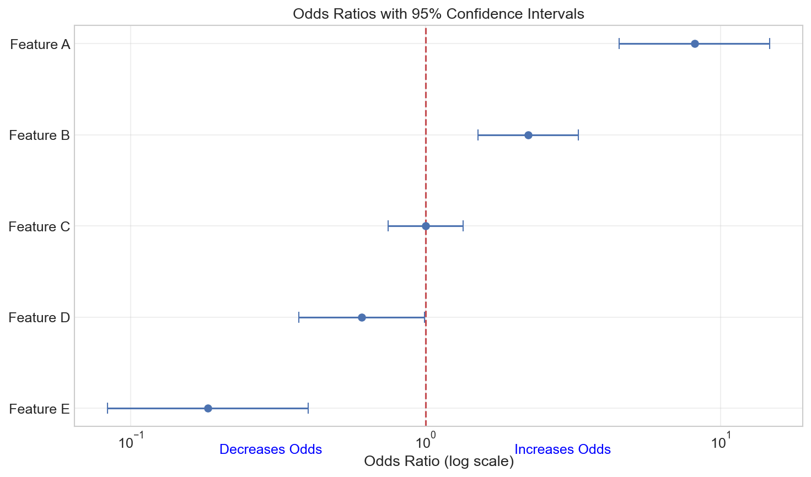<figcaption><p>Figure 4: Odds Ratios with 95% Confidence Intervals</p></figcaption></figure>

Def plot\_odds\_ratios():

Lines 1-14: follow this band in the snippet.

'Feature': feature\_names,

Lines 15-28: follow this band in the snippet.

Plt.yticks(range(len(df)), df.Feature)

Lines 29-42: follow this band in the snippet.


This visualization shows:

1. Features with odds ratios > 1 (to the right of the red line) increase the odds of the positive class
2. Features with odds ratios < 1 (to the left of the red line) decrease the odds of the positive class
3. The further from 1, the stronger the effect

## Building Your First Logistic Regression Model

### Video Tutorial: Implementing Logistic Regression

_Logistic Regression from Scratch in Python by AssemblyAI_

Now, build a logistic regression model on our student exam data:

### Step 1: Prepare Your Data

Before building a model, you need to:

1. Clean your data
2. Handle missing values
3. Scale numerical features
4. Split into training and test sets

**Train/test split and `StandardScaler` on exam features**

**Purpose:** Isolate predictors and target, `train_test_split` with fixed seed, and z-score features for `LogisticRegression` (fit scaler on train only).

**Walkthrough:** `train_test_split`; `StandardScaler.fit_transform` / `transform`; print shapes to confirm dimensions.

```
Data preparation complete.
Training set shape: (75, 2)
Test set shape: (25, 2)
```

Let's use our exam data from earlier

Lines 1-7: follow this band in the snippet.

Scale the features

Lines 8-15: follow this band in the snippet.

```
Data preparation complete.
Training set shape: (75, 2)
Test set shape: (25, 2)
```

### Step 2: Train the Model

**Fit logistic regression and tabulate coefficients and odds ratios**

**Purpose:** Train on scaled data, build a DataFrame of feature names with `coef_[0]` and `exp(coef)`, and print intercept for interpretation.

**Walkthrough:** `LogisticRegression.fit`; odds ratio as `np.exp(model.coef_[0])`; comments sketch the 0.5 probability contour in 2D.

```
Model trained successfully!

Coefficients:
         Feature  Coefficient  Odds Ratio
0     StudyHours     1.381725    3.981764
1  AptitudeScore     0.109766    1.116016

Intercept: 0.2269
```

Create and train the model

Lines 1-9: follow this band in the snippet.

})

Lines 10-19: follow this band in the snippet.

```
Model trained successfully!

Coefficients:
         Feature  Coefficient  Odds Ratio
0     StudyHours     1.381725    3.981764
1  AptitudeScore     0.109766    1.116016

Intercept: 0.2269
```

### Step 3: Visualize the Decision Boundary

**Probability surface and 0.5 contour in feature space**

**Purpose:** Build a fine mesh in original feature space, transform with the fitted scaler, map `predict_proba`\[:,1] to colors, and overlay the p=0.5 contour with training points.

**Walkthrough:** `np.meshgrid`; `scaler.transform` on flattened grid; `contourf` + `contour` at 0.5; `scatter` colored by class.

<figure>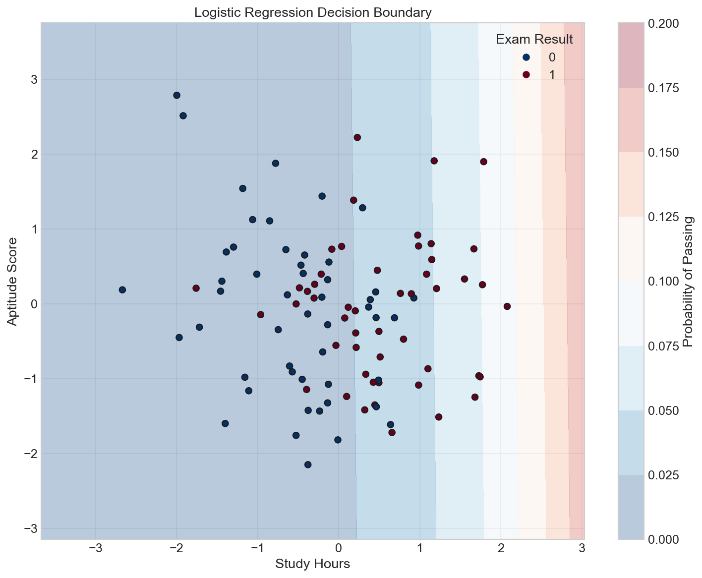<figcaption><p>Figure 5: Logistic Regression Decision Boundary</p></figcaption></figure>

Def plot\_decision\_boundary(X, y, model, scaler):

Lines 1-13: follow this band in the snippet.

Z = model.predict\_proba(mesh\_points\_scaled)\[:…

Lines 14-26: follow this band in the snippet.

Plot data points

Lines 27-40: follow this band in the snippet.


In this plot:

* The **color gradient** represents the probability of passing (blue = low, red = high)
* The **dashed line** is the decision boundary where the probability equals 0.5
* **Blue points** are students who failed the exam
* **Red points** are students who passed the exam

### Step 4: Evaluate the Model

**Accuracy, confusion matrix heatmap, report, and ROC/AUC**

**Purpose:** Class predictions and probabilities on the test set; `accuracy_score`, `confusion_matrix`, `classification_report`; seaborn heatmap; ROC curve with `roc_auc_score`.

**Walkthrough:** `predict` / `predict_proba`; `roc_curve`; diagonal baseline; `savefig` for CM and ROC figures.

<figure>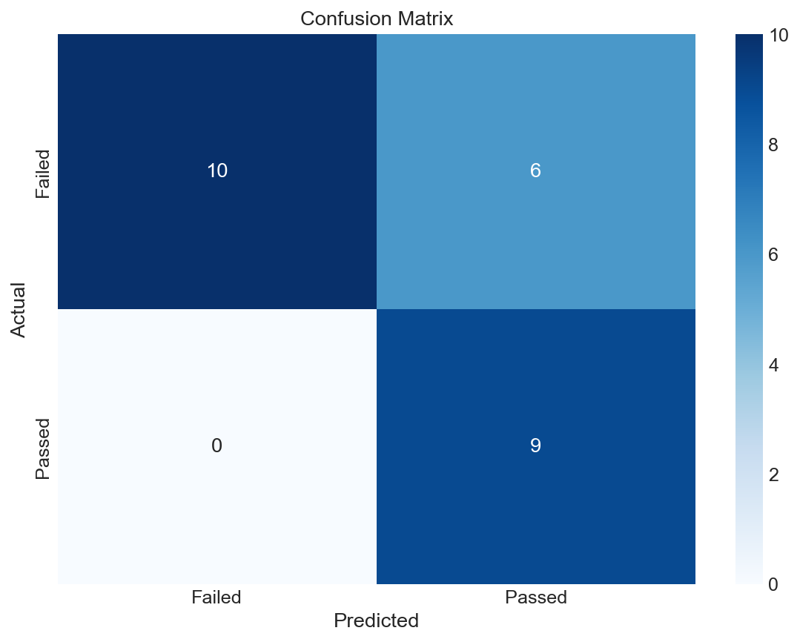<figcaption><p>Figure 6: Confusion Matrix</p></figcaption></figure>

<figure>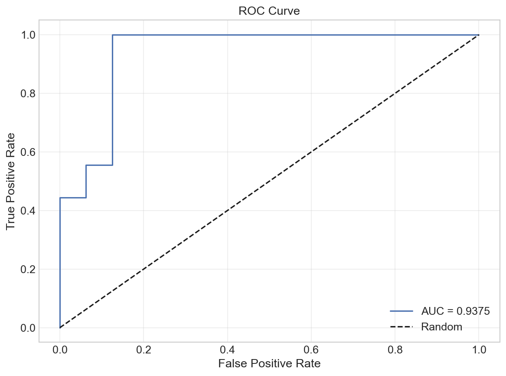<figcaption><p>Figure 7: ROC Curve</p></figcaption></figure>

```
Model Accuracy: 0.7600

Confusion Matrix:
[[10  6]
 [ 0  9]]

Classification Report:
              precision    recall  f1-score   support

      Failed       1.00      0.62      0.77        16
      Passed       0.60      1.00      0.75         9

    accuracy                           0.76        25
   macro avg       0.80      0.81      0.76        25
weighted avg       0.86      0.76      0.76        25
```

Def evaluate\_model(model, X\_test, y\_test, cla…

Lines 1-13: follow this band in the snippet.

Cm = confusion\_matrix(y\_test, y\_pred)

Lines 14-26: follow this band in the snippet.

Plt.ylabel('Actual')

Lines 27-39: follow this band in the snippet.

Plt.figure(figsize=(8, 6))

Lines 40-53: follow this band in the snippet.

<figure><figcaption><p>Figure 6: Confusion Matrix</p></figcaption></figure>

<figure><figcaption><p>Figure 7: ROC Curve</p></figcaption></figure>

```
Model Accuracy: 0.7600

Confusion Matrix:
[[10  6]
 [ 0  9]]

Classification Report:
              precision    recall  f1-score   support

      Failed       1.00      0.62      0.77        16
      Passed       0.60      1.00      0.75         9

    accuracy                           0.76        25
   macro avg       0.80      0.81      0.76        25
weighted avg       0.86      0.76      0.76        25
```

The figures above are the confusion matrix and ROC curve. The recall values tell the story: 10 of 16 failures and 9 of 9 passes were classified correctly. Six failures slipped through as false positives, typical when the cut-off probability sits at 0.5 and one class is over-represented. Adjusting the threshold (or applying class weights, [later in this lesson](logistic-regression.md#1-handling-imbalanced-datasets)) trades these false alarms for some missed passes.

## Practical Applications and Extensions

### 1. Handling Multiple Features

Logistic regression can handle multiple features. Create an example with more variables:

**Loan approval simulation: multi-feature model and `evaluate_model`**

**Purpose:** Construct a synthetic loan dataset with correlated credit score, fit `LogisticRegression` on scaled train data, print sorted odds ratios, and reuse the evaluation helper on the test set.

**Walkthrough:** Manual logit → `sigmoid` → Bernoulli outcomes; `train_test_split` + `StandardScaler`; `loan_model.coef_[0]` and `np.exp`; calls `evaluate_model`.

<figure>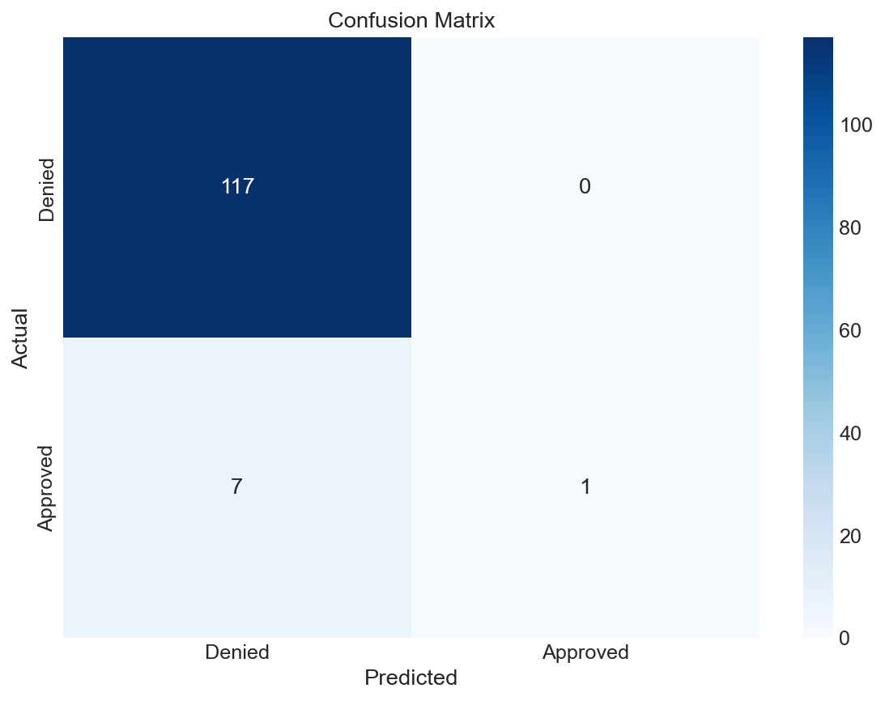<figcaption><p>Figure 8: Confusion Matrix</p></figcaption></figure>

<figure>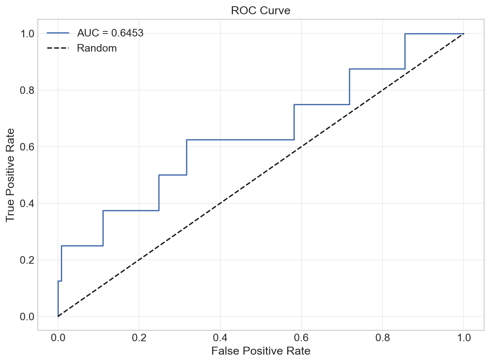<figcaption><p>Figure 9: ROC Curve</p></figcaption></figure>

```
Loan approval dataset created.
              Age        Income  ...  CreditScore    Approved
count  500.000000    500.000000  ...   500.000000  500.000000
mean    35.068380  50477.391756  ...   849.351735    0.046000
std      9.812532  14669.957928  ...     6.854254    0.209695
min      2.587327   9546.700356  ...   738.183677    0.000000
25%     27.996926  41070.623902  ...   850.000000    0.000000
50%     35.127971  50427.973993  ...   850.000000    0.000000
75%     41.367833  59768.634463  ...   850.000000    0.000000
max     73.527315  89485.730973  ...   850.000000    1.000000

[8 rows x 6 columns]

Loan Approval Model Coefficients:
          Feature  Coefficient  Odds_Ratio
0             Age     0.630864    1.879233
1          Income     0.583599    1.792477
2  EducationYears     0.460648    1.585101
4     CreditScore     0.042793    1.043722
3    DebtToIncome    -0.244546    0.783060
Model Accuracy: 0.9440

Confusion Matrix:
[[117   0]
 [  7   1]]

Classification Report:
              precision    recall  f1-score   support

      Denied       0.94      1.00      0.97       117
    Approved       1.00      0.12      0.22         8

    accuracy                           0.94       125
   macro avg       0.97      0.56      0.60       125
weighted avg       0.95      0.94      0.92       125
```

Generate a more complex dataset

Lines 1-13: follow this band in the snippet.

Create logit for probability of loan approval

Lines 14-26: follow this band in the snippet.

Create DataFrame

Lines 27-39: follow this band in the snippet.

Build a model with multiple features

Lines 40-52: follow this band in the snippet.

Show coefficients and odds ratios

Lines 53-66: follow this band in the snippet.

<figure><figcaption><p>Figure 8: Confusion Matrix</p></figcaption></figure>

<figure><figcaption><p>Figure 9: ROC Curve</p></figcaption></figure>

```
Loan approval dataset created.
              Age        Income  ...  CreditScore    Approved
count  500.000000    500.000000  ...   500.000000  500.000000
mean    35.068380  50477.391756  ...   849.351735    0.046000
std      9.812532  14669.957928  ...     6.854254    0.209695
min      2.587327   9546.700356  ...   738.183677    0.000000
25%     27.996926  41070.623902  ...   850.000000    0.000000
50%     35.127971  50427.973993  ...   850.000000    0.000000
75%     41.367833  59768.634463  ...   850.000000    0.000000
max     73.527315  89485.730973  ...   850.000000    1.000000

[8 rows x 6 columns]

Loan Approval Model Coefficients:
          Feature  Coefficient  Odds_Ratio
0             Age     0.630864    1.879233
1          Income     0.583599    1.792477
2  EducationYears     0.460648    1.585101
4     CreditScore     0.042793    1.043722
3    DebtToIncome    -0.244546    0.783060
Model Accuracy: 0.9440

Confusion Matrix:
[[117   0]
 [  7   1]]

Classification Report:
              precision    recall  f1-score   support

      Denied       0.94      1.00      0.97       117
    Approved       1.00      0.12      0.22         8

    accuracy                           0.94       125
   macro avg       0.97      0.56      0.60       125
weighted avg       0.95      0.94      0.92       125
```

The 0.94 accuracy looks impressive but the recall on the **Approved** class is only 0.12, the model defaults to predicting "Denied" because that class dominates the training data (only 4.6 % approved). This is a textbook **class-imbalance** failure; the next subsection on `class_weight='balanced'` is the standard fix.

### 2. Feature Importance and Interpretation

**Bar chart of signed coefficients as importance for the loan model**

**Purpose:** Rank features by absolute logistic coefficient, color bars green/red for direction, and show odds ratios in the underlying table logic (plot uses coefficients).

**Walkthrough:** `model.coef_[0]`; `Patch` legend for positive/negative effect; horizontal bar chart.

<figure>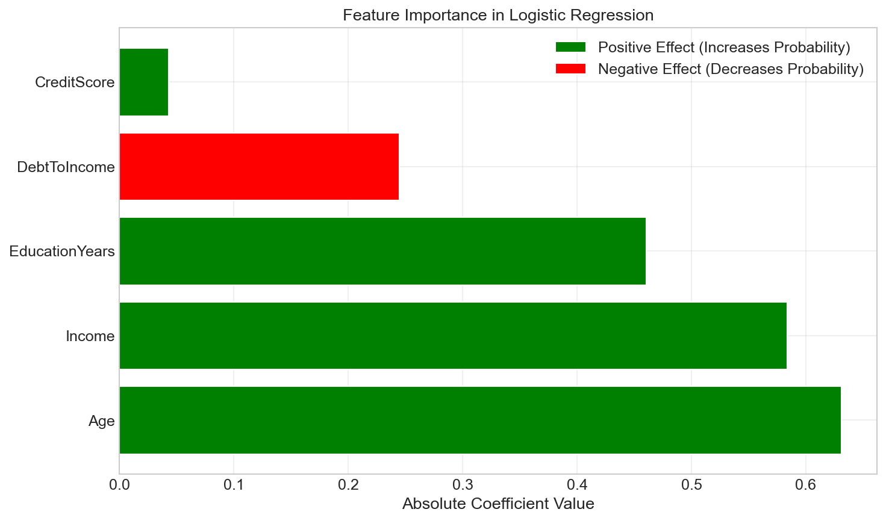<figcaption><p>Figure 10: Feature Importance in Logistic Regression</p></figcaption></figure>

Def plot\_feature\_importance(model, feature\_na…

Lines 1-12: follow this band in the snippet.

})

Lines 13-24: follow this band in the snippet.

From matplotlib.patches import Patch

Lines 25-37: follow this band in the snippet.

.png>)

### 3. Handling Class Imbalance

In many real-world applications, the classes are imbalanced (e.g., rare medical conditions, fraud detection). Here's how to handle this:

**Imbalanced labels: `class_weight` vs default with ROC and PR curves**

**Purpose:** Force a 10% positive rate, fit plain and `class_weight='balanced'` logistic models, and compare ROC and precision-recall curves plus classification reports.

**Walkthrough:** `stratify` in `train_test_split`; `roc_curve`, `roc_auc_score`, `precision_recall_curve`, `average_precision_score`; subplot layout.

Create an imbalanced dataset (10% positive cl…

Lines 1-17: follow this band in the snippet.

Create DataFrame

Lines 18-34: follow this band in the snippet.

Plt.savefig('class\_imbalance.png')

Lines 35-52: follow this band in the snippet.

Compare models

Lines 53-69: follow this band in the snippet.

Plt.ylabel('True Positive Rate')

Lines 70-86: follow this band in the snippet.

Plt.grid(True, alpha=0.3)

Lines 87-104: follow this band in the snippet.

This comparison shows that:

1. The **balanced model** (which gives more weight to the minority class) typically has better recall
2. For imbalanced datasets, the **precision-recall curve** is often more informative than the ROC curve
3. Using appropriate metrics like F1-score or average precision is important

## Common Pitfalls and Solutions

### 1. Class Imbalance

**Problem**: One class has many more examples than the other, leading to biased models.

**Solutions**:

* Use `class_weight='balanced'` parameter in LogisticRegression
* Oversample the minority class (using techniques like SMOTE)
* Undersample the majority class
* Use different evaluation metrics (F1-score, precision-recall AUC)

**Instantiate `LogisticRegression` with balanced or custom `class_weight`**

**Purpose:** Show two ways to pass class weights: `'balanced'` or an explicit `{class: weight}` dict for skewed costs.

**Walkthrough:** `LogisticRegression(class_weight=...)` constructors only (no fit in snippet).

From sklearn.linear\_model import LogisticRegr…

Lines 1-8: follow this band in the snippet.

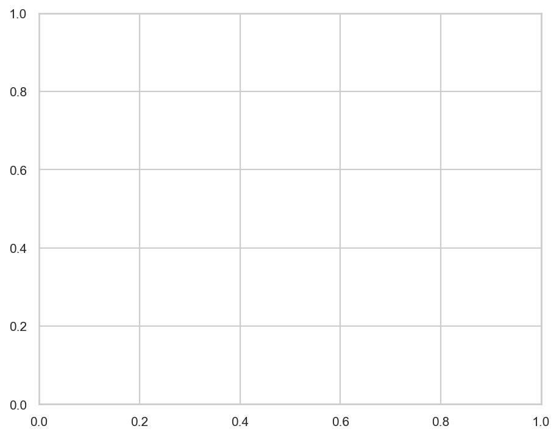

### 2. Multicollinearity

**Problem**: Features are highly correlated, making coefficient interpretation difficult.

**Solutions**:

* Remove redundant features
* Use regularization (L1 or L2)
* Apply dimensionality reduction techniques (like PCA)

**L1 vs L2 penalties via `penalty` and `solver` choice**

**Purpose:** Illustrate `LogisticRegression` with `penalty='l1'` and `liblinear` vs `penalty='l2'` at the same `C` for multicollinear settings.

**Walkthrough:** `C` as inverse regularization strength; comment ties smaller `C` to stronger shrinkage.

Example of using regularization to handle mul…

Lines 1-10: follow this band in the snippet.

### 3. Non-linearity

**Problem**: Logistic regression assumes a linear relationship in log-odds space.

**Solutions**:

* Add polynomial features
* Use feature transformations
* Consider non-linear models (random forests, neural networks)

**Pipeline: quadratic feature expansion then logistic regression**

**Purpose:** Chain `PolynomialFeatures(degree=2)` with `LogisticRegression` to capture curvature in log-odds, fit on train split.

**Walkthrough:** `make_pipeline`; `fit` on `X_train`, `y_train` from earlier exam workflow.

```
Pipeline(steps=[('polynomialfeatures', PolynomialFeatures(include_bias=False)),
                ('logisticregression', LogisticRegression())])
```

Example of adding polynomial features

Lines 1-10: follow this band in the snippet.

```
Pipeline(steps=[('polynomialfeatures', PolynomialFeatures(include_bias=False)),
                ('logisticregression', LogisticRegression())])
```

## Extending to Multi-class Classification

Logistic regression can be extended to handle multiple classes using two approaches:

### 1. One-vs-Rest (OvR)

Trains one binary classifier per class and selects the class with the highest probability. In sklearn, wrap a binary `LogisticRegression` in `OneVsRestClassifier`.

**Iris data: one-vs-rest logistic regression**

**Purpose:** Load Iris, split, fit `OneVsRestClassifier(LogisticRegression())`, report test accuracy and `predict_proba` shape.

**Walkthrough:** `load_iris`; `train_test_split`; `score`; `predict_proba` for class probabilities.

```
Accuracy on multi-class problem: 0.9556
Shape of probability matrix: (45, 3)
```

From sklearn.linear\_model import LogisticRegr…

Lines 1-10: follow this band in the snippet.

One-vs-Rest with explicit wrapper

Lines 11-21: follow this band in the snippet.

```
Accuracy on multi-class problem: 0.9556
Shape of probability matrix: (45, 3)
```

### 2. Multinomial Logistic Regression (Softmax Regression)

Generalizes logistic regression to multiple classes using the softmax function. In sklearn ≥ 1.5 the default behaviour for `LogisticRegression` on a multi-class target is multinomial; the explicit `multi_class` argument was deprecated in 1.5 and removed in 1.7.

**Multinomial logistic on the same Iris split**

**Purpose:** Fit softmax regression on the same train/test as OvR and compare held-out accuracy.

**Walkthrough:** Default `LogisticRegression` with `solver='lbfgs'`; `score` on `X_test`, `y_test`.

```
Multinomial (Softmax) accuracy: 1.0000
```

Multinomial is the default for multi-class ta…

Lines 1-7: follow this band in the snippet.

```
Multinomial (Softmax) accuracy: 1.0000
```

## Interactive Example: Predict Customer Purchase

Create an interactive example where we predict if a customer will make a purchase based on their behavior:

**Toy `coef_` / `intercept_` and manual scaling for purchase probability**

**Purpose:** Demonstrate `predict_proba` from a hand-set logistic model after z-scoring features with fixed population means/stds.

**Walkthrough:** Assign `coef_` and `intercept_`; manual `(X - mean) / std`; threshold narrative at 0.5.

```
Customer profile: 28 years old, 5 mins on site, viewed 8 pages, returning customer: True
Probability of purchase: 4.46%
Action: No special offer needed.
```

Create a function to predict purchase probabi…

Lines 1-11: follow this band in the snippet.

Scale features (using typical means and stds)

Lines 12-23: follow this band in the snippet.

Time\_on\_site = 5 # minutes

Lines 24-35: follow this band in the snippet.

```
Customer profile: 28 years old, 5 mins on site, viewed 8 pages, returning customer: True
Probability of purchase: 4.46%
Action: No special offer needed.
```

## Practice Exercise

Try building a logistic regression model to predict diabetes using the Pima Indians Diabetes dataset:

**End-to-end Pima Indians pipeline: scale, fit, metrics, odds ratios**

**Purpose:** Load CSV from URL, inspect with `info`/`describe`, train `LogisticRegression` on scaled features, print confusion matrix and report, and rank features by odds ratio.

**Walkthrough:** `pd.read_csv`; `train_test_split`; `StandardScaler`; `classification_report`, `confusion_matrix`; `np.exp` on coefficients.

\`\`\` RangeIndex: 768 entries, 0 to 767 Data columns (total 9 columns): # Column Non-Null Count Dtype --- ------ -------------- ----- 0 Pregnancies 768 non-null int64 1 Glucose 768 non-null int64 2 BloodPressure 768 non-null int64 3 SkinThickness 768 non-null int64 4 Insulin 768 non-null int64 5 BMI 768 non-null float64 6 DiabetesPedigreeFunction 768 non-null float64 7 Age 768 non-null int64 8 Outcome 768 non-null int64 dtypes: float64(2), int64(7) memory usage: 54.1 KB None Pregnancies Glucose ... Age Outcome count 768.000000 768.000000 ... 768.000000 768.000000 mean 3.845052 120.894531 ... 33.240885 0.348958 std 3.369578 31.972618 ... 11.760232 0.476951 min 0.000000 0.000000 ... 21.000000 0.000000 25% 1.000000 99.000000 ... 24.000000 0.000000 50% 3.000000 117.000000 ... 29.000000 0.000000 75% 6.000000 140.250000 ... 41.000000 1.000000 max 17.000000 199.000000 ... 81.000000 1.000000

\[8 rows x 9 columns]

Confusion Matrix: \[\[95 28] \[24 45]]

Classification Report: precision recall f1-score support

```
       0       0.80      0.77      0.79       123
       1       0.62      0.65      0.63        69

accuracy                           0.73       192
```

macro avg 0.71 0.71 0.71 192 weighted avg 0.73 0.73 0.73 192

Feature Importance: Feature Coefficient Odds\_Ratio 1 Glucose 1.131155 3.099233 5 BMI 0.760050 2.138384 7 Age 0.429940 1.537165 0 Pregnancies 0.201701 1.223482 6 DiabetesPedigreeFunction 0.171810 1.187453 3 SkinThickness 0.066148 1.068385 4 Insulin -0.172464 0.841589 2 BloodPressure -0.222390 0.800603

```

</div>
<aside class="code-explainer__callouts" aria-label="Code walkthrough">
  <div class="code-callout" data-lines="1-12" data-tint="1">
    <div class="code-callout__meta">
      <span class="code-callout__lines"></span>
      <span class="code-callout__title">Import libraries</span>
    </div>
    <div class="code-callout__body">
      <p>Lines 1-12: follow this band in the snippet.</p>
    </div>
  </div>
  <div class="code-callout" data-lines="13-25" data-tint="2">
    <div class="code-callout__meta">
      <span class="code-callout__lines"></span>
      <span class="code-callout__title">Diabetes_data = pd.read_csv(url, names=column…</span>
    </div>
    <div class="code-callout__body">
      <p>Lines 13-25: follow this band in the snippet.</p>
    </div>
  </div>
  <div class="code-callout" data-lines="26-38" data-tint="3">
    <div class="code-callout__meta">
      <span class="code-callout__lines"></span>
      <span class="code-callout__title">Scale features</span>
    </div>
    <div class="code-callout__body">
      <p>Lines 26-38: follow this band in the snippet.</p>
    </div>
  </div>
  <div class="code-callout" data-lines="39-51" data-tint="4">
    <div class="code-callout__meta">
      <span class="code-callout__lines"></span>
      <span class="code-callout__title">Print(confusion_matrix(y_test, y_pred))</span>
    </div>
    <div class="code-callout__body">
      <p>Lines 39-51: follow this band in the snippet.</p>
    </div>
  </div>
</aside>
</div>

```

\<class 'pandas.DataFrame'> RangeIndex: 768 entries, 0 to 767 Data columns (total 9 columns):

## Column Non-Null Count Dtype

***

0 Pregnancies 768 non-null int64 1 Glucose 768 non-null int64 2 BloodPressure 768 non-null int64 3 SkinThickness 768 non-null int64 4 Insulin 768 non-null int64 5 BMI 768 non-null float64 6 DiabetesPedigreeFunction 768 non-null float64 7 Age 768 non-null int64 8 Outcome 768 non-null int64 dtypes: float64(2), int64(7) memory usage: 54.1 KB None Pregnancies Glucose ... Age Outcome count 768.000000 768.000000 ... 768.000000 768.000000 mean 3.845052 120.894531 ... 33.240885 0.348958 std 3.369578 31.972618 ... 11.760232 0.476951 min 0.000000 0.000000 ... 21.000000 0.000000 25% 1.000000 99.000000 ... 24.000000 0.000000 50% 3.000000 117.000000 ... 29.000000 0.000000 75% 6.000000 140.250000 ... 41.000000 1.000000 max 17.000000 199.000000 ... 81.000000 1.000000

\[8 rows x 9 columns]

Confusion Matrix: \[\[95 28] \[24 45]]

Classification Report: precision recall f1-score support

```
       0       0.80      0.77      0.79       123
       1       0.62      0.65      0.63        69

accuracy                           0.73       192
```

macro avg 0.71 0.71 0.71 192 weighted avg 0.73 0.73 0.73 192

Feature Importance: Feature Coefficient Odds\_Ratio 1 Glucose 1.131155 3.099233 5 BMI 0.760050 2.138384 7 Age 0.429940 1.537165 0 Pregnancies 0.201701 1.223482 6 DiabetesPedigreeFunction 0.171810 1.187453 3 SkinThickness 0.066148 1.068385 4 Insulin -0.172464 0.841589 2 BloodPressure -0.222390 0.800603

```

## Gotchas

- **Applying a 0.5 threshold blindly on imbalanced classes**: sklearn's default `predict` uses p ≥ 0.5 as the decision boundary. When the positive class is rare (e.g., 5% fraud), this threshold produces near-zero recall for the minority class. Evaluate the full ROC or precision-recall curve and choose a threshold that matches your business cost of false negatives vs. false positives.
- **Forgetting to scale features**: Logistic regression uses gradient-based optimisation (or its equivalent); features on very different scales (e.g., income in thousands vs. age in tens) cause slow convergence and poorly comparable coefficients. Always apply `StandardScaler` before fitting.
- **Interpreting coefficients as probabilities instead of log-odds**: A coefficient of 1.13 for Glucose means the log-odds of diabetes increases by 1.13 per unit, not that probability increases by 1.13. Convert to an odds ratio with `exp(coef)` and then back to a probability change only at a specific baseline.
- **Using accuracy as the sole metric for imbalanced datasets**: A model that predicts "no diabetes" for every patient achieves 65% accuracy on the Pima dataset while being completely useless. Report precision, recall, F1, or AUC-ROC alongside accuracy.
- **Assuming the model converges with the default `max_iter=100`**: sklearn will print a `ConvergenceWarning` silently if the solver hasn't converged, and the returned coefficients are unreliable. Increase `max_iter` or switch to `solver='lbfgs'` with looser tolerance after scaling features.
- **Treating predicted probabilities as calibrated without checking**: A model that outputs p = 0.8 does not necessarily mean 80% of those cases are positive. Use `sklearn.calibration.calibration_curve` or Platt scaling to verify and fix probability calibration before using raw probabilities for ranking or thresholding.

## Next steps

- Continue to [Polynomial regression](./polynomial-regression.md).

## Additional Resources

- [Scikit-learn Logistic Regression Documentation](https://scikit-learn.org/stable/modules/generated/sklearn.linear_model.LogisticRegression.html)
- [Introduction to Statistical Learning](https://www.statlearning.com/) (Chapter 4)
- [Logistic Regression in Python Tutorial](https://realpython.com/logistic-regression-python/)
- [Handling Class Imbalance](https://machinelearningmastery.com/tactics-to-combat-imbalanced-classes-in-your-machine-learning-dataset/)
```
