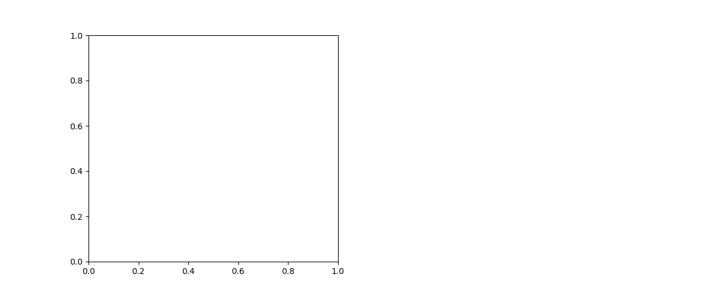

# Code Execution Output: logistic-regression.md

This file contains the output from running the code blocks in `logistic-regression.md`.


### Code Block 1
```python
import numpy as np
import matplotlib.pyplot as plt
import pandas as pd
from sklearn.linear_model import LogisticRegression
from sklearn.model_selection import train_test_split
from sklearn.metrics import accuracy_score, confusion_matrix, classification_report
from sklearn.preprocessing import StandardScaler
import seaborn as sns

# Set a random seed for reproducibility
np.random.seed(42)

# Generate synthetic data for student exam results
study_hours = np.random.normal(5, 2, 100)
aptitude_scores = np.random.normal(65, 15, 100)

# Create a relationship where both study time and aptitude affect passing probability
# with some randomness
# Higher study hours and higher aptitude scores increase passing probability
passing_probability = 1 / (1 + np.exp(-(0.75 * (study_hours - 5) + 0.02 * (aptitude_scores - 65))))
passed = np.random.binomial(1, passing_probability)

# Create a DataFrame for easier data handling
exam_data = pd.DataFrame({
    'StudyHours': study_hours,
    'AptitudeScore': aptitude_scores,
    'Passed': passed
})

# Plot the data
plt.figure(figsize=(10, 6))
plt.scatter(exam_data.StudyHours[exam_data.Passed == 1], 
            exam_data.AptitudeScore[exam_data.Passed == 1], 
            c='green', marker='+', s=100, label='Passed')
plt.scatter(exam_data.StudyHours[exam_data.Passed == 0], 
            exam_data.AptitudeScore[exam_data.Passed == 0], 
            c='red', marker='x', s=100, label='Failed')
plt.xlabel('Study Hours')
plt.ylabel('Aptitude Score')
plt.title('Exam Results Based on Study Hours and Aptitude')
plt.legend()
plt.grid(True, alpha=0.3)
plt.savefig('binary_classification_example.png')
plt.show()

print(exam_data.head())

```

Output:
```
   StudyHours  AptitudeScore  Passed
0    5.993428      43.769439       0
1    4.723471      58.690320       1
2    6.295377      59.859282       1
3    8.046060      52.965841       1
4    4.531693      62.580714       0

```


### Code Block 2
```python
def plot_logistic_curve():
    """Visualize the logistic function with annotations"""
    x = np.linspace(-6, 6, 100)
    y = 1 / (1 + np.exp(-x))
    
    plt.figure(figsize=(12, 6))
    plt.plot(x, y, 'b-', linewidth=2)
    
    # Add annotations
    plt.annotate('Almost Certain 0', xy=(-4, 0.02), xytext=(-5, 0.15),
                arrowprops=dict(facecolor='black', shrink=0.05))
    plt.annotate('Decision Boundary\np = 0.5', xy=(0, 0.5), xytext=(-2.5, 0.7),
                arrowprops=dict(facecolor='black', shrink=0.05))
    plt.annotate('Almost Certain 1', xy=(4, 0.98), xytext=(3, 0.8),
                arrowprops=dict(facecolor='black', shrink=0.05))
    
    # Add a horizontal line at p = 0.5
    plt.axhline(y=0.5, color='r', linestyle='--', alpha=0.3)
    # Add a vertical line at z = 0
    plt.axvline(x=0, color='r', linestyle='--', alpha=0.3)
    
    plt.title('The Logistic (Sigmoid) Function')
    plt.xlabel('z = β₀ + β₁x₁ + β₂x₂ + ... + βₙxₙ')
    plt.ylabel('Probability p(z)')
    plt.grid(True)
    plt.text(-5.5, 0.95, 'p(z) = 1 / (1 + e^(-z))', fontsize=14, bbox=dict(facecolor='white', alpha=0.8))
    plt.savefig('logistic_curve_annotated.png')
    plt.show()

# Plot the logistic curve
plot_logistic_curve()

```


### Code Block 3
```python
def plot_coefficient_effects():
    """Visualize how coefficients affect the probability curve"""
    x = np.linspace(-6, 6, 100)
    
    # Different coefficient scenarios
    scenarios = {
        'Strong Positive (β=2)': 2*x,
        'Weak Positive (β=0.5)': 0.5*x,
        'Strong Negative (β=-2)': -2*x,
        'Weak Negative (β=-0.5)': -0.5*x
    }
    
    plt.figure(figsize=(12, 8))
    for label, z in scenarios.items():
        y = 1 / (1 + np.exp(-z))
        plt.plot(x, y, linewidth=2, label=label)
    
    plt.title('Effect of Different Coefficients on Probability Curve')
    plt.xlabel('Feature Value')
    plt.ylabel('Probability of Positive Class')
    plt.legend()
    plt.grid(True)
    plt.axhline(y=0.5, color='black', linestyle='--', alpha=0.3)
    plt.savefig('coefficient_effects.png')
    plt.show()

# Plot how coefficients affect the probability curve
plot_coefficient_effects()

```


### Code Block 4
```python
def plot_odds_ratios():
    """Visualize odds ratios from coefficients"""
    # Sample coefficients
    coefficients = np.array([2.1, 0.8, 0.0, -0.5, -1.7])
    odds_ratios = np.exp(coefficients)
    feature_names = ['Feature A', 'Feature B', 'Feature C', 'Feature D', 'Feature E']
    
    # Calculate confidence intervals (just for illustration)
    std_errors = np.array([0.3, 0.2, 0.15, 0.25, 0.4])
    ci_lower = np.exp(coefficients - 1.96 * std_errors)
    ci_upper = np.exp(coefficients + 1.96 * std_errors)
    
    # Create DataFrame
    df = pd.DataFrame({
        'Feature': feature_names,
        'Odds_Ratio': odds_ratios,
        'CI_Lower': ci_lower,
        'CI_Upper': ci_upper
    })
    df = df.sort_values('Odds_Ratio')
    
    # Plot
    plt.figure(figsize=(10, 6))
    plt.errorbar(df.Odds_Ratio, range(len(df)), 
                 xerr=[df.Odds_Ratio - df.CI_Lower, df.CI_Upper - df.Odds_Ratio],
                 fmt='o', capsize=5)
    
    plt.axvline(x=1, color='r', linestyle='--', label='No Effect Line')
    plt.yticks(range(len(df)), df.Feature)
    plt.xscale('log')  # Log scale makes interpretation easier
    plt.xlabel('Odds Ratio (log scale)')
    plt.title('Odds Ratios with 95% Confidence Intervals')
    plt.grid(True, alpha=0.3)
    
    # Add annotations
    plt.text(0.2, -0.5, 'Decreases Odds', color='blue', fontsize=12)
    plt.text(2, -0.5, 'Increases Odds', color='blue', fontsize=12)
    plt.savefig('odds_ratios.png')
    plt.show()

# Plot odds ratios
plot_odds_ratios()

```


### Code Block 5
```python
# Let's use our exam data from earlier
X = exam_data[['StudyHours', 'AptitudeScore']]
y = exam_data['Passed']

# Split the data
X_train, X_test, y_train, y_test = train_test_split(X, y, test_size=0.25, random_state=42)

# Scale the features
scaler = StandardScaler()
X_train_scaled = scaler.fit_transform(X_train)
X_test_scaled = scaler.transform(X_test)

print("Data preparation complete.")
print(f"Training set shape: {X_train.shape}")
print(f"Test set shape: {X_test.shape}")

```

Output:
```
Data preparation complete.
Training set shape: (75, 2)
Test set shape: (25, 2)

```


### Code Block 6
```python
# Create and train the model
model = LogisticRegression(random_state=42)
model.fit(X_train_scaled, y_train)

# Extract coefficients
coefficients = pd.DataFrame({
    'Feature': X.columns,
    'Coefficient': model.coef_[0],
    'Odds Ratio': np.exp(model.coef_[0])
})

print("Model trained successfully!")
print("\nCoefficients:")
print(coefficients)
print(f"\nIntercept: {model.intercept_[0]:.4f}")

# Calculate probability threshold at the decision boundary
# z = β₀ + β₁x₁ + β₂x₂ = 0
# Solving for x₂ (AptitudeScore): x₂ = -(β₀ + β₁x₁) / β₂

```

Output:
```
Model trained successfully!

Coefficients:
         Feature  Coefficient  Odds Ratio
0     StudyHours     1.381725    3.981764
1  AptitudeScore     0.109766    1.116016

Intercept: 0.2269

```


### Code Block 7
```python
def plot_decision_boundary(X, y, model, scaler):
    """Plot the decision boundary of a logistic regression model"""
    # Create a mesh grid of points to evaluate the model on
    h = 0.05  # step size in the mesh
    x_min, x_max = X[:, 0].min() - 1, X[:, 0].max() + 1
    y_min, y_max = X[:, 1].min() - 1, X[:, 1].max() + 1
    xx, yy = np.meshgrid(np.arange(x_min, x_max, h),
                         np.arange(y_min, y_max, h))
    
    # Scale the mesh points
    mesh_points_scaled = scaler.transform(np.c_[xx.ravel(), yy.ravel()])
    
    # Get predictions for each point in the mesh
    Z = model.predict_proba(mesh_points_scaled)[:, 1]
    Z = Z.reshape(xx.shape)
    
    # Plot the contour
    plt.figure(figsize=(10, 8))
    
    # Plot decision regions
    contour = plt.contourf(xx, yy, Z, alpha=0.3, cmap=plt.cm.RdBu_r)
    plt.colorbar(contour, label='Probability of Passing')
    
    # Plot decision boundary (where probability = 0.5)
    plt.contour(xx, yy, Z, levels=[0.5], linestyles='dashed', colors='k')
    
    # Plot data points
    scatter = plt.scatter(X[:, 0], X[:, 1], c=y, edgecolor='k', cmap=plt.cm.RdBu_r)
    plt.legend(*scatter.legend_elements(), title="Exam Result")
    
    plt.xlabel('Study Hours')
    plt.ylabel('Aptitude Score')
    plt.title('Logistic Regression Decision Boundary')
    plt.grid(True, alpha=0.3)
    plt.savefig('logistic_decision_boundary.png')
    plt.show()

# Plot the decision boundary
X_scaled = scaler.transform(X)
plot_decision_boundary(X_scaled, y, model, scaler)

```


### Code Block 8
```python
def evaluate_model(model, X_test, y_test):
    """Evaluate logistic regression model performance"""
    # Make predictions
    y_pred = model.predict(X_test)
    y_pred_prob = model.predict_proba(X_test)[:, 1]
    
    # Calculate accuracy
    accuracy = accuracy_score(y_test, y_pred)
    
    # Create confusion matrix
    cm = confusion_matrix(y_test, y_pred)
    
    # Print results
    print(f"Model Accuracy: {accuracy:.4f}")
    print("\nConfusion Matrix:")
    
    # Plot confusion matrix
    plt.figure(figsize=(8, 6))
    sns.heatmap(cm, annot=True, fmt='d', cmap='Blues',
                xticklabels=['Failed', 'Passed'],
                yticklabels=['Failed', 'Passed'])
    plt.xlabel('Predicted')
    plt.ylabel('Actual')
    plt.title('Confusion Matrix')
    plt.savefig('confusion_matrix.png')
    plt.show()
    
    # Print classification report
    print("\nClassification Report:")
    print(classification_report(y_test, y_pred, target_names=['Failed', 'Passed']))
    
    # Plot ROC curve
    from sklearn.metrics import roc_curve, roc_auc_score
    fpr, tpr, thresholds = roc_curve(y_test, y_pred_prob)
    auc = roc_auc_score(y_test, y_pred_prob)
    
    plt.figure(figsize=(8, 6))
    plt.plot(fpr, tpr, label=f'AUC = {auc:.4f}')
    plt.plot([0, 1], [0, 1], 'k--', label='Random')
    plt.xlabel('False Positive Rate')
    plt.ylabel('True Positive Rate')
    plt.title('ROC Curve')
    plt.legend()
    plt.grid(True, alpha=0.3)
    plt.savefig('roc_curve.png')
    plt.show()

# Evaluate the model
evaluate_model(model, X_test_scaled, y_test)

```

Output:
```
Model Accuracy: 0.7600

Confusion Matrix:

Classification Report:
              precision    recall  f1-score   support

      Failed       1.00      0.62      0.77        16
      Passed       0.60      1.00      0.75         9

    accuracy                           0.76        25
   macro avg       0.80      0.81      0.76        25
weighted avg       0.86      0.76      0.76        25


```


### Code Block 9
```python
# Generate a more complex dataset
np.random.seed(42)
n_samples = 500

# Generate features
age = np.random.normal(35, 10, n_samples)
income = np.random.normal(50000, 15000, n_samples)
education_years = np.random.normal(16, 3, n_samples)
debt_to_income = np.random.beta(2, 5, n_samples) * 0.5

# Create some correlations
credit_score = 600 + 0.01 * income - 20 * debt_to_income + 5 * education_years + np.random.normal(0, 50, n_samples)
credit_score = np.clip(credit_score, 300, 850)

# Create logit for probability of loan approval
z = (-5 +                           # Intercept
     0.05 * (age - 35) +            # Age effect
     0.00003 * (income - 50000) +   # Income effect
     0.2 * (education_years - 16) + # Education effect
     -5 * debt_to_income +          # Debt to income effect
     0.01 * (credit_score - 650))   # Credit score effect

# Generate probabilities and outcomes
approval_prob = 1 / (1 + np.exp(-z))
approved = np.random.binomial(1, approval_prob)

# Create DataFrame
loan_data = pd.DataFrame({
    'Age': age,
    'Income': income,
    'EducationYears': education_years,
    'DebtToIncome': debt_to_income,
    'CreditScore': credit_score,
    'Approved': approved
})

print("Loan approval dataset created.")
print(loan_data.describe())

# Build a model with multiple features
X_loan = loan_data.drop('Approved', axis=1)
y_loan = loan_data['Approved']

# Split and scale
X_train, X_test, y_train, y_test = train_test_split(X_loan, y_loan, test_size=0.25, random_state=42)
scaler = StandardScaler()
X_train_scaled = scaler.fit_transform(X_train)
X_test_scaled = scaler.transform(X_test)

# Train model
loan_model = LogisticRegression(random_state=42)
loan_model.fit(X_train_scaled, y_train)

# Show coefficients and odds ratios
loan_coefficients = pd.DataFrame({
    'Feature': X_loan.columns,
    'Coefficient': loan_model.coef_[0],
    'Odds_Ratio': np.exp(loan_model.coef_[0])
})
loan_coefficients = loan_coefficients.sort_values('Odds_Ratio', ascending=False)

print("\nLoan Approval Model Coefficients:")
print(loan_coefficients)

# Evaluate the model
evaluate_model(loan_model, X_test_scaled, y_test)

```

Output:
```
Loan approval dataset created.
              Age        Income  EducationYears  DebtToIncome  CreditScore    Approved
count  500.000000    500.000000      500.000000    500.000000   500.000000  500.000000
mean    35.068380  50477.391756       16.325454      0.144561   849.351735    0.046000
std      9.812532  14669.957928        3.030739      0.077935     6.854254    0.209695
min      2.587327   9546.700356        7.311234      0.003624   738.183677    0.000000
25%     27.996926  41070.623902       14.192711      0.084589   850.000000    0.000000
50%     35.127971  50427.973993       16.359418      0.133497   850.000000    0.000000
75%     41.367833  59768.634463       18.264215      0.197091   850.000000    0.000000
max     73.527315  89485.730973       23.805049      0.373771   850.000000    1.000000

Loan Approval Model Coefficients:
          Feature  Coefficient  Odds_Ratio
0             Age     0.630864    1.879233
1          Income     0.583599    1.792477
2  EducationYears     0.460648    1.585101
4     CreditScore     0.042793    1.043722
3    DebtToIncome    -0.244546    0.783060
Model Accuracy: 0.9440

Confusion Matrix:

Classification Report:
              precision    recall  f1-score   support

      Failed       0.94      1.00      0.97       117
      Passed       1.00      0.12      0.22         8

    accuracy                           0.94       125
   macro avg       0.97      0.56      0.60       125
weighted avg       0.95      0.94      0.92       125


```


### Code Block 10
```python
def plot_feature_importance(model, feature_names):
    """Plot the feature importance from logistic regression coefficients"""
    # Get absolute coefficient values
    coefs = model.coef_[0]
    abs_coefs = np.abs(coefs)
    
    # Create DataFrame
    importance_df = pd.DataFrame({
        'Feature': feature_names,
        'Absolute_Coefficient': abs_coefs,
        'Coefficient': coefs,
        'Odds_Ratio': np.exp(coefs)
    })
    importance_df = importance_df.sort_values('Absolute_Coefficient', ascending=False)
    
    # Plot
    plt.figure(figsize=(10, 6))
    colors = ['green' if c > 0 else 'red' for c in importance_df['Coefficient']]
    plt.barh(importance_df['Feature'], importance_df['Absolute_Coefficient'], color=colors)
    plt.xlabel('Absolute Coefficient Value')
    plt.title('Feature Importance in Logistic Regression')
    plt.grid(True, alpha=0.3)
    
    # Add a legend for the colors
    from matplotlib.patches import Patch
    legend_elements = [
        Patch(facecolor='green', label='Positive Effect (Increases Probability)'),
        Patch(facecolor='red', label='Negative Effect (Decreases Probability)')
    ]
    plt.legend(handles=legend_elements)
    
    plt.tight_layout()
    plt.savefig('feature_importance.png')
    plt.show()

# Plot feature importance
plot_feature_importance(loan_model, X_loan.columns)

```


### Code Block 11
```python
# Create an imbalanced dataset (10% positive class)
np.random.seed(42)
n_samples = 1000
n_positive = int(n_samples * 0.1)  # 10% positive class

# Generate features
feature1 = np.random.normal(0, 1, n_samples)
feature2 = np.random.normal(0, 1, n_samples)

# Create imbalanced classes
z = 1 + 2 * feature1 - 1 * feature2
prob = 1 / (1 + np.exp(-z))
class_label = np.zeros(n_samples)

# Assign most likely probabilities to ensure imbalance
sorted_indices = np.argsort(prob)
class_label[sorted_indices[-n_positive:]] = 1

# Create DataFrame
imbalanced_data = pd.DataFrame({
    'Feature1': feature1,
    'Feature2': feature2,
    'Class': class_label
})

print(f"Class distribution: {imbalanced_data['Class'].value_counts()}")

# Plot class distribution
plt.figure(figsize=(8, 6))
sns.countplot(x='Class', data=imbalanced_data)
plt.title('Class Distribution in Imbalanced Dataset')
plt.xlabel('Class')
plt.ylabel('Count')
plt.grid(True, alpha=0.3)
plt.savefig('class_imbalance.png')
plt.show()

# Split data
X_imb = imbalanced_data[['Feature1', 'Feature2']]
y_imb = imbalanced_data['Class']
X_train, X_test, y_train, y_test = train_test_split(X_imb, y_imb, test_size=0.25, random_state=42, 
                                                    stratify=y_imb)  # Stratify to maintain class distribution

# Create models
# Regular model
regular_model = LogisticRegression(random_state=42)
regular_model.fit(X_train, y_train)

# Model with class weight adjustment
balanced_model = LogisticRegression(class_weight='balanced', random_state=42)
balanced_model.fit(X_train, y_train)

# Compare models
def compare_models_on_imbalanced_data(models, X_test, y_test):
    """Compare different models on imbalanced data"""
    from sklearn.metrics import precision_recall_curve, average_precision_score
    
    plt.figure(figsize=(12, 5))
    
    # Plot ROC curves
    plt.subplot(121)
    for name, model in models.items():
        y_pred_prob = model.predict_proba(X_test)[:, 1]
        fpr, tpr, _ = roc_curve(y_test, y_pred_prob)
        auc = roc_auc_score(y_test, y_pred_prob)
        plt.plot(fpr, tpr, label=f'{name} (AUC = {auc:.3f})')
    
    plt.plot([0, 1], [0, 1], 'k--', label='Random')
    plt.xlabel('False Positive Rate')
    plt.ylabel('True Positive Rate')
    plt.title('ROC Curve')
    plt.legend()
    plt.grid(True, alpha=0.3)
    
    # Plot precision-recall curves
    plt.subplot(122)
    for name, model in models.items():
        y_pred_prob = model.predict_proba(X_test)[:, 1]
        precision, recall, _ = precision_recall_curve(y_test, y_pred_prob)
        ap = average_precision_score(y_test, y_pred_prob)
        plt.plot(recall, precision, label=f'{name} (AP = {ap:.3f})')
    
    plt.xlabel('Recall')
    plt.ylabel('Precision')
    plt.title('Precision-Recall Curve')
    plt.legend()
    plt.grid(True, alpha=0.3)
    
    plt.tight_layout()
    plt.savefig('imbalanced_comparison.png')
    plt.show()
    
    # Print classification reports
    for name, model in models.items():
        print(f"\nClassification Report for {name}:")
        y_pred = model.predict(X_test)
        print(classification_report(y_test, y_pred))

# Compare models
models = {
    'Regular Logistic Regression': regular_model,
    'Balanced Logistic Regression': balanced_model
}
compare_models_on_imbalanced_data(models, X_test, y_test)

```

Output:
```
Class distribution: Class
0.0    900
1.0    100
Name: count, dtype: int64
Error: name 'roc_curve' is not defined

```




### Code Block 12
```python
# Example of using class weights
from sklearn.linear_model import LogisticRegression

# Option 1: Let sklearn calculate optimal weights
weighted_model = LogisticRegression(class_weight='balanced')

# Option 2: Custom weights
class_weights = {0: 1, 1: 10}  # Give 10x importance to class 1
weighted_model = LogisticRegression(class_weight=class_weights)

```


### Code Block 13
```python
# Example of using regularization to handle multicollinearity
from sklearn.linear_model import LogisticRegression

# L1 regularization (Lasso)
l1_model = LogisticRegression(penalty='l1', solver='liblinear', C=0.1)

# L2 regularization (Ridge)
l2_model = LogisticRegression(penalty='l2', C=0.1)

# Note: C is inverse of regularization strength (smaller C = stronger regularization)

```


### Code Block 14
```python
# Example of adding polynomial features
from sklearn.preprocessing import PolynomialFeatures
from sklearn.pipeline import make_pipeline

# Create pipeline with polynomial features and logistic regression
poly_model = make_pipeline(
    PolynomialFeatures(degree=2, include_bias=False),
    LogisticRegression()
)
poly_model.fit(X_train, y_train)

```


### Code Block 15
```python
from sklearn.linear_model import LogisticRegression
from sklearn.datasets import load_iris
from sklearn.model_selection import train_test_split

# Load multi-class dataset
iris = load_iris()
X, y = iris.data, iris.target
X_train, X_test, y_train, y_test = train_test_split(X, y, test_size=0.3, random_state=42)

# Train multi-class logistic regression model
multi_class_model = LogisticRegression(multi_class='ovr', random_state=42)
multi_class_model.fit(X_train, y_train)

# Evaluate
accuracy = multi_class_model.score(X_test, y_test)
print(f"Accuracy on multi-class problem: {accuracy:.4f}")

# Get probabilities for each class
class_probabilities = multi_class_model.predict_proba(X_test)
print("Shape of probability matrix:", class_probabilities.shape)

```

Output:
```
Accuracy on multi-class problem: 0.9556
Shape of probability matrix: (45, 3)

```


### Code Block 16
```python
# Train multinomial logistic regression
softmax_model = LogisticRegression(multi_class='multinomial', solver='lbfgs', random_state=42)
softmax_model.fit(X_train, y_train)

# Compare performance
softmax_accuracy = softmax_model.score(X_test, y_test)
print(f"Multinomial (Softmax) accuracy: {softmax_accuracy:.4f}")

```

Output:
```
Multinomial (Softmax) accuracy: 1.0000

```


### Code Block 17
```python
# Create a function to predict purchase probability
def predict_purchase_probability(age, time_on_site, pages_visited, is_returning_customer):
    """Predict the probability of purchase based on customer characteristics"""
    # Create a synthetic model (in real applications, you would load a trained model)
    model = LogisticRegression()
    model.coef_ = np.array([[0.03, 0.05, 0.1, 0.8]])
    model.intercept_ = np.array([-4])
    
    # Create input features
    X = np.array([[age, time_on_site, pages_visited, int(is_returning_customer)]])
    
    # Scale features (using typical means and stds)
    means = np.array([35, 3, 5, 0.5])
    stds = np.array([15, 2, 3, 0.5])
    X_scaled = (X - means) / stds
    
    # Predict probability
    purchase_prob = model.predict_proba(X_scaled)[0, 1]
    
    return purchase_prob

# Example usage
age = 28
time_on_site = 5  # minutes
pages_visited = 8
is_returning = True

prob = predict_purchase_probability(age, time_on_site, pages_visited, is_returning)
print(f"Customer profile: {age} years old, {time_on_site} mins on site, viewed {pages_visited} pages, returning customer: {is_returning}")
print(f"Probability of purchase: {prob:.2%}")

if prob > 0.5:
    print("Action: Target with special offer!")
else:
    print("Action: No special offer needed.")

```

Output:
```
Error: 'LogisticRegression' object has no attribute 'classes_'

```


### Code Block 18
```python
# Import libraries
import pandas as pd
import numpy as np
from sklearn.linear_model import LogisticRegression
from sklearn.model_selection import train_test_split
from sklearn.preprocessing import StandardScaler
from sklearn.metrics import classification_report, confusion_matrix

# Download the dataset (you could use from sklearn.datasets or a direct URL)
url = "https://raw.githubusercontent.com/jbrownlee/Datasets/master/pima-indians-diabetes.data.csv"
column_names = ['Pregnancies', 'Glucose', 'BloodPressure', 'SkinThickness', 
                'Insulin', 'BMI', 'DiabetesPedigreeFunction', 'Age', 'Outcome']
                
diabetes_data = pd.read_csv(url, names=column_names)

# Explore data
print(diabetes_data.info())
print(diabetes_data.describe())

# Split features and target
X = diabetes_data.drop('Outcome', axis=1)
y = diabetes_data['Outcome']

# Split into train and test sets
X_train, X_test, y_train, y_test = train_test_split(X, y, test_size=0.25, random_state=42)

# Scale features
scaler = StandardScaler()
X_train_scaled = scaler.fit_transform(X_train)
X_test_scaled = scaler.transform(X_test)

# Train model
model = LogisticRegression(random_state=42)
model.fit(X_train_scaled, y_train)

# Evaluate model
y_pred = model.predict(X_test_scaled)
print("\nConfusion Matrix:")
print(confusion_matrix(y_test, y_pred))
print("\nClassification Report:")
print(classification_report(y_test, y_pred))

# Analyze feature importance
coefficients = pd.DataFrame({
    'Feature': X.columns,
    'Coefficient': model.coef_[0],
    'Odds_Ratio': np.exp(model.coef_[0])
})
coefficients = coefficients.sort_values('Odds_Ratio', ascending=False)
print("\nFeature Importance:")
print(coefficients)

```

Output:
```
<class 'pandas.core.frame.DataFrame'>
RangeIndex: 768 entries, 0 to 767
Data columns (total 9 columns):
 #   Column                    Non-Null Count  Dtype  
---  ------                    --------------  -----  
 0   Pregnancies               768 non-null    int64  
 1   Glucose                   768 non-null    int64  
 2   BloodPressure             768 non-null    int64  
 3   SkinThickness             768 non-null    int64  
 4   Insulin                   768 non-null    int64  
 5   BMI                       768 non-null    float64
 6   DiabetesPedigreeFunction  768 non-null    float64
 7   Age                       768 non-null    int64  
 8   Outcome                   768 non-null    int64  
dtypes: float64(2), int64(7)
memory usage: 54.1 KB
None
       Pregnancies     Glucose  ...         Age     Outcome
count   768.000000  768.000000  ...  768.000000  768.000000
mean      3.845052  120.894531  ...   33.240885    0.348958
std       3.369578   31.972618  ...   11.760232    0.476951
min       0.000000    0.000000  ...   21.000000    0.000000
25%       1.000000   99.000000  ...   24.000000    0.000000
50%       3.000000  117.000000  ...   29.000000    0.000000
75%       6.000000  140.250000  ...   41.000000    1.000000
max      17.000000  199.000000  ...   81.000000    1.000000

[8 rows x 9 columns]

Confusion Matrix:
[[95 28]
 [24 45]]

Classification Report:
              precision    recall  f1-score   support

           0       0.80      0.77      0.79       123
           1       0.62      0.65      0.63        69

    accuracy                           0.73       192
   macro avg       0.71      0.71      0.71       192
weighted avg       0.73      0.73      0.73       192


Feature Importance:
                    Feature  Coefficient  Odds_Ratio
1                   Glucose     1.131155    3.099233
5                       BMI     0.760050    2.138384
7                       Age     0.429940    1.537165
0               Pregnancies     0.201701    1.223482
6  DiabetesPedigreeFunction     0.171810    1.187453
3             SkinThickness     0.066148    1.068385
4                   Insulin    -0.172464    0.841589
2             BloodPressure    -0.222390    0.800603

```

