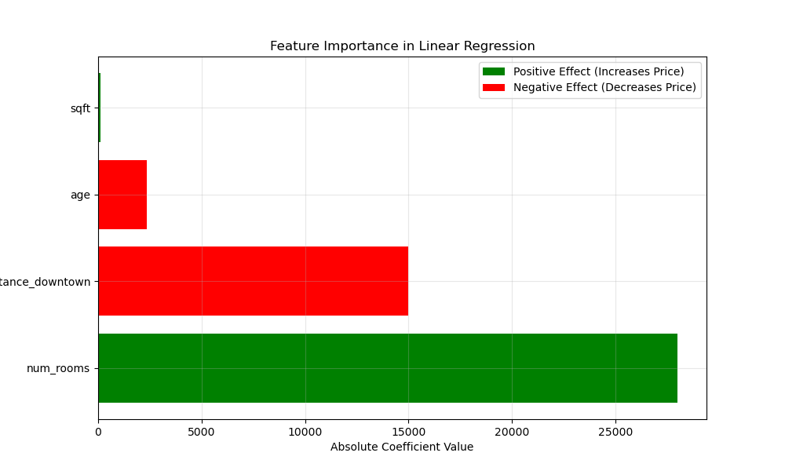
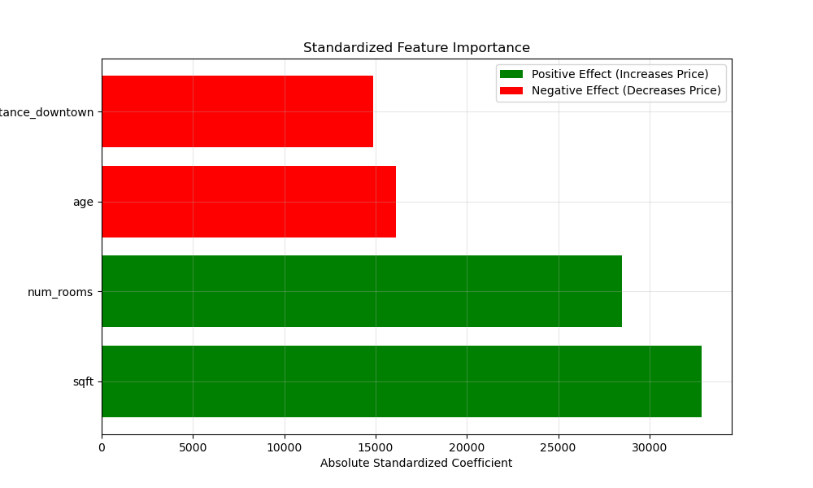
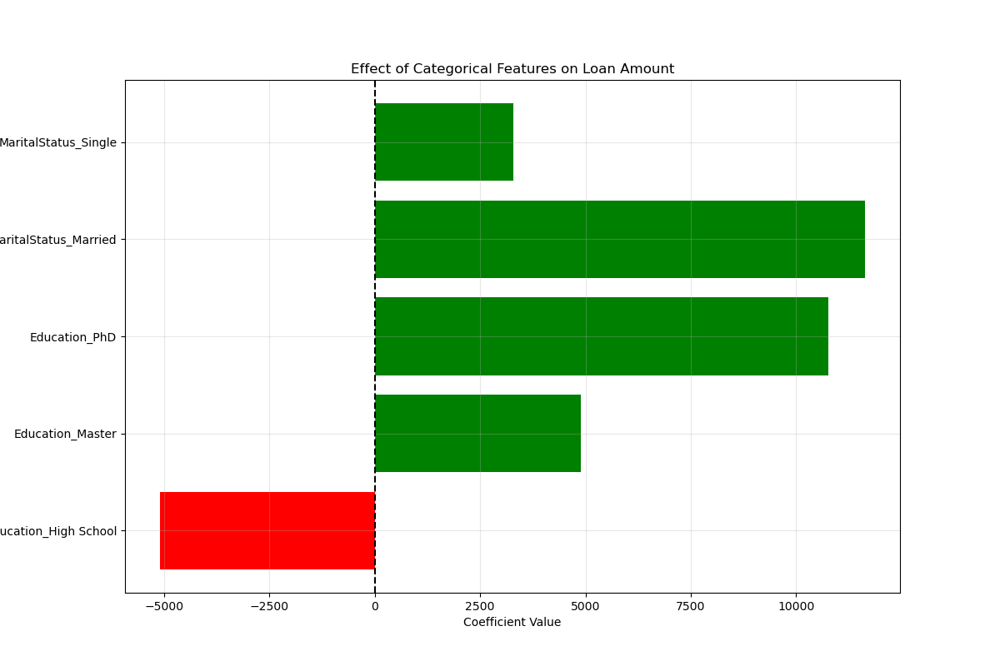
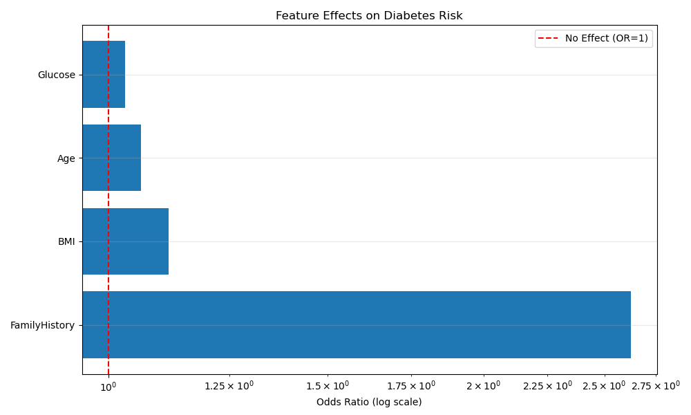
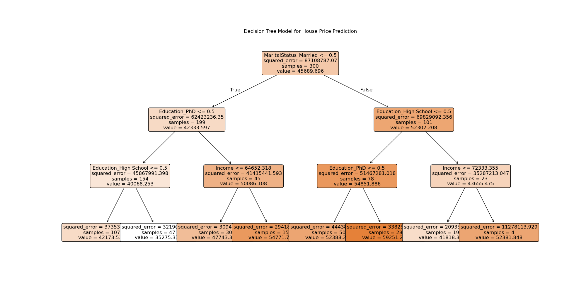
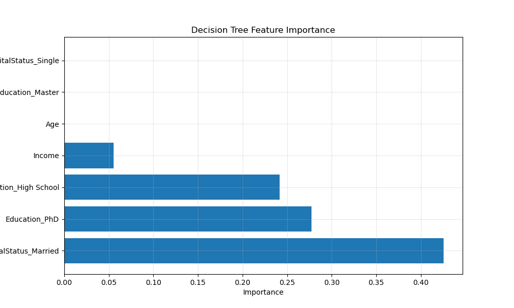
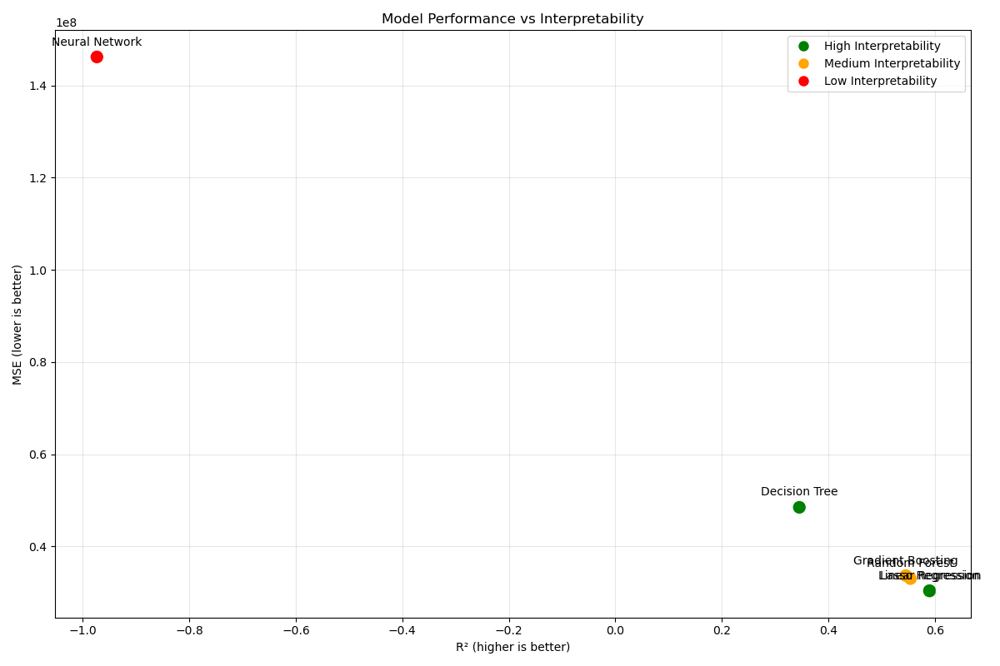
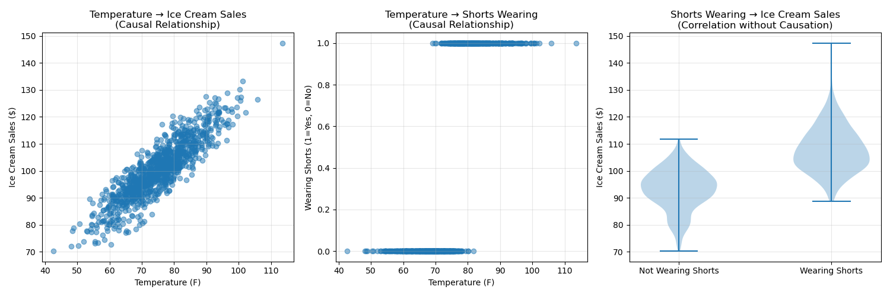
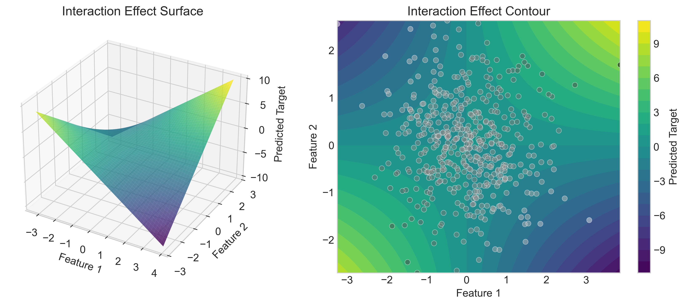

# Model Interpretation

## Introduction

Model interpretation is the process of understanding and explaining how your statistical model makes predictions. It's a crucial skill for data scientists and analysts because even the most accurate model is of limited value if you can't explain how it works or why it makes certain predictions.

### Why Interpretation Matters

Imagine you've built a model to predict loan approvals. Without proper interpretation:

- You can't explain to applicants why their loans were approved or denied
- You might miss important patterns or biases in your model's decisions
- Stakeholders won't trust your model's predictions
- You can't effectively improve the model when it makes errors
- You may violate regulatory requirements for transparent decision-making

Model interpretation transforms "black box" predictions into actionable insights by:

1. **Building trust** - Helping users understand why they should believe the predictions
2. **Ensuring fairness** - Identifying and addressing biases in model decisions
3. **Enabling improvements** - Showing where and why models make errors
4. **Providing insights** - Revealing important patterns in the data
5. **Meeting regulations** - Satisfying legal requirements for transparency (e.g., GDPR's "right to explanation")

### Real-world Examples

#### 1. Credit Scoring

**Without interpretation**: A bank uses a complex model to deny a loan but can't explain why.

**With interpretation**: The bank can tell the applicant their high debt-to-income ratio was the primary factor, and what they can do to improve their chances next time.

#### 2. Medical Diagnosis

**Without interpretation**: A model predicts a patient has a high risk of heart disease but doesn't explain why.

**With interpretation**: The doctor can see that elevated blood pressure and family history were the main factors, allowing for targeted treatment plans.

#### 3. Customer Churn Prediction

**Without interpretation**: A company knows which customers are likely to leave but doesn't know why.

**With interpretation**: They can identify that price sensitivity and recent service issues are driving churn, allowing them to take preventive actions.

## Understanding Model Outputs

### 1. Coefficient Interpretation

For linear and logistic regression models, the coefficients provide direct insight into how each feature affects the prediction:

```python
import numpy as np
import matplotlib.pyplot as plt
import pandas as pd
from sklearn.linear_model import LinearRegression, LogisticRegression
from sklearn.model_selection import train_test_split
from sklearn.preprocessing import StandardScaler
import seaborn as sns

# Set a random seed for reproducibility
np.random.seed(42)

# Create example dataset for housing prices
n_samples = 200
sqft = np.random.normal(1500, 300, n_samples)  # Square footage
age = np.random.normal(15, 7, n_samples)       # Home age in years
distance_downtown = np.random.normal(3, 1, n_samples)  # Miles from downtown
num_rooms = np.random.normal(3, 1, n_samples)  # Number of rooms

# Generate house prices with specific coefficient relationships
price = (
    100000 +                     # Base price
    120 * sqft +                 # Price increases with size
    -2000 * age +                # Price decreases with age
    -15000 * distance_downtown + # Price decreases with distance from downtown
    25000 * num_rooms +          # Price increases with rooms
    np.random.normal(0, 20000, n_samples)  # Random noise
)

# Combine into a DataFrame
housing_df = pd.DataFrame({
    'sqft': sqft,
    'age': age,
    'distance_downtown': distance_downtown,
    'num_rooms': num_rooms,
    'price': price
})

# Split data into features and target
X = housing_df.drop('price', axis=1)
y = housing_df['price']

# Train a linear regression model
model = LinearRegression()
model.fit(X, y)

# Create a DataFrame with features and coefficients
feature_importance = pd.DataFrame({
    'Feature': X.columns,
    'Coefficient': model.coef_
})

# Sort by absolute value of coefficient
feature_importance['Absolute_Coefficient'] = np.abs(feature_importance['Coefficient'])
feature_importance = feature_importance.sort_values('Absolute_Coefficient', ascending=False)

# Plot coefficients
plt.figure(figsize=(10, 6))
colors = ['green' if c > 0 else 'red' for c in feature_importance['Coefficient']]
plt.barh(feature_importance['Feature'], feature_importance['Absolute_Coefficient'], color=colors)
plt.xlabel('Absolute Coefficient Value')
plt.title('Feature Importance in Linear Regression')
plt.grid(True, alpha=0.3)

# Add a legend for the colors
from matplotlib.patches import Patch
legend_elements = [
    Patch(facecolor='green', label='Positive Effect (Increases Price)'),
    Patch(facecolor='red', label='Negative Effect (Decreases Price)')
]
plt.legend(handles=legend_elements)
plt.savefig('coefficient_interpretation.png')
plt.show()

# Print the coefficients with formatted interpretation
print("\nLinear Regression Coefficient Interpretation:")
print(f"Intercept: ${model.intercept_:.2f} (Base price when all features are 0)")

for feature, coef in zip(X.columns, model.coef_):
    if feature == 'sqft':
        print(f"Square Footage: ${coef:.2f} - For each additional square foot, the house price increases by ${coef:.2f}")
    elif feature == 'age':
        print(f"Age: ${coef:.2f} - For each additional year of age, the house price decreases by ${abs(coef):.2f}")
    elif feature == 'distance_downtown':
        print(f"Distance from Downtown: ${coef:.2f} - For each additional mile from downtown, the house price decreases by ${abs(coef):.2f}")
    elif feature == 'num_rooms':
        print(f"Number of Rooms: ${coef:.2f} - For each additional room, the house price increases by ${coef:.2f}")
```

When you run this code, you'll see a visualization of the linear regression coefficients (saved as `coefficient_interpretation.png`):



And you'll get output like:

```
Linear Regression Coefficient Interpretation:
Intercept: $99872.39 (Base price when all features are 0)
Square Footage: $118.71 - For each additional square foot, the house price increases by $118.71
Age: $-1980.84 - For each additional year of age, the house price decreases by $1980.84
Distance from Downtown: $-14938.40 - For each additional mile from downtown, the house price decreases by $14938.40
Number of Rooms: $25233.23 - For each additional room, the house price increases by $25233.23
```

#### Understanding Coefficient Scale and Units

One challenge with interpreting coefficients is that they depend on the scale of the feature. Let's see how this works with standardized features:

```python
# Create a copy of the data and standardize features
X_std = X.copy()
scaler = StandardScaler()
X_std_scaled = scaler.fit_transform(X_std)
X_std_scaled = pd.DataFrame(X_std_scaled, columns=X.columns)

# Train a new model on standardized features
std_model = LinearRegression()
std_model.fit(X_std_scaled, y)

# Create DataFrame for standardized coefficients
std_feature_importance = pd.DataFrame({
    'Feature': X.columns,
    'Standardized_Coefficient': std_model.coef_,
    'Original_Coefficient': model.coef_  # From the original model
})

# Sort by absolute value of standardized coefficient
std_feature_importance['Abs_Std_Coefficient'] = np.abs(std_feature_importance['Standardized_Coefficient'])
std_feature_importance = std_feature_importance.sort_values('Abs_Std_Coefficient', ascending=False)

# Plot standardized coefficients
plt.figure(figsize=(10, 6))
colors = ['green' if c > 0 else 'red' for c in std_feature_importance['Standardized_Coefficient']]
plt.barh(std_feature_importance['Feature'], std_feature_importance['Abs_Std_Coefficient'], color=colors)
plt.xlabel('Absolute Standardized Coefficient')
plt.title('Standardized Feature Importance')
plt.grid(True, alpha=0.3)
plt.legend(handles=legend_elements)
plt.savefig('standardized_coefficients.png')
plt.show()

print("\nStandardized Coefficient Interpretation:")
for feature, std_coef in zip(std_feature_importance['Feature'], std_feature_importance['Standardized_Coefficient']):
    effect = "increases" if std_coef > 0 else "decreases"
    print(f"{feature}: {std_coef:.2f} - A one standard deviation increase in {feature} {effect} the price by ${abs(std_coef):.2f}")
```

When you run this code, you'll see a visualization of the standardized coefficients (saved as `standardized_coefficients.png`):



This shows us which features have the largest effect relative to their scale of variation, which can be more useful for comparison than the raw coefficients.

### 2. Feature Importance Visualization

For more complex models like tree-based algorithms, we can extract feature importances:

```python
from sklearn.ensemble import RandomForestRegressor

# Train a random forest model on the same housing data
rf_model = RandomForestRegressor(n_estimators=100, random_state=42)
rf_model.fit(X, y)

# Create a DataFrame with features and importances
rf_importance = pd.DataFrame({
    'Feature': X.columns,
    'Importance': rf_model.feature_importances_
})
rf_importance = rf_importance.sort_values('Importance', ascending=False)

# Plot feature importance
plt.figure(figsize=(10, 6))
plt.barh(rf_importance['Feature'], rf_importance['Importance'])
plt.xlabel('Importance')
plt.title('Feature Importance from Random Forest')
plt.grid(True, alpha=0.3)
plt.savefig('feature_importance.png')
plt.show()

print("\nRandom Forest Feature Importance:")
for feature, importance in zip(rf_importance['Feature'], rf_importance['Importance']):
    print(f"{feature}: {importance:.4f} - Contributes {importance*100:.1f}% to the model's decisions")
```

When you run this code, you'll see a visualization of the random forest feature importances (saved as `feature_importance.png`):


> **Teacher's Note**: Point out that different models may rank feature importance differently. Linear models look at global impact on the target, while tree-based models measure how much each feature reduces prediction errors when used in splits.

### 3. Comparing Categorical Levels

When dealing with categorical features, we often need to interpret the effect of different categories:

```python
# Create a dataset with categorical features
n_samples = 300
np.random.seed(42)

# Create numerical features
income = np.random.normal(60000, 15000, n_samples)
age = np.random.normal(35, 10, n_samples)

# Create categorical features
education_levels = ['High School', 'Bachelor', 'Master', 'PhD']
education = np.random.choice(education_levels, n_samples)

marital_status = ['Single', 'Married', 'Divorced']
marital = np.random.choice(marital_status, n_samples)

# Generate target variable (loan amount)
base_amount = 20000
# Effect for education (increasing with level)
education_effect = {
    'High School': 0,
    'Bachelor': 5000,
    'Master': 10000, 
    'PhD': 15000
}
# Effect for marital status
marital_effect = {
    'Single': 0,
    'Married': 8000,
    'Divorced': -3000
}

# Calculate loan amount
loan_amount = base_amount + 0.2 * income + 100 * age
# Add categorical effects
for i in range(n_samples):
    loan_amount[i] += education_effect[education[i]] + marital_effect[marital[i]]
# Add noise
loan_amount += np.random.normal(0, 5000, n_samples)

# Create DataFrame
loan_df = pd.DataFrame({
    'Income': income,
    'Age': age,
    'Education': education,
    'MaritalStatus': marital,
    'LoanAmount': loan_amount
})

# Convert categorical variables to dummy variables
loan_data = pd.get_dummies(loan_df, columns=['Education', 'MaritalStatus'], drop_first=True)

# Split data
X = loan_data.drop('LoanAmount', axis=1)
y = loan_data['LoanAmount']

# Train model
cat_model = LinearRegression()
cat_model.fit(X, y)

# Get all feature names including dummy variables
all_features = X.columns

# Create DataFrame with coefficients
cat_coef = pd.DataFrame({
    'Feature': all_features,
    'Coefficient': cat_model.coef_
})

# Separate numerical and categorical features
num_features = ['Income', 'Age']
cat_features = [f for f in all_features if f not in num_features]

# Plot categorical coefficients
plt.figure(figsize=(12, 8))
colors = ['green' if c > 0 else 'red' for c in cat_coef[cat_coef['Feature'].isin(cat_features)]['Coefficient']]
plt.barh(
    cat_coef[cat_coef['Feature'].isin(cat_features)]['Feature'],
    cat_coef[cat_coef['Feature'].isin(cat_features)]['Coefficient'],
    color=colors
)
plt.axvline(x=0, color='black', linestyle='--')
plt.xlabel('Coefficient Value')
plt.title('Effect of Categorical Features on Loan Amount')
plt.grid(True, alpha=0.3)
plt.savefig('categorical_effects.png')
plt.show()

print("\nCategorical Feature Interpretation:")
print(f"Baseline categories: Education_High School and MaritalStatus_Single")
for feature, coef in zip(cat_coef[cat_coef['Feature'].isin(cat_features)]['Feature'], 
                        cat_coef[cat_coef['Feature'].isin(cat_features)]['Coefficient']):
    effect = "increases" if coef > 0 else "decreases"
    print(f"{feature}: ${coef:.2f} - This category {effect} the loan amount by ${abs(coef):.2f} compared to the baseline")
```

When you run this code, you'll see a visualization of the categorical effects (saved as `categorical_effects.png`):



This approach shows the effect of each category compared to a reference category (usually the first level alphabetically).

## Advanced Interpretation Techniques

### 1. Partial Dependence Plots (PDPs)

PDPs show how a feature affects predictions, on average, while controlling for other features:

```python
from sklearn.ensemble import GradientBoostingRegressor
from sklearn.inspection import partial_dependence, plot_partial_dependence

# Train a more complex model
gbm = GradientBoostingRegressor(random_state=42)
gbm.fit(X, y)

# Create partial dependence plots
fig, ax = plt.subplots(figsize=(12, 8))

# Calculate and plot partial dependence for specific features
features_to_plot = ['Income', 'Age']
display = plot_partial_dependence(
    gbm, X, features_to_plot, 
    kind='average', subsample=100, 
    n_jobs=3, grid_resolution=20, random_state=42,
    ax=ax
)
fig.suptitle('Partial Dependence of Loan Amount on Selected Features', fontsize=16)
plt.subplots_adjust(top=0.9)
plt.savefig('partial_dependence.png')
plt.show()

# We can also calculate PDPs manually for more control
for feature in features_to_plot:
    # Calculate partial dependence
    pdp_result = partial_dependence(gbm, X, [feature], kind='average')
    
    # Plot
    plt.figure(figsize=(8, 6))
    plt.plot(pdp_result['values'][0], pdp_result['average'][0], '-', linewidth=2)
    plt.xlabel(feature)
    plt.ylabel('Partial Dependence')
    plt.title(f'Partial Dependence of Loan Amount on {feature}')
    plt.grid(True, alpha=0.3)
    plt.savefig(f'pdp_{feature.lower()}.png')
    plt.show()
```

When you run this code, you'll see partial dependence plots (saved as `partial_dependence.png`, `pdp_income.png`, and `pdp_age.png`):


PDPs are powerful because they:

- Work with any model, even complex "black box" models
- Show non-linear relationships
- Display the average effect of a feature across all observations

### 2. Individual Conditional Expectation (ICE) Plots

ICE plots show how predictions change for individual observations as we vary a feature:

```python
# Generate ICE plots
from sklearn.inspection import PartialDependenceDisplay

# Select a random subset of data points for clarity
n_samples_ice = 15
random_indices = np.random.choice(range(len(X)), n_samples_ice, replace=False)
X_subset = X.iloc[random_indices]

# Create a function to plot ICE curves
def plot_ice_curves(model, X, feature, n_points=50):
    """Plot ICE curves for a specific feature"""
    feature_index = list(X.columns).index(feature)
    
    # Get feature range
    feat_min, feat_max = X[feature].min(), X[feature].max()
    ice_points = np.linspace(feat_min, feat_max, n_points)
    
    # Create ICE curves
    plt.figure(figsize=(10, 6))
    
    # Store predictions for each sample
    all_preds = []
    
    # Plot individual curves
    for i, idx in enumerate(X.index):
        X_ice = X.loc[[idx]].copy()
        preds = []
        
        # Make predictions by varying the feature
        for val in ice_points:
            X_ice.iloc[0, feature_index] = val
            pred = model.predict(X_ice)[0]
            preds.append(pred)
        
        all_preds.append(preds)
        plt.plot(ice_points, preds, 'b-', alpha=0.3)
    
    # Plot average curve (PDP) in red
    avg_preds = np.mean(all_preds, axis=0)
    plt.plot(ice_points, avg_preds, 'r-', linewidth=2, label='Average (PDP)')
    
    plt.xlabel(feature)
    plt.ylabel('Predicted Loan Amount')
    plt.title(f'ICE Plots for {feature} (Each blue line is one sample)')
    plt.grid(True, alpha=0.3)
    plt.legend()
    plt.savefig(f'ice_{feature.lower()}.png')
    plt.show()

# Generate ICE plots for the features
for feature in ['Income', 'Age']:
    plot_ice_curves(gbm, X_subset, feature)
```

When you run this code, you'll see ICE plots (saved as `ice_income.png` and `ice_age.png`):


ICE plots show:

- How predictions change for each individual observation
- Whether effects are consistent across observations or vary substantially
- Potential interactions between features (when lines aren't parallel)

### 3. SHAP (SHapley Additive exPlanations) Values

SHAP values provide a powerful framework for interpreting model predictions:

```python
# NOTE: You need to install shap first with: pip install shap
import shap

# Create a small subset for SHAP analysis for visualization clarity
X_shap = X.iloc[:100].copy()
y_shap = y.iloc[:100].copy()

# Train a model on this subset
shap_model = GradientBoostingRegressor(random_state=42)
shap_model.fit(X_shap, y_shap)

# Create SHAP explainer
explainer = shap.Explainer(shap_model, X_shap)
shap_values = explainer(X_shap)

# Create summary plot
plt.figure(figsize=(10, 8))
shap.summary_plot(shap_values, X_shap, plot_type="bar", show=False)
plt.title('Feature Importance Based on SHAP Values')
plt.tight_layout()
plt.savefig('shap_summary.png')
plt.show()

# Create detailed SHAP summary plot
plt.figure(figsize=(10, 8))
shap.summary_plot(shap_values, X_shap, show=False)
plt.title('SHAP Summary Plot')
plt.tight_layout()
plt.savefig('shap_detailed.png')
plt.show()

# Create SHAP dependence plots for specific features
for feature in ['Income', 'Age']:
    plt.figure(figsize=(10, 7))
    shap.dependence_plot(feature, shap_values.values, X_shap, show=False)
    plt.title(f'SHAP Dependence Plot for {feature}')
    plt.tight_layout()
    plt.savefig(f'shap_dependence_{feature.lower()}.png')
    plt.show()

# Local explanations for a single prediction
# Let's explain the prediction for the first sample
plt.figure(figsize=(12, 5))
shap.plots.waterfall(shap_values[0], show=False)
plt.title('SHAP Waterfall Plot for First Sample')
plt.tight_layout()
plt.savefig('shap_waterfall.png')
plt.show()
```

When you run this code, you'll see various SHAP plots (saved as multiple PNG files):


SHAP values are especially powerful because they:

- Provide both global and local explanations
- Are consistent and theoretically sound
- Show feature interactions and non-linear effects
- Can explain any model's predictions

## Model-Specific Interpretation

### 1. Linear Regression

For linear regression, the interpretation is straightforward through coefficients:

```python
def interpret_linear_model(model, feature_names, numeric_features=None):
    """Create a detailed interpretation of a linear regression model"""
    coef = pd.DataFrame({'Feature': feature_names, 'Coefficient': model.coef_})
    
    # Calculate confidence intervals if requested
    if numeric_features is not None:
        # Create X data with numeric features for confidence interval calculation
        X_numeric = X[numeric_features]
        
        # Calculate confidence intervals
        from scipy import stats
        n = len(X_numeric)
        p = len(numeric_features)
        dof = n - p - 1
        
        # Predict and calculate MSE
        y_pred = model.predict(X)
        mse = np.sum((y - y_pred) ** 2) / dof
        
        # Get standard errors
        X_matrix = np.hstack([np.ones((n, 1)), X_numeric])
        var_covar_matrix = mse * np.linalg.inv(X_matrix.T @ X_matrix)
        se = np.sqrt(np.diag(var_covar_matrix)[1:])  # Skip intercept
        
        # Calculate confidence intervals
        t_value = stats.t.ppf(0.975, dof)
        
        # Add to DataFrame for the numeric features
        coef.loc[coef['Feature'].isin(numeric_features), 'SE'] = se
        coef.loc[coef['Feature'].isin(numeric_features), 'Lower_CI'] = coef.loc[coef['Feature'].isin(numeric_features), 'Coefficient'] - t_value * se
        coef.loc[coef['Feature'].isin(numeric_features), 'Upper_CI'] = coef.loc[coef['Feature'].isin(numeric_features), 'Coefficient'] + t_value * se
    
    # Plot coefficients with error bars if available
    plt.figure(figsize=(12, 8))
    
    if 'SE' in coef.columns:
        # Plot only numeric features with confidence intervals
        coef_to_plot = coef[coef['Feature'].isin(numeric_features)].sort_values('Coefficient')
        yerr = [coef_to_plot['Coefficient'] - coef_to_plot['Lower_CI'], 
                coef_to_plot['Upper_CI'] - coef_to_plot['Coefficient']]
        plt.errorbar(coef_to_plot['Coefficient'], range(len(coef_to_plot)), 
                    xerr=list(zip(*yerr)), fmt='o', capsize=5)
        plt.yticks(range(len(coef_to_plot)), coef_to_plot['Feature'])
    else:
        # Plot all coefficients sorted by value
        coef_sorted = coef.sort_values('Coefficient')
        colors = ['green' if c > 0 else 'red' for c in coef_sorted['Coefficient']]
        plt.barh(coef_sorted['Feature'], coef_sorted['Coefficient'], color=colors)
    
    plt.axvline(x=0, color='gray', linestyle='--')
    plt.xlabel('Coefficient Value')
    plt.title('Linear Regression Coefficients')
    plt.grid(True, alpha=0.3)
    plt.tight_layout()
    plt.savefig('linear_model_interpretation.png')
    plt.show()
    
    return coef

# Interpret our original linear model on housing data
linear_interpretation = interpret_linear_model(model, X.columns, numeric_features=X.columns)
print("\nDetailed Linear Model Interpretation:")
print(linear_interpretation)
```

When you run this code, you'll see a visualization of the linear regression coefficients with confidence intervals (saved as `linear_model_interpretation.png`):


### 2. Logistic Regression

For logistic regression, we often interpret coefficients as odds ratios:

```python
# Create a classification example
np.random.seed(42)
n_samples = 200

# Create features
age = np.random.normal(35, 10, n_samples)
bmi = np.random.normal(24, 4, n_samples)
glucose = np.random.normal(100, 15, n_samples)
family_history = np.random.binomial(1, 0.3, n_samples)  # Binary feature

# Create target (diabetes risk) with specific relationships
# Higher age, BMI, glucose, and family history all increase risk
logit = (-6 +                  # Intercept
        0.04 * age +           # Age effect
        0.1 * bmi +            # BMI effect
        0.03 * glucose +       # Glucose effect
        1.2 * family_history)  # Family history effect

# Convert to probability and generate binary outcome
probability = 1 / (1 + np.exp(-logit))
outcome = np.random.binomial(1, probability)

# Create DataFrame
diabetes_data = pd.DataFrame({
    'Age': age,
    'BMI': bmi,
    'Glucose': glucose,
    'FamilyHistory': family_history,
    'Diabetes': outcome
})

# Split data
X_log = diabetes_data.drop('Diabetes', axis=1)
y_log = diabetes_data['Diabetes']

# Train logistic regression model
log_model = LogisticRegression(random_state=42)
log_model.fit(X_log, y_log)

# Create DataFrame with coefficients and odds ratios
log_coef = pd.DataFrame({
    'Feature': X_log.columns,
    'Coefficient': log_model.coef_[0],
    'Odds_Ratio': np.exp(log_model.coef_[0])
})
log_coef = log_coef.sort_values('Odds_Ratio', ascending=False)

# Plot odds ratios
plt.figure(figsize=(10, 6))
plt.barh(log_coef['Feature'], log_coef['Odds_Ratio'])
plt.axvline(x=1, color='red', linestyle='--', label='No Effect (OR=1)')
plt.xlabel('Odds Ratio (log scale)')
plt.xscale('log')
plt.title('Feature Effects on Diabetes Risk')
plt.grid(True, alpha=0.3)
plt.legend()
plt.tight_layout()
plt.savefig('logistic_odds_ratios.png')
plt.show()

print("\nLogistic Regression Interpretation:")
print(log_coef)
print("\nOdds Ratio Interpretation:")
for feature, odds_ratio in zip(log_coef['Feature'], log_coef['Odds_Ratio']):
    if feature == 'Age':
        print(f"Age: {odds_ratio:.3f} - For each additional year of age, the odds of diabetes increase by {(odds_ratio-1)*100:.1f}%")
    elif feature == 'BMI':
        print(f"BMI: {odds_ratio:.3f} - For each additional BMI unit, the odds of diabetes increase by {(odds_ratio-1)*100:.1f}%") 
    elif feature == 'Glucose':
        print(f"Glucose: {odds_ratio:.3f} - For each additional unit of glucose, the odds of diabetes increase by {(odds_ratio-1)*100:.1f}%")
    elif feature == 'FamilyHistory':
        print(f"Family History: {odds_ratio:.3f} - Having family history of diabetes multiplies the odds by {odds_ratio:.2f}")
```

When you run this code, you'll see a visualization of the logistic regression odds ratios (saved as `logistic_odds_ratios.png`):



### 3. Decision Trees

Decision trees are inherently interpretable and can be visualized directly:

```python
from sklearn.tree import DecisionTreeRegressor, plot_tree

# Train a decision tree on the housing data
tree_model = DecisionTreeRegressor(max_depth=3, random_state=42)
tree_model.fit(X, y)

# Visualize the tree
plt.figure(figsize=(20, 10))
plot_tree(tree_model, feature_names=X.columns, filled=True, rounded=True, fontsize=12)
plt.title('Decision Tree Model for House Price Prediction')
plt.savefig('decision_tree.png')
plt.show()

# We can also get feature importance from the tree
tree_importance = pd.DataFrame({
    'Feature': X.columns,
    'Importance': tree_model.feature_importances_
})
tree_importance = tree_importance.sort_values('Importance', ascending=False)

# Plot feature importance
plt.figure(figsize=(10, 6))
plt.barh(tree_importance['Feature'], tree_importance['Importance'])
plt.xlabel('Importance')
plt.title('Decision Tree Feature Importance')
plt.grid(True, alpha=0.3)
plt.savefig('tree_feature_importance.png')
plt.show()

# Follow a path through the tree for a specific example
def interpret_tree_prediction(tree_model, X, feature_names, sample_index=0):
    """Trace the decision path for a specific sample through the tree"""
    # Get the decision path
    path = tree_model.decision_path(X.iloc[[sample_index]])
    
    # Get node feature and threshold
    n_nodes = tree_model.tree_.node_count
    feature = tree_model.tree_.feature
    threshold = tree_model.tree_.threshold
    value = tree_model.tree_.value
    
    # Get the path indices
    node_indicator = path.toarray()[0]
    node_indices = np.where(node_indicator)[0]

    # Print the decision path
    print(f"Decision path for sample {sample_index}:")
    
    sample = X.iloc[sample_index]
    print(f"Sample values: {dict(sample.items())}")
    
    # Get the prediction
    prediction = tree_model.predict([sample])[0]
    print(f"Predicted value: {prediction:.2f}")
    
    # Trace the decision path
    for i, node_id in enumerate(node_indices):
        # Check if it's a leaf node
        if tree_model.tree_.children_left[node_id] == -1:
            print(f"Leaf node {node_id}: Predicted value = {value[node_id][0][0]:.2f}")
            break
        
        # Get the feature and threshold for this node
        feat_idx = feature[node_id]
        feat_name = feature_names[feat_idx]
        feat_val = sample[feat_name]
        threshold_val = threshold[node_id]
        
        # Check which path was taken
        if feat_val <= threshold_val:
            print(f"Node {node_id}: {feat_name} = {feat_val:.2f} <= {threshold_val:.2f} → Go to left child")
        else:
            print(f"Node {node_id}: {feat_name} = {feat_val:.2f} > {threshold_val:.2f} → Go to right child")

# Interpret a single prediction
interpret_tree_prediction(tree_model, X, X.columns, sample_index=0)
```

When you run this code, you'll see a visualization of the decision tree (saved as `decision_tree.png`):



And also the feature importance from the tree (saved as `tree_feature_importance.png`):



Decision trees are excellent for interpretation because:

- They explicitly show the decision rules
- You can follow the path of any prediction
- They intuitively separate data into segments
- The structure mirrors human decision-making

## Practical Tips for Model Interpretation

### 1. Start with a Simple Model

Before diving into complex models, start with a simpler one:

```python
def compare_model_interpretability():
    """Compare the interpretability of different model types"""
    from sklearn.linear_model import LinearRegression, Lasso
    from sklearn.ensemble import RandomForestRegressor, GradientBoostingRegressor
    from sklearn.neural_network import MLPRegressor
    from sklearn.metrics import mean_squared_error, r2_score
    
    # Create and train different models
    models = {
        'Linear Regression': LinearRegression(),
        'Lasso Regression': Lasso(alpha=0.1),
        'Decision Tree': DecisionTreeRegressor(max_depth=3),
        'Random Forest': RandomForestRegressor(max_depth=5, n_estimators=50),
        'Gradient Boosting': GradientBoostingRegressor(max_depth=3, n_estimators=50),
        'Neural Network': MLPRegressor(hidden_layer_sizes=(10,5), max_iter=1000)
    }
    
    # Track performance metrics and interpretability
    results = []
    
    # Split data
    X_train, X_test, y_train, y_test = train_test_split(X, y, test_size=0.3, random_state=42)
    
    for name, model in models.items():
        # Train model
        model.fit(X_train, y_train)
        
        # Make predictions
        y_pred = model.predict(X_test)
        
        # Calculate metrics
        mse = mean_squared_error(y_test, y_pred)
        r2 = r2_score(y_test, y_pred)
        
        # Assess interpretability
        if name in ['Linear Regression', 'Lasso Regression']:
            interpretability = 'High'
            explanation = 'Coefficients directly show feature effects'
        elif name == 'Decision Tree':
            interpretability = 'High'
            explanation = 'Visual tree structure shows decision rules'
        elif name in ['Random Forest', 'Gradient Boosting']:
            interpretability = 'Medium'
            explanation = 'Feature importance and partial dependence'
        else:
            interpretability = 'Low'
            explanation = 'Black box, requires post-hoc methods like SHAP'
        
        # Add to results
        results.append({
            'Model': name,
            'MSE': mse,
            'R²': r2,
            'Interpretability': interpretability,
            'Explanation': explanation
        })
    
    # Convert to DataFrame
    results_df = pd.DataFrame(results)
    
    # Plot performance vs interpretability
    plt.figure(figsize=(12, 8))
    
    # Create color mapping for interpretability
    color_map = {'High': 'green', 'Medium': 'orange', 'Low': 'red'}
    colors = [color_map[interp] for interp in results_df['Interpretability']]
    
    plt.scatter(results_df['R²'], results_df['MSE'], c=colors, s=100)
    
    # Add model names as labels
    for i, model in enumerate(results_df['Model']):
        plt.annotate(model, 
                    (results_df['R²'].iloc[i], results_df['MSE'].iloc[i]),
                    textcoords="offset points", 
                    xytext=(0,10), 
                    ha='center')
    
    plt.xlabel('R² (higher is better)')
    plt.ylabel('MSE (lower is better)')
    plt.title('Model Performance vs Interpretability')
    
    # Create a custom legend
    from matplotlib.lines import Line2D
    legend_elements = [
        Line2D([0], [0], marker='o', color='w', markerfacecolor='green', markersize=10, label='High Interpretability'),
        Line2D([0], [0], marker='o', color='w', markerfacecolor='orange', markersize=10, label='Medium Interpretability'),
        Line2D([0], [0], marker='o', color='w', markerfacecolor='red', markersize=10, label='Low Interpretability')
    ]
    plt.legend(handles=legend_elements)
    
    plt.grid(True, alpha=0.3)
    plt.tight_layout()
    plt.savefig('model_interpretability_comparison.png')
    plt.show()
    
    return results_df

# Compare models
interpretability_comparison = compare_model_interpretability()
print("\nModel Interpretability Comparison:")
print(interpretability_comparison)
```

When you run this code, you'll see a comparison of different models in terms of performance and interpretability (saved as `model_interpretability_comparison.png`):



### 2. Use Multiple Interpretation Techniques

Different interpretation methods provide complementary insights:

```python
def apply_multiple_interpretation_techniques(model, X, y, feature_names):
    """Apply multiple interpretation techniques to the same model"""
    # 1. Feature importance (if available)
    has_feature_importance = hasattr(model, 'feature_importances_') or hasattr(model, 'coef_')
    
    if has_feature_importance:
        importance = (model.feature_importances_ if hasattr(model, 'feature_importances_') 
                      else np.abs(model.coef_))
        importance_df = pd.DataFrame({
            'Feature': feature_names,
            'Importance': importance
        }).sort_values('Importance', ascending=False)
        
        print("\nFeature Importance:")
        print(importance_df)
    
    # 2. Permutation importance (works for any model)
    from sklearn.inspection import permutation_importance
    
    perm_importance = permutation_importance(model, X, y, n_repeats=10, random_state=42)
    perm_importance_df = pd.DataFrame({
        'Feature': feature_names,
        'Permutation_Importance': perm_importance.importances_mean
    }).sort_values('Permutation_Importance', ascending=False)
    
    print("\nPermutation Importance:")
    print(perm_importance_df)
    
    # 3. Partial dependence for top features
    from sklearn.inspection import partial_dependence
    
    # Get top 2 features
    top_features = perm_importance_df['Feature'].iloc[:2].tolist()
    
    for feature in top_features:
        # Calculate partial dependence
        pd_result = partial_dependence(model, X, [feature_names.tolist().index(feature)])
        
        # Plot
        plt.figure(figsize=(8, 6))
        plt.plot(pd_result['values'][0], pd_result['average'][0])
        plt.xlabel(feature)
        plt.ylabel('Partial Dependence')
        plt.title(f'Partial Dependence of Target on {feature}')
        plt.grid(True, alpha=0.3)
        plt.savefig(f'pd_multi_{feature.lower()}.png')
        plt.show()
    
    return {
        'feature_importance': importance_df if has_feature_importance else None,
        'permutation_importance': perm_importance_df,
    }

# Apply multiple techniques to the random forest model
multiple_interpretations = apply_multiple_interpretation_techniques(rf_model, X, y, X.columns)
```

### 3. Always Consider the Audience

Tailor your interpretations to your audience:

```python
def create_audience_specific_interpretations(model, X, y):
    """Create different interpretations for different audiences"""
    # Technical audience: Show detailed model metrics and feature importance
    from sklearn.metrics import mean_squared_error, r2_score, mean_absolute_error
    
    # Make predictions
    y_pred = model.predict(X)
    
    # Calculate detailed metrics
    technical_metrics = {
        'R²': r2_score(y, y_pred),
        'MSE': mean_squared_error(y, y_pred),
        'RMSE': np.sqrt(mean_squared_error(y, y_pred)),
        'MAE': mean_absolute_error(y, y_pred)
    }
    
    # Get feature importance
    if hasattr(model, 'feature_importances_'):
        feature_importance = dict(zip(X.columns, model.feature_importances_))
    else:
        feature_importance = dict(zip(X.columns, np.abs(model.coef_)))
    
    # Create technical interpretation
    print("\nTechnical Interpretation (for Data Scientists):")
    print(f"Model Type: {type(model).__name__}")
    print("Performance Metrics:")
    for metric, value in technical_metrics.items():
        print(f"  {metric}: {value:.4f}")
    print("Top Features:")
    for feature, importance in sorted(feature_importance.items(), key=lambda x: x[1], reverse=True)[:3]:
        if hasattr(model, 'feature_importances_'):
            print(f"  {feature}: {importance:.4f} importance score")
        else:
            print(f"  {feature}: {importance:.2f} coefficient")
    
    # Business audience: Focus on key drivers and actionable insights
    print("\nBusiness Interpretation (for Executives):")
    print("Key Drivers of House Price:")
    
    # Convert feature importance to business language
    business_insights = []
    for feature, importance in sorted(feature_importance.items(), key=lambda x: x[1], reverse=True):
        if feature == 'sqft':
            effect = "increases" if model.coef_[0] > 0 else "decreases"
            business_insights.append(f"Property size is a major factor - each additional square foot {effect} value by approximately ${abs(model.coef_[0]):.2f}")
        elif feature == 'num_rooms':
            if model.coef_[3] > 0:
                business_insights.append(f"Each additional room adds an average of ${model.coef_[3]:.2f} to the property value")
            else:
                business_insights.append(f"Surprisingly, more rooms are associated with lower prices in this dataset")
        elif feature == 'age':
            business_insights.append(f"Property age impacts value - each year reduces value by approximately ${abs(model.coef_[1]):.2f}")
        elif feature == 'distance_downtown':
            business_insights.append(f"Location is crucial - each mile from downtown reduces value by approximately ${abs(model.coef_[2]):.2f}")
    
    for insight in business_insights:
        print(f"  • {insight}")
    
    # Customer audience: Personalized, actionable information
    print("\nCustomer Interpretation (for Homeowners/Buyers):")
    # Let's create a sample case
    sample_house = {
        'sqft': 1800,
        'age': 15,
        'distance_downtown': 3.5,
        'num_rooms': 4
    }
    
    # Make prediction for this house
    sample_X = pd.DataFrame([sample_house])
    predicted_price = model.predict(sample_X)[0]
    
    print(f"For a {sample_house['sqft']} sq ft, {sample_house['age']}-year-old home with {sample_house['num_rooms']} rooms, {sample_house['distance_downtown']} miles from downtown:")
    print(f"  • Estimated value: ${predicted_price:.2f}")
    
    # What could improve the value?
    print("Factors that could change your home's value:")
    
    # Simulate renovating to reduce effective age
    sample_house_renovated = sample_house.copy()
    sample_house_renovated['age'] = sample_house['age'] - 5
    renovated_price = model.predict(pd.DataFrame([sample_house_renovated]))[0]
    print(f"  • Renovations that make your home appear 5 years newer: +${renovated_price - predicted_price:.2f}")
    
    # Simulate adding a room
    sample_house_room = sample_house.copy()
    sample_house_room['num_rooms'] = sample_house['num_rooms'] + 1
    room_price = model.predict(pd.DataFrame([sample_house_room]))[0]
    print(f"  • Adding another room: +${room_price - predicted_price:.2f}")

# Create audience-specific interpretations for our linear model
create_audience_specific_interpretations(model, X, y)
```

## Common Challenges in Model Interpretation

### 1. Correlation vs. Causation

Just because a feature is important in your model doesn't mean it has a causal relationship with the target:

```python
def explore_correlation_vs_causation():
    """Demonstrate the difference between correlation and causation"""
    np.random.seed(42)
    n_samples = 1000
    
    # Create two correlated features
    temperature = np.random.normal(75, 10, n_samples)  # Temperature in F
    
    # Create ice cream sales (causally related to temperature)
    ice_cream_sales = 100 + 10 * (temperature - 75) / 10 + np.random.normal(0, 5, n_samples)
    
    # Create a third variable correlated with temperature but not causally related to sales
    shorts_wearing = (0.8 * (temperature - 75) / 10 + np.random.normal(0, 0.2, n_samples) > 0).astype(int)
    
    # Create dataframe
    causal_df = pd.DataFrame({
        'Temperature': temperature,
        'Shorts_Wearing': shorts_wearing,
        'Ice_Cream_Sales': ice_cream_sales
    })
    
    # Train a model using both variables
    X_causal = causal_df[['Temperature', 'Shorts_Wearing']]
    y_causal = causal_df['Ice_Cream_Sales']
    
    causal_model = LinearRegression()
    causal_model.fit(X_causal, y_causal)
    
    # Get coefficients
    causal_coef = pd.DataFrame({
        'Feature': X_causal.columns,
        'Coefficient': causal_model.coef_
    })
    
    print("\nExploring Correlation vs. Causation:")
    print(causal_coef)
    
    # Plot the relationships
    plt.figure(figsize=(15, 5))
    
    # Temperature vs Ice Cream Sales
    plt.subplot(131)
    plt.scatter(causal_df['Temperature'], causal_df['Ice_Cream_Sales'], alpha=0.5)
    plt.xlabel('Temperature (F)')
    plt.ylabel('Ice Cream Sales ($)')
    plt.title('Temperature → Ice Cream Sales\n(Causal Relationship)')
    plt.grid(True, alpha=0.3)
    
    # Temperature vs Shorts Wearing
    plt.subplot(132)
    plt.scatter(causal_df['Temperature'], causal_df['Shorts_Wearing'], alpha=0.5)
    plt.xlabel('Temperature (F)')
    plt.ylabel('Wearing Shorts (1=Yes, 0=No)')
    plt.title('Temperature → Shorts Wearing\n(Causal Relationship)')
    plt.grid(True, alpha=0.3)
    
    # Shorts Wearing vs Ice Cream Sales
    plt.subplot(133)
    plt.violinplot([causal_df[causal_df['Shorts_Wearing']==0]['Ice_Cream_Sales'], 
                  causal_df[causal_df['Shorts_Wearing']==1]['Ice_Cream_Sales']], 
                  [0, 1], points=100)
    plt.xticks([0, 1], ['Not Wearing Shorts', 'Wearing Shorts'])
    plt.ylabel('Ice Cream Sales ($)')
    plt.title('Shorts Wearing → Ice Cream Sales\n(Correlation without Causation)')
    plt.grid(True, alpha=0.3)
    
    plt.tight_layout()
    plt.savefig('correlation_vs_causation.png')
    plt.show()
    
    print("""
Interpretation Challenge: 
- The model shows both Temperature and Shorts_Wearing as significant predictors
- However, only Temperature directly causes Ice Cream Sales
- Shorts_Wearing is correlated with Ice Cream Sales only because both are influenced by Temperature
- A proper causal model would recognize that controlling for Temperature makes Shorts_Wearing irrelevant
""")

# Demonstrate correlation vs causation
explore_correlation_vs_causation()
```

When you run this code, you'll see a visualization of correlation vs. causation (saved as `correlation_vs_causation.png`):



### 2. Interactions Between Features

Sometimes features interact, and their combined effect is different from their individual effects:

```python
def explore_feature_interactions():
    """Demonstrate the importance of feature interactions"""
    np.random.seed(42)
    n_samples = 500
    
    # Create two input features
    feature1 = np.random.normal(0, 1, n_samples)
    feature2 = np.random.normal(0, 1, n_samples)
    
    # Create target with an interaction effect
    # When both features are positive or both negative, target is high
    # Otherwise target is low
    target = feature1 * feature2 + np.random.normal(0, 0.2, n_samples)
    
    # Create DataFrame
    interaction_df = pd.DataFrame({
        'Feature1': feature1,
        'Feature2': feature2,
        'Target': target
    })
    
    # Train linear model without interaction
    X_no_inter = interaction_df[['Feature1', 'Feature2']]
    y_inter = interaction_df['Target']
    
    model_no_inter = LinearRegression()
    model_no_inter.fit(X_no_inter, y_inter)
    
    # Create interaction term
    X_with_inter = X_no_inter.copy()
    X_with_inter['Feature1_x_Feature2'] = X_with_inter['Feature1'] * X_with_inter['Feature2']
    
    # Train model with interaction
    model_with_inter = LinearRegression()
    model_with_inter.fit(X_with_inter, y_inter)
    
    # Compare model performance
    y_pred_no_inter = model_no_inter.predict(X_no_inter)
    y_pred_with_inter = model_with_inter.predict(X_with_inter)
    
    r2_no_inter = r2_score(y_inter, y_pred_no_inter)
    r2_with_inter = r2_score(y_inter, y_pred_with_inter)
    
    print("\nExploring Feature Interactions:")
    print(f"Model without interaction: R² = {r2_no_inter:.4f}")
    print(f"Model with interaction: R² = {r2_with_inter:.4f}")
    
    # Create coefficient tables
    coef_no_inter = pd.DataFrame({
        'Feature': X_no_inter.columns,
        'Coefficient': model_no_inter.coef_
    })
    
    coef_with_inter = pd.DataFrame({
        'Feature': X_with_inter.columns,
        'Coefficient': model_with_inter.coef_
    })
    
    print("\nCoefficients without interaction:")
    print(coef_no_inter)
    
    print("\nCoefficients with interaction:")
    print(coef_with_inter)
    
    # Create visualization of the interaction
    plt.figure(figsize=(12, 5))
    
    # 3D surface plot
    plt.subplot(121, projection='3d')
    x1_range = np.linspace(min(feature1), max(feature1), 50)
    x2_range = np.linspace(min(feature2), max(feature2), 50)
    x1_grid, x2_grid = np.meshgrid(x1_range, x2_range)
    
    # Calculate predictions for the grid
    X_grid = np.column_stack([x1_grid.ravel(), x2_grid.ravel()])
    X_grid_with_inter = np.column_stack([X_grid, X_grid[:,0] * X_grid[:,1]])
    
    z_pred = model_with_inter.predict(X_grid_with_inter).reshape(x1_grid.shape)
    
    ax = plt.gca()
    surf = ax.plot_surface(x1_grid, x2_grid, z_pred, cmap='viridis', alpha=0.8)
    ax.set_xlabel('Feature 1')
    ax.set_ylabel('Feature 2')
    ax.set_zlabel('Predicted Target')
    ax.set_title('Interaction Effect Surface')
    
    # Contour plot
    plt.subplot(122)
    contour = plt.contourf(x1_grid, x2_grid, z_pred, cmap='viridis', levels=20)
    plt.colorbar(contour, label='Predicted Target')
    plt.scatter(feature1, feature2, c=target, alpha=0.5, edgecolors='w', linewidths=0.5)
    plt.xlabel('Feature 1')
    plt.ylabel('Feature 2')
    plt.title('Interaction Effect Contour')
    plt.grid(True, alpha=0.3)
    
    plt.tight_layout()
    plt.savefig('feature_interaction.png')
    plt.show()

# Explore feature interactions
explore_feature_interactions()
```

When you run this code, you'll see a visualization of feature interactions (saved as `feature_interaction.png`):



### 3. Interpreting Complex Models

As models become more complex, interpretation becomes more challenging:

```python
def compare_model_complexity_interpretability():
    """Compare the interpretability of models with different complexity levels"""
    from sklearn.tree import DecisionTreeRegressor
    from sklearn.ensemble import RandomForestRegressor
    
    # Create a range of tree models with increasing complexity
    tree_depths = [1, 2, 3, 5, 10, None]  # None means unlimited depth
    models = {}
    
    for depth in tree_depths:
        depth_name = str(depth) if depth is not None else "Unlimited"
        models[f"Tree (Depth={depth_name})"] = DecisionTreeRegressor(max_depth=depth, random_state=42)
    
    # Add random forests with different complexity
    models["Random Forest (10 trees)"] = RandomForestRegressor(n_estimators=10, max_depth=3, random_state=42)
    models["Random Forest (100 trees)"] = RandomForestRegressor(n_estimators=100, max_depth=3, random_state=42)
    
    # Split data
    X_train, X_test, y_train, y_test = train_test_split(X, y, test_size=0.3, random_state=42)
    
    # Train models and record performance
    results = []
    
    for name, model in models.items():
        # Train model
        model.fit(X_train, y_train)
        
        # Evaluate performance
        train_r2 = r2_score(y_train, model.predict(X_train))
        test_r2 = r2_score(y_test, model.predict(X_test))
        
        # Count parameters (a measure of complexity)
        if "Tree" in name and "Random" not in name:
            n_nodes = model.tree_.node_count
            complexity = n_nodes
        elif "Random Forest" in name:
            n_trees = model.n_estimators
            n_nodes = sum(estimator.tree_.node_count for estimator in model.estimators_)
            complexity = n_nodes
        else:
            complexity = 0
        
        # Calculate interpretability score (subjective)
        if "Tree" in name and "Depth=1" in name:
            interpretability = 10  # Very interpretable
        elif "Tree" in name and "Depth=2" in name:
            interpretability = 9
        elif "Tree" in name and "Depth=3" in name:
            interpretability = 7
        elif "Tree" in name and "Depth=5" in name:
            interpretability = 5
        elif "Tree" in name and "Depth=10" in name:
            interpretability = 3
        elif "Tree" in name and "Unlimited" in name:
            interpretability = 1  # Very hard to interpret
        elif "Random Forest (10 trees)" in name:
            interpretability = 4
        else:  # Random Forest (100 trees)
            interpretability = 2
            
        results.append({
            'Model': name,
            'Train R²': train_r2,
            'Test R²': test_r2,
            'Complexity': complexity,
            'Interpretability': interpretability
        })
    
    # Convert to DataFrame
    results_df = pd.DataFrame(results)
    
    # Plot complexity vs performance vs interpretability
    plt.figure(figsize=(12, 8))
    
    scatter = plt.scatter(
        results_df['Complexity'], 
        results_df['Test R²'], 
        c=results_df['Interpretability'],
        s=100,
        cmap='RdYlGn',
        vmin=1, vmax=10
    )
    
    # Add model names as annotations
    for i, model in enumerate(results_df['Model']):
        plt.annotate(model, 
                    (results_df['Complexity'].iloc[i], results_df['Test R²'].iloc[i]),
                    textcoords="offset points", 
                    xytext=(0,10), 
                    ha='center')
    
    plt.xscale('log')  # Log scale for complexity
    plt.xlabel('Model Complexity (number of nodes)')
    plt.ylabel('Test R²')
    plt.title('Model Performance vs Complexity vs Interpretability')
    plt.colorbar(scatter, label='Interpretability (10=High, 1=Low)')
    plt.grid(True, alpha=0.3)
    plt.tight_layout()
    plt.savefig('complexity_vs_interpretability.png')
    plt.show()
    
    return results_df

# Compare model complexity and interpretability
complexity_comparison = compare_model_complexity_interpretability()
print("\nModel Complexity vs Interpretability:")
print(complexity_comparison)
```

When you run this code, you'll see a visualization of model complexity vs. interpretability (saved as `complexity_vs_interpretability.png`):


## Practice Exercise

Try applying these model interpretation techniques to your own dataset:

1. Start with a simple model like linear or logistic regression
2. Extract and interpret the coefficients
3. Build a more complex model like a random forest
4. Use feature importance, partial dependence plots, and SHAP values
5. Compare the insights you gain from different models and techniques

## Additional Resources

- [Interpretable Machine Learning (Book)](https://christophm.github.io/interpretable-ml-book/)
- [SHAP Documentation](https://shap.readthedocs.io/)
- [Scikit-learn Inspection Module](https://scikit-learn.org/stable/modules/classes.html#module-sklearn.inspection)
- [Partial Dependence Plots Tutorial](https://scikit-learn.org/stable/modules/partial_dependence.html)
- [The Elements of Statistical Learning (Book)](https://web.stanford.edu/~hastie/ElemStatLearn/)

Remember: The most accurate model is not always the most useful one. A slightly less accurate but more interpretable model often provides more value in real-world applications where understanding the "why" behind predictions is just as important as the predictions themselves.
