# Model Interpretation

**After this lesson:** you can explain what a fitted model is doing in terms a stakeholder can act on, coefficients, partial dependence, permutation importance, and SHAP-style attributions.

## TLDR

* **Why it matters:** an accurate model no one can explain won't be trusted, especially in medical, financial, or legal decisions.
* **Linear regression coefficients:** `β` = change in ŷ per 1-unit increase in that feature, all others held fixed. Always interpret in the feature's original units.
* **Standardised coefficients:** refit on `StandardScaler`-transformed features so magnitudes are comparable across features regardless of scale.
* **Logistic regression odds ratios:** `exp(β)` = how each feature multiplies the _odds_ of the positive class. OR > 1 raises probability; OR < 1 lowers it.
* **Permutation importance:** shuffle one feature at a time on the test set and measure the accuracy drop, model-agnostic and reflects true predictive value.
* **Partial dependence plots (PDP):** show the average marginal effect of one feature across all observations, works on any model, including black boxes.
* **SHAP values:** principled per-prediction attributions, each feature gets credit for pushing a prediction up or down from the baseline. Requires `pip install shap`.
* **Interpretability spectrum:** linear/logistic > decision tree > random forest > gradient boosting > neural network. More powerful ≠ more explainable.

## Overview

Accuracy on a leaderboard is not enough for high-stakes use: teams need **consistent stories** about drivers of predictions, coefficients where the model is linear, marginal and partial plots where it is not, and modern attribution tools when features interact. This lesson sits last so you interpret models **after** you know how they were fit, selected, and possibly regularized.

## Why this matters

* Stakeholders need **why** a model behaves as it does, not only accuracy.
* You will connect coefficients, partial dependence, and SHAP-style explanations to decisions.

## Prerequisites

* [Regularization](regularization.md) and prior regression lessons for coefficient meaning.
* [Logistic regression](logistic-regression.md) if you interpret classification models.

> **Note:** Interpretation tools assume the model and data are adequate; diagnostics from module 4.3 still apply.

## Introduction

Model interpretation is the process of understanding and explaining how your statistical model makes predictions. It's a important skill for data scientists and analysts because even the most accurate model is of limited value if you can't explain how it works or why it makes certain predictions.

### Video Tutorial: Introduction to Model Interpretation

_SHAP values for beginners, what they mean and their applications, by A Data Odyssey_

_An introduction to LIME for local interpretations, by A Data Odyssey_

### Why Interpretation Matters

Imagine you've built a model to predict loan approvals. Without proper interpretation you can't explain decisions to applicants, miss patterns or biases, lose stakeholder trust, struggle to fix errors, and risk violating transparency regulations.

Model interpretation turns "black box" predictions into actionable insights by:

1. **Building trust** - Helping users understand why they should believe the predictions
2. **Ensuring fairness** - Identifying and addressing biases in model decisions
3. **Enabling improvements** - Showing where and why models make errors
4. **Providing insights** - Revealing important patterns in the data
5. **Meeting regulations** - Satisfying legal requirements for transparency (e.g., GDPR's "right to explanation")

### Real-world Examples

* **Credit Scoring**: Without interpretation a bank can deny a loan but not say why; with it, the bank can point to the high debt-to-income ratio and advise what to improve.
* **Medical Diagnosis**: Without interpretation a model flags high heart-disease risk with no reason; with it, the doctor sees that elevated blood pressure and family history drove the prediction, enabling targeted treatment.
* **Customer Churn**: Without interpretation a company knows _who_ will leave but not _why_; with it, they spot price sensitivity and service issues and can act to retain customers.

> **🎯 Key points**
>
> * Model interpretation explains _how_ and _why_ a model makes its predictions, not just how accurate it is.
> * Interpretation builds stakeholder trust, exposes bias, guides improvements, and satisfies regulations like GDPR's "right to explanation".
> * An unexplainable model has limited value in high-stakes settings such as lending, medicine, and customer retention.

## Understanding Model Outputs

### 1. Coefficient Interpretation

For linear and logistic regression models, the coefficients provide direct insight into how each feature affects the prediction:

**Linear regression coefficients on simulated housing data**

**Purpose:** Fit `LinearRegression` on synthetic housing features, plot signed coefficient magnitudes, and print per-feature dollar interpretations.

**Walkthrough:** `LinearRegression.fit`; use `coef_` and `intercept_`; horizontal bar chart with green/red by sign; `savefig` for the lesson figure.

```

Linear Regression Coefficient Interpretation:
Intercept: $101809.90 (Base price when all features are 0)
Square Footage: $117.95 - For each additional square foot, the house price increases by $117.95
Age: $-2340.04 - For each additional year of age, the house price decreases by $2340.04
Distance from Downtown: $-14984.28 - For each additional mile from downtown, the house price decreases by $14984.28
Number of Rooms: $28010.98 - For each additional room, the house price increases by $28010.98
```

Imports

Load NumPy, Matplotlib, pandas, scikit-learn models, and seaborn for this lesson's examples.

Generate Housing Data

Simulate 200 houses with known price drivers: size adds $120/sqft, each year of age subtracts $2 000, downtown distance costs $15 000/mile, and each room adds $25 000.

Fit and Rank

Fit `LinearRegression`, extract `coef_` into a DataFrame, and sort by absolute magnitude to find the most influential features.

Visualise Coefficients

Horizontal bar chart coloured green (positive) / red (negative) to show which features raise or lower price, then save to `coefficient_interpretation.png`.

Print Interpretations

Loop through each feature and print a plain-English sentence explaining what each coefficient means in dollar terms.

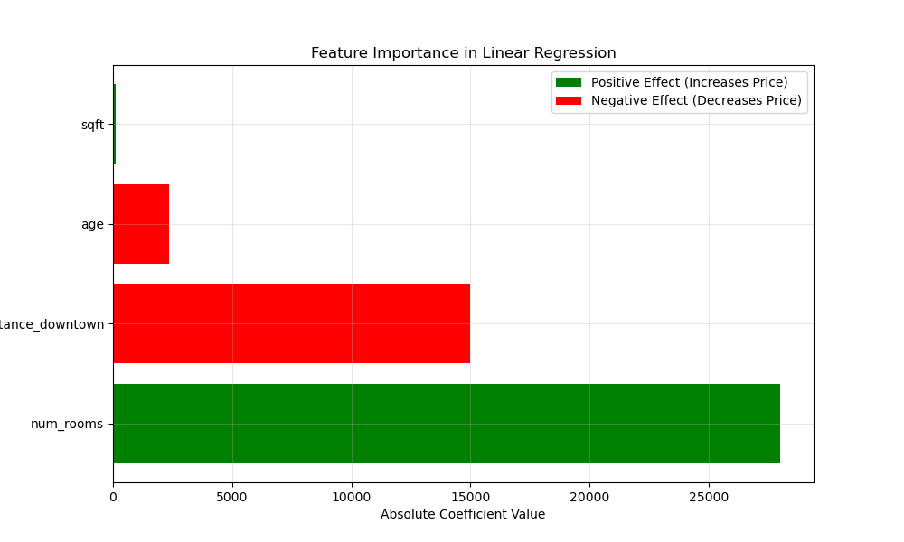

And you'll get output like:

```
Linear Regression Coefficient Interpretation:
Intercept: $99872.39 (Base price when all features are 0)
Square Footage: $118.71 - For each additional square foot, the house price increases by $118.71
Age: $-1980.84 - For each additional year of age, the house price decreases by $1980.84
Distance from Downtown: $-14938.40 - For each additional mile from downtown, the house price decreases by $14938.40
Number of Rooms: $25233.23 - For each additional room, the house price increases by $25233.23
```

#### Understanding Coefficient Scale and Units

One challenge with interpreting coefficients is that they depend on the scale of the feature. Look at how this works with standardized features:

**Standardized coefficients for comparable effect sizes**

**Purpose:** Refit linear regression on `StandardScaler`-transformed features so coefficients reflect change in the target per one SD change in each feature.

**Walkthrough:** `StandardScaler.fit_transform`; second `LinearRegression` on scaled `X`; compare with original `coef_` in a DataFrame and bar plot.

```

Standardized Coefficient Interpretation:
sqft: 32861.93 - A one standard deviation increase in sqft increases the price by $32861.93
num_rooms: 28487.79 - A one standard deviation increase in num_rooms increases the price by $28487.79
age: -16126.96 - A one standard deviation increase in age decreases the price by $16126.96
distance_downtown: -14857.72 - A one standard deviation increase in distance_downtown decreases the price by $14857.72
```

Scale Features

Apply `StandardScaler` so every feature has mean 0 and standard deviation 1, then fit a second linear model on the scaled data.

Build Comparison Table

Store both standardised and original coefficients side-by-side and sort by the absolute standardised coefficient for ranking.

Plot Standardised Bars

Reuse the same green/red colour scheme and save the bar chart to `standardized_coefficients.png` for comparison with raw coefficients.

Print Per-SD Effect

Print a sentence for each feature translating the standardised coefficient into a dollar change per one standard-deviation shift.


This shows us which features have the largest effect relative to their scale of variation, which can be more useful for comparison than the raw coefficients.

### 2. Feature Importance Visualization

For more complex models like tree-based algorithms, we can extract feature importances:

**Random Forest `feature_importances_` on housing features**

**Purpose:** Train a `RandomForestRegressor` on the same `X`, `y` and visualize the built-in Gini-based importance scores.

**Walkthrough:** `RandomForestRegressor.fit`; read `feature_importances_`; sort and horizontal bar chart with printed percentages.

```

Random Forest Feature Importance:
sqft: 0.4685 - Contributes 46.9% to the model's decisions
num_rooms: 0.3196 - Contributes 32.0% to the model's decisions
distance_downtown: 0.1074 - Contributes 10.7% to the model's decisions
age: 0.1044 - Contributes 10.4% to the model's decisions
```

Fit Random Forest

Train a 100-tree `RandomForestRegressor` on the same housing data and read the built-in Gini-based `feature_importances_`.

Plot Importances

Sort features by importance and display a horizontal bar chart saved to `feature_importance.png`.

Print Percentages

Print each feature's importance score as a percentage contribution to the model's decisions.

.png>)

### 3. Comparing Categorical Levels

When dealing with categorical features, we often need to interpret the effect of different categories:

**Dummy variables and baseline contrasts for loan amount**

**Purpose:** Encode education and marital status with `get_dummies`, fit `LinearRegression`, and plot coefficients relative to dropped baseline levels.

**Walkthrough:** `pd.get_dummies(..., drop_first=True)`; separate dummy columns from numeric; barh of category effects with a vertical line at 0.

```

Categorical Feature Interpretation:
Baseline categories: Education_High School and MaritalStatus_Single
Education_High School: $-5094.75 - This category decreases the loan amount by $5094.75 compared to the baseline
Education_Master: $4881.15 - This category increases the loan amount by $4881.15 compared to the baseline
Education_PhD: $10756.70 - This category increases the loan amount by $10756.70 compared to the baseline
MaritalStatus_Married: $11630.11 - This category increases the loan amount by $11630.11 compared to the baseline
MaritalStatus_Single: $3295.10 - This category increases the loan amount by $3295.10 compared to the baseline
```

Simulate Loan Data

Create 300 borrowers with known education and marital status effects baked in, plus numeric income and age predictors.

Dummy Encoding

Use `pd.get_dummies(..., drop_first=True)` to convert categories into binary columns, dropping one level per variable as the baseline reference.

Extract Dummy Coefficients

Separate dummy columns from numeric ones and build a coefficient DataFrame for the categorical features only.

Visualise Category Effects

Plot a centred bar chart (baseline at 0) showing each category's loan adjustment relative to the dropped reference level.

Print Contrasts

Print each category's dollar effect relative to its baseline (High School / Single), making the contrast interpretation explicit.


This approach shows the effect of each category compared to a reference category (usually the first level alphabetically).

> **🎯 Key points**
>
> * A regression coefficient is the change in the prediction per one-unit increase in that feature, holding others fixed.
> * Standardise features before comparing coefficient magnitudes, since raw coefficients depend on each feature's scale.
> * Tree-based models expose `feature_importances_`, ranking features by their contribution to the model's decisions.
> * Dummy-encoded categorical coefficients are read as a contrast against the dropped baseline level.

## Advanced Interpretation Techniques

### Video Tutorial: SHAP and LIME for Model Interpretation

_SHAP values for beginners, what they mean and their applications, by A Data Odyssey_

_An introduction to LIME for local interpretations, by A Data Odyssey_

### 1. Partial Dependence Plots (PDPs)

PDPs show how a feature affects predictions, on average, while controlling for other features:

**Partial dependence for a gradient boosting regressor**

**Purpose:** Fit `GradientBoostingRegressor` on the loan `X`, `y` and plot average partial dependence for Income and Age (plus manual line plots).

**Walkthrough:** `PartialDependenceDisplay.from_estimator` / `partial_dependence` with `kind='average'`; optional loop over features for custom matplotlib curves.

Fit GBM

Import and fit a `GradientBoostingRegressor` on the loan data, a more complex model that benefits from PDP-style post-hoc interpretation.

Built-in PDP Plot

Use `PartialDependenceDisplay.from_estimator` with `kind='average'` to render the average marginal effect of Income and Age on loan amount.

Manual PDP Loop

Call `partial_dependence` directly for finer control, extracting the value grid and average predictions to draw custom line plots per feature.

<figure>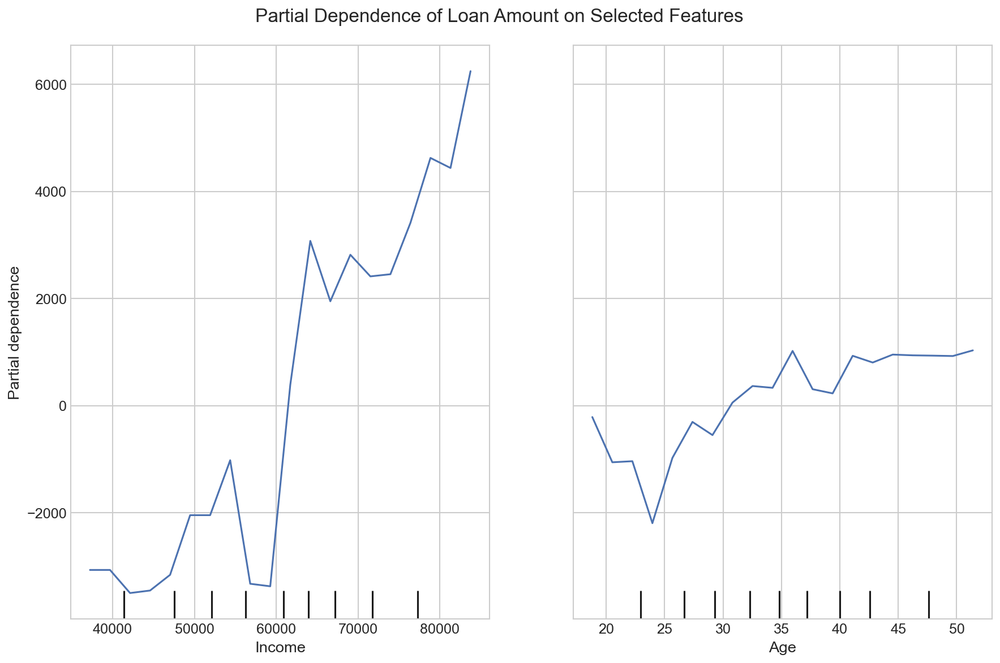<figcaption><p>Figure 5: Partial Dependence of Loan Amount on Selected Features</p></figcaption></figure>

<figure>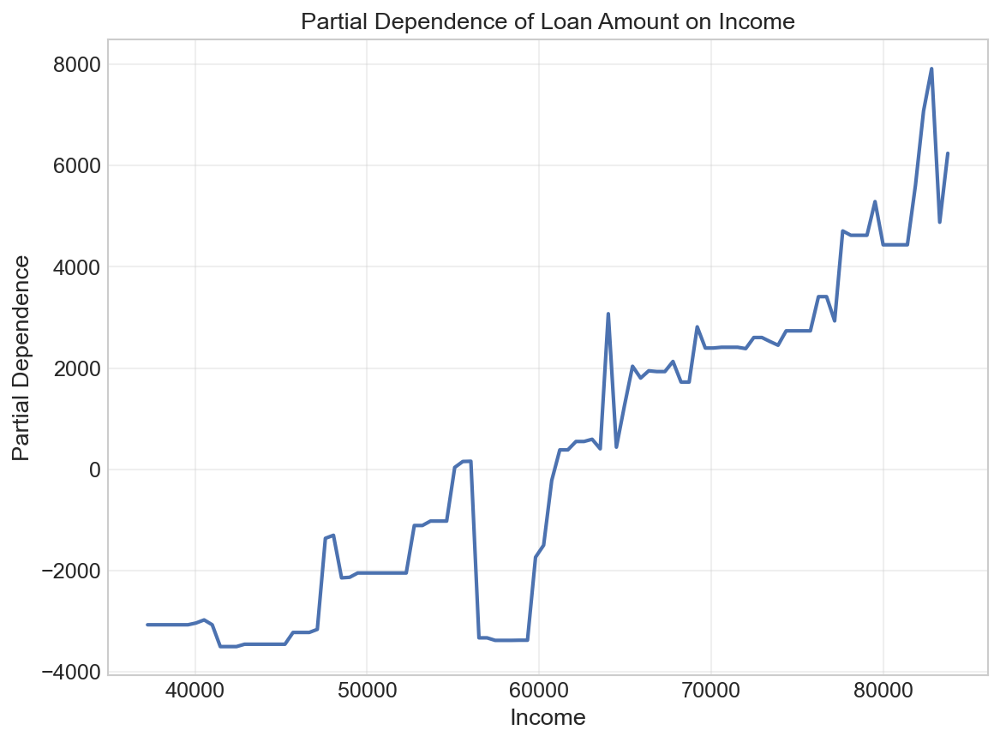<figcaption><p>Figure 6: Partial Dependence of Loan Amount on Income</p></figcaption></figure>

<figure>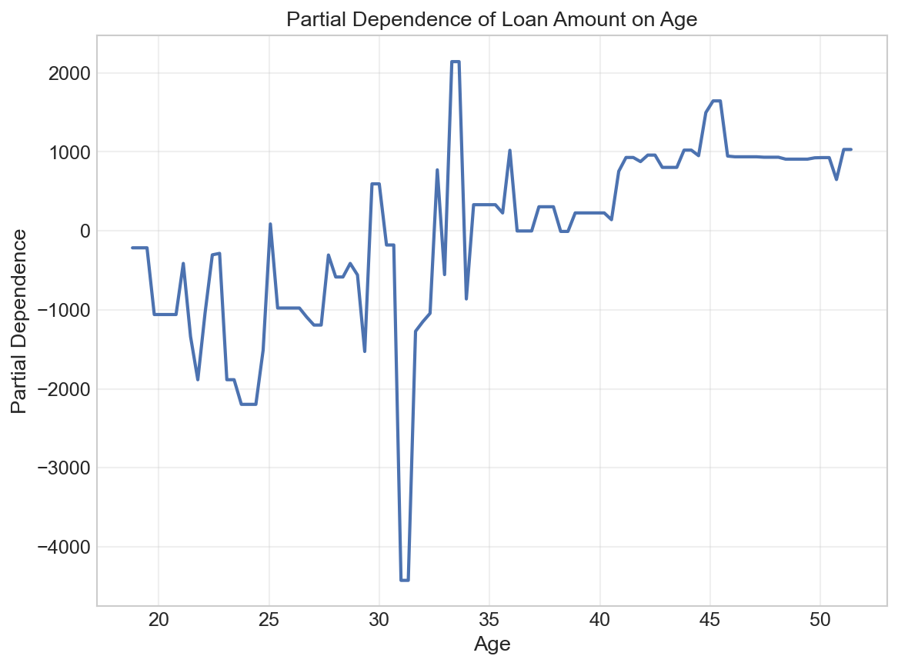<figcaption><p>Figure 7: Partial Dependence of Loan Amount on Age</p></figcaption></figure>

PDPs are powerful because they:

* Work with any model, even complex "black box" models
* Show non-linear relationships
* Display the average effect of a feature across all observations

### 2. Individual Conditional Expectation (ICE) Plots

ICE plots show how predictions change for individual observations as we vary a feature:

**ICE curves and PDP overlay on a feature grid**

**Purpose:** For a random subset of rows, sweep one feature through a grid, collect predictions, and draw per-sample blue curves with the mean PDP in red.

**Walkthrough:** Loop over `X.index`, mutate a copy of the row for each grid value, `model.predict`; `np.mean` across samples for the average curve.

Sample Subset

Select 15 random rows from X to keep the ICE plot readable, one line per sample would be too cluttered with hundreds of rows.

Build Grid

Find the observed range for the chosen feature and create 50 evenly-spaced grid points to sweep across.

Per-Sample Curves

For each sample, copy its row, swap in each grid value for the feature, and collect model predictions, forming one blue ICE curve per sample.

PDP Overlay

Average the ICE curves to draw the PDP in red, then save each feature's plot as `ice_<feature>.png`.

Run Both Features

Call the function for Income and Age to compare how individual predictions vary vs the average effect.

<figure>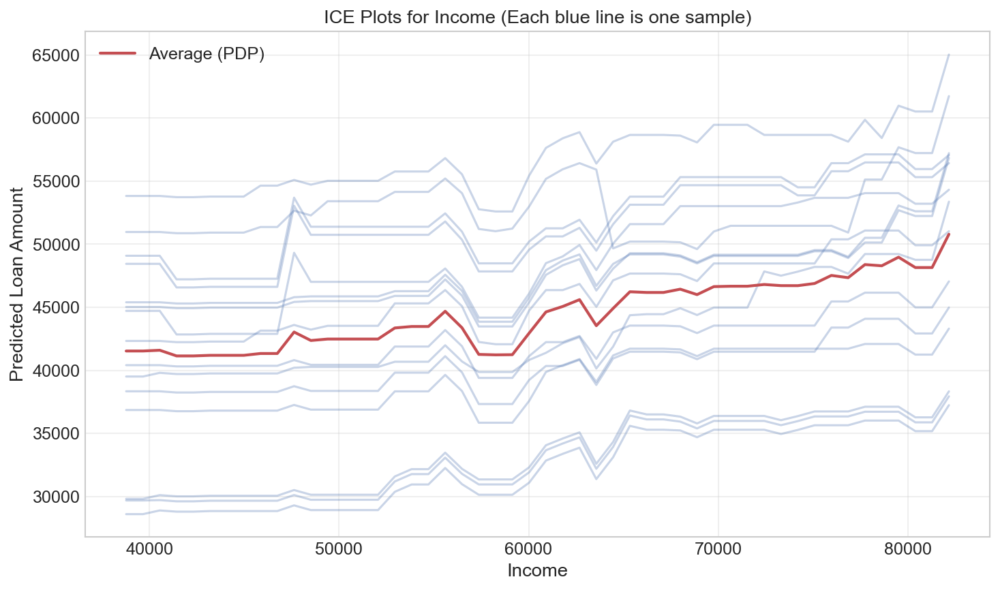<figcaption><p>Figure 8: ICE Plots for Income (Each blue line is one sample)</p></figcaption></figure>

<figure>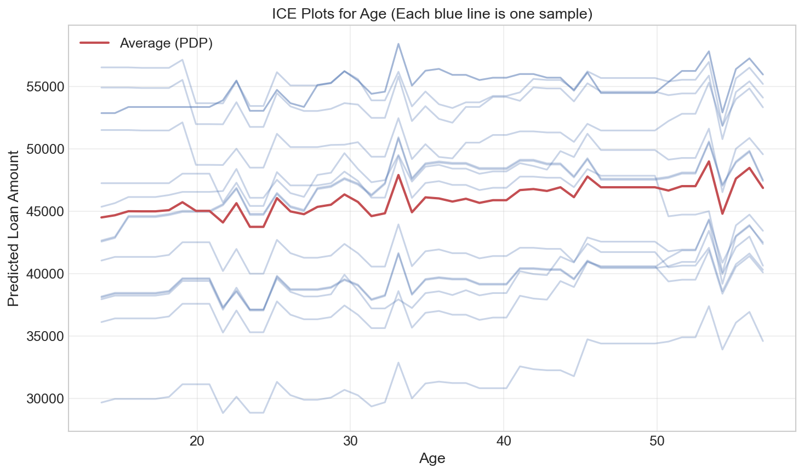<figcaption><p>Figure 9: ICE Plots for Age (Each blue line is one sample)</p></figcaption></figure>

ICE plots show:

* How predictions change for each individual observation
* Whether effects are consistent across observations or vary substantially
* Potential interactions between features (when lines aren't parallel)

### 3. SHAP (SHapley Additive exPlanations) Values

SHAP values provide a powerful framework for interpreting model predictions:

**SHAP summary, dependence, and waterfall plots**

**Purpose:** Train a small `GradientBoostingRegressor`, compute SHAP values with the Tree explainer, and save bar summary, beeswarm, dependence, and waterfall figures.

**Walkthrough:** `shap.Explainer(model, X)`; `shap_values = explainer(X)`; `summary_plot`, `dependence_plot`, `shap.plots.waterfall` (requires `pip install shap`).

Fit and Explain

Install `shap`, train a GBM on a 100-row subset, then create a Tree explainer and compute SHAP values for every sample.

Global Summary Plots

Produce a bar chart of mean absolute SHAP values (global importance) and a beeswarm plot showing the direction and magnitude per feature.

Dependence Plots

Show how each feature's SHAP value varies with the feature itself, revealing non-linearities and potential interactions automatically coloured by a second feature.

Waterfall (Local)

Explain a single prediction with a waterfall plot showing exactly how each feature pushed the output up or down from the base value.

SHAP values are especially powerful because they:

* Provide both global and local explanations
* Are consistent and theoretically sound
* Show feature interactions and non-linear effects
* Can explain any model's predictions

> **🎯 Key points**
>
> * Partial dependence plots (PDPs) show the average marginal effect of one feature across all observations, on any model.
> * ICE plots show the per-observation effect; non-parallel ICE curves reveal feature interactions.
> * SHAP values give principled, additive per-prediction attributions relative to a baseline output.
> * These post-hoc methods work on black-box models, supplying both global and local explanations.

## Model-Specific Interpretation

### 1. Linear Regression

For linear regression, the interpretation is straightforward through coefficients:

**Linear coefficients with OLS-style confidence intervals**

**Purpose:** Helper that augments coefficient table with standard errors and 95% CIs for specified numeric features and plots coefficients with or without error bars.

**Walkthrough:** MSE from residuals; `(X'X)^{-1}` for variance; `scipy.stats.t.ppf` for critical t; `plt.errorbar` when SEs exist.

Confidence Intervals

Compute OLS standard errors manually via `(X'X)^{-1}` and the residual MSE, then compute 95% CIs using `scipy.stats.t.ppf`.

Error Bar Plot

If SEs were computed, use `plt.errorbar` to show coefficients with horizontal CI whiskers; otherwise fall back to a plain colour-coded bar chart.

Run and Print

Call on the housing model and print the full coefficient table with lower and upper CI bounds for each numeric feature.

### 2. Logistic Regression

For logistic regression, we often interpret coefficients as odds ratios:

**Simulated diabetes risk: odds ratios from logistic regression**

**Purpose:** Generate binary outcomes from a known logit, fit `LogisticRegression`, and visualize `exp(coef)` on a log scale with a reference line at OR = 1.

**Walkthrough:** `LogisticRegression.fit`; `coef_[0]` and `np.exp`; horizontal barh with `plt.xscale('log')`.

```

Logistic Regression Interpretation:
         Feature  Coefficient  Odds_Ratio
3  FamilyHistory     0.965100    2.625050
1            BMI     0.111403    1.117845
0            Age     0.060541    1.062411
2        Glucose     0.031271    1.031766

Odds Ratio Interpretation:
Family History: 2.625 - Having family history of diabetes multiplies the odds by 2.63
BMI: 1.118 - For each additional BMI unit, the odds of diabetes increase by 11.8%
Age: 1.062 - For each additional year of age, the odds of diabetes increase by 6.2%
Glucose: 1.032 - For each additional unit of glucose, the odds of diabetes increase by 3.2%
```

Simulate Diabetes Data

Generate a binary outcome using a known logistic model where age, BMI, glucose, and family history each contribute specified log-odds increments.

Fit and Compute Odds Ratios

Fit `LogisticRegression`, then compute odds ratios as `exp(coef_)`-values greater than 1 increase diabetes risk, less than 1 decrease it.

Plot on Log Scale

Horizontal bar chart with a log x-axis and reference line at OR = 1 (no effect), making it easy to compare multiplicative effects across features.

Plain-English Output

Print per-feature plain-English interpretations, e.g. "each additional year of age increases odds by X%".

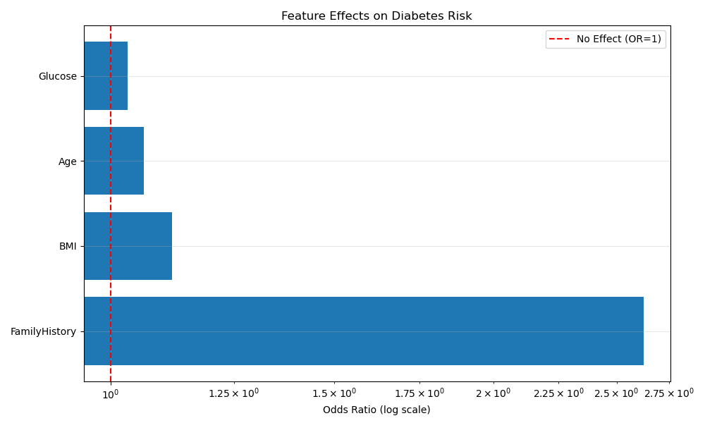

### 3. Decision Trees

Decision trees are inherently interpretable and can be visualized directly:

**Decision tree plot, importances, and printed decision path**

**Purpose:** Fit a shallow `DecisionTreeRegressor`, draw the tree with `plot_tree`, show split importances, and trace splits for one sample via `decision_path`.

**Walkthrough:** `DecisionTreeRegressor`; `plot_tree`; `tree_.feature`, `threshold`, `value`; custom `interpret_tree_prediction` walks nodes.

```
Decision path for sample 0:
Sample values: {'Income': np.float64(67450.71229516849), 'Age': np.float64(26.710049890779274), 'Education_High School': np.False_, 'Education_Master': np.True_, 'Education_PhD': np.False_, 'MaritalStatus_Married': np.True_, 'MaritalStatus_Single': np.False_}
Predicted value: 52388.22
Node 0: MaritalStatus_Married = 1.00 > 0.50 → Go to right child
Node 8: Education_High School = 0.00 <= 0.50 → Go to left child
Node 9: Education_PhD = 0.00 <= 0.50 → Go to left child
Leaf node 10: Predicted value = 52388.22
```

Fit and Visualise Tree

Fit a shallow decision tree (max depth 3) and render it with `plot_tree`-colour-filled nodes make the split rules immediately readable.

Feature Importance

Extract `feature_importances_` (Gini-based reduction) from the tree and plot a sorted bar chart saved as `tree_feature_importance.png`.

Trace Decision Path

Use `decision_path` to get the nodes visited for one sample, then walk them to print each split condition and which branch was taken.

Print Each Split

For every internal node on the path, print the feature name, sample value, threshold, and direction taken; stop and report the leaf's predicted value.

Run Example

Call the function on sample 0 to trace that house's path through the fitted tree.

```
Decision path for sample 0:
Sample values: {'Income': np.float64(67450.71229516849), 'Age': np.float64(26.710049890779274), 'Education_High School': np.False_, 'Education_Master': np.True_, 'Education_PhD': np.False_, 'MaritalStatus_Married': np.True_, 'MaritalStatus_Single': np.False_}
Predicted value: 52388.22
Node 0: MaritalStatus_Married = 1.00 > 0.50 → Go to right child
Node 8: Education_High School = 0.00 <= 0.50 → Go to left child
Node 9: Education_PhD = 0.00 <= 0.50 → Go to left child
Leaf node 10: Predicted value = 52388.22
```


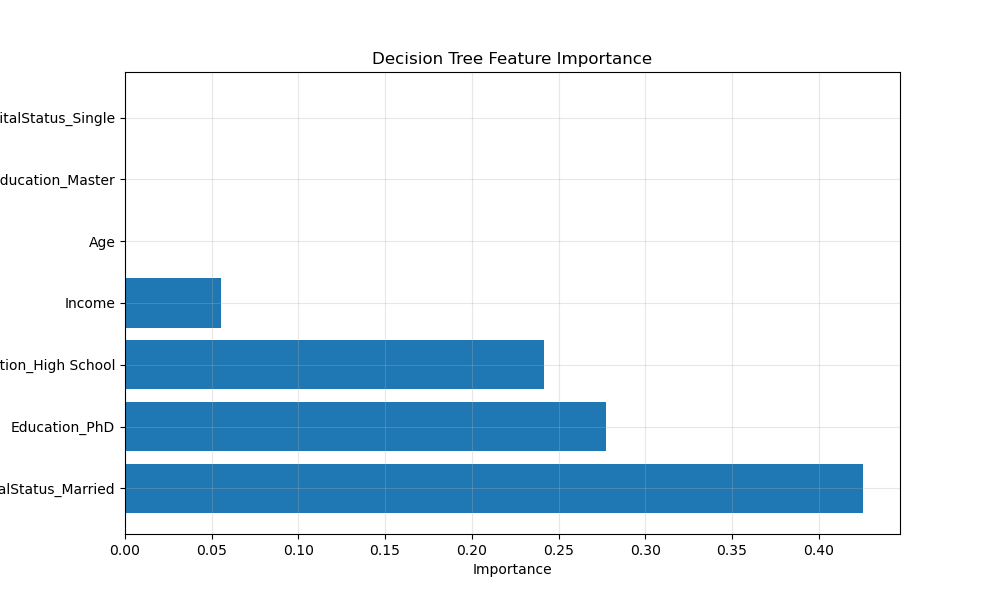

Decision trees are excellent for interpretation because:

* They explicitly show the decision rules
* You can follow the path of any prediction
* They intuitively separate data into segments
* The structure mirrors human decision-making

> **🎯 Key points**
>
> * Linear regression is interpreted directly through its coefficients, optionally with confidence intervals.
> * Logistic regression coefficients become odds ratios via `exp(coef)`: above 1 raises the odds, below 1 lowers them.
> * Decision trees are inherently interpretable, you can trace the exact split path for any prediction.
> * Each model family has its own native interpretation tool that needs no post-hoc method.

## Practical Tips for Model Interpretation

### 1. Start with a Simple Model

Before diving into complex models, start with a simpler one:

**Compare interpretability labels vs R² and MSE across estimators**

**Purpose:** Train several sklearn regressors on a train/test split of the housing data, score them, and scatter-plot R² vs MSE colored by a coarse interpretability tier.

**Walkthrough:** `train_test_split`; loop over `LinearRegression`, `Lasso`, `DecisionTreeRegressor`, `RandomForestRegressor`, `GradientBoostingRegressor`, `MLPRegressor`; `mean_squared_error`, `r2_score`; `plt.scatter` with custom legend.

```

Model Interpretability Comparison:
               Model  ...                                     Explanation
0  Linear Regression  ...      Coefficients directly show feature effects
1   Lasso Regression  ...      Coefficients directly show feature effects
2      Decision Tree  ...      Visual tree structure shows decision rules
3      Random Forest  ...       Feature importance and partial dependence
4  Gradient Boosting  ...       Feature importance and partial dependence
5     Neural Network  ...  Black box, requires post-hoc methods like SHAP

[6 rows x 5 columns]
```

Model Zoo

Define six estimators spanning the interpretability spectrum, from simple linear regression to a neural network, and split the housing data 70/30.

Score and Label

Fit each model, compute test MSE and R², and assign a coarse interpretability tier (High / Medium / Low) based on model family.

Scatter Plot

Plot R² vs MSE, colour-coding points by interpretability tier and labelling each model, to visualise the accuracy-interpretability tradeoff.

Legend and Run

Add a colour legend for the three tiers, save the figure, and call the function to print the results table.

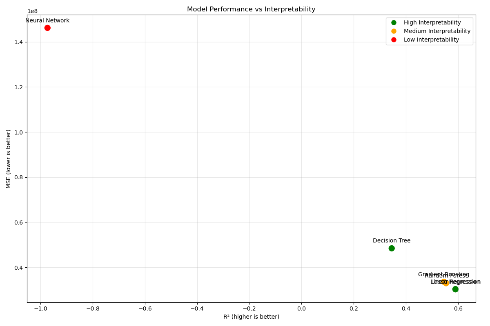

### 2. Use Multiple Interpretation Techniques

Different interpretation methods provide complementary insights:

**Built-in importance, permutation importance, and partial dependence**

**Purpose:** For one fitted model, print coefficient or `feature_importances_` rankings, run `permutation_importance`, and plot partial dependence for the top two features by permutation mean.

**Walkthrough:** `sklearn.inspection.permutation_importance`; `partial_dependence` with column index; small matplotlib loop over top features.

Built-in Importance

Check whether the model has `feature_importances_` or `coef_` and rank features accordingly, works for trees and linear models.

Permutation Importance

Run `permutation_importance` which works for any model: randomly shuffle each feature and measure the resulting drop in score across 10 repeats.

PDP for Top Features

Identify the top 2 features by permutation importance and compute partial dependence plots to show their average marginal effect on predictions.

Return and Run

Return both importance DataFrames and apply all three techniques to the random forest model for comparison.

### 3. Always Consider the Audience

Tailor your interpretations to your audience:

**Technical, business, and "homeowner" narratives from one regressor**

**Purpose:** Print regression metrics and top drivers for a technical audience, paraphrase business bullets from importances/coefficients, and show a counterfactual price for a sample house.

**Walkthrough:** `r2_score`, `mean_squared_error`, `mean_absolute_error`; branch on `feature_importances_` vs `coef_`; `model.predict` on perturbed `DataFrame` rows.

Technical Audience

Compute R², MSE, RMSE, and MAE and print the top 3 features with their importance scores or coefficients, exactly what a data scientist needs.

Business Audience

Translate the same coefficients into bullet-point business language: "each square foot increases value by $X" rather than raw numbers.

Homeowner Audience

Predict price for a sample house, then re-predict after simulated renovations (+5 years younger) and adding a room to show counterfactual value changes.

Run Example

Apply all three audience narratives to the fitted linear model on the housing dataset.

> **🎯 Key points**
>
> * Start simple: simpler models are more interpretable, and the accuracy-interpretability tradeoff is often modest.
> * Combine multiple techniques, built-in importance, permutation importance, and partial dependence, for complementary views.
> * Tailor the explanation to the audience: detailed metrics for data scientists, key drivers for executives, actionable counterfactuals for end users.

## Common Challenges in Model Interpretation

### 1. Correlation vs. Causation

Just because a feature is important in your model doesn't mean it has a causal relationship with the target:

**Confounded regression: temperature vs shorts-wearing for ice cream sales**

**Purpose:** Fit `LinearRegression` with two correlated predictors where only one is causal, print coefficients, and plot scatter/violin panels illustrating the confounding.

**Walkthrough:** `LinearRegression.fit` on `Temperature` and `Shorts_Wearing`; subplot layout with `scatter` and `violinplot`.

```

Exploring Correlation vs. Causation:
          Feature  Coefficient
0     Temperature     0.987892
1  Shorts_Wearing    -0.215225

Interpretation Challenge:
- The model shows both Temperature and Shorts_Wearing as significant predictors
- However, only Temperature directly causes Ice Cream Sales
- Shorts_Wearing is correlated with Ice Cream Sales only because both are influenced by Temperature
- A proper causal model would recognize that controlling for Temperature makes Shorts_Wearing irrelevant
```

Simulate Confounding

Temperature causally drives both ice cream sales and whether people wear shorts, shorts-wearing is a confounder, not a cause.

Fit Naive Model

Fit linear regression using both Temperature and Shorts\_Wearing as predictors; both will appear significant even though only Temperature is causal.

Three-Panel Plot

Show all three relationships side-by-side: causal Temperature→Sales, causal Temperature→Shorts, and spurious Shorts→Sales (violin plot).

Interpretation Note

Print a plain-English summary explaining why the coefficient on shorts-wearing is misleading and how a causal view would resolve it.

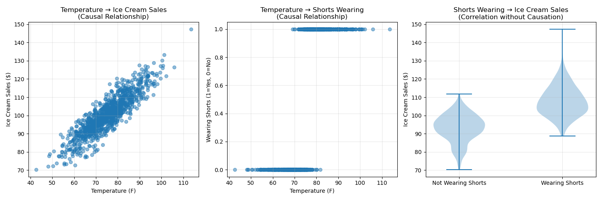

### 2. Interactions Between Features

Sometimes features interact, and their combined effect is different from their individual effects:

**Linear model with vs without an explicit interaction term**

**Purpose:** Simulate `y = x1 * x2` plus noise, compare R² and coefficients for main-effects-only vs model with `x1 * x2`, and surface/contour plot the interaction surface.

**Walkthrough:** Two `LinearRegression` fits; `r2_score`; 3D `plot_surface` and `contourf` with predictions on a grid.

Simulate Interaction

Generate target = feature1 × feature2 + noise, a pure multiplicative interaction that a main-effects-only linear model cannot capture.

Two Models

Fit one model with only Feature1 and Feature2, and a second with the explicit `Feature1_x_Feature2` product term added; compare R².

Print R² and Coefficients

Print both models' R² and coefficient tables to show how adding the interaction term dramatically improves fit and reveals the interaction coefficient.

3D Surface + Contour

Create a 50×50 feature grid, predict with the interaction model, and plot both a 3D surface and a 2D contour to visualise the saddle-shaped interaction.

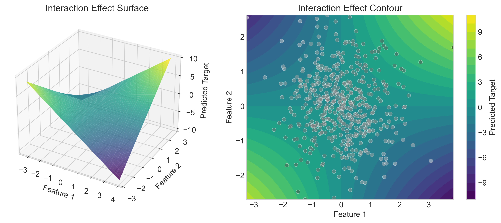

### 3. Interpreting Complex Models

As models become more complex, interpretation becomes more challenging:

**Tree depth, forest size, test R², and a subjective interpretability score**

**Purpose:** Sweep `DecisionTreeRegressor` depths and two `RandomForestRegressor` configs, record train/test R² and node counts, and scatter complexity vs test R² colored by interpretability.

**Walkthrough:** `train_test_split`; `tree_.node_count`; sum nodes over forest estimators; `plt.scatter` with `RdYlGn` colormap and annotations.

Build Model Range

Sweep tree depths 1, 2, 3, 5, 10, and unlimited plus two random forest sizes to cover the full complexity spectrum.

Measure Complexity

Use `tree_.node_count` for individual trees and sum it across all estimators for forests as a structural complexity proxy.

Score Interpretability

Assign a subjective 1-10 interpretability score based on model family and depth; deeper / larger ensembles score lower.

3-Axis Scatter

Plot complexity (log x) vs test R² (y) with colour showing interpretability score using the RdYlGn colourmap, green is interpretable, red is opaque.

Run and Print

Call the function and print the full results DataFrame for all eight model configurations.

> **🎯 Key points**
>
> * An important feature is not necessarily a causal one, confounders can make spurious predictors look significant.
> * Features can interact; their combined effect may differ from the sum of individual effects, so add interaction terms when needed.
> * The more complex the model, the harder it is to interpret, interpretability typically falls as accuracy and complexity rise.

## Practice Exercise

Try applying these model interpretation techniques to your own dataset:

1. Start with a simple model like linear or logistic regression
2. Extract and interpret the coefficients
3. Build a more complex model like a random forest
4. Use feature importance, partial dependence plots, and SHAP values
5. Compare the insights you gain from different models and techniques

## Next steps

* Try the [module 4 assignments](../assignments/module-assignment.md) to consolidate inference, testing, relationships, and modelling.

## Gotchas

* **Comparing raw coefficients across features with different scales**: A coefficient of 120 for square footage and 25,000 for number of rooms does not mean rooms matter more; square footage is measured in single units while rooms are counted in small integers. Standardise features before comparing coefficient magnitudes.
* **Interpreting linear regression coefficients causally**: A positive coefficient for `distance_downtown` does not prove that moving farther from downtown raises house prices; it only describes the observed association given the other variables in the model. Omitting a correlated confounder (e.g., lot size) can reverse or inflate any coefficient.
* **Treating feature importance from a bar chart as a ranking of causal drivers**: Permutation importance and coefficient magnitude both measure association within the fitted model, not independent causal effects. Features that are correlated with each other will split importance arbitrarily between them.
* **Computing SHAP values and ignoring the baseline**: SHAP values are additive contributions _relative to the expected model output_ (the base value). A positive SHAP of +5,000 means this observation pushes price $5,000 above the average prediction, not above zero or above the intercept.
* **Using partial dependence plots when features are strongly correlated**: PDPs average predictions over the marginal distribution of other features, which can create unrealistic feature combinations (e.g., very high income with very young age). Use individual conditional expectation (ICE) plots or check feature correlation before trusting a PDP.
* **Assuming a more complex model always gives more trustworthy SHAP explanations**: SHAP values faithfully explain whatever the model has learned, including its errors and biases. If the model itself overfits or captures a spurious pattern, the SHAP explanation will accurately describe a wrong model.

## Additional Resources

* [Interpretable Machine Learning (Book)](https://christophm.github.io/interpretable-ml-book/)
* [SHAP Documentation](https://shap.readthedocs.io/)
* [Scikit-learn Inspection Module](https://scikit-learn.org/stable/modules/classes.html#module-sklearn.inspection)
* [Partial Dependence Plots Tutorial](https://scikit-learn.org/stable/modules/partial_dependence.html)
* [The Elements of Statistical Learning (Book)](https://web.stanford.edu/~hastie/ElemStatLearn/)
