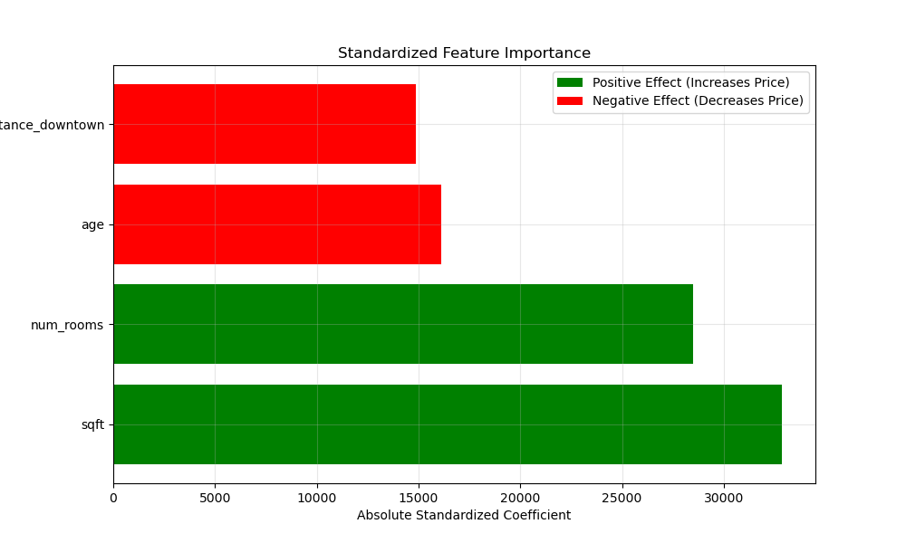
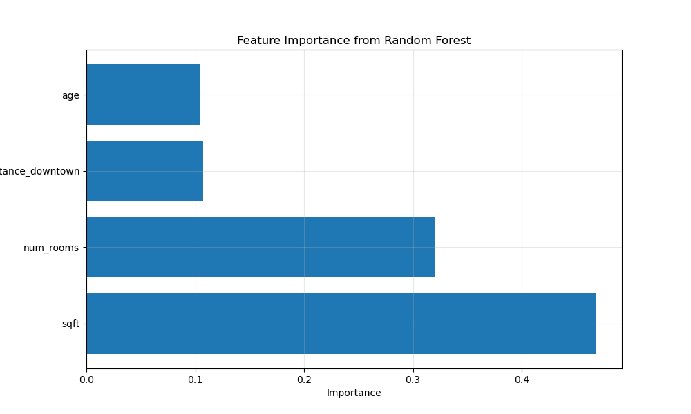
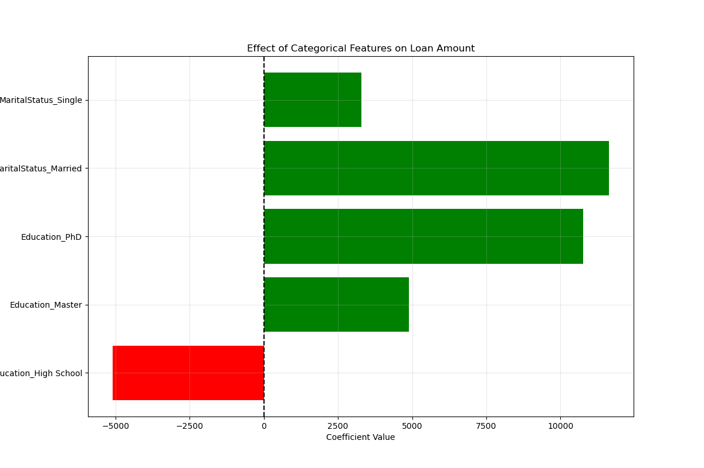
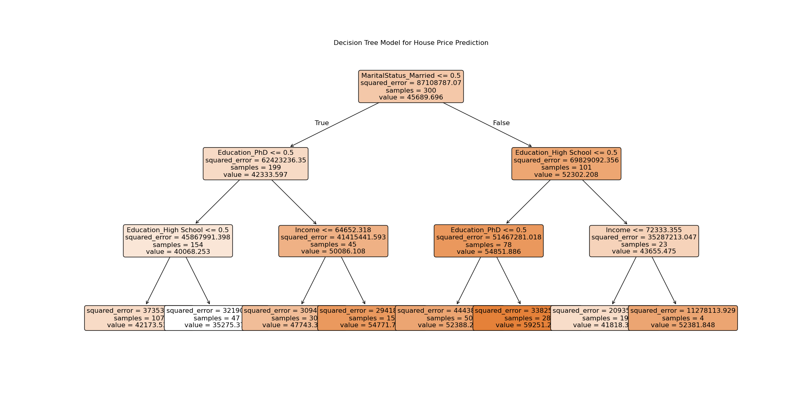

# Model Interpretation

**After this lesson:** you can explain what a fitted model is doing in terms a stakeholder can act on — coefficients, partial dependence, permutation importance, and SHAP-style attributions.

## TLDR

- **Why it matters:** an accurate model no one can explain won't be trusted — especially in medical, financial, or legal decisions.
- **Linear regression coefficients:** `β` = change in ŷ per 1-unit increase in that feature, all others held fixed. Always interpret in the feature's original units.
- **Standardised coefficients:** refit on `StandardScaler`-transformed features so magnitudes are comparable across features regardless of scale.
- **Logistic regression odds ratios:** `exp(β)` = how each feature multiplies the *odds* of the positive class. OR > 1 raises probability; OR < 1 lowers it.
- **Permutation importance:** shuffle one feature at a time on the test set and measure the accuracy drop — model-agnostic and reflects true predictive value.
- **Partial dependence plots (PDP):** show the average marginal effect of one feature across all observations — works on any model, including black boxes.
- **SHAP values:** principled per-prediction attributions — each feature gets credit for pushing a prediction up or down from the baseline. Requires `pip install shap`.
- **Interpretability spectrum:** linear/logistic > decision tree > random forest > gradient boosting > neural network. More powerful ≠ more explainable.

## Overview

Accuracy on a leaderboard is not enough for high-stakes use: teams need **consistent stories** about drivers of predictions—coefficients where the model is linear, marginal and partial plots where it is not, and modern attribution tools when features interact. This lesson sits last so you interpret models **after** you know how they were fit, selected, and possibly regularized.

## Why this matters

- Stakeholders need **why** a model behaves as it does, not only accuracy.
- You will connect coefficients, partial dependence, and SHAP-style explanations to decisions.

## Prerequisites

- [Regularization](./regularization.md) and prior regression lessons for coefficient meaning.
- [Logistic regression](./logistic-regression.md) if you interpret classification models.

> **Note:** Interpretation tools assume the model and data are adequate; diagnostics from module 4.3 still apply.

## Introduction

Model interpretation is the process of understanding and explaining how your statistical model makes predictions. It's a crucial skill for data scientists and analysts because even the most accurate model is of limited value if you can't explain how it works or why it makes certain predictions.

### Video Tutorial: Introduction to Model Interpretation

<div class="video-embed">
<iframe width="560" height="315" src="https://www.youtube.com/embed/VB9uV-xFgtU" frameborder="0" allow="accelerometer; autoplay; clipboard-write; encrypted-media; gyroscope; picture-in-picture" allowfullscreen></iframe>
</div>

*SHAP Values Explained by StatQuest with Josh Starmer*

<div class="video-embed">
<iframe width="560" height="315" src="https://www.youtube.com/embed/MREiHgHgl0k" frameborder="0" allow="accelerometer; autoplay; clipboard-write; encrypted-media; gyroscope; picture-in-picture" allowfullscreen></iframe>
</div>

*LIME: Explaining Machine Learning Models by StatQuest with Josh Starmer*

### Why Interpretation Matters

Imagine you've built a model to predict loan approvals. Without proper interpretation you can't explain decisions to applicants, miss patterns or biases, lose stakeholder trust, struggle to fix errors, and risk violating transparency regulations.

Model interpretation turns "black box" predictions into actionable insights by:

1. **Building trust** - Helping users understand why they should believe the predictions
2. **Ensuring fairness** - Identifying and addressing biases in model decisions
3. **Enabling improvements** - Showing where and why models make errors
4. **Providing insights** - Revealing important patterns in the data
5. **Meeting regulations** - Satisfying legal requirements for transparency (e.g., GDPR's "right to explanation")

### Real-world Examples

- **Credit Scoring** — Without interpretation a bank can deny a loan but not say why; with it, the bank can point to the high debt-to-income ratio and advise what to improve.
- **Medical Diagnosis** — Without interpretation a model flags high heart-disease risk with no reason; with it, the doctor sees that elevated blood pressure and family history drove the prediction, enabling targeted treatment.
- **Customer Churn** — Without interpretation a company knows *who* will leave but not *why*; with it, they spot price sensitivity and service issues and can act to retain customers.

> **🎯 Key points**
>
> - Model interpretation explains *how* and *why* a model makes its predictions, not just how accurate it is.
> - Interpretation builds stakeholder trust, exposes bias, guides improvements, and satisfies regulations like GDPR's "right to explanation".
> - An unexplainable model has limited value in high-stakes settings such as lending, medicine, and customer retention.

## Understanding Model Outputs

### 1. Coefficient Interpretation

For linear and logistic regression models, the coefficients provide direct insight into how each feature affects the prediction:

**Linear regression coefficients on simulated housing data**

**Purpose:** Fit `LinearRegression` on synthetic housing features, plot signed coefficient magnitudes, and print per-feature dollar interpretations.

**Walkthrough:** `LinearRegression.fit`; use `coef_` and `intercept_`; horizontal bar chart with green/red by sign; `savefig` for the lesson figure.

<div class="code-explainer" data-code-explainer>
<div class="code-explainer__code">


import numpy as np
import matplotlib.pyplot as plt
import pandas as pd
from sklearn.linear_model import LinearRegression, LogisticRegression
from sklearn.model_selection import train_test_split
from sklearn.preprocessing import StandardScaler
import seaborn as sns

# Set a random seed for reproducibility
np.random.seed(42)

# Create example dataset for housing prices
n_samples = 200
sqft = np.random.normal(1500, 300, n_samples)  # Square footage
age = np.random.normal(15, 7, n_samples)       # Home age in years
distance_downtown = np.random.normal(3, 1, n_samples)  # Miles from downtown
num_rooms = np.random.normal(3, 1, n_samples)  # Number of rooms

# Generate house prices with specific coefficient relationships
price = (
    100000 +                     # Base price
    120 * sqft +                 # Price increases with size
    -2000 * age +                # Price decreases with age
    -15000 * distance_downtown + # Price decreases with distance from downtown
    25000 * num_rooms +          # Price increases with rooms
    np.random.normal(0, 20000, n_samples)  # Random noise
)

# Combine into a DataFrame
housing_df = pd.DataFrame({
    'sqft': sqft,
    'age': age,
    'distance_downtown': distance_downtown,
    'num_rooms': num_rooms,
    'price': price
})

# Split data into features and target
X = housing_df.drop('price', axis=1)
y = housing_df['price']

# Train a linear regression model
model = LinearRegression()
model.fit(X, y)

# Create a DataFrame with features and coefficients
feature_importance = pd.DataFrame({
    'Feature': X.columns,
    'Coefficient': model.coef_
})

# Sort by absolute value of coefficient
feature_importance['Absolute_Coefficient'] = np.abs(feature_importance['Coefficient'])
feature_importance = feature_importance.sort_values('Absolute_Coefficient', ascending=False)

# Plot coefficients
plt.figure(figsize=(10, 6))
colors = ['green' if c > 0 else 'red' for c in feature_importance['Coefficient']]
plt.barh(feature_importance['Feature'], feature_importance['Absolute_Coefficient'], color=colors)
plt.xlabel('Absolute Coefficient Value')
plt.title('Feature Importance in Linear Regression')
plt.grid(True, alpha=0.3)

# Add a legend for the colors
from matplotlib.patches import Patch
legend_elements = [
    Patch(facecolor='green', label='Positive Effect (Increases Price)'),
    Patch(facecolor='red', label='Negative Effect (Decreases Price)')
]
plt.legend(handles=legend_elements)
plt.savefig('coefficient_interpretation.png')
plt.show()

# Print the coefficients with formatted interpretation
print("\nLinear Regression Coefficient Interpretation:")
print(f"Intercept: ${model.intercept_:.2f} (Base price when all features are 0)")

for feature, coef in zip(X.columns, model.coef_):
    if feature == 'sqft':
        print(f"Square Footage: ${coef:.2f} - For each additional square foot, the house price increases by ${coef:.2f}")
    elif feature == 'age':
        print(f"Age: ${coef:.2f} - For each additional year of age, the house price decreases by ${abs(coef):.2f}")
    elif feature == 'distance_downtown':
        print(f"Distance from Downtown: ${coef:.2f} - For each additional mile from downtown, the house price decreases by ${abs(coef):.2f}")
    elif feature == 'num_rooms':
        print(f"Number of Rooms: ${coef:.2f} - For each additional room, the house price increases by ${coef:.2f}")


```

Linear Regression Coefficient Interpretation:
Intercept: $101809.90 (Base price when all features are 0)
Square Footage: $117.95 - For each additional square foot, the house price increases by $117.95
Age: $-2340.04 - For each additional year of age, the house price decreases by $2340.04
Distance from Downtown: $-14984.28 - For each additional mile from downtown, the house price decreases by $14984.28
Number of Rooms: $28010.98 - For each additional room, the house price increases by $28010.98
```

</div>
<aside class="code-explainer__callouts" aria-label="Code walkthrough">
  <div class="code-callout" data-lines="1-7" data-tint="1">
    <div class="code-callout__meta">
      <span class="code-callout__lines"></span>
      <span class="code-callout__title">Imports</span>
    </div>
    <div class="code-callout__body">
      <p>Load NumPy, Matplotlib, pandas, scikit-learn models, and seaborn for this lesson's examples.</p>
    </div>
  </div>
  <div class="code-callout" data-lines="14-36" data-tint="2">
    <div class="code-callout__meta">
      <span class="code-callout__lines"></span>
      <span class="code-callout__title">Generate Housing Data</span>
    </div>
    <div class="code-callout__body">
      <p>Simulate 200 houses with known price drivers: size adds $120/sqft, each year of age subtracts $2 000, downtown distance costs $15 000/mile, and each room adds $25 000.</p>
    </div>
  </div>
  <div class="code-callout" data-lines="39-54" data-tint="3">
    <div class="code-callout__meta">
      <span class="code-callout__lines"></span>
      <span class="code-callout__title">Fit and Rank</span>
    </div>
    <div class="code-callout__body">
      <p>Fit <code>LinearRegression</code>, extract <code>coef_</code> into a DataFrame, and sort by absolute magnitude to find the most influential features.</p>
    </div>
  </div>
  <div class="code-callout" data-lines="58-59" data-tint="4">
    <div class="code-callout__meta">
      <span class="code-callout__lines"></span>
      <span class="code-callout__title">Visualise Coefficients</span>
    </div>
    <div class="code-callout__body">
      <p>Horizontal bar chart coloured green (positive) / red (negative) to show which features raise or lower price, then save to <code>coefficient_interpretation.png</code>.</p>
    </div>
  </div>
  <div class="code-callout" data-lines="78-86" data-tint="1">
    <div class="code-callout__meta">
      <span class="code-callout__lines"></span>
      <span class="code-callout__title">Print Interpretations</span>
    </div>
    <div class="code-callout__body">
      <p>Loop through each feature and print a plain-English sentence explaining what each coefficient means in dollar terms.</p>
    </div>
  </div>
</aside>
</div>


And you'll get output like:

```
Linear Regression Coefficient Interpretation:
Intercept: $99872.39 (Base price when all features are 0)
Square Footage: $118.71 - For each additional square foot, the house price increases by $118.71
Age: $-1980.84 - For each additional year of age, the house price decreases by $1980.84
Distance from Downtown: $-14938.40 - For each additional mile from downtown, the house price decreases by $14938.40
Number of Rooms: $25233.23 - For each additional room, the house price increases by $25233.23
```

#### Understanding Coefficient Scale and Units

One challenge with interpreting coefficients is that they depend on the scale of the feature. Let's see how this works with standardized features:

**Standardized coefficients for comparable effect sizes**

**Purpose:** Refit linear regression on `StandardScaler`-transformed features so coefficients reflect change in the target per one SD change in each feature.

**Walkthrough:** `StandardScaler.fit_transform`; second `LinearRegression` on scaled `X`; compare with original `coef_` in a DataFrame and bar plot.

<div class="code-explainer" data-code-explainer>
<div class="code-explainer__code">


# Create a copy of the data and standardize features
X_std = X.copy()
scaler = StandardScaler()
X_std_scaled = scaler.fit_transform(X_std)
X_std_scaled = pd.DataFrame(X_std_scaled, columns=X.columns)

# Train a new model on standardized features
std_model = LinearRegression()
std_model.fit(X_std_scaled, y)

# Create DataFrame for standardized coefficients
std_feature_importance = pd.DataFrame({
    'Feature': X.columns,
    'Standardized_Coefficient': std_model.coef_,
    'Original_Coefficient': model.coef_  # From the original model
})

# Sort by absolute value of standardized coefficient
std_feature_importance['Abs_Std_Coefficient'] = np.abs(std_feature_importance['Standardized_Coefficient'])
std_feature_importance = std_feature_importance.sort_values('Abs_Std_Coefficient', ascending=False)

# Plot standardized coefficients
plt.figure(figsize=(10, 6))
colors = ['green' if c > 0 else 'red' for c in std_feature_importance['Standardized_Coefficient']]
plt.barh(std_feature_importance['Feature'], std_feature_importance['Abs_Std_Coefficient'], color=colors)
plt.xlabel('Absolute Standardized Coefficient')
plt.title('Standardized Feature Importance')
plt.grid(True, alpha=0.3)
plt.legend(handles=legend_elements)
plt.savefig('standardized_coefficients.png')
plt.show()

print("\nStandardized Coefficient Interpretation:")
for feature, std_coef in zip(std_feature_importance['Feature'], std_feature_importance['Standardized_Coefficient']):
    effect = "increases" if std_coef > 0 else "decreases"
    print(f"{feature}: {std_coef:.2f} - A one standard deviation increase in {feature} {effect} the price by ${abs(std_coef):.2f}")


```

Standardized Coefficient Interpretation:
sqft: 32861.93 - A one standard deviation increase in sqft increases the price by $32861.93
num_rooms: 28487.79 - A one standard deviation increase in num_rooms increases the price by $28487.79
age: -16126.96 - A one standard deviation increase in age decreases the price by $16126.96
distance_downtown: -14857.72 - A one standard deviation increase in distance_downtown decreases the price by $14857.72
```

</div>
<aside class="code-explainer__callouts" aria-label="Code walkthrough">
  <div class="code-callout" data-lines="2-9" data-tint="1">
    <div class="code-callout__meta">
      <span class="code-callout__lines"></span>
      <span class="code-callout__title">Scale Features</span>
    </div>
    <div class="code-callout__body">
      <p>Apply <code>StandardScaler</code> so every feature has mean 0 and standard deviation 1, then fit a second linear model on the scaled data.</p>
    </div>
  </div>
  <div class="code-callout" data-lines="12-20" data-tint="2">
    <div class="code-callout__meta">
      <span class="code-callout__lines"></span>
      <span class="code-callout__title">Build Comparison Table</span>
    </div>
    <div class="code-callout__body">
      <p>Store both standardised and original coefficients side-by-side and sort by the absolute standardised coefficient for ranking.</p>
    </div>
  </div>
  <div class="code-callout" data-lines="24-25" data-tint="3">
    <div class="code-callout__meta">
      <span class="code-callout__lines"></span>
      <span class="code-callout__title">Plot Standardised Bars</span>
    </div>
    <div class="code-callout__body">
      <p>Reuse the same green/red colour scheme and save the bar chart to <code>standardized_coefficients.png</code> for comparison with raw coefficients.</p>
    </div>
  </div>
  <div class="code-callout" data-lines="33-36" data-tint="4">
    <div class="code-callout__meta">
      <span class="code-callout__lines"></span>
      <span class="code-callout__title">Print Per-SD Effect</span>
    </div>
    <div class="code-callout__body">
      <p>Print a sentence for each feature translating the standardised coefficient into a dollar change per one standard-deviation shift.</p>
    </div>
  </div>
</aside>
</div>



This shows us which features have the largest effect relative to their scale of variation, which can be more useful for comparison than the raw coefficients.

### 2. Feature Importance Visualization

For more complex models like tree-based algorithms, we can extract feature importances:

**Random Forest `feature_importances_` on housing features**

**Purpose:** Train a `RandomForestRegressor` on the same `X`, `y` and visualize the built-in Gini-based importance scores.

**Walkthrough:** `RandomForestRegressor.fit`; read `feature_importances_`; sort and horizontal bar chart with printed percentages.

<div class="code-explainer" data-code-explainer>
<div class="code-explainer__code">


from sklearn.ensemble import RandomForestRegressor

# Train a random forest model on the same housing data
rf_model = RandomForestRegressor(n_estimators=100, random_state=42)
rf_model.fit(X, y)

# Create a DataFrame with features and importances
rf_importance = pd.DataFrame({
    'Feature': X.columns,
    'Importance': rf_model.feature_importances_
})
rf_importance = rf_importance.sort_values('Importance', ascending=False)

# Plot feature importance
plt.figure(figsize=(10, 6))
plt.barh(rf_importance['Feature'], rf_importance['Importance'])
plt.xlabel('Importance')
plt.title('Feature Importance from Random Forest')
plt.grid(True, alpha=0.3)
plt.savefig('feature_importance.png')
plt.show()

print("\nRandom Forest Feature Importance:")
for feature, importance in zip(rf_importance['Feature'], rf_importance['Importance']):
    print(f"{feature}: {importance:.4f} - Contributes {importance*100:.1f}% to the model's decisions")


```

Random Forest Feature Importance:
sqft: 0.4685 - Contributes 46.9% to the model's decisions
num_rooms: 0.3196 - Contributes 32.0% to the model's decisions
distance_downtown: 0.1074 - Contributes 10.7% to the model's decisions
age: 0.1044 - Contributes 10.4% to the model's decisions
```

</div>
<aside class="code-explainer__callouts" aria-label="Code walkthrough">
  <div class="code-callout" data-lines="4-5" data-tint="1">
    <div class="code-callout__meta">
      <span class="code-callout__lines"></span>
      <span class="code-callout__title">Fit Random Forest</span>
    </div>
    <div class="code-callout__body">
      <p>Train a 100-tree <code>RandomForestRegressor</code> on the same housing data and read the built-in Gini-based <code>feature_importances_</code>.</p>
    </div>
  </div>
  <div class="code-callout" data-lines="8-12" data-tint="2">
    <div class="code-callout__meta">
      <span class="code-callout__lines"></span>
      <span class="code-callout__title">Plot Importances</span>
    </div>
    <div class="code-callout__body">
      <p>Sort features by importance and display a horizontal bar chart saved to <code>feature_importance.png</code>.</p>
    </div>
  </div>
  <div class="code-callout" data-lines="23-25" data-tint="3">
    <div class="code-callout__meta">
      <span class="code-callout__lines"></span>
      <span class="code-callout__title">Print Percentages</span>
    </div>
    <div class="code-callout__body">
      <p>Print each feature's importance score as a percentage contribution to the model's decisions.</p>
    </div>
  </div>
</aside>
</div>



### 3. Comparing Categorical Levels

When dealing with categorical features, we often need to interpret the effect of different categories:

**Dummy variables and baseline contrasts for loan amount**

**Purpose:** Encode education and marital status with `get_dummies`, fit `LinearRegression`, and plot coefficients relative to dropped baseline levels.

**Walkthrough:** `pd.get_dummies(..., drop_first=True)`; separate dummy columns from numeric; barh of category effects with a vertical line at 0.

<div class="code-explainer" data-code-explainer>
<div class="code-explainer__code">


# Create a dataset with categorical features
n_samples = 300
np.random.seed(42)

# Create numerical features
income = np.random.normal(60000, 15000, n_samples)
age = np.random.normal(35, 10, n_samples)

# Create categorical features
education_levels = ['High School', 'Bachelor', 'Master', 'PhD']
education = np.random.choice(education_levels, n_samples)

marital_status = ['Single', 'Married', 'Divorced']
marital = np.random.choice(marital_status, n_samples)

# Generate target variable (loan amount)
base_amount = 20000
# Effect for education (increasing with level)
education_effect = {
    'High School': 0,
    'Bachelor': 5000,
    'Master': 10000,
    'PhD': 15000
}
# Effect for marital status
marital_effect = {
    'Single': 0,
    'Married': 8000,
    'Divorced': -3000
}

# Calculate loan amount
loan_amount = base_amount + 0.2 * income + 100 * age
# Add categorical effects
for i in range(n_samples):
    loan_amount[i] += education_effect[education[i]] + marital_effect[marital[i]]
# Add noise
loan_amount += np.random.normal(0, 5000, n_samples)

# Create DataFrame
loan_df = pd.DataFrame({
    'Income': income,
    'Age': age,
    'Education': education,
    'MaritalStatus': marital,
    'LoanAmount': loan_amount
})

# Convert categorical variables to dummy variables
loan_data = pd.get_dummies(loan_df, columns=['Education', 'MaritalStatus'], drop_first=True)

# Split data
X = loan_data.drop('LoanAmount', axis=1)
y = loan_data['LoanAmount']

# Train model
cat_model = LinearRegression()
cat_model.fit(X, y)

# Get all feature names including dummy variables
all_features = X.columns

# Create DataFrame with coefficients
cat_coef = pd.DataFrame({
    'Feature': all_features,
    'Coefficient': cat_model.coef_
})

# Separate numerical and categorical features
num_features = ['Income', 'Age']
cat_features = [f for f in all_features if f not in num_features]

# Plot categorical coefficients
plt.figure(figsize=(12, 8))
colors = ['green' if c > 0 else 'red' for c in cat_coef[cat_coef['Feature'].isin(cat_features)]['Coefficient']]
plt.barh(
    cat_coef[cat_coef['Feature'].isin(cat_features)]['Feature'],
    cat_coef[cat_coef['Feature'].isin(cat_features)]['Coefficient'],
    color=colors
)
plt.axvline(x=0, color='black', linestyle='--')
plt.xlabel('Coefficient Value')
plt.title('Effect of Categorical Features on Loan Amount')
plt.grid(True, alpha=0.3)
plt.savefig('categorical_effects.png')
plt.show()

print("\nCategorical Feature Interpretation:")
print(f"Baseline categories: Education_High School and MaritalStatus_Single")
for feature, coef in zip(cat_coef[cat_coef['Feature'].isin(cat_features)]['Feature'],
                        cat_coef[cat_coef['Feature'].isin(cat_features)]['Coefficient']):
    effect = "increases" if coef > 0 else "decreases"
    print(f"{feature}: ${coef:.2f} - This category {effect} the loan amount by ${abs(coef):.2f} compared to the baseline")


```

Categorical Feature Interpretation:
Baseline categories: Education_High School and MaritalStatus_Single
Education_High School: $-5094.75 - This category decreases the loan amount by $5094.75 compared to the baseline
Education_Master: $4881.15 - This category increases the loan amount by $4881.15 compared to the baseline
Education_PhD: $10756.70 - This category increases the loan amount by $10756.70 compared to the baseline
MaritalStatus_Married: $11630.11 - This category increases the loan amount by $11630.11 compared to the baseline
MaritalStatus_Single: $3295.10 - This category increases the loan amount by $3295.10 compared to the baseline
```

</div>
<aside class="code-explainer__callouts" aria-label="Code walkthrough">
  <div class="code-callout" data-lines="6-47" data-tint="1">
    <div class="code-callout__meta">
      <span class="code-callout__lines"></span>
      <span class="code-callout__title">Simulate Loan Data</span>
    </div>
    <div class="code-callout__body">
      <p>Create 300 borrowers with known education and marital status effects baked in, plus numeric income and age predictors.</p>
    </div>
  </div>
  <div class="code-callout" data-lines="50-50" data-tint="2">
    <div class="code-callout__meta">
      <span class="code-callout__lines"></span>
      <span class="code-callout__title">Dummy Encoding</span>
    </div>
    <div class="code-callout__body">
      <p>Use <code>pd.get_dummies(..., drop_first=True)</code> to convert categories into binary columns, dropping one level per variable as the baseline reference.</p>
    </div>
  </div>
  <div class="code-callout" data-lines="64-71" data-tint="3">
    <div class="code-callout__meta">
      <span class="code-callout__lines"></span>
      <span class="code-callout__title">Extract Dummy Coefficients</span>
    </div>
    <div class="code-callout__body">
      <p>Separate dummy columns from numeric ones and build a coefficient DataFrame for the categorical features only.</p>
    </div>
  </div>
  <div class="code-callout" data-lines="75-81" data-tint="4">
    <div class="code-callout__meta">
      <span class="code-callout__lines"></span>
      <span class="code-callout__title">Visualise Category Effects</span>
    </div>
    <div class="code-callout__body">
      <p>Plot a centred bar chart (baseline at 0) showing each category's loan adjustment relative to the dropped reference level.</p>
    </div>
  </div>
  <div class="code-callout" data-lines="88-93" data-tint="1">
    <div class="code-callout__meta">
      <span class="code-callout__lines"></span>
      <span class="code-callout__title">Print Contrasts</span>
    </div>
    <div class="code-callout__body">
      <p>Print each category's dollar effect relative to its baseline (High School / Single), making the contrast interpretation explicit.</p>
    </div>
  </div>
</aside>
</div>



This approach shows the effect of each category compared to a reference category (usually the first level alphabetically).

> **🎯 Key points**
>
> - A regression coefficient is the change in the prediction per one-unit increase in that feature, holding others fixed.
> - Standardise features before comparing coefficient magnitudes, since raw coefficients depend on each feature's scale.
> - Tree-based models expose `feature_importances_`, ranking features by their contribution to the model's decisions.
> - Dummy-encoded categorical coefficients are read as a contrast against the dropped baseline level.

## Advanced Interpretation Techniques

### Video Tutorial: SHAP and LIME for Model Interpretation

<div class="video-embed">
<iframe width="560" height="315" src="https://www.youtube.com/embed/VB9uV-xFgtU" frameborder="0" allow="accelerometer; autoplay; clipboard-write; encrypted-media; gyroscope; picture-in-picture" allowfullscreen></iframe>
</div>

*SHAP Values Explained by StatQuest with Josh Starmer*

<div class="video-embed">
<iframe width="560" height="315" src="https://www.youtube.com/embed/MREiHgHgl0k" frameborder="0" allow="accelerometer; autoplay; clipboard-write; encrypted-media; gyroscope; picture-in-picture" allowfullscreen></iframe>
</div>

*LIME: Explaining Machine Learning Models by StatQuest with Josh Starmer*

### 1. Partial Dependence Plots (PDPs)

PDPs show how a feature affects predictions, on average, while controlling for other features:

**Partial dependence for a gradient boosting regressor**

**Purpose:** Fit `GradientBoostingRegressor` on the loan `X`, `y` and plot average partial dependence for Income and Age (plus manual line plots).

**Walkthrough:** `PartialDependenceDisplay.from_estimator` / `partial_dependence` with `kind='average'`; optional loop over features for custom matplotlib curves.

<div class="code-explainer" data-code-explainer>
<div class="code-explainer__code">


from sklearn.ensemble import GradientBoostingRegressor
from sklearn.inspection import partial_dependence, PartialDependenceDisplay

# Train a more complex model
gbm = GradientBoostingRegressor(random_state=42)
gbm.fit(X, y)

# Create partial dependence plots (PartialDependenceDisplay, sklearn 1.0+)
features_to_plot = ['Income', 'Age']
fig, ax = plt.subplots(figsize=(12, 8))
PartialDependenceDisplay.from_estimator(
    gbm, X, features_to_plot,
    kind='average', subsample=100,
    n_jobs=3, grid_resolution=20, random_state=42,
    ax=ax,
)
fig.suptitle('Partial Dependence of Loan Amount on Selected Features', fontsize=16)
plt.subplots_adjust(top=0.9)
plt.savefig('partial_dependence.png')
plt.show()

# We can also calculate PDPs manually for more control
for feature in features_to_plot:
    # Calculate partial dependence
    pdp_result = partial_dependence(gbm, X, [feature], kind='average')

    # Plot
    plt.figure(figsize=(8, 6))
    plt.plot((pdp_result.get('grid_values') or pdp_result.get('values'))[0], pdp_result['average'][0], '-', linewidth=2)
    plt.xlabel(feature)
    plt.ylabel('Partial Dependence')
    plt.title(f'Partial Dependence of Loan Amount on {feature}')
    plt.grid(True, alpha=0.3)
    plt.savefig(f'pdp_{feature.lower()}.png')
    plt.show()


</div>
<aside class="code-explainer__callouts" aria-label="Code walkthrough">
  <div class="code-callout" data-lines="5-6" data-tint="1">
    <div class="code-callout__meta">
      <span class="code-callout__lines"></span>
      <span class="code-callout__title">Fit GBM</span>
    </div>
    <div class="code-callout__body">
      <p>Import and fit a <code>GradientBoostingRegressor</code> on the loan data—a more complex model that benefits from PDP-style post-hoc interpretation.</p>
    </div>
  </div>
  <div class="code-callout" data-lines="11-16" data-tint="2">
    <div class="code-callout__meta">
      <span class="code-callout__lines"></span>
      <span class="code-callout__title">Built-in PDP Plot</span>
    </div>
    <div class="code-callout__body">
      <p>Use <code>PartialDependenceDisplay.from_estimator</code> with <code>kind='average'</code> to render the average marginal effect of Income and Age on loan amount.</p>
    </div>
  </div>
  <div class="code-callout" data-lines="23-29" data-tint="3">
    <div class="code-callout__meta">
      <span class="code-callout__lines"></span>
      <span class="code-callout__title">Manual PDP Loop</span>
    </div>
    <div class="code-callout__body">
      <p>Call <code>partial_dependence</code> directly for finer control, extracting the value grid and average predictions to draw custom line plots per feature.</p>
    </div>
  </div>
</aside>
</div>

PDPs are powerful because they:

- Work with any model, even complex "black box" models
- Show non-linear relationships
- Display the average effect of a feature across all observations

### 2. Individual Conditional Expectation (ICE) Plots

ICE plots show how predictions change for individual observations as we vary a feature:

**ICE curves and PDP overlay on a feature grid**

**Purpose:** For a random subset of rows, sweep one feature through a grid, collect predictions, and draw per-sample blue curves with the mean PDP in red.

**Walkthrough:** Loop over `X.index`, mutate a copy of the row for each grid value, `model.predict`; `np.mean` across samples for the average curve.

<div class="code-explainer" data-code-explainer>
<div class="code-explainer__code">


# Generate ICE plots
from sklearn.inspection import PartialDependenceDisplay

# Select a random subset of data points for clarity
n_samples_ice = 15
random_indices = np.random.choice(range(len(X)), n_samples_ice, replace=False)
X_subset = X.iloc[random_indices]

# Create a function to plot ICE curves
def plot_ice_curves(model, X, feature, n_points=50):
    """Plot ICE curves for a specific feature"""
    feature_index = list(X.columns).index(feature)

    # Get feature range
    feat_min, feat_max = X[feature].min(), X[feature].max()
    ice_points = np.linspace(feat_min, feat_max, n_points)

    # Create ICE curves
    plt.figure(figsize=(10, 6))

    # Store predictions for each sample
    all_preds = []

    # Plot individual curves
    for i, idx in enumerate(X.index):
        X_ice = X.loc[[idx]].copy()
        preds = []

        # Make predictions by varying the feature
        for val in ice_points:
            X_ice.iloc[0, feature_index] = val
            pred = model.predict(X_ice)[0]
            preds.append(pred)

        all_preds.append(preds)
        plt.plot(ice_points, preds, 'b-', alpha=0.3)

    # Plot average curve (PDP) in red
    avg_preds = np.mean(all_preds, axis=0)
    plt.plot(ice_points, avg_preds, 'r-', linewidth=2, label='Average (PDP)')

    plt.xlabel(feature)
    plt.ylabel('Predicted Loan Amount')
    plt.title(f'ICE Plots for {feature} (Each blue line is one sample)')
    plt.grid(True, alpha=0.3)
    plt.legend()
    plt.savefig(f'ice_{feature.lower()}.png')
    plt.show()

# Generate ICE plots for the features
for feature in ['Income', 'Age']:
    plot_ice_curves(gbm, X_subset, feature)


</div>
<aside class="code-explainer__callouts" aria-label="Code walkthrough">
  <div class="code-callout" data-lines="5-7" data-tint="1">
    <div class="code-callout__meta">
      <span class="code-callout__lines"></span>
      <span class="code-callout__title">Sample Subset</span>
    </div>
    <div class="code-callout__body">
      <p>Select 15 random rows from X to keep the ICE plot readable—one line per sample would be too cluttered with hundreds of rows.</p>
    </div>
  </div>
  <div class="code-callout" data-lines="15-16" data-tint="2">
    <div class="code-callout__meta">
      <span class="code-callout__lines"></span>
      <span class="code-callout__title">Build Grid</span>
    </div>
    <div class="code-callout__body">
      <p>Find the observed range for the chosen feature and create 50 evenly-spaced grid points to sweep across.</p>
    </div>
  </div>
  <div class="code-callout" data-lines="25-36" data-tint="3">
    <div class="code-callout__meta">
      <span class="code-callout__lines"></span>
      <span class="code-callout__title">Per-Sample Curves</span>
    </div>
    <div class="code-callout__body">
      <p>For each sample, copy its row, swap in each grid value for the feature, and collect model predictions—forming one blue ICE curve per sample.</p>
    </div>
  </div>
  <div class="code-callout" data-lines="39-40" data-tint="4">
    <div class="code-callout__meta">
      <span class="code-callout__lines"></span>
      <span class="code-callout__title">PDP Overlay</span>
    </div>
    <div class="code-callout__body">
      <p>Average the ICE curves to draw the PDP in red, then save each feature's plot as <code>ice_&lt;feature&gt;.png</code>.</p>
    </div>
  </div>
  <div class="code-callout" data-lines="51-52" data-tint="1">
    <div class="code-callout__meta">
      <span class="code-callout__lines"></span>
      <span class="code-callout__title">Run Both Features</span>
    </div>
    <div class="code-callout__body">
      <p>Call the function for Income and Age to compare how individual predictions vary vs the average effect.</p>
    </div>
  </div>
</aside>
</div>

ICE plots show:

- How predictions change for each individual observation
- Whether effects are consistent across observations or vary substantially
- Potential interactions between features (when lines aren't parallel)

### 3. SHAP (SHapley Additive exPlanations) Values

SHAP values provide a powerful framework for interpreting model predictions:

**SHAP summary, dependence, and waterfall plots**

**Purpose:** Train a small `GradientBoostingRegressor`, compute SHAP values with the Tree explainer, and save bar summary, beeswarm, dependence, and waterfall figures.

**Walkthrough:** `shap.Explainer(model, X)`; `shap_values = explainer(X)`; `summary_plot`, `dependence_plot`, `shap.plots.waterfall` (requires `pip install shap`).

<div class="code-explainer" data-code-explainer>
<div class="code-explainer__code">


# no-output
# NOTE: You need to install shap first with: pip install shap
import shap

# Create a small subset for SHAP analysis for visualization clarity
X_shap = X.iloc[:100].copy()
y_shap = y.iloc[:100].copy()

# Train a model on this subset
shap_model = GradientBoostingRegressor(random_state=42)
shap_model.fit(X_shap, y_shap)

# Create SHAP explainer
explainer = shap.Explainer(shap_model, X_shap)
shap_values = explainer(X_shap)

# Create summary plot
plt.figure(figsize=(10, 8))
shap.summary_plot(shap_values, X_shap, plot_type="bar", show=False)
plt.title('Feature Importance Based on SHAP Values')
plt.tight_layout()
plt.savefig('shap_summary.png')
plt.show()

# Create detailed SHAP summary plot
plt.figure(figsize=(10, 8))
shap.summary_plot(shap_values, X_shap, show=False)
plt.title('SHAP Summary Plot')
plt.tight_layout()
plt.savefig('shap_detailed.png')
plt.show()

# Create SHAP dependence plots for specific features
for feature in ['Income', 'Age']:
    plt.figure(figsize=(10, 7))
    shap.dependence_plot(feature, shap_values.values, X_shap, show=False)
    plt.title(f'SHAP Dependence Plot for {feature}')
    plt.tight_layout()
    plt.savefig(f'shap_dependence_{feature.lower()}.png')
    plt.show()

# Local explanations for a single prediction
# Let's explain the prediction for the first sample
plt.figure(figsize=(12, 5))
shap.plots.waterfall(shap_values[0], show=False)
plt.title('SHAP Waterfall Plot for First Sample')
plt.tight_layout()
plt.savefig('shap_waterfall.png')
plt.show()


</div>
<aside class="code-explainer__callouts" aria-label="Code walkthrough">
  <div class="code-callout" data-lines="3-15" data-tint="1">
    <div class="code-callout__meta">
      <span class="code-callout__lines"></span>
      <span class="code-callout__title">Fit and Explain</span>
    </div>
    <div class="code-callout__body">
      <p>Install <code>shap</code>, train a GBM on a 100-row subset, then create a Tree explainer and compute SHAP values for every sample.</p>
    </div>
  </div>
  <div class="code-callout" data-lines="19-27" data-tint="2">
    <div class="code-callout__meta">
      <span class="code-callout__lines"></span>
      <span class="code-callout__title">Global Summary Plots</span>
    </div>
    <div class="code-callout__body">
      <p>Produce a bar chart of mean absolute SHAP values (global importance) and a beeswarm plot showing the direction and magnitude per feature.</p>
    </div>
  </div>
  <div class="code-callout" data-lines="34-40" data-tint="3">
    <div class="code-callout__meta">
      <span class="code-callout__lines"></span>
      <span class="code-callout__title">Dependence Plots</span>
    </div>
    <div class="code-callout__body">
      <p>Show how each feature's SHAP value varies with the feature itself, revealing non-linearities and potential interactions automatically coloured by a second feature.</p>
    </div>
  </div>
  <div class="code-callout" data-lines="45-45" data-tint="4">
    <div class="code-callout__meta">
      <span class="code-callout__lines"></span>
      <span class="code-callout__title">Waterfall (Local)</span>
    </div>
    <div class="code-callout__body">
      <p>Explain a single prediction with a waterfall plot showing exactly how each feature pushed the output up or down from the base value.</p>
    </div>
  </div>
</aside>
</div>

SHAP values are especially powerful because they:

- Provide both global and local explanations
- Are consistent and theoretically sound
- Show feature interactions and non-linear effects
- Can explain any model's predictions

> **🎯 Key points**
>
> - Partial dependence plots (PDPs) show the average marginal effect of one feature across all observations, on any model.
> - ICE plots show the per-observation effect; non-parallel ICE curves reveal feature interactions.
> - SHAP values give principled, additive per-prediction attributions relative to a baseline output.
> - These post-hoc methods work on black-box models, supplying both global and local explanations.

## Model-Specific Interpretation

### 1. Linear Regression

For linear regression, the interpretation is straightforward through coefficients:

**Linear coefficients with OLS-style confidence intervals**

**Purpose:** Helper that augments coefficient table with standard errors and 95% CIs for specified numeric features and plots coefficients with or without error bars.

**Walkthrough:** MSE from residuals; `(X'X)^{-1}` for variance; `scipy.stats.t.ppf` for critical t; `plt.errorbar` when SEs exist.

<div class="code-explainer" data-code-explainer>
<div class="code-explainer__code">


def interpret_linear_model(model, feature_names, numeric_features=None):
    """Create a detailed interpretation of a linear regression model"""
    coef = pd.DataFrame({'Feature': feature_names, 'Coefficient': model.coef_})

    # Calculate confidence intervals if requested
    if numeric_features is not None:
        # Create X data with numeric features for confidence interval calculation
        X_numeric = X[numeric_features]

        # Calculate confidence intervals
        from scipy import stats
        n = len(X_numeric)
        p = len(numeric_features)
        dof = n - p - 1

        # Predict and calculate MSE
        y_pred = model.predict(X)
        mse = np.sum((y - y_pred) ** 2) / dof

        # Get standard errors
        X_matrix = np.hstack([np.ones((n, 1)), X_numeric])
        var_covar_matrix = mse * np.linalg.inv(X_matrix.T @ X_matrix)
        se = np.sqrt(np.diag(var_covar_matrix)[1:])  # Skip intercept

        # Calculate confidence intervals
        t_value = stats.t.ppf(0.975, dof)

        # Add to DataFrame for the numeric features
        coef.loc[coef['Feature'].isin(numeric_features), 'SE'] = se
        coef.loc[coef['Feature'].isin(numeric_features), 'Lower_CI'] = coef.loc[coef['Feature'].isin(numeric_features), 'Coefficient'] - t_value * se
        coef.loc[coef['Feature'].isin(numeric_features), 'Upper_CI'] = coef.loc[coef['Feature'].isin(numeric_features), 'Coefficient'] + t_value * se

    # Plot coefficients with error bars if available
    plt.figure(figsize=(12, 8))

    if 'SE' in coef.columns:
        # Plot only numeric features with confidence intervals
        coef_to_plot = coef[coef['Feature'].isin(numeric_features)].sort_values('Coefficient')
        yerr = [coef_to_plot['Coefficient'] - coef_to_plot['Lower_CI'],
                coef_to_plot['Upper_CI'] - coef_to_plot['Coefficient']]
        plt.errorbar(coef_to_plot['Coefficient'], range(len(coef_to_plot)),
                    xerr=list(zip(*yerr)), fmt='o', capsize=5)
        plt.yticks(range(len(coef_to_plot)), coef_to_plot['Feature'])
    else:
        # Plot all coefficients sorted by value
        coef_sorted = coef.sort_values('Coefficient')
        colors = ['green' if c > 0 else 'red' for c in coef_sorted['Coefficient']]
        plt.barh(coef_sorted['Feature'], coef_sorted['Coefficient'], color=colors)

    plt.axvline(x=0, color='gray', linestyle='--')
    plt.xlabel('Coefficient Value')
    plt.title('Linear Regression Coefficients')
    plt.grid(True, alpha=0.3)
    plt.tight_layout()
    plt.savefig('linear_model_interpretation.png')
    plt.show()

    return coef

# Interpret our original linear model on housing data
linear_interpretation = interpret_linear_model(model, X.columns, numeric_features=X.columns)
print("\nDetailed Linear Model Interpretation:")
print(linear_interpretation)


</div>
<aside class="code-explainer__callouts" aria-label="Code walkthrough">
  <div class="code-callout" data-lines="6-31" data-tint="1">
    <div class="code-callout__meta">
      <span class="code-callout__lines"></span>
      <span class="code-callout__title">Confidence Intervals</span>
    </div>
    <div class="code-callout__body">
      <p>Compute OLS standard errors manually via <code>(X'X)^{-1}</code> and the residual MSE, then compute 95% CIs using <code>scipy.stats.t.ppf</code>.</p>
    </div>
  </div>
  <div class="code-callout" data-lines="36-48" data-tint="2">
    <div class="code-callout__meta">
      <span class="code-callout__lines"></span>
      <span class="code-callout__title">Error Bar Plot</span>
    </div>
    <div class="code-callout__body">
      <p>If SEs were computed, use <code>plt.errorbar</code> to show coefficients with horizontal CI whiskers; otherwise fall back to a plain colour-coded bar chart.</p>
    </div>
  </div>
  <div class="code-callout" data-lines="61-63" data-tint="3">
    <div class="code-callout__meta">
      <span class="code-callout__lines"></span>
      <span class="code-callout__title">Run and Print</span>
    </div>
    <div class="code-callout__body">
      <p>Call on the housing model and print the full coefficient table with lower and upper CI bounds for each numeric feature.</p>
    </div>
  </div>
</aside>
</div>

### 2. Logistic Regression

For logistic regression, we often interpret coefficients as odds ratios:

**Simulated diabetes risk: odds ratios from logistic regression**

**Purpose:** Generate binary outcomes from a known logit, fit `LogisticRegression`, and visualize `exp(coef)` on a log scale with a reference line at OR = 1.

**Walkthrough:** `LogisticRegression.fit`; `coef_[0]` and `np.exp`; horizontal barh with `plt.xscale('log')`.

<div class="code-explainer" data-code-explainer>
<div class="code-explainer__code">


# Create a classification example
np.random.seed(42)
n_samples = 200

# Create features
age = np.random.normal(35, 10, n_samples)
bmi = np.random.normal(24, 4, n_samples)
glucose = np.random.normal(100, 15, n_samples)
family_history = np.random.binomial(1, 0.3, n_samples)  # Binary feature

# Create target (diabetes risk) with specific relationships
# Higher age, BMI, glucose, and family history all increase risk
logit = (-6 +                  # Intercept
        0.04 * age +           # Age effect
        0.1 * bmi +            # BMI effect
        0.03 * glucose +       # Glucose effect
        1.2 * family_history)  # Family history effect

# Convert to probability and generate binary outcome
probability = 1 / (1 + np.exp(-logit))
outcome = np.random.binomial(1, probability)

# Create DataFrame
diabetes_data = pd.DataFrame({
    'Age': age,
    'BMI': bmi,
    'Glucose': glucose,
    'FamilyHistory': family_history,
    'Diabetes': outcome
})

# Split data
X_log = diabetes_data.drop('Diabetes', axis=1)
y_log = diabetes_data['Diabetes']

# Train logistic regression model
log_model = LogisticRegression(random_state=42)
log_model.fit(X_log, y_log)

# Create DataFrame with coefficients and odds ratios
log_coef = pd.DataFrame({
    'Feature': X_log.columns,
    'Coefficient': log_model.coef_[0],
    'Odds_Ratio': np.exp(log_model.coef_[0])
})
log_coef = log_coef.sort_values('Odds_Ratio', ascending=False)

# Plot odds ratios
plt.figure(figsize=(10, 6))
plt.barh(log_coef['Feature'], log_coef['Odds_Ratio'])
plt.axvline(x=1, color='red', linestyle='--', label='No Effect (OR=1)')
plt.xlabel('Odds Ratio (log scale)')
plt.xscale('log')
plt.title('Feature Effects on Diabetes Risk')
plt.grid(True, alpha=0.3)
plt.legend()
plt.tight_layout()
plt.savefig('logistic_odds_ratios.png')
plt.show()

print("\nLogistic Regression Interpretation:")
print(log_coef)
print("\nOdds Ratio Interpretation:")
for feature, odds_ratio in zip(log_coef['Feature'], log_coef['Odds_Ratio']):
    if feature == 'Age':
        print(f"Age: {odds_ratio:.3f} - For each additional year of age, the odds of diabetes increase by {(odds_ratio-1)*100:.1f}%")
    elif feature == 'BMI':
        print(f"BMI: {odds_ratio:.3f} - For each additional BMI unit, the odds of diabetes increase by {(odds_ratio-1)*100:.1f}%")
    elif feature == 'Glucose':
        print(f"Glucose: {odds_ratio:.3f} - For each additional unit of glucose, the odds of diabetes increase by {(odds_ratio-1)*100:.1f}%")
    elif feature == 'FamilyHistory':
        print(f"Family History: {odds_ratio:.3f} - Having family history of diabetes multiplies the odds by {odds_ratio:.2f}")


```

Logistic Regression Interpretation:
         Feature  Coefficient  Odds_Ratio
3  FamilyHistory     0.965100    2.625050
1            BMI     0.111403    1.117845
0            Age     0.060541    1.062411
2        Glucose     0.031271    1.031766

Odds Ratio Interpretation:
Family History: 2.625 - Having family history of diabetes multiplies the odds by 2.63
BMI: 1.118 - For each additional BMI unit, the odds of diabetes increase by 11.8%
Age: 1.062 - For each additional year of age, the odds of diabetes increase by 6.2%
Glucose: 1.032 - For each additional unit of glucose, the odds of diabetes increase by 3.2%
```

</div>
<aside class="code-explainer__callouts" aria-label="Code walkthrough">
  <div class="code-callout" data-lines="6-30" data-tint="1">
    <div class="code-callout__meta">
      <span class="code-callout__lines"></span>
      <span class="code-callout__title">Simulate Diabetes Data</span>
    </div>
    <div class="code-callout__body">
      <p>Generate a binary outcome using a known logistic model where age, BMI, glucose, and family history each contribute specified log-odds increments.</p>
    </div>
  </div>
  <div class="code-callout" data-lines="37-45" data-tint="2">
    <div class="code-callout__meta">
      <span class="code-callout__lines"></span>
      <span class="code-callout__title">Fit and Compute Odds Ratios</span>
    </div>
    <div class="code-callout__body">
      <p>Fit <code>LogisticRegression</code>, then compute odds ratios as <code>exp(coef_)</code>—values greater than 1 increase diabetes risk, less than 1 decrease it.</p>
    </div>
  </div>
  <div class="code-callout" data-lines="47-57" data-tint="3">
    <div class="code-callout__meta">
      <span class="code-callout__lines"></span>
      <span class="code-callout__title">Plot on Log Scale</span>
    </div>
    <div class="code-callout__body">
      <p>Horizontal bar chart with a log x-axis and reference line at OR = 1 (no effect), making it easy to compare multiplicative effects across features.</p>
    </div>
  </div>
  <div class="code-callout" data-lines="59-70" data-tint="4">
    <div class="code-callout__meta">
      <span class="code-callout__lines"></span>
      <span class="code-callout__title">Plain-English Output</span>
    </div>
    <div class="code-callout__body">
      <p>Print per-feature plain-English interpretations, e.g. "each additional year of age increases odds by X%".</p>
    </div>
  </div>
</aside>
</div>


### 3. Decision Trees

Decision trees are inherently interpretable and can be visualized directly:

**Decision tree plot, importances, and printed decision path**

**Purpose:** Fit a shallow `DecisionTreeRegressor`, draw the tree with `plot_tree`, show split importances, and trace splits for one sample via `decision_path`.

**Walkthrough:** `DecisionTreeRegressor`; `plot_tree`; `tree_.feature`, `threshold`, `value`; custom `interpret_tree_prediction` walks nodes.

<div class="code-explainer" data-code-explainer>
<div class="code-explainer__code">


from sklearn.tree import DecisionTreeRegressor, plot_tree

# Train a decision tree on the housing data
tree_model = DecisionTreeRegressor(max_depth=3, random_state=42)
tree_model.fit(X, y)

# Visualize the tree
plt.figure(figsize=(20, 10))
plot_tree(tree_model, feature_names=X.columns, filled=True, rounded=True, fontsize=12)
plt.title('Decision Tree Model for House Price Prediction')
plt.savefig('decision_tree.png')
plt.show()

# We can also get feature importance from the tree
tree_importance = pd.DataFrame({
    'Feature': X.columns,
    'Importance': tree_model.feature_importances_
})
tree_importance = tree_importance.sort_values('Importance', ascending=False)

# Plot feature importance
plt.figure(figsize=(10, 6))
plt.barh(tree_importance['Feature'], tree_importance['Importance'])
plt.xlabel('Importance')
plt.title('Decision Tree Feature Importance')
plt.grid(True, alpha=0.3)
plt.savefig('tree_feature_importance.png')
plt.show()

# Follow a path through the tree for a specific example
def interpret_tree_prediction(tree_model, X, feature_names, sample_index=0):
    """Trace the decision path for a specific sample through the tree"""
    # Get the decision path
    path = tree_model.decision_path(X.iloc[[sample_index]])

    # Get node feature and threshold
    n_nodes = tree_model.tree_.node_count
    feature = tree_model.tree_.feature
    threshold = tree_model.tree_.threshold
    value = tree_model.tree_.value

    # Get the path indices
    node_indicator = path.toarray()[0]
    node_indices = np.where(node_indicator)[0]

    # Print the decision path
    print(f"Decision path for sample {sample_index}:")

    sample = X.iloc[sample_index]
    print(f"Sample values: {dict(sample.items())}")

    # Get the prediction
    prediction = tree_model.predict([sample])[0]
    print(f"Predicted value: {prediction:.2f}")

    # Trace the decision path
    for i, node_id in enumerate(node_indices):
        # Check if it's a leaf node
        if tree_model.tree_.children_left[node_id] == -1:
            print(f"Leaf node {node_id}: Predicted value = {value[node_id][0][0]:.2f}")
            break

        # Get the feature and threshold for this node
        feat_idx = feature[node_id]
        feat_name = feature_names[feat_idx]
        feat_val = sample[feat_name]
        threshold_val = threshold[node_id]

        # Check which path was taken
        if feat_val <= threshold_val:
            print(f"Node {node_id}: {feat_name} = {feat_val:.2f} <= {threshold_val:.2f} → Go to left child")
        else:
            print(f"Node {node_id}: {feat_name} = {feat_val:.2f} > {threshold_val:.2f} → Go to right child")

# Interpret a single prediction
interpret_tree_prediction(tree_model, X, X.columns, sample_index=0)


```
Decision path for sample 0:
Sample values: {'Income': np.float64(67450.71229516849), 'Age': np.float64(26.710049890779274), 'Education_High School': np.False_, 'Education_Master': np.True_, 'Education_PhD': np.False_, 'MaritalStatus_Married': np.True_, 'MaritalStatus_Single': np.False_}
Predicted value: 52388.22
Node 0: MaritalStatus_Married = 1.00 > 0.50 → Go to right child
Node 8: Education_High School = 0.00 <= 0.50 → Go to left child
Node 9: Education_PhD = 0.00 <= 0.50 → Go to left child
Leaf node 10: Predicted value = 52388.22
```

</div>
<aside class="code-explainer__callouts" aria-label="Code walkthrough">
  <div class="code-callout" data-lines="1-13" data-tint="1">
    <div class="code-callout__meta">
      <span class="code-callout__lines"></span>
      <span class="code-callout__title">Fit and Visualise Tree</span>
    </div>
    <div class="code-callout__body">
      <p>Fit a shallow decision tree (max depth 3) and render it with <code>plot_tree</code>—colour-filled nodes make the split rules immediately readable.</p>
    </div>
  </div>
  <div class="code-callout" data-lines="15-28" data-tint="2">
    <div class="code-callout__meta">
      <span class="code-callout__lines"></span>
      <span class="code-callout__title">Feature Importance</span>
    </div>
    <div class="code-callout__body">
      <p>Extract <code>feature_importances_</code> (Gini-based reduction) from the tree and plot a sorted bar chart saved as <code>tree_feature_importance.png</code>.</p>
    </div>
  </div>
  <div class="code-callout" data-lines="30-51" data-tint="3">
    <div class="code-callout__meta">
      <span class="code-callout__lines"></span>
      <span class="code-callout__title">Trace Decision Path</span>
    </div>
    <div class="code-callout__body">
      <p>Use <code>decision_path</code> to get the nodes visited for one sample, then walk them to print each split condition and which branch was taken.</p>
    </div>
  </div>
  <div class="code-callout" data-lines="53-68" data-tint="4">
    <div class="code-callout__meta">
      <span class="code-callout__lines"></span>
      <span class="code-callout__title">Print Each Split</span>
    </div>
    <div class="code-callout__body">
      <p>For every internal node on the path, print the feature name, sample value, threshold, and direction taken; stop and report the leaf's predicted value.</p>
    </div>
  </div>
  <div class="code-callout" data-lines="70-72" data-tint="1">
    <div class="code-callout__meta">
      <span class="code-callout__lines"></span>
      <span class="code-callout__title">Run Example</span>
    </div>
    <div class="code-callout__body">
      <p>Call the function on sample 0 to trace that house's path through the fitted tree.</p>
    </div>
  </div>
</aside>
</div>

```
Decision path for sample 0:
Sample values: {'Income': np.float64(67450.71229516849), 'Age': np.float64(26.710049890779274), 'Education_High School': np.False_, 'Education_Master': np.True_, 'Education_PhD': np.False_, 'MaritalStatus_Married': np.True_, 'MaritalStatus_Single': np.False_}
Predicted value: 52388.22
Node 0: MaritalStatus_Married = 1.00 > 0.50 → Go to right child
Node 8: Education_High School = 0.00 <= 0.50 → Go to left child
Node 9: Education_PhD = 0.00 <= 0.50 → Go to left child
Leaf node 10: Predicted value = 52388.22
```




Decision trees are excellent for interpretation because:

- They explicitly show the decision rules
- You can follow the path of any prediction
- They intuitively separate data into segments
- The structure mirrors human decision-making

> **🎯 Key points**
>
> - Linear regression is interpreted directly through its coefficients, optionally with confidence intervals.
> - Logistic regression coefficients become odds ratios via `exp(coef)`: above 1 raises the odds, below 1 lowers them.
> - Decision trees are inherently interpretable — you can trace the exact split path for any prediction.
> - Each model family has its own native interpretation tool that needs no post-hoc method.

## Practical Tips for Model Interpretation

### 1. Start with a Simple Model

Before diving into complex models, start with a simpler one:

**Compare interpretability labels vs R² and MSE across estimators**

**Purpose:** Train several sklearn regressors on a train/test split of the housing data, score them, and scatter-plot R² vs MSE colored by a coarse interpretability tier.

**Walkthrough:** `train_test_split`; loop over `LinearRegression`, `Lasso`, `DecisionTreeRegressor`, `RandomForestRegressor`, `GradientBoostingRegressor`, `MLPRegressor`; `mean_squared_error`, `r2_score`; `plt.scatter` with custom legend.

<div class="code-explainer" data-code-explainer>
<div class="code-explainer__code">


def compare_model_interpretability():
    """Compare the interpretability of different model types"""
    from sklearn.linear_model import LinearRegression, Lasso
    from sklearn.ensemble import RandomForestRegressor, GradientBoostingRegressor
    from sklearn.neural_network import MLPRegressor
    from sklearn.metrics import mean_squared_error, r2_score

    # Create and train different models
    models = {
        'Linear Regression': LinearRegression(),
        'Lasso Regression': Lasso(alpha=0.1),
        'Decision Tree': DecisionTreeRegressor(max_depth=3),
        'Random Forest': RandomForestRegressor(max_depth=5, n_estimators=50),
        'Gradient Boosting': GradientBoostingRegressor(max_depth=3, n_estimators=50),
        'Neural Network': MLPRegressor(hidden_layer_sizes=(10,5), max_iter=1000)
    }

    # Track performance metrics and interpretability
    results = []

    # Split data
    X_train, X_test, y_train, y_test = train_test_split(X, y, test_size=0.3, random_state=42)

    for name, model in models.items():
        # Train model
        model.fit(X_train, y_train)

        # Make predictions
        y_pred = model.predict(X_test)

        # Calculate metrics
        mse = mean_squared_error(y_test, y_pred)
        r2 = r2_score(y_test, y_pred)

        # Assess interpretability
        if name in ['Linear Regression', 'Lasso Regression']:
            interpretability = 'High'
            explanation = 'Coefficients directly show feature effects'
        elif name == 'Decision Tree':
            interpretability = 'High'
            explanation = 'Visual tree structure shows decision rules'
        elif name in ['Random Forest', 'Gradient Boosting']:
            interpretability = 'Medium'
            explanation = 'Feature importance and partial dependence'
        else:
            interpretability = 'Low'
            explanation = 'Black box, requires post-hoc methods like SHAP'

        # Add to results
        results.append({
            'Model': name,
            'MSE': mse,
            'R²': r2,
            'Interpretability': interpretability,
            'Explanation': explanation
        })

    # Convert to DataFrame
    results_df = pd.DataFrame(results)

    # Plot performance vs interpretability
    plt.figure(figsize=(12, 8))

    # Create color mapping for interpretability
    color_map = {'High': 'green', 'Medium': 'orange', 'Low': 'red'}
    colors = [color_map[interp] for interp in results_df['Interpretability']]

    plt.scatter(results_df['R²'], results_df['MSE'], c=colors, s=100)

    # Add model names as labels
    for i, model in enumerate(results_df['Model']):
        plt.annotate(model,
                    (results_df['R²'].iloc[i], results_df['MSE'].iloc[i]),
                    textcoords="offset points",
                    xytext=(0,10),
                    ha='center')

    plt.xlabel('R² (higher is better)')
    plt.ylabel('MSE (lower is better)')
    plt.title('Model Performance vs Interpretability')

    # Create a custom legend
    from matplotlib.lines import Line2D
    legend_elements = [
        Line2D([0], [0], marker='o', color='w', markerfacecolor='green', markersize=10, label='High Interpretability'),
        Line2D([0], [0], marker='o', color='w', markerfacecolor='orange', markersize=10, label='Medium Interpretability'),
        Line2D([0], [0], marker='o', color='w', markerfacecolor='red', markersize=10, label='Low Interpretability')
    ]
    plt.legend(handles=legend_elements)

    plt.grid(True, alpha=0.3)
    plt.tight_layout()
    plt.savefig('model_interpretability_comparison.png')
    plt.show()

    return results_df

# Compare models
interpretability_comparison = compare_model_interpretability()
print("\nModel Interpretability Comparison:")
print(interpretability_comparison)


```

Model Interpretability Comparison:
               Model  ...                                     Explanation
0  Linear Regression  ...      Coefficients directly show feature effects
1   Lasso Regression  ...      Coefficients directly show feature effects
2      Decision Tree  ...      Visual tree structure shows decision rules
3      Random Forest  ...       Feature importance and partial dependence
4  Gradient Boosting  ...       Feature importance and partial dependence
5     Neural Network  ...  Black box, requires post-hoc methods like SHAP

[6 rows x 5 columns]
```

</div>
<aside class="code-explainer__callouts" aria-label="Code walkthrough">
  <div class="code-callout" data-lines="1-22" data-tint="1">
    <div class="code-callout__meta">
      <span class="code-callout__lines"></span>
      <span class="code-callout__title">Model Zoo</span>
    </div>
    <div class="code-callout__body">
      <p>Define six estimators spanning the interpretability spectrum—from simple linear regression to a neural network—and split the housing data 70/30.</p>
    </div>
  </div>
  <div class="code-callout" data-lines="24-54" data-tint="2">
    <div class="code-callout__meta">
      <span class="code-callout__lines"></span>
      <span class="code-callout__title">Score and Label</span>
    </div>
    <div class="code-callout__body">
      <p>Fit each model, compute test MSE and R², and assign a coarse interpretability tier (High / Medium / Low) based on model family.</p>
    </div>
  </div>
  <div class="code-callout" data-lines="56-78" data-tint="3">
    <div class="code-callout__meta">
      <span class="code-callout__lines"></span>
      <span class="code-callout__title">Scatter Plot</span>
    </div>
    <div class="code-callout__body">
      <p>Plot R² vs MSE, colour-coding points by interpretability tier and labelling each model, to visualise the accuracy-interpretability tradeoff.</p>
    </div>
  </div>
  <div class="code-callout" data-lines="80-96" data-tint="4">
    <div class="code-callout__meta">
      <span class="code-callout__lines"></span>
      <span class="code-callout__title">Legend and Run</span>
    </div>
    <div class="code-callout__body">
      <p>Add a colour legend for the three tiers, save the figure, and call the function to print the results table.</p>
    </div>
  </div>
</aside>
</div>


### 2. Use Multiple Interpretation Techniques

Different interpretation methods provide complementary insights:

**Built-in importance, permutation importance, and partial dependence**

**Purpose:** For one fitted model, print coefficient or `feature_importances_` rankings, run `permutation_importance`, and plot partial dependence for the top two features by permutation mean.

**Walkthrough:** `sklearn.inspection.permutation_importance`; `partial_dependence` with column index; small matplotlib loop over top features.

<div class="code-explainer" data-code-explainer>
<div class="code-explainer__code">


def apply_multiple_interpretation_techniques(model, X, y, feature_names):
    """Apply multiple interpretation techniques to the same model"""
    # 1. Feature importance (if available)
    has_feature_importance = hasattr(model, 'feature_importances_') or hasattr(model, 'coef_')

    if has_feature_importance:
        importance = (model.feature_importances_ if hasattr(model, 'feature_importances_')
                      else np.abs(model.coef_))
        importance_df = pd.DataFrame({
            'Feature': feature_names,
            'Importance': importance
        }).sort_values('Importance', ascending=False)

        print("\nFeature Importance:")
        print(importance_df)

    # 2. Permutation importance (works for any model)
    from sklearn.inspection import permutation_importance

    perm_importance = permutation_importance(model, X, y, n_repeats=10, random_state=42)
    perm_importance_df = pd.DataFrame({
        'Feature': feature_names,
        'Permutation_Importance': perm_importance.importances_mean
    }).sort_values('Permutation_Importance', ascending=False)

    print("\nPermutation Importance:")
    print(perm_importance_df)

    # 3. Partial dependence for top features
    from sklearn.inspection import partial_dependence

    # Get top 2 features
    top_features = perm_importance_df['Feature'].iloc[:2].tolist()

    for feature in top_features:
        # Calculate partial dependence
        pd_result = partial_dependence(model, X, [feature_names.tolist().index(feature)])

        # Plot
        plt.figure(figsize=(8, 6))
        plt.plot((pd_result.get('grid_values') or pd_result.get('values'))[0], pd_result['average'][0])
        plt.xlabel(feature)
        plt.ylabel('Partial Dependence')
        plt.title(f'Partial Dependence of Target on {feature}')
        plt.grid(True, alpha=0.3)
        plt.savefig(f'pd_multi_{feature.lower()}.png')
        plt.show()

    return {
        'feature_importance': importance_df if has_feature_importance else None,
        'permutation_importance': perm_importance_df,
    }

# Apply multiple techniques to the random forest model
multiple_interpretations = apply_multiple_interpretation_techniques(rf_model, X, y, X.columns)


</div>
<aside class="code-explainer__callouts" aria-label="Code walkthrough">
  <div class="code-callout" data-lines="1-15" data-tint="1">
    <div class="code-callout__meta">
      <span class="code-callout__lines"></span>
      <span class="code-callout__title">Built-in Importance</span>
    </div>
    <div class="code-callout__body">
      <p>Check whether the model has <code>feature_importances_</code> or <code>coef_</code> and rank features accordingly—works for trees and linear models.</p>
    </div>
  </div>
  <div class="code-callout" data-lines="17-27" data-tint="2">
    <div class="code-callout__meta">
      <span class="code-callout__lines"></span>
      <span class="code-callout__title">Permutation Importance</span>
    </div>
    <div class="code-callout__body">
      <p>Run <code>permutation_importance</code> which works for any model: randomly shuffle each feature and measure the resulting drop in score across 10 repeats.</p>
    </div>
  </div>
  <div class="code-callout" data-lines="29-48" data-tint="3">
    <div class="code-callout__meta">
      <span class="code-callout__lines"></span>
      <span class="code-callout__title">PDP for Top Features</span>
    </div>
    <div class="code-callout__body">
      <p>Identify the top 2 features by permutation importance and compute partial dependence plots to show their average marginal effect on predictions.</p>
    </div>
  </div>
  <div class="code-callout" data-lines="50-56" data-tint="4">
    <div class="code-callout__meta">
      <span class="code-callout__lines"></span>
      <span class="code-callout__title">Return and Run</span>
    </div>
    <div class="code-callout__body">
      <p>Return both importance DataFrames and apply all three techniques to the random forest model for comparison.</p>
    </div>
  </div>
</aside>
</div>

### 3. Always Consider the Audience

Tailor your interpretations to your audience:

**Technical, business, and “homeowner” narratives from one regressor**

**Purpose:** Print regression metrics and top drivers for a technical audience, paraphrase business bullets from importances/coefficients, and show a counterfactual price for a sample house.

**Walkthrough:** `r2_score`, `mean_squared_error`, `mean_absolute_error`; branch on `feature_importances_` vs `coef_`; `model.predict` on perturbed `DataFrame` rows.

<div class="code-explainer" data-code-explainer>
<div class="code-explainer__code">


def create_audience_specific_interpretations(model, X, y):
    """Create different interpretations for different audiences"""
    # Technical audience: Show detailed model metrics and feature importance
    from sklearn.metrics import mean_squared_error, r2_score, mean_absolute_error

    # Make predictions
    y_pred = model.predict(X)

    # Calculate detailed metrics
    technical_metrics = {
        'R²': r2_score(y, y_pred),
        'MSE': mean_squared_error(y, y_pred),
        'RMSE': np.sqrt(mean_squared_error(y, y_pred)),
        'MAE': mean_absolute_error(y, y_pred)
    }

    # Get feature importance
    if hasattr(model, 'feature_importances_'):
        feature_importance = dict(zip(X.columns, model.feature_importances_))
    else:
        feature_importance = dict(zip(X.columns, np.abs(model.coef_)))

    # Create technical interpretation
    print("\nTechnical Interpretation (for Data Scientists):")
    print(f"Model Type: {type(model).__name__}")
    print("Performance Metrics:")
    for metric, value in technical_metrics.items():
        print(f"  {metric}: {value:.4f}")
    print("Top Features:")
    for feature, importance in sorted(feature_importance.items(), key=lambda x: x[1], reverse=True)[:3]:
        if hasattr(model, 'feature_importances_'):
            print(f"  {feature}: {importance:.4f} importance score")
        else:
            print(f"  {feature}: {importance:.2f} coefficient")

    # Business audience: Focus on key drivers and actionable insights
    print("\nBusiness Interpretation (for Executives):")
    print("Key Drivers of House Price:")

    # Convert feature importance to business language
    business_insights = []
    for feature, importance in sorted(feature_importance.items(), key=lambda x: x[1], reverse=True):
        if feature == 'sqft':
            effect = "increases" if model.coef_[0] > 0 else "decreases"
            business_insights.append(f"Property size is a major factor - each additional square foot {effect} value by approximately ${abs(model.coef_[0]):.2f}")
        elif feature == 'num_rooms':
            if model.coef_[3] > 0:
                business_insights.append(f"Each additional room adds an average of ${model.coef_[3]:.2f} to the property value")
            else:
                business_insights.append(f"Surprisingly, more rooms are associated with lower prices in this dataset")
        elif feature == 'age':
            business_insights.append(f"Property age impacts value - each year reduces value by approximately ${abs(model.coef_[1]):.2f}")
        elif feature == 'distance_downtown':
            business_insights.append(f"Location is crucial - each mile from downtown reduces value by approximately ${abs(model.coef_[2]):.2f}")

    for insight in business_insights:
        print(f"  • {insight}")

    # Customer audience: Personalized, actionable information
    print("\nCustomer Interpretation (for Homeowners/Buyers):")
    # Let's create a sample case
    sample_house = {
        'sqft': 1800,
        'age': 15,
        'distance_downtown': 3.5,
        'num_rooms': 4
    }

    # Make prediction for this house
    sample_X = pd.DataFrame([sample_house])
    predicted_price = model.predict(sample_X)[0]

    print(f"For a {sample_house['sqft']} sq ft, {sample_house['age']}-year-old home with {sample_house['num_rooms']} rooms, {sample_house['distance_downtown']} miles from downtown:")
    print(f"  • Estimated value: ${predicted_price:.2f}")

    # What could improve the value?
    print("Factors that could change your home's value:")

    # Simulate renovating to reduce effective age
    sample_house_renovated = sample_house.copy()
    sample_house_renovated['age'] = sample_house['age'] - 5
    renovated_price = model.predict(pd.DataFrame([sample_house_renovated]))[0]
    print(f"  • Renovations that make your home appear 5 years newer: +${renovated_price - predicted_price:.2f}")

    # Simulate adding a room
    sample_house_room = sample_house.copy()
    sample_house_room['num_rooms'] = sample_house['num_rooms'] + 1
    room_price = model.predict(pd.DataFrame([sample_house_room]))[0]
    print(f"  • Adding another room: +${room_price - predicted_price:.2f}")

# Create audience-specific interpretations for our linear model
create_audience_specific_interpretations(model, X, y)


</div>
<aside class="code-explainer__callouts" aria-label="Code walkthrough">
  <div class="code-callout" data-lines="1-32" data-tint="1">
    <div class="code-callout__meta">
      <span class="code-callout__lines"></span>
      <span class="code-callout__title">Technical Audience</span>
    </div>
    <div class="code-callout__body">
      <p>Compute R², MSE, RMSE, and MAE and print the top 3 features with their importance scores or coefficients—exactly what a data scientist needs.</p>
    </div>
  </div>
  <div class="code-callout" data-lines="34-55" data-tint="2">
    <div class="code-callout__meta">
      <span class="code-callout__lines"></span>
      <span class="code-callout__title">Business Audience</span>
    </div>
    <div class="code-callout__body">
      <p>Translate the same coefficients into bullet-point business language: "each square foot increases value by $X" rather than raw numbers.</p>
    </div>
  </div>
  <div class="code-callout" data-lines="57-83" data-tint="3">
    <div class="code-callout__meta">
      <span class="code-callout__lines"></span>
      <span class="code-callout__title">Homeowner Audience</span>
    </div>
    <div class="code-callout__body">
      <p>Predict price for a sample house, then re-predict after simulated renovations (+5 years younger) and adding a room to show counterfactual value changes.</p>
    </div>
  </div>
  <div class="code-callout" data-lines="85-86" data-tint="4">
    <div class="code-callout__meta">
      <span class="code-callout__lines"></span>
      <span class="code-callout__title">Run Example</span>
    </div>
    <div class="code-callout__body">
      <p>Apply all three audience narratives to the fitted linear model on the housing dataset.</p>
    </div>
  </div>
</aside>
</div>

> **🎯 Key points**
>
> - Start simple: simpler models are more interpretable, and the accuracy-interpretability tradeoff is often modest.
> - Combine multiple techniques — built-in importance, permutation importance, and partial dependence — for complementary views.
> - Tailor the explanation to the audience: detailed metrics for data scientists, key drivers for executives, actionable counterfactuals for end users.

## Common Challenges in Model Interpretation

### 1. Correlation vs. Causation

Just because a feature is important in your model doesn't mean it has a causal relationship with the target:

**Confounded regression: temperature vs shorts-wearing for ice cream sales**

**Purpose:** Fit `LinearRegression` with two correlated predictors where only one is causal, print coefficients, and plot scatter/violin panels illustrating the confounding.

**Walkthrough:** `LinearRegression.fit` on `Temperature` and `Shorts_Wearing`; subplot layout with `scatter` and `violinplot`.

<div class="code-explainer" data-code-explainer>
<div class="code-explainer__code">


def explore_correlation_vs_causation():
    """Demonstrate the difference between correlation and causation"""
    np.random.seed(42)
    n_samples = 1000

    # Create two correlated features
    temperature = np.random.normal(75, 10, n_samples)  # Temperature in F

    # Create ice cream sales (causally related to temperature)
    ice_cream_sales = 100 + 10 * (temperature - 75) / 10 + np.random.normal(0, 5, n_samples)

    # Create a third variable correlated with temperature but not causally related to sales
    shorts_wearing = (0.8 * (temperature - 75) / 10 + np.random.normal(0, 0.2, n_samples) > 0).astype(int)

    # Create dataframe
    causal_df = pd.DataFrame({
        'Temperature': temperature,
        'Shorts_Wearing': shorts_wearing,
        'Ice_Cream_Sales': ice_cream_sales
    })

    # Train a model using both variables
    X_causal = causal_df[['Temperature', 'Shorts_Wearing']]
    y_causal = causal_df['Ice_Cream_Sales']

    causal_model = LinearRegression()
    causal_model.fit(X_causal, y_causal)

    # Get coefficients
    causal_coef = pd.DataFrame({
        'Feature': X_causal.columns,
        'Coefficient': causal_model.coef_
    })

    print("\nExploring Correlation vs. Causation:")
    print(causal_coef)

    # Plot the relationships
    plt.figure(figsize=(15, 5))

    # Temperature vs Ice Cream Sales
    plt.subplot(131)
    plt.scatter(causal_df['Temperature'], causal_df['Ice_Cream_Sales'], alpha=0.5)
    plt.xlabel('Temperature (F)')
    plt.ylabel('Ice Cream Sales ($)')
    plt.title('Temperature → Ice Cream Sales\n(Causal Relationship)')
    plt.grid(True, alpha=0.3)

    # Temperature vs Shorts Wearing
    plt.subplot(132)
    plt.scatter(causal_df['Temperature'], causal_df['Shorts_Wearing'], alpha=0.5)
    plt.xlabel('Temperature (F)')
    plt.ylabel('Wearing Shorts (1=Yes, 0=No)')
    plt.title('Temperature → Shorts Wearing\n(Causal Relationship)')
    plt.grid(True, alpha=0.3)

    # Shorts Wearing vs Ice Cream Sales
    plt.subplot(133)
    plt.violinplot([causal_df[causal_df['Shorts_Wearing']==0]['Ice_Cream_Sales'],
                  causal_df[causal_df['Shorts_Wearing']==1]['Ice_Cream_Sales']],
                  [0, 1], points=100)
    plt.xticks([0, 1], ['Not Wearing Shorts', 'Wearing Shorts'])
    plt.ylabel('Ice Cream Sales ($)')
    plt.title('Shorts Wearing → Ice Cream Sales\n(Correlation without Causation)')
    plt.grid(True, alpha=0.3)

    plt.tight_layout()
    plt.savefig('correlation_vs_causation.png')
    plt.show()

    print("""
Interpretation Challenge:
- The model shows both Temperature and Shorts_Wearing as significant predictors
- However, only Temperature directly causes Ice Cream Sales
- Shorts_Wearing is correlated with Ice Cream Sales only because both are influenced by Temperature
- A proper causal model would recognize that controlling for Temperature makes Shorts_Wearing irrelevant
""")

# Demonstrate correlation vs causation
explore_correlation_vs_causation()


```

Exploring Correlation vs. Causation:
          Feature  Coefficient
0     Temperature     0.987892
1  Shorts_Wearing    -0.215225

Interpretation Challenge:
- The model shows both Temperature and Shorts_Wearing as significant predictors
- However, only Temperature directly causes Ice Cream Sales
- Shorts_Wearing is correlated with Ice Cream Sales only because both are influenced by Temperature
- A proper causal model would recognize that controlling for Temperature makes Shorts_Wearing irrelevant
```

</div>
<aside class="code-explainer__callouts" aria-label="Code walkthrough">
  <div class="code-callout" data-lines="1-20" data-tint="1">
    <div class="code-callout__meta">
      <span class="code-callout__lines"></span>
      <span class="code-callout__title">Simulate Confounding</span>
    </div>
    <div class="code-callout__body">
      <p>Temperature causally drives both ice cream sales and whether people wear shorts—shorts-wearing is a confounder, not a cause.</p>
    </div>
  </div>
  <div class="code-callout" data-lines="22-35" data-tint="2">
    <div class="code-callout__meta">
      <span class="code-callout__lines"></span>
      <span class="code-callout__title">Fit Naive Model</span>
    </div>
    <div class="code-callout__body">
      <p>Fit linear regression using both Temperature and Shorts_Wearing as predictors; both will appear significant even though only Temperature is causal.</p>
    </div>
  </div>
  <div class="code-callout" data-lines="37-63" data-tint="3">
    <div class="code-callout__meta">
      <span class="code-callout__lines"></span>
      <span class="code-callout__title">Three-Panel Plot</span>
    </div>
    <div class="code-callout__body">
      <p>Show all three relationships side-by-side: causal Temperature→Sales, causal Temperature→Shorts, and spurious Shorts→Sales (violin plot).</p>
    </div>
  </div>
  <div class="code-callout" data-lines="65-76" data-tint="4">
    <div class="code-callout__meta">
      <span class="code-callout__lines"></span>
      <span class="code-callout__title">Interpretation Note</span>
    </div>
    <div class="code-callout__body">
      <p>Print a plain-English summary explaining why the coefficient on shorts-wearing is misleading and how a causal view would resolve it.</p>
    </div>
  </div>
</aside>
</div>


### 2. Interactions Between Features

Sometimes features interact, and their combined effect is different from their individual effects:

**Linear model with vs without an explicit interaction term**

**Purpose:** Simulate `y = x1 * x2` plus noise, compare R² and coefficients for main-effects-only vs model with `x1 * x2`, and surface/contour plot the interaction surface.

**Walkthrough:** Two `LinearRegression` fits; `r2_score`; 3D `plot_surface` and `contourf` with predictions on a grid.

<div class="code-explainer" data-code-explainer>
<div class="code-explainer__code">


def explore_feature_interactions():
    """Demonstrate the importance of feature interactions"""
    np.random.seed(42)
    n_samples = 500

    # Create two input features
    feature1 = np.random.normal(0, 1, n_samples)
    feature2 = np.random.normal(0, 1, n_samples)

    # Create target with an interaction effect
    # When both features are positive or both negative, target is high
    # Otherwise target is low
    target = feature1 * feature2 + np.random.normal(0, 0.2, n_samples)

    # Create DataFrame
    interaction_df = pd.DataFrame({
        'Feature1': feature1,
        'Feature2': feature2,
        'Target': target
    })

    # Train linear model without interaction
    X_no_inter = interaction_df[['Feature1', 'Feature2']]
    y_inter = interaction_df['Target']

    model_no_inter = LinearRegression()
    model_no_inter.fit(X_no_inter, y_inter)

    # Create interaction term
    X_with_inter = X_no_inter.copy()
    X_with_inter['Feature1_x_Feature2'] = X_with_inter['Feature1'] * X_with_inter['Feature2']

    # Train model with interaction
    model_with_inter = LinearRegression()
    model_with_inter.fit(X_with_inter, y_inter)

    # Compare model performance
    y_pred_no_inter = model_no_inter.predict(X_no_inter)
    y_pred_with_inter = model_with_inter.predict(X_with_inter)

    r2_no_inter = r2_score(y_inter, y_pred_no_inter)
    r2_with_inter = r2_score(y_inter, y_pred_with_inter)

    print("\nExploring Feature Interactions:")
    print(f"Model without interaction: R² = {r2_no_inter:.4f}")
    print(f"Model with interaction: R² = {r2_with_inter:.4f}")

    # Create coefficient tables
    coef_no_inter = pd.DataFrame({
        'Feature': X_no_inter.columns,
        'Coefficient': model_no_inter.coef_
    })

    coef_with_inter = pd.DataFrame({
        'Feature': X_with_inter.columns,
        'Coefficient': model_with_inter.coef_
    })

    print("\nCoefficients without interaction:")
    print(coef_no_inter)

    print("\nCoefficients with interaction:")
    print(coef_with_inter)

    # Create visualization of the interaction
    plt.figure(figsize=(12, 5))

    # 3D surface plot
    plt.subplot(121, projection='3d')
    x1_range = np.linspace(min(feature1), max(feature1), 50)
    x2_range = np.linspace(min(feature2), max(feature2), 50)
    x1_grid, x2_grid = np.meshgrid(x1_range, x2_range)

    # Calculate predictions for the grid
    X_grid = np.column_stack([x1_grid.ravel(), x2_grid.ravel()])
    X_grid_with_inter = np.column_stack([X_grid, X_grid[:,0] * X_grid[:,1]])

    z_pred = model_with_inter.predict(X_grid_with_inter).reshape(x1_grid.shape)

    ax = plt.gca()
    surf = ax.plot_surface(x1_grid, x2_grid, z_pred, cmap='viridis', alpha=0.8)
    ax.set_xlabel('Feature 1')
    ax.set_ylabel('Feature 2')
    ax.set_zlabel('Predicted Target')
    ax.set_title('Interaction Effect Surface')

    # Contour plot
    plt.subplot(122)
    contour = plt.contourf(x1_grid, x2_grid, z_pred, cmap='viridis', levels=20)
    plt.colorbar(contour, label='Predicted Target')
    plt.scatter(feature1, feature2, c=target, alpha=0.5, edgecolors='w', linewidths=0.5)
    plt.xlabel('Feature 1')
    plt.ylabel('Feature 2')
    plt.title('Interaction Effect Contour')
    plt.grid(True, alpha=0.3)

    plt.tight_layout()
    plt.savefig('feature_interaction.png')
    plt.show()

# Explore feature interactions
explore_feature_interactions()


</div>
<aside class="code-explainer__callouts" aria-label="Code walkthrough">
  <div class="code-callout" data-lines="1-26" data-tint="1">
    <div class="code-callout__meta">
      <span class="code-callout__lines"></span>
      <span class="code-callout__title">Simulate Interaction</span>
    </div>
    <div class="code-callout__body">
      <p>Generate target = feature1 × feature2 + noise—a pure multiplicative interaction that a main-effects-only linear model cannot capture.</p>
    </div>
  </div>
  <div class="code-callout" data-lines="28-44" data-tint="2">
    <div class="code-callout__meta">
      <span class="code-callout__lines"></span>
      <span class="code-callout__title">Two Models</span>
    </div>
    <div class="code-callout__body">
      <p>Fit one model with only Feature1 and Feature2, and a second with the explicit <code>Feature1_x_Feature2</code> product term added; compare R².</p>
    </div>
  </div>
  <div class="code-callout" data-lines="46-62" data-tint="3">
    <div class="code-callout__meta">
      <span class="code-callout__lines"></span>
      <span class="code-callout__title">Print R² and Coefficients</span>
    </div>
    <div class="code-callout__body">
      <p>Print both models' R² and coefficient tables to show how adding the interaction term dramatically improves fit and reveals the interaction coefficient.</p>
    </div>
  </div>
  <div class="code-callout" data-lines="64-93" data-tint="4">
    <div class="code-callout__meta">
      <span class="code-callout__lines"></span>
      <span class="code-callout__title">3D Surface + Contour</span>
    </div>
    <div class="code-callout__body">
      <p>Create a 50×50 feature grid, predict with the interaction model, and plot both a 3D surface and a 2D contour to visualise the saddle-shaped interaction.</p>
    </div>
  </div>
</aside>
</div>


### 3. Interpreting Complex Models

As models become more complex, interpretation becomes more challenging:

**Tree depth, forest size, test R², and a subjective interpretability score**

**Purpose:** Sweep `DecisionTreeRegressor` depths and two `RandomForestRegressor` configs, record train/test R² and node counts, and scatter complexity vs test R² colored by interpretability.

**Walkthrough:** `train_test_split`; `tree_.node_count`; sum nodes over forest estimators; `plt.scatter` with `RdYlGn` colormap and annotations.

<div class="code-explainer" data-code-explainer>
<div class="code-explainer__code">


def compare_model_complexity_interpretability():
    """Compare the interpretability of models with different complexity levels"""
    from sklearn.tree import DecisionTreeRegressor
    from sklearn.ensemble import RandomForestRegressor

    # Create a range of tree models with increasing complexity
    tree_depths = [1, 2, 3, 5, 10, None]  # None means unlimited depth
    models = {}

    for depth in tree_depths:
        depth_name = str(depth) if depth is not None else "Unlimited"
        models[f"Tree (Depth={depth_name})"] = DecisionTreeRegressor(max_depth=depth, random_state=42)

    # Add random forests with different complexity
    models["Random Forest (10 trees)"] = RandomForestRegressor(n_estimators=10, max_depth=3, random_state=42)
    models["Random Forest (100 trees)"] = RandomForestRegressor(n_estimators=100, max_depth=3, random_state=42)

    # Split data
    X_train, X_test, y_train, y_test = train_test_split(X, y, test_size=0.3, random_state=42)

    # Train models and record performance
    results = []

    for name, model in models.items():
        # Train model
        model.fit(X_train, y_train)

        # Evaluate performance
        train_r2 = r2_score(y_train, model.predict(X_train))
        test_r2 = r2_score(y_test, model.predict(X_test))

        # Count parameters (a measure of complexity)
        if "Tree" in name and "Random" not in name:
            n_nodes = model.tree_.node_count
            complexity = n_nodes
        elif "Random Forest" in name:
            n_trees = model.n_estimators
            n_nodes = sum(estimator.tree_.node_count for estimator in model.estimators_)
            complexity = n_nodes
        else:
            complexity = 0

        # Calculate interpretability score (subjective)
        if "Tree" in name and "Depth=1" in name:
            interpretability = 10  # Very interpretable
        elif "Tree" in name and "Depth=2" in name:
            interpretability = 9
        elif "Tree" in name and "Depth=3" in name:
            interpretability = 7
        elif "Tree" in name and "Depth=5" in name:
            interpretability = 5
        elif "Tree" in name and "Depth=10" in name:
            interpretability = 3
        elif "Tree" in name and "Unlimited" in name:
            interpretability = 1  # Very hard to interpret
        elif "Random Forest (10 trees)" in name:
            interpretability = 4
        else:  # Random Forest (100 trees)
            interpretability = 2

        results.append({
            'Model': name,
            'Train R²': train_r2,
            'Test R²': test_r2,
            'Complexity': complexity,
            'Interpretability': interpretability
        })

    # Convert to DataFrame
    results_df = pd.DataFrame(results)

    # Plot complexity vs performance vs interpretability
    plt.figure(figsize=(12, 8))

    scatter = plt.scatter(
        results_df['Complexity'],
        results_df['Test R²'],
        c=results_df['Interpretability'],
        s=100,
        cmap='RdYlGn',
        vmin=1, vmax=10
    )

    # Add model names as annotations
    for i, model in enumerate(results_df['Model']):
        plt.annotate(model,
                    (results_df['Complexity'].iloc[i], results_df['Test R²'].iloc[i]),
                    textcoords="offset points",
                    xytext=(0,10),
                    ha='center')

    plt.xscale('log')  # Log scale for complexity
    plt.xlabel('Model Complexity (number of nodes)')
    plt.ylabel('Test R²')
    plt.title('Model Performance vs Complexity vs Interpretability')
    plt.colorbar(scatter, label='Interpretability (10=High, 1=Low)')
    plt.grid(True, alpha=0.3)
    plt.tight_layout()
    plt.savefig('complexity_vs_interpretability.png')
    plt.show()

    return results_df

# Compare model complexity and interpretability
complexity_comparison = compare_model_complexity_interpretability()
print("\nModel Complexity vs Interpretability:")
print(complexity_comparison)


</div>
<aside class="code-explainer__callouts" aria-label="Code walkthrough">
  <div class="code-callout" data-lines="1-20" data-tint="1">
    <div class="code-callout__meta">
      <span class="code-callout__lines"></span>
      <span class="code-callout__title">Build Model Range</span>
    </div>
    <div class="code-callout__body">
      <p>Sweep tree depths 1, 2, 3, 5, 10, and unlimited plus two random forest sizes to cover the full complexity spectrum.</p>
    </div>
  </div>
  <div class="code-callout" data-lines="22-42" data-tint="2">
    <div class="code-callout__meta">
      <span class="code-callout__lines"></span>
      <span class="code-callout__title">Measure Complexity</span>
    </div>
    <div class="code-callout__body">
      <p>Use <code>tree_.node_count</code> for individual trees and sum it across all estimators for forests as a structural complexity proxy.</p>
    </div>
  </div>
  <div class="code-callout" data-lines="44-63" data-tint="3">
    <div class="code-callout__meta">
      <span class="code-callout__lines"></span>
      <span class="code-callout__title">Score Interpretability</span>
    </div>
    <div class="code-callout__body">
      <p>Assign a subjective 1–10 interpretability score based on model family and depth; deeper / larger ensembles score lower.</p>
    </div>
  </div>
  <div class="code-callout" data-lines="65-97" data-tint="4">
    <div class="code-callout__meta">
      <span class="code-callout__lines"></span>
      <span class="code-callout__title">3-Axis Scatter</span>
    </div>
    <div class="code-callout__body">
      <p>Plot complexity (log x) vs test R² (y) with colour showing interpretability score using the RdYlGn colourmap—green is interpretable, red is opaque.</p>
    </div>
  </div>
  <div class="code-callout" data-lines="99-102" data-tint="1">
    <div class="code-callout__meta">
      <span class="code-callout__lines"></span>
      <span class="code-callout__title">Run and Print</span>
    </div>
    <div class="code-callout__body">
      <p>Call the function and print the full results DataFrame for all eight model configurations.</p>
    </div>
  </div>
</aside>
</div>

> **🎯 Key points**
>
> - An important feature is not necessarily a causal one — confounders can make spurious predictors look significant.
> - Features can interact; their combined effect may differ from the sum of individual effects, so add interaction terms when needed.
> - The more complex the model, the harder it is to interpret — interpretability typically falls as accuracy and complexity rise.

## Practice Exercise

Try applying these model interpretation techniques to your own dataset:

1. Start with a simple model like linear or logistic regression
2. Extract and interpret the coefficients
3. Build a more complex model like a random forest
4. Use feature importance, partial dependence plots, and SHAP values
5. Compare the insights you gain from different models and techniques

## Next steps

- Try the [module 4 assignments](../assignments/module-assignment.md) to consolidate inference, testing, relationships, and modelling.

## Gotchas

- **Comparing raw coefficients across features with different scales** — A coefficient of 120 for square footage and 25,000 for number of rooms does not mean rooms matter more; square footage is measured in single units while rooms are counted in small integers. Standardise features before comparing coefficient magnitudes.
- **Interpreting linear regression coefficients causally** — A positive coefficient for `distance_downtown` does not prove that moving farther from downtown raises house prices; it only describes the observed association given the other variables in the model. Omitting a correlated confounder (e.g., lot size) can reverse or inflate any coefficient.
- **Treating feature importance from a bar chart as a ranking of causal drivers** — Permutation importance and coefficient magnitude both measure association within the fitted model, not independent causal effects. Features that are correlated with each other will split importance arbitrarily between them.
- **Computing SHAP values and ignoring the baseline** — SHAP values are additive contributions *relative to the expected model output* (the base value). A positive SHAP of +5,000 means this observation pushes price $5,000 above the average prediction—not above zero or above the intercept.
- **Using partial dependence plots when features are strongly correlated** — PDPs average predictions over the marginal distribution of other features, which can create unrealistic feature combinations (e.g., very high income with very young age). Use individual conditional expectation (ICE) plots or check feature correlation before trusting a PDP.
- **Assuming a more complex model always gives more trustworthy SHAP explanations** — SHAP values faithfully explain whatever the model has learned, including its errors and biases. If the model itself overfits or captures a spurious pattern, the SHAP explanation will accurately describe a wrong model.

## Additional Resources

- [Interpretable Machine Learning (Book)](https://christophm.github.io/interpretable-ml-book/)
- [SHAP Documentation](https://shap.readthedocs.io/)
- [Scikit-learn Inspection Module](https://scikit-learn.org/stable/modules/classes.html#module-sklearn.inspection)
- [Partial Dependence Plots Tutorial](https://scikit-learn.org/stable/modules/partial_dependence.html)
- [The Elements of Statistical Learning (Book)](https://web.stanford.edu/~hastie/ElemStatLearn/)
