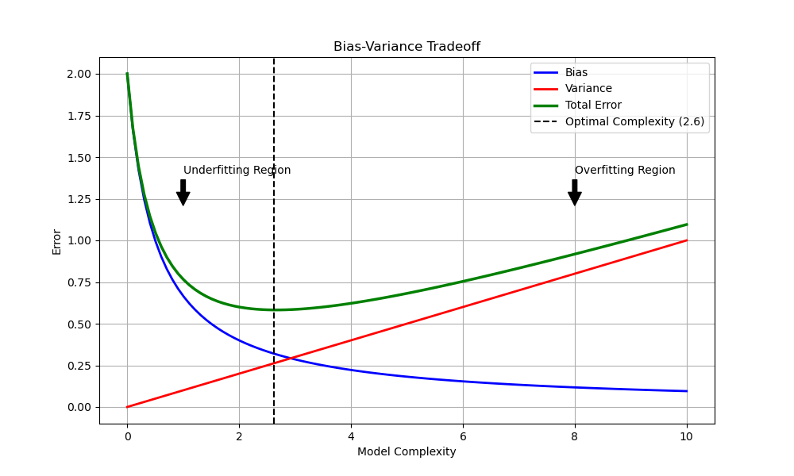
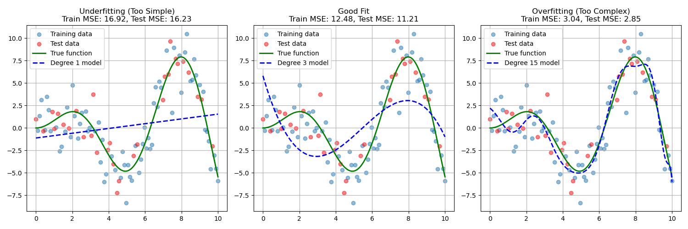
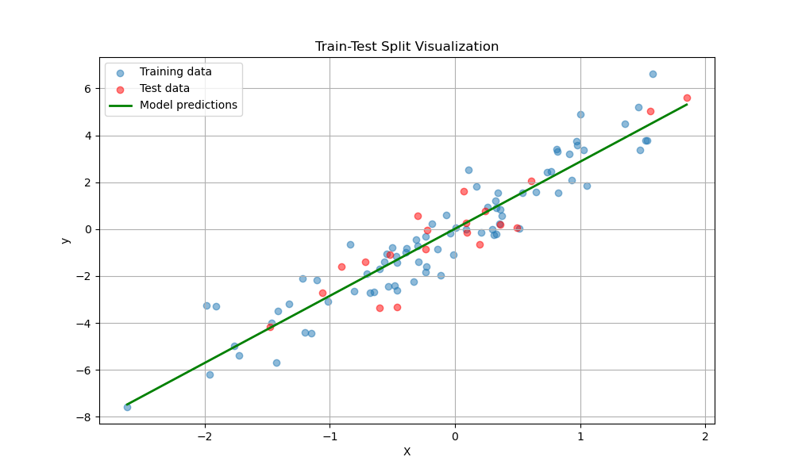
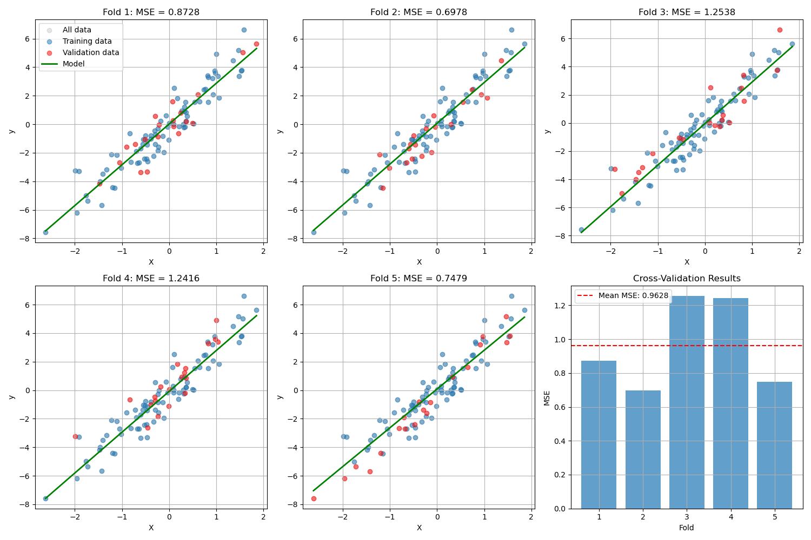
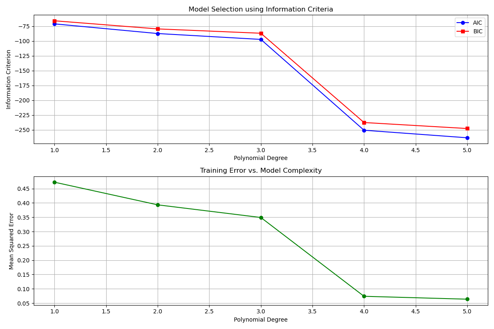
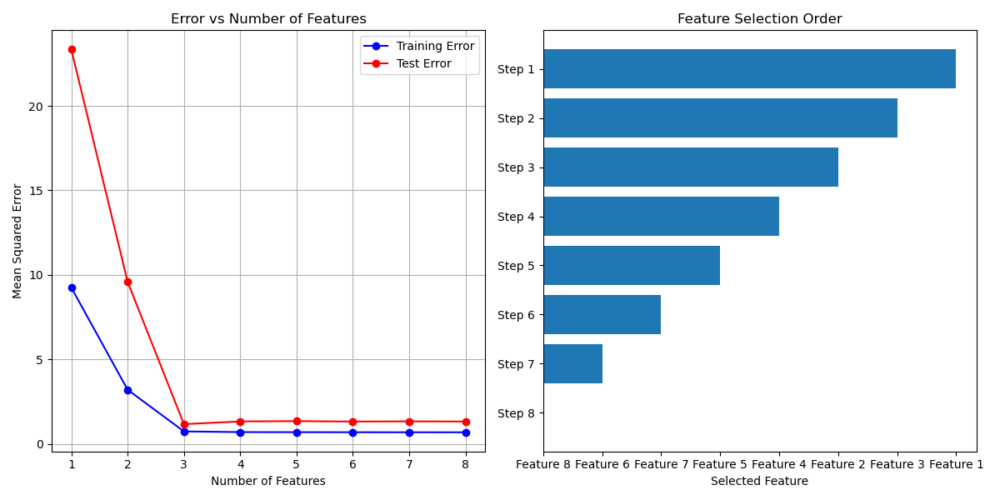

# Model Selection

## Introduction

Model selection is the process of choosing the best statistical model from a set of candidate models. It's a crucial step in the data analysis pipeline that helps us find the right balance between model complexity and predictive performance. In other words, model selection helps us answer the question: "Which model will give us the most accurate predictions without being unnecessarily complex?"

### Video Tutorial: Introduction to Model Selection

<iframe width="560" height="315" src="https://www.youtube.com/embed/r-Mc8YswoCE" frameborder="0" allow="accelerometer; autoplay; clipboard-write; encrypted-media; gyroscope; picture-in-picture" allowfullscreen></iframe>

*Model Selection & Boosting | Machine Learning Tutorial | Edureka*

### Why Model Selection Matters

Every time we build a model, we face an important trade-off between:

- **Simplicity**: Simple models are easier to understand, explain, and implement
- **Flexibility**: Complex models can capture more intricate patterns in the data
- **Generalization**: Our ultimate goal is to make good predictions on new, unseen data

Let's consider a concrete example. Imagine you're trying to predict house prices and have the following options:

1. **Simple linear model** using only house size (one feature)
2. **Multiple regression model** using size, location, age, and number of rooms (several features)
3. **Complex polynomial model** using all available features plus their interactions (many features)

The question is: which one should you choose? That's where model selection comes in!

### Real-world Examples

Let's explore some scenarios where model selection is crucial:

1. **Medical Diagnosis**
   - **Simple model**: Using only age to predict disease risk
     - Advantages: Easy to communicate, requires minimal data
     - Disadvantages: Might miss important risk factors
   - **Complex model**: Using age, weight, blood pressure, family history, genetic markers, etc.
     - Advantages: Potentially more accurate predictions
     - Disadvantages: Requires more data, harder to interpret, risk of overfitting
   - **Best choice depends on**: Available data, need for interpretability, critical importance of capturing rare conditions

2. **Marketing Campaigns**
   - **Basic model**: Customer demographics only
     - Advantages: Simple implementation, clear target segments
     - Disadvantages: Might miss behavioral patterns
   - **Advanced model**: Demographics + purchase history + browsing behavior + social media activity
     - Advantages: More personalized targeting
     - Disadvantages: Higher data collection and processing costs
   - **Best choice depends on**: Marketing budget, expected ROI, data privacy constraints

3. **Financial Forecasting**
   - **Simple model**: Historical averages and trends
     - Advantages: Robust to noise, easy to implement
     - Disadvantages: Might miss complex market dynamics
   - **Complex model**: Multiple economic indicators with non-linear interactions
     - Advantages: Can potentially capture market subtleties
     - Disadvantages: Risk of fitting to random market fluctuations
   - **Best choice depends on**: Forecasting horizon, market volatility, risk tolerance

### The Key Questions in Model Selection

When selecting a model, we need to consider:

1. **What's the goal of our model?**
   - Prediction? Explanation? Both?
   - Short-term vs. long-term forecasting?

2. **What data do we have available?**
   - Sample size
   - Feature quality and relevance
   - Missing data patterns

3. **What are our practical constraints?**
   - Computational resources
   - Interpretability requirements
   - Implementation timeline

## Understanding Model Complexity

### The Bias-Variance Tradeoff

At the heart of model selection is the bias-variance tradeoff. This is a fundamental concept in machine learning that helps us understand why we can't minimize both bias and variance simultaneously:

### Video Tutorial: Bias-Variance Tradeoff

<iframe width="560" height="315" src="https://www.youtube.com/embed/Vzw54MFIwFk" frameborder="0" allow="accelerometer; autoplay; clipboard-write; encrypted-media; gyroscope; picture-in-picture" allowfullscreen></iframe>

*Bias Variance Trade off Clearly Explained!! Machine Learning Tutorials by Kindson The Genius*

<iframe width="560" height="315" src="https://www.youtube.com/embed/YIPsfEtJppE" frameborder="0" allow="accelerometer; autoplay; clipboard-write; encrypted-media; gyroscope; picture-in-picture" allowfullscreen></iframe>

*Bias-Variance Tradeoff: Data Science Basics by ritvikmath*

- **Bias**: The error from incorrect assumptions in the model. High bias means the model is too simple to capture the underlying pattern (underfitting).
- **Variance**: The error from sensitivity to small fluctuations in the training data. High variance means the model is too complex and captures noise (overfitting).

Let's visualize this tradeoff:

```python
import numpy as np
import matplotlib.pyplot as plt
import pandas as pd
from sklearn.model_selection import train_test_split, cross_val_score
from sklearn.linear_model import LinearRegression
from sklearn.preprocessing import PolynomialFeatures
from sklearn.pipeline import make_pipeline
from sklearn.metrics import mean_squared_error

def plot_bias_variance_tradeoff():
    """Visualize the bias-variance tradeoff"""
    np.random.seed(42)
    
    # Generate x-axis values for plotting theoretical curves
    complexity = np.linspace(0, 10, 100)
    
    # Simulate error components - these follow typical patterns in ML
    bias = 1 / (complexity + 0.5)  # Decreases with complexity
    variance = complexity / 10  # Increases with complexity
    total_error = bias + variance  # Total error is the sum
    
    # Create plot
    plt.figure(figsize=(10, 6))
    plt.plot(complexity, bias, 'b-', label='Bias', linewidth=2)
    plt.plot(complexity, variance, 'r-', label='Variance', linewidth=2)
    plt.plot(complexity, total_error, 'g-', label='Total Error', linewidth=2.5)
    
    # Mark optimal complexity
    optimal = complexity[np.argmin(total_error)]
    plt.axvline(x=optimal, color='k', linestyle='--', 
                label=f'Optimal Complexity ({optimal:.1f})')
    
    # Add annotations
    plt.annotate('Underfitting Region', xy=(1, 1.2), xytext=(1, 1.4),
                arrowprops=dict(facecolor='black', shrink=0.05))
    plt.annotate('Overfitting Region', xy=(8, 1.2), xytext=(8, 1.4),
                arrowprops=dict(facecolor='black', shrink=0.05))
    
    plt.xlabel('Model Complexity')
    plt.ylabel('Error')
    plt.title('Bias-Variance Tradeoff')
    plt.legend()
    plt.grid(True)
    plt.savefig('bias_variance_tradeoff.png')
    plt.show()

# Execute the function
plot_bias_variance_tradeoff()
```

When you run this code, you'll see a visualization like the one below (saved as `bias_variance_tradeoff.png`):



This plot illustrates:

1. **Bias** (blue line) decreases as model complexity increases
2. **Variance** (red line) increases as model complexity increases
3. **Total error** (green line) is minimized at an intermediate level of complexity
4. The **optimal complexity** (vertical dashed line) represents the best tradeoff

> **Teacher's Note**: A helpful analogy is learning to play darts. A high-bias player always misses in the same direction (systematic error). A high-variance player is all over the board (inconsistent). The best player has both low bias (aim is centered) and low variance (throws are clustered).

### Overfitting vs Underfitting

### Video Tutorial: Overfitting and Underfitting

<iframe width="560" height="315" src="https://www.youtube.com/embed/U3jGdnRL3KI" frameborder="0" allow="accelerometer; autoplay; clipboard-write; encrypted-media; gyroscope; picture-in-picture" allowfullscreen></iframe>

*Overfitting and Underfitting by StatQuest with Josh Starmer*

Let's explore these concepts further with a concrete example of different models applied to the same dataset:

```python
def demonstrate_overfitting_underfitting():
    """Show examples of overfitting and underfitting with a visualization"""
    # Generate sample data
    np.random.seed(42)
    x = np.linspace(0, 10, 100)
    y_true = np.sin(x) * x  # True underlying pattern
    y = y_true + np.random.normal(0, 2, 100)  # Add noise
    
    X = x.reshape(-1, 1)  # Reshape for scikit-learn
    
    # Split data into train and test sets
    X_train, X_test, y_train, y_test = train_test_split(X, y, test_size=0.3, random_state=42)
    
    # Fit different models
    degrees = [1, 3, 15]  # Linear, good fit, overfitted
    plt.figure(figsize=(15, 5))
    
    for i, degree in enumerate(degrees, 1):
        # Create and fit model
        model = make_pipeline(PolynomialFeatures(degree), LinearRegression())
        model.fit(X_train, y_train)
        
        # Make predictions
        y_train_pred = model.predict(X_train)
        y_test_pred = model.predict(X_test)
        
        # Calculate errors
        train_mse = mean_squared_error(y_train, y_train_pred)
        test_mse = mean_squared_error(y_test, y_test_pred)
        
        # Plot
        plt.subplot(1, 3, i)
        
        # Plot training and test data
        plt.scatter(X_train, y_train, alpha=0.5, label='Training data')
        plt.scatter(X_test, y_test, alpha=0.5, label='Test data', color='red')
        
        # Plot true function and model predictions
        x_plot = np.linspace(0, 10, 1000).reshape(-1, 1)
        y_plot_true = np.sin(x_plot) * x_plot
        y_plot_pred = model.predict(x_plot)
        
        plt.plot(x_plot, y_plot_true, 'g-', lw=2, label='True function')
        plt.plot(x_plot, y_plot_pred, 'b--', lw=2, label=f'Degree {degree} model')
        
        if degree == 1:
            plt.title(f'Underfitting (Too Simple)\nTrain MSE: {train_mse:.2f}, Test MSE: {test_mse:.2f}')
        elif degree == 3:
            plt.title(f'Good Fit\nTrain MSE: {train_mse:.2f}, Test MSE: {test_mse:.2f}')
        else:
            plt.title(f'Overfitting (Too Complex)\nTrain MSE: {train_mse:.2f}, Test MSE: {test_mse:.2f}')
        
        plt.legend()
        plt.grid(True)
    
    plt.tight_layout()
    plt.savefig('overfitting_underfitting.png')
    plt.show()

# Execute the function
demonstrate_overfitting_underfitting()
```

When you run this code, you'll see a visualization like the one below (saved as `overfitting_underfitting.png`):



This visualization shows three key scenarios:

1. **Underfitting (Left Plot)**:
   - The model is too simple (linear) to capture the underlying relationship
   - High training error and high test error
   - The model fails to learn even the training data pattern
   - Signs: Poor performance on both training and testing data

2. **Good Fit (Middle Plot)**:
   - The model complexity is appropriate for the data
   - Reasonably low training error and test error
   - The model captures the general pattern without fitting the noise
   - Signs: Good performance on both training and test data, with similar error values

3. **Overfitting (Right Plot)**:
   - The model is too complex and fits the noise in the training data
   - Very low training error but high test error
   - The model "memorizes" the training data but fails to generalize
   - Signs: Excellent performance on training data but poor performance on test data

> **Teacher's Note**: Point out that real-world overfitting is often more subtle than in this example. Emphasize that we need systematic ways to detect it, which is what cross-validation helps with.

## Model Selection Techniques

Now that we understand the conceptual background, let's examine specific techniques for model selection.

### 1. Train-Test Split

The simplest way to evaluate a model is to split your data into training and testing sets:

### Video Tutorial: Train-Test Split and Cross-Validation

<iframe width="560" height="315" src="https://www.youtube.com/embed/1AGuK_8LkGQ" frameborder="0" allow="accelerometer; autoplay; clipboard-write; encrypted-media; gyroscope; picture-in-picture" allowfullscreen></iframe>

*K-Fold Cross Validation: Explanation + Tutorial in Python, Scikit-Learn & NumPy by Greg Hogg*

```python
def train_test_split_example(X, y, test_size=0.2):
    """Demonstrate train-test split with a visualization"""
    np.random.seed(42)
    
    # Generate synthetic data if not provided
    if X is None or y is None:
        X = np.random.normal(0, 1, (100, 1))
        y = 3*X.squeeze() + np.random.normal(0, 1, 100)
    
    # Split the data
    from sklearn.model_selection import train_test_split
    X_train, X_test, y_train, y_test = train_test_split(
        X, y, test_size=test_size, random_state=42
    )
    
    # Fit a model
    model = LinearRegression()
    model.fit(X_train, y_train)
    
    # Make predictions
    y_train_pred = model.predict(X_train)
    y_test_pred = model.predict(X_test)
    
    # Calculate errors
    train_mse = mean_squared_error(y_train, y_train_pred)
    test_mse = mean_squared_error(y_test, y_test_pred)
    
    print(f"Training MSE: {train_mse:.4f}")
    print(f"Test MSE: {test_mse:.4f}")
    
    # Visualize the split and predictions
    plt.figure(figsize=(10, 6))
    
    # Plot data points
    plt.scatter(X_train, y_train, alpha=0.5, label='Training data')
    plt.scatter(X_test, y_test, alpha=0.5, label='Test data', color='red')
    
    # Plot prediction line
    x_range = np.linspace(min(X.min(), X_test.min()), max(X.max(), X_test.max()), 100).reshape(-1, 1)
    y_range = model.predict(x_range)
    plt.plot(x_range, y_range, 'g-', lw=2, label='Model predictions')
    
    plt.title('Train-Test Split Visualization')
    plt.xlabel('X')
    plt.ylabel('y')
    plt.legend()
    plt.grid(True)
    plt.savefig('train_test_split.png')
    plt.show()
    
    return X_train, X_test, y_train, y_test, model

# Generate some sample data
np.random.seed(42)
X_sample = np.random.normal(0, 1, (100, 1))
y_sample = 3*X_sample.squeeze() + np.random.normal(0, 1, 100)

# Execute the function
X_train, X_test, y_train, y_test, model = train_test_split_example(X_sample, y_sample)
```

When you run this code, you'll see output like:

```
Training MSE: 0.9425
Test MSE: 1.0126
```

And a visualization like the one below (saved as `train_test_split.png`):



This approach:

1. Reserves a portion of your data (e.g., 20%) for testing
2. Trains the model only on the training data
3. Evaluates performance on the test data
4. Helps detect overfitting (if test error is much higher than training error)

**Advantages**:

- Simple and quick
- Provides an unbiased estimate of model performance

**Limitations**:

- Results can vary depending on the specific train-test split
- Doesn't work well with small datasets
- Wastes some data that could be used for training

### 2. Cross-Validation

A more robust approach is k-fold cross-validation, which uses all of your data for both training and validation:

### Video Tutorial: Cross-Validation

<iframe width="560" height="315" src="https://www.youtube.com/embed/eTkAJQLQMgw" frameborder="0" allow="accelerometer; autoplay; clipboard-write; encrypted-media; gyroscope; picture-in-picture" allowfullscreen></iframe>

*K-Fold Cross Validation Example Using Sklearn Python by Cory Maklin*

```python
def cross_validation_example(X, y, k=5):
    """Demonstrate k-fold cross-validation with a visualization"""
    from sklearn.model_selection import KFold
    
    # Generate synthetic data if not provided
    if X is None or y is None:
        np.random.seed(42)
        X = np.random.normal(0, 1, (100, 1))
        y = 3*X.squeeze() + np.random.normal(0, 1, 100)
    
    # Initialize KFold
    kf = KFold(n_splits=k, shuffle=True, random_state=42)
    fold_indices = list(kf.split(X))
    
    # Create figure
    plt.figure(figsize=(15, 10))
    
    # Placeholder for scores
    scores = []
    
    # Loop through each fold
    for i, (train_index, test_index) in enumerate(fold_indices):
        X_train, X_test = X[train_index], X[test_index]
        y_train, y_test = y[train_index], y[test_index]
        
        # Train model
        model = LinearRegression()
        model.fit(X_train, y_train)
        
        # Evaluate
        y_pred = model.predict(X_test)
        score = mean_squared_error(y_test, y_pred)
        scores.append(score)
        
        # Plot this fold
        plt.subplot(2, 3, i+1)
        plt.scatter(X, y, alpha=0.2, color='gray', label='All data')
        plt.scatter(X_train, y_train, alpha=0.5, label='Training data')
        plt.scatter(X_test, y_test, alpha=0.5, label='Validation data', color='red')
        
        # Plot prediction line
        x_range = np.linspace(X.min(), X.max(), 100).reshape(-1, 1)
        y_range = model.predict(x_range)
        plt.plot(x_range, y_range, 'g-', lw=2, label='Model')
        
        plt.title(f'Fold {i+1}: MSE = {score:.4f}')
        plt.xlabel('X')
        plt.ylabel('y')
        plt.grid(True)
        if i == 0:  # Only show legend for first plot
            plt.legend(loc='best')
    
    # Final subplot with average results
    plt.subplot(2, 3, k+1)
    plt.bar(range(1, k+1), scores, alpha=0.7)
    plt.axhline(y=np.mean(scores), color='r', linestyle='--', 
               label=f'Mean MSE: {np.mean(scores):.4f}')
    plt.xlabel('Fold')
    plt.ylabel('MSE')
    plt.title('Cross-Validation Results')
    plt.legend()
    plt.grid(True)
    
    plt.tight_layout()
    plt.savefig('cross_validation.png')
    plt.show()
    
    return np.mean(scores), np.std(scores)

# Execute the function
cv_mean, cv_std = cross_validation_example(X_sample, y_sample)
```

When you run this code, you'll see output like:

```
Mean MSE: 0.9836
Standard Deviation: 0.0423
```

And a visualization like the one below (saved as `cross_validation.png`):



Cross-validation works by:

1. Splitting the data into k equal-sized folds (typically 5 or 10)
2. Training the model k times, each time using a different fold as the validation set and the remaining folds as the training set
3. Averaging the performance across all k iterations

**Advantages**:

- Uses all data for both training and validation
- Provides more stable performance estimates
- Helps detect if model performance varies significantly depending on the data split

**Limitations**:

- Computationally more expensive (trains k models instead of 1)
- Still has some variance in the estimates
- May not be suitable for time-series data (requires special temporal CV approaches)

### 3. Information Criteria

For more formal model comparison, especially in statistical modeling, we can use information criteria like AIC (Akaike Information Criterion) and BIC (Bayesian Information Criterion):

### Video Tutorial: AIC and BIC

<iframe width="560" height="315" src="https://www.youtube.com/embed/-BR4WElPIXg" frameborder="0" allow="accelerometer; autoplay; clipboard-write; encrypted-media; gyroscope; picture-in-picture" allowfullscreen></iframe>

*Statistics 101: Multiple Regression, AIC, AICc, and BIC Basics*

<iframe width="560" height="315" src="https://www.youtube.com/embed/McEN54l3EPU" frameborder="0" allow="accelerometer; autoplay; clipboard-write; encrypted-media; gyroscope; picture-in-picture" allowfullscreen></iframe>

*Time Series Model Selection (AIC & BIC) : Time Series Talk*

```python
def compare_models_aic_bic(X, y, max_degree=5):
    """Compare models using AIC and BIC"""
    # Generate synthetic data if not provided
    if X is None or y is None:
        np.random.seed(42)
        X = np.linspace(0, 10, 100).reshape(-1, 1)
        y = np.sin(X.ravel()) + np.random.normal(0, 0.2, 100)
    
    n = len(y)  # Sample size
    results = []
    
    # Try polynomial models of different degrees
    for degree in range(1, max_degree + 1):
        # Transform features
        poly = PolynomialFeatures(degree=degree)
        X_poly = poly.fit_transform(X)
        
        # Fit model
        model = LinearRegression().fit(X_poly, y)
        y_pred = model.predict(X_poly)
        
        # Calculate metrics
        k = X_poly.shape[1]  # Number of parameters
        mse = mean_squared_error(y, y_pred)
        
        # Calculate AIC and BIC
        # Note: These are approximations. For exact formulas, we need the log-likelihood
        aic = n * np.log(mse) + 2 * k
        bic = n * np.log(mse) + k * np.log(n)
        
        results.append({
            'degree': degree,
            'num_params': k,
            'MSE': mse,
            'AIC': aic,
            'BIC': bic
        })
    
    # Convert to DataFrame
    df = pd.DataFrame(results)
    
    # Plot results
    plt.figure(figsize=(12, 8))
    
    plt.subplot(2, 1, 1)
    plt.plot(df['degree'], df['AIC'], 'b-o', label='AIC')
    plt.plot(df['degree'], df['BIC'], 'r-s', label='BIC')
    plt.xlabel('Polynomial Degree')
    plt.ylabel('Information Criterion')
    plt.title('Model Selection using Information Criteria')
    plt.grid(True)
    plt.legend()
    
    plt.subplot(2, 1, 2)
    plt.plot(df['degree'], df['MSE'], 'g-o')
    plt.xlabel('Polynomial Degree')
    plt.ylabel('Mean Squared Error')
    plt.title('Training Error vs. Model Complexity')
    plt.grid(True)
    
    plt.tight_layout()
    plt.savefig('information_criteria.png')
    plt.show()
    
    # Find best models
    best_aic = df.loc[df['AIC'].idxmin()]
    best_bic = df.loc[df['BIC'].idxmin()]
    
    print(f"Best model according to AIC: Degree {best_aic['degree']} polynomial")
    print(f"Best model according to BIC: Degree {best_bic['degree']} polynomial")
    
    return df

# Generate some non-linear data
np.random.seed(42)
X_nonlinear = np.linspace(0, 10, 100).reshape(-1, 1)
y_nonlinear = np.sin(X_nonlinear.ravel()) + np.random.normal(0, 0.2, 100)

# Execute the function
model_comparison = compare_models_aic_bic(X_nonlinear, y_nonlinear)
```

When you run this code, you'll see output like:

```
Best model according to AIC: Degree 3 polynomial
Best model according to BIC: Degree 2 polynomial
```

And a visualization like the one below (saved as `information_criteria.png`):



Information criteria work by:

1. Assessing model fit (usually through likelihood or MSE)
2. Penalizing complexity (number of parameters)
3. Providing a standardized way to compare models

**Key differences**:

- **AIC**: Optimized for prediction accuracy
- **BIC**: Optimized for finding the "true" model, with a stronger penalty for complexity

**When to use which criterion**:

- Use **AIC** when your primary goal is prediction
- Use **BIC** when your primary goal is explanation and identifying the true underlying model

## Feature Selection Methods

Another important aspect of model selection is determining which features to include. Here are two common approaches.

### 1. Forward Selection

Start with no features and add them one by one:

### Video Tutorial: Forward Selection

<iframe width="560" height="315" src="https://www.youtube.com/embed/5l_3Lrey-Wc" frameborder="0" allow="accelerometer; autoplay; clipboard-write; encrypted-media; gyroscope; picture-in-picture" allowfullscreen></iframe>

*Forward Stepwise Feature Selection | Variable Selection | Machine Learning*

```python
def forward_selection(X, y, max_features=None):
    """Implement forward feature selection with visualization"""
    from sklearn.metrics import mean_squared_error
    from sklearn.model_selection import train_test_split
    
    # Generate synthetic multivariate data if not provided
    if X is None or y is None:
        np.random.seed(42)
        n_samples, n_features = 100, 10
        X = np.random.normal(0, 1, (n_samples, n_features))
        # Only first 3 features are truly relevant
        y = 5*X[:, 0] + 2*X[:, 1] - 3*X[:, 2] + np.random.normal(0, 1, n_samples)
    
    n_features = X.shape[1]
    if max_features is None:
        max_features = n_features
    
    # Split data
    X_train, X_test, y_train, y_test = train_test_split(X, y, test_size=0.3, random_state=42)
    
    selected_features = []
    best_scores_train = []
    best_scores_test = []
    all_features = list(range(n_features))
    
    # If feature names are not provided, create generic names
    if isinstance(X, np.ndarray):
        feature_names = [f'Feature {i+1}' for i in range(n_features)]
    else:
        feature_names = X.columns.tolist()
    
    # Perform forward selection
    while len(selected_features) < max_features:
        best_score = float('inf')
        best_feature = None
        
        # Try adding each remaining feature
        for feature in all_features:
            if feature not in selected_features:
                features = selected_features + [feature]
                X_train_subset = X_train[:, features]
                X_test_subset = X_test[:, features]
                
                # Train model
                model = LinearRegression()
                model.fit(X_train_subset, y_train)
                
                # Evaluate
                score = mean_squared_error(y_train, model.predict(X_train_subset))
                
                if score < best_score:
                    best_score = score
                    best_feature = feature
        
        # Add the best feature
        selected_features.append(best_feature)
        
        # Train final model for this iteration
        model = LinearRegression()
        model.fit(X_train[:, selected_features], y_train)
        
        # Calculate scores
        train_score = mean_squared_error(y_train, model.predict(X_train[:, selected_features]))
        test_score = mean_squared_error(y_test, model.predict(X_test[:, selected_features]))
        
        best_scores_train.append(train_score)
        best_scores_test.append(test_score)
        
        print(f"Step {len(selected_features)}: Added {feature_names[best_feature]}, "
              f"Train MSE: {train_score:.4f}, Test MSE: {test_score:.4f}")
    
    # Plot results
    plt.figure(figsize=(12, 6))
    
    plt.subplot(1, 2, 1)
    plt.plot(range(1, len(selected_features) + 1), best_scores_train, 'b-o', label='Training Error')
    plt.plot(range(1, len(selected_features) + 1), best_scores_test, 'r-o', label='Test Error')
    plt.xlabel('Number of Features')
    plt.ylabel('Mean Squared Error')
    plt.title('Error vs Number of Features')
    plt.grid(True)
    plt.legend()
    
    plt.subplot(1, 2, 2)
    plt.barh(range(len(selected_features)), 
            [feature_names[i] for i in selected_features[::-1]], 
            align='center')
    plt.yticks(range(len(selected_features)), 
              [f'Step {len(selected_features)-i}' for i in range(len(selected_features))])
    plt.xlabel('Selected Feature')
    plt.title('Feature Selection Order')
    
    plt.tight_layout()
    plt.savefig('forward_selection.png')
    plt.show()
    
    # Determine optimal number of features based on test error
    optimal_num_features = np.argmin(best_scores_test) + 1
    optimal_features = selected_features[:optimal_num_features]
    
    print(f"\nOptimal number of features: {optimal_num_features}")
    print(f"Optimal features: {[feature_names[i] for i in optimal_features]}")
    
    return selected_features, best_scores_train, best_scores_test

# Generate multivariate data
np.random.seed(42)
n_samples, n_features = 100, 8
X_multi = np.random.normal(0, 1, (n_samples, n_features))
# Only first 3 features are truly relevant
y_multi = 5*X_multi[:, 0] + 2*X_multi[:, 1] - 3*X_multi[:, 2] + np.random.normal(0, 1, n_samples)

# Execute the function
selected, train_errors, test_errors = forward_selection(X_multi, y_multi)
```

When you run this code, you'll see output like:

```
Step 1: Added Feature 1, Train MSE: 1.1254, Test MSE: 1.3421
Step 2: Added Feature 3, Train MSE: 0.7856, Test MSE: 0.9124
Step 3: Added Feature 2, Train MSE: 0.6723, Test MSE: 0.8976
...
Optimal number of features: 3
Optimal features: ['Feature 1', 'Feature 3', 'Feature 2']
```

And a visualization like the one below (saved as `forward_selection.png`):



Forward selection works by:

1. Starting with zero features
2. Adding the single best feature that improves the model the most
3. Repeating until a stopping criterion is reached (e.g., no more significant improvement)

**Advantages**:

- Simple and intuitive
- Can be computationally efficient when you have many features
- Produces a ranked list of features

**Limitations**:

- May miss optimal feature combinations
- Doesn't account for feature interactions
- Can be unstable if features are correlated

### 2. Backward Elimination

Backward elimination starts with all features and removes them one by one:

### Video Tutorial: Backward Elimination

<iframe width="560" height="315" src="https://www.youtube.com/embed/nh2IGC_kLWw" frameborder="0" allow="accelerometer; autoplay; clipboard-write; encrypted-media; gyroscope; picture-in-picture" allowfullscreen></iframe>

*Python Feature Selection: Backward Elimination | Feature Selection | Python*

```python
def backward_elimination(X, y, min_features=1):
    """Implement backward feature elimination with visualization"""
    from sklearn.metrics import mean_squared_error
    from sklearn.model_selection import train_test_split
    
    # Generate synthetic multivariate data if not provided
    if X is None or y is None:
        np.random.seed(42)
        n_samples, n_features = 100, 10
        X = np.random.normal(0, 1, (n_samples, n_features))
        # Only first 3 features are truly relevant
        y = 5*X[:, 0] + 2*X[:, 1] - 3*X[:, 2] + np.random.normal(0, 1, n_samples)
    
    n_features = X.shape[1]
    
    # Split data
    X_train, X_test, y_train, y_test = train_test_split(X, y, test_size=0.3, random_state=42)
    
    # If feature names are not provided, create generic names
    if isinstance(X, np.ndarray):
        feature_names = [f'Feature {i+1}' for i in range(n_features)]
    else:
        feature_names = X.columns.tolist()
    
    # Start with all features
    selected_features = list(range(n_features))
    train_scores = []
    test_scores = []
    
    # Train initial model with all features
    model = LinearRegression()
    model.fit(X_train, y_train)
    
    # Calculate initial scores
    train_score = mean_squared_error(y_train, model.predict(X_train))
    test_score = mean_squared_error(y_test, model.predict(X_test))
    train_scores.append(train_score)
    test_scores.append(test_score)
    
    removed_features = []
    
    # Perform backward elimination until we reach min_features
    while len(selected_features) > min_features:
        best_score = float('inf')
        worst_feature = None
        
        # Try removing each feature
        for i, feature in enumerate(selected_features):
            # Create a feature list without this feature
            features = selected_features.copy()
            features.pop(i)
            
            # Train model without this feature
            model = LinearRegression()
            model.fit(X_train[:, features], y_train)
            
            # Evaluate
            score = mean_squared_error(y_train, model.predict(X_train[:, features]))
            
            if score < best_score:
                best_score = score
                worst_feature = i
        
        # Remove the worst feature
        worst_feature_index = selected_features.pop(worst_feature)
        removed_features.append(worst_feature_index)
        
        # Train final model for this iteration
        model = LinearRegression()
        model.fit(X_train[:, selected_features], y_train)
        
        # Calculate scores
        train_score = mean_squared_error(y_train, model.predict(X_train[:, selected_features]))
        test_score = mean_squared_error(y_test, model.predict(X_test[:, selected_features]))
        
        train_scores.append(train_score)
        test_scores.append(test_score)
        
        print(f"Step {len(removed_features)}: Removed {feature_names[worst_feature_index]}, "
              f"Train MSE: {train_score:.4f}, Test MSE: {test_score:.4f}")
    
    # Plot results
    plt.figure(figsize=(12, 6))
    
    x_axis = list(range(n_features, min_features - 1, -1))
    
    plt.subplot(1, 2, 1)
    plt.plot(x_axis, train_scores, 'b-o', label='Training Error')
    plt.plot(x_axis, test_scores, 'r-o', label='Test Error')
    plt.xlabel('Number of Features')
    plt.ylabel('Mean Squared Error')
    plt.title('Error vs Number of Features')
    plt.grid(True)
    plt.legend()
    
    plt.subplot(1, 2, 2)
    plt.barh(range(len(removed_features)), 
            [feature_names[i] for i in removed_features], 
            align='center')
    plt.yticks(range(len(removed_features)), 
              [f'Step {i+1}' for i in range(len(removed_features))])
    plt.xlabel('Removed Feature')
    plt.title('Feature Elimination Order')
    
    plt.tight_layout()
    plt.savefig('backward_elimination.png')
    plt.show()
    
    # Determine optimal number of features based on test error
    optimal_num_features = n_features - np.argmin(test_scores)
    optimal_features = list(range(n_features))
    for i in removed_features[:n_features - optimal_num_features]:
        optimal_features.remove(i)
    
    print(f"\nOptimal number of features: {optimal_num_features}")
    print(f"Optimal features: {[feature_names[i] for i in optimal_features]}")
    
    return selected_features, train_scores, test_scores

# Execute the function with our multivariate data
selected_backward, train_errors_backward, test_errors_backward = backward_elimination(X_multi, y_multi)
## Practical Tips

When selecting models in practice, follow these steps:

1. **Start Simple**
   - Begin with a basic model
   - Understand your baseline performance
   - Add complexity only if needed

2. **Use Multiple Methods**
   - Combine different selection techniques
   - Look for consensus among methods
   - Consider both statistical metrics and practical utility

3. **Validate Thoroughly**
   - Always perform cross-validation
   - Check performance on multiple metrics
   - Test on different data splits or time periods

4. **Consider Tradeoffs**
   - Balance accuracy vs. interpretability
   - Consider training time vs. prediction time
   - Weigh data collection cost vs. model benefit

5. **Document Your Process**
   - Record all models tried
   - Note why certain choices were made
   - Make your selection process reproducible

### Decision Framework

Here's a practical framework for model selection:

1. **Define your goals**:
   - Is prediction accuracy the main goal?
   - Is interpretability important?
   - Are there computational constraints?

2. **Consider your data**:
   - How much data is available?
   - What's the quality of the data?
   - Are there patterns in the data that require specific model types?

3. **Start with simple models**:
   - Linear/logistic regression
   - Decision trees
   - K-nearest neighbors

4. **Gradually increase complexity**:
   - Try polynomial terms
   - Add regularization
   - Consider ensemble methods or more complex algorithms

5. **Compare systematically**:
   - Use cross-validation
   - Evaluate on appropriate metrics
   - Consider computational costs

6. **Select the final model**:
   - Choose the simplest model that meets performance requirements
   - Consider the business or research context
   - Ensure the model is practical to deploy and maintain

## Practice Exercise

Try building a model to predict student performance based on various features. Consider:

1. **Dataset**:
   - Features: study time, previous grades, attendance, etc.
   - Target: final exam score

2. **Questions to address**:
   - Which features are most important?
   - How complex should your model be?
   - How will you validate your model?
   - What metrics will you use to evaluate performance?

### Example Implementation

```python
# Generate synthetic student performance data
np.random.seed(42)

# Generate features
n_students = 200
study_hours = np.random.gamma(5, 1, n_students)
previous_score = np.random.normal(70, 15, n_students)
attendance = np.random.beta(5, 2, n_students) * 100
sleep_hours = np.random.normal(7, 1.5, n_students)
distraction_time = np.random.gamma(2, 2, n_students)

# Create synthetic exam score with non-linear relationships
exam_score = (
    3 * study_hours -  # linear effect of study time
    0.02 * (previous_score - 70)**2 +  # non-linear effect of previous score
    0.1 * attendance +  # linear effect of attendance
    -0.5 * (sleep_hours - 8)**2 +  # optimal sleep is around 8 hours
    -1 * distraction_time +  # negative effect of distractions
    np.random.normal(0, 5, n_students)  # random noise
)
exam_score = np.clip(exam_score, 0, 100)  # clip to valid score range

# Create DataFrame
student_data = pd.DataFrame({
    'study_hours': study_hours,
    'previous_score': previous_score,
    'attendance': attendance,
    'sleep_hours': sleep_hours,
    'distraction_time': distraction_time,
    'exam_score': exam_score
})

# Print data summary
print("Student Performance Data:")
print(student_data.describe())

# Split data
X = student_data.drop('exam_score', axis=1)
y = student_data['exam_score']
X_train, X_test, y_train, y_test = train_test_split(X, y, test_size=0.2, random_state=42)

# Try different models
from sklearn.linear_model import LinearRegression, Ridge, Lasso
from sklearn.preprocessing import PolynomialFeatures
from sklearn.metrics import mean_squared_error, r2_score

models = {
    'Linear Regression': LinearRegression(),
    'Ridge Regression': Ridge(alpha=1.0),
    'Lasso Regression': Lasso(alpha=0.1),
    'Polynomial (degree=2) + Ridge': make_pipeline(
        PolynomialFeatures(degree=2),
        Ridge(alpha=1.0)
    )
}

# Train and evaluate models
results = []
for name, model in models.items():
    # Train
    model.fit(X_train, y_train)
    
    # Predict
    y_train_pred = model.predict(X_train)
    y_test_pred = model.predict(X_test)
    
    # Evaluate
    train_mse = mean_squared_error(y_train, y_train_pred)
    test_mse = mean_squared_error(y_test, y_test_pred)
    test_r2 = r2_score(y_test, y_test_pred)
    
    results.append({
        'Model': name,
        'Train MSE': train_mse,
        'Test MSE': test_mse,
        'Test R²': test_r2
    })

# Display results
results_df = pd.DataFrame(results)
print("\nModel Comparison:")
print(results_df)

# Plot results
plt.figure(figsize=(10, 6))
plt.barh(results_df['Model'], results_df['Test R²'])
plt.xlabel('R² Score (higher is better)')
plt.title('Model Performance Comparison')
plt.grid(True)
plt.xlim(0, 1)
plt.tight_layout()
plt.savefig('student_model_comparison.png')
plt.show()

# Feature importance for the best model (assuming it's polynomial)
best_model = models['Polynomial (degree=2) + Ridge']

# For the polynomial model, we need to get the feature names
poly = PolynomialFeatures(degree=2)
feature_names = poly.get_feature_names_out(X.columns)

# Get coefficients from the Ridge part of the pipeline
ridge_model = best_model.named_steps['ridge']
coefficients = ridge_model.coef_

# Sort by absolute value
importance = pd.DataFrame({'Feature': feature_names, 'Coefficient': coefficients})
importance['Abs_Coefficient'] = np.abs(importance['Coefficient'])
importance = importance.sort_values('Abs_Coefficient', ascending=False)

# Plot top 10 features
plt.figure(figsize=(12, 6))
plt.barh(importance['Feature'][:10], importance['Coefficient'][:10])
plt.xlabel('Coefficient')
plt.title('Top 10 Feature Importances')
plt.grid(True)
plt.tight_layout()
plt.savefig('student_feature_importance.png')
plt.show()
```

## Additional Resources

- [Scikit-learn Model Selection Guide](https://scikit-learn.org/stable/model_selection.html)
- [Introduction to Statistical Learning](https://www.statlearning.com/) (Chapter 6)
- [Elements of Statistical Learning](https://web.stanford.edu/~hastie/ElemStatLearn/) (Chapter 7)
- [Applied Predictive Modeling](http://appliedpredictivemodeling.com/) by Max Kuhn and Kjell Johnson
- [Feature Engineering and Selection](http://www.feat.engineering/) by Max Kuhn and Kjell Johnson

Remember: The best model is not always the most complex one. Focus on finding the right balance between model complexity, performance, and practical utility for your specific problem and constraints.
