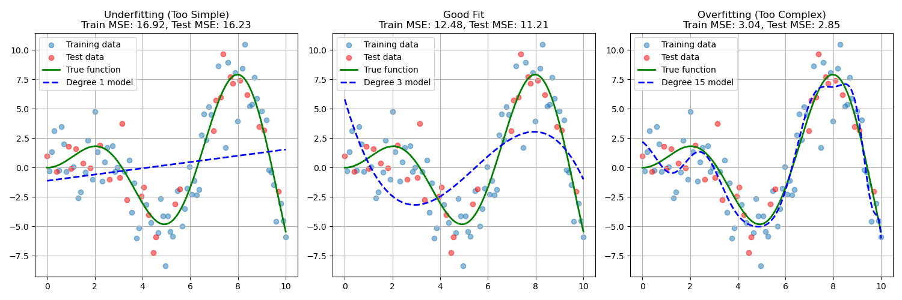
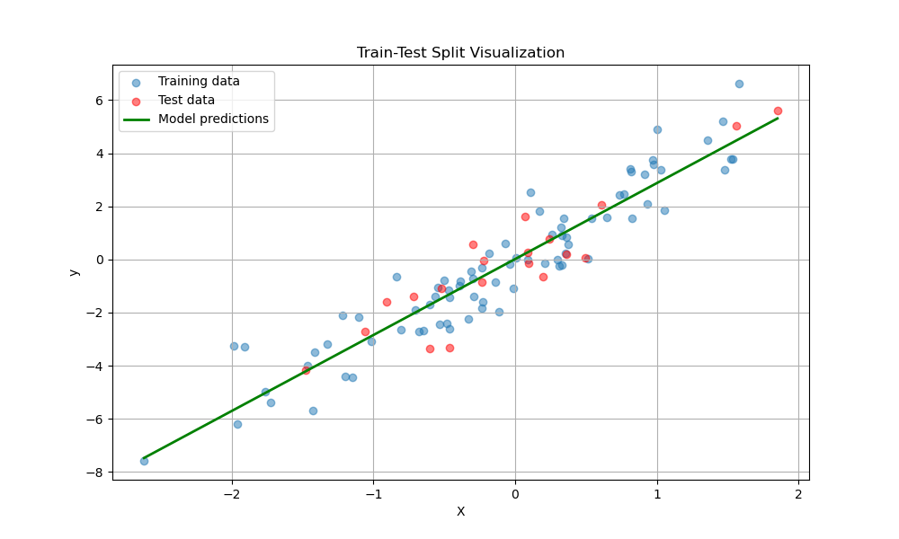
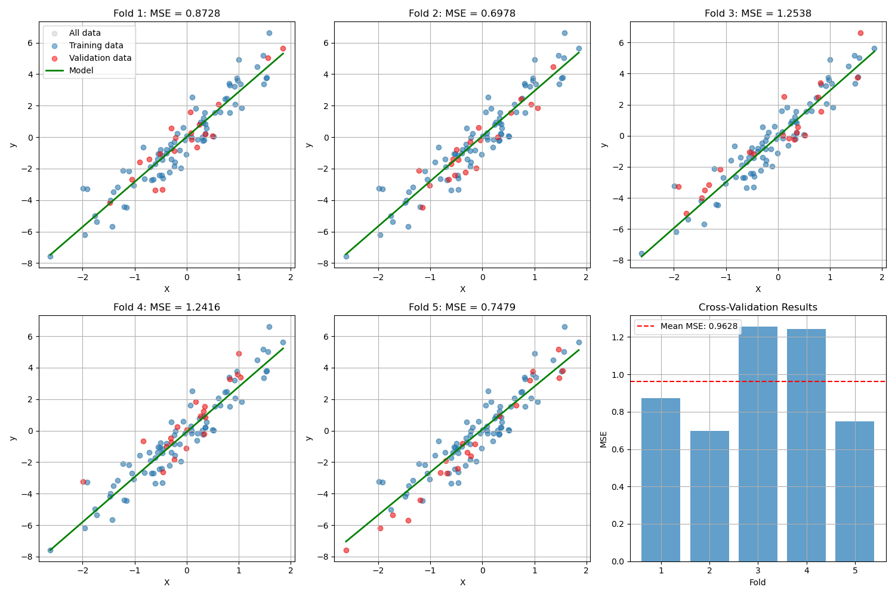
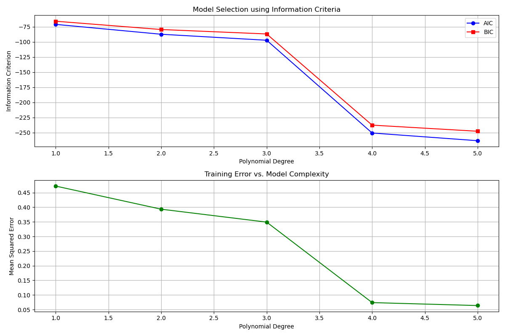

# Model Selection

**After this lesson:** you can compare candidate models honestly with cross-validation and information criteria, and select features without leaking validation data.

## TLDR

* **Goal:** pick the model that _generalises_ to new data, not the one with the lowest training error.
* **Golden rule:** fit on training data, evaluate on test data, never use the same data for both.
* **Bias-variance tradeoff:** simple models underfit (high bias); complex models overfit (high variance). The sweet spot minimises total error on unseen data.
* **Cross-validation (k-fold):** rotates which fold acts as the test set across k rounds, far more reliable than a single split, especially on small datasets.
* **Information criteria (AIC/BIC):** reward fit while penalising the number of parameters. BIC penalises complexity more heavily, prefer it when you want the "true" model, not just the best predictor.
* **Feature selection (forward/backward):** greedy search that adds/removes one feature at a time; stop where test error is lowest.
* **Gotcha:** every time you adjust your model based on test performance, you're effectively training on the test set. Use CV for all tuning decisions.

## Overview

Training error almost always rewards **more** complexity; generalization asks which model predicts well on **new** data. This lesson covers cross-validation, holdout discipline, and criteria like AIC/BIC-style thinking, so you pick structure (polynomial degree, feature subsets) without fooling yourself. It pairs naturally with [regularization](regularization.md), which penalizes complexity inside a single optimization instead of comparing many separate fits.

## Why this matters

* You will compare models with **cross-validation** and information criteria instead of trusting training error alone.
* You will reduce **overfitting** by choosing complexity that generalizes.

## Prerequisites

* [Polynomial regression](polynomial-regression.md).
* Comfort with train/test or k-fold ideas (this lesson makes them concrete).

> **Important:** The same data cannot be used to fit and to select without a proper validation design.

## Introduction

Model selection is the process of choosing the best statistical model from a set of candidate models. It's a important step in the data analysis pipeline that helps us find the right balance between model complexity and predictive performance. In other words, model selection helps us answer the question: "Which model will give us the most accurate predictions without being unnecessarily complex?"

### Video Tutorial: Introduction to Model Selection

_Model Selection & Boosting | Machine Learning Tutorial | Edureka_

### Why Model Selection Matters

Every time we build a model, we face an important trade-off between:

* **Simplicity**: Simple models are easier to understand, explain, and implement
* **Flexibility**: Complex models can capture more intricate patterns in the data
* **Generalization**: Our ultimate goal is to make good predictions on new, unseen data

Consider a concrete example. Imagine you're trying to predict house prices and have the following options:

1. **Simple linear model** using only house size (one feature)
2. **Multiple regression model** using size, location, age, and number of rooms (several features)
3. **Complex polynomial model** using all available features plus their interactions (many features)

The question is: which one should you choose? That's where model selection comes in!

### Real-world Examples

we will look at some scenarios where model selection is important:

1. **Medical Diagnosis**: A simple age-only model is easy to communicate but misses risk factors; a complex model (weight, blood pressure, family history, genetic markers) is potentially more accurate but needs more data and risks overfitting. The right choice depends on available data, interpretability needs, and the cost of missing rare conditions.
2. **Marketing Campaigns**: A demographics-only model is simple with clear segments but misses behavioral patterns; adding purchase history, browsing, and social activity enables personalized targeting at higher data and processing cost. The right choice depends on budget, expected ROI, and privacy constraints.
3. **Financial Forecasting**: Historical averages are reliable to noise and easy to implement but miss complex market dynamics; multiple economic indicators with non-linear interactions can capture subtleties but risk fitting random fluctuations. The right choice depends on forecasting horizon, volatility, and risk tolerance.

### The Key Questions in Model Selection

When selecting a model, we need to consider:

1. **What's the goal of our model?**
   * Prediction? Explanation? Both?
   * Short-term vs. long-term forecasting?
2. **What data do we have available?**
   * Sample size
   * Feature quality and relevance
   * Missing data patterns
3. **What are our practical constraints?**
   * Computational resources
   * Interpretability requirements
   * Implementation timeline

> **🎯 Key points**
>
> * Model selection means choosing the best model from a set of candidates.
> * The core trade-off is simplicity vs. flexibility; the real goal is generalising to new data.
> * More features can capture more patterns but add cost and overfitting risk.
> * Let your goal, your data, and your practical constraints guide the choice.

## Understanding Model Complexity

### The Bias-Variance Tradeoff

At the heart of model selection is the bias-variance tradeoff. This is a fundamental concept in machine learning that helps us understand why we can't minimize both bias and variance simultaneously:

### Video Tutorial: Bias-Variance Tradeoff

_Bias Variance Trade off Clearly Explained!! Machine Learning Tutorials by Kindson The Genius_

_Bias-Variance Tradeoff: Data Science Basics by ritvikmath_

* **Bias**: The error from incorrect assumptions in the model. High bias means the model is too simple to capture the underlying pattern (underfitting).
* **Variance**: The error from sensitivity to small fluctuations in the training data. High variance means the model is too complex and captures noise (overfitting).

Visualize this tradeoff:

**Schematic bias, variance, and total error vs complexity**

**Purpose:** Plot stylized decreasing bias, increasing variance, and their sum to mark an "optimal complexity" vertical line for teaching.

**Walkthrough:** Pure NumPy curves; `np.argmin` on total error; `plt.annotate` for under/overfitting regions.

<figure><figcaption><p>Figure 1: Are Our Errors Random? (They Should Be!)</p></figcaption></figure>

<figure><figcaption><p>Figure 2: Bias-Variance Tradeoff</p></figcaption></figure>

Imports

Load NumPy, Matplotlib, pandas, and the key scikit-learn helpers we'll use throughout this lesson.

Simulate Curves

Generate stylised bias (decreasing) and variance (increasing) curves along a complexity axis; their sum gives total error.

Plot Lines

Draw the three curves and mark the optimal complexity point where total error is minimised using `np.argmin`.

Annotate Regions

Add arrows labelling the underfitting (left) and overfitting (right) regions for clarity, then save and display the figure.

Run It

Call the function to produce and save `bias_variance_tradeoff.png`.

.png>)

This plot illustrates:

1. **Bias** (blue line) decreases as model complexity increases
2. **Variance** (red line) increases as model complexity increases
3. **Total error** (green line) is minimized at an intermediate level of complexity
4. The **optimal complexity** (vertical dashed line) represents the best tradeoff

### Overfitting vs Underfitting

### Video Tutorial: Overfitting and Underfitting

_Machine Learning Fundamentals: Bias and Variance by StatQuest with Josh Starmer_

we will look at these concepts further with a concrete example of different models applied to the same dataset:

**Polynomial degree 1 vs 3 vs 15 on noisy sinusoidal data**

**Purpose:** Train/test split on synthetic data, fit `PolynomialFeatures` + `LinearRegression` pipelines for three degrees, and plot fits with train vs test MSE in titles.

**Walkthrough:** `make_pipeline(PolynomialFeatures(degree), LinearRegression())`; `mean_squared_error` on train and test; three-column subplot.

<figure><figcaption><p>Figure 3: Underfitting (Too Simple) Train MSE: 16.92, Test MSE: 16.23</p></figcaption></figure>

Data Generation

Create a noisy sinusoidal dataset and split it 70/30 into train and test sets.

Fit Three Models

Loop over degrees 1, 3, and 15. Each iteration builds a `PolynomialFeatures + LinearRegression` pipeline and computes train/test MSE.

Plot Each Fit

Scatter the data points, overlay the true curve and model prediction, and title each subplot with the degree's MSE values to contrast under-, good-, and over-fit.

Save and Run

Tighten layout, save to `overfitting_underfitting.png`, then call the function.



This visualization shows three key scenarios:

1. **Underfitting (Left Plot)**:
   * The model is too simple (linear) to capture the underlying relationship
   * High training error and high test error
   * The model fails to learn even the training data pattern
   * Signs: Poor performance on both training and testing data
2. **Good Fit (Middle Plot)**:
   * The model complexity is appropriate for the data
   * Reasonably low training error and test error
   * The model captures the general pattern without fitting the noise
   * Signs: Good performance on both training and test data, with similar error values
3. **Overfitting (Right Plot)**:
   * The model is too complex and fits the noise in the training data
   * Very low training error but high test error
   * The model "memorizes" the training data but fails to generalize
   * Signs: Excellent performance on training data but poor performance on test data

> **🎯 Key points**
>
> * Bias is error from a model too simple to capture the pattern (underfitting).
> * Variance is error from a model so complex it fits noise (overfitting).
> * You cannot minimise both at once; total error is lowest at an intermediate complexity.
> * Underfitting shows high train and test error; overfitting shows low train but high test error.
> * A good fit performs similarly well on both training and test data.

## Model Selection Techniques

Now that we understand the conceptual background, look at specific techniques for model selection.

### 1. Train-Test Split

The simplest way to evaluate a model is to split your data into training and testing sets:

### Video Tutorial: Train-Test Split and Cross-Validation

_K-Fold Cross Validation: Explanation + Tutorial in Python, Scikit-Learn & NumPy by Greg Hogg_

**Train/test split, linear fit, and MSE printout**

**Purpose:** Optional synthetic `X`,`y`; `train_test_split`; `LinearRegression` fit; train vs test MSE and scatter with prediction line.

**Walkthrough:** `train_test_split` with `random_state`; `mean_squared_error`; linspace prediction line for visualization.

```
Training MSE: 0.8864
Test MSE: 0.8728
```

Split Data

Optionally generate synthetic data, then use `train_test_split` to reserve a holdout set for evaluation.

Fit and Score

Fit `LinearRegression` on training data only, then compute MSE on both train and test sets to check for overfitting.

Visualize Split

Scatter train and test points in different colours and overlay the model's prediction line across the full data range.

Run Example

Generate a simple linear dataset and call the function, capturing the split arrays and fitted model for later use.

```
Training MSE: 0.9425
Test MSE: 1.0126
```



This approach:

1. Reserves a portion of your data (e.g., 20%) for testing
2. Trains the model only on the training data
3. Evaluates performance on the test data
4. Helps detect overfitting (if test error is much higher than training error)

**Advantages**:

* Simple and quick
* Provides an unbiased estimate of model performance

**Limitations**:

* Results can vary depending on the specific train-test split
* Doesn't work well with small datasets
* Wastes some data that could be used for training

### 2. Cross-Validation

A more reliable approach is k-fold cross-validation, which uses all of your data for both training and validation:

### Video Tutorial: Cross-Validation

_K-Fold Cross Validation Example Using Sklearn Python by Cory Maklin_

**K-fold layout: per-fold scatter and bar of fold MSEs**

**Purpose:** Use `KFold` to iterate splits, fit `LinearRegression` each fold, plot train/val points per fold, and bar-chart MSEs with mean line.

**Walkthrough:** `KFold(n_splits=k, shuffle=True)`; index arrays into `X`,`y`; `np.mean`/`np.std` of fold scores; `plt.subplot(2,3,...)`.

```
CV MSE: 1.0184 ± 0.1262
```

The `±` gives the standard deviation _across_ folds, a model with CV MSE 1.02 ± 0.13 is meaningfully different from one with 1.02 ± 0.90. High fold-to-fold variance signals that the model's performance is sensitive to which data it trains on, which itself is a warning sign.

**Comparing multiple models with `cross_val_score`**

The simpler sklearn path for model comparison, no manual fold loop required:

```
degree= 1  CV MSE=1.418 ± 0.134
degree= 2  CV MSE=1.018 ± 0.102 ← best
degree= 3  CV MSE=1.025 ± 0.114
degree= 5  CV MSE=1.068 ± 0.148
degree=10  CV MSE=1.193 ± 0.271
```

Degree 2 wins, it matches the true data-generating process (which is quadratic). Degree 10 has both higher error _and_ higher variance across folds, the signature of overfitting.

**Key rule:** when two models have similar CV MSE, prefer the simpler one. If degree 2 (CV MSE 1.018 ± 0.102) and degree 3 (CV MSE 1.025 ± 0.114) are within one standard error, degree 2 wins on parsimony.

Setup KFold

Initialise `KFold` with shuffling and pre-compute all split index pairs so we can iterate over them.

Per-Fold Training

For each fold, index into X and y, fit a fresh `LinearRegression`, predict on the held-out fold, and record its MSE.

Plot Each Fold

Show all data in grey, highlight train vs validation points, and draw the fitted line for that fold in a subplot grid.

Summary Subplot

Add a final bar chart of per-fold MSEs with a horizontal dashed line at the mean, then save the figure.

Return Stats

Return mean and standard deviation of fold scores, then call the function on the sample data.

```
Mean MSE: 0.9836
Standard Deviation: 0.0423
```



Cross-validation works by:

1. Splitting the data into k equal-sized folds (typically 5 or 10)
2. Training the model k times, each time using a different fold as the validation set and the remaining folds as the training set
3. Averaging the performance across all k iterations

**Advantages**:

* Uses all data for both training and validation
* Provides more stable performance estimates
* Helps detect if model performance varies significantly depending on the data split

**Limitations**:

* Computationally more expensive (trains k models instead of 1)
* Still has some variance in the estimates
* May not be suitable for time-series data (requires special temporal CV approaches)

### 3. Information Criteria

For more formal model comparison, especially in statistical modeling, we can use information criteria like AIC (Akaike Information Criterion) and BIC (Bayesian Information Criterion):

### Video Tutorial: AIC and BIC

_Model Selection with AIC and BIC (and a few other things too!) by Lizzy Sgambelluri_

_Time Series Model Selection (AIC & BIC) : Time Series Talk_

**Polynomial degrees 1-5: MSE-based AIC/BIC and plots**

**Purpose:** Fit OLS on polynomial expansions of `X`, compute MSE and common AIC/BIC surrogates, plot criteria vs degree, and print best degree by each.

**Walkthrough:** `PolynomialFeatures`; `LinearRegression.fit`; `n * log(mse) + 2k` style AIC; `pandas` summary table.

```
Best model according to AIC: Degree 5.0 polynomial
Best model according to BIC: Degree 5.0 polynomial
```

Setup

Optionally create a sinusoidal dataset, then initialise an empty results list and record sample size `n`.

Compute AIC/BIC

For each polynomial degree, expand features, fit the model, and compute approximate AIC (`n·log(MSE) + 2k`) and BIC (`n·log(MSE) + k·log(n)`).

Plot Criteria

Plot AIC and BIC vs polynomial degree on the top panel and training MSE on the bottom panel to show the complexity penalty in action.

Find Best Models

Use `idxmin` to identify the degree minimising each criterion and print the results.

Run Example

Generate a noisy sinusoidal dataset and call the function to compare polynomial models up to degree 5.

```
Best model according to AIC: Degree 3 polynomial
Best model according to BIC: Degree 2 polynomial
```



Information criteria work by:

1. Assessing model fit (usually through likelihood or MSE)
2. Penalizing complexity (number of parameters)
3. Providing a standardized way to compare models

**Key differences**:

* **AIC**: Optimized for prediction accuracy
* **BIC**: Optimized for finding the "true" model, with a stronger penalty for complexity

**When to use which criterion**:

* Use **AIC** when your primary goal is prediction
* Use **BIC** when your primary goal is explanation and identifying the true underlying model

> **🎯 Key points**
>
> * A train-test split is quick but sensitive to which split you happen to draw.
> * K-fold cross-validation rotates the validation fold, giving more stable estimates from all the data.
> * When CV scores are close, prefer the simpler model and check the fold-to-fold standard deviation.
> * Information criteria (AIC, BIC) reward fit while penalising the number of parameters.
> * Prefer AIC for prediction; prefer BIC, with its heavier penalty, for finding the true model.

## Feature Selection Methods

Another important aspect of model selection is determining which features to include. Here are two common approaches.

### 1. Forward Selection

Start with no features and add them one by one:

### Video Tutorial: Forward Selection

_Forward Stepwise Feature Selection | Variable Selection | Machine Learning_

**Greedy forward selection with train MSE and test tracking**

**Purpose:** Iteratively add the feature that most reduces training MSE, log train/test MSE each step, plot error curves, and report optimal subset by test MSE.

**Walkthrough:** Nested loop over candidate features; `LinearRegression` on column subsets; `argmin` on test error list.

```
Step 1: Added Feature 1, Train MSE: 9.2499, Test MSE: 23.3469
Step 2: Added Feature 3, Train MSE: 3.2018, Test MSE: 9.5926
Step 3: Added Feature 2, Train MSE: 0.7323, Test MSE: 1.1629
Step 4: Added Feature 4, Train MSE: 0.6916, Test MSE: 1.3233
Step 5: Added Feature 5, Train MSE: 0.6876, Test MSE: 1.3434
Step 6: Added Feature 7, Train MSE: 0.6839, Test MSE: 1.3159
Step 7: Added Feature 6, Train MSE: 0.6808, Test MSE: 1.3277
Step 8: Added Feature 8, Train MSE: 0.6803, Test MSE: 1.3185

Optimal number of features: 3
Optimal features: ['Feature 1', 'Feature 3', 'Feature 2']
```

Initialise

Generate or accept data, split 70/30, and set up empty tracking lists and feature name labels.

Greedy Search

At each step, try adding every remaining feature, fit a linear model, and keep the candidate that minimises training MSE.

Track Progress

Append the best feature, refit the model with the growing selected set, and record train and test MSE at each step.

Plot Results

Draw train/test error curves vs feature count and a bar chart of the feature selection order, then save to `forward_selection.png`.

Find Optimum

Use `argmin` on test errors to identify the optimal subset size, print it, and return all tracking data.

Run Example

Create an 8-feature dataset where only the first 3 matter and run forward selection to see which features are chosen.

```
Step 1: Added Feature 1, Train MSE: 1.1254, Test MSE: 1.3421
Step 2: Added Feature 3, Train MSE: 0.7856, Test MSE: 0.9124
Step 3: Added Feature 2, Train MSE: 0.6723, Test MSE: 0.8976
...
Optimal number of features: 3
Optimal features: ['Feature 1', 'Feature 3', 'Feature 2']
```


Forward selection works by:

1. Starting with zero features
2. Adding the single best feature that improves the model the most
3. Repeating until a stopping criterion is reached (e.g., no more significant improvement)

**Advantages**:

* Simple and intuitive
* Can be computationally efficient when you have many features
* Produces a ranked list of features

**Limitations**:

* May miss optimal feature combinations
* Doesn't account for feature interactions
* Can be unstable if features are correlated

### 2. Backward Elimination

Backward elimination starts with all features and removes them one by one:

### Video Tutorial: Backward Elimination

_Python Feature Selection: Backward Elimination | Feature Selection | Python_

**Backward elimination: remove one feature per step by training MSE**

**Purpose:** Start from full model, repeatedly drop the feature whose removal most improves training MSE until `min_features`, plot train/test curves, and infer optimal subset from test error.

**Walkthrough:** `pop` on feature index list; refit `LinearRegression`; track removal order bar chart.

```
Step 1: Removed Feature 8, Train MSE: 0.6808, Test MSE: 1.3277
Step 2: Removed Feature 6, Train MSE: 0.6839, Test MSE: 1.3159
Step 3: Removed Feature 7, Train MSE: 0.6876, Test MSE: 1.3434
Step 4: Removed Feature 5, Train MSE: 0.6916, Test MSE: 1.3233
Step 5: Removed Feature 4, Train MSE: 0.7323, Test MSE: 1.1629
Step 6: Removed Feature 2, Train MSE: 3.2018, Test MSE: 9.5926
Step 7: Removed Feature 3, Train MSE: 9.2499, Test MSE: 23.3469

Optimal number of features: 3
Optimal features: ['Feature 1', 'Feature 2', 'Feature 3']
```

Initialise Full Model

Generate or accept data, split 70/30, start with all features selected, and record the baseline train/test MSE.

Greedy Removal

At each step, try removing every current feature and keep the deletion that least harms (most improves) training MSE.

Track Removal

Pop the chosen feature from the selected list, refit, and append train/test MSE to the score history.

Plot and Report

Plot error curves vs remaining features and a bar chart of elimination order, then find the optimal subset by minimising test error.

Run Example

Apply backward elimination to the same multivariate dataset used in forward selection for comparison.

<figure><figcaption><p>Figure 7: Error vs Number of Features</p></figcaption></figure>

```
Step 1: Removed Feature 8, Train MSE: 0.6808, Test MSE: 1.3277
Step 2: Removed Feature 6, Train MSE: 0.6839, Test MSE: 1.3159
Step 3: Removed Feature 7, Train MSE: 0.6876, Test MSE: 1.3434
Step 4: Removed Feature 5, Train MSE: 0.6916, Test MSE: 1.3233
Step 5: Removed Feature 4, Train MSE: 0.7323, Test MSE: 1.1629
Step 6: Removed Feature 2, Train MSE: 3.2018, Test MSE: 9.5926
Step 7: Removed Feature 3, Train MSE: 9.2499, Test MSE: 23.3469

Optimal number of features: 3
Optimal features: ['Feature 1', 'Feature 2', 'Feature 3']
```

> **🎯 Key points**
>
> * Feature selection decides which features to include, not just how complex the model is.
> * Forward selection starts empty and adds the most helpful feature one at a time.
> * Backward elimination starts with all features and drops the least useful one at a time.
> * Both are greedy: they can miss optimal combinations and may struggle with correlated features.
> * Pick the subset size by lowest out-of-sample error, not training error.

## Practical Tips

When selecting models in practice, follow these steps:

1. **Start Simple**
   * Begin with a basic model
   * Understand your baseline performance
   * Add complexity only if needed
2. **Use Multiple Methods**
   * Combine different selection techniques
   * Look for consensus among methods
   * Consider both statistical metrics and practical utility
3. **Validate Thoroughly**
   * Always perform cross-validation
   * Check performance on multiple metrics
   * Test on different data splits or time periods
4. **Consider Tradeoffs**
   * Balance accuracy vs. interpretability
   * Consider training time vs. prediction time
   * Weigh data collection cost vs. model benefit
5. **Document Your Process**
   * Record all models tried
   * Note why certain choices were made
   * Make your selection process reproducible

### Decision Framework

Here's a practical framework for model selection:

1. **Define your goals**:
   * Is prediction accuracy the main goal?
   * Is interpretability important?
   * Are there computational constraints?
2. **Consider your data**:
   * How much data is available?
   * What's the quality of the data?
   * Are there patterns in the data that require specific model types?
3. **Start with simple models**:
   * Linear/logistic regression
   * Decision trees
   * K-nearest neighbors
4. **Gradually increase complexity**:
   * Try polynomial terms
   * Add regularization
   * Consider ensemble methods or more complex algorithms
5. **Compare systematically**:
   * Use cross-validation
   * Evaluate on appropriate metrics
   * Consider computational costs
6. **Select the final model**:
   * Choose the simplest model that meets performance requirements
   * Consider the business or research context
   * Ensure the model is practical to deploy and maintain

> **🎯 Key points**
>
> * Start simple, establish a baseline, and add complexity only when it earns its keep.
> * Use several selection methods and look for consensus rather than trusting one number.
> * Always validate with cross-validation across multiple metrics and data splits.
> * Weigh accuracy against interpretability, runtime, and data-collection cost.
> * Document every model tried so your selection process is reproducible.

## Practice Exercise

Try building a model to predict student performance based on various features. Consider:

1. **Dataset**:
   * Features: study time, previous grades, attendance, etc.
   * Target: final exam score
2. **Questions to address**:
   * Which features are most important?
   * How complex should your model be?
   * How will you validate your model?
   * What metrics will you use to evaluate performance?

### Example Implementation

**Compare multiple sklearn regressors on synthetic student scores**

**Purpose:** Generate nonlinear exam\_score from study/sleep/etc., train Linear/Ridge/Lasso and polynomial+Ridge pipelines, tabulate train/test MSE and test R², and plot top polynomial coefficients.

**Walkthrough:** `train_test_split`; `make_pipeline(PolynomialFeatures(2), Ridge)`; `named_steps['ridge']` for coefficients; horizontal bar of top |coef|.

Synthetic Dataset

Generate 200 student records with non-linear score relationships (quadratic for previous score and sleep hours) and clip scores to 0-100.

Model Zoo

Define four candidates: plain linear regression, Ridge, Lasso, and a polynomial (degree 2) + Ridge pipeline to capture the non-linear effects.

Evaluate and Compare

Train each model, compute train MSE, test MSE, and test R², collect results in a DataFrame, and plot an R² bar chart.

Inspect Coefficients

Extract the Ridge step from the polynomial pipeline via `named_steps`, rank all polynomial feature coefficients by absolute value, and plot the top 10.

## Next steps

* Continue to [Regularization](regularization.md).

## Gotchas

* **Choosing the best degree or feature set by looking at the test set repeatedly**: Every time you adjust the model based on test-set performance, you are effectively training on that test set. Reserve it for a single final evaluation; use a validation set or cross-validation for all intermediate comparisons.
* **Comparing models with training MSE instead of cross-validated MSE**: Training error always decreases as you add polynomial terms or features. A degree-15 polynomial will have lower training MSE than a degree-2 polynomial while generalising far worse; always compare out-of-sample error.
* **Treating k-fold cross-validation score as a single "true" estimate**: CV scores have variance; a model with CV MSE of 10.2 vs. 10.4 is not meaningfully better unless the difference exceeds one standard error of the fold scores. Use `cross_val_score` and inspect the standard deviation, not just the mean.
* **Data leakage through preprocessing before splitting**: Fitting a `StandardScaler` or `SelectKBest` on the full dataset before cross-validation leaks test information into training folds, making scores overly optimistic. Always wrap preprocessing in a `Pipeline` so it is re-fit on each training fold independently.
* **Selecting the model with the highest AIC/BIC without understanding the scale**: AIC and BIC differences below \~2 are not meaningful; only differences greater than 10 constitute strong evidence. Picking between two models where ΔAIC = 1.3 based on AIC alone is not statistically justified.
* **Ignoring the bias-variance tradeoff in very small datasets**: With few observations, k-fold cross-validation itself becomes unreliable because each fold is tiny. Use leave-one-out CV (LOOCV) or bootstrap resampling instead, and be conservative about model complexity.

## Additional Resources

* [Scikit-learn Model Selection Guide](https://scikit-learn.org/stable/model_selection.html)
* [Introduction to Statistical Learning](https://www.statlearning.com/) (Chapter 6)
* [Elements of Statistical Learning](https://web.stanford.edu/~hastie/ElemStatLearn/) (Chapter 7)
* [Applied Predictive Modeling](http://appliedpredictivemodeling.com/) by Max Kuhn and Kjell Johnson
* [Feature Engineering and Selection](http://www.feat.engineering/) by Max Kuhn and Kjell Johnson
